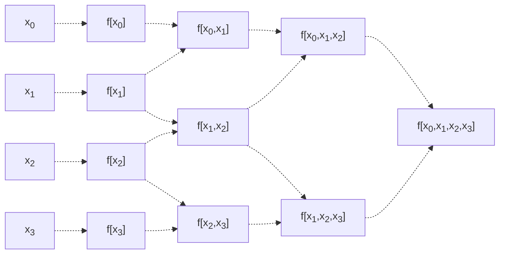

# Interpolation and Polynomial Approximations
## Motivation
Consider a function $f(x)$ defined along the interval $[a,b]$. While we may be able to calculate it by hand, in practice, computers are unable to calculate all possible types of functions - and in these cases, it's necessary to approximate the function $f(x)$.

A common way to do this is by approximating $f(x)$ using a polynomial
$$
P_n (x) = a_0 + a_1 x + a_2 x^2 + a_3 x_3 + \dots + a_n x^n
$$
As the existence of these polynomials is guaranteed, granted we have continuity (see below).

> [!Abstract] Theorem: Weierstrass Approximation
> If $f$ is a function that is continuous on the interval $[a,b]$, then for any $\epsilon > 0$, there exists a polynomial $P(x)$ such that for all $x \in [a,b]$,
> $$
> | f(x) - P(x) | < \epsilon
> $$
> In other words, there exists a polynomial that can become infitesminally close to our function $f(x)$.

One of the most popular polynomial approximations out there is the **Taylor Series approximation**. 

Supposing that $f$ is differentiable $n$ times, then its Taylor Series approximation about $x_0$ is given as 
$$
f(x) \approx P_n (x) = f(x_0) + f'(x_0) (x - x_0) + \dots + f^n (x_0) \frac{(x - x_0)^n}{n!}
$$

This approximation is good, but is typically only used for error estimation, as it has a few issues.
- This approximation requires $f$ to be differentiable $n$-times, limiting the functions we can approximate.
- This approximation is only good for approximations around $x_0$!

Below, we explore alternative, more practical ways to approximate $f$.

## The Interpolation Problem
### The Interpolation Property
One way we can approximate functions is by using **interpolation**.

Given $(n + 1)$ distinct nodes $\{x_i\}_{i=0}^n$ along the function's domain, interpolation aims to find a polynomial $P_n(x)$ such that for all $0 \le i \le n$,
$$
P_n (x_i) = f(x_i)
$$
In other words, the polynomial guarantees equality at all points $x_i$, and approximates the function elsewhere. Such a function is said to satisfy the **interpolation property**.

This polynomial must have the minimum degree needed to achieve this. This gives us some notion of uniqueness for interpolating polynomials - otherwise, without this restriction, we could construct infinitely many polynomials that interpolate $f$.
> We typically want to minimize our degree, so we can minimize error with our approximation.

> [!Example]+ Example: Non-Uniqueness of Interpolators
> Let $P_n (x)$ have the interpolating property. Then, we can create a polynomial of higher degree with the same interpolating property.
> $$
> Q_n (x) = P_n (x) + \prod_{i=0}^n (x - x_i)^{v_i} \qquad v_i \ge 1
> $$
>
> This argument could be repeatedly applied to obtain higher and higher degrees!

The following theorem sets an upper bound on the degree needed for such a polynomial.

> [!Abstract] Theorem: Interpolation - Maximum Degree Needed
> If $\{x_i\}_{i=0}^n$ are $(n + 1)$ distinct nodes, then for any set of $(n + 1)$ values $f(x_0), f(x_1), \dots f(x_n)$, there exists a **unique** polynomial $P_n(x)$ with degree $\le n$ such that the interpolation property holds.

How can we explicitly construct such polynomials?

### Lagrange Interpolating Polynomials
One way we can explicitly construct such polynomials is by using the **Lagrange Interpolating Polynomial**.

Suppose we have $\{ x_i \}_{i=0}^n$ distinct nodes. Then, for any $0 \le j \le n$, define the polynomial
$$
l_j (x) = \frac{(x - x_0) (x - x_1) \dots (x - x_{j-1}) (x - x_{j+1}) \dots (x - x_n)}{(x_j - x_0) (x_j - x_1) \dots (x_j - x_{j - 1}) (x_j - x_{j + 1}) \dots (x_j - x_n)}
$$
> Note how we don't include the $(x - x_j)$ and $(x_j - x_j)$ terms.

By this definition, we know that given any $l_j$ polynomial, called the **basis polynomials**, for any $0 \le i \le n$,
$$
l_j (x) = 
\begin{cases}
    0 & i \ne j \\
    1 & i = j
\end{cases}
$$
And furthermore, the degree of each $l_j$ polynomial is $n$.

Summing the $l_j$ polynomials, we can obtain the **Lagrange Polynomial**.
$$
P_n (x) = \sum_{j=0}^n f(x_j) l_j (x)
$$
Which, by property of the basis functions, is guaranteed to be equal to $f(x_j)$ at $x = x_j$ (all other basis functions will drop to 0 except the $l_j$ function).

> [!Example]+ Example: Lagrange Interpolating Polynomials 
> Let $x_0 = 2, x_1 = 3, x_2 = 5$, and let $f = 1/n$. We find
> $$
> f(x_0) = \frac{1}{2} \qquad f(x_1) = \frac{1}{3} \qquad f(x_2) = \frac{1}{5}
> $$
> 
> We first determine each $l_j$ polynomial.
> $$
> \begin{align*}
>     &l_0 (x) = \frac{(x - 3) (x - 5)}{(2 - 3) (3 - 5)} = \frac{1}{3} (x^2 - 8x + 15) \\
>     &l_1 (x) = \frac{(x - 2) (x - 5)}{(3 - 2) (3 - 5)} = -\frac{1}{2} (x^2 - 7x + 10) \\
>     &l_2 (x) = \frac{(x - 2) (x - 3)}{(5 - 2) (5 - 3)} = \frac{1}{6} (x^2 - 5x + 6) 
> \end{align*}
> $$
> 
> We use these to create our Lagrange Polynomial.
> $$
> \begin{align*}
> P_3 (x) 
> &= \frac{1}{6} (x^2 - 8x + 15) - \frac{1}{6} (x^2 - 7x + 10) + \frac{1}{30} (x^2 - 5x + 6) \\
> &= \frac{1}{30} (x^2 - 10x + 31)
> \end{align*}
> $$

> [!Info] Lagrange Form Benefits
> The Lagrange Form can particularly be useful if we have the same fixed points $\{x_i\}_{i=0}^{n+1}$ for different $f$'s, as our basis functions remain the same! This will avoid computational costs
> > Compare this with Newton's Form (later), where we'd have to recalculate all the divided differences.

### Newton's Form of Interpolation
Another way we can explicitly construct such polynomials is by using **Newton's Form of Interpolation**. 

This method attempts to find the polynomial in the form
$$
P_n (x) = a_0 + a_1 (x - x_0) + x_2 (x - x_0) (x - x_1) + \dots + a_n \prod_{j=0}^{n-1} (x - x_j)
$$
Where $a_0 \dots a_n$ are constants we are attempting to find.

Suppose we have $\{ x_i \}_{i=0}^n$ distinct nodes. Then, we define the **$k^{th}$ divided difference of $f$**.
- The **zeroth divided difference** of $f$ at $x_i$ is
  $$
  f[x_i] = f(x_i) 
  $$
- The **first divided difference** of $f$ at $x_i, x_{i + 1}$ uses the zeroth divided difference.
  $$
  f[x_i, x_{i + 1}] = \frac{f[x_{i+1}] - f[x_i]}{x_{i+1} - x_i} = \frac{f(x_{i+1}) - f(x_i)}{x_{i+1} - x_i}
  $$
- The **second divided difference** of $f$ at $x_i, x_{i + 1}, x_{i + 2}$ uses the first divided difference.
  $$
  f[x_i, x_{i+1}, x_{i+2}] = \frac{f[x_{i+1}, x_{i+2}] - f[x_i, x_{i+1}]}{x_{i+2} - x_i}
  $$
- The **$k^{th}$ divided difference** of $f$ at $x_i, x_{i+1}, \dots x_{i + k}$ uses the $(k-1)^{th}$ divided difference.
  $$
  f[x_i, x_{i+1}, \dots x_{i + k}] = \frac{f[x_{i+1}, x_{i+2}, \dots x_{i+k}] - f[x_{i}, x_{i+1}, \dots x_{i+k-1}]}{x_{i+k} - x_i}
  $$

The below diagram illustrates how we would calculate the $4^{th}$ divided difference on $x_0, x_1, x_2, x_3$.

These divided differences become our coefficients! Using $x = x_k$, we can find our coefficient as
$$
a_k = f[x_0, x_1, \dots x_k]
$$
Giving us polynomial
$$
P_n (x) = f[x_0] + \sum_{k=1}^n \left( f[x_0, \dots x_k] \cdot \prod_{j=0}^{k-1} (x - x_j) \right)
$$
> Note that by our above uniqueness theorem, the polynomial obtained here should be the same as the Lagrange Polynomial.

> [!Abstract] Theorem: Divided Differences and Permutations
> If $y_0, y_2, \dots y_k$ is any permutation of our points $x_0, x_1, \dots x_k$, then their divided differences are the same.
> $$
> f[y_0, y_1, \dots y_k] = f[x_0, x_1, \dots x_k]
> $$

> [!Example]+ Example: Newton's Interpolation
> Let $x_0 = 2, x_1 = 3, x_2 = 5$, and let $f = 1/n$. We find
> $$
> f(x_0) = \frac{1}{2} \qquad f(x_1) = \frac{1}{3} \qquad f(x_2) = \frac{1}{5}
> $$
> We find our divided differences.
> $$
> \begin{align*}
>     &f[x_0] = f(x_0) = 1/2 \\
>     &f[x_1] = f(x_1) = 1/3 \\
>     &f[x_2] = f(x_2) = 1/5 \\
>     &f[x_0, x_1] = \frac{1/3 - 1/2}{3 - 2} = -1/6 \\
>     &f[x_1, x_2] = \frac{1/5 - 1/3}{5 - 3} = -1/15 \\
>     &f[x_0, x_1, x_2] = \frac{-1/15 - (-1/6)}{5 - 2} = 1/30
> \end{align*}
> $$
> 
> We now use these differences to find our polynomial.
> $$
> \begin{align*}
>     P_3(x) 
>     &= f[x_0] + f[x_0, x_1] (x - x_0) + f[x_0, x_1, x_2] (x - x_0) (x - x_1) \\
>     &= \frac{1}{2} - \frac{1}{6} (x - 2) + \frac{1}{30} (x - 2) (x - 3)
> \end{align*}
> $$
> This is equivalent to the polynomial we found using Lagrange's Method!

> [!Info] Newton Form Benefits
> The Newton Form can particularly be useful if we need to add more fixed points for the same $f$. This will keep our divided differences the same, as we can use these already calculated divided differences to easily calculate the extra differences we need!
> > Compare this with Lagrange, where we'd have to recalculate all the basis functions if we add a new node.

## Errors in Interpolation
Let $f$ have $n + 1$ continuous derivatives on some interval $[a,b]$.

Let $P_n(x)$ be the interpolating polynomial at $(n + 1)$ distinct nodes $\{x_i\}_{i=0}^n$. Then, for all $x \in [a,b]$, there exists an error $\delta(x)$ such that
$$
f(x) - P_n(x) = f^{n+1} (\delta(x)) \frac{\prod_{j=0}^n (x - x_j)}{(n+1)!}
$$

We prove this fact below.

> [!Note] Proof
> Let $x \in [a,b]$. 
> 
> Suppose $x$ is one of the interpolating nodes. Then, we are done.
> 
> Suppose $x$ is not one of the interpolating nodes. Define
> $$
> w(y) = \prod_{j=0}^n (y - x_j)
> $$
> Which has degree $n + 1$, with leading term $1 \cdot y^{n+1}$.
> 
> We use this to define the function with $n + 1$ continuous derivatives
> $$
> F(y) = f(y) + P_n(y) - \lambda w(y)
> $$
> 
> Where $\lambda$ is chosen such that $F(x) = 0$.
> $$
> \lambda = \frac{f(x) - P_n(x)}{w(x)}
> $$
> > We know that because $x$ is not an interpolating node, $\lambda$ is defined.
> 
> Because of this, we know that $F(x) = 0$, and $F(x_i) = 0$ as well as all terms drop to 0! So, $F$ drops to 0 at $x, x_0, x_1, \dots x_n$.
> 
> Without loss of generalization, assume $x, x_0, x_1, \dots x_n$ are ordered. Then, by Rolle's theorem, there must exist points between each consecutive pair such that $F'(x) = 0$ - in other words, there are $(n + 1)$ distinct nodes where $F'$ will drop to 0. 
> - Reapplying Rolle's theorem, there must be $n$ distinct nodes where $F''$ will drop to 0.
> - Reapplying Rolle's theorem, there must be $(n - 1)$ distinct nodes with $F'''$ will drop to 0.
> - ...
> 
> Continuing this way, we find that $F^{n+1} = 0$ at some point, which we'll call $\delta(x)$.
> $$
> \begin{align*}
> F^{n+1} ( \delta(x) ) 
> &= f^{n+1}(\delta(x)) - P_n^{n+1} (\delta(x)) - \lambda w^{n+1} (x) \\
> &= f^{n+1}(\delta(x)) - 0 - \lambda (n + 1)! \\
> &= f^{n+1}(\delta(x)) - \frac{f(n) - P_n(x)}{w(x)} (n + 1)!
> \end{align*}
> $$
> 
> This can be refactored to obtain the above result. 
