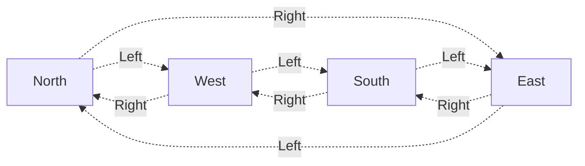
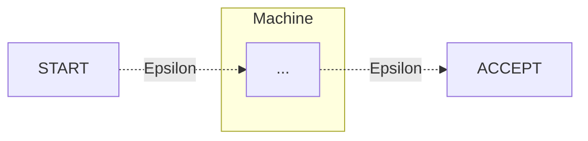
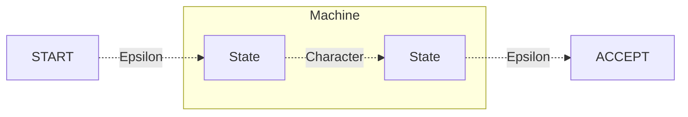
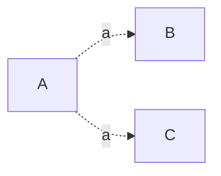
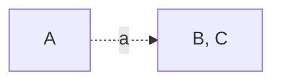
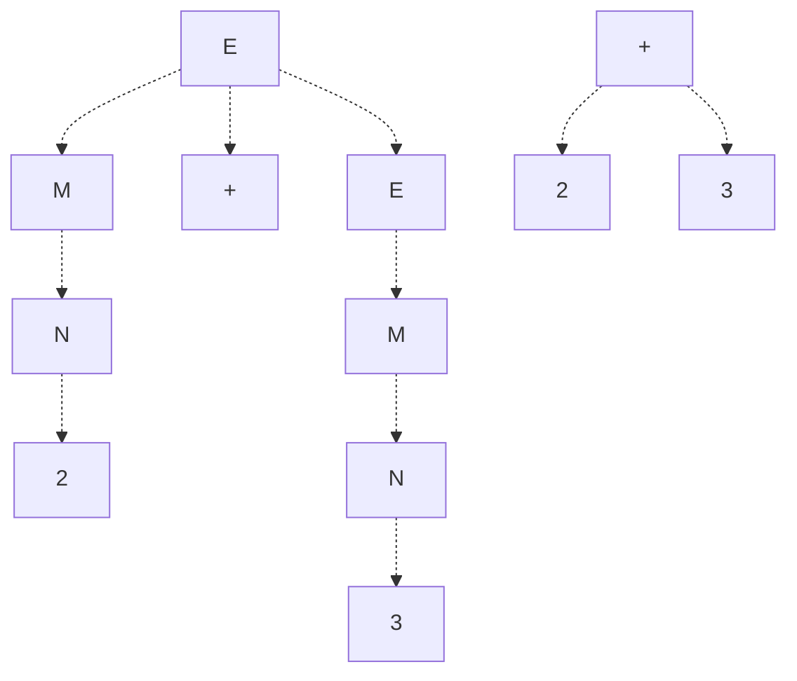

**Automata theory** refers to the study of abstract machines (known as **automata**) and the computational problems they can solve. This theoretical field of computer science is closely intertwined with mathematics, as these automata are derived from mathematical models used for computation.

In automata theory, there are four major families of automata, each able to solve more problems than the last. In order of least to most powerful, they are given as follows:
1. Finite State Machines
2. Pushdown Automata
3. Linear-Bounded Automata
4. Turing Machines

We discuss each of these machines below, starting with Finite State Machines.

# Finite State Machines
All problems have a minimum language set that can be used to solve the problem. In some problems, this minimum language can be given as a finite set of **states**, and **actions**, which can transition between states.

For example, say we want to know which cardinal direction we're facing in given a set of 90 degree turns. Then, we may be able to define the following states and actions:
- Our states can be the cardinal directions, $N, E, S, W$
- To transition between these states, we define left and right 90 degree turns as our actions, denoted $L$ and $R$, respectively.

Using these finite sets of states and actions, we can solve our problem by modeling it as a graph, where states are nodes, and actions are edges connecting nodes.



Thus, given a series of left and right turns, as well as a starting position, we can figure out our final cardinal direction! For example, if we started at North and turned $L, L, R$, we could traverse our graph to find that our final direction is West.

This graph is actually a **finite state machine**! For problems that can be described in a finite number of states and actions, we can create graphs (finite state machines)  which can be traversed through to solve this problem!
> Despite the usefulness of finite state machines, they are limited in the number of problems they solve, as finite state machines only know their current state, as well as the next action to take.
>
> In other words, **finite state machines lack any concept of memory**.

## Regular Expressions
One of the most practical and well-known examples of finite state machines is [[Regular Expressions]]. We can convert any regular expression to a finite state machine, and vice versa - they are essentially interchangeable!

### Model for Regular Expressions
To understand how we can solve regular expressions using finite state machines, we first need to derive a mathematical model for regular expressions. We define each of the regular expression base constructs in mathematical terms below.

We define the **alphabet** as $\sum$, denoting the set of acceptable symbols, and define $L_1$ and $L_2$ as valid sequence of symbols (strings) from this alphabet. We'll additionally define $\sigma$ as the set of any single character from the alphabet, and $\epsilon$ as the set of any empty string.

We define **concatenation** as $L_1 L_2$ where
$$
L_1 L_2 = \{ xy : x \in L_1 \land y \in L_2 \}
$$
For example, if $L_1 = \{a\}, L_2 = \{b\}$, then $L_1 L_2 = \{ab\}$.

We define **union** as $L_1 \cup L_2$ where
$$
L_1 \cup L_2 = \{ x : x \in L_1 \lor x \in L_2 \}
$$
For example, if $L_1 = \{a\}, L_2 = \{b\}$, then $L_1 \cup L_2 = \{a, b\}$.

Finally, we define the **kleene operator** as
$$
L_1^* = \{ x : x \in \varnothing \lor x \in L_1 \lor x \in L_1 L_1 \lor \dots \}
$$
For example, if $L_1 = \{a\}$, then $L_1^* = \{\varnothing, a, aa, aaa, \dots \}$.
> While the number of states and actions in our machine must be finite, the **series of actions** we can take to move throughout the machine can be infinite!

Given these definitions, we can recursively generate any arbitrary set of strings, which can be used to describe a regular expression output.

Thus, given a regular expression, we can recursively define it with the following recursive definition:
$$
\begin{align*}
	R = \; &\epsilon \to \text{Set of Empty String}\\
	&\varnothing \to \text{Empty Set}\\ 
	&\sigma \to \text{Set of Any Single Character} \\
	&R_1 R_2 \to \text{Concatenation of any Set} \\
	&R_1 | R_2 \to \text{The Union of any Set} \\
	&R_1^* \to \text{The Kleene Operator}
\end{align*}
$$

### Implementing Regular Expressions
Using these definitions, we can now create a finite state machine for any given regular expression.

We can represent our regular expression in two different types of finite state machines: deterministic and non-deterministic.
- **Deterministic Finite State Machine (DFA)**: Finite state machines where for any given stage and action taken, there is only one possible path. 
- **Non-Deterministic Finite State Machine (NFA)**: Finite state machines where for any given stage and action taken, there may be multiple paths available to take.

> DFAs are easier to evaluate for a string match, but NFAs are easier to build! Thus, we will first build our regular expression into an NFA, and then convert this NFA into a DFA machine for evaluation.

Then, for any string $s$, we can use its characters as a "sequence of actions" to traverse through our machine, and check if we end on a "matched" state! 

To **build a non-deterministic finite state machine**, we will use our mathematical definition of a regular expression. We define the following:
- Let `START` denote the starting position of our machine
- Let `ACCEPT` denote the state indicating the string input matches our regular expression.
- Let `Epsilon` ($\epsilon$) be an action representing an empty string - in other words, an action which can always be taken, regardless of our input string.

We want to build a machine between `START` and `ACCEPT`, which will send us to `ACCEPT` (from `START`) given any string matching our  regular expression. Using this machine, we can check if our string $s$ matches, by treating each of its characters as a list of "actions" to take (in order) from `START`, where each "action" tells us the edges we can move along.


> Note that if for any state, the next character in $s$ fails to match any action, our input is `INVALID` and will always fail to `ACCEPT`. 

Let's build our machine.

Starting with our **base case**, say we have any single character $\sigma$. We can build a machine matching this character as so:


Given this base case, we can combine our machines using the concatenate, union, and kleene operators.
1. To **concatenate** two machines together, we can use $\epsilon$ to link the end of one machine to the start of another.
   ```mermaid
   graph LR
      start[START];
      accept[ACCEPT];

      subgraph Machine 1
            n1[...]
      end
      subgraph Machine 2
            n2[...]
      end
      n1 -. Epsilon .-> n2;
      
      start -. Epsilon .-> n1;
      n2 -. Epsilon .-> accept;
   ```
2. To perform the **union** of two machines, we can use $\epsilon$ to go to either machine.
   ```mermaid
   graph LR
      start[START];
      accept[ACCEPT];

      subgraph Machine 1
            n1[...]
      end
      subgraph Machine 2
            n2[...]
      end
      
      start -. Epsilon .-> n1 & n2;
      n1 & n2 -. Epsilon .-> accept;
   ```
3. Finally, to perform the **kleene** operator on a machine, we can use $\epsilon$ to give us the option to traverse the machine again, or skip it altogether.
   ```mermaid
   graph LR
      start[START];
      accept[ACCEPT];

      subgraph Machine
            n1[...]
      end
      
      start -. Epsilon .-> n1;
      n1 -. Epsilon .-> accept;
      accept -. Epsilon .-> start;
      start -. Epsilon .-> accept;
   ```
> Note that while $\epsilon$ allows us to very conveniently define these operators, it by its very nature creates non-determinism!

Using these operators and the base case, we can build any regular expression into a NFA! Some examples are given below.
> Note that we can express an NFA with a list of nodes $Q$, a starting node $q \in Q$, and list of accept nodes $F$, and a set of edges (actions) $\bar{o}$!


> [!Example]- Example: Building a NFA
> Say we have regular expression `"/ab|cd/"`. How can we create a finite state machine for this?
>
> ```mermaid
> graph LR
>       subgraph ab
>                subgraph a
>                      a1[A Start] -. a .-> a2[A End];
>                end
>                subgraph b
>                      b1[B Start] -. b .-> b2[B End];
>                end
>                a2 -. Epsilon .-> b1;
>       end
>
>       subgraph cd
>                subgraph c
>                         c1[C Start] -. c .-> c2[C End];
>                end
>                subgraph d
>                         d1[D Start] -. d .-> d2[D End];
>                end
>                c2 -. Epsilon .-> d1;
>       end
>
>       s[START] -. Epsilon .-> a1 & c1;
>       d2 & b2 -. Epsilon .-> e[ACCEPT];
> ```

> [!Example]- Example: Building a NFA (2)
> Say we have regular expression `"/(a|b)*/"`. How can we create a finite state machine for this?
>
> ```mermaid
> graph LR
>       subgraph a
>                a1[A Start] -. a .-> a2[A End];
>       end
>       subgraph b
>                b1[B Start] -. b .-> b2[B End];
>       end
>
>       start[START];
>       accept[ACCEPT];
>
>       start -. Epsilon .-> a1 & b1;
>       a2 & b2 -. Epsilon .-> accept;
>       start -. Epsilon .-> accept -. Epsilon .-> start;
> ```

Now that we have a NFA for our regular expression, we want to be able to convert it to a DFA for evaluation, as evaluating NFAs can be slow (due to their non-deterministic nature).

To perform this conversion, we need to capture the "uncertainty" at any given state, and remove it, but how do we do this? Consider the following NFA:



Given action `a` at state $A$, we aren't sure whether to go to B or C! However, what if we went to a state representing both?



This removes the "uncertainty" from our NFA, as now, for action `a` at node $A$, we only have one possible node we can go to!

This is the key idea behind converting from a NFA to a DFA - we can remove "uncertainty" of multiple paths by combining all possible paths we can move through into one! To do this, we will use two operations:
- A `move(state, action)` operation, which will give us a list of all states we can reach from an initial state and action. Conceptually, this gives us a grouping of states (which we'll combine as a single node) that our path will point to.
- An `e_closure(state)` operation, which will give us a list of all states we can reach using purely epsilon transitions. Conceptually, this gives us a list of states that our state is "equivalent" to, as they can be epsilon transitioned to at no cost.

Note that combining uncertain paths will yield a new node which represents multiple states at once, which we'll have to account for.
> For example, if we take an action from a node representing multiple states, we will have to union the result of `move(state, action)` for all states the node represents!

Using these operations, we can convert our NFA to a DFA by doing the following. Let us start with an NFA with states $Q$, actions (edges $E$, and accept states $F$.

First, take our starting state $S_0$. Perform an epsilon closure (`e_closure`) on our starting state, and let this be our starting node $N_0$. Then, for every subsequent $N$ starting from our start:
1. For every action $A$ we can perform, call `move(S, A)` with every state $S$ the node represents, and union the results to obtain all states we can move to with this action, from $N$.

2. Epsilon close our result by calling `e_closure()`, to obtain all possible states we can move to (factoring in epsilon transitions) with our action.

3. Check if this group of states already exists somewhere as a node in the graph. If it does not, create a new node representing this group. Create an edge from our node $N$ to this new node, with the action being our previously mentioned action $A$.

4. For any newly created node, recursively call this function on these nodes to build the rest of the graph.

Finally, mark any node that contains an accept state as an accept node.

One deep dive example of this algorithm is given below.

> [!Example]- Example: NFA to DFA (Deep Dive)
> Convert the following NFA to a DFA.
> ```mermaid
> graph LR
>       0[START] -. a, b .-> 0;
>       1 -. Epsilon .-> 2;
>       0 -. a .-> 1 -. b .-> 2 -. b .-> 3[ACCEPT];
>       2-. Epsilon .-> 1;
> ```
>
> We start with `START`. Because `START` has no epsilon transitions, our starting node will only represent `START`.
>
> ```mermaid
> graph LR
>       0[START];
> ```
> 
> Now, we go through each possible action from `START` and find what states these actions can go to.
> - Taking action `a`, we can move to states `START` and `1`, giving us a group [`START`, `1`].
> - Taking action `b`, we can move to states `START`, giving us group [`START`].
>
> We now apply epsilon closure on these groups to include any states we can traverse to (with no cost) using epsilon transitions. This will transform [`START`, `1`] into [`START`, `1`, `2`]. Because there is no node for [`START`, `1`, `2`], we create one and make a recursive call on it.
> 
> ```mermaid
> graph LR
>       0[START];
>       0 -. a .-> 1[START, 1, 2];
>       0 -. b .-> 0;
> ```
>
> We now go through every possible action for node [`START`, `1`, `2`] and find what states we can go to with these actions.
> - Taking action `a`, we see that `START` can go to `START`, and `1` and `2` cannot go anywhere, giving us group [`START`].
> - Taking action `b`, we see that `START` can go to `START`, and `1` can go to `2`, giving us group [`2`].
>
> Applying epsilon closure on these groups, we obtain [`START`], and [`1`, `2`] as there is an epsilon transition from nodes `2` to `1`. Because there is no node for [`1`,`2`], we create one and make a recursive call on it.
>
> ```mermaid
> graph LR
>       0[START];
>       0 -. a .-> 1[START, 1, 2];
>       0 -. b .-> 0;
>
>       1 -. a .-> 0;
>       1 -. b .-> 2[1,2];
> ```
>
> We repeat the same process for [`1`, `2`].
> 1. For action `a`, we get no group.
> 2. For action `b`, we get [`2`, `ACCEPT`].
>
> Applying epsilon closure on these groups, we obtain [`1`, `2`, `ACCEPT`]. Because we create a node for [`1`, `2`, `ACCEPT`], we repeat the algorithm with this node.
>
> ```mermaid
> graph LR
>       0[START];
>       0 -. a .-> 1[START, 1, 2];
>       0 -. b .-> 0;
>
>       1 -. a .-> 0;
>       1 -. b .-> 2[1,2];
>
>       2 -. b .-> 3[1, 2, ACCEPT];
> ```
>
> We repeat the same process for [`1`, `2`, `ACCEPT`].
> - For action `a`, we get no group.
> - For action `b`, we get [`2`, `ACCEPT`]. Applying epsilon closure, we obtain [`1`, `2`, `ACCEPT`].
>
> ```mermaid
> graph LR
>       0[START];
>       0 -. a .-> 1[START, 1, 2];
>       0 -. b .-> 0;
>
>       1 -. a .-> 0;
>       1 -. b .-> 2[1,2];
>
>       2 -. b .-> 3[1, 2, ACCEPT] -. b .-> 3;
> ```
>
> Finally, we mark our starting state, accept states, and rename the rest!
>
> ```mermaid
> graph LR
>       0[START];
>       0 -. a .-> 1;
>       0 -. b .-> 0;
>
>       1 -. a .-> 0;
>       1 -. b .-> 2;
>
>       2 -. b .-> 3[ACCEPT] -. b .-> 3;
> ```
>
> We are done! Note that both of the graphs return the same results. Using this DFA, we can now use any regular expression to traverse a graph, and see if it matches!


# Pushdown Automata
While finite state machines can be used for a variety of purposes, they are restricted in the type of problems they can solve, due to their lack of memory.

The next family of machines, **pushdown automata** addresses this by introducing the concept of a stack. While we will not discuss the generalized use case for pushdown automata, we will discuss one specific use case, in **context free grammars**.

## Context Free Grammars
Suppose we have some sort of language, and an expression created using this language. Using finite state machines and regular expressions, we can guarantee that all words and symbols in the expression are correct by themselves, but how do we know that they are correct together?
> One possible application of this is in building a compiler, as it needs to ensure that code is syntactically correct!

In other words, given an expression, **how do we know that it is grammatically correct**? Well, we can do this using a **context free grammar**! 

### Model for Context Free Grammars
First, let's discuss what a **context free grammar** is. A context free grammar is a set of **production rules**, where each rule is given as
$$
S \to E
$$
where $S$ denotes a **non-terminal**, some symbol that stands as a placeholder of another, and $E$ denotes an expression of other non-terminals as well as base symbols called **terminals**.

> [!Example]+ Example: Regular Expressions
> Recall our definition for regular expressoions. Note that this definition is actually a definition of a context free grammar!
> $$
> \begin{align*}
> R \to \; &\epsilon \\
>       &\sigma \in \sum \\
>       &RR \\
>       &R \vert R \\
>       &R*
> \end{align*}
> $$
>
> Here, our non-terminals are $R$, our terminals are $\epsilon, \sigma, *, \vert$, and our production rules are specified by any expression following the arrow operator ($R \to \dots$).
>
> These production rules specify restrictions that must hold true in order for a expression to be valid. For example, we know the regular expression $a*$ is valid as it satisfies $R*$, but $|ab$ is not invalid as it fails to satisfy $R|R$.

To use a context free grammar to determine if an expression is gramatically correct, we go through a process known as **derivation**. In other words, starting from a non-terminal, we will attempt to form the expression using our production rules. During the process of derivation, we define the following:
- **Expanding**: The process of converting a non-terminal into a combination of other non-terminals.
- **Defining**: The process of converting a non-terminal into a terminal.

> Typically in a context free grammar, we will start from the non-terminal specified in the first production rule.

When deriving we will typically operate on non-terminals in order of leftmost to rightmost non-terminals. This is known as **leftmost derivation**. See the below examples for how to perform derivations using context free grammars.

> [!Example]+ Example: Derivation
> Recall the above definition of regular expressions. Show that the string `a*` is valid.
>
> Starting from the first non-terminal $R$, we will apply our production rules for $R$ until we obtain `a*`.
> $$
> R \to R* \to a*
> $$

> [!Example]+ Example: Derivation (2)
> Suppose we have a grammar defined as
> $$
> E \to E + E \mid n, n \in \mathbb{Z}
> $$
>
> Show that $1 + 2 + 3$ is valid.
>
> We can show that $1 + 2 + 3$ is valid with the following derivation.
> $$
> E \to E + E \to 1 + E \to 1 + E + E \to 1 + 2 + E \to 1 + 2 + 3
> $$

> Note in the above examples, we use derivation with the recursively defined rules to build specific terminal sequences that match our desired expression.

Notice how we cannot derive anything invalid! In other words, as long as we can match our expression with the derivation, we guarantee that our expression is valid!

Additionally, note that in the second example, we can also derive it as
$$
E \to E + E \to E + E + E \to 1 + E + E \to 1 + 2 + E \to 1 + 2 + 3
$$
As there are multiple ways to obtain the same result, we say that there is **ambiguity** in the leftmost derivation. While ambiguity may not matter in this particular case, it may in the future, when we use context free grammars to create parsing trees (as the ambiguity can affect the order of operations).

We can remove this ambiguity by smartly defining our production rules to remove any ambiguous cases.

> [!Example]+ Example: Context Free Grammar (with Precedence)
> Consider the following context free grammar:
> $$
> \begin{align*}
>    &E \to M + E \vert M \\
>    &M \to N * M \vert N \\
>    &N \to 1 \vert 2 \vert 3
> \end{align*}
> $$
> Note that by the way we define this grammar, we naturally have an order of operations. We do this by ensuring our non-terminal cannot define itself more than once, removing any ambiguity.
>
> We have non-terminals $E, M, N$, and terminals $+, 1, 2, 3$. Now say we want to use this grammar to derive $1 * 2 + 3$. We can do it as so:
>
> $$
> \begin{align*}
>       E &\to M + E \to N * M + E \to 1 * M + E \\
>         &\to 1 * N + E \to 1 * 2 + E \to 1 * 2 + M \\
>         &\to 1 * 2 + N \to 1 * 2 + 3
> \end{align*}
> $$

### Applying CFGs: Simple Calculator
Now that we understand what a context free grammar is, let's see how we can actually apply it with regular expressions, to make meaning from languages.

Say we want to build a calculator which can evaluate the expressions `+`, `-`, `*`, and `/`, keeping in mind parentheses, given a mathematical expression string $S$. To do this, we will need to go through the following stages:
1. **Lexing**: We take $S$, ensure all symbols in $S$ are valid, and split the string by its symbols (sometimes called tokens). This is often done with regular expressions.
2. **Parsing**: We ensure that the structure of the symbols in $S$ are syntactically valid, and return a data structure which can be used for evaluation (commonly a tree). This is often done with context free grammars.
3. **Evaluating**: We evaluate the tree to derive meaning from the expression.

Let's start with a recursive definition for mathematical expressions. An expression $E$ is a mathematical expression if it adheres to the following definition:
$$
\begin{align*}
        &E \to M + E \mid M - E \mid M \\
        &M \to N * M \mid N / M \mid N \\
        &N \to n \mid (E)
\end{align*}
$$

Note that in this definition, we have the terminals $+,-,*,/,(,)$, and any number $n$. These are the only symbols that should be accepted in our expression, and we will use this fact to build our lexer.

```python
import re # regular expression module

# Lexer: Check that all symbols are valid
# Returns a list of tokens which will later be used in parsing.
def lexer(string):
    # All accepted tokens in the expression 
    valid_tokens = re.compile(r"^([+-/*()]|-?[0-9]+)")

    # Token list
    token_list = []
    pos = 0

    # Iterate through expression and build token list
    while pos < len(string):
          # Attempt to match with regex. If match fails, we have an
          # invalid symbol.
          match = re.match(valid_tokens, string[pos:])

          if match:
             token_list.append(match.group(1))
             pos += len(match.group(1))
          else:
             raise Exception("Invalid Symbol")
            
    return token_list
```

Our lexer will check that all symbols in our expression are valid, and give us a list of tokens! We now want to make sure our expression is syntactically valid, using a parser.

There are several parsers that can exist, including:
- Left Leaning and Right Leaning Parsers
- Look Ahead Parsers
- Backtracking Parsers
- Recursive Descent
- Bottom-Up Parsers

For our purposes, we will implement a **left leaning, look ahead by 1 via recursive descent (LL1) parser**. These parsers are powerful, yet they are restricted in that they cannot parse ambiguous grammars.

We want our parser to build a **parse tree**, which is a tree built directly from the grammar, including all non-terminal derivations. However, it's often the case (to help with evaluation later) that we want an **abstract syntax tree** instead, where we compress and remove all our non-terminals with the leaf terminals.

Refer to the below example with the parse tree (left) and the abstract syntax tree (right), for the same expression $2 + 3$.



To build our abstract syntax tree, let's define the following class, which defines a tree structure where the nodes are either operands or numbers.

```python
class Node:
      def __init__(self, value, t, left, right):
          self.type = t # represents if the node is an operand, or a number

          self.left = left
          self.right = right
          self.value = value
```

Then, we will build a parser to build this tree. To build a parser, we can take advantage of the recursive definition of our mathematical expression.

> [!Example] Example: Building a Parser
> Suppose we have expression that matches $M + E$. We can build an operation note with value $+$, and then recursively make calls on the $M$ and $E$ subtrees!

We can repeat this process for all non-terminals, to build a parser.

```python
# Parser: Takes a token list, and returns an abstract
# syntax tree for evaluation.
def parser(token_list):
    # We will always start from the E non-terminal
    tree = parse_E(token_list)

    # Check for edge case: tokens are left over after
    # finding a valid sequence
    if token_list == []:
       return tree
    else:
        raise SyntaxError("Leftover Tokens")

# Parse E:
# Recursively parses a subtree representing
# the non-terminal E
def parse_E(token_list):
    # The grammar allows M + E, M - E, M. After parsing M,
    # our token list should have nothing, or a (+ E), or a (- E)
    mtree = parse_M(token_list)

    if len(token_list) > 0 and token_list[0] in ["+", "-"]:
       op = token_list.pop(0)
       etree = parse_E(token_list)
       return Node(op, "op", mtree, etree)
    else:
        return mtree

# Parse M:
# Recursively parses a subtree representing
# the non-terminal M
def parse_M(token_list):
    # The grammar allows N * M, N / M, N. After parsing N,
    # our token list should have nothing, or a (* M), or a (/ M)
    ntree = parse_N(token_list)
 
    if len(token_list) > 0 and token_list[0] in ["*", "/"]:
       op = token_list.pop(0)
       mtree = parse_M(token_list)
       return Node(op,"op",ntree,mtree)
    else:
       return ntree

# Parse N:
# Recursively parses a subtree representing
# the non-terminal N
def parse_N(token_list):
    # Our grammar allows n or (E).

    # Check for N -> (E)
    if len(token_list) > 0 and token_list[0] == "(":
       token_list.pop(0)
       etree = parse_E(token_list)
 
       if len(token_list) > 0 and token_list[0] == ")":
          token_list.pop(0)
          return etree
       else:
          raise SyntaxError("Invalid tree")
    # Check for N -> n
    else:
       try:
          n = int(token_list[0])
          token_list.pop(0)
          return Node(n,"n",None,None)
       except:
          raise SyntaxError("Invalid tree")
```

Now that we have build an abstract syntax tree using a parser, we can run an **evaluator** on it, to figure out the semantic meaning. We can easily do this by traversing through the tree using a postorder traversal.

```python
def evaluate(tree):
    if tree.type == "op":
       # evaluate left subtree
       leftval = evaluate(tree.left)
       rightval = evaluate(tree.right)
 
       value = None
 
       if tree.value == "+":
          value = leftval + rightval
       elif tree.value == "-":
          value = leftval - rightval
       elif tree.value == "*":
          value = leftval * rightval
       elif tree.value == "/":
          value = leftval / rightval

       return value
    else:
       return tree.value
```

# Turing Machines
Just as finite state machines (and regular expressions) are limited, so too are pushdown automata (and context free gramamrs). While these machines are all limited in what they can do, there exists a theoretical machine that can solve any solveable problem.

This machine is known as the **turing (atomic) machine**. A turing machine must have the following:
1. An infinite number of cells which can store either 0 or 1.
2. A pointer pointing to some cell, which can read from or write to a cell, and move left and right betwen cells.

This, coupled with a finite set of states with directions to manipulate the pointer, can (theoretically) solve any solveable problem!

Unfortunately, turing machines don't exist - it's simply not possible to have an infinite number of cells. However, we can do the next best thing, and simulate these machines! A language that can simulate a turing machine is known as a **turing complete language**.

Below, we discuss the minimal turing complete language that exists, **lambda calculus**.

## Lambda Calculus
**Lambda calculus** is a universal model of computation, that serves as the minimal turing complete language. It consists of expressions which are defined as the following:
$$
\begin{align*}
   e \to \; &x &\text{Variable} \\
         &\lambda x.e &\text{Function Definition} \\
         &ee &\text{Application}
\end{align*}
$$
> Note that because lambda calculus is turing complete, it can (theoretically) be used to solve any solveable problem.

### Derivation and Left Associativity
We can use our definition of a lambda expression to prove that different expressions are valid in the lambda calculus language. The process of recursively applying our definitions on the lambda expression is known as **derivation**.

Consider the following examples

> [!Example]+ Example: Lambda Calculus
> Show that $\lambda x.x$ is accepted by the lambda calculus language.
>
> $$
> e \to \lambda x.e \to \lambda x.x
> $$

> [!Example]+ Example: Lambda Calculus (2)
> Suppose we have string `abc`. Show that it is accepted by the lambda calculus language.
>
> We can show this with the following derivation:
> $$
> \begin{align*}
>       e &\to ee \to ae \\
>         &\to aee \to abe \\
>         &\to abc
> \end{align*}
> $$

Sometimes, however, derivations using our our lambda expression can yield ambiguous results. Consider the following example.

> [!Example]+ Example: Ambiguity of Lambda Expressions
> At the simplest example, consider the expression
> $$
> eee
> $$
>
> We could evaluate this in the other $(ee)e$, or the order $e(ee)$ to obtain the same result. This creates ambiguity!

To address this ambiguity, lambda calculus has a concept of **left associativty**, meaning that for any ambiguous expression, we will always evaluate the leftmost two expressions first. In other words, there will always be an implicity set of parentheses around the 2 left-most expressions.

> [!Example]+ Example: Left Associativity
> Consider the above example. To remove ambiguity, the concept of left associativity tells us to evaluate our expression in the order $(ee)e$ first.

### Alpha Equivalence
Suppose we have two lambda expressions. We say they are **alpha equivalent ($\alpha$-equivalent)** if the two expressions are semantically equivalent - in other words, they both evaluate to the same result!

#### Beta-Reduction and Beta-Normal Form
We can show that two expressions are alpha-equivalent by reducing them, and comparing their most basic forms.

Note that the function definition
$$
\lambda x.e
$$
represents an **anonymous function**, which takes in some parameter $x$ and uses it to return an expression. Any variable supplied after this function is taken as a parameter to the function, meaning we can actually "plug in" this variable input and evaluate our function to reduce our lambda expression.
> Note that the function's expression will be anything after the function definition $(x.)$, up until the end of the lambda expression, or the first valid closed parentheses. Only in this expression will the function's parameter exist and be referenced.

This process of applying an argument to a function is known as **beta-reduction ($\beta$-reduction)**.

> [!Example]+ Example: Beta-Reduction
> Consider the following lambda expression
> $$
> (\lambda x.xyz) a
> $$
>
> We have a function $\lambda x.xyz$ which takes in an input $x$, and returns an output $xyz$. Furthermore, our function is taking the parameter $a$. We can thus $\beta$-reduce our function to become
>
> $$
> (\lambda x.xyz) a \to ayz
> $$

> [!Example]- Example: Beta-Reduction (2)
> Consider the following lamdbda expression
> $$
> (\lambda x . \lambda y . xy) a 
> $$
>
> We can beta reduce it as so:
> $$
> (\lambda x . \lambda y . xy) a \to \lambda y . ay
> $$

By applying beta reduction, we are minimizing the number of **bound variables** in our lambda expression.
- A **bound variable** is a variable that refers to the function's argument (including the function's argument itself)
- A **free variable** is a variable that is not bound.

In the above example, we would say that $x$ is a **bound variable**, and $a, y, z$ are **free variables**.

> [!Example]+ Example: Bound and Free Variables
> Consider the following lambda expression
> $$
> (( \lambda a . \lambda b . cb ) d ) a
> $$
>
> Then, we have
> $$
> \begin{align*}
>       &\text{Bound Variables} &(( \lambda \underline{a} . \lambda \underline{b} . c\underline{b} ) d ) a \\
>       &\text{Free Variables} &(( \lambda a . \lambda b . \underline{c} b ) \underline{d} ) \underline{a}      
> \end{align*}
> $$
> > Note that one of the $a$'s are bound, while the other is free - this is because the free $a$ is outside of the scope of the $\lambda a$ function, so it is not bound to this function.

Note that lambda calculus also has a concept of **variable shadowing**. For example, given the lambda expression $\lambda x . (\lambda x . x) x$, the following variables are bound to one another.
$$
\lambda \underline{x} . (\lambda x . x) \underline{x} \qquad \lambda x . (\lambda \underline{x} . \underline{x}) x
$$
Thus, this expression is actually equivalent to:
$$
\lambda x . (\lambda y . y) x
$$

When a lambda expression can no longer be reduced any further using $\beta$-reduction, we say it is in **beta-normal form ($\beta$-normal form)**. Two lambda expressions that are alpha equivalent should be the same when they're in $\beta$-normal form.

> [!Example]+ Example: Alpha Equivalence
> Suppose we have lambda expressions
> $$
> (\lambda x. \lambda y. xxy) a \qquad \lambda b.aab
> $$
>
> Show that they are alpha equivalent.
>
> Taking our first lambda expression, we beta reduce it to obtain the beta-normal form
> $$
> \begin{align*}
>       &(\lambda x. \lambda y. xxy) a \\
>       \to &\lambda y. aay
> \end{align*}
> $$
>
> Because $y$ stands for any arbitrary variable, we can change it to represent $b$ and obtain $\lambda b.aab$ (this is known as **beta-conversion**). Thus, our two expressions are alpha equivalent!

#### Lazy and Eager Evaluation
Note that when $\beta$-reducing, we have different orders of evaluation. Given a function and its argument, 
- In **call by name (lazy evaluation)**, we choose to plug in our argument into the function before attempting to evaluate it.
- In **call by value (eager evaluation)**, we choose to evaluate our argument to the function before passing it in.

> [!Example]+ Example: Eager vs. Lazy Evaluation
> Consider the lambda expression
> $$
> (\lambda x.y) ( (\lambda a.b) c )
> $$
>
> - If we were to call by name, we would pass in $( (\lambda a.b) c )$ to obtain $y$ with one beta-reduction.
> - If we were to call by value, we would evaluate $( (\lambda a.b) c ) \to b$ first, then pass this into $\lambda x.y$ to obtain $y$ with two beta-reductions.

Evaluating lazy and eager expressions might yield differing results! Consider the following examples.

> [!Example]+ Example: Eager vs. Lazy Evaluation
> Consider the lambda expression
> $$
> (\lambda a.b) ( (\lambda x.xx) (\lambda x.xx) )
> $$
>
> With lazy evaluation, we pass our argument into the function to obtain the output $b$. However, with eager evaluation, our evaluation would never end, as $(\lambda x.xx) (\lambda x.xx)$ evaluates to itself!
>
> Thus, in this example, lazy and eager evaluation will yield differing results. Note that languages like Ocaml use eager evaluation.

> Note that languages like Ocaml perform eager evaluation.

### Church Encodings
Recall that Lambda Calculus can theoretically be used to solve any solveable problem. If this is the case, then it must be possible to use lambda expressions to represent common programming constructs. This is known as an **encoding**.

One common representation for these expressions is known as **church encodings**.

Consider the following subset of the church encodings:

$$
\begin{align*}
        \text{True} &\equiv \lambda x . \lambda y . x \\
        \text{False} &\equiv \lambda x . \lambda y . y \\
        \text{if } a \text{ then } b \text{ else} &\equiv a \; b \; c
\end{align*}
$$

These can be used to represent conditional boolean expressions! Consider the below examples.

> [!Example]+ Example: Church Encodings
> Represent the expression `if true then false else true` in lambda calculus, and evaluate it to obtain a result.
> 
> We convert this expression to church encodings to obtain
> $$
> (\lambda x . \lambda y . \lambda x) (\lambda x . \lambda y . \lambda y) (\lambda x . \lambda y . \lambda x)
> $$
> 
> We will now apply beta-reduction (lazy evaluation) to this expression to obtain a result.
> $$
> \begin{align*}
>         &(\lambda x . \lambda y . \lambda x) (\lambda x . \lambda y . \lambda y) (\lambda x . \lambda y . \lambda x) \\
>         \to &(\lambda x . \lambda y . \lambda y)
> \end{align*}
> $$
> 
> Which represents the result `false`.