**Automata theory** refers to the study of abstract machines (known as an **automata**) and the computational problems they can solve. This theoretical field of computer science is closely intertwined with mathematics, as automata are derived from mathematical models used for computation.

In automata theory, there are four major families of automata, each more powerful (able to solve more problems) than the last.

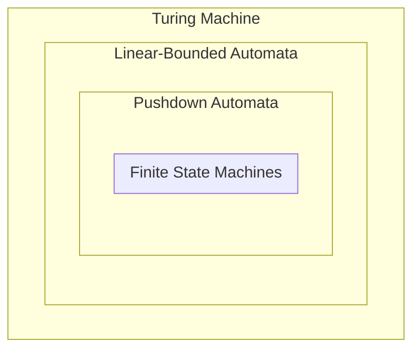

We discuss each of these machines below, starting with Finite State Machines.

# Finite State Machines
All problems have a minimum language set that can be used to solve the problem. In some problems, this minimum language can be given as a finite set of **states**, and

Recall that all problems have a minimum language set that can be used to solve the problem.

While not applicable to all problems, this minimum language

While not not applicable to all problems, sometimes we may have a problem that 
Say we have a problem with a 

Idrk what this is

Given a problem, we may find it convenient to model it in terms of a minimum set of states and actions.

For example, say we want to know what direction we're facing. We have the following states
- N, E, S, W
- Turn right, turn left

We can model this as a graph! Problems that can be represented as a fininte number of states, and finite number of actions that can move between these states are known as **finite state machines**.

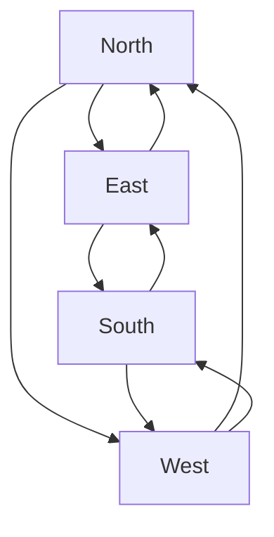

So we have finite state machines, that can solve a certain number of problems. Notice at any time, we have no concept of memory! We only know where we currently are, and where we want to go.

If we add memory to this machine, such as a **stack**, this machine becomes a **pushdown autonomon**. Then, there's a turing machine, which can (theoretically) solve all solveable problems.
> we're going to start from a finite state machine, and work our way up to a turing machine.


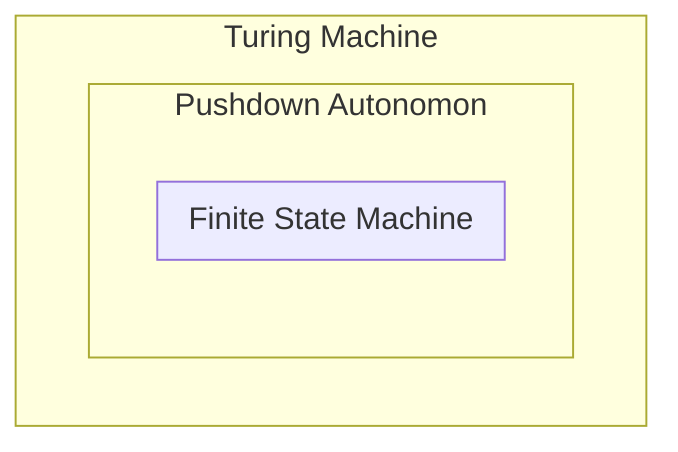

What's important about this is that regular languages can be converted into finite state machines - in other words, they can solve any problem that finite state machines can! Thus, finite state machines and regex are essentially interchangeable.

Let's recall what we need for regex, but in mathematical terms.


[abc][abc]|[abc]

1. An alphabet, denoted by $\sum$, which denotes a set of acceptable symbols.

> Recall that regex descrbes a set of strings (a finite sequence of symbols from the alphabet), called a **language**.

2. Concatenation, rules describing how we can combine our symbols together. Suppose that $L_1$ and $L_2$ are languages, where their concatenation is denoted
   $$ L_1 L_2 = \{ xy : x \in L_1 \land x \in L_2 \} $$
   Then, we should be able to create a new language based on these languages.
   For example, suppose $L_1 = \{ a \}, L_2 = \{ b \}$. Then, $L_1 L_2 = ab$.

3. We also need union. Suppose $L_1$ and $L_2$ are languages. Then their union, mathematically speaking, is given by

$$
L_3 = \{ x : x \in L_1 \lor x \in L_2 \}
$$

For example, say

$$ L_1 = \{'a'\}, L_2 = \{'b'\}, \dots, L_26 = \{'z'\} $$

Then,

$$ \bigcup_{i=1}^{26} L_i = \{ 'a', 'b', \dots, 'z' \} = [a-z] $$

We can use these recursive definitions to solve for our set of strings!


---

Recall that the number of states and actions can be finite, **but the series of actions that we take can be infinite**. The actions that occur on a finite state machine are independent of the states and actions defining the machine!

**Repetition (Kleene Closure)**: Suppose that $L_1$ is a language. Then, the Kleene closure of $L_1$, denoted $L_1^*$, is given as

$$
L_1^* = \{ x : x \in \varnothing \lor x \in L_1 \lor x \in L_1 L_1 \lor \dots \}
$$

Note that the set of any regular expression's strings can be created using these recursive set definitions. Given a set of regular expression strings $R$, we can recursively define it using the following operations:

$$
\begin{align*}
	&\epsilon \to \text{Set of an Empty String}\\
	&\varnothing \to \text{Empty Set}\\ 
	&\sigma \to \text{Set of any Single Character} \\
	&R_1 R_2 \to \text{Concatenation of any Set} \\
	&R_1 | R_2 \to \text{The Union of any Set} \\
	&R_1^* \to \text{The Kleene Operator}
\end{align*}
$$

We can make any string using regular expressions We can put all of these rules together to make a **grammar**

We can now create languages using our regular expressions! Languages created like this are known as **regular languages**.

---


Can we build a machine that can implement regular expressions? In other words, given a regular expression $r$, can we check if it will accept string $s$.

> [!Example] Example: Regular Expression - Finite State Machine
> Suppose we have the regular expression
>
> ```python
> "/[01]+1/"
> ```
>
> To test whether a string `s` matches this regular expression, we can define the set of actions $[0,1]$, and use them to traverse through the finite state machine
>
> ```mermaid
> graph LR
>        st[TRASH];
>        s1[START];
>        s2[State];
>        s3[ACCEPT];
>        s4[State];
>
>        s1 -. 1 .-> s2;
>        s1 -. 0 .-> s2;
>        
>        s2 -. 1 .-> s3;
>        s2 -. 0 .-> s4;
>        
>        s3 -. 1 .-> s3;
>        s3 -. 0 .-> s4;
>        s4 -. 1 .-> s3;
> ```
> 
> Where our string `s` holds the set of actions we use to traverse our machine, and the regular expression matches if any only if we end on the `ACCEPT` state.
> > Sometimes, we will also represent a `TRASH` state, which we'll move to if any invalid action is provided.

So, how do we build these finite state machines from regular expressions?

**Deterministic Finite State Machine**: Finite state machines where for any given stage, we know the possible actions that can be taken.

**Non-Deterministic Finite State Machine**: Finite state machines where for any given stage, we are not sure what stage we may move to given an action.

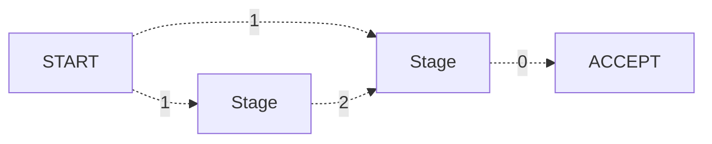
> Non-deterministic state machines are actually easier to build than deterministic state machines, though they're less efficient to traverse! This is because for non-deterministic machines, we need to check every possible path when we don't have a deterministic action.

What we're learn is: every REGEX can be converted into a non-deterministic state machine, every non-deterministic state machine can be converted into a deterministic state machine, and deterministic state machine --> REGEX.

##### How to Build Non-Deterministic State Machine from REGEX
We will use our mathematical model of a REGEx to build our NDA.

Recall that our regular expression $R$ can be defined recursively with
$$
\begin{align*}
	R = &\epsilon \to \text{Set of an Empty String}\\
	&\varnothing \to \text{Empty Set}\\ 
	&\sigma \to \text{Set of any Single Character} \\
	&R_1 R_2 \to \text{Concatenation of any Set} \\
	&R_1 | R_2 \to \text{The Union of any Set} \\
	&R_1^* \to \text{The Kleene Operator}
\end{align*}
$$

Let's start from our base cases. If we have a finite state machine that is the empty set, we have a machine with no accept state - it rejects regardless of what we have.
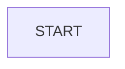

If we have a finite state machine that is the set of an empty string, we have a machine that will always accept.
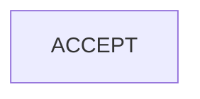

If we have a FSM that only accepts a single character, say, $a$
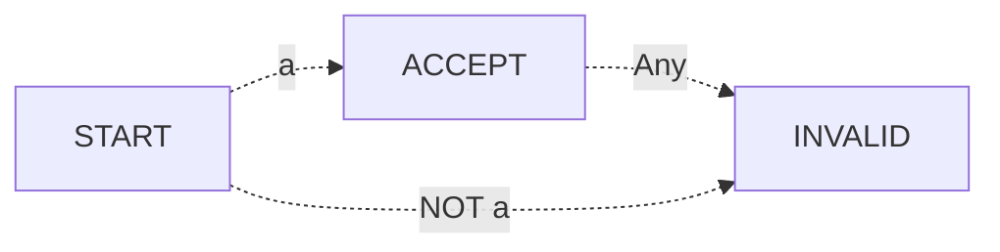

If we want to concatenate two machines together, we can combine the end of one machine to the start of another.
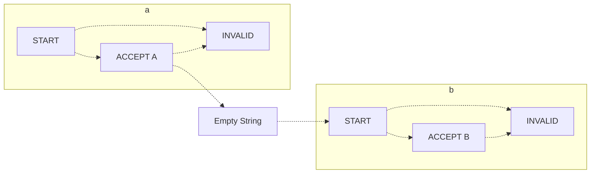
> By combining our two graphs with the epsilon (empty string that "accepts anything"), we can easily combine our machine recursively. However, epsilon definitions add non-determinism!

How could we do the union of $a$ and $b$?
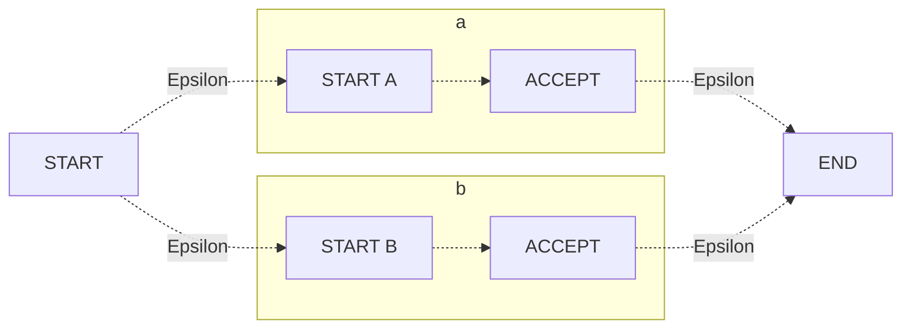
> WE ARE USING EPSILON TO COMBINE MACHINES! Note that because our machine is non-deterministic, we will have to check multiple paths, so there's many ways to get to an acceptance state!

Kleene operator *
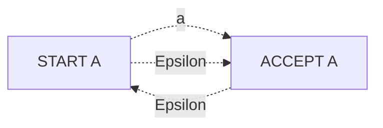
> We need diff start end nodes, which epsilon transition into a.

So, to build our finite state machine, we need an alphabet $\sum$, a list of notes $Q$, a starting node $q \in Q$, a list of yes (VALID) states $F$, and a set of transitions (edges) $\bar{o}$!

For example, we could have
$$ A = (\{a\}, \{1,2\}, 1, \{2\}, [ (1,a,2) ] ) $$
representing the state

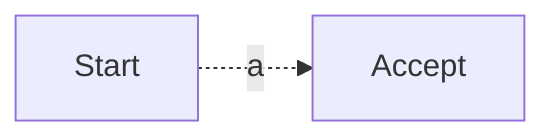
> We can combine this definition with other machines recursively!

Note that while the epsilon transition is not the most efficient way to do this, it provides a convenient way to create regular expressions recursively.

> How can we build these machines from a regular expression?

> [!Example] Example: Building Finite State Machines
> Say we have regular expression `"/ab|cd/"`. How can we create a finite state machine for this?
>
> ```mermaid
> graph LR
>       subgraph ab
>                subgraph a
>                      a1[A Start] -. a .-> a2[A End];
>                end
>                subgraph b
>                      b1[B Start] -. b .-> b2[B End];
>                end
>                a2 -. Epsilon .-> b1;
>       end
>
>       subgraph cd
>                subgraph c
>                         c1[C Start] -. c .-> c2[C End];
>                end
>                subgraph d
>                         d1[D Start] -. d .-> d2[D End];
>                end
>                c2 -. Epsilon .-> d1;
>       end
>
>       s[Start] -. Epsilon .-> a1 & c1;
>       d2 & b2 -. Epsilon .-> e[End];
> ```


> KEY IDEA: regular expression defines our states and actions for our fixed machine. Strings define our sequence of actions to plug into the machine :D and we simply plug this string in and see if we can reach some designated end in the machine!

It's easy to create these, but not easy to evaluate due to the non-determinism (we have to take multiple paths!) So, we'll learn how to convert from non-determinism to determism!!!