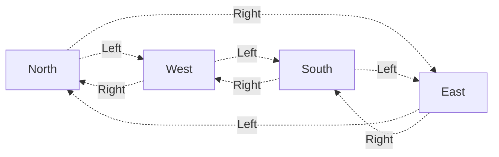

**Automata theory** refers to the study of abstract machines (known as **automata**) and the computational problems they can solve. This theoretical field of computer science is closely intertwined with mathematics, as these automata are derived from mathematical models used for computation.

In automata theory, there are four major families of automata, each able to solve more problems than the last. In order of least to most powerful, they are given as follows:
1. Finite State Machines
2. Pushdown Automata
3. Linear-Bounded Automata
4. Turing Machines

We discuss each of these machines below, starting with Finite State Machines.

# Finite State Machines
All problems have a minimum language set that can be used to solve the problem. In some problems, this minimum language can be given as a finite set of **states**, and **actions**, which can transition between states.

For example, say we want to know which cardinal direction we're facing in given a set of 90 degree turns. Then, we may be able to define the following states and actions:
- Our states can be the cardinal directions, $N, E, S, W$
- To transition between these states, we define left and right 90 degree turns as our actions, denoted $L$ and $R$, respectively.

Using these finite sets of states and actions, we can solve our problem by modeling it as a graph, where states are nodes, and actions are edges connecting nodes.



Thus, given a series of left and right turns, as well as a starting position, we can figure out our final cardinal direction! For example, if we started at North and turned $L, L, R$, we could traverse our graph to find that our final direction is West.

This graph is actually a **finite state machine**! For problems that can be described in a finite number of states and actions, we can create graphs (finite state machines)  which can be traversed through to solve this problem!
> Despite the usefulness of finite state machines, they are limited in the number of problems they solve, as finite state machines only know their current state, as well as the next action to take.
>
> In other words, finite state machines lack any concept of memory.

## Finite State Machines and Regular Expressions
One of the most practical and well-known examples of finite state machines is [[Regular Expressions]]. We can convert any regular expression to a finite state machine, and vice versa - they are essentially interchangeable!

### Mathematical Model for Regular Expressions
To understand how we can solve regular expressions using finite state machines, we first need to derive a mathematical model for regular expressions. We define each of the regular expression base constructs in mathematical terms below.

First, we define the **alphabet** as $\sum$, denoting the set of acceptable symbols, and define $L_1$ and $L_2$ as valid sequence of symbols (strings) from this alphabet. We'll additionally define $\sigma$ as the set of any single character from the alphabet, and $\epsilon$ as the set of any empty string.

We define **concatenation** as $L_1 L_2$ where
$$
L_1 L_2 = \{ xy : x \in L_1 \land x \in L_2 \}
$$
For example, if $L_1 = \{a\}, L_2 = \{b\}$, then $L_1 L_2 = \{ab\}$.

We define **union** as $L_1 \cup L_2$ where
$$
L_1 \cup L_2 = \{ x : x \in L_1 \lor x \in L_2 \}
$$
For example, if $L_1 = \{a\}, L_2 = \{b\}$, then $L_1 \cup L_2 = \{a, b\}$.

Finally, we define the **kleene operator** as
$$
L_1^* = \{ x : x \in \varnothing \lor x \in L_1 \lor x \in L_1 L_1 \lor \dots \}
$$
For example, if $L_1 = \{a\}$, then $L_1^* = \{\varnothing, a, aa, aaa, \dots \}$.
> While the number of states and actions in our machine must be finite, the **series of actions** we can take to move throughout the machine can be infinite!

Given these definitions, we can recursively generate any arbitrary set of strings, which can be used to descrbe a regular expression output.

Thus, given a regular expression, we can recursively define it with the following recursive definition:
$$
\begin{align*}
	R = \; &\epsilon \to \text{Set of an Empty String}\\
	&\varnothing \to \text{Empty Set}\\ 
	&\sigma \to \text{Set of any Single Character} \\
	&R_1 R_2 \to \text{Concatenation of any Set} \\
	&R_1 | R_2 \to \text{The Union of any Set} \\
	&R_1^* \to \text{The Kleene Operator}
\end{align*}
$$

### Finite State Machines for Regular Expressions
Using these definitions, we can now create a finite state machine for any given regular expression.

We can represent our regular expression in two different types of finite state machines: deterministic and non-deterministic.
- **Deterministic Finite State Machine (DFA)**: Finite state machines where for any given stage and action taken, there is only one possible path. 
- **Non-Deterministic Finite State Machine (NFA)**: Finite state machines where for any given stage and action taken, there may be multiple paths available to take.

Then, for any string $s$, we can use its characters as a "sequence of actions" to traverse through our machines, and check if we can end on a "matched" state!
> DFAs are easier to evaluate for a string match, but NFAs are easier to build! Thus, we will first build our regular expression into an NFA, and then convert this NFA into a DFA machine for evaluation.

To build a non-deterministic finite state machine, we will use our mathematical definition of a regular expression. Let `START` denote the starting position of our machine, and `ACCEPT` denote the state indicating the string input matches our regular expression. Furthermore, let $\epsilon$ be an action which can always be taken, regardless of our input string.

We want to build a machine between `START` and `ACCEPT`, which will send us to `ACCEPT` from `START` given a string matching the regular expression.


> Note that if for any state, the next character in $s$ fails to match any action, our input is `INVALID` and will always fail to `ACCEPT`. 

Let's build our machine.

Starting with our **base case**, say we have any single character $\sigma$. We can build a machine matching this character as so:


Given this base case, we can combine our machines using the concatenate, union, and kleene operators.
1. To concatenate two machines together, we can use $\epsilon$ to link the end of one machine to the start of another.
   ```mermaid
   graph LR
      start[START];
      accept[ACCEPT];

      subgraph Machine 1
            n1[...]
      end
      subgraph Machine 2
            n2[...]
      end
      n1 -. Epsilon .-> n2;
      
      start -. Epsilon .-> n1;
      n2 -. Epsilon .-> accept;
   ```
2. To perform the union of two machines, we can use $\epsilon$ to go to either machine.
   ```mermaid
   graph LR
      start[START];
      accept[ACCEPT];

      subgraph Machine 1
            n1[...]
      end
      subgraph Machine 2
            n2[...]
      end
      
      start -. Epsilon .-> n1 & n2;
      n1 & n2 -. Epsilon .-> accept;
   ```
3. Finally, to perform the kleene operator on a machine, we can use $\epsilon$ to give us the option to traverse the machine again, or skip it altogether.
   ```mermaid
   graph LR
      start[START];
      accept[ACCEPT];

      subgraph Machine
            n1[...]
      end
      
      start -. Epsilon .-> n1;
      n1 -. Epsilon .-> accept;
      accept -. Epsilon .-> start;
      start -. Epsilon .-> accept;
   ```
> Note that while $\epsilon$ allows us to very conveniently define these operators, it by its very nature creates non-determinism!

Using these operators and the base case, we can build any regular expression into a NFA! Some examples are given below.
> Note that we can express an NFA with a list of nodes $Q$, a starting node $q \in Q$, and list of accept nodes $F$, and a set of edges (actions) $\bar{o}$!


> [!Example]- Example: Building a NFA
> Say we have regular expression `"/ab|cd/"`. How can we create a finite state machine for this?
>
> ```mermaid
> graph LR
>       subgraph ab
>                subgraph a
>                      a1[A Start] -. a .-> a2[A End];
>                end
>                subgraph b
>                      b1[B Start] -. b .-> b2[B End];
>                end
>                a2 -. Epsilon .-> b1;
>       end
>
>       subgraph cd
>                subgraph c
>                         c1[C Start] -. c .-> c2[C End];
>                end
>                subgraph d
>                         d1[D Start] -. d .-> d2[D End];
>                end
>                c2 -. Epsilon .-> d1;
>       end
>
>       s[START] -. Epsilon .-> a1 & c1;
>       d2 & b2 -. Epsilon .-> e[ACCEPT];
> ```

> [!Example]- Example: Building a NFA (2)
> Say we have regular expression `"/(a|b)*/". How can we create a finite state machine for this?
>
> ```mermaid
> graph LR
>       subgraph a
>                a1[A Start] -. a .-> a2[A End];
>       end
>       subgraph b
>                b1[B Start] -. b .-> b2[B End];
>       end
>
>       start[START];
>       accept[ACCEPT];
>
>       start -. Epsilon .-> a1 & b1;
>       a2 & b2 -. Epsilon .-> accept;
>       start -. Epsilon .-> accept -. Epsilon .-> start;
> ```

##### COMING UP: Converting NFAs to DFAs for Evaluating REGEX