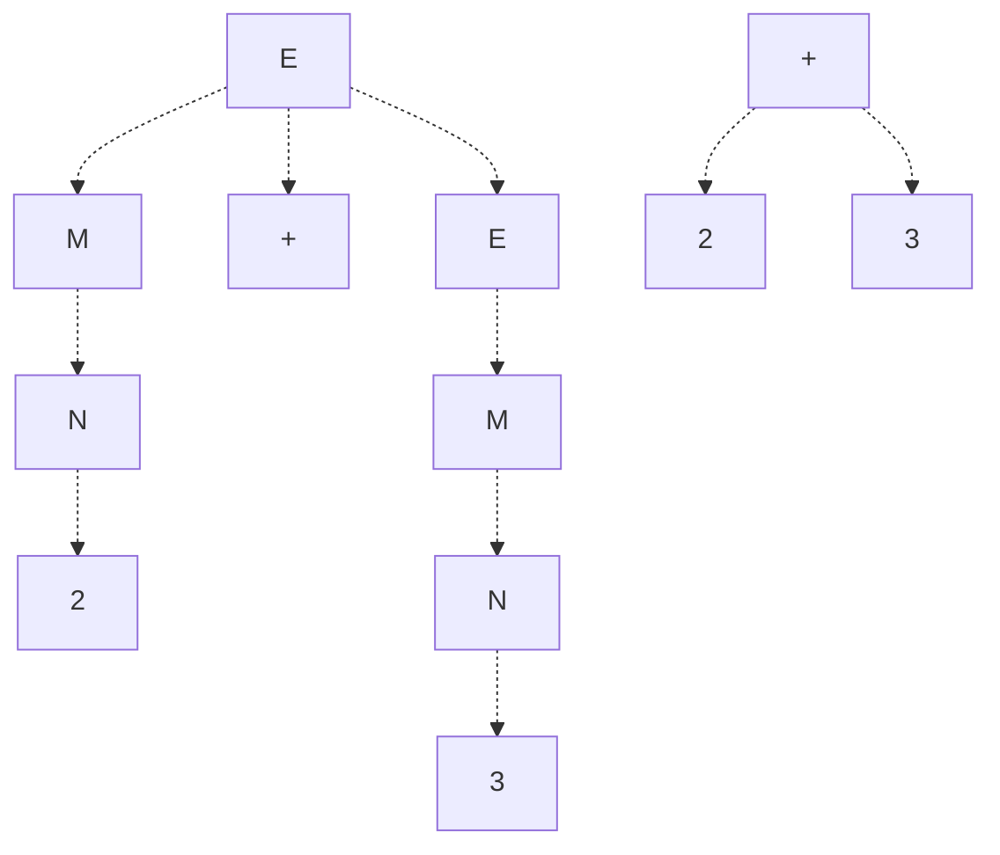

Recall Regular Languages. While they were quite versatile and useful, they were limited in the type of problems they could solve, due to their lack of memory.

**Context Free Languages** address this issue by using memory. While they still cannot solve all problems, they can solve all problems Regular Languages can, and more.

Context free languages are implemented using a machine called **pushdown automata**, and while we will not discuss the generalized use case for pushdown automata, we will discuss one specific use case, in **context free grammars**.

# Context Free Grammars
Suppose we have some sort of language, and an expression created using this language. Using finite state machines and regular expressions, we can guarantee that all words and symbols in the expression are correct by themselves, but how do we know that they are correct together?

In other words, given an expression, **how do we know that it is grammatically correct**? Well, we can do this using a **context free grammar**!
> One possible application of this is in building a compiler, as it needs to ensure that code is syntactically correct!

## Model for Context Free Grammars
First, let's discuss what a **context free grammar** is. A context free grammar is a set of **production rules**, where each rule is given as
$$
S \to E
$$
where $S$ denotes a **non-terminal**, some symbol that stands as a placeholder of another, and $E$ denotes an expression of other non-terminals as well as base symbols called **terminals**.

> [!Example]+ Example: Regular Expressions
> Recall our definition for regular expressoions. Note that this definition is actually a definition of a context free grammar!
> $$
> \begin{align*}
> R \to \; &\epsilon \\
>       &\sigma \in \sum \\
>       &RR \\
>       &R \vert R \\
>       &R*
> \end{align*}
> $$
>
> Here, our non-terminals are $R$, our terminals are $\epsilon, \sigma, *, \vert$, and our production rules are specified by any expression following the arrow operator ($R \to \dots$).
>
> These production rules specify restrictions that must hold true in order for a expression to be valid. For example, we know the regular expression $a*$ is valid as it satisfies $R*$, but $|ab$ is not invalid as it fails to satisfy $R|R$.

To use a context free grammar to determine if an expression is gramatically correct, we go through a process known as **derivation**. In other words, starting from a non-terminal, we will attempt to form the expression using our production rules. During the process of derivation, we define the following:
- **Expanding**: The process of converting a non-terminal into a combination of other non-terminals.
- **Defining**: The process of converting a non-terminal into a terminal.

> Typically in a context free grammar, we will start from the non-terminal specified in the first production rule.

When deriving we will typically operate on non-terminals in order of leftmost to rightmost non-terminals. This is known as **leftmost derivation**. See the below examples for how to perform derivations using context free grammars.

> [!Example]+ Example: Derivation
> Recall the above definition of regular expressions. Show that the string `a*` is valid.
>
> Starting from the first non-terminal $R$, we will apply our production rules for $R$ until we obtain `a*`.
> $$
> R \to R* \to a*
> $$

> [!Example]+ Example: Derivation (2)
> Suppose we have a grammar defined as
> $$
> E \to E + E \mid n, n \in \mathbb{Z}
> $$
>
> Show that $1 + 2 + 3$ is valid.
>
> We can show that $1 + 2 + 3$ is valid with the following derivation.
> $$
> E \to E + E \to 1 + E \to 1 + E + E \to 1 + 2 + E \to 1 + 2 + 3
> $$

> Note in the above examples, we use derivation with the recursively defined rules to build specific terminal sequences that match our desired expression.

Notice how we cannot derive anything invalid! In other words, as long as we can match our expression with the derivation, we guarantee that our expression is valid!

Additionally, note that in the second example, we can also derive it as
$$
E \to E + E \to E + E + E \to 1 + E + E \to 1 + 2 + E \to 1 + 2 + 3
$$
As there are multiple ways to obtain the same result, we say that there is **ambiguity** in the leftmost derivation. While ambiguity may not matter in this particular case, it may in the future, when we use context free grammars to create parsing trees (as the ambiguity can affect the order of operations).

We can remove this ambiguity by smartly defining our production rules to remove any ambiguous cases.

> [!Example]+ Example: Context Free Grammar (with Precedence)
> Consider the following context free grammar:
> $$
> \begin{align*}
>    &E \to M + E \vert M \\
>    &M \to N * M \vert N \\
>    &N \to 1 \vert 2 \vert 3
> \end{align*}
> $$
> Note that by the way we define this grammar, we naturally have an order of operations. We do this by ensuring our non-terminal cannot define itself more than once, removing any ambiguity.
>
> We have non-terminals $E, M, N$, and terminals $+, 1, 2, 3$. Now say we want to use this grammar to derive $1 * 2 + 3$. We can do it as so:
>
> $$
> \begin{align*}
>       E &\to M + E \to N * M + E \to 1 * M + E \\
>         &\to 1 * N + E \to 1 * 2 + E \to 1 * 2 + M \\
>         &\to 1 * 2 + N \to 1 * 2 + 3
> \end{align*}
> $$

### Applying CFGs: Simple Calculator
Now that we understand what a context free grammar is, let's see how we can actually apply it with regular expressions, to make meaning from languages.

Say we want to build a calculator which can evaluate the expressions `+`, `-`, `*`, and `/`, keeping in mind parentheses, given a mathematical expression string $S$. To do this, we will need to go through the following stages:
1. **Lexing**: We take $S$, ensure all symbols in $S$ are valid, and split the string by its symbols (sometimes called tokens). This is often done with regular expressions.
2. **Parsing**: We ensure that the structure of the symbols in $S$ are syntactically valid, and return a data structure which can be used for evaluation (commonly a tree). This is often done with context free grammars.
3. **Evaluating**: We evaluate the tree to derive meaning from the expression.

Let's start with a recursive definition for mathematical expressions. An expression $E$ is a mathematical expression if it adheres to the following definition:
$$
\begin{align*}
        &E \to M + E \mid M - E \mid M \\
        &M \to N * M \mid N / M \mid N \\
        &N \to n \mid (E)
\end{align*}
$$

Note that in this definition, we have the terminals $+,-,*,/,(,)$, and any number $n$. These are the only symbols that should be accepted in our expression, and we will use this fact to build our lexer.

```python
import re # regular expression module

# Lexer: Check that all symbols are valid
# Returns a list of tokens which will later be used in parsing.
def lexer(string):
    # All accepted tokens in the expression 
    valid_tokens = re.compile(r"^([+-/*()]|-?[0-9]+)")

    # Token list
    token_list = []
    pos = 0

    # Iterate through expression and build token list
    while pos < len(string):
          # Attempt to match with regex. If match fails, we have an
          # invalid symbol.
          match = re.match(valid_tokens, string[pos:])

          if match:
             token_list.append(match.group(1))
             pos += len(match.group(1))
          else:
             raise Exception("Invalid Symbol")
            
    return token_list
```

Our lexer will check that all symbols in our expression are valid, and give us a list of tokens! We now want to make sure our expression is syntactically valid, using a parser.

There are several parsers that can exist, including:
- Left Leaning and Right Leaning Parsers
- Look Ahead Parsers
- Backtracking Parsers
- Recursive Descent
- Bottom-Up Parsers

For our purposes, we will implement a **left leaning, look ahead by 1 via recursive descent (LL1) parser**. These parsers are powerful, yet they are restricted in that they cannot parse ambiguous grammars.

We want our parser to build a **parse tree**, which is a tree built directly from the grammar, including all non-terminal derivations. However, it's often the case (to help with evaluation later) that we want an **abstract syntax tree** instead, where we compress and remove all our non-terminals with the leaf terminals.

Refer to the below example with the parse tree (left) and the abstract syntax tree (right), for the same expression $2 + 3$.



To build our abstract syntax tree, let's define the following class, which defines a tree structure where the nodes are either operands or numbers.

```python
class Node:
      def __init__(self, value, t, left, right):
          self.type = t # represents if the node is an operand, or a number

          self.left = left
          self.right = right
          self.value = value
```

Then, we will build a parser to build this tree. To build a parser, we can take advantage of the recursive definition of our mathematical expression.

> [!Example] Example: Building a Parser
> Suppose we have expression that matches $M + E$. We can build an operation note with value $+$, and then recursively make calls on the $M$ and $E$ subtrees!

We can repeat this process for all non-terminals, to build a parser.

```python
# Parser: Takes a token list, and returns an abstract
# syntax tree for evaluation.
def parser(token_list):
    # We will always start from the E non-terminal
    tree = parse_E(token_list)

    # Check for edge case: tokens are left over after
    # finding a valid sequence
    if token_list == []:
       return tree
    else:
        raise SyntaxError("Leftover Tokens")

# Parse E:
# Recursively parses a subtree representing
# the non-terminal E
def parse_E(token_list):
    # The grammar allows M + E, M - E, M. After parsing M,
    # our token list should have nothing, or a (+ E), or a (- E)
    mtree = parse_M(token_list)

    if len(token_list) > 0 and token_list[0] in ["+", "-"]:
       op = token_list.pop(0)
       etree = parse_E(token_list)
       return Node(op, "op", mtree, etree)
    else:
        return mtree

# Parse M:
# Recursively parses a subtree representing
# the non-terminal M
def parse_M(token_list):
    # The grammar allows N * M, N / M, N. After parsing N,
    # our token list should have nothing, or a (* M), or a (/ M)
    ntree = parse_N(token_list)
 
    if len(token_list) > 0 and token_list[0] in ["*", "/"]:
       op = token_list.pop(0)
       mtree = parse_M(token_list)
       return Node(op,"op",ntree,mtree)
    else:
       return ntree

# Parse N:
# Recursively parses a subtree representing
# the non-terminal N
def parse_N(token_list):
    # Our grammar allows n or (E).

    # Check for N -> (E)
    if len(token_list) > 0 and token_list[0] == "(":
       token_list.pop(0)
       etree = parse_E(token_list)
 
       if len(token_list) > 0 and token_list[0] == ")":
          token_list.pop(0)
          return etree
       else:
          raise SyntaxError("Invalid tree")
    # Check for N -> n
    else:
       try:
          n = int(token_list[0])
          token_list.pop(0)
          return Node(n,"n",None,None)
       except:
          raise SyntaxError("Invalid tree")
```

Now that we have build an abstract syntax tree using a parser, we can run an **evaluator** on it, to figure out the semantic meaning. We can easily do this by traversing through the tree using a postorder traversal.

```python
def evaluate(tree):
    if tree.type == "op":
       # evaluate left subtree
       leftval = evaluate(tree.left)
       rightval = evaluate(tree.right)
 
       value = None
 
       if tree.value == "+":
          value = leftval + rightval
       elif tree.value == "-":
          value = leftval - rightval
       elif tree.value == "*":
          value = leftval * rightval
       elif tree.value == "/":
          value = leftval / rightval

       return value
    else:
       return tree.value
```

