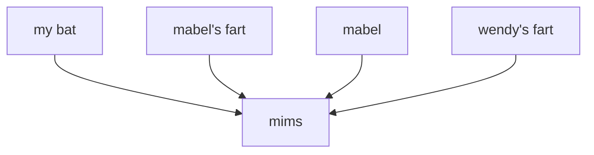
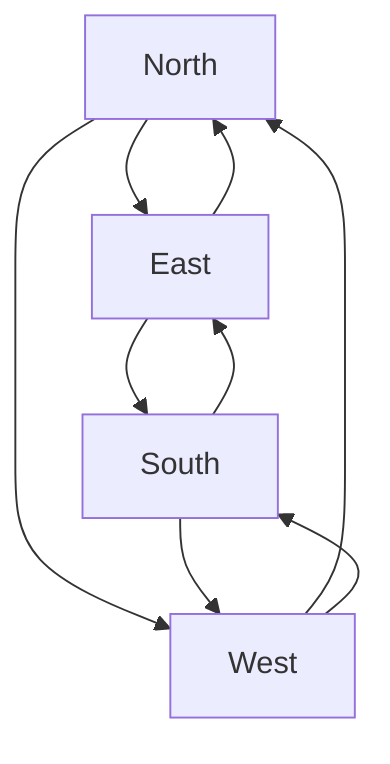
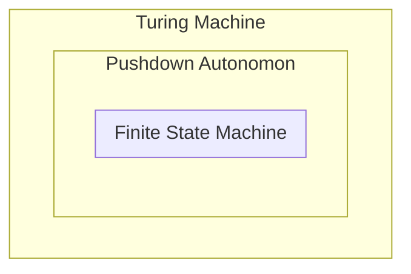

# Introduction
All problems can be solved with some minimum set of directions (or phrases). We call this set a **minimum language** for a problem.

> [!Example] Example: Minimum Language
> Say we have a problem where we need to know how we can move between two points using the cardinal directions. Then, our minimum language would be the set
> 
> $$
> \{ \text{North}, \text{East}, \text{South}, \text{West} \}
> $$

For many text-based problems in computer science, this minimum language can be expressed in terms of **regular expressions (REGEX)**, patterns that describe a set of strings. We can use regular expressions for simple text matching, yet their capabilities can extend far beyond that!
> However, regular expressions do have their limitations - due to the lack of a concept of memory, symbols in regular expressions are independent of one another, and cannot establish dependencies.

> [!Info] Note
> We will often prepend and append our pattern string with `/` to denote a regular expression. 


# Base Constructs
To describe a regular expression, we use the following base constructs.

## (1) Alphabet
First, an **alphabet**, a set of valid acceptable symbols which can be used. This is commonly the english alphabet with characters a-z, A-Z, 0-9, and other related symbols.

```python
"/a/" # Matches with the character {"a"}
"/0/" # Matches with the character {"0"}
```

## (2) Concatenation
What if we want to form longer words with our alphabet?

This is where **concatenation** comes in, allowing us to combine our symbols to form longer words we can match against.

```python
"/hello/" # Matches with the word {"hello"}
"/bye bye/" # Matches with the word {"bye bye"}
```

## (3) Boolean
What if we want to have multiple potential words we can match against?

This is where **boolean or** comes in, an operator which specifies an "option" a word can take when matching against a regular expression. This operation is often performed with the `OR` operator (`|`), which operates from the start of the expression to the end of the expression (or another `OR` operator).

```python
"/a|b|c/" # Matches with words {"a","b","c"}
"/gray|grey/" # Matches with words {"gray", "grey"}
```
> Note in the second example, how we cannot share symbols between words split by `OR`.

### Bracket Operator
To allow us to conveniently perform an `OR` on a much wider range of characters in a range, many implementations will have a **bracket operator** (`[ ]`), allowing us to specify an ASCII range of characters.

```python
"/a|e|i|o|u/" # Matches any vowel
"/[aeiou]/" # Matches any vowel
 
"/0|1|2|3|4|5|6|7|8|9/" # Matches with any characters from "0" to "9"
"/[0-9]/" # Matches with any characters from "0" to "9"

"/[a-z]/" # Matches with any characters from "a" to "z"
"/[A-Za-sz]/" # Matches with any characters from "a" to "z" and "A" to "Z"
```

We can also negate bracket operators specify characters that **cannot** be matched against, using the `NOT` operator (`^`) in these bracket operations.
```python
"[^aei]" # Matches with anything but "a", "e", and "i"
```

Some implementations even provide shorthand symbols to denote some of these common ranges!

```python
"/./" # Matches any possible character
"/\w/" # Matches any alphanumeric character
"/\d/" # Matches any digit
```

## (4) Precedence
Note that in previous examples, we could not share characters between words, due to the scope of the `OR` operator.

We can solve this with **precedence**, by using symbols  (commonly `( )`) to limit the scope of the `OR` operator!

```python
"/gray|grey/" # Matches with {"gray", "grey"}
"/gr(a|e)y/" # Matches with {"gray", "grey"}
```

> [!Info] Extra Precedence Symbols
> Some implementations include extra nifty symbols to force an order of characters!
>
> We can use symbols `^` and `$`, to denote the characters that must be at the start and end of the string (respectively).
> ```python
> "^[0-9]" # Must begin with a digit
> "[0-9]$" # Must end with a digit
> ```

## (5) Quantification
Finally, suppose we have a group of potential characters to match against, and we want to match against this group multiple times in a row. This can become quite annoying to type out!

To address this, we have **quantification**, symbols (`{ }`) that denote the number of repetitions of some expression that we want.

```python
"(0|1|2|3|4|5|6|7|8|9)(0|1|2|3|4|5|6|7|8|9)" # Set of all 2 digit strings
"(0|1|2|3|4|5|6|7|8|9){2}" # Set of all 2 digit strings

"(0|1|2|3|4|5|6|7|8|9){2,5}" # Set of all 2 digit to 5 digit strings (inclusive)
```

> [!Info] Kleene Operator
> For infinite quantification, we have the **kleene operator** (`*`), telling us that the previous regular expression is to be repeated 0 or more times.
>
> ```python
> "(ha)*" # Matches against the set {"", "ha", "haha", "hahaha", ... }
> ```
> 
> We can also use the `+` to force at least 1 or more repetition, and use `?` for only 0 or 1 repeats.

Now that we have all the base regular expression constructs, let's see how we can perform regular expressions in various languages!


# Implementing Regular Expressions (WIP)
To perform regular expressions in Python, we first need to import Python's built-in regular expression module, `re`.

```python
import re # Lets us perform regular expression matching
```

Then, we can compile a **regular expression** object using `compile()`! This object can then be used to match strings for a particular pattern.

```python
# can be used to match 3 digits XXX
regex_object = re.compile(r"[0-9]{3}")
```
> Note the use 
### NOT DONE --


> Note that with Python, we will write regular expressions using **raw strings**, which will not translate any escape sequences (`\`).
> 
> We write raw strings using `r" ... "`

While the below is not a comprehensive list of `re`'s functionalities, below I provide the most commonly used functions.

### `re.findall(pattern,string)`
Finds all matches of a regular expression in a string, or an empty list if no matches are found.

```python
matches = re.findall(r"cmsc3[0-9]*", "cmsc216 cmsc250 cmsc330 cmsc351 cmsc451")
matches # ['cmsc330', 'cmsc351']
matches = re.findall(r"cmsc1[0-9]*", "cmsc216 cmsc250 cmsc330 cmsc351 cmsc451")
matches # []
```

### `re.search(pattern, string)`
Returns a `Match` object for the first match found, or `None` otherwise.

```python
match = re.search(r"hello", "hello world") 
```

After obtaining a `Match` object, we have a variety of methods we can call to obtain information from it.
```python
# using match from before
span = match.span() # returns a tuple containing start and end position of the match
string = match.string # returns the string passed in ("hello world")
group = match.group() # returns the part of the string where the match was found
```

### `re.compile(pattern)`
Note that if we want to use a regular expression to match against multiple different strings, it may be more efficient to first  **compile** our regular expression so we can use it multiple times.

```python
pattern = re.compile(r"testing") # compile regex for use
string = "hello world"

matches = pattern.findall(string) # returns all matches
pattern.match(string) # returns TRUE, match found
```

> We can use the [PYTHEX](https://pythex.org/) website to test python regular expression matching!

# --- WIP --- 9/12/23 (Hi ANNA!)



Suppose we've matched a regular expression. I many languages, the precendence operator `( )` also has a side effect of also being an operator for **grouping**. This can conveniently be used to parse regular expressions!

Suppose we have a regular expression

```python
# matches phone number XXXXXXXXXX
# the () tells us to group the first 3 digits, then the next 3 digits, finally the last 4 digits
regex = re.compile(r"([0-9]{3})([0-9]{3})([0-9]{4})")
m = regex.match("1234567890")

# what if we want to know our first match group?
print(m.group(0)) # "123456890"
print(m.group(1)) # "123"
print(m.group(2)) # "456"
print(m.group(3)) # "7890"
```

We can even nest our groups together! However, we cannot overlap match groups.

```python
# grouping goes in the order the OPEN ( parentheses are SEEN FIRST (LEFT TO RIGHT)
regex = re.compile("Major: (([A-Z])+)")
m = regex.match("Major: MIMS")

print(m.group(0)) # "Major: MIMS"
print(m.group(1)) # "MIMS"
print(m.group(2)) # "M"
```
> Pythex lets us test match groups as well!


# Finite State Machines
Recall that all problems have a minimum language set that can be used to solve the problem.

While not applicable to all problems, this minimum language

While not not applicable to all problems, sometimes we may have a problem that 
Say we have a problem with a 

Idrk what this is

Given a problem, we may find it convenient to model it in terms of a minimum set of states and actions.

For example, say we want to know what direction we're facing. We have the following states
- N, E, S, W
- Turn right, turn left

We can model this as a graph! Problems that can be represented as a fininte number of states, and finite number of actions that can move between these states are known as **finite state machines**.



So we have finite state machines, that can solve a certain number of problems. Notice at any time, we have no concept of memory! We only know where we currently are, and where we want to go.

If we add memory to this machine, such as a **stack**, this machine becomes a **pushdown autonomon**. Then, there's a turing machine, which can (theoretically) solve all solveable problems.
> we're going to start from a finite state machine, and work our way up to a turing machine.




What's important about this is that regular languages can be converted into finite state machines - in other words, they can solve any problem that finite state machines can! Thus, finite state machines and regex are essentially interchangeable.

Let's recall what we need for regex, but in mathematical terms.


[abc][abc]|[abc]

1. An alphabet, denoted by $\sum$, which denotes a set of acceptable symbols.

> Recall that regex descrbes a set of strings (a finite sequence of symbols from the alphabet), called a **language**.

2. Concatenation, rules describing how we can combine our symbols together. Suppose that $L_1$ and $L_2$ are languages, where their concatenation is denoted
   $$ L_1 L_2 = \{ xy : x \in L_1 \land x \in L_2 \} $$
   Then, we should be able to create a new language based on these languages.
   For example, suppose $L_1 = \{ a \}, L_2 = \{ b \}$. Then, $L_1 L_2 = ab$.

3. We also need union. Suppose $L_1$ and $L_2$ are languages. Then their union, mathematically speaking, is given by

$$
L_3 = \{ x : x \in L_1 \lor x \in L_2 \}
$$

For example, say

$$ L_1 = \{'a'\}, L_2 = \{'b'\}, \dots, L_26 = \{'z'\} $$

Then,

$$ \bigcup_{i=1}^{26} L_i = \{ 'a', 'b', \dots, 'z' \} = [a-z] $$

We can use these recursive definitions to solve for our set of strings!


---

Recall that the number of states and actions can be finite, **but the series of actions that we take can be infinite**. The actions that occur on a finite state machine are independent of the states and actions defining the machine!

**Repetition (Kleene Closure)**: Suppose that $L_1$ is a language. Then, the Kleene closure of $L_1$, denoted $L_1^*$, is given as

$$
L_1^* = \{ x : x \in \varnothing \lor x \in L_1 \lor x \in L_1 L_1 \lor \dots \}
$$

Note that the set of any regular expression's strings can be created using these recursive set definitions. Given a set of regular expression strings $R$, we can recursively define it using the following operations:

$$
\begin{align*}
	&\epsilon \to \text{Set of an Empty String}\\
	&\varnothing \to \text{Empty Set}\\ 
	&\sigma \to \text{Set of any Single Character} \\
	&R_1 R_2 \to \text{Concatenation of any Set} \\
	&R_1 | R_2 \to \text{The Union of any Set} \\
	&R_1^* \to \text{The Kleene Operator}
\end{align*}
$$

We can make any string using regular expressions We can put all of these rules together to make a **grammar**

We can now create languages using our regular expressions! Languages created like this are known as **regular languages**.

---

Can we build a machine that can implement regular expressions? In other words, given a regular expression $r$, can we check if it will accept string $s$.


"[01]+1"
```mermaid
```
> KEY IDEA: regular expression defines our states and actions for our fixed machine. Strings define our sequence of actions to plug into the machine :D and we simply plug this string in and see if we can reach some designated end in the machine!