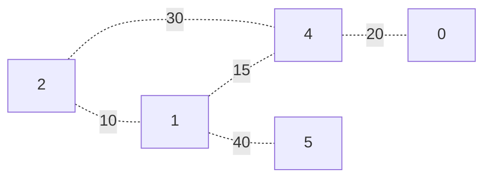

**Problem**: Given a weighted, undirected, simple graph with a starting vertex $S$, how do we get from $S$ to every other vertex using paths of minimum cumulative weight?

# Intuition
Say we have a graph given as follows with starting vertex 2. 

Notice that while we have a total weight of 30 when moving from $2 \to 4$, we have a more efficient route of 25 along $2 \to 1 \to 4$! How do we guarantee we always find the path of least weight?

Suppose we have a vertex $V_0$, and we know the path of minimum weight to this vertex is $m_0$. Now suppose that this vertex has neighbors $N_1, \dots N_k$ with respective edge weights $w_1, \dots w_k$. Given this, then for any neighbor $N_i$, we know that the path of minimum weight to this neighbor as **at most** the sum of
$$
m_0 + w_i
$$
As unless there is a faster path, we know we can take our known route to $V_0$, and then traverse the edge with weight $w_i$ to get to $N_i$. 

Furthermore, from the starting vertex $S$, if we only repeat this process on only the **next** (unvisited) vertex with minimum cumulative weight, we guarantee we know the minimum cumulative weight to $V_0$. 

---

Given $N_i$ therefore, if we were to repeat this process with one of it's neighbors reachable from the start $S$, we can guarantee that we'll end with the minimum path to $N_i$!

---

Given this, then we know that for all of its neighbors $N_1, \dots N_k$, the distance $c_i$ to some neighbor $N_i$ is **at most** the sum of the path 

Say we have a vertex $V$, that we know the path with minimum cumulative weight to. If this is the case, then we know that the 

Starting from 2, we know we can traverse to 1 and 4, with cumulative weights 10 and 30, respectively. However, knowing that we can move to 1 with cumulative weight 10, we can move from $2 \to 1 \to 4$ to have a shorter total 

and say we have starting vertex $S$. 

1. Given a graph, adn starting vertex $S$.
2. Create a set $S = \{ \}$.
3. Assign each vertex a distance of $\infty$ except $d[S] = 0$.
4. Create a list of predecessors of size $V$ of all NULL.
5. Choose the vertex of minimum distance that is NOT already visited (in the set).
6. Process the vertex, updating the minimum distance to all its neighbors and its predecessors.

Time complexity: $\Theta(V)$ (run process through total $V$ nodes), and $\Theta(V)$ (if set is a list, to find the next node with minimum path), and $\Theta(2E)$ (traversing every edge, but in a undirected graph).
$$
\Theta(V^2 + 2E) = \Theta(V^2 + E)
$$

This can be modified using a minheap to yield a different time complexity.