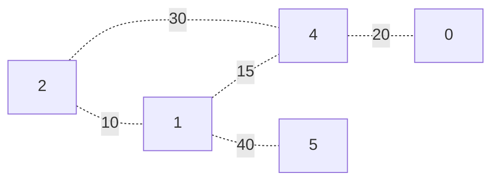

**Problem**: Given a weighted, undirected, simple graph with a starting vertex $S$, how do we get from $S$ to every other vertex using paths of minimum cumulative weight?

# Intuition
Say we have a graph given as follows.



Now supppose we have starting vertex 2. Notice that while we can take a total weight of 30 when moving from $2 \to 4$, we can actually find a more efficient route of 25 along $2 \to 1 \to 4$!

How do we guarantee we always find the paths of least weight from 2?

Let's start from our starting vertex 2.
- Consider all vertices we can reach from 2, which are 1 and 4.

  Because the edge from $2 \to 1$ is shorter than $2 \to 4$, we know that the path from $2 \to 1$ **must** be the shortest path from 2 to 1, as if we took another path to 1, our cumulative edge weight would immediately exceed 10.

  So, we know that from 2 to 1, we have shortest path $2 \to 1$.

- Now, consider all vertices we can reach from both 2 and 1, which are 4 and 5.

  Because the edge from $1 \to 4$ is shorter than any other edge we can take, we know that the path from $2 \to 1 \to 4$ **must** be the shortest path from 2 to 4, as if we took another path to 4, our cumulative weight would immediately exceed 25.

  So, we know that from 2 to 4, we have shortest path $2 \to 1 \to 4$.

Repeating this process, we see that for every vertex we know we have the shortest path to, if we always select the next shortest edge, we guarantee we will always have the shortest path from 2!

This is the idea behind Dijkstra's Algorithm, formalized in the next section.


# Dijkstra's Algorithm
## Pseudocode
To find the shortest path to all vertices in a graph from some start $S$, we will do the following:
- We'll create an array to store the direct predecessor of any vertex in the path from $S$ to that vertex. This array will later be used to recover our shortest path.
- Then, we'll create another array to store the minimum cumulative weight to that vertex.

Then, we'll let the weight of the path to all nodes be a large number, save the weight of the path to $S$ as 0, and do the following:
1. Select the next unvisited node $N$ with the lowest cumulative weight.
2. Traverse every edge $N \to D$ where $D$ is some destination, and if the weight of the edge plus the minimum cumulative weight to $N$ is less than the currently saved weight for $D$:
   - Save $N$ as the predecessor to $D$.
   - Update the minimum cumulative weight to $D$.
3. Finally, mark $N$ as visited. Repeat!

Pseudocode for this algorithm is given below. Let `graph` have $V$ vertices.

```python
def dijkstra(graph, start):
    dist = [inf, ..., inf] # length V
    pred = [NULL, ..., NULL] # length V
    visited = []

    dist[start] = 0

    while length(visited) != size(graph):
          x = unvisited vertex in S with smallest distance
          for each vertex y connected to x:
              if dist[x] + edge_weight(x,y) < dist[y]:
                 dist[y] = dist[x] + edge_weight(x,y)
                 pred[y] = x
          visited.append(x)

    return pred
```

## Time Complexity
Let's now analyze Dijkstra's for its time complexity.

We see that our while loop on line $L_8$ will run $V$ times, and to find the next vertex `x` to process on line $L_9$, we will have to check all $V$ vertices as well.

Furthermore, our inner for loop will run the number of times that there are edges in our graph, and as our graph is undirected, this will amount to $2E$ edges.

This gives us total time complexity
$$
\Theta(V^2 + E)
$$
> Note that we can modify this algorithm and the data structures we're using to obtain a different time complexity.