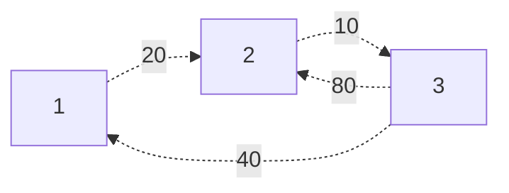

Given a directed, weighted, simple, and connected graph, how can we find the shortest path between **any two pairs of vertices**?

# Intuition
Consider the following graph.

First, we're going to build our adjacency matrix for the graph
$$
A =
\begin{bmatrix}
        0 & 20 & \infty \\
        \infty & 0 & 10 \\
        40 & 80 & 0 \\
\end{bmatrix}

\qquad

d[i,j] =
\begin{cases}
        x & \text{Weight from} \; i \to j \\
        0 & i = j \\
        \infty & \text{No edge}
\end{cases}
$$
> Vertices in this graph are 1-indexed.

We can alternatively think of $d[i,j]$ as the length of the shortest path from $i \to j$, allowing **no immediate vertices** (paths of only 1 edge).

Now, let's do the following:
1. Allow 1 to be an intermediate vertex. Then, this changes the shortest path from $3 \to 2$ to 60, because we can traverse through 1. More formally, we update $d[3,2]$ because
   $$
   d[3,1] + d[1,2] < d[3,2]
   $$
   We then update our matrix, giving us a matrix whose $d[i,j]$ yields the shortest paths allowing 1 as an intermediate vertex! We'll call this the **pass by 1 matrix**.
   $$
   \begin{bmatrix}
        0 & 20 & \infty \\
        \infty & 0 & 10 \\
        40 & 60 & 0 \\
   \end{bmatrix}
   $$
2. Let's repeat this process, now allowing 2 to be an intermediate vertex. Now the shortest path from $1 \to 3$ actually appears, as we can take 2 to go to 3. More formally,
   $$
   d[1,2] + d[2,3] < d[1,3]
   $$
   We again update our matrix, giving us a matrix whose $d[i,j]$ yields the shortest paths allowing 1 and 2 as intermediate vertices. We'll call this the **pass by 2 matrix**.
   $$
   \begin{bmatrix}
        0 & 20 & 30 \\
        \infty & 0 & 10 \\
        40 & 60 & 0 \\
   \end{bmatrix}
   $$
3. We repeat this with 3, allowing 3 to be an intermediate vertex. Now, the shortest path from $2 \to 1$ appears, as we cant take 3 to go to 1. More formally,
   $$
   d[2,3] + d[3,1] < d[2,1]
   $$
   Updating our matrix, we get a matrix whose $d[i,j]$ yields the shortest paths allowing 1,2, and 3 all as intermediate vertices. We'll call this the **pass by 3 matrix**.
   $$
   \begin{bmatrix}
        0 & 20 & 30 \\
        30 & 0 & 10 \\
        40 & 60 & 0 \\
   \end{bmatrix}
   $$

Now, notice that because we've allowed all vertices as intermediate vertices, our matrix yields the lengths of all shortest paths! We can use this matrix to find the actual shortest path between vertices.

Define matrix $P$ such that
$$
P =
\begin{bmatrix}
        1 & 1 & \text{NULL} \\
        \text{NULL} & 2 & 2 \\
        3 & 3 & 3 \\
\end{bmatrix}
\qquad 
p[u,v] =
\begin{cases}
        u & \text{For every edge} \; u \to v \\
        v & \text{For every vertex} \; v
\end{cases}
$$

We can alternative think of this matrix as telling us what the direct predecessor of $j$ is in the shortest path from $i \to j$, allowing no intermediate vertices.

We'll process this graph in a similar way to $A$.
1. Allowing 1 to be an intermediate vertex, we see that the shortest path from $3 \to 2$ changes because instead of taking the path $3 \to 2$, we can instead take $3 \to 1 \to 2$. In other words, our shortest path from $3 \to 2$ should have a predecessor of 1, because we now need to take the intermediate vertex 1.
   $$
   P = 
   \begin{bmatrix}
        1 & 1 & \text{NULL} \\
        \text{NULL} & 2 & 2 \\
        3 & 1 & 3 \\
   \end{bmatrix}
   $$
2. We repeat this process, now allowing 2 to be an intermediate vertex as well. Now, we have path $1 \to 3$, meaning the shortest path from $1 \to 3$ should have a predecessor of 2, as we now need to take the intermediate vertex 2.
   $$
   P = 
   \begin{bmatrix}
        1 & 1 & 2 \\
        \text{NULL} & 2 & 2 \\
        3 & 1 & 3 \\
   \end{bmatrix}
   $$
3. We repeat this process, now allowing 3 to be an intermediate vertex as well. Now, we have a path $2 \to 1$, meaning the shortest path from $2 \to 1$ should have a predecessor of 3, as we now need to take the intermediate vertex 3.
   $$
   P = 
   \begin{bmatrix}
        1 & 1 & 2 \\
        3 & 2 & 2 \\
        3 & 1 & 3 \\
   \end{bmatrix}
   $$

Thus, $P$ now stores the direct predecessor of $j$ in the shortest path from $i \to j$, allowing all intermediate vertices!

--- Continued on monday --- how do we use $P$ to get all of the ACTUAL paths!
