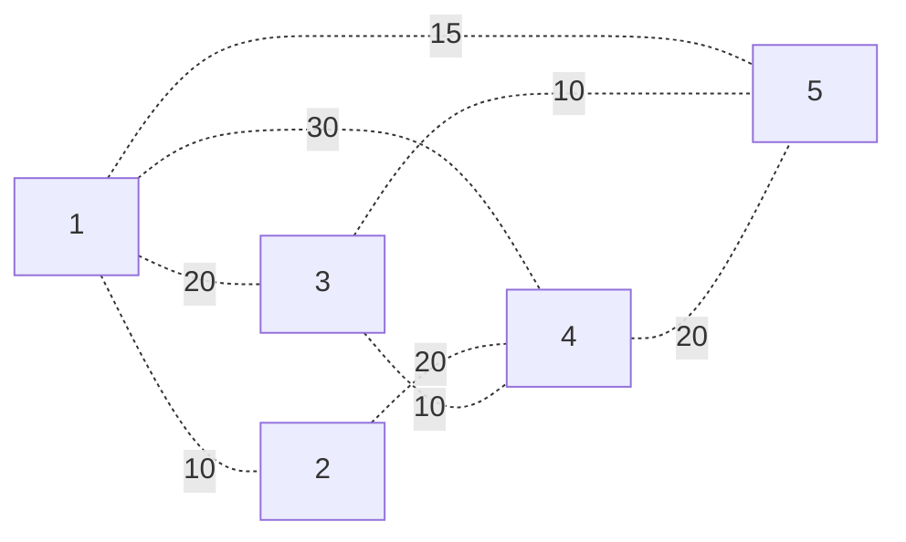
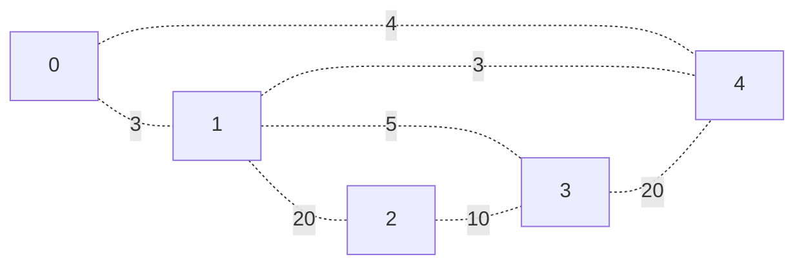

# Minimal Spanning Trees
Suppose we have a graph $G$.

A **spanning tree** is a subgraph of $G$ containing all vertices, and is a tree. If $G$ is weighted, then a **minimal weight spanning tree** is a spanning tree such that the cumulative sum of all the edge weights is as small as possible.

Note that spanning trees and minimal spanning trees are not unique.

**Problem**: Given a graph, how could we derive a minimal spanning tree from it?
> Note that both of the following algorithms, Prim's and Kruskal's, both derive minimal spanning trees using a greedy technique!

# Prim's Algorithm
## Intuition
Take graph $G$. We want to form minimal spanning tree $T$ from the graph.

We can easily do this by always taking the smallest edge from our nodes in the tree $T$. First, pick any vertex as our start, and put it into our tree $T$.

Then, until we have all vertices:
- From amongst all the edges $(u,v)$ such that $u \in T$ and $v \not\in T$, pick the one with minimal weight and add it, and $v$ to $T$.

For example, consider $G$ as



Let's start by putting 5 into our tree. Then,
1. Our tree has nodes $\{ 5 \}$.

   Out of all possible edges we can choose from, edge $\{ (5,3) \}$ has the smallest weight, so we add it and vertex 3 to our tree.
   ```mermaid
   graph LR
         5 -. 10 .- 3;
   ```
2. Our tree has nodes $\{ 3,5 \}$ and edges $\{ (5,3) \}$.

   Out of all possible edges we can choose from, edge $(3,4)$ has the smallest weight, so we add it and vertex 4 to our tree.
   ```mermaid
   graph LR
         5 -. 10 .- 3;
         3 -. 10 .- 4;
   ```
3. Our tree has nodes $\{ 3,4,5 \}$ and edges $\{ (5,3), (3,4) \}$.

   Out of all possible edges we can choose from, edges $(1,5)$ and $(2,4)$ both have the same minimum weight, so we will arbitrarily choose $(1,5)$, and add it and vertex 1 to our tree.
   ```mermaid
   graph LR
         5 -. 10 .- 3;
         3 -. 10 .- 4;
         5 -. 15 .- 1;
   ```
4. Our tree has nodes $\{ 1,3,4,5 \}$ and edges $\{ (1,5), (5,3), (3,4) \}$.

   Out of all possible edges we can choose from, edge $(1,2)$ has the smallest weight, so we add it and vertex 2 to our tree.
   ```mermaid
   graph LR
         5 -. 10 .- 3;
         3 -. 10 .- 4;
         5 -. 15 .- 1;
         1 -. 10 .- 2;
   ```
5. Our tree has nodes $\{ 1,2,3,4,5 \}$ and edges $\{ (1,2), (1,5), (5,3), (3,4) \}$.

Because we have all of the vertices in the graph, we are done!


## Code
The code for the algorithm is as follows:

```python
# graph is of type Graph
def prims(graph):
    T = Graph()
    
    start = graph.vertices[0]
    T.add_vertex(start)

    while T.vertices != graph.vertices:
          # find the next minimal edge whose start is in T, and end is not in T
          next_end = None
          min_weight = -1

          for (start,end,weight) in graph.edges:
              if (start in T.vertices) and (not end in T.vertices):
                 if next_end == None or weight < min_weight:
                    next_end = end

          # add to T
          T.add_vertex(end)

    return T
```

The time complexity of Prim's Algorithm depends widely on how we scan and select the next edge with minimal weight.

If our edges are stored as an adjacency matrix, we can naively do this by scanning every entry in our matrix, and choose the $i \in T$, $j \not\in T$ entry $[i,j]$ with minimal weight. This scanning is $V^2$, and because it must occur $V$ times (we need to select every vertex), we get a time complexity of $\Theta(V^3)$!

Let's reduce this time complexity! Suppose $G$ is still an adjacency matrix, and define a list $D$ of length $V$ which will contain distances from $T$ to vertices which are adjacent to vertices in $T$.
1. Start with $D$ all $\infty$, except for the start $S$, where $D[S] = 0$.
2. Then, to select our vertex, choose the vertex $x \not\in T$ such that $D[x]$ is minimal, and for all $y$ adjacent to $x$, update $D[y]$ with the weight of edge $(x,y)$ if that value is less than $D[y]$.
3. Repeat step 2 until all vertices have been selected.

> We may also define a predecessor's array and update it alongside $D$ in (2) to store the predecessor of the minimum edge for a vertex. We can later use this array to reconstruct our minimal paths!

This makes our scanning process take $V + V$ time instead of $V^2$ (choose the next vertex, and update adjacent vertices). As this needs to run $V$ times, we get overall time complexity $\Theta(V^2)$!


# Kruskal's Algorithm
## Intuition
Take graph $G$. We form minimal spanning tree $T$ from the graph.

Until we have all vertices, 
- Pick an edge of minimal weight whose inclusion in $T$ does not form a cycle.
- Include this edge in $T$.

For example, consider the following graph



We form a minimal spanning tree as follows. 
1. Choose the minimal edge $0 \to 1$, and add it to $T$.
   ```mermaid
   graph LR
         0 -. 3 .- 1;
   ```
2. Choose the minimal edge $1 \to 4$, and add it to $T$. 
   ```mermaid
   graph LR
         0 -. 3 .- 1;
         1 -. 3 .- 4;
   ```
3. Choose the minimal edge $1 \to 3$. Note that we cannot choose the edge $0 \to 4$ which has less weight, as this forms a recycle.
   ```mermaid
   graph LR
         0 -. 3 .- 1;
         1 -. 3 .- 4;
         1 -. 5 .- 3;
   ```
4. Choose the minimal edge $2 \to 3$.
   ```mermaid
   graph LR
         0 -. 3 .- 1;
         1 -. 3 .- 4;
         1 -. 5 .- 3;
         2 -. 10 .- 3;
   ```

We have all vertices - we are done!
> Note that at any point in the algorithm, we don't necessarily have to have a tree at all stages! However, our final output will be a tree.

## Pseudocode
Pseudocode for the algorithm is given as follows:

```python
def kruskals(graph):
    T = Graph()

    while T.vertices != graph.vertices:
        # Finds the next minimal edge without a cycle
        next_end = None
        min_weight = -1

        for (start,end,weight) in graph.edges:
            if not has_cycle(T.with_edge(end)):
               if next_end == None or weight < min_weight:
                  next_end = end

        # Add to T
        T.add_vertex(end)

    return T
```

The time complexity of Kruskal's Algorithm depends widely on how we determine our graph has a cycle, as this is not at all intutive!

Using some basic data structures, it's possible to do Kruskal's algorithm is time $O(E \lg(E))$. Additionally, because $E \le \binom{V}{2}$ in any simple, connected, undirected graph, we can get time complexity
$$
\Theta(E \lg(V^2)) = \Theta(E \lg(V))
$$

Using a data structure called the **Disjoint Set**, we can actually bring thus down to $\Theta(E \alpha(V))$, where $\alpha$ is the inverse of the Ackerman function!
> So long as $V < 10^{50}$, $\alpha$ is less than 4, so unless $V$ is extremely large, $\alpha$ is essentially a constant!