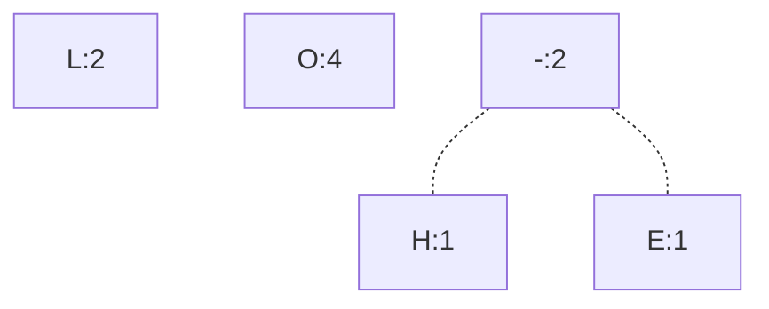
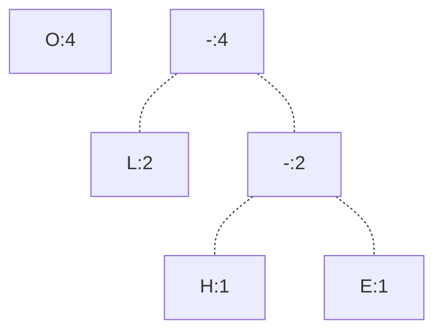
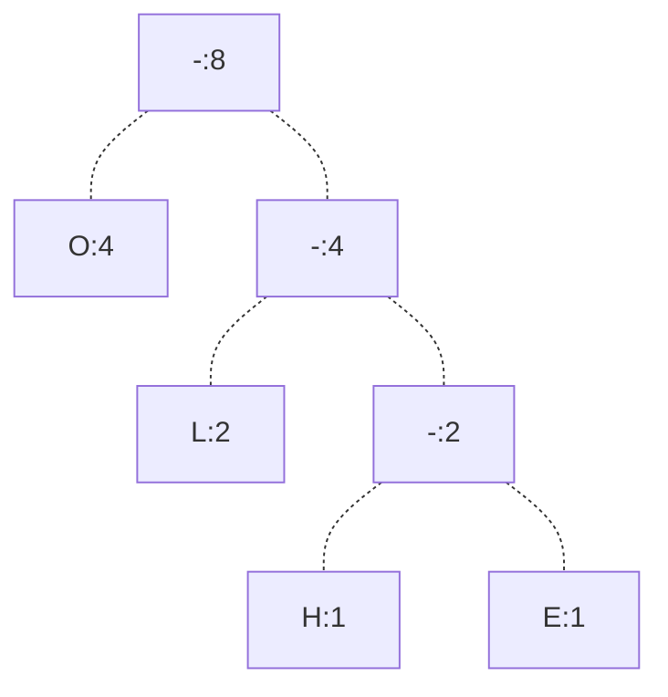
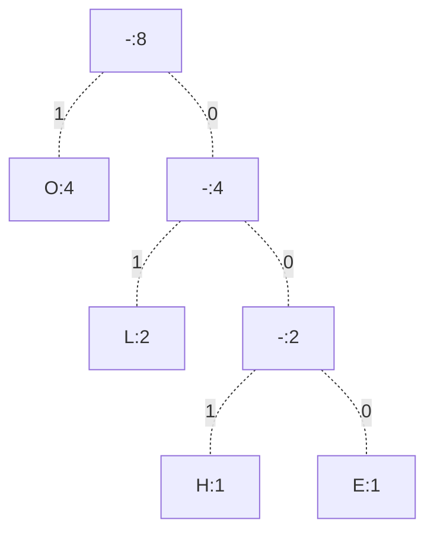

**Problem**: Given some sequence, like a string, we want to be able to assign a binary string to each letter, for storage or transmission purposes. How can we do this?

# Intuition
Suppose we have a binary string like `HELLOOOO`. How can we assign a binary string to each letter?

One idea is to just simply assign incremental bit values to each letter
$$
H=00 \quad E=01 \quad L=10 \quad O=11
$$
This will give us string $\text{HELLOOOOO}=0001101011111111$, taking up 16 bits. However, what if we can do fewer?

To reduce the number of bits, we could potentially use assignment
$$
E=0 \quad H=1 \quad L=00 \quad O=11
$$
But this would have issues, as some strings are prefixes of others, which creates ambiguity!

Let's instead try
$$
H=000 \quad O=1 \quad L=01 \quad E=001
$$
Which won't have ambiguity, and give us string $\text{HELLOOOO}=00000101011111$, taking up 14 bits!

Notice how with different assignments, we can encode the same string in a differing number of bits. This is because of differing encoding techniques.
- **Fixed Length Encoding** represents encoding where all binary strings are of equal length.
- **Prefix Length Encoding** represents encoding where there is no binary string that is a prefix of another (but they may not be the same size).

Given a character string (or any other sequence), we ask - how do we come up with an assignment of binary strings minimizing the total number of bits?

# Algorithm
## Example
Take string `HELLOOOO`. Then, for each unique character, calculate its count, and build a tree consisting of a single node with its count and letter.


Now with this tree, iterate and do the following:
1. Pick the 2 nodes with the smallest counts.
2. Place these nodes as children of a root nodes with no letter, and count set as the sum of the two children's counts.

After the first iteration, we choose the $H$ and $E$ node to obtain



After the second iteration, we choose the previous root node and $L$ node to obtain



Finally, after the third iteration, we obtain



Notice that with this tree, the depth represents relative frequencies of counts, where the most frequent count is at the top, and the least frequent count is at the bottom!

Now, we'll give labels to each of the branches, where $1$ denotes a left branch, and $0$ denotes a right branch. Note that this assignment of labels is arbitrary, and could be swapped.



Finally, we'll give binary assignments by concatenating the labels along the path from the root to each leaf (which represent a character).
$$
H = 001 \quad E=000 \quad L=01 \quad O=1 
$$

We are done! It can be proven that this encoding we just derived minimizes the number of bits we can use.

## Pseudocode
The below pseudocode represents the tree building portion of the algorithm.

```python
def build_tree(nodes):
    min_heap = heapify(nodes) # build a min heap with the node counts
    
    for i in range(1, nodes.size - 1):
        c1 = min_heap.heappop() # extract tree/node with smallest count
        c2 = min_heap.heappush() # extract next tree/node

        tree = combine_trees(c1,c2)
        min_heap.heappush(tree) # add new tree back to heap

    return min_heap.peek(0) # last element in heap
```

We have the following time complexities. Let $n$ denote the number of nodes we start with.
- Line $L_2$ takes $n \lg(n)$ time to build a min heap.
- Line $L_4$ will iterate $n - 1$ times.
  - Lines $L_5$, $L_6$, $L_9$ will each take $\lg(n)$ time

This gives us total time complexity $\Theta(n \lg(n))$!

The below pseudocode represents the code extraction portion of the algorithm.

```python
# dict will contain the final encodings
def extract_codes(node: Node, encodings: dict, s: String):
    if is_leaf(node):
       encodings[node.char] = s
    else:
        extract_codes(node.left, encodings, s + "0")
        extract_codes(node.right, encodings, s + "1")
```

This algorithm will run once for each node. If $n$ is the number of characters (starting nodes) we have, then our final tree will have $2n-1$ nodes. This gives us final time complexity $\Theta(n)$.