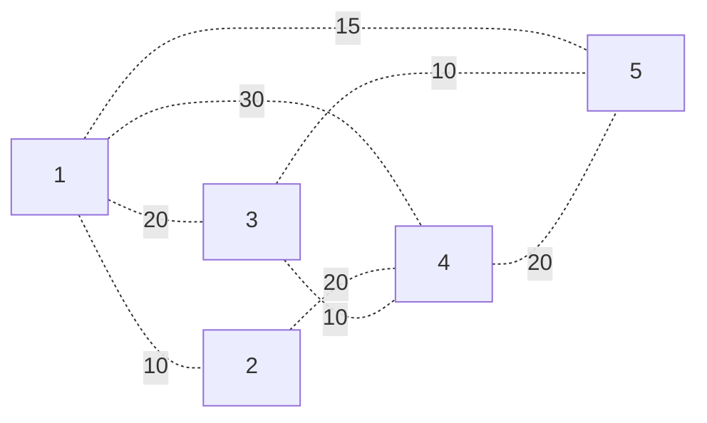

# Minimal Spanning Trees
Suppose we have a graph $G$.

A **spanning tree** is a subgraph of $G$ containing all vertices, and is a tree. If $G$ is weighted, then a **minimal weight spanning tree** is a spanning tree such that the cumulative sum of all the edge weights is as small as possible.

Note that spanning trees and minimal spanning trees are not unique.

**Problem**: Given a graph, how could we derive a minimal spanning tree from it?


# Prim's Algorithm
## Intuition
Take graph $G$. We want to form minimal spanning tree $T$ from the graph.

We can easily do this by always taking the smallest edge from our nodes in the tree $T$. First, pick any vertex as our start, and put it into our tree $T$.

Then, until we have all vertices:
- From amongst all the edges $(u,v)$ such that $u \in T$ and $v \not\in T$, pick the one with minimal weight and add it, and $v$ to $T$.

For example, consider $G$ as



Let's start by putting 5 into our tree. Then,
1. Our tree has nodes $\{ 5 \}$.

   Out of all possible edges we can choose from, edge $\{ (5,3) \}$ has the smallest weight, so we add it and vertex 3 to our tree.

2. Our tree has nodes $\{ 3,5 \}$ and edges $\{ (5,3) \}$.

   Out of all possible edges we can choose from, edge $(3,4)$ has the smallest weight, so we add it and vertex 4 to our tree.

3. Our tree has nodes $\{ 3,4,5 \}$ and edges $\{ (5,3), (3,4) \}$.

   Out of all possible edges we can choose from, edges $(1,5)$ and $(2,4)$ both have the same minimum weight, so we will arbitrarily choose $(1,5)$, and add it and vertex 1 to our tree.

4. Our tree has nodes $\{ 1,3,4,5 \}$ and edges $\{ (1,5), (5,3), (3,4) \}$.

   Out of all possible edges we can choose from, edge $(1,2)$ has the smallest weight, so we add it and vertex 2 to our tree.

5. Our tree has nodes $\{ 1,2,3,4,5 \}$ and edges $\{ (1,2), (1,5), (5,3), (3,4) \}$.

   Because we have all of the vertices in the graph, we are done!


-- refer to tech notes for proof


## Code
The code for the algorithm is as follows:

```python
class Graph:
    def __init__(self, num_nodes: int):
        # Adjacency Matrix
        # Stores None if there is no edge, or an Integer
        # representing the edge's weight if it exists.
        self.edges = [None] * num_nodes 
        for i in range(0, num_nodes):
            self.edges[i] = [None] * num_nodes
        # Number of Nodes
        self.size = num_nodes

# graph is of type Graph
def prims(graph):
    tree = Graph()

    graph.
```

The time complexity is as follows. Note that while the outer while loop will always run $V$ times, weour selection of the minimum weight may change depending on how we store the graph!

1. If we store edges as an adjacency matrix, then for each entry in our adjacency matrix, we see if $i \in T$, $r \not\in T$ (or reverse), and of those, store the $[i,j]$ with minimal weight. This scanning is $V^2$!

   Since our $V^2$ happens $V$ times, we get $\Theta(V^3)$.

2. Suppose $G$ is still an adjacency matrix, and define a list $D$ of length $V$ which will contain distances from $T$ to vertices which are adjacent to vertices in $T$,

   Start with $D$ all $\infty$, except for the start $S$, where $D[S] = 0$. We'll do our selection by choosing the vertex $x \not\in T$ such that $D[x]$ is minimal. For all $y$ adjacent to $x$, we then update $D[y]$ with the weight of edge $(x,y)$ if that value is less than $D[y]$. Repeat by then choosing the minimal vertex again, and repeat.

-- come back after break --
