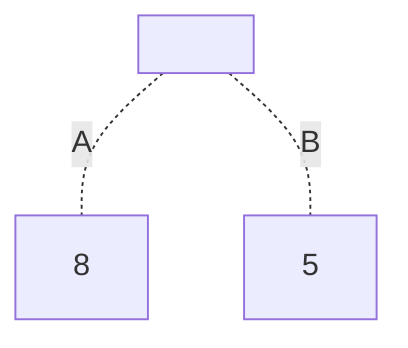
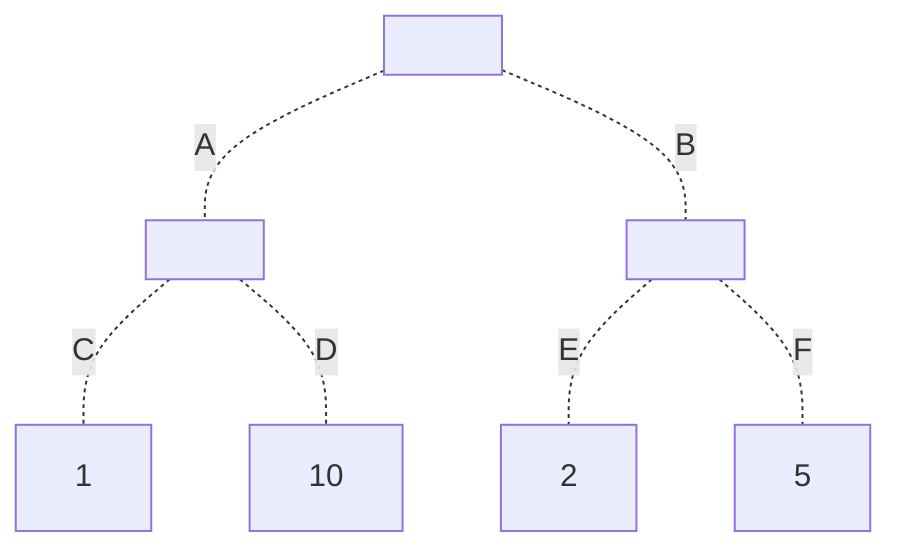
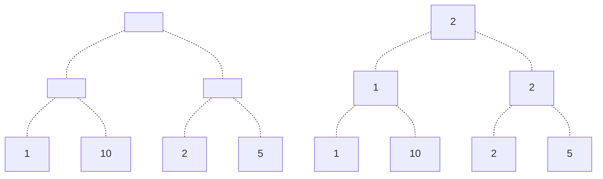

The minimax algorithm is an algorithm that can help us make the best choice in a situation involving worst case scenarios.

# Intuition
Suppose we have two players in a game, called Max and Min. Now suppose that the state of the game can be represented by a number, and Max wants to obtain the maximum number, whereas Min wants to obtain the minimum number.

Suppose it's Max's turn, and they can either choose move $A$ or $B$.



Clearly, Max's best choice to choose move $A$, as this way they'll end with the maximum possible game state 8. However, what if after Max's move, Min can make a move too?



Then, knowing that Min will always choose the lowest number, Max's best choice now changes to move $B$, as this will yield a final game state of 2. If Max chose move $A$, then Min would certainly choose move $C$, giving us a lower game state of 1!

This is the idea behind the Minimax Algorithm - knowing that the other player, "Min", will always choose the lowest / "worst case scenario", we as Max want to know what the best choice to make is.

# Algorithm
## Pseudocode
We have the following situation.
- We are Max, and it's Max's move.
- Max can look at some # of moves ahead, which can be represented by a tree.
- There is a **heuristic function** that assigns a number to the leaf of each decision tree.

Given this tree of moves, we can determine Max's best move to make by recursively rippling upwards from the leaves of the tree, and choosing either the minimum or maximum of each node's children, depending on whose turn it is.
> When rippling up from the tree, we alternate between choosing the maximum and minimum of the children.

Repeating this process from the leaves of the tree to it's root will give us the best choice possible. Note that there may sometimes be multiple best choices - and in that case, we'll choose any of the best moves to make.

For example, we can populate the following tree as follows:


Thus, from our root, our best move is to choose the right child as our move, as this will maximize our final result!

Consider the following pseudocode.

```python
# Assumes we have a tree, with a heuristic function applied to the leaves.
def minimax(node: Tree, depth: int):
    if node.value != NULL: # leaf
       return node.value
    else:
        if iseven(depth):
           return max(minimax(ndc, depth + 1) for all children ndc of node)
        else:
           return min(minimax(ndc, depth + 1) for all children ndc of node)
```

## Time Complexity 
The time complexity of this algorithm is $\Theta(n)$, where $\Theta(n)$ is the number of nodes in the tree.

As this can be difficult to determine, however, we sometimes define our complexity instead in terms of the tree's depth $d$, and the maximum number of children $b$. Then, we know that
$$
n \le 1 + b + b^2 + \dots + b^d
$$

Giving us time complexity $\Theta(n)$ where
$$
n \le \frac{b^{d+1}-1}{b-1}
$$

# Case Study: Tic Tac Toe
Let's see how we can apply our Minimax Algorithm to a popular game, **Tic Tac Toe**. Max plays X, and Min plays O. Max goes first.

Given a $3 \times 3$ board, define an **open winning line** as any row, column or diagonal containing at least one of the player's marks, and none of the opponent's marks. For example, in the board
$$
\begin{bmatrix}
        [\quad] & [\quad] & [x] \\
        [\quad] & [O] & [\quad] \\
        [\quad] & [\quad] & [\quad]
\end{bmatrix}
$$
Max has 2 open winning lines: the row and the column, but not the diagonal, as Min has made a move in the middle.

Let's define our heuristic function as the difference of any open winning lines that Max has, minus the number of open winning lines Min has.

1. Let's say Max can look one move ahead. Factoring symmetry into account, we know we can make 3 possible moves.
   $$
   \begin{bmatrix}
           [X] & [\quad] & [\quad] \\
           [\quad] & [\quad] & [\quad] \\
           [\quad] & [\quad] & [\quad]
   \end{bmatrix} \;
   \begin{bmatrix}
           [\quad] & [\quad] & [\quad] \\
           [\quad] & [X] & [\quad] \\
           [\quad] & [\quad] & [\quad]
   \end{bmatrix} \;
   \begin{bmatrix}
           [\quad] & [\quad] & [\quad] \\
           [X] & [\quad] & [\quad] \\
           [\quad] & [\quad] & [\quad]
   \end{bmatrix}
   $$
   These moves have open winning lines 3, 4, 3 respectively, meaning we would choose the middle as our first move.

2. Let's now say that Max can look 2 moves ahead.

   If Max plays center, Min has 2 moves, yielding a heuristic value of 1 and 2, respectively.:
   $$
   \begin{bmatrix}
           [O] & [\quad] & [\quad] \\
           [\quad] & [X] & [\quad] \\
           [\quad] & [\quad] & [\quad]
   \end{bmatrix} \;
   \begin{bmatrix}
           [\quad] & [O] & [\quad] \\
           [\quad] & [X] & [\quad] \\
           [\quad] & [\quad] & [\quad]
   \end{bmatrix}
   $$

   If Max plays corner, Min has 5 moves, with heuristic values 1, 0, -1, 1, and 0, respectively.
   $$
   \begin{bmatrix}
           [X] & [O] & [\quad] \\
           [\quad] & [\quad] & [\quad] \\
           [\quad] & [\quad] & [\quad]
   \end{bmatrix}
   \begin{bmatrix}
           [X] & [\quad] & [O] \\
           [\quad] & [\quad] & [\quad] \\
           [\quad] & [\quad] & [\quad]
   \end{bmatrix}
   \begin{bmatrix}
           [X] & [\quad] & [\quad] \\
           [\quad] & [O] & [\quad] \\
           [\quad] & [\quad] & [\quad]
   \end{bmatrix}
   \begin{bmatrix}
           [X] & [\quad] & [\quad] \\
           [\quad] & [\quad] & [O] \\
           [\quad] & [\quad] & [\quad]
   \end{bmatrix}
   \begin{bmatrix}
           [X] & [\quad] & [\quad] \\
           [\quad] & [\quad] & [\quad] \\
           [\quad] & [\quad] & [O]
   \end{bmatrix}
   $$

   Finally, if Max plays side, Min has 5 moves as well, with heuristic values -1, 0, -1, -2, 0.
   $$
   \begin{bmatrix}
           [O] & [\quad] & [\quad] \\
           [X] & [\quad] & [\quad] \\
           [\quad] & [\quad] & [\quad]
   \end{bmatrix}
   \begin{bmatrix}
           [\quad] & [O] & [\quad] \\
           [X] & [\quad] & [\quad] \\
           [\quad] & [\quad] & [\quad]
   \end{bmatrix}
   \begin{bmatrix}
           [\quad] & [\quad] & [O] \\
           [X] & [\quad] & [\quad] \\
           [\quad] & [\quad] & [\quad]
   \end{bmatrix}
   \begin{bmatrix}
           [\quad] & [\quad] & [\quad] \\
           [X] & [O] & [\quad] \\
           [\quad] & [\quad] & [\quad]
   \end{bmatrix}
   \begin{bmatrix}
           [\quad] & [\quad] & [\quad] \\
           [X] & [\quad] & [O] \\
           [\quad] & [\quad] & [\quad]
   \end{bmatrix}
   $$

   This gives us tree
   ```mermaid
   graph TD
         a[ ] -.- b[ ] & c[ ] & d[ ];
         b -.- e[1] & f[2];
         c -.- g[1] & h[0] & i[-1] & j[1] & k[0];
         d -.- l[-1] & m[0] & n[-1] & o[-2] & p[0];
   ```
   Applying the Minimax algorithm, we obtain tree
   ```mermaid
   graph TD
         a[1] -.- b[1] & c[-1] & d[-2];
         b -.- e[1] & f[2];
         c -.- g[1] & h[0] & i[-1] & j[1] & k[0];
         d -.- l[-1] & m[0] & n[-1] & o[-2] & p[0];
   ```
   Telling us that the best move to make is the middle position, as this will yield the highest heuristic value of one open winning line!