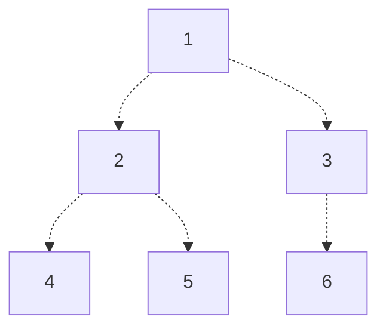

# Heaps
## Complete Binary Trees
A **complete binary tree** is a binary tree satisfying the following two properties:
- Every level that is not the bottom-most level is full.
- Nodes in the bottom-most level are all aligned to the left. 

Consider the following complete binary tree.



For our purposes, we will $1$-index the nodes in our complete binary tree, from top to bottom, left to right. Note that some resources may $0$-index.

With this indexing scheme, we have the following properties of children and parents:
- For a node with index $i$, it's children (if they exist) have indices $2i$ (left) and $2i + 1$ (right).
- For a node with index $i$, it's parent (if it exists) has index $\lfloor i/2 \rfloor$
- If the tree has $n$ nodes, then the node with the largest index that still has children has index $\lfloor n/2 \rfloor$.
  > It follows from this that the nodes with children have indices $1, 2, \dots, \lfloor n/2 \rfloor$.

Additionally, we have the following properties of levels in the complete binary tree:
- The leftmost node on level $k$ has index $2^k$.
- A node with index $i$ is on level $\lfloor \lg(i) \rfloor$.
- If we have $n$ nodes, then the max level is level $\lfloor \lg(n) \rfloor$
- Given a node with index $i$, the number of levels below that node's level and the max level (inclusive) is $\lfloor \lg(n) \rfloor - \lfloor \lg(i) \rfloor + 1$


## Max Heaps
A **max heap** is a binary tree such that:
- It is a complete binary search tree
- For any given node, it's key (value) is greater than or equal to that of its children

It follows from these properties that given a max heap, we can always find the largest element at index $1$ - or in other words, the top of the heap.
> A **min heap** folows a similar definition, except that every node's key must be less than or equal to its children.

We can create a max heap using the following two functions, which we'll describe below.

### `maxheapify`
Consider a tree in which its two child subtrees are max heaps, but the tree itself may not be. In other words, the root node's key is less than that of one of its children.

To convert this tree into a max heap, we can:
1. Swap the root node with its largest child, ensuring the node and it's immediate children form a max heap.
2. Recursively repeat this process for the child subtree whose root we just modified, to ensure that subtree continues to form a max heap.
3. Stop when we either find a node with no leaves, or a node whose value is greater than that of its children.

Running this algorithm and letting its recursion run to completion, we guarantee that we'll end with a max heap! This process is commonly known as `maxheapify`.

> [!Example]- Example: Maxheapify
> Consider the following complete binary tree
>
> ```mermaid
> graph TD
>       50 -.-> 40 & ...;
>       40 -.-> 1[30] & 45;
>       1[30] -.-> 10 & 5;
>       45 -.-> 2[30] & 42;
> ```
>
> To convertthe subtree with root 40 into a max heap, we will recursively swap 40 with 45, then 42. Note that this does not guarantee the entire tree with root 50 is a max heap (we'll have to call the algorithm again!)
>
> ```mermaid
> graph TD
>       50 -.-> 45 & ...;
>       45 -.-> 1[30] & 42;
>       1[30] -.-> 10 & 5;
>       42 -.-> 2[30] & 40;
> ```

Looking at the time complexity of this algorithm, we see that:
- In the **best case**, if no child keys are larger, we do nothing, giving us $\Theta(1)$.
- In the **worst case**, if we have to swap to the bottom of the heap, then at most we'll have to perform swaps equal to the number of levels in the tree, whichgives us $\Theta(\lg(n))$.

### `converttomaxheap`
Note that while the `maxheapify` function can give us a max heap, it only works given that the children of a given root node are also max heaps. However, we can use this `maxheapify` to convert an entire tree into a max heap!

We do this by starting from the last node with children, and simply calling `maxheapify` on on each node in order, from the last node to the root node.

$$
\left\lfloor \frac{n}{2} \right\rfloor, \left\lfloor \frac{n}{2} \right\rfloor - 1, \dots, 3, 2, 1
$$

This will give us a max heap, as by starting from the last node with children and working backwards, we guarantee that by the time we get to any node, its children will already be max heaps! 

Given this, we can find the time complexity of this algorithm to be:
- **Best Case**: If we don't do any swaps, we'll take constant time on $\lfloor n / 2 \rfloor$ nodes to get


# Algorithm and Analysis
Now consider an unsorted array $A$. We can utilize max heaps to sort the array as follows:
1. First, we convert our array to a max heap, by calling `converttomaxheap` on it.
2. Next, for every iteration $i = 1$ up to $n$, we can find the $i^{th}$ largest node by doing the following:
   - First, we swap the top of the max heap (which will have the $i^{th}$ largest element) with the $i^{th}$ last element in our array, and treat it as if it's no longer in the heap.
   - Then, we call `maxheapify` on the root, to correct the heap, and ensure the the next largest element is at the top of the heap next iteration.

After finishing all iterations, we end with a fully sorted array!

While pseudocode won't be provided for this, we can analyze the time complexity as follows.
- To initially convert our array into a max heap, we take $n \lg(n)$ time to call `converttomaxheap`.
- Then, we need to call `maxheapify` $n$ times, to choose the $n$ elements out of our heap (step 2) and obtain a final sorted array.

This will give us final complexity of $\Theta(n \lg(n))$!