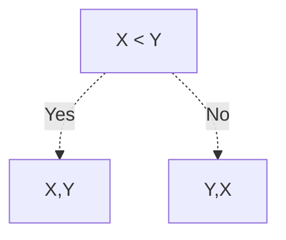
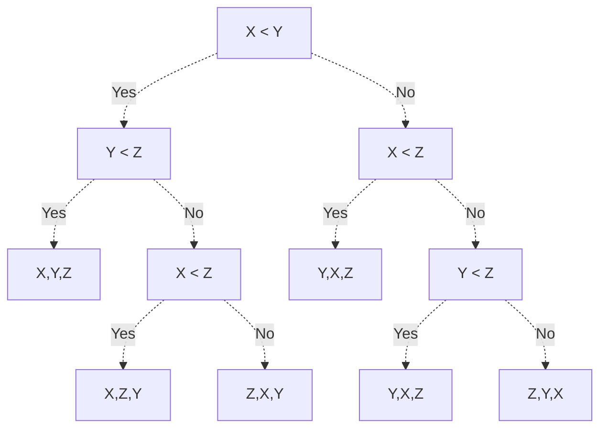

No matter what algorithm we've chosen, notice how every single comparison-based sorting algorithm given in [[Sorting Algorithms]] cannot obtain a worst case time complexity faster than $\Theta(n \lg(n))$.

This is a peculiar observation, and we ask - if we could create any possible sorting algorithm using comparisons, how fast could this algorithm theoretically be? Can we create an algorithm that's faster than $\Theta(n \lg(n))$ in the worst case?

Interestingly enough, the answer is no! It is not possible to create a comparison-based sorting algorithm whose worst-case time complexity is faster than $\Theta(n \lg(n))$.

> [!Abstract] Theorem: Limitations of Comparison Based Sorting Algorithms
> In the worst-case, no comparison-based sorting algorithm can obtain a time complexity faster than $\Theta(n \lg(n))$.

# Proof
Suppose we have any sorting algorithm that sorts its list using comparisons. To know the worst case time complexity, then, it would be natural to ask: **Given a list of size $n$, what is the maximum number of comparisons possibly needed to sort it?**

We do this by drawing a **decision tree** for various lengths $n$, where each node in the tree represents a comparison made (decision), and each leaf represents the final sorted list.

Say we have a list of length $n = 2$ given as $[X, Y]$. Then,
1. If $X < Y$ is true, we know our final sorted list is $[X,Y]$.
2. If $X < Y$ is false, we know our final sorted list is $[Y,X]$.

This yields the following decision tree.

Thus, in the worst case, we only need to make one decision max to sort our list.

Now say we have a list of length $n = 2$, given as $[X,Y,Z]$. Then,
1. If $X < Y$ is true, and
   1. If $Y < Z$ is true, our final sorted list is $[X,Y,Z]$.
   2. If $Y < Z$ is false, and
      1. If $X < Z$ is true, then our final sorted list is $[X,Z,Y]$
      2. If $X < Z$ is false, then our final sorted list is $[Z,X,Y]$
2. If $X < Y$ is false, and
   1. If $X < Z$ is true, then our final sorted list is $[Y,X,Z]$
   2. If $X < Z$ is false, and
      1. If $Y < Z$ is true, then our final sorted list is $[Y,Z,X]$
      2. If $Y < Z$ is false, then our final sorted list is $[Z,Y,X]$

This yields the following decision tree.

Thus, in the worst case, we need to make 3 decisions to sort our list.

Because our algorithm should be able to sort the array in all cases, our decision tree must be able to yield every possible arrangement of the list's values. In other words, the tree must have $n!$ leaf nodes.

We ask, as $n$ increases and the number of leaf nodes increases by $n!$, what is the minimum height our tree must be to include all leaf nodes?

We use the following lemma to answer this question.

> [!Abstract] Lemma
> $$
> \Theta( \lg(n!) ) = \Theta( n \lg(n) )
> $$

Because there must be $n!$ leaf nodes, and every node in our tree can only have 2 children, we must have (at minimum) $\lg(n!)$ levels in our tree to include all $n!$ leaves. Thus, by our lemma, our tree must have a minimum height of $n \lg(n)$, meaning that in the worst case scenario, we'll have to make at least $n \lg(n)$ decisions!

Because of this, we see that in the worst case, any decision-based sorting algorithm must make $\lg(n!) \to n\lg(n)$ decisions to complete. In terms of Big-O, we say that these algorithms have a lower bound of $\Omega(n \lg(n))$.
> No matter what comparison based sorting algorithm we come up with, there will always be at least 1 list that takes $n \lg(n)$ time. 