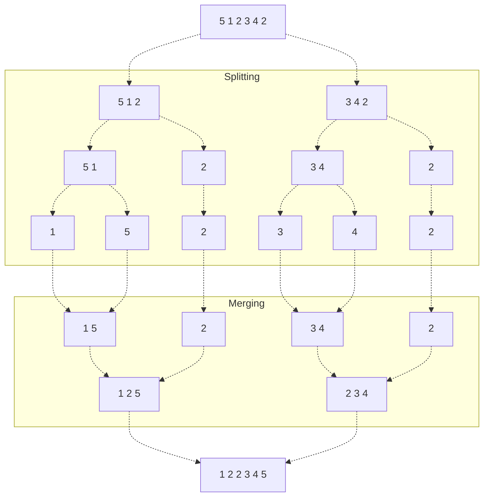

# Algorithm
Take a list $A$ of length $n$.
$$
A = [ 5, 1, 2, 3, 4, 2 ]
$$

We can use the divide and conquer approach to sort this array. By splitting the array in half, we can sort each subarray individually, and recombine them to form a larger sorted list. As our base case, we have a list of size 1, which is already sorted. 

Note that if we have two sorted lists, we can easily "zip" them together to form a larger list in $\Theta(n)$ time (keep picking the smallest / largest value from either list).
$$
\begin{align*}
        &[ 1, 2, 4, 10 ] &[ 3, 5, 6, 9, 11 ]\\
        &\to [1, 2, 3, 4, 5, 6, 9, 10, 11]
\end{align*}
$$

This process can be done recursively!

For example, given our above list, we sort it with MergeSort as follows: 


# Pseudocode
Pseudocode for Merge Sort is given below.

```python
def merge_sort(array):
    if len(array) > 1:
       middle = len(array) // 2

       left_subarray = array[0:middle-1]
       right_subarray = array[middle:len(array)]

       left_subarray = merge_sort(left_subarray)
       right_subarray = merge_sort(right_subarray)

       # merge lists by "zipping" them together.
       array = merge_sorted_lists(left_subarray, right_subarray)

    return array
```

Let's find the time complexity of merge sort! Merge sort yields the recurrence relation:
$$
T(n) = 2 T(n / 2) + \Theta(n)
$$

We can solve this relation easily using the Master Theorem. We find that $a = 2$, $b = 2$, and see that $\log_a b = \log_2 2 = 1$.

We see that we satisfy the Master Theorem (property 2) with $n = 1$ and $k = 0$, giving us
$$
T(n) = \Theta(n \lg (n))
$$
> Note that this represents all possible (best, worst, average) cases!

Additionally, we find
- The auxilliary memory is $\Theta(n)$, as at the highest recursive call, we use up $n$ space (lengths of left and right subarrays combined). Note that we disregard lower recursive calls, as when they finish, the memory is freed.
- The algorithm can be either stable or unstable, depending on the comparisons performed in the `merge_sorted_lists()` function.
- The algorithm is not in place, as it generates new lists every recursive call.
