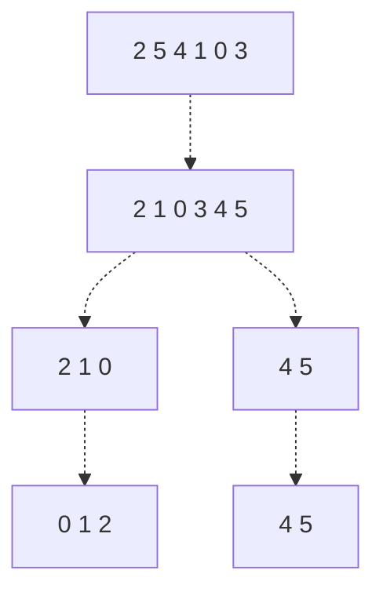

# Quick Sort
Take a list of list $A$.

$$

$$

We can use the divide and conquer to sort this array, in a different fashion than merge sort. Suppose we choose a value in the list, which we'll call the **pivot**. Then, we can rearrange the list such that all values $\le$ the pivot are to its left, and all values $\ge$ the pivot are to its right, in a process called **partitioning**.
> In the partitioning process, we find the first leftmost value greater than the pivot, and then find the first subsequent value less than the pivot, and swap them. We can repeat this until we are finished!
>
> $$
> \begin{align*}
> 2,\underline{5},4,\underline{1},0,3 \\
> 2,1,\underline{4},5,\underline{0},3 \\
> 2,1,0,\underline{5},4,\underline{3} \\
> 2,1,0,3,4,5
> \end{align*}
> $$

We can then perform this partitioning recursively on both sides of the array, to sort them and obtain a final sorted list!

For example, given our above list, we can sort it with Quick Sort as follows:


```python
def partition(array, left, right):
    pivot = array[right]
    t = left

    for i in range(left, right):
        if array[i] <= pivot:
           swap array[t] array[i]
           t+= 1

    swap array[t] array[right]
```
> This essentially will choose and swap for all values $<=$ the pivot, so that they are together! Then, after this, it will move the pivot to be just after this sequence.

What partition do we choose?

In theory we COULD choose any value in the list, though the pseudocode requires it to be the last value. Ideally, though, we want to choose the median as our pivot, as that will spread the work out the most evenly.

Let's now do quick sort. Say A is a global list.

```python
def quicksort(array, left, right):
    if left < right:
       # partition
       pivot_index = partition(array, left, right)

       # quicksort on the left and right halves
       quicksort(array, left, pivot_index)
       quicksort(array, pivot_index + 1, right)
```

We now find the time complexity. Note that the partition will take time equal to the length of the list.

Say for some recursive call, we have $k$ as the resulting pivot location. Then, after the partition, we see that we run quicksort on the left subarray of length $k$, and the right subarray of $n - k - 1$. This gives us recurrence relation
$$
T(n) = T(k) + T(n-k-1) + \Theta(n)
$$
1. Let's look at our worst case scenario. In the worst case, we always get our pivot at the end, giving us recurrence relation
   $$
   T(n) = T(0) + T(n-1) + \Theta(n) \to T(n) = \Theta(n^2)
   $$
   But the chances that our pivot is always at the end is really low!
2. Let's look at our best case scenario. In the best case, we always get our pivot in the middle, so we run quicksort on the subarrays of $n/2$.
   $$
   T(n) = 2 T(n/2) + \Theta(n) \to T(n) = \Theta(n \lg(n))
   $$

Let's now look at the average case. Note that the speed of partition is $\Theta(n)$ no matter what the order of our elements are. Instead, the only thing that impacts our speed is the pivot index.

So, what if we chose the pivot index (uniformly) randomly?
$$
T(n) = \frac{1}{n} \sum_{k=1}^{n-1} \left[ T(k) + T(n-k-1) + \Theta(n) \right]
$$
The solution to this is $T(n) = \Theta(n \lg(n))$.

We also see:
1. In place: yes
2. No auxiliary space
3. Not stable
