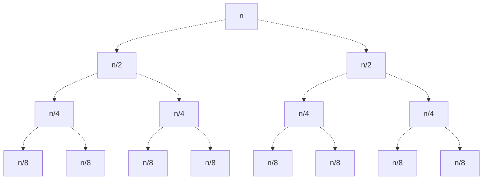

In this section, we discuss various methods we can use to analyze the efficiency of algorithms. Here, we discuss two main methods of analysis - Big O Notation, and Recurrence Relations.

# Big-O Notation
## Motivation
Suppose we have 2 different algorithms operating on a list of length $n$. Now suppose we run these algorithms on various size lists, and obtain the following runtime data:

| $n$ | $A_1 (n)$ | $A_2(n)$ |
| :-: | :-: | :-: |
| 10 | 6 | 1 |
| 20 | 12 | 6 |
| 30 | 18 | 17 |
| 40 | 24 | 25 | 
| 50 | 28 | 40 |
| 60 | 30 | 63 |
| 70 | 38 | 82 |

We could use this table to compare the two algorithms based on their time values. For example, we can see that $A_1 (n)$ is approximately better than $A_2 (n)$ for $n \le 40$.

Is there a better way to formalize this comparison?

Well, yes! Suppose we know these functions stay within the bounds

$$
\begin{align*}
	0.4n \le &A_1(n) \le 0.6 n \\
	0.01n^2 \le &A_2(n) \le 0.02 n^2
\end{align*}
$$

These bounds could be used to more formally compare the two algorithms! 

The purpose of Big-O Notation is to provide a more formalized argument for performing these comparisons.


## Big-O Notation
Suppose we have a function $f(x)$.

### Big-O
We say $f(x) = O(g(x))$ to mean:
$$
\exists x_0,C \; \text{such that} \; x \ge x_0 \to f(x) \le C g(x)
$$
In other words, $O(g(x))$ is a function such that for large values $x$ ($x > x_0$), $f(x)$ is less than some multiple of $g(x)$!

We call $O(g(x))$ the **Big-O** of $f(x)$. We can intuitively think of $O(g(x))$ as an upper bound for $f(x)$.

> [!Example]- Example: Big-O Intuition
> Here, $f(x) = O(x^2)$ with $C = 2$ and $x_0$ as shown. 
> 
> Note that $f(x)$ does not necessarily have to be below $C x^2$ for all $x$ - only past some cutoff $x_0$.
> 
> ![[(Big-O) Example 1.png]]

Given this definition, to prove that a function $f(x) = O(g(x))$, we need to find some $x_0$ and $C$ and explicitly show it satisfies this definition. See the below examples.

> [!Example]- Example: Proving Big-O Functions (1)
> Prove that $2x \log(x) - 1 = O(x \log(x))$
> 
> Observe that for all $x > 0$,
> $$
> 2x \log(x) - 1 \le 2x \log(x)
> $$
> Now, let $C = 2$ and $x_0 = 1$. Because for $x > x_0$,
> $$
> 2x \log(x) - 1 \le C x \log(x)
> $$
> By definition, we've shown that $2x \log(x) - 1 = O(x \log(x))$.

> [!Example]- Example: Proving Big-O Functions (2)
> Prove that $4x^2 + x \log(x) - 1 = O(x^2)$
> 
> Observe that for all $x > 0$,
> $$
> \begin{align*}
> 	4x^2 + &x \log(x) - 1 &\le 4x^2 + x \log(x) \\
> 	&\le 4x^2 + x^2 = 5x^2
> \end{align*}
> $$
> Thus, we've found a Big-O function $O(x^2)$ with $C = 5$ and $x_0 = 1$.

> [!Warning] Non-Uniqueness of Big-O Functions
> Note that Big-O functions are not unique! There are a multitude of functions that can satisfy the Big-O of $f(x)$.
>
> For example, suppose $f(x) = O(x^2)$. If this is the case, then we can also say that 
> $$
> \begin{align*}
> 	f(x) &= O(x^3) \\ 
> 	f(x) &= O(x^4) \\
> 	&\vdots
> \end{align*}
> $$


### Big-Omega
Additionally, we can say $\Omega(g(x))$ to mean:
$$
\exists x_0, B > 0 \text{ such that } \forall x \ge x_0 \to f(x) \ge B g(x)
$$
In other words, $\Omega(g(x))$ is a function such for large values $x$ ($x > x_0$), $f(x)$ is greater than some multiple of $g(x)$ for all $x$!

We call $\Omega(g(x))$ the **Big-Omega** of $f(x)$. We can intuitively think of $\Omega(g(x))$ as a lower bound for $f(x)$.

> [!Example]- Example: Big-Omega Intuition
>
> Here, $f(x) = \Omega(x^2)$ with $B = \frac{1}{2}$ and $x_0$ as shown.
> 
> ![[(Big-O) Example 2.png]]

Similar to Big-O, we can prove $f(x) = \Omega(g(x))$ by finding values $x_0, B$ satisfying our definition. See the example below.

> [!Example]- Example: Big-Omega Proof (1)
> 
> Prove that $5 x \lg(x) - x = \Omega(x \lg(x))$.
> 
> Observe that $x \le x \lg(x)$ when $\lg(x) \ge 1$ which occurs at $x \ge 2$. Then, for $x \ge 2$,
> $$
> \begin{align}
> 	5x \lg(x) - x &\ge 5x \lg(x) - x \lg(x) \\
> 	&\ge 4x \lg(x)
> \end{align}
> $$
> Thus, choosing $B = 4$ and $x_0 = 2$, we have shown that $5 x \lg(x) - x = \Omega(x \lg(x))$!

### Big-Theta
Note that while Big-O provides an upper bound, and Big-Omega provides a lower bound, a variety of functions can serve as these upper / lower bounds! Thus, Big-O and Big-Theta may not necessarily provide a good benchmark for a function.

To address this, we define $\Theta(g(x))$ to mean
$$
\exists B > 0, C> 0, x_0 \text{ such that }x \ge x_0 \to Bg(x) \le f(x) \le Cg(x)
$$
In other words, $\Theta(g(x))$ is a function that serves as both an upper and lower bound for $f(x)$!

We call $\Theta(g(x))$ the **Big-Theta** of $f(x)$. To prove $\Theta(g(x))$, we simply show that $f(x) = O(g(x))$ and $f(x) = \Omega(g(x))$.
> We should generally prefer to use Big-Theta when possible.

If we cannot easily find explicit values $x_0, B, C$ satisfying our definition, we can also employ **limits** to prove $\Theta(g(x))$.

> [!Abstract] Theorem: Limit Theorem, Big-O
> Let $f(x)$ and $g(x)$ be functions such that
> $$
> \lim_{x\to\infty}f(x) \qquad \lim_{x\to\infty}g(x)
> $$
> exist. 
> 
> Then, the following are true.
> $$
> \begin{align*}
>       &\lim_{x\to\infty} \frac{f(x)}{g(x)} \ne \infty \to f(x) = O(g(x)) \\
>       &\lim_{x\to\infty} \frac{f(x)}{g(x)} \ne 0 \to f(x) = \Omega(g(x))
> \end{align*}
> $$
> 
> Thus, if both hold true, then $f(x) = \Theta(g(x))$!

We apply the limit theorem in an example below.

> [!Example]- Example: Big-O, Proof by Limits
> Observe that
> $$
> \lim_{n\to\infty} \frac{n \ln(n)}{n^2} = \lim_{n\to\infty} \frac{\ln(n)}{n} = \lim_{n\to\infty} \frac{1/n}{1} = 0
> $$
> Thus, $n \ln(n) = O(n^2)$.

## Code Analysis with Big-O
### Nice Functions
Big-O notation is especially important in computer science, as it serves as a benchmark for comparing algorithms with one another.

Typically we'll have some algorithm that depends on some varying $n$, where $n$ can be the length of a list, loop iterations, etc. Based on this algorithm, we can form a function $T(n)$ representing its runtime complexity.

How can we compare these functions, when there are potentially limitless $T(n)$ functions to compare? 

Well, computer scientists have settled on a collection of **nice functions** which easily be compared with one another. A non-comprehensive list of these functions is given below, in order of slowest to fastest growing:
$$
1, \lg(n), n, n \lg(n), n^2, n^2 \lg(n), \dots
$$
> Use of $n$ over $x$ does not typically matter, but we tend to prefer $n$ when we're restricted to integers.

Choosing the respective Big-Theta function for our time function, $T(n) = \Theta(g(n))$, will give us an idea on how fast (or slow) our algorithm runs!

> [!Info] Big-O Algorithm Analysis: Intuition
> Apart from using definitions and limit theorems, we can often intuitively find a function's Big-Theta! For a given function $T(n)$, the $\Theta(g(n))$ is often the fastest growing term.
>
> For example,
> $$
> n^2 \lg(n) + n \lg(n) - n + \lg(n) - 7 = \Theta(n^2 \lg(n))
> $$

Note that a slow-growing $\Theta(g(n))$ for an algorithm does not necessarily mean its good for all values $n$!

> [!Example]- Example: Big-O Misconceptions
> Suppose we have two algorithms
> $$
> T_1(n) = \Theta(n) \qquad T_2(n) = \Theta(n^2)
> $$
> We may intuitively be led to think that $T_1$ is automatically better. However, this is not true - this only tells us that $T_1(n)$ is better for sufficiently large $n$, but does not tell us which is better for small values $n$.
>
> > We'll have algorithms later in the course where they may be efficient for large values $n$, but terribly inefficient for small values!

### Determining $T(n)$
Say we have a block of code with some input whose size is $n$, and we want to know $T(n) = \Theta(g(n))$.

Note that every statement in a block of code has overhead, and takes time. However, some statements "matter more" than others, as they have more meaningful contributions to the time complexity than others.

We can generalize this in the following rules:
1. **Precedence**: We don't need to include a time function ($n, n^2, \dots$) provided there is a faster growing function in the analysis.
2. **Loops**: We don't need to include the time it takes for a loop iteration to occur, provided the loop body takes time.
3. **Conditionals**: We don't need ot include the time it takes for a conditional to evaluate, provided the conditional body takes time.

See the below example.

> [!Example] Example: Algorithm Analysis
>
> Suppose we have the following, with each statement taking some amount of time:
> 
> ```python
> sum = 0 # a time
> for i to n: # b time for each iteration
>     sum += i # c time
> ```
> 
> We would find total time $T(n) = n \cdot (b + c) + a$. However, if all we want is the most relevant time complexity, then
> 1. We can ignore $a$, as it has an insignificant effect on the time complexity compared to the loop.
> 2. We can ignore $n \cdot b$, as the body of the loop takes time ($n \cdot c$).
>
> This gives us $T(n) = n \cdot c$.

> [!Info] Auxilliary Space
> Oftentimes, alongside time complexity analysis, it may be helpful to analyze the amount of extra space (**auxilliary space**) the algorithm uses, in terms of the input size $n$.
>
> When calculating auxilliary space, we do not count the memory used by the input.


# Recurrence Relations
While Big-O Notation is powerful, we sometimes will have difficulty termining the $T(n)$ of an algorithm, which will prevent us from determining a Big-O. Many of these cases, in fact, turn out to be in recursive functions.

Here, we propose a method of determining the time complexity of reursive functions, using **recurrence relations**.

A **recurrence relation** is an equation defining the value of a function (often $T(n)$) in terms of earlier values. 
> Typically, we'll have one (or more) base cases as well.

> [!Example]+ Example: Recurrence Relations
> $$
> T(n) = T(n/2) + c \qquad T(1) = d
> $$
> Where $c,d$ are constants.
> 
> This is in fact the recurrence relation for binary search, as the time required to process a list of length $n$ equals the check of the list's center, plus the time required to process the subsequent list of length $n/2$.

Given these recurrence relations, we can solve for specific values of $T(n)$! We can do this by recursively plugging in $n_0$ into our recurrence relation, until we reach a base case.

> [!Example]+ Example: Solving for Specific Values
> Consider the previous recurrence relation.
>
> We can find various times given specific input sizes $n_0$. 
> $$
> \begin{align*}
>       &T(2) = T(2/2) + c = T(1) + c = c + d \\
>       &T(4) = T(2) + c = [T(1) + c] + c = d + 2c
> \end{align*}
> $$
> > Note that recurrence relations often will need ceilings or floors to ensure that our values remain as integers (otherwise things don't make sense).

## Technique 1: Digging Down
We can use these recurrence relations to determine $\Theta$ of a function!
1. Using the relation to expand itself, we can continuously expand it until we find some general pattern.
2. Then, we solve for when this pattern ends with regard to the base case.
3. Finally, we sub in this base case to find our final time complexity.

This technique is known as **digging down**.
> Note that this technique only works for simple relations which have an easily identifiable pattern.

> [!Example]+ Example: Digging Down
> Consider the previous recurrence relation.
>
> Notice that
> $$
> \begin{align*}
>       T(n) &= T(n/2) + c \\
>            &= [T(n/2^2) + c] + c = T(n/2^2) + 2c \\
>            &= T(n/2^3) + 3c \\
>            &\vdots \\
>            &= T(n/2^k) + k \cdot c
> \end{align*}
> $$
>
> Note that by our base case, we will stop this expansion when
> $$
> \frac{n}{2^k} = 1 \to k = \lg(n)
> $$
>
> Giving us a final value of
> $$
> T(n) = T(n / 2^k) + k \cdot c = T(1) + c \lg(n) = d + c \lg(n)
> $$
> This gives us a time complexity of $\Theta(\lg(n))$!

> [!Example]- Example: Digging Down (2)
> $$
> T(n) = 2 T(n/2) + 5n \qquad T(1) = 7
> $$
>
> We expand it to find the following pattern:
> $$
> \begin{align*}
>       T(n) &= 2 T(n/2) + 5n \\
>            &= 2 [2 T(n/2^2) + 5 (n/2) ] + 5n = 2^2 T(n/2^2) + 2 (5n) \\
>            &= 2^3 T(n/2^3) + 3 (5n) \\
>            &\vdots \\
>            &= 2^k T(n/2^k) + k (5n)
> \end{align*}
> $$
>
> We find this pattern stops when we have
> $$
> \frac{n}{2^k} = 1 \to k = \lg(n)
> $$
>
> Giving us final time complexity $\Theta(n\lg(n))$.
> $$
> T(n) = 2^{\lg(n)} T(1) + \lg(n) (5n) = n \cdot 7 + 5n \lg(n)
> $$

## Technique 2: Recurrence Trees
Another method of solving recurrence relations involves the use of a **recurrence tree**. See the example below.

Consider the recurrence relation given by
$$
T(n) = 2T(n/2) + n \qquad T(1) = 3
$$

Say we want to find some value $T(n)$. We can do this by drawing a tree to represent our summation, where every level $i$ (and its leaves) represents the result of $T(n / 2^i)$. The combination of all the nodes in this tree will therefore sum to $T(n)$.



Note that every level represents the result of $T(n/2^i)$. Thus, we can find when our levels end by finding when
$$
n/2^i = 1 \to i = \lg(n)
$$

We can then sum up all our results to find our total time. We make a table to represent this for us.

| Level | Num Nodes | Time / Node | Level Total |
| - | - | - | - |
| $0$ | $1$ | $n$ | $n$ |
| $1$ | $2$ | $n/2$ | $n$ |
| $2$ | $4$ | $n/4$ | $n$ |
| $\vdots$ | | | |
| $\lg(n) - 1$ | $2^{\lg(n) - 1}$ | $n / 2^{\lg(n)-1}$ | $n$ |
| $\lg(n)$ | $2^{\lg(n)}$ | $7$ | $7 n$ |

Using this table, we find total sum as the sum of the level totals (rightmost column).
$$
T(n) = \sum_{i=0}^{\lg(n)-1} n + 7n = n \lg(n) + 7n
$$

> [!Example]- Example: Recurrence Tree
> Consider the recurrence tree given by
> $$
> T(n) = 2 T(n/4) + \sqrt{n} + 1 \qquad T(1) = 3
> $$
>
> We find its time complexity by drawing a recurrence tree.
> ```mermaid
> graph TD
>       r[sqrt n + 1];
> 
>       n1[sqrt n/4 + 1]; n2[sqrt n/4 + 1];
>       r -.-> n1 & n2;
>
>       n3[T n/8]; n4[T n/8];
>       n5[T n/8]; n6[T n/8];
>       n1 -.-> n3 & n4;
>       n2 -.-> n5 & n6;
> ```
>
> Looking at the leaves of this tree, we find that they are, progressively, $T(n/4^i)$, where $i \ge 0$ indicates the level in the tree. Given our base case $T(1)$, we find our leaf level at $i = \log_4(n)$.
>
> Summing up all our results to find our total time, we have the following table.
>
> | Level | Num Nodes | Time / Node | Level Total |
> | - | - | - | - |
> | $0$ | $1$ | $\sqrt{n} + 1$ | $\sqrt{n} + 1$ |
> | $1$ | $2$ | $\sqrt{n/4} + 1$ | $\sqrt{n} + 2$ |
> | $2$ | $4$ | $\sqrt{n/16} + 1$ | $\sqrt{n} + 4$ |
> | $\vdots$ | | | |
> | $\log_4(n) - 1$ | $2^{\log_4(n) - 1}$ |  | $n + 2^{\log_4(n) - 1}$ |
> | $\log_4(n)$ | $2^{\log_4(n)}$ | $3$ | $3 \cdot 2^{\log_4(n)}$ |
>
> We find our total time as
> $$
> \begin{align*}
>       T(n) &= 3 \cdot 2^{\log_4(n)} + \sum_{i=0}^{\log_4(n) - 1} \left( \sqrt{n} + 2^i \right) \\
>            &= 3 \sqrt{n} + \sum_{i=0}^{\sqrt{n}} \left(\sqrt{n} + 2^i \right)
> \end{align*}
> $$


## Master Theorem
Note that in many of the above recurrence relation examples, there's a common pattern among them. It appears as though we can generalize most recurrence relations in the form:
$$
T(n) = a T(n/b) + f(n)
$$

Given this general form, can we build a general rule for solving such recurrence relations?

Well, yes! Such a rule is given by the **master theorem**, described below.
> Note that the master theorem provides one of the lowest level generalizations for recurrence relations. There are numerous other higher-level theorems we do not cover!

> [!Abstract] Theorem: Master Theorem
> Suppose we have recurrence relation given by $T(n) = a T(n/b) + f(n)$, with $a,b \in \mathbb{Z}^+$ and $b > 1$.
>
> Then, we have 3 possible cases:
> 1. If $f(n) = O(n^c)$ and $\log_b a > c$ then $T(n) = \Theta(n^{\log_b(a)})$.
> 2. If $f(n) = \Theta(n^c \lg^k (n))$ and $\log_b (a) = c$ then $T(n) = \Theta(n^{\log_b(a)} \lg^{k+1}(n))$
> 3. If $f(n) = \Omega(n^c)$ and $\log_b(a) < c$ then $T(n) = \Theta(f(n))$.
>
> > Note: Case (3) requires a **regularity condition** on $f(n)$, which generally will be satisfied by most functions (and thus will not be our primary focus).

> [!Example]+ Example: Master Theorem (1)
> $$
> T(n) = 4 T(n/2) + n^2 + \lg(n)
> $$
>
> First, observe that $a = 4, b = 2, \log_2(4) = 2$. Furthermore, observe that $f(n) = n^2 + \lg(n)$.
>
>  We can see that $f(n) = \Theta(n^2)$, and furthermore, $\log_b a = \lg(2) = 2 = c$. Thus, we can use property (2) of the master theorem.
>
> By property (2) of the master theorem, we have
> $$
> T(n) = \Theta(n^2 \lg(n))
> $$

> [!Example]- Example: Master Theorem (2)
> $$
> T(n) = 3 T(n/4) + n \lg(n) + 1
> $$
>
> First, observe that $a = 3, b = 4, and \log_4 (3) > 0$. Furthermore, observe that
> $$
> f(n) = n \lg(n) + 1 = \Theta(n \lg(n))
> $$
>
> We see that $\log_4 (3) \ne c = 1$. Thus, we cannot apply property (2) of the master theorem.
>
> However, if $f(n) = \Theta(n \lg(n))$, then it is also $f(n) = \Omega(n)$! Because $\log_4 (3) < 1$, we find (by property 3)
> $$
> T(n) = \Theta(n \lg(n))
> $$