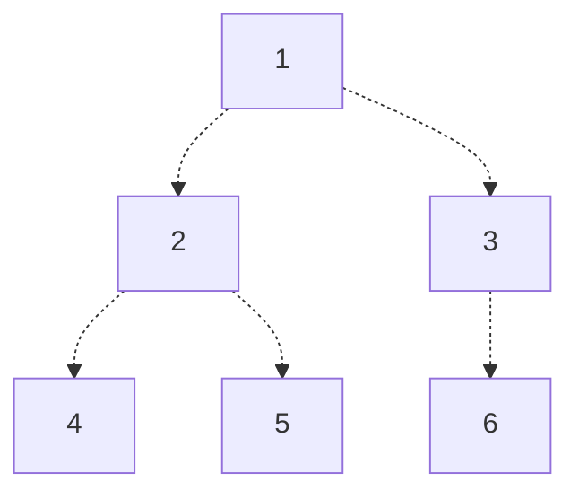

# Complete Binary Trees
Consider a **complete binary tree**, which is a binary tree satisfying the following two properties:
- Every level that is not the bottom-most level is full.
- The bottom-most level does not have to be full, but the nodes of the bottom-most level are all to the left.

For our purposes, we will $1$-index the nodes in our complete binary tree, top to bottom, and left to right. Note that some resources may $0$-index.



With this indexing scheme, we have the following properties of node parents and children:
- For a node with index $i$, it's children (if they exist) have indices $2i$ (left) and $2i + 1$ (right).
- For a node with index $i$, it's parent (if it exists) has index $\lfloor i/2 \rfloor$
- If the tree has $n$ nodes, then the node with the largest index that still has children has index $\lfloor n/2 \rfloor$.
  > It follows from this that the nodes with children have indices $1, 2, \dots, \lfloor n/2 \rfloor$.

Additionally, we have the following properties of levels in the complete binary tree:
- The leftmost node on level $k$ has index $2^k$.
- A node with index $i$ is on level $\lg(i)$
- If we have $n$ nodes, then the max level is level $\lfloor \lg(n) \rfloor$
- Given a node with index $i$, the number of levels below that node's level and the max level (inclusive) is $\lfloor \lg(n) \rfloor - \lfloor \lg(i) \rfloor + 1$


# Heaps
A **max heap** is a complete binary search tree in which each node's key is greater than or equal to the keys in its children. It follows from this that given a max heap, we can always find the largest element at index $1$.
> A **min heap** folows a similar definition, except that every node's key must be less than or equal to its children.

## Creating a Max Heap
How do we create a max heap?

### `maxheapify`
Consider a tree in which its two child subtrees are max heaps, but the tree itelf. In other words, the root node's key is less than that of one of its children. We can:
1. Swap the node with its largest child, ensuring the node and it's immediate children form a max heap.
2. Repeat this process for the child subtree whose root we just modified, to ensure that subtree continues to form a max heap.

Recursively repeating this process, we end with a max heap! This process is commonly known as `maxheapify`.

> [!Example]- Example: Maxheapify
> Consider the following complete binary tree
>
> ```mermaid
> graph TD
>       50 -.-> 40 & ...;
>       40 -.-> 1[30] & 45;
>       1[30] -.-> 10 & 5;
>       45 -.-> 2[30] & 42;
> ```
>
> To convert the subtree with root 40 into a max heap, we will recursively swap 40 with 45, then 42. Note that this does not guarantee the entire tree with root 50 is a max heap (we'll have to call the algorithm again!)
>
> ```mermaid
> graph TD
>       50 -.-> 45 & ...;
>       45 -.-> 1[30] & 42;
>       1[30] -.-> 10 & 5;
>       42 -.-> 2[30] & 40;
> ```

Looking at the time complexity of this algorithm, we see that:
- **Best Case**: If no child keys are larger, we do nothing, giving us $\Theta(1)$.
- **Worst Case**: If we have to swap to the bottom of the heap, then at most we'll have to perform $\lg(n)$ swaps (equal to the number of levels in the tree), giving us $\Theta(\lg(n))$.


### `converttomaxheap`
Now that we have the `maxheapify` function, we can use it to convert an entire tree into a max heap!

Starting at the last node with children, we simply call `maxheapify` on the nodes (in order):
$$
\lfloor \frac{n}{2} \rfloor, \dots, 3, 2, 1
$$
This will build our max heap starting from the children! Note that because we start from the last node with children and work backwards, we guarantee that for any node, its children must be max heaps.

Given this, we can find the time complexity of this algorithm to be:
- **Best Case**: If we don't do any swaps, we'll take constant time on $\lfloor n / 2 \rfloor$ nodes to get