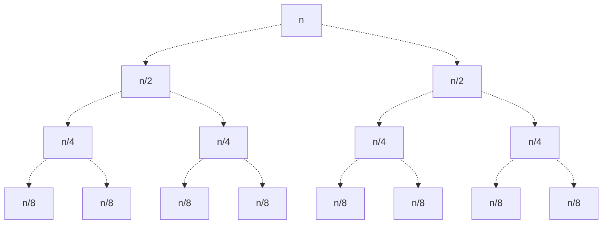

In this section, we discuss a new method for analyzing algorithm complexity.

# Recurrence Relations
A **recurrence relation** is an equation defining the value of a function in terms of earlier values.
> Typically, we'll have one (or more) base cases as well.

> [!Example]+ Example: Recurrence Relations
> $$
> T(n) = T(n/2) + c \qquad T(1) = d
> $$
> Where $c,d$ are constants.
> 
> This is in fact the recurrence relation for binary search, as the time required to process a list of length $n$ equals the check of the list's center, plus the time required to process the subsequent list of length $n/2$.

Given these recurrence relations, we can solve for specific values of $T(n)$! We can do this by recursively plugging in $n_0$ into our recurrence relation, until we reach a base case.

> [!Example]+ Example: Solving for Specific Values
> Consider the previous recurrence relation.
>
> We can find various times given specific input sizes $n_0$. 
> $$
> \begin{align*}
>       &T(2) = T(2/2) + c = T(1) + c = c + d \\
>       &T(4) = T(2) + c = [T(1) + c] + c = d + 2c
> \end{align*}
> $$
> > Note that recurrence relations often will need ceilings or floors to ensure that our values remain as integers (otherwise things don't make sense).

## Technique 1: Digging Down
We can use these recurrence relations to determine $\Theta$ of a function!
1. Using the relation to expand itself, we can continuously expand it until we find some general pattern.
2. Then, we solve for when this pattern ends with regard to the base case.
3. Finally, we sub in this base case to find our final time complexity.

This technique is known as **digging down**.
> Note that this technique only works for simple relations which have an easily identifiable pattern.

> [!Example]+ Example: Digging Down
> Consider the previous recurrence relation.
>
> Notice that
> $$
> \begin{align*}
>       T(n) &= T(n/2) + c \\
>            &= [T(n/2^2) + c] + c = T(n/2^2) + 2c \\
>            &= T(n/2^3) + 3c \\
>            &\vdots \\
>            &= T(n/2^k) + k \cdot c
> \end{align*}
> $$
>
> Note that by our base case, we will stop this expansion when
> $$
> \frac{n}{2^k} = 1 \to k = \lg(n)
> $$
>
> Giving us a final value of
> $$
> T(n) = T(n / 2^k) + k \cdot c = T(1) + c \lg(n) = d + c \lg(n)
> $$
> This gives us a time complexity of $\Theta(\lg(n))$!

> [!Example]- Example: Digging Down (2)
> $$
> T(n) = 2 T(n/2) + 5n \qquad T(1) = 7
> $$
>
> We expand it to find the following pattern:
> $$
> \begin{align*}
>       T(n) &= 2 T(n/2) + 5n \\
>            &= 2 [2 T(n/2^2) + 5 (n/2) ] + 5n = 2^2 T(n/2^2) + 2 (5n) \\
>            &= 2^3 T(n/2^3) + 3 (5n) \\
>            &\vdots \\
>            &= 2^k T(n/2^k) + k (5n)
> \end{align*}
> $$
>
> We find this pattern stops when we have
> $$
> \frac{n}{2^k} = 1 \to k = \lg(n)
> $$
>
> Giving us final time complexity $\Theta(n\lg(n))$.
> $$
> T(n) = 2^{\lg(n)} T(1) + \lg(n) (5n) = n \cdot 7 + 5n \lg(n)
> $$

## Technique 2: Recurrence Trees
Another method of solving recurrence relations involves the use of a **recurrence tree**. See the example below.

Consider the recurrence relation given by
$$
T(n) = 2T(n/2) + n \qquad T(1) = 3
$$

Say we want to find some value $T(n)$. We can do this by drawing a tree to represent our summation, where every level $i$ (and its leaves) represents the result of $T(n / 2^i)$. The combination of all the nodes in this tree will therefore sum to $T(n)$.



Note that every level represents the result of $T(n/2^i)$. Thus, we can find when our levels end by finding when
$$
n/2^i = 1 \to i = \lg(n)
$$

We can then sum up all our results to find our total time. We make a table to represent this for us.

| Level | Num Nodes | Time / Node | Level Total |
| - | - | - | - |
| $0$ | $1$ | $n$ | $n$ |
| $1$ | $2$ | $n/2$ | $n$ |
| $2$ | $4$ | $n/4$ | $n$ |
| $\vdots$ | | | |
| $\lg(n) - 1$ | $2^{\lg(n) - 1}$ | $n / 2^{\lg(n)-1}$ | $n$ |
| $\lg(n)$ | $2^{\lg(n)}$ | $7$ | $7 n$ |

Using this table, we find total sum as the sum of the level totals (rightmost column).
$$
T(n) = \sum_{i=0}^{\lg(n)-1} n + 7n = n \lg(n) + 7n
$$

> [!Example]- Example: Recurrence Tree
> Consider the recurrence tree given by
> $$
> T(n) = 2 T(n/4) + \sqrt{n} + 1 \qquad T(1) = 3
> $$
>
> We find its time complexity by drawing a recurrence tree.
> ```mermaid
> graph TD
>       r[sqrt n + 1];
> 
>       n1[sqrt n/4 + 1]; n2[sqrt n/4 + 1];
>       r -.-> n1 & n2;
>
>       n3[T n/8]; n4[T n/8];
>       n5[T n/8]; n6[T n/8];
>       n1 -.-> n3 & n4;
>       n2 -.-> n5 & n6;
> ```
>
> Looking at the leaves of this tree, we find that they are, progressively, $T(n/4^i)$, where $i \ge 0$ indicates the level in the tree. Given our base case $T(1)$, we find our leaf level at $i = \log_4(n)$.
>
> Summing up all our results to find our total time, we have the following table.
>
> | Level | Num Nodes | Time / Node | Level Total |
> | - | - | - | - |
> | $0$ | $1$ | $\sqrt{n} + 1$ | $\sqrt{n} + 1$ |
> | $1$ | $2$ | $\sqrt{n/4} + 1$ | $\sqrt{n} + 2$ |
> | $2$ | $4$ | $\sqrt{n/16} + 1$ | $\sqrt{n} + 4$ |
> | $\vdots$ | | | |
> | $\log_4(n) - 1$ | $2^{\log_4(n) - 1}$ |  | $n + 2^{\log_4(n) - 1}$ |
> | $\log_4(n)$ | $2^{\log_4(n)}$ | $3$ | $3 \cdot 2^{\log_4(n)}$ |
>
> We find our total time as
> $$
> \begin{align*}
>       T(n) &= 3 \cdot 2^{\log_4(n)} + \sum_{i=0}^{\log_4(n) - 1} \left( \sqrt{n} + 2^i \right) \\
>            &= 3 \sqrt{n} + \sum_{i=0}^{\sqrt{n}} \left(\sqrt{n} + 2^i \right)
> \end{align*}
> $$


## Master Theorem
Note that in many of the above recurrence relation examples, there's a common pattern among them. It appears as though we can generalize most recurrence relations in the form:
$$
T(n) = a T(n/b) + f(n)
$$

Given this general form, can we build a general rule for solving such recurrence relations?

Well, yes! Such a rule is given by the **master theorem**, described below.
> Note that the master theorem provides one of the lowest level generalizations for recurrence relations. There are numerous other higher-level theorems we do not cover!

> [!Abstract] Theorem: Master Theorem
> Suppose we have recurrence relation given by $T(n) = a T(n/b) + f(n)$, with $a,b \in \mathbb{Z}^+$ and $b > 1$.
>
> Then, we have 3 possible cases:
> 1. If $f(n) = O(n^c)$ and $\log_b a > c$ then $T(n) = \Theta(n^{\log_b(a)})$.
> 2. If $f(n) = \Theta(n^c \lg^k (n))$ and $\log_b (a) = c$ then $T(n) = \Theta(n^{\log_b(a)} \lg^{k+1}(n))$
> 3. If $f(n) = \Omega(n^c)$ and $\log_b(a) < c$ then $T(n) = \Theta(f(n))$.
>
> > Note: Case (3) requires a **regularity condition** on $f(n)$, which generally will be satisfied by most functions (and thus will not be our primary focus).

> [!Example]+ Example: Master Theorem (1)
> $$
> T(n) = 4 T(n/2) + n^2 + \lg(n)
> $$
>
> First, observe that $a = 4, b = 2, \log_2(4) = 2$. Furthermore, observe that $f(n) = n^2 + \lg(n)$.
>
>  We can see that $f(n) = \Theta(n^2)$, and furthermore, $\log_b a = \lg(2) = 2 = c$. Thus, we can use property (2) of the master theorem.
>
> By property (2) of the master theorem, we have
> $$
> T(n) = \Theta(n^2 \lg(n))
> $$

> [!Example]- Example: Master Theorem (2)
> $$
> T(n) = 3 T(n/4) + n \lg(n) + 1
> $$
>
> First, observe that $a = 3, b = 4, and \log_4 (3) > 0$. Furthermore, observe that
> $$
> f(n) = n \lg(n) + 1 = \Theta(n \lg(n))
> $$
>
> We see that $\log_4 (3) \ne c = 1$. Thus, we cannot apply property (2) of the master theorem.
>
> However, if $f(n) = \Theta(n \lg(n))$, then it is also $f(n) = \Omega(n)$! Because $\log_4 (3) < 1$, we find (by property 3)
> $$
> T(n) = \Theta(n \lg(n))
> $$