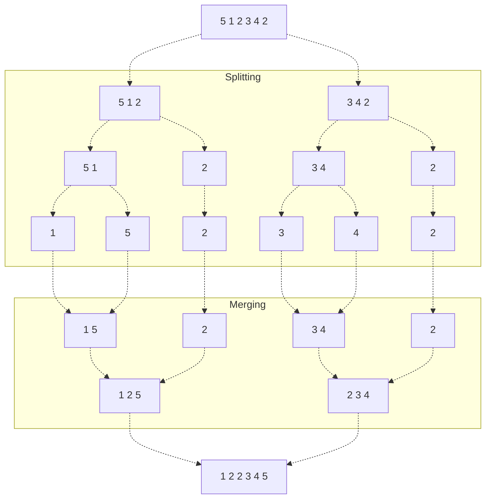
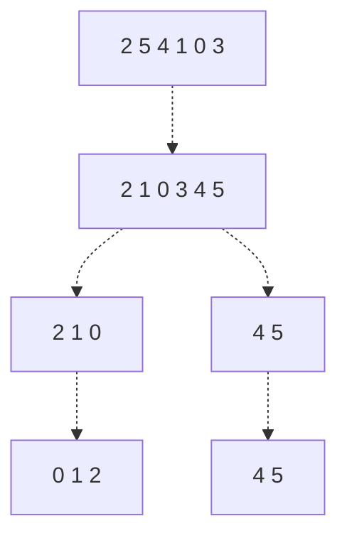
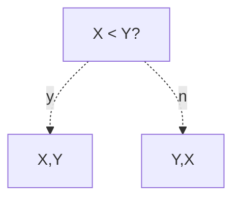

Oftentimes, we have an array of elements which we want **sorted** - in other words, we want to arrange the elements in such a way that for every two consecutive elements $E_1, E_2$,

$$
E_1 \le E_2
$$

In this section, we discuss various algorithms designed to accomplish this problem, known as **sorting algorithms**. We will also analyze these algorithms for their time and memory complexity, as well as various properties given below.

> [!Info] Stability
> Say we have two equal values $E_1, E_2$, where $E_1$ is to the left of $E_2$.
> 
> A sorting algorithm is **stable** if the relative positions of these values do not change relative to one another when the algorithm ends. Otherwise, the algorithm is **unstable**.

> [!Info] In Place
> A sorting algorithm is **in-place** if the algorithm operates on the list itself.


# Bubble Sort
Take a list $A$ of length $n$.

$$
A = [5,2,-3,1]
$$

We can iterate through adjacent pairs in the loop, and swap those out of order. Performing this $k$ times, we can guarantee that the final $k$ values are correct (and sorted) - the below example illustrates why.
1. For the first iteration,
   $$
   [5,2,-3,1] \to [2,-3,1,5]
   $$

2. For the second iteration,
   $$
   [2,-3,1,5] \to [-3,1,2,5]
   $$

3. For the third iteration,
   $$
   [-3,1,2,5] \to [-3,1,2,5]
   $$

We are done! Notice how in every iteration $i$ (starting from 1) of the loop, we guarantee the $n - i$ index of the loop correctly contains the $i^{th}$ largest element. Thus, performing this $n - 1$ times, we can guarantee a sorted array (if all $n - 1$ elements are sorted, the first element must be the smallest element).

```python
def bubble_sort(array):
    # i only needs to iterate n - 1 times
    for i in range(0, len(array) - 1):
        # we don't need to check / sort the ith last
        # elements of the array, as they're already sorted
        for j in range(0, n - i - 1):
            # swap the elements if not sorted
            if array[j] > array[j + 1]:
               temp = array[j]
               array[j] = array[j + 1]
               array[j + 1] = temp
```

We find the time complexity of Bubble Sort to be $\Theta(n^2)$, and the **auxilliary memory** to be $\Theta(1)$ (no extra memory). This implementation of Bubble Sort is stable and in-place.
> It's worth noting that regardless if the list is sorted, Bubble Sort **always** takes the same amount of time.

> [!Warning] Bubble Sort Stability
> While this implementation of Bubble sort is stable, that does not mean all implementations necessarily are. If we replaced the $>$ in line 8 with $\ge$, we would make our algorithm unstable!


# Selection Sort
Take a list $A$ of length $n$
$$
        A = [5,2,1,3]
$$

We can iterate through the list, and for every iteration, pick the next smallest element to place at the front of our list. So, for every iteration $i$, we find the $i^{th}$ smallest element and swap it with the element at the $i-1$ index.
1. For the first iteration (swap 1 with 5),
   $$
        [\underline{5},2,\underline{1},3] \to [1,2,5,3]
   $$
2. For the second iteration (swap 2 with itself),
   $$
        [1,\underline{2},5,3] \to [1,2,5,3]
   $$
3. For the third iteration (swap 3 with 5),
   $$
        [1,2,\underline{5},\underline{3}] \to [1,2,3,5]
   $$

We are done!
> Every iteration, we are essentially "picking" the next smallest element to place in the next position!

```python
def selection_sort(array):
    # for every iteration, we pick the next smallest
    # element to place at i
    for i in range(0, len(array) - 1):
        # find the ith smallest element
        min_index = i
        
        for j in range(i + 1, len(array)):
            if array[j] < array[min_index]:
               min_index = j

        # place next smallest element at index i
        temp = array[i]
        array[i] = array[min_index]
        array[min_index] = temp
```

Let's find the time complexity of Selection Sort. Let $c$ denote the amount of time it takes for line 9-10 to run. Then, we can find the $\Theta$ of Selection Sort using the number of times $t_{10}$ runs (as it has the most significant contribution to the runtime).
$$
\begin{align*}
        T(n) &= \sum_{i=0}^{n-2} \sum_{i+1}^{n-1} c = \sum_{i=0}^{n-2} c \left( (n-1) - (i+1) + 1 \right) \\
        &= c \sum_{i=0}^{n-2} n-i-1 = c \left(\sum_{i=0}^{n-2} (n-1) - \sum_{i=0}^{n-2} i \right) \\
        &= c \left( \ (n-1) \left((n-2) - 0 + 1\right) - \frac{(n-2)(n-1)}{2} \right) \\
        &= \Theta(n^2)
\end{align*}
$$
> Note that Selection Sort will always take the same amount of time!

Additionally we find,
- The auxilliary memory to be $\Theta(1)$.
- The algorithm is not stable, as our selection can swap and change the relative order of equal elements.
- The algorithm to be in-place, as no additional memory is used.


# Insertion Sort
Take a list $A$ of length $n$
$$
        A = [4,3,1,8,3,2]
$$
We can iterate through the list, and for every iteration $i$, we check if any value at index $j < i$ is greater than our value $A[i]$. We slide any element that $A[j] > A[i]$ to the right, and place $A[i]$ in the newly created place.
1. For the first iteration (3), we slide 4 to the right to obtain
   $$
        [4,\underline{3},1,8,3,2] \to [\underline{3},4,1,8,3,2]
   $$
2. For the second iteration (1), we slide 3, 4 to the right
   $$
        [3,4,\underline{1},8,3,2] \to [\underline{1},3,4,8,3,2]
   $$
3. For the third iteration (8), we slide nothing to the right
   $$
        [1,3,4,\underline{8},3,2] \to [1,3,4,\underline{8},3,2]
   $$
4. For the fourth iteration (3), we slide 4, 8 to the right
   $$
        [1,3,4,8,\underline{3},2] \to [1,3,\underline{3},4,8,2]
   $$
5. Finally, for the 5th iteration (2), we slide 3, 3, 4, 8 to the right
   $$
        [1,3,3,4,8,\underline{2}] \to [1,\underline{2},3,3,4,8]
   $$
> Note that after every iteration $i$, the subarray to the left of $i$ is sorted. We slowly build this sorted array until we are done!

```python
def insertion_sort(array):
    for i in range(1, len(array)):
        key = array[i] # cur value to insert

        # shift elements
        j = i - 1
        while j >= 0 and key < array[j]: 
              array[j + 1] = A[j]
              j -= 1

        array[j + 1] = k # insert 
```

Let's find the time complexity of Insertion Sort. However, note that the `while` loop will run differently depending on different conditions in the array.
- If the array is **sorted**, `while`'s body will not execute at all - the algorithm will run the fastest.
- If the array is **unsorted**, `while`'s body will always execute - the algorithm will run the slowest.

Because of this, we will analyze the time complexity of Insertion Sort based on these **best** and **worst** case executions. Let $t_{i}$ indicate the runtime cost of line $i$.
- For the **best case scenario** (sorted array), we know that the while loop doesn't execute - so, only lines $t_3, t_6, t_7, t_{11}$ contribute to the runtime (the while loop check at line 7 only occurs once).
  $$
        T(n) = (n - 1) (t_3 + t_6 + t_7 + t_{11}) = \Theta(n)
  $$
- For the **worst case scenario** (unsorted array), we assume the maximum iterations by the `while` loop, in that it will always run until $j = -1$. Thus, for every iteration $i$, the while loop will run for $i$ total iterations ($j=i-1, i-2, \dots, 0$).
  $$
        T(n) = \sum_{i=1}^n \left[ t_3 + t_6 + i (t_8 + t_9) + t_{11}) \right] = \dots = \Theta(n^2)
  $$

Notice that our time complexity depends on how sorted our array is! So, how can we measure an average time complexity for Insertion Sort?

We can do this using the concepts of **inversions**.

> [!Info] Inversion
> For a list $A$, an **inversion** is a pair of elements which is out of sorted order.
>
> > [!Example]- Example: Inversions
> >
> > For example, if we have $A = [4,3,1,8,3,2]$, we have the following inversions. To find the number of inversions, find how many elements to the right of an index are out of place with the current index.
> > - For 4 at index 0, we're out of order with 3, 1, 3, 2: $(0,1), (0,2), (0,4), (0,5)$.
> > - For 3 at index 1, we're out of order with 1, 2: $(1,2), (1,5)$
> > - For 1 at index 2, we're out of order with none of them to the right.
> > - For 8 at index 3, we're out of order with 3, 2: $(3,4), (3,5)$
> > - For 3 at index 4, we're out of order with 2: $(4,5)$
> >
> > We hvae a total of 9 inversions!
>
> Observe that the number of inversions in a list gives a measurement of how sorted a list is.
> - If the list is sorted, the number of inversions is 0.
> - If the list is unsorted, the number of inversions is equal to every pair of indices, $\frac{1}{2} C(n,2) = \frac{n(n-1)}{2}$.

Let $I$ be the number of inversions in $A$. Note that for every element shift we do, we fix one inversion. Thus, the number of times the while loop runs is equal to the number of inversions! This gives us runtime
$$
        T(n) = (n-1) (t_3 + t_6) + I(t_8 + t_9) + (n-1) t_{11}
$$
So for an "average list", we get $I = \frac{n(n-1)}{4}$, giving us the **average time complexity** of
$$
        T(n) = (n-1) (t_3 + t_6) + \frac{n(n-1)}{4} (t_8 + t_9) + (n-1) t_{11} = \dots = \Theta(n^2)
$$

Additionally, we find
- The auxilliary memory to be $\Theta(1)$.
- The algorithm is stable, as our insertion sort will not shift elements that are equal.
- The algorithm is in place, as it operates solely on the list itself.


# Merge Sort
Take a list $A$ of length $n$.
$$
A = [ 5, 1, 2, 3, 4, 2 ]
$$

We can use the divide and conquer approach to sort this array. By splitting the array in half, we can sort each subarray individually, and recombine them to form a larger sorted list. As our base case, we have a list of size 1, which is already sorted. 

Note that if we have two sorted lists, we can easily "zip" them together to form a larger list in $\Theta(n)$ time (keep picking the smallest / largest value from either list).
$$
\begin{align*}
        &[ 1, 2, 4, 10 ] &[ 3, 5, 6, 9, 11 ]\\
        &\to [1, 2, 3, 4, 5, 6, 9, 10, 11]
\end{align*}
$$

This process can be done recursively!

For example, given our above list, we sort it with MergeSort as follows: 


```python
def merge_sort(array):
    if len(array) > 1:
       middle = len(array) // 2

       left_subarray = array[0:middle-1]
       right_subarray = array[middle:len(array)]

       left_subarray = merge_sort(left_subarray)
       right_subarray = merge_sort(right_subarray)

       # merge lists by "zipping" them together.
       array = merge_sorted_lists(left_subarray, right_subarray)

    return array
```

Let's find the time complexity of merge sort! Merge sort yields the recurrence relation:
$$
T(n) = 2 T(n / 2) + \Theta(n)
$$

We can solve this relation easily using the Master Theorem. We find that $a = 2$, $b = 2$, and see that $\log_a b = \log_2 2 = 1$.

We see that we satisfy the Master Theorem (property 2) with $n = 1$ and $k = 0$, giving us
$$
T(n) = \Theta(n \lg (n))
$$
> Note that this represents all possible (best, worst, average) cases!

Additionally, we find
- The auxilliary memory is $\Theta(n)$, as at the highest recursive call, we use up $n$ space (lengths of left and right subarrays combined). Note that we disregard lower recursive calls, as when they finish, the memory is freed.
- The algorithm can be either stable or unstable, depending on the comparisons performed in the `merge_sorted_lists()` function.
- The algorithm is not in place, as it generates new lists every recursive call.

# Heap Sort
WIP


# Quick Sort
Take a list of list $A$.
$$

$$

We can use the divide and conquer to sort this array, in a different fashion than merge sort. Suppose we choose a value in the list, which we'll call the **pivot**. Then, we can rearrange the list such that all values $\le$ the pivot are to its left, and all values $\ge$ the pivot are to its right, in a process called **partitioning**.
> In the partitioning process, we find the first leftmost value greater than the pivot, and then find the first subsequent value less than the pivot, and swap them. We can repeat this until we are finished!
>
> $$
> \begin{align*}
> 2,\underline{5},4,\underline{1},0,3 \\
> 2,1,\underline{4},5,\underline{0},3 \\
> 2,1,0,\underline{5},4,\underline{3} \\
> 2,1,0,3,4,5
> \end{align*}
> $$

We can then perform this partitioning recursively on both sides of the array, to sort them and obtain a final sorted list!

For example, given our above list, we can sort it with Quick Sort as follows:


```python
def partition(array, left, right):
    pivot = array[right]
    t = left

    for i in range(left, right):
        if array[i] <= pivot:
           swap array[t] array[i]
           t+= 1

    swap array[t] array[right]
```
> This essentially will choose and swap for all values $<=$ the pivot, so that they are together! Then, after this, it will move the pivot to be just after this sequence.

What partition do we choose?

In theory we COULD choose any value in the list, though the pseudocode requires it to be the last value. Ideally, though, we want to choose the median as our pivot, as that will spread the work out the most evenly.

Let's now do quick sort. Say A is a global list.

```python
def quicksort(array, left, right):
    if left < right:
       # partition
       pivot_index = partition(array, left, right)

       # quicksort on the left and right halves
       quicksort(array, left, pivot_index)
       quicksort(array, pivot_index + 1, right)
```

We now find the time complexity. Note that the partition will take time equal to the length of the list.

Say for some recursive call, we have $k$ as the resulting pivot location. Then, after the partition, we see that we run quicksort on the left subarray of length $k$, and the right subarray of $n - k - 1$. This gives us recurrence relation
$$
T(n) = T(k) + T(n-k-1) + \Theta(n)
$$
1. Let's look at our worst case scenario. In the worst case, we always get our pivot at the end, giving us recurrence relation
   $$
   T(n) = T(0) + T(n-1) + \Theta(n) \to T(n) = \Theta(n^2)
   $$
   But the chances that our pivot is always at the end is really low!
2. Let's look at our best case scenario. In the best case, we always get our pivot in the middle, so we run quicksort on the subarrays of $n/2$.
   $$
   T(n) = 2 T(n/2) + \Theta(n) \to T(n) = \Theta(n \lg(n))
   $$

Let's now look at the average case. Note that the speed of partition is $\Theta(n)$ no matter what the order of our elements are. Instead, the only thing that impacts our speed is the pivot index.

So, what if we chose the pivot index (uniformly) randomly?
$$
T(n) = \frac{1}{n} \sum_{k=1}^{n-1} \left[ T(k) + T(n-k-1) + \Theta(n) \right]
$$
The solution to this is $T(n) = \Theta(n \lg(n))$.

We also see:
1. In place: yes
2. No auxiliary space
3. Not stable

---

# Limitations of Comparison-Based Sorting Algorithms
Note that all of the above sorting algorithms are all limited by one fact - they all rely on comparisons!

If we create another (any) sorting algorithm using comparisons, how fast could this sorting algorithm theoretically be?

We claim that in the worst-case, we cannot get better than $n \lg(n)$.

To sort a list with $n$ elements using comparisons, how many comparisons do we need?
1. For a list of length $2$, we need only one comparison
2. For a list of length $3$, we need at most 3 comparisons.

Let's form a decision tree based on this. For our list 2 case, we start with $[X,Y]$, and get decision tree



Now consider the list $[X,Y,Z]$ with bubble sort.. There are 6 ways this can be sorted:
1. Suppose $X < Y < Z$.
   - Is $X < Y$? Yes, no swap!
   - Is $Y < Z$? Yes!
   - Is $X < Y$? Yes! no rela decisions made
2. Suppose $X < Z < Y$.
   - Is $X < Y$? Yes!!
   - Is $Y < Z$? No, swap
   - Is $X < Z$? Yes!
3. Suppose $Z < X < Y$.
   - Is $X < Y$? Yes!
   - Is $Y < Z$? No, swap
   - Is $X < Y$? No, swap
4. Suppose $Y < X < Z$.
   - Is $X < Y$? No, swap to get $[Y,X,Z]$
   - Is $X < Z$? Yes
   - Is $Y < X$? Yes
5. Suppose $Y < Z < X$.
   - Is $X < Y$? No, swap to get $[Y,X,Z]$
   - Is $X < Z$? No, swap to get $[Y,Z,X]$
   - Is $Y < Z$? Yes, do nothing
6. Suppose $Z < Y < X$.
   - Is $X < Y$? No, swap to get $[Y,X,Z]$
   - Is $X < Z$? No, swap to get $[Y,Z,X]$
   - Is $Y < Z$? No, swap to get $[Z,Y,X]$

we can draw a decision tree for this