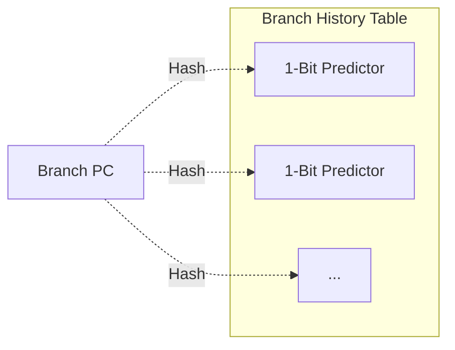
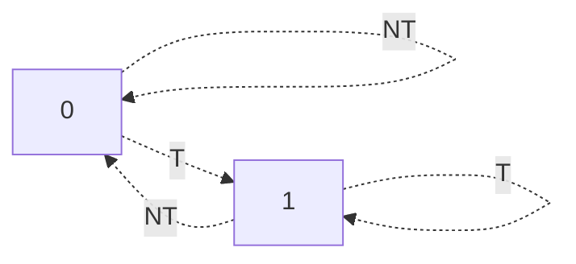
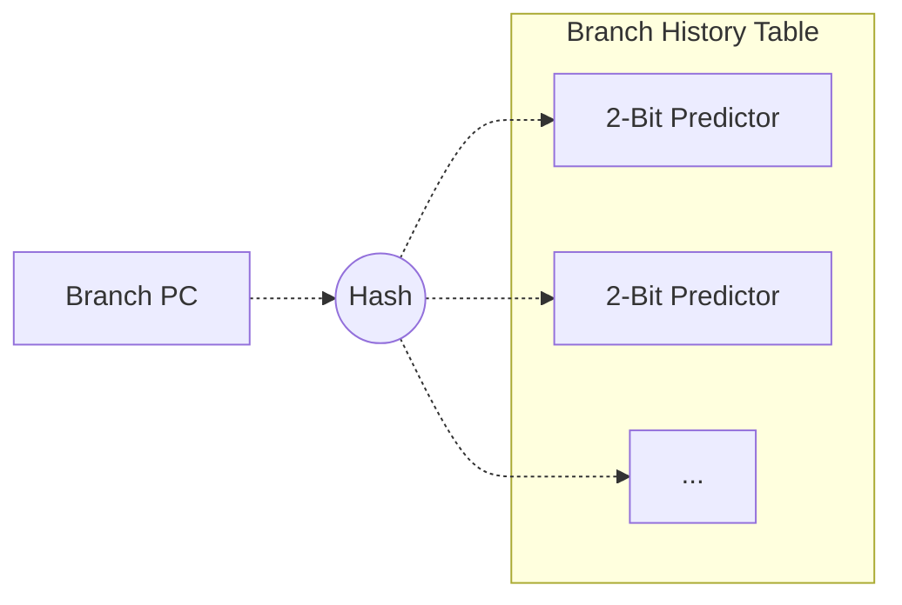
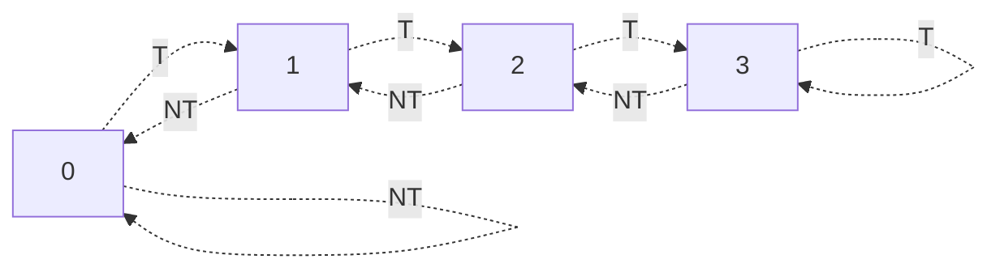
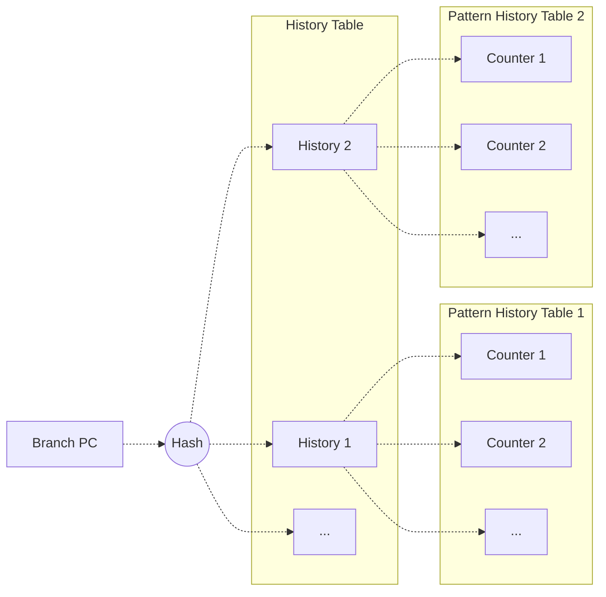
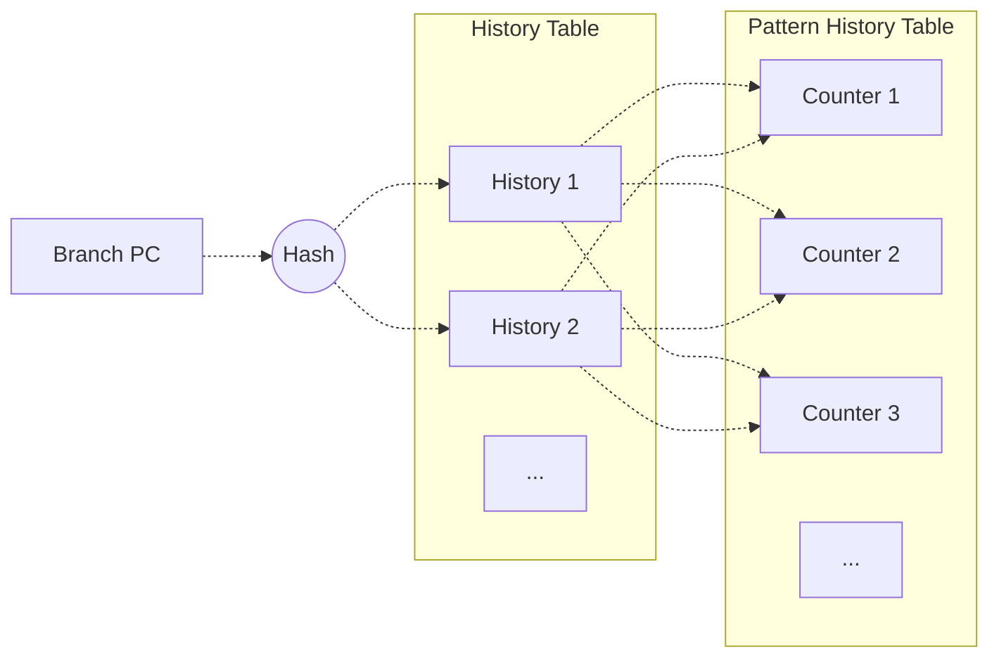
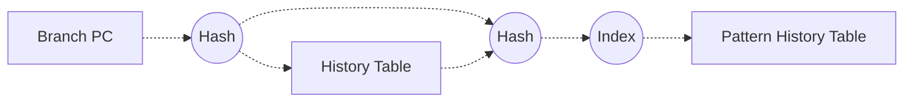
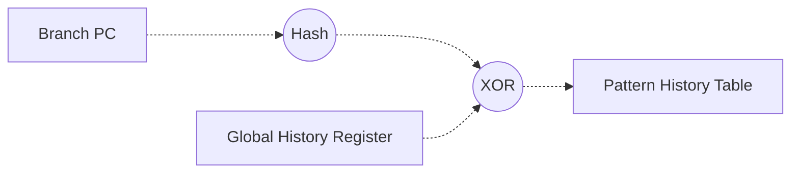

# Branching / Branch Prediction
## Problem Contextualized
**Hazards** are problems that reduce the performance of the pipeline. There are 3 kinds of hazards:
- **Data Hazards**: Dependencies between instructions preventing their overlapped execution
- **Structural Hazards**: There are not enough hardware resources for all combinations of instructions
- **Control Hazards**: A branch instruction may change the program counter (PC).

Here, we will look at control hazards. 

Consider a set of instructions. Without any branches, the processor can pipeline the instructions and execute one after the next. 

```bash
Instr 1
Instr 2
Instr 3
...
```

But at a branch, we may jump somewhere else in the program! Because of this, the pipeline won't know what command to fecth next, creating a stall. 

> [!Example] Example: Branching Issues
> ```bash
>   beq t4, t0, target
>   mul t5, t1, t3
>   sub t6, t0 t1
> 
> target:
>   add t1, t0, t2
> ```
> 
> Because of our branch instruction, we don't know whether or not `mul` or `add` instruction will execute next! So, we do not know what instruction to fetch into the pipeline.

This is pretty bad-- if our branch decision is finalized in the $N^{th}$ stage of the pipeline, then we won't know what instruction to fetch for about $N$ cycles! 
> Exacerbating this is the fact that branches are approximately 20% of all instructions in a program.

## Branch Prediction Overview
To minimize the effects of stalling, let's try to **predict the branch**! We may not know where the branch will jump, but we can at least make a guess and pre-fetch our guess into the pipeline.

Branch prediction asks the following question: *Given the PC of the current and previous instructions, what is the PC of the next instruction to fetch?*
- Is the instruction a branch?
  - No: No action needed
  - Yes: Then, we must ask **WHETHER** the branch is taken ($T$) or not taken ($N$).
    - Yes: Then, we must ask **WHERE** the target PC is.

In our basic pipeline architecture, branch prediction will work as follows:
1. IF: Fetch the branch instruction
2. ID: Identify the branch instruction. Use a branch predictor to guess where the branch will go, and fetch the predicted instruction into the pipeline.
   - Because we just decoded the instruction, we don't know where the branch will go! We only know that we have a branch at some PC.
3. EX: Execute and resolve the branch. If the prediction was right, do nothing. If the prediction was wrong, restart the fetch from the correct path. Update the predictor.

Note that for unconditional branches, we just need to predict **WHERE** the target is (as we know we'll always take the branch). For conditional branches, however, we need to predict **WHETHER** it's taken and **WHERE** it goes.

The below table illustrates the "difficulty" of predicting various branch types. 

| Branch Type | Whether | Where |
| :- | :-: | :-: |
| Unconditional Branches, Function Calls | Easy (Always) | Easy |
| Conditional Branches | Difficult | Easy | 
| Indirect Jumps, Function Returns | Easy (Always) | Not Easy |

> **Direct** means the target address is in the instruction. Otherewise, if it is an **indirect** branch, the target address is either stored in memory, or we need to calculate it.

Below we will describe various predictors, that will answer the WHETHER or WHERE question.

## WHERE: Branch Target Buffer 
Say we decode an instruction to find a branch. In the decode stage, we may not necessarily know where the branch will go, as the jump address could be in memory or a register.

So, supposing we predict a branch taken, what instruction should the instruction fetch next? 

We can make a guess on where the branch will jump to by referring to past branches! We can use a predictor table to store where past branches have jumped, to get the next address to fetch.

This is the idea behind the **Branch Target Buffer (BTB)**, a simple implementation of this!
1. Hash the PC address (often by taking the lowest $K$ bits). 
2. This hash will index the BTB table. If we match a BTB entry, we use the entry's PC to predict where to fetch the next instruction.
3. Once the branch resolves, update the value of the BTB if it jumped to the wrong location

> We can also use the BTB to predict if a branch is taken or not (if the entry exists or not), in a very rudimentary way!

We hash the PC to minimize storage costs. This is a very common theme; though note that hashing means we could get collisions as a result. 

With the BTB, we can guess where a branch will jump; but how do we know if a branch is taken or not? This is called **direction prediction**, and is needed for conditional branches.
> We will describe many forms of direction prediction below.

- **Static Prediction**: Use a fixed rule / pattern to make the prediction
- **Dynamic Prediction**: Use an up-to-date history to make the prediction.

> Dynamic prediction is based off of the assumption that the predicted direction is likely to be the same as the last time!

## WHETHER: Static Prediction
**Static Prediction** means we always predict one outcome. This is easy to implement!
- **NT**: We always predict the branch is not taken, we have 30-40% accuracy.
- **T**: We always predict the branch is taken, we have 60-70% accuracy.
- **Backward T, Forward NT (BTFNT)**: If we're in a loop, depending on the order of iteration we can predict if the branch is taken (since the loop will run more than a few iterations).

Say we have a predictor that always predicts NT. This requires no extra memory, and requires we simply just increment PC (which we already do anyways)! Then, if:
- 80% of our instructions are not branches, so we're always accurate on those.
- 20% of our instructions are branches, if 60% are taken, then we are accurate for an additional 8% of instructions.

> We count all instructions, so we can do speed-up calculations on the CPI.

Better accuracy means we have a better CPI, and these effects are increasingly significant on more advanced processors. A formula to calculate this is:
$$
CPI = \text{Ideal CPI} + \frac{1}{n} (\% \text{ Misprediction} * \text{Penalty} + \% \text{ Correct Prediction} * \text{Overhead}) 
$$
Where $n$ denotes the number of instructions until we see a branch (the frequency of branches)
> Penalty depends on the number of cycles we miss on an incorrect branch prediction.

## WHETHER: 1-Bit Branch Prediction
**One-Bit Branch Predictor**: Stores 1 bit per hashed branch to make predictions about the branch.



The one-bit branch predictor works as follows:
1. For the PC for a branch, we first hash the branch by taking the last $K$ bits of the address. 
2. We use this hash to access a 1-bit predictor for that branch in a $2^K$ size **Branch History Table (BHT)**. This predictor stores either 0 or 1.
   - If the predictor is 1, predict T.
   - If the predictor is 0, predict NT.
3. Once the branch resolves, update the value of the predictor.
   - If the branch was T, set the predictor to 1.
   - If the branch was NT, set the predictor to 0. 

> This  predictor predicts that the next branch will go the same way as the last branch at the same PC. 

This predicts well if take or not take a lot of times in sequence! However, any alternating pattern will lead to lots of mispredictions, as the predictor does not store enough information for the predictor to identify these patterns!

The state machine for the 1-bit predictor is as follows. The state the predictor is on tells us what the next prediction will be, and the arrows indicate how the state updates.



## WHETHER: 2-Bit Branch Prediction
The 1-bit predictor is really only good for long contiguous streams of T / NT, and is very sensitive to changes in this stream. We could make it more robust by adding more bits, so that it is less sensitive to change. 

In a **2-Bit Branch Predictor (2bC)**, the leading bit is used for the prediction, and another bit is used for **conviction**. The conviction bit gives us a measure of how confident we are in our prediction.



| Prediction Bit | Conviction Bit | Description | State |
| :-: | :-: | :- | - |
| 0 | 0 | Strong NT | 0 |
| 0 | 1 | Weak NT | 1 | 
| 1 | 0 | Weak T | 2 |
| 1 | 1 | Strong T | 3 |

The 2-bit branch predictor is a generalization of the 1-bit predictor.
1. For the PC for a branch, we first hash the branch by taking the last $K$ bits of the address. 
2. We use this hash to access our predictor for that branch in a $2^K$ size **Branch History Table (BHT)**. 
   - If the leading bit of the predictor is 1, predict T.
   - If the leading bit of the predictor is 0, predict NT.
3. Once the branch resolves, update the value of the predictor.
   - If the branch was T, increment the predictor by 1.
   - If the branch was NT, decrement the predictor by 1. 

We predict what the prediction bit is, and the conviction bit makes it longer for the predictor to change its prediction! This makes our predictor more robust, giving us an (overall) better accuracy!
> We also call our predictor a **counter**, as it essentially tracks the majority output for prediction. 

A state machine for this predictor is given below.



> [!Info] Bimodal Predictor
> So, we saw that increasing our number of bits in the predictor to 2 helped. What if we increased the bits even more? Well, it could help, but the cost of using the predictor would go up!
>
> The **Bimodal Predictor** uses $m$ bits as a counter to predict branches, in the same way as the 2-bit predictor. The leading bit is used as the prediction bit, and the remaining $m-1$ bits are used for conviction!
> > We will call our table the **Pattern History Table (PHT)**.

## WHETHER: N-Bit History Predictor (Local History Predictor)
Regardless of how many bits we add to our bimodal predictor, there are still patterns this will fail horribly at! For example, a pattern
$$
T \; N \; T \; N \; T \dots 
$$
Would not be predicted, no matter how many bits we use.

This pattern should be predictable, but we're having issues because its alternating! So, we need a predictor that can look at patterns instead of the majority output.

---

The **N-Bit History Predictor** uses bits to track the history of the last branches, and uses a different counter for each unique history to make different predictions! 



The N-bit history predictor works as follows. Suppose we use $N$ bits of history and $M$-bit counters:
1. For a branch PC, first hash by taking the last $K$ bits of the address.
2. We use this hash to access a history value in a $2^K$ size **History Table**.
3. Use the value of this history to access a specific counter in a $2^N$ size history's **Pattern History Table**.
4. Based on the counter's value, we make our prediction like in the Bimodal Predictor.
5. After the branch resolves:
   - Update the counter. Increment if T, decrement if NT.
   - Update the history. Bit-shift to remove the oldest history bit, and then add a 1 if T, 0 if NT.
     
     > For example, if our history value is 101, and the branch was T, then the resulting history value would be 011, telling us that the last branches were NTT (right to left).

For example, we can use a 1-bit **history** and a 2-bit **counter**. Our state would change as follows for the stream TNTNTNT: 

| State | Prediction | Outcome | Correct? |
| :-: | :- | :- | :- |
| (0, SN, SN) | N | T | No |
| (1, WN, SN) | N | N | Yes | 
| (0, WN, SN) | N | T | No |
| (1, WT, SN) | N | N | Yes |
| (0, WT, SN) | T | T | Yes | 
| (1, ST, SN) | N | N | Yes | 
| (0, ST, SN) | T | T | Yes |

> SN and ST stand for strong not taken / taken, respectively.

Now, our predictor is trained on the pattern!

The deeper our history, the more patterns we can cover! For example, a 3-bit history predictor would be as follows:

```bash
3 Bits: History Bits (Last 3 Outcomes)
2 Bits: Counter Bit (History = 000)
2 Bits: Counter Bit (History = 001)
2 Bits: Counter Bit (History = 010)
2 Bits: Counter Bit (History = 011)
2 Bits: Counter Bit (History = 100)
2 Bits: Counter Bit (History = 101)
2 Bits: Counter Bit (History = 110)
2 Bits: Counter Bit (History = 111)
```

In fact, we can look at these states and figure out the pattern that the predictor learned! Consider the following 3-bit history predictor:
```
History | Counters
  001   | 1 3 1 0 3 2 0 2
```

To figure out the pattern, **look at the strong states in the counters and their histories!**
- We have a strong state of 3, meaning T, for history 001 = NNT.
- We have a strong state of 0, meaning N, for history 011 = NTT.
- We have a strong state of 3, meaning T, for history 100 = TNN.
- We have a strong state of 0, meaning N, for history 110 = TTN.

Based on the strong states, we predict as follows:

| History | Prediction |
|:-------:|:-----------|
| NNT     | T          |
| NTT     | N          |
| TTN     | N          |
| TNN     | T          |
|         |            |

This gives us pattern NNTTNNTTNNTT... $(0011)^*$.

> [!Tip] 
> An $N$-bit history counter can predict all patterns of length $\le N + 1$!

While this works well, for many simpler patterns (like the above) we're wasting counters! In the example above, we only needed 4 counters, but have 8! This is wasted memory.
- For the history table, if we take $K$ bits of the PC, and have $N$ bits of history, then our table will have size $2^K + N$ (one history entry for each hashable value).
- For the pattern history table with a 2 bit counter, each entry has size $2^N * 2$, so thbe size of the table is $2^{N+1} * 2^K$

This gives us total space usage
$$
2^K * N + 2^{N+1} * 2^K
$$

The next predictor tries to optimize the history predictor by minimizing space use.

## WHETHER: Two-Level Adaptive Predictor
One simple way to reduce the amount of space usage is by using hashing. If we only use one PHT, then we'll take up less space overall!
> There is a possibility of hash collisions, but with enough counters, we can hopefully reduce our conflicts!

So, instead of multiple PHTs, we will have one large PHT that the history table indexes!
- If we take the first $K$ bits of the PC to index the history table, with $2^K$ entries and $N$ bits of history, we have history table size $2^K * N$.
- With only one PHT, and a 2 bit counter, we have size $2^N * 2$.



This gives us less total size 
$$
2^K * N + 2^{N+1}
$$

While this predictor is space efficient, conflicts can happen!

## WHETHER: P-Share Predictor
We can reduce the amount of conflicts in the previous table by **hashing** the index to the PHT as well. Hashing will (hopefully) distribute our indices more, reducing the amount of collisions!



This still has the same total size of
$$
2^K * N + 2^{N+1}
$$

While lowering the amount of collisions!

## WHETHER: G-Share Predictor 
In the previous predictors, we only looked at predictions on one branch with no relation to others. But in practice, the outcomes of branches are typically related to one another!

The **G-Share** predictor implements this, by tracking a global history. We use **one global history register** (GHR) which indexes the pattern history table! This GHR records the direction taken by the most recent n conditional branches.



## Tournament Predictor
No predictor is perfect for all situations! So, it may be reasonable to have a predictor for predictors, called a **tournament predictor**.


