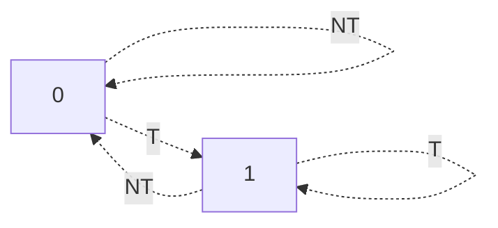
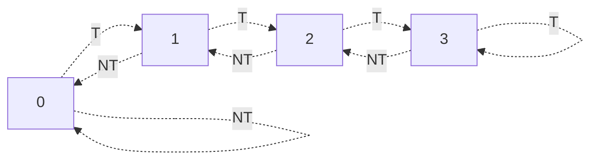
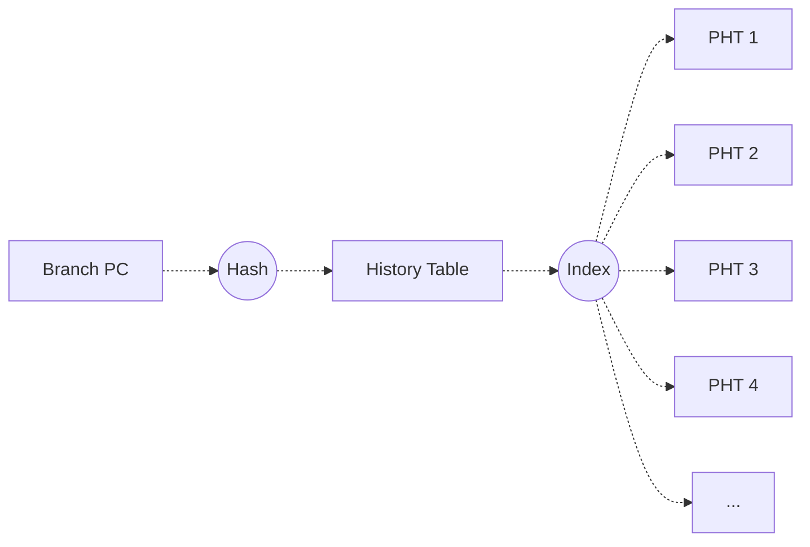
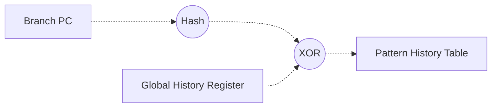
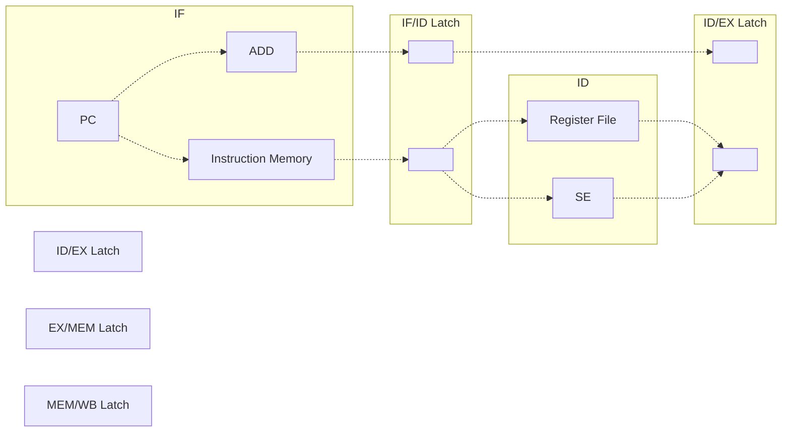

This is logistics + introduction to computer architecture! 

In general, the goal of computer architecture is to design computers that are suited for their intended use. To do this, we need to consider factors such as speed, power usage, and cost.

# Performance Metrics
## Metrics
**Performance** is a general term that we use to describe processors. But what actually is performance? 

There are two common measures for performance:
- **Latency (Response Time, Execution Time)**: How long it takes to perform a task
- **Throughput**: How often can a task be performed

Throughput is not always equal to 1 / latency! Below are some examples in which this equality fails to hold.

> [!Example]- Example: Throughput and Latency
> Say we have a throughput of 4 units / hour. This could be achieved with:
> 1. 1 processor with a latency of 15 min
> 2. 2 processors with a latency of 30 min
> 3. 4 processors with a latency of 1 hour
>
> Notice that if we have multiple processors, throughput is no longer equal to 1 / latency! In fact, it can be reasonable to accept more (slower) processors to achieve the same throughput, as slower processors are typically more expensive. 
> > This in fact, motivates the idea behind GPUs-- by combining tons of processors with high latency, they can still have a really high throughput!

## Comparing Performance
### Benchmarks
Say we have two machines that we know the throughput and latency of. Can you simply divide these values to find what machine is "faster"?

No! Machines run differently on different applications. So to compare performance, we need some way to benchmark our machines to measure performance.
> Ex (Standard Benchmarks): SPEC CPU2000, SPEC 2006, ...

Some examples of benchmarks include:
- **Real Applications**: Applications that are representative of actual use-cases, but are difficult to set up.
- **Kernels**: Representative parts of real applications, which are easier to set up and run. Often not representative of the entire application.
- **Toy Programs / Synthetic Benchmarks**: Tests / stress specific functions or features of your design. Often not very representative of real use-cases.

With benchmarks, it's useful to have some sort of representative number that summarizes performance. 
- **Arithmetic Mean**: Computes the average execution time, but gives more weight to longer-running programs.
  > Because of this, the arithmetic mean reports different statistics depending on the order in which we compute the speed-up. 
- **Weighted Arithmetic Mean**: Lets us adjust and emphasize more important programs; however, different weights can make different machines look better (making things very relative).
- **Geometric Mean**: Removes the bias that arithmetic mean has; generally better and reliable.

### Iron law
So we have a way to measure performance. But how do we know what's contributing to better or worse performance? 

> [!Info] Iron Law
> The **Iron Law** states that
> $$
> \begin{align*}
> \text{CPU Time} = \text{CPU Clock Cycles} \times \text{Clock Cycle Time} \\
> \text{CPU Time} = \text{Instruction Count} \times \text{Cycles Per Instruction} \times \text{Clock Cycle Time} \\
> \text{CPU Time} = \frac{\text{Seconds}}{\text{Program}} = \frac{\text{Instructions}}{\text{Program}} \times \frac{\text{Clock Cycles}}{\text{Instruction}} \times \frac{\text{Seconds}}{\text{Clock Cycle}}
> \end{align*}
> ```

The Iron Law breaks CPU time into its 3 influencing components, which can be influenced to increase performance.
- Instructions / Program: Influenced by the algorithm, compiler, or instruction set.
- Clock Cycles / Instruction: Influenced by the instruction set or processor design.
- Seconds / Clock Cycle: Influenced by the processor design, circuit design, or technology.

Out of these components, the **instruction set** and **processor design** are under the scope of Computer Architecture!

> [!Example]- Example: Iron Law Example
> Say we have a program that takes 33 billion instructions to run, and the CPU processes instructions at 2 cycles per instruction (CPI), with a clockspeed of 3 GHz.
>
> By the Iron Law, our CPU Time is
> $$
> \text{CPU Time} = (33 * 10^9) * 2 * (3 * 10^{-9}) = 22 \; \text{Seconds}
> $$

If instructions are unequal, we can modify `CPU Clock Cycles` in our equation as follows.
$$
\begin{align*}
\text{CPU Clock Cycles} = \left( \sum_{i=1}^n IC_i \times CPI_i \right) \\
\text{CPU Time} = \left( \sum_{i=1}^n IC_i \times CPI_i \right) \times \text{Clock Cycle Time}
\end{align*}
$$
> `IC` stands for instruction count (of some type of instruction), and `CPI` stands for clock cycles per instruction.

In a general program:

| Instruction Type | % of Instructions | CPI |
| :-: | :-: | :-: |
| Integer | 50% | 1.0 |
| Branch | 20% | 4.0 |
| Load | 20% | 2.0 | 
| Store | 10% | 3.0 |

So, in a general program with 50 Billion Instructions, Clock Speed of 2 GHz, we would have CPU Time

$$
\text{CPU Time} = (25B * 1 + 10B * 4 + 10 * 2 + 5 * 3) * (2 * 10^{-9}) = 50 \; \text{Seconds}
$$

> [!Tip] CPU Times
> Sometimes, we don't have to calculate the CPU Time! When making comparisons in computer architecture, if the program and clock speed is the same for two CPU, then we could just directly compare CPI (or IPC)!
>
> When doing this, note that Average IPC is not the same as 1 / Average CPI. You need to convert all IPC's to CPI's and then compute the average to find the Average IPC.

### Amdahl's Law
So far, we've developed a way to measure performance, and break it down into components that we can use Computer Architecture to improve.

Now how do we know what to improve? If we improve a component, how does this influence the overall speed-up?

> [!Info] Amdahl's Law
> Amdahl's Law states that
> $$
> \text{Overall Speedup} = \frac{1}{\left( (1 - \text{Fraction}_\text{Enhanced}) + \frac{\text{Fraction}_\text{Enhanced}}{\text{Speedup}_\text{Enhanced}} \right)}
> $$
> - The first component of the sum is the part that we didn't improve
> - The second component of the sumis the speed up we achieved on that enhancement
> 
> Note that $\text{Fraction}_\text{Enhanced}$ is the **percent of time** that is affected by the enhancement, not the percent of instructions!

From this law, we conclude that we want to **accelerate the common case**. Observe the following.

Say we have a 20x speedup on only 10% of the time. Then, we have an overall speedup of
$$
\text{Speedup}_1 = \frac{1}{(1 - 0.1) + \frac{0.1}{20}} = 1.105
$$

Now say we have a 1.2x speedup on 90% of the time. Then, we have an overall speedup of
$$
\text{Speedup}_2 = \frac{1}{(1 - 0.9) + \frac{0.9}{1.2}} = 1.176
$$

> [!Tip] Main Idea
> **Accelerate the common case**! Small speedups on most of the time is better than a speedup on only a portion of the time! Furthermore,
> - While we still achieve a speed-up in either case, sometimes significant speedups are a lot more expensive than minor speedups across the board.
> - If we keep improving only one part of a program, our overall speedup will increase slower and slower! There are diminishing returns for focusing only on one part of a program.


# Pipelining
## Pipelining Overview
Pipelining is a powerful concept that is used in every single computer today. We describe what pipelining is and consequences of it here.

When running an instruction, a simple processor generally goes through the following stages:
- **Instruction Fetch (IF)**: Read an instructinon
- **Instruction Decode (ID)**: See what the instruction is 
- **Execute (EX)**: Perform the computation
- **Memory (MEM)**: Access memory (if needed)
- **Write-Back (WB)**: Write the results back in registers

![[Classes/CMSC411/Resources/Pipeline-None.png]]

For the sake of example, say our stages take the following amount of time.

| Stage | Time | 
| :-: | :-: |
| IF | 1.0ns |
| ID | 0.6ns | 
| EX | 0.9ns |
| MEM | 1.2ns |
| WB | 0.4ns |

Without pipelining, our execution would be sequential, one stage after the next. Most instructions can be made to run in 1 clock-cycle, **but a clock-cycle must be long enough to complete even the most time-consuming instruction**! So, in our case, we would take 4.1ns to run our instruction. 

If we wanted to run many instructions, then we would be able to run an instructionn every 4.1ns. 
> Even if instructions could be faster, our 4.1ns instruction sets a lower bound on the clock speed time. 

---

To make this a bit better, let's break up an instruction among multiple clock cycles. If we place memory between each stage, then they can write their output to memory for the next stage to use! This separates the instruction up into independent stages. For example:
- Cycle 1, IF runs and writes to ID's input memory
- Cycle 2, ID runs and writes to EX's input memory
- Cycle 3, EX runs and writes to MEM's input memory
- Cycle 4, MEM runs and writes to WB's input memory

![[Classes/CMSC411/Resources/Pipeline-Memory.png]]
 
Now, our instruction takes 5 cycles! This actually increases the latency, and in our case, as the longest stage is MEM (1.2ns), our instruction would now take 6.0ns. Why would we want to do this?

This is worth it, because **we don't care about latency, we care about throughput!** Now, because each stage no longer needs to wait on the entire instruction to finish before executing the next, it can start on the next instruction immediately!
- Cycle 1, IF runs (1) and writes to ID's input memory.
- Cycle 2, ID runs (1) and writes to EX's input memory; IF starts the next instruction (2).
- Cycle 3, EX runs (1) and writes to MEM; ID runs instruction (2); IF starts the next instruction (3).

```
I1
IF -> ID -> EX -> MEM -> WB

I2    I1
IF -> ID -> EX -> MEM -> WB

I3    I2    I1
IF -> ID -> EX -> MEM -> WB

...
```

So, even though our single instruction takes 6.0ns, because our clock-cycle is defined by the longest stage (1.2ns), using pipelining we can now execute instructions every 1.2ns! Compare that with our 4.1ns time before. 
> Even though latency for a single instruction is higher, because we're "pre-loading" the overall throughput is higher! 

Some consequences of this:
- Pipelining takes more memory, and makes instructions take multiple clock cycles.
- Pipelining is bounded by the **longest stage**, as this sets a bound on the processor's clock time.
  - A consequence of this is the more balanced our stages are in time-execution, the better!
- We can add more stages, but the more stages we have, the higher the clock frequency needs to be for this to be useful! Whether we are able to do this or not depends on the technology we have. 

## Data Dependency Issues
Pipelining does not automatically ensure we get an instruction per cycle of 1 if our pipeline is balanced. Introducing pipeline can also introduce issues that can add stalls.

One notable issue is **data dependencies**. These are instructions whose execution depends on the previous one (meaning we cannot rearrange their order). This is a property of the **program alone**. 
Some data dependencies include:
- **Read-After-Write (RAW)**: A true dependency; instructions that need to read values written by previous instructions
  ```python
  # Here, the result of t0 is being used in the next instruction.
  # There is a dependency here.
  xor t0, t1, t2
  add t4, t1, t0
  ```
- **Write-After-Read (WAR)**: An anti-dependency; an instruction writes to a register that needs to be read from in a previous instruction. 
  ```python
  # Because xor uses t1, there is a dependency as add may change the
  # contents of t1.
  xor t0, t1, t2
  add t1, t2, t3
  ```
- **Write-After-Write (WAW)**: An output-dependency; two instructions write to the same register.
  ```python
  # Both instructions write to the same register, so order of execution
  # matters.
  xor t0, t1, t2
  add t0, t2, t4
  ```

Data dependencies are **hazards** if they result in incorrect execution-- this can happen with RAW dependencies if we pipeline.
> There is no hazard with WAR and WAW dependencies, though they are technically dependencies.

---

Consider the following example. Say we have the following RAW dependency: 
```python
xor t0, t1, t2
add t4, t0, t3
mul t5, t1, t3
```

In our pipeline, we have to execute as follows. Note the `nop` instruction (indicating no instruction). Reading occurs in ID:

| | IF | ID | EX | MEM | WB |
| :-: | :-: | :-: | :-: | :-: | :-: |
| 1 | xor | 
| 2 | add | xor | 
| 3 | mul | add | xor | 
| 4 | >mul< | >add< | `nop` | xor | 
| 5 | >mul< | >add< | `nop` | `nop` | xor | 
| 6 | >mul< | >add< | `nop` | `nop` | `nop` | 
| 7 | | mul | add | `nop` | `nop` |
| 8 | | | mul | add | `nop` |
| 9 | | | | mul | add | 
| 10 | | | | | mul |

> Each entry tells us what instruction the stage is on. `><` indicates the instruction is stalled (not doing anything).

If `add` were to execute on cycle 4, our program execution would be undefined! This is because $t0$ has not been updated with the results of `xor`, so `add` must wait until `xor` finishes and writes its output. 
> WB (Write-Back) is where `xor` writes its output, and EX (Execute) is where `add` reads in input.

How could we minimize the effects of hazards?

### Minimizing Stalls: Optimizing Execution
Optimize the order of command execution (if possible). RAW dependencies aren't a hazard if the instructions are far enough apart, as they won't in the pipeline at the same time. 

Optimize how the processor handles the commands. For example, most register files **write on the rising edge** of a clock cycle, and **read on the falling edge** of a clock cycle. This means that the dependent instruction can read the same cycle the value is written (so, cycle 6 doesn't need to stall).

### Minimizing Stalls: Data Forwarding
Another option is **data forwarding**. Our pipeline is forced to stall because `add` must wait on WB to finish, but the value is ready earlier than WB!

So, instead of waiting on WB, we could add a wire directly connecting the output of EX to its input, so that EX can proceed by reusing its output!

![[Classes/CMSC411/Resources/Pipeline-Forwarding.png]]

> Note that this wire has to be connected in the MEM stage, as if we connect EX's output directly to its input in the EX stage we could have timing issues. **There needs to be some sort of pipeline memory between the source and destination of the forwarding line**.

Note that this simple forwarding doesn't always work.
- If the dependent instructions are not next to each other, forwarding fails as the output of EX is no longer present.
- If the first instruction is a load, the data comes directly from memory, and the value will have to go to the WB stage to be used as input (it won't reach the data forwarding path).

It is possible to address the latter issue, by adding more wires! We can wire the output of MEM to our EX input!

However, this doesn't come without cost. Adding more wires not only is more complex, but also means we have to know how to choose between our different wires. This requires extra logic (which can stall things down).

Forwarding does not remove all possible pipeline stalls. Some stalls it cannot remove include:
- Long memory stalls
- Long latency instruction stalls
- Control dependency or branch stalls


**Hazards** are problems that reduce the performance of the pipeline. There are 3 kinds of hazards:
- **Data Hazards**: Dependencies between instructions preventing their overlapped execution
- **Structural Hazards**: There are not enough hardware resources for all combinations of instructions
- **Control Hazards**: A branch instruction may change the program counter (PC).

---

# Branching / Branch Prediction
## Problem Contextualized
**Hazards** are problems that reduce the performance of the pipeline. There are 3 kinds of hazards:
- **Data Hazards**: Dependencies between instructions preventing their overlapped execution
- **Structural Hazards**: There are not enough hardware resources for all combinations of instructions
- **Control Hazards**: A branch instruction may change the program counter (PC).

Here, we will look at control hazards. 

Consider a set of instructions. Without any branches, the processor can pipeline the instructions and execute one after the next. 

```bash
Instr 1
Instr 2
Instr 3
...
```

But at a branch, we may jump somewhere else in the program! Because of this, the pipeline won't know what command to fecth next, creating a stall. 

> [!Example] Example: Branching Issues
> ```bash
>   beq t4, t0, target
>   mul t5, t1, t3
>   sub t6, t0 t1
> 
> target:
>   add t1, t0, t2
> ```
> 
> Because of our branch instruction, we don't know whether or not `mul` or `add` instruction will execute next! So, we do not know what instruction to fetch into the pipeline.

This is pretty bad-- if our branch decision is finalized in the $N^{th}$ stage of the pipeline, then we won't know what instruction to fetch for about $N$ cycles! 
> Exacerbating this is the fact that branches are approximately 20% of all instructions in a program.

## Branch Prediction Overview
To minimize the effects of stalling, let's try to **predict the branch**! We may not know where the branch will jump, but we can at least make a guess and pre-fetch our guess into the pipeline.

Branch prediction asks the following question: *Given the PC of the current and previous instructions, what is the PC of the next instruction to fetch?*
- Is the instruction a branch?
  - No: No action needed
  - Yes: Then, we must ask **WHETHER** the branch is taken ($T$) or not taken ($N$).
    - Yes: Then, we must ask **WHERE** the target PC is.

In our basic pipeline architecture, branch prediction will work as follows:
1. IF: Fetch the branch instruction
2. ID: Identify the branch instruction. Use a branch predictor to guess where the branch will go, and fetch the predicted instruction into the pipeline.
   - Because we just decoded the instruction, we don't know where the branch will go! We only know that we have a branch at some PC.
3. EX: Execute and resolve the branch. If the prediction was right, do nothing. If the prediction was wrong, restart the fetch from the correct path. Update the predictor.

Note that for unconditional branches, we just need to predict **WHERE** the target is (as we know we'll always take the branch). For conditional branches, however, we need to predict **WHETHER** it's taken and **WHERE** it goes.

The below table illustrates the "difficulty" of predicting various branch types. 

| Branch Type | Whether | Where |
| :- | :-: | :-: |
| Unconditional Branches, Function Calls | Easy (Always) | Easy |
| Conditional Branches | Difficult | Easy | 
| Indirect Jumps, Function Returns | Easy (Always) | Not Easy |

> **Direct** means the target address is in the instruction. Otherewise, if it is an **indirect** branch, the target address is either stored in memory, or we need to calculate it.

Below we will describe various predictors, that will answer the WHETHER or WHERE question.

## WHERE: Branch Target Buffer 
Say we decode an instruction to find a branch. In the decode stage, we may not necessarily know where the branch will go, as the jump address could be in memory or a register.

So, supposing we predict a branch taken, what instruction should the instruction fetch next? 

We can make a guess on where the branch will jump to by referring to past branches! We can use a predictor table to store where past branches have jumped, to get the next address to fetch.

This is the idea behind the **Branch Target Buffer (BTB)**, a simple implementation of this!
1. Hash the PC address (often by taking the lowest $K$ bits). 
2. This hash will index the BTB table. If we match a BTB entry, we use the entry's PC to predict where to fetch the next instruction.
3. Once the branch resolves, update the value of the BTB if it jumped to the wrong location

> We can also use the BTB to predict if a branch is taken or not (if the entry exists or not), in a very rudimentary way!

We hash the PC to minimize storage costs. This is a very common theme; though note that hashing means we could get collisions as a result. 

With the BTB, we can guess where a branch will jump; but how do we know if a branch is taken or not? This is called **direction prediction**, and is needed for conditional branches.
> We will describe many forms of direction prediction below.

- **Static Prediction**: Use a fixed rule / pattern to make the prediction
- **Dynamic Prediction**: Use an up-to-date history to make the prediction.

> Dynamic prediction is based off of the assumption that the predicted direction is likely to be the same as the last time!

## WHETHER: Static Prediction
**Static Prediction** means we always predict one outcome. This is easy to implement!
- **NT**: We always predict the branch is not taken, we have 30-40% accuracy.
- **T**: We always predict the branch is taken, we have 60-70% accuracy.
- **Backward T, Forward NT (BTFNT)**: If we're in a loop, depending on the order of iteration we can predict if the branch is taken (since the loop will run more than a few iterations).

Say we have a predictor that always predicts NT. This requires no extra memory, and requires we simply just increment PC (which we already do anyways)! Then, if:
- 80% of our instructions are not branches, so we're always accurate on those.
- 20% of our instructions are branches, if 60% are taken, then we are accurate for an additional 8% of instructions.

> We count all instructions, so we can do speed-up calculations on the CPI.

Better accuracy means we have a better CPI, and these effects are increasingly significant on more advanced processors. A formula to calculate this is:
$$
CPI = \text{Ideal CPI} + \frac{1}{n} (\% \text{ Misprediction} * \text{Penalty} + \% \text{ Correct Prediction} * \text{Overhead}) 
$$
Where $n$ denotes the number of instructions until we see a branch (the frequency of branches)
> Penalty depends on the number of cycles we miss on an incorrect branch prediction.

## WHETHER: 1-Bit Branch Prediction
**One-Bit Branch Predictor**: Stores 1 bit per branch (hashed) to make predictions about the branch.

For $K$ bits of the branch instruction address, the 1-bit branch predictor stores a **Branch History Table (BHT)** of $2^k$ bits, 1 bit per entry. This bit tells us to predict if the branch was taken (1) or not (0). 

So, given a branch, we can predict if it's taken or not by:
1. Hashing the PC for the branch (often, by taking the lower $N$ bits of the address)
2. Access the branch history table. Predict taken if it has 1, predict not taken if it has 0. 
   - If taken, access the Branch Target Buffer to compute the target address
3. Update this entry of the branch history table with the result of the branch once resolved. 

> The predictor predicts that the next branch will go the same way as the last branch. 

This predicts well if take or not take a lot of times in sequence! However, any alternating pattern will lead to lots of mispredictions, as the predictor does not store enough information for the predictor to identify these patterns!

The state machine for the 1-bit predictor is as follows. The state the predictor is on tells us what the next prediction will be, and the arrows indicate how the state updates.



## 2-Bit Branch Prediction
Let's try adding more bits to our predictor, so it can predict more patterns correctly.

In a **2-Bit Branch Predictor (2bC)**, 1 bit is used for the prediction, and another bit is used for **conviction**. The conviction bit gives us a measure of how confident we are in our prediction.

| Prediction Bit | Conviction Bit | Description | State |
| :-: | :-: | :- | - |
| 0 | 0 | Strong NT | 0 |
| 0 | 1 | Weak NT | 1 | 
| 1 | 0 | Weak T | 2 |
| 1 | 1 | Strong T | 3 |

Like before, we predict what the prediction bit is. However, with a conviction bit, it makes it taken longer for us to change our prediction! The state machine is as follows.

In other words:
- 2bC counts up when the branch is taken, and counts down when the branch is not taken.
- 2bC predicts N if the counter is 0 or 1, and T if the counter is 2 or 3.

This makes our predictor more robust, giving us an (overall) better accuracy!

> [!Info] Bimodal Predictor
> So, we saw that increasing our number of bits in the predictor to 2 helped. What if we increased the bits even more? Well, it could help, but the cost of using the predictor would go up!
> > We will call our table the **Pattern History Table (PHT)**.
>
> The **Bimodal Predictor** uses $m$ bits as a counter to predict branches, in the same way as the 2-bit predictor. 

## N-Bit History Predictor
Regardless of how many bits we add, there are still patterns our predictors fail horribly at! For example, a pattern
$$
T \; N \; T \; N \; T \dots 
$$
Would not be predicted, no matter how many bits we use.

This pattern should be predictable, but we're having issues because its alternating! So, we need a predictor that can look at patterns.
> A solution to this is to look at the patterns instead of looking at the majority output! 

The **N-Bit History Predictor** uses some bits to track the history of the last branches, and based on these bits, makes different predictions for different histories!

For example, we can use a 1-bit **history** and a 2-bit **counter**. The history bit tells us the counter to use. So, for one entry:
```
1 Bit: History Bit
2 Bits: Counter Bit (History = 0)
2 Bits: Counter Bit (History = 1)
```
> The history bit is stored in the history table, which has history bits for each hashable PC value! Each history entry indexes one group of counters (Pattern History Table).

The predictor works as follows:
1. On a branch, use the history bit to determine what counter to use. 
2. Based on the value of the counter, predict where the branch will go.
3. On correct / incorrect, update the counter.
4. Based on the outcome of the branch, change the history bit.



For example, our state would change as follows for the stream TNTNTNT:
| State | Prediction | Outcome | Correct? |
| :-: | :- | :- | :- |
| (0, SN, SN) | N | T | No |
| (1, WN, SN) | N | N | Yes | 
| (0, WN, SN) | N | T | No |
| (1, WT, SN) | N | N | Yes |
| (0, WT, SN) | T | T | Yes | 
| (1, ST, SN) | N | N | Yes | 
| (0, ST, SN) | T | T | Yes |

> SN and ST stand for strong not taken / taken, respectively.

Now, our predictor is trained on the pattern!

The deeper our history, the more patterns we can cover! For example, a 3-bit history predictor would be as follows:
```
3 Bits: History Bits (Last 3 Outcomes)
2 Bits: Counter Bit (History = 000)
2 Bits: Counter Bit (History = 001)
2 Bits: Counter Bit (History = 010)
2 Bits: Counter Bit (History = 011)
2 Bits: Counter Bit (History = 100)
2 Bits: Counter Bit (History = 101)
2 Bits: Counter Bit (History = 110)
2 Bits: Counter Bit (History = 111)
```

In fact, we can look at these states and figure out the pattern that the predictor learned! Consider the following 3-bit history predictor:
```
History | Counters
  001   | 1 3 1 0 3 2 0 2
```

To figure out the pattern, **look at the strong states in the counters and their histories!**
- We have a strong state of 3, meaning T, for history 001 = NNT.
- We have a strong state of 0, meaning N, for history 011 = NTT.
- We have a strong state of 3, meaning T, for history 100 = TNN.
- We have a strong state of 0, meaning N, for history 110 = TTN.

Based on the strong states, we predict as follows:

| History | Prediction |
|:-------:|:-----------|
| NNT     | T          |
| NTT     | N          |
| TTN     | N          |
| TNN     | T          |
|         |            |

This gives us pattern NNTTNNTTNNTT... $(0011)^*$.

> [!Tip] 
> An $N$-bit history counter can predict all patterns of length $\le N + 1$!

While this works well, for many simpler patterns (like the above) we're wasting counters! In the example above, we only needed 4 counters, but have 8! This is wasted memory.
- For the history table, if we take $K$ bits of the PC, and have $N$ bits of history, then our table will have size $2^K + N$ (one history entry for each hashable value).
- For the pattern history table with a 2 bit counter, each entry has size $2^N * 2$, so thbe size of the table is $2^{N+1} * 2^K$

This gives us total space usage
$$
2^K * N + 2^{N+1} * 2^K
$$

The next predictor tries to optimize the history predictor by minimizing space use.

## Two-Level Adaptive Predictor
One simple way to reduce the amount of space usage is by using hashing. If we hash different branches to the same entries in the PHT, then we'll take up less space overall!
> There is a possibility of hash collisions, but with enough counters, we can hopefully reduce our conflicts!

So, instead of multiple PHTs, we will have one large PHT that the history table indexes!
- If we take the first $K$ bits of the PC to index the history table, with $2^K$ entries and $N$ bits of history, we have history table size $2^K * N$.
- With only one PHT, and a 2 bit counter, we have size $2^N * 2$.

This gives us less total size 
$$
2^K * N + 2^{N+1}
$$

While this predictor is space efficient, conflicts can happen!

## P-Share Predictor
We can reduce the amount of conflicts in the previous table by **hashing** the index to the PHT as well. Hashing will (hopefully) distribute our indices more, reducing the amount of collisions!


This still has the same total size of
$$
2^K * N + 2^{N+1}
$$

While lowering the amount of collisions!

## G-Share Predictor 
In the previous predictors, we only looked at predictions on one branch with no relation to others. But in practice, the outcomes of branches are typically related to one another!

The **G-Share** predictor implements this, by tracking a global history. We use **one global history register** (GHR) which indexes the pattern history table! This GHR records the direction taken by the most recent n conditional branches.
1. 



## Tournament Predictor
No predictor is perfect for all situations! So, it may be reasonable to have a predictor for predictors, called a **tournament predictor**.


---

- Branches and branch prediction
- Instruction-level parallelism (ILP)
- Memory hierarchy
- Multiprocessing
- Thread-level parallelism
- Cache coherence
- Memory consistency
- Many-core processors



---

Instruction Level Parallelism

# Context
## Main Idea
Let's now look at another way we can speed up our processor-- **instruction level parallelism (ILP)**. If we can execute more than one instruction at a time, then we'll get some massive performance gains! 

Suppose we have the following 3 instructions, which we want to execute in parallel.
| Instr | Cycle 1 | Cycle 2 | Cycle 3 | Cycle 4 | Cycle 5 |
| :-: | :-: | :-: | :-: | :-: | :-: | 
| `R1 = R2 + R3` | Fetch | Decode | Execute | | Write Back |
| `R4 = R1 - R5` | Fetch | Decode | Execute | | Write Back |
| `R6 = R5 x R9` | Fetch | Decode | Execute | | Write Back |

If we could execute all of these instructions at the same time, then we'd be able to save on a lot of time! However, this just isn't possible, because **instructions have data dependencies**. If we execute $I_1$ and $I_2$ at the same time, we'll get unexpected results because $I_2$ uses the output of $I_1$!
> Forwarding can't help either, since we can't forward in the same cycle!

> [!Info] Instruction Level Parallelism
> *Given a set of instructions, what instructions we can "legally" execute in parallel*?

Typically, we're looking to execute 3-6 instructions at a time. A CPU that can ideally run $N$ instructions per cycle is called N-way **superscalar**, where $N$ is called the **issue width**.
- **Scalar CPUs**: Execute one instruction at a time
- **Vector CPUs**: Execute one instruction at a time, but on vector data
- **Superscalar**: Can execute more than one unrelated instructions at a time

> [!Example]- Example: Simple Parallelism, Pentium Processors
> The simplest way we can do this is: 
> 1. Read and decode a few instructions each cycle
> 2. If our instructions are independent, then execute them at the same time
> 3. If they are not, execute them one at a time
> 
> This is in fact how the original Pentium processor worked, which fetched and executed up to 2 instructions at a time.
> ```mermaid
> flowchart LR
> Fetch -.-> Decode1;
> Decode1 -.-> 0[Decode2] -.-> 1[Execute] -.-> 2[Writeback];
> Decode1 -.-> 4[Decode2] -.-> 5[Execute] -.-> 6[Writeback];
> ```
> 
> The decode stage checks for multiple conditions:
> - Is there a data dependency?
> - Is there a resource conflict? 

## Data Dependencies
One of the major bottlenecks for ILP is data dependencies. These prevent us from executing instructions in parallel, as we risk creating unexpected outputs.

> [!Example]- Example: Data Dependency Bottlenecks
> Let's see an example of this below. Assume we already fetched and decoded the following instructions. If we want to execute **up to two instructions** at a time, then in program order, we would only have the following. 
> 
> | | Instr | Cycle | 
> | :-: | :- | :- |
> | 1 | ADD R1 R2, R3 | Cycle 1| 
> | 2 | SUB R4, R1, R5 | Cycle 2 |
> | 3 | XOR R6, R7, R8 | Cycle 2 |
> | 4 | SW R6, 0(R4) | Cycle 3 | 
> | 5 | MUL R6, R5, R9 | Cycle 3 | 
> | 6 |  ADD R7, R1, R6 | Cycle 4 |
> | 7 | SLR R6, R1, R4 | Cycle 4 |
> > Note how the dependency between I1, I2 forces it so that I1 has to run in its own cycle.
> 
> Here, we can execute 7 instructions in 4 cycles, giving us a CPI of 0.57.
> 
> Intuitively, we may think that increasing the number of instructions we can execute would give us a higher CPI! But this is not necessarily the case. To see why, suppose we execute up to 3 at a time now.
> | | Instr | Cycle | 
> | :-: | :- | :- |
> | 1 | ADD R1 R2, R3 | Cycle 1| 
> | 2 | SUB R4, R1, R5 | Cycle 2 |
> | 3 | XOR R6, R7, R8 | Cycle 2 |
> | 4 | SW R6, 0(R4) | Cycle 3 | 
> | 5 | MUL R6, R5, R9 | Cycle 3 | 
> | 6 |  ADD R7, R1, R6 | Cycle 4 |
> | 7 | SLR R6, R1, R4 | Cycle 4 |
> 
> Because of the data dependencies between I3/I4, I5/I6, we still only execute 7 instructions in 4 cycles! So, we gained nothing. The data dependencies between the instructions are preventing us from executing more instructions at once. 

To understand why these limits are happening, let's first review the types of data dependencies. 
- **Register Dependencies** occur due to data dependency conflicts with register numbers
  - **Read-After-Write (RAW; True Dependency)**: $A$ writes to a location, and $B$ reads from the same location. 
  - **Write-After-Read (WAR; Anti-Dependency)**: $A$ reads from a location, then $B$ writes to the location. If $B$ executes before $A$ has read its operand, then the operand will be lost. 
  - **Write-After-Write (WAW)** $A$ writes to a location, then $B$ writes to the same location. Here, there is an output dependency, as the location's value depends on what executes last.
- **Memory Dependencies** occur due the data dependency conflicts with memory addresses
  > Memory dependencies are hard to minimize, as because register names are known at decode, memory addresses are not known until execute!

A lot of ILP revolves around addressing these dependencies, so we can maximize parallel execution of instructions. More on addressing register dependencies later.

## Register Renaming (WAR, WAW)
In terms of register dependencies, **WAR and WAW are false dependencies**; they only occur because we have a limited number of registers, so at some point we're forced to re-use registers. 

So, a simple solution is to just add more registers! If we have more registers, and our compiler uses them, we'll have less false dependency issues. 

However, this isn't very scalable.
- If you write a value to a register in a loop body, then that same register will be reused every iteration. This introduces many false dependencies!
- If you make function calls, you could have similar register reuse!

Instead, we use **hardware register renaming**. The idea is to separate the physical registers from the registers in code: 
- **Architecture Registers**: Registers that the programmers and compilers use
- **Physical Registers**: Actual registers that the processor uses

This abstracts the use of registers in the code we write from the physical registers. Then, if we dynamically map our architecture registers to the physical registers, we can avoid dependency issues!

Consider the following set of instructions.
```
I1: ADD R1, R2, R3
I2: SUB R2, R1, R5
I3: AND R5, R11, R7
I4: OR R8, R5, R2
I5: XOR R2, R4, R11
```

To reduce the number of false dependencies, lets replace our registers with a temporary "name" for the values they contain / produce. So, after any write to a register, we will use the "same name" for all subsequent reads until the next write!
```
I1: ADD R1, R2, R3
I2: SUB R2, R1, R5
I3: AND S, R11, R7
I4: OR R8, S, R2
I5: XOR R2, R4, R11
```

This tells us what instructions depend on one another! We can rewrite this temporary name with another register to avoid a dependency. 

So, we will rename every instruction, and anytime we decode an instruction that will write to a register, we will change the name of the register. We store the mapping between architectural / physical registers in a **register allocation table (RAT)**.

After renaming, we won't have any false dependencies! We can use these renamed registers with physical registers at runtime, and select free registers to avoid conflicts.
> More on implementing this later.

# Dynamic Instruction Scheduling
To actually create a processor that uses ILP, we need to use **dynamic instruction scheduling**. 

## Theoretical Gains
To calculate our maximum theoretical ILP gain, we want to look at
$$
ILP = \text{\# Instructions} / \text{Longest Path}
$$
Where the longest path is determined by the number of true dependencies, we cannot remove them.
> We can however, ignore false dependencies, as we've (ideally) can assume that we've resolved them with other techniques.

> [!Example]- Example: ILP Calculation
> Suppose we have the following 5 instructions.
> 
> ```bash
> I1: ADD R10, R2, R3
> I2: SUB R6, R7, R8
> I3: XOR R5, R8, R9
> I4: MUL R4, R8, R9
> I5: XOR R11, R10, R5
> ```
> 
> We have 5 instructions, and our longest path is 2 ($I_1/I_5$ and $I_4/I_5$). Thus, the ILP of this set of instructions is 2.5.
>
> > To do these, it helps to draw a dependency graph, and trace the longest path.

ILP is a property of the program and compiler. No matter what processor you run the program on, the true dependencies restrict our maximum parallelism!

**Instructions Per Cycle (IPC)**, on the other hand, depends on the actual machine architecture. This is how much parallelism we can practically achieve!
> ILP the upper bound on IPC that we can achieve!

To increase the number of instructions we run per cycle, we use **scheduling**. Scheduling finds instructions whose dependencies have been resolved, so that they can be executed! 
> If the scheduling is **out of order**, then the instructions can be executed in any order, so long as their dependencies have already been resolved. 

> [!Example]- Example: Out-Of-Order Scheduling
> Consider the following instructions. With out-of-order scheduling, 1 MUL unit and 1 ADD / SUB / XOR unit,  what is the ILP and IPC?
> 
> ```bash
> I1: ADD R1, R2, R3
> I2: SUB R4, R1, R5
> I3: XOR R6, R7, R8
> I4: MUL R5, R8, R9
> I5: XOR R4, R8, R9
> ```
> 
> We have 1 dependency between $I_1 / I2$, and 5 instructions. Thus, our ILP is $5/2 = 2.5$.
> 
> However, practically speaking, per cycle we can execute the instructions as follows:
> 1. Cycle 1: I1 on ADD, I4 on MUL
> 2. Cycle 2: I2 on ADD
> 3. Cycle 3: I3 on ADD
> 4. Cycle 4: I5 on ADD
> 
> So, our IPC is $5/4$! Even though we have scheduling, we're limited by our hardware! So, achieving ILP depends both on smart scheduling, and the power of our hardware.

How do we practically implement a scheduler?

## Tomasulo's Algorithm
**Tomasulo's Algorithm** is a hardware algorithm that determines which instructions have inputs ready, and can be executed. The algorithm includes a form of register renaming to eliminate false dependencies.

To implement this algorithm, we need the following hardware components:
1. **Instruction Buffer / Queue**: Stores the instructions that we have available to us and can examine for parallelism. 
2. **Reservation Stations**: Stores instructions that are pending execution, and which operands are ready. Every entry in the reservation tables has a unique identifier.
3. **Register Allocation Table (RAT)**: Maps register names to reservation station IDs. If the value is 0, then it means the value is in the register file. Otherwise, the entry tells us what pending instruction (in one of the reservation stations) is writing to this register.
4. **The Register File**: The register file that stores the values in each register.

For the sake of example, let our tables store the following.

| | Instruction Queue | | RAT Table | | Register File |
| :-: | :- | :-: | :- | :-: | :- |
| 3 | F1 = F2 + F3 | F1 | 0 | F1 | 3.141693
| 2 | F4 = F1 - F2 | F2 | 1 | F2 | -1.00
| 1 | F1 = F2 / F3 | F3 | 0 | F3 | 2.718282
| | | F4 | 0 | F4 | 0.707107

| | Adder Reservation Station | | Mul/Div Reservation Station |
| :-: | :- | :-: | :- |
| 1 | F2 = F4 + F1 \| 0.7071 \| 0.35 | 4 |
| 2 | | 5 |
| 3 | 

This algorithm has 3 stages, which are ran each cycle. Together, they let us achieve instruction level parallelism. 

### Stage 1: Issue
The **issue stage** takes an instruction and places it in the reservation station, with data telling us what instructions it depends on.

Let's walk through an example of what the issue stage does. 
1. Pull from the instruction queue to get the next instruction.
   - Here, we pull `F1 = F2 / F3`. 
2. Find a free spot in a reservation station that can handle the instruction. 
   - We find spot (4) in the `Mul/Div` reservation station. 
3. Write this instruction to the free spot. Then, check the RAT table to see if the operands of the instruction are available or not.
   1. If the RAT table entry is 0, then the value is in the register file. We pull this value and store it in the reservation station.
   - For operand `F3`, the RAT table stores 0. So, pull the value, 2.718, from the register file, and store it in the reservation table. 
   2. If the RAT table is not 0, then the value is the output of a reservation station. We store this reference for now.
   - For operand `F2`, the RAT table stores 1. So, just store the reservation station spot for the operand to signify that we're waiting on this instruction.

4. Look at the instructions output register, and update the RAT table so that its entry points to this instruction's reservation station index. This tells subsequent instructions that the register output depends on this instruction. 
   - Here, our output register is `F1`. We update the RAT entry for `F1` to (4).

After the issue stage, our tables look as follows:

| | Instruction Queue | | RAT Table | | Register File |
| :-: | :- | :-: | :- | :-: | :- |
| 3 | F1 = F2 + F3 | F1 | `4` | F1 | 3.141693
| 2 | F4 = F1 - F2 | F2 | 1 | F2 | -1.00
| 1 | `F1 = F2 / F3` | F3 | 0 | F3 | 2.718282
| | | F4 | 0 | F4 | 0.707107

| | Adder Reservation Station | | Mul/Div Reservation Station |
| :-: | :- | :-: | :- |
| 1 | F2 = F4 + F1 ; 0.7071 ; 0.35 | 4 | `F1 = F2 / F3 ; (1) ; 2.718`
| 2 | | 5 |
| 3 | 

### Stage 2: Execute
The **execute stage** executes instructions whose operands are ready, and broadcasts the results so they can be used in other instructions. 
> To update reservation stations, the stage uses a **common data bus**, and broadcasts the output of the instruction.

Let's walk through an example of the execute stage. 
1. First, find the instructions whose operands are all populated. These instructions are ready to be executed.
   - We find that slot (1) is ready to be executed, standing for `F2 = F4 + F1`! 
2. Execute this instruction, using the compute units.
   - We execute `F2 = F4 + F1`, $0.7071 + \pi$!
3. Load results of the instruction so they can update the other hardware components. 

If several instructions are ready for one functional unit, we could use whichever instruction we want, with one exception-- **load/store instructions**. Load/store must be done in the correct order to avoid memory hazards.
> More on addresing load/store hazards later.

### Stage 3: Write
The **write stage** takes the result of an instruction, and updates the hardware components necessary for continuing the algorithm.

Let's walk through an example of the execute stage. 
1. Given the output of an instruction, broadcast it on the common data bus. Any reservation station depending on this output will pull and store this output.
   - Recall that our instruction is `F2 = F4 + F1`, with result 3.8487, in reservation entry (1).
   - Reservation station entry (4) depends on (1). So, it will overwrite (1) with the result, 3.8487. Now, this instruction is ready to execute in the next cycle!
2. Check the RAT table for the instruction's output. If the table stores the current reservation station index, then update the RAT table (to 0) and RF file (to store theoutput).
   - The RAT table for register `F2` is (1), which is our instruction! So, set this entry to 0, and update the RF file for `F2` to be 3.8487. 

    > It's important we only update **if the RAT table entry matches**. This implements register renaming, as the RAT table only stores the mapping for the last write to a register!

3. Free the reservation station entry for the instruction.
   - Free reservation entry (1). 

After the write stage, our components look like this:

| | Instruction Queue | | RAT Table | | Register File |
| :-: | :- | :-: | :- | :-: | :- |
| 3 | F1 = F2 + F3 | F1 | 4 | F1 | 3.141693
| 2 | F4 = F1 - F2 | F2 | `0` | F2 | `3.8487`
| 1 | F1 = F2 / F3 | F3 | 0 | F3 | 2.718282
| | | F4 | 0 | F4 | 0.707107

| | Adder Reservation Station | | Mul/Div Reservation Station |
| :-: | :- | :-: | :- |
| 1 | | 4 | F1 = F2 / F3 ; `3.8487` ; 2.718
| 2 | | 5 |
| 3 | 

> The reservation stations would likely have fetched more instructions by now, but for the sake of example we've committed this.

Note how through the common data bus, the reservation stations take care of register dependencies!

### Example: Deep Dive
> [!Example]- Example: Deep Dive
> Let's run Tomasulo's Algorithm on an instruction set. We start with the following assumptions:
> - All instructions are already in the instruction queue.
> - Only one instruction can be issued per cycle.
> - Only one instruction can be written per cycle (only one CDB). 
> - The result of an instruction is written in the last cycle of its execution. A dependent instruction can (if selected) begin its execution in the cycle after that.
> - The execution time of all instructions is two cycles, except for multiplication (which takes 4 cycles) and division (which takes 8 cycles).
> - The processor has one multiply/divide unit and one add/subtract unit.
> - The multiply/divide unit has two reservation stations and the add/subtract unit has four reservation stations.
> - None of the execution units is pipelined – each can only be executing one instruction at a time.
> - If a conflict for the use of an execution unit occurs when selecting which instruction should start to execute, the older instruction (the one that appears earlier in program order) has priority.
> - If a conflict for use of the CBD occurs, the result of the add/subtract unit has priority over the result of the multiply/divide unit.
> 
> ```bash
> Instruction          | Issue | Execute | Write
> I1: MUL F2, F1, F1   |   1   |   2     |   5
> I2: DIV F4, F4, F2   |   2   |   6     |   13
> I3: ADD F1, F2, F3   |   3   |   6     |   7
> I4: ADD F2, F1, F3   |   4   |   8     |   9
> I5: DIV F1, F4, F2   |   6   |   14    |   21
> I6: SUB F4, F4, F2   |   7   |   14    |   15
> I7: ADD F3, F1, F2   |      |        |
> I8: MUL F1, F2, F1   |      |        |
> I9: ADD F3, F3, F4   |      |        |
> I10: SUB F4, F5, F6  |      |        |
> ```
> 
> The general process is as follows:
> - When issuing an instruction, find the cycle when a reservation station is open. Find the cycle after the last issue. Take the max. 
> - When executing an instruction, (1) find the cycle after the issue, (2) find the cycles after dependencies write-back, (3) find the cycles the execution unit is available. Choose the closest cycle to (3), given that that cycle is greater than the max of 1,2.
> 
> 1. `I1: MUL F2, F1, F1`
>    - Issue: Issue I1 in C1.
>    - Execute / Write: C2 to C5, with writing in C5.
>      - I1 is issued in C1 -- it can only start executing in C2.
>      - All dependencies are resolved.
>      - An execution unit is available. 
> 2. `I2: DIV F4, F4, F2`
>    - Issue: Issue I2 in C2. Last issue was C1 (need C2 or later)
>      - There is an open RS entry for DIV, as only one slot is filled by I1.
>    - Execute / Write: C6 to C13, with writing in C13.
>      - I2 is issued in C2 -- it can only execute on C3 or later.
>      - I2 has a dependency on I1 -- it can only execute on C6 or later (I1 finishes Write)
>      - An execution unit will not be available until C6 (I1 using it).
> 3. `I3: ADD F1, F2, F3`
>    - Issue: C3.
>      - No ADD RS slots are filled. Last issue was C2 (need C3 or later)
>    - Execute / Write: C6 to C7, write in C7.
>      - I3 is issued in C3 -- it can only execute on C4 or later.
>      - I3 depends on I1 -- it can only execute on C6 or later.
>      - An execution unit is available.
> 4. `I4: ADD F2, F1, F3`
>    - Issue: C4.
>      - Only 1 ADD RS slot is filled by I3. Last issue was C3 (need C4 or later)
>    - Execute / Write: C8 to C9, write in C9
>      - I4 is issued in C4 -- it can only execute on C5 or later.
>      - I4 depends on I1 -- it can only execute on C6 or later
>      - An execution unit will not be available until C8 (I3 using it)
>  5. `I5: DIV F1, F4, F2`
>     - Issue: C6.
>       - Both RS slots filled by I1, I2 until C6, C14. Last issue was C4 (need C5 or later)
>     - Execute / Write: C14 to C21, write in C21
>       - I5 issued in C6 (C7 or later)
>       - I5 depends on I2 (C14 or later), I4 (C10 or later)
>       - Execution unit being used by I2 until C14.
> 6. `I6: SUB F4, F4, F2`
>    - Issue: C7
>      - Only 2 RS slots filled by I3, I4. Last issue was C6 (need C7 or later)
>    - Execute / Write: C14 to C15, write on C15
>      - I6 issued on C7 (C8 or later)
>      - I6 depends on I2 (C14 or later), I4 (C10 or later)
>      - Execution unit being used by I4 until C10
> 
> ... This process continues. The final table should be
> 
> ```bash
> Instruction          | Issue | Execute | Write
> I1: MUL F2, F1, F1   |   1   |   2     |   5
> I2: DIV F4, F4, F2   |   2   |   6     |   13
> I3: ADD F1, F2, F3   |   3   |   6     |   7
> I4: ADD F2, F1, F3   |   4   |   8     |   9
> I5: DIV F1, F4, F2   |   6   |   14    |   21
> I6: SUB F4, F4, F2   |   7   |   14    |   15
> I7: ADD F3, F1, F2   |   8   |   22    |   23
> I8: MUL F1, F2, F1   |   14  |   22    |   26
> I9: ADD F3, F3, F4   |   15  |   24    |   25
> I10: SUB F4, F5, F6  |   16  |   17    |   18
> ```
> > Note that I8 and I9 both write on C25-- because there is only one CDB, I9 writes first and forces I8 to execute after because of our assumptions.

### The Reorder Buffer (ROB)
Tomasulo's algorithm lets us execute instructions out of order to achieve instruction level parallelism! However, even if we reorder instructions, **we still must process instructions exactly in program order**! 

This is mainly because of control flow-- in the real world, we could have exceptions, or branch mispredictions. These can cause us to update registers in the incorrect order! 

> [!Example]+ Example: Branch Misprediction
> ```bash
> DIV R1 R3 R4
> DEQ R1 R3 Label
> ADD R3 R4 R5
> ```
> 
> Suppose here, we predict that a branch is not taken, so we execute the ADD and update R3. 
> 
> Later, we realize that the branch should have been taken. By this time, we've already updated R3 with a new wrong value! This will cause incorrect program behaviors.

To address this, we need to **deposit values to registers in order**! We do this using a **reorder buffer (ROB)**, which will:
- Remember the program order
- Keep the results of instructions until it is safe to write

One entry in the ROB stores the following:
- Type of instruction
- Destination register of instruction
- Result of instruction
- A flag indicating if the instruction was finished

Now, the register file will always store the "official" register state, which will only be updated in program order. 
> The ROB will now be the one storing our register results in the correct order, and will ensure our register file is updated in the order the program gave.

With the ROB, we modify our stages as follows. Now, the RAT table and reservation stations will store references to ROB entries, instead of reservation station entries:
- **Issue**: 
   1. Read the instruction from the buffer.
   2. Check if there is a RS entry, **and a ROB entry** available. Stall if there are no open entries.
   3. Read the RAT table, read available sources, and update RAT to point to the ROB entry.
   4. Write to the RS and ROB.
- **Execute**: No change
- **Write**: 
   1. Broadcast result on the data bus, for the reservation stations to grab.
   2. **Write the result back to the ROB entry, and mark the entry as finished execution**.
   3. Now that the ROB stores the results, free the reservation station.
   
   > Some architectures free the instruction's reservation station in execute, as the data will be in the ROB table after anyways. 

We also add a new stage, **commit**. 
1. For the oldest instruction in the ROB, check if instruction has been executed. 
2. If it has, write the result to the register file, or memory, depending on what the instruction is. We **always update the register file**, no matter what the RAT file says. However, if the ROB is:
   - Not the value in RAT, don't change the RAT entry.
   - The value in RAT, clear the RAT entry to 0, indicating the value is in the register file.
3. Advance the ROB-head to point to the next instruction.

> Commit MUST be in order. An instruction cannot commit until all prior instructions have committed.

## Improving Tomasulo's Algorithm 
Here, we discuss various ways we could potentially improve Tomasulo's algorithm (though they each come with their own tradeoffs). 

### Unified Reservation Stations
In the issue stage, we're forced to stall if there is no open RS. However, there could still be open RS slots for other compute units!

Figuring out the right number of RS per compute unit is difficult, as different programs have different distributions of instructions.

One way we could resolve this is by using a **unified reservation station**! Instead of different RS for different compute units, we just have 1 for every compute unit!
> This does mean things get a bit more complex though!

### Superscalar Processing
The current implementation of Tomasulo's algorithm give us one instruction per cycle, but cannot give us more! We need a lot of the components to be superscalar in order to achieve higher than 1 IPC.
- We need a superscalar fetch and decode
- We need more than one CDB to write the results of instructions
- We need a mechanism to dual-rename registers at the same time

In practice, modern processors do this! However, it comes at a cost of area, logic, and power.
