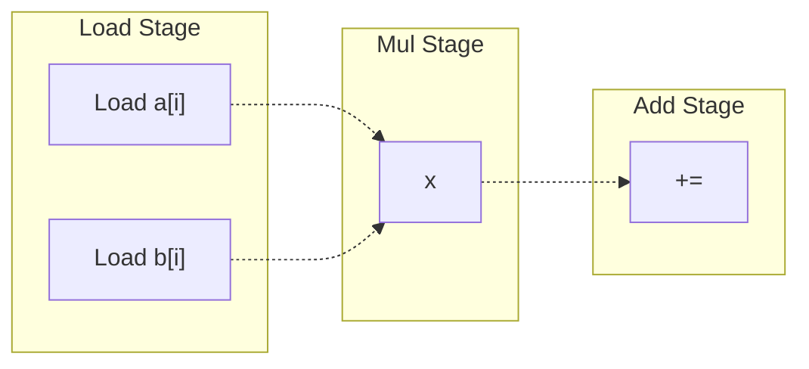
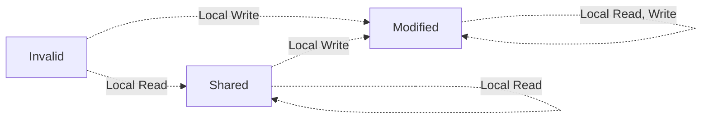
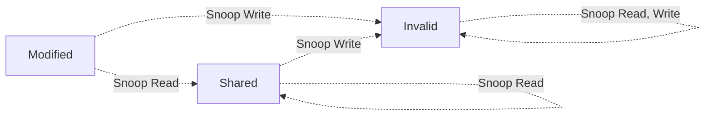
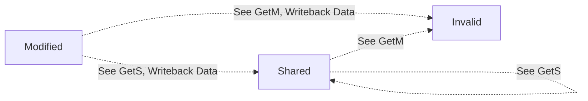

This is logistics + introduction to computer architecture! 

In general, the goal of computer architecture is to design computers that are suited for their intended use. To do this, we need to consider factors such as speed, power usage, and cost.

- [[Performance Metrics]]
- [[Pipelining]]
- [[Branch Prediction]]

Instruction Level Parallelism

# Context
## Main Idea
Let's now look at another way we can speed up our processor-- **instruction level parallelism (ILP)**. If we can execute more than one instruction at a time, then we'll get some massive performance gains! 

Suppose we have the following 3 instructions, which we want to execute in parallel.
| Instr | Cycle 1 | Cycle 2 | Cycle 3 | Cycle 4 | Cycle 5 |
| :-: | :-: | :-: | :-: | :-: | :-: | 
| `R1 = R2 + R3` | Fetch | Decode | Execute | | Write Back |
| `R4 = R1 - R5` | Fetch | Decode | Execute | | Write Back |
| `R6 = R5 x R9` | Fetch | Decode | Execute | | Write Back |

If we could execute all of these instructions at the same time, then we'd be able to save on a lot of time! However, this just isn't possible, because **instructions have data dependencies**. If we execute $I_1$ and $I_2$ at the same time, we'll get unexpected results because $I_2$ uses the output of $I_1$!
> Forwarding can't help either, since we can't forward in the same cycle!

> [!Info] Instruction Level Parallelism
> *Given a set of instructions, what instructions we can "legally" execute in parallel*?

Typically, we're looking to execute 3-6 instructions at a time. A CPU that can ideally run $N$ instructions per cycle is called N-way **superscalar**, where $N$ is called the **issue width**.
- **Scalar CPUs**: Execute one instruction at a time
- **Vector CPUs**: Execute one instruction at a time, but on vector data
- **Superscalar**: Can execute more than one unrelated instructions at a time

> [!Example]- Example: Simple Parallelism, Pentium Processors
> The simplest way we can do this is: 
> 1. Read and decode a few instructions each cycle
> 2. If our instructions are independent, then execute them at the same time
> 3. If they are not, execute them one at a time
> 
> This is in fact how the original Pentium processor worked, which fetched and executed up to 2 instructions at a time.
> ```mermaid
> flowchart LR
> Fetch -.-> Decode1;
> Decode1 -.-> 0[Decode2] -.-> 1[Execute] -.-> 2[Writeback];
> Decode1 -.-> 4[Decode2] -.-> 5[Execute] -.-> 6[Writeback];
> ```
> 
> The decode stage checks for multiple conditions:
> - Is there a data dependency?
> - Is there a resource conflict? 

## Data Dependencies
One of the major bottlenecks for ILP is data dependencies. These prevent us from executing instructions in parallel, as we risk creating unexpected outputs.

> [!Example]- Example: Data Dependency Bottlenecks
> Let's see an example of this below. Assume we already fetched and decoded the following instructions. If we want to execute **up to two instructions** at a time, then in program order, we would only have the following. 
> 
> | | Instr | Cycle | 
> | :-: | :- | :- |
> | 1 | ADD R1 R2, R3 | Cycle 1| 
> | 2 | SUB R4, R1, R5 | Cycle 2 |
> | 3 | XOR R6, R7, R8 | Cycle 2 |
> | 4 | SW R6, 0(R4) | Cycle 3 | 
> | 5 | MUL R6, R5, R9 | Cycle 3 | 
> | 6 |  ADD R7, R1, R6 | Cycle 4 |
> | 7 | SLR R6, R1, R4 | Cycle 4 |
> > Note how the dependency between I1, I2 forces it so that I1 has to run in its own cycle.
> 
> Here, we can execute 7 instructions in 4 cycles, giving us a CPI of 0.57.
> 
> Intuitively, we may think that increasing the number of instructions we can execute would give us a higher CPI! But this is not necessarily the case. To see why, suppose we execute up to 3 at a time now.
> | | Instr | Cycle | 
> | :-: | :- | :- |
> | 1 | ADD R1 R2, R3 | Cycle 1| 
> | 2 | SUB R4, R1, R5 | Cycle 2 |
> | 3 | XOR R6, R7, R8 | Cycle 2 |
> | 4 | SW R6, 0(R4) | Cycle 3 | 
> | 5 | MUL R6, R5, R9 | Cycle 3 | 
> | 6 |  ADD R7, R1, R6 | Cycle 4 |
> | 7 | SLR R6, R1, R4 | Cycle 4 |
> 
> Because of the data dependencies between I3/I4, I5/I6, we still only execute 7 instructions in 4 cycles! So, we gained nothing. The data dependencies between the instructions are preventing us from executing more instructions at once. 

To understand why these limits are happening, let's first review the types of data dependencies. 
- **Register Dependencies** occur due to data dependency conflicts with register numbers
  - **Read-After-Write (RAW; True Dependency)**: $A$ writes to a location, and $B$ reads from the same location. 
  - **Write-After-Read (WAR; Anti-Dependency)**: $A$ reads from a location, then $B$ writes to the location. If $B$ executes before $A$ has read its operand, then the operand will be lost. 
  - **Write-After-Write (WAW)** $A$ writes to a location, then $B$ writes to the same location. Here, there is an output dependency, as the location's value depends on what executes last.
- **Memory Dependencies** occur due the data dependency conflicts with memory addresses
  > Memory dependencies are hard to minimize, as because register names are known at decode, memory addresses are not known until execute!

A lot of ILP revolves around addressing these dependencies, so we can maximize parallel execution of instructions. More on addressing register dependencies later.

## Register Renaming (WAR, WAW)
In terms of register dependencies, **WAR and WAW are false dependencies**; they only occur because we have a limited number of registers, so at some point we're forced to re-use registers. 

So, a simple solution is to just add more registers! If we have more registers, and our compiler uses them, we'll have less false dependency issues. 

However, this isn't very scalable.
- If you write a value to a register in a loop body, then that same register will be reused every iteration. This introduces many false dependencies!
- If you make function calls, you could have similar register reuse!

Instead, we use **hardware register renaming**. The idea is to separate the physical registers from the registers in code: 
- **Architecture Registers**: Registers that the programmers and compilers use
- **Physical Registers**: Actual registers that the processor uses

This abstracts the use of registers in the code we write from the physical registers. Then, if we dynamically map our architecture registers to the physical registers, we can avoid dependency issues!

Consider the following set of instructions.
```
I1: ADD R1, R2, R3
I2: SUB R2, R1, R5
I3: AND R5, R11, R7
I4: OR R8, R5, R2
I5: XOR R2, R4, R11
```

To reduce the number of false dependencies, lets replace our registers with a temporary "name" for the values they contain / produce. So, after any write to a register, we will use the "same name" for all subsequent reads until the next write!
```
I1: ADD R1, R2, R3
I2: SUB R2, R1, R5
I3: AND S, R11, R7
I4: OR R8, S, R2
I5: XOR R2, R4, R11
```

This tells us what instructions depend on one another! We can rewrite this temporary name with another register to avoid a dependency. 

So, we will rename every instruction, and anytime we decode an instruction that will write to a register, we will change the name of the register. We store the mapping between architectural / physical registers in a **register allocation table (RAT)**.

After renaming, we won't have any false dependencies! We can use these renamed registers with physical registers at runtime, and select free registers to avoid conflicts.
> More on implementing this later.

# Dynamic Instruction Scheduling
To actually create a processor that uses ILP, we need to use **dynamic instruction scheduling**. 

## Theoretical Gains
To calculate our maximum theoretical ILP gain, we want to look at
$$
ILP = \text{\# Instructions} / \text{Longest Path}
$$
Where the longest path is determined by the number of true dependencies, we cannot remove them.
> We can however, ignore false dependencies, as we've (ideally) can assume that we've resolved them with other techniques.

> [!Example]- Example: ILP Calculation
> Suppose we have the following 5 instructions.
> 
> ```bash
> I1: ADD R10, R2, R3
> I2: SUB R6, R7, R8
> I3: XOR R5, R8, R9
> I4: MUL R4, R8, R9
> I5: XOR R11, R10, R5
> ```
> 
> We have 5 instructions, and our longest path is 2 ($I_1/I_5$ and $I_4/I_5$). Thus, the ILP of this set of instructions is 2.5.
>
> > To do these, it helps to draw a dependency graph, and trace the longest path.

ILP is a property of the program and compiler. No matter what processor you run the program on, the true dependencies restrict our maximum parallelism!

**Instructions Per Cycle (IPC)**, on the other hand, depends on the actual machine architecture. This is how much parallelism we can practically achieve!
> ILP the upper bound on IPC that we can achieve!

To increase the number of instructions we run per cycle, we use **scheduling**. Scheduling finds instructions whose dependencies have been resolved, so that they can be executed! 
> If the scheduling is **out of order**, then the instructions can be executed in any order, so long as their dependencies have already been resolved. 

> [!Example]- Example: Out-Of-Order Scheduling
> Consider the following instructions. With out-of-order scheduling, 1 MUL unit and 1 ADD / SUB / XOR unit,  what is the ILP and IPC?
> 
> ```bash
> I1: ADD R1, R2, R3
> I2: SUB R4, R1, R5
> I3: XOR R6, R7, R8
> I4: MUL R5, R8, R9
> I5: XOR R4, R8, R9
> ```
> 
> We have 1 dependency between $I_1 / I2$, and 5 instructions. Thus, our ILP is $5/2 = 2.5$.
> 
> However, practically speaking, per cycle we can execute the instructions as follows:
> 1. Cycle 1: I1 on ADD, I4 on MUL
> 2. Cycle 2: I2 on ADD
> 3. Cycle 3: I3 on ADD
> 4. Cycle 4: I5 on ADD
> 
> So, our IPC is $5/4$! Even though we have scheduling, we're limited by our hardware! So, achieving ILP depends both on smart scheduling, and the power of our hardware.

How do we practically implement a scheduler?

## Tomasulo's Algorithm
**Tomasulo's Algorithm** is a hardware algorithm that determines which instructions have inputs ready, and can be executed. The algorithm includes a form of register renaming to eliminate false dependencies.

To implement this algorithm, we need the following hardware components:
1. **Instruction Buffer / Queue**: Stores the instructions that we have available to us and can examine for parallelism. 
2. **Reservation Stations**: Stores instructions that are pending execution, and which operands are ready. Every entry in the reservation tables has a unique identifier.
3. **Register Allocation Table (RAT)**: Maps register names to reservation station IDs. If the value is 0, then it means the value is in the register file. Otherwise, the entry tells us what pending instruction (in one of the reservation stations) is writing to this register.
4. **The Register File**: The register file that stores the values in each register.

For the sake of example, let our tables store the following.

| | Instruction Queue | | RAT Table | | Register File |
| :-: | :- | :-: | :- | :-: | :- |
| 3 | F1 = F2 + F3 | F1 | 0 | F1 | 3.141693
| 2 | F4 = F1 - F2 | F2 | 1 | F2 | -1.00
| 1 | F1 = F2 / F3 | F3 | 0 | F3 | 2.718282
| | | F4 | 0 | F4 | 0.707107

| | Adder Reservation Station | | Mul/Div Reservation Station |
| :-: | :- | :-: | :- |
| 1 | F2 = F4 + F1 \| 0.7071 \| 0.35 | 4 |
| 2 | | 5 |
| 3 | 

This algorithm has 3 stages, which are ran each cycle. Together, they let us achieve instruction level parallelism. 

### Stage 1: Issue
The **issue stage** takes an instruction and places it in the reservation station, with data telling us what instructions it depends on.

Let's walk through an example of what the issue stage does. 
1. Pull from the instruction queue to get the next instruction.
   - Here, we pull `F1 = F2 / F3`. 
2. Find a free spot in a reservation station that can handle the instruction. 
   - We find spot (4) in the `Mul/Div` reservation station. 
3. Write this instruction to the free spot. Then, check the RAT table to see if the operands of the instruction are available or not.
   1. If the RAT table entry is 0, then the value is in the register file. We pull this value and store it in the reservation station.
   - For operand `F3`, the RAT table stores 0. So, pull the value, 2.718, from the register file, and store it in the reservation table. 
   2. If the RAT table is not 0, then the value is the output of a reservation station. We store this reference for now.
   - For operand `F2`, the RAT table stores 1. So, just store the reservation station spot for the operand to signify that we're waiting on this instruction.

4. Look at the instructions output register, and update the RAT table so that its entry points to this instruction's reservation station index. This tells subsequent instructions that the register output depends on this instruction. 
   - Here, our output register is `F1`. We update the RAT entry for `F1` to (4).

After the issue stage, our tables look as follows:

| | Instruction Queue | | RAT Table | | Register File |
| :-: | :- | :-: | :- | :-: | :- |
| 3 | F1 = F2 + F3 | F1 | `4` | F1 | 3.141693
| 2 | F4 = F1 - F2 | F2 | 1 | F2 | -1.00
| 1 | `F1 = F2 / F3` | F3 | 0 | F3 | 2.718282
| | | F4 | 0 | F4 | 0.707107

| | Adder Reservation Station | | Mul/Div Reservation Station |
| :-: | :- | :-: | :- |
| 1 | F2 = F4 + F1 ; 0.7071 ; 0.35 | 4 | `F1 = F2 / F3 ; (1) ; 2.718`
| 2 | | 5 |
| 3 | 

### Stage 2: Execute
The **execute stage** executes instructions whose operands are ready, and broadcasts the results so they can be used in other instructions. 
> To update reservation stations, the stage uses a **common data bus**, and broadcasts the output of the instruction.

Let's walk through an example of the execute stage. 
1. First, find the instructions whose operands are all populated. These instructions are ready to be executed.
   - We find that slot (1) is ready to be executed, standing for `F2 = F4 + F1`! 
2. Execute this instruction, using the compute units.
   - We execute `F2 = F4 + F1`, $0.7071 + \pi$!
3. Load results of the instruction so they can update the other hardware components. 

If several instructions are ready for one functional unit, we could use whichever instruction we want, with one exception-- **load/store instructions**. Load/store must be done in the correct order to avoid memory hazards.
> More on addresing load/store hazards later.

### Stage 3: Write
The **write stage** takes the result of an instruction, and updates the hardware components necessary for continuing the algorithm.

Let's walk through an example of the execute stage. 
1. Given the output of an instruction, broadcast it on the common data bus. Any reservation station depending on this output will pull and store this output.
   - Recall that our instruction is `F2 = F4 + F1`, with result 3.8487, in reservation entry (1).
   - Reservation station entry (4) depends on (1). So, it will overwrite (1) with the result, 3.8487. Now, this instruction is ready to execute in the next cycle!
2. Check the RAT table for the instruction's output. If the table stores the current reservation station index, then update the RAT table (to 0) and RF file (to store theoutput).
   - The RAT table for register `F2` is (1), which is our instruction! So, set this entry to 0, and update the RF file for `F2` to be 3.8487. 

    > It's important we only update **if the RAT table entry matches**. This implements register renaming, as the RAT table only stores the mapping for the last write to a register!

3. Free the reservation station entry for the instruction.
   - Free reservation entry (1). 

After the write stage, our components look like this:

| | Instruction Queue | | RAT Table | | Register File |
| :-: | :- | :-: | :- | :-: | :- |
| 3 | F1 = F2 + F3 | F1 | 4 | F1 | 3.141693
| 2 | F4 = F1 - F2 | F2 | `0` | F2 | `3.8487`
| 1 | F1 = F2 / F3 | F3 | 0 | F3 | 2.718282
| | | F4 | 0 | F4 | 0.707107

| | Adder Reservation Station | | Mul/Div Reservation Station |
| :-: | :- | :-: | :- |
| 1 | | 4 | F1 = F2 / F3 ; `3.8487` ; 2.718
| 2 | | 5 |
| 3 | 

> The reservation stations would likely have fetched more instructions by now, but for the sake of example we've committed this.

Note how through the common data bus, the reservation stations take care of register dependencies!

### Example: Deep Dive
> [!Example]- Example: Deep Dive
> Let's run Tomasulo's Algorithm on an instruction set. We start with the following assumptions:
> - All instructions are already in the instruction queue.
> - Only one instruction can be issued per cycle.
> - Only one instruction can be written per cycle (only one CDB). 
> - The result of an instruction is written in the last cycle of its execution. A dependent instruction can (if selected) begin its execution in the cycle after that.
> - The execution time of all instructions is two cycles, except for multiplication (which takes 4 cycles) and division (which takes 8 cycles).
> - The processor has one multiply/divide unit and one add/subtract unit.
> - The multiply/divide unit has two reservation stations and the add/subtract unit has four reservation stations.
> - None of the execution units is pipelined – each can only be executing one instruction at a time.
> - If a conflict for the use of an execution unit occurs when selecting which instruction should start to execute, the older instruction (the one that appears earlier in program order) has priority.
> - If a conflict for use of the CBD occurs, the result of the add/subtract unit has priority over the result of the multiply/divide unit.
> 
> ```bash
> Instruction          | Issue | Execute | Write
> I1: MUL F2, F1, F1   |   1   |   2     |   5
> I2: DIV F4, F4, F2   |   2   |   6     |   13
> I3: ADD F1, F2, F3   |   3   |   6     |   7
> I4: ADD F2, F1, F3   |   4   |   8     |   9
> I5: DIV F1, F4, F2   |   6   |   14    |   21
> I6: SUB F4, F4, F2   |   7   |   14    |   15
> I7: ADD F3, F1, F2   |      |        |
> I8: MUL F1, F2, F1   |      |        |
> I9: ADD F3, F3, F4   |      |        |
> I10: SUB F4, F5, F6  |      |        |
> ```
> 
> The general process is as follows:
> - When issuing an instruction, find the cycle when a reservation station is open. Find the cycle after the last issue. Take the max. 
> - When executing an instruction, (1) find the cycle after the issue, (2) find the cycles after dependencies write-back, (3) find the cycles the execution unit is available. Choose the closest cycle to (3), given that that cycle is greater than the max of 1,2.
> 
> 1. `I1: MUL F2, F1, F1`
>    - Issue: Issue I1 in C1.
>    - Execute / Write: C2 to C5, with writing in C5.
>      - I1 is issued in C1 -- it can only start executing in C2.
>      - All dependencies are resolved.
>      - An execution unit is available. 
> 2. `I2: DIV F4, F4, F2`
>    - Issue: Issue I2 in C2. Last issue was C1 (need C2 or later)
>      - There is an open RS entry for DIV, as only one slot is filled by I1.
>    - Execute / Write: C6 to C13, with writing in C13.
>      - I2 is issued in C2 -- it can only execute on C3 or later.
>      - I2 has a dependency on I1 -- it can only execute on C6 or later (I1 finishes Write)
>      - An execution unit will not be available until C6 (I1 using it).
> 3. `I3: ADD F1, F2, F3`
>    - Issue: C3.
>      - No ADD RS slots are filled. Last issue was C2 (need C3 or later)
>    - Execute / Write: C6 to C7, write in C7.
>      - I3 is issued in C3 -- it can only execute on C4 or later.
>      - I3 depends on I1 -- it can only execute on C6 or later.
>      - An execution unit is available.
> 4. `I4: ADD F2, F1, F3`
>    - Issue: C4.
>      - Only 1 ADD RS slot is filled by I3. Last issue was C3 (need C4 or later)
>    - Execute / Write: C8 to C9, write in C9
>      - I4 is issued in C4 -- it can only execute on C5 or later.
>      - I4 depends on I1 -- it can only execute on C6 or later
>      - An execution unit will not be available until C8 (I3 using it)
>  5. `I5: DIV F1, F4, F2`
>     - Issue: C6.
>       - Both RS slots filled by I1, I2 until C6, C14. Last issue was C4 (need C5 or later)
>     - Execute / Write: C14 to C21, write in C21
>       - I5 issued in C6 (C7 or later)
>       - I5 depends on I2 (C14 or later), I4 (C10 or later)
>       - Execution unit being used by I2 until C14.
> 6. `I6: SUB F4, F4, F2`
>    - Issue: C7
>      - Only 2 RS slots filled by I3, I4. Last issue was C6 (need C7 or later)
>    - Execute / Write: C14 to C15, write on C15
>      - I6 issued on C7 (C8 or later)
>      - I6 depends on I2 (C14 or later), I4 (C10 or later)
>      - Execution unit being used by I4 until C10
> 
> ... This process continues. The final table should be
> 
> ```bash
> Instruction          | Issue | Execute | Write
> I1: MUL F2, F1, F1   |   1   |   2     |   5
> I2: DIV F4, F4, F2   |   2   |   6     |   13
> I3: ADD F1, F2, F3   |   3   |   6     |   7
> I4: ADD F2, F1, F3   |   4   |   8     |   9
> I5: DIV F1, F4, F2   |   6   |   14    |   21
> I6: SUB F4, F4, F2   |   7   |   14    |   15
> I7: ADD F3, F1, F2   |   8   |   22    |   23
> I8: MUL F1, F2, F1   |   14  |   22    |   26
> I9: ADD F3, F3, F4   |   15  |   24    |   25
> I10: SUB F4, F5, F6  |   16  |   17    |   18
> ```
> > Note that I8 and I9 both write on C25-- because there is only one CDB, I9 writes first and forces I8 to execute after because of our assumptions.

### The Reorder Buffer (ROB)
Tomasulo's algorithm lets us execute instructions out of order to achieve instruction level parallelism! However, even if we reorder instructions, **we still must process instructions exactly in program order**!

This is mainly because of control flow-- in the real world, we could have exceptions, or branch mispredictions. These can cause us to update registers in the incorrect order! 

> [!Example]+ Example: Branch Misprediction
> ```bash
> DIV R1 R3 R4
> DEQ R1 R3 Label
> ADD R3 R4 R5
> ```
> 
> Suppose here, we predict that a branch is not taken, so we execute the ADD and update R3. 
> 
> Later, we realize that the branch should have been taken. By this time, we've already updated R3 with a new wrong value! This will cause incorrect program behaviors.

To address this, we need to **deposit values to registers in order**! We do this using a **reorder buffer (ROB)**, which will:
- Remember the program order
- Keep the results of instructions until it is safe to write

It does this by storing entries, which contain
- Type of instruction
- Destination register of instruction
- Result of instruction
- A flag indicating if the instruction was finished

And a head, tail indicating what instructions have yet to be "committed" in order (more on that later).

| | Type | Dest. | Value | Finished |
| :-: | - | - | - | - |
| ROB1 | DIV | R2 | 9 | Yes |
| ROB2 - HEAD | MUL | R1 | 12 |
| ROB3 | ADD | R3 | 3 | Yes |
| ROB4 - TAIL | MUL | R1 | 36 | Yes | 
| ROB5 | | | | |


Now, the register file will always store the "official" register state, which will only be updated in program order. 
> The ROB will now be the one storing our register results in the correct order, and will ensure our register file is updated in the order the program gave.

With the ROB, we modify our stages as follows. Now, the RAT table and reservation stations will store references to ROB entries, instead of reservation station entries:
- **Issue**: 
   1. Read the instruction from the buffer.
   2. Check if there is a RS entry **and a ROB entry** available. 
      - Stall if there are no open entries.
   3. Read the RAT table, read available sources, and update RAT to point to the ROB entry.
   4. Write to the RS and ROB.
- **Execute**: No change
- **Write**: 
   1. Broadcast result on the data bus, for the reservation stations to grab.
   2. **Write the result back to the ROB entry, and mark the entry as finished execution**.
   3. Now that the ROB stores the results, free the reservation station.
   
   > Some architectures free the instruction's reservation station in execute, as the data will be in the ROB table after anyways. 

We also add a new stage, **commit**. 
- **Commit**:
  1. For the oldest instruction in the ROB, check if instruction has been executed.
  2. If it has, write the result to the register file, or memory, depending on what the instruction is. We **always update the register file**, no matter what the RAT file says. However, if the ROB is:
     - Not the value in RAT, don't change the RAT entry.
     - The value in RAT, clear the RAT entry to 0, indicating the value is in the register file.
  3. Advance the ROB-head to point to the next instruction.

> Commit MUST be in order. An instruction cannot commit until all prior instructions have committed.

With the ROB in place, we can now use it to recover from branch mispredictions and exceptions **by flushing** all data after the instruction where the misprediction / exception occurred. If the exception occurred on instruction I, then we:
- Flush the ROB for all entries after instruction I
- Point all RAT entries to their corresponding RFs
- Clear all of the RS entries and anything in the execution units

Then, resume execution with the correct instructions!

### The Load-Store Queue (LSQ)
So, we used the ROB to fix exceptions and branch mispredictions. 

What about memory dependencies? Memory instructions such as **store** only write to memory at commit. If this is the case, how do out-of-order loads know what their data is? 

This is the purpose of the **Load-Store Queue (LSQ)**. This queue stores the load, store instructions in order, so that loads can be populated with the results of stores before a commit takes place. 
> LD will denote a load instruction, and ST will denote a store instruction.

For example, an LSQ could look like the following:
| L/S | ADDR | VAL | | 
| :-: | :-: | :-: | - |
| LD | 104 | | |
| ST | 204 | 15 | done |
| LD | 204 | `15` |

For every LD we add to the queue, we check to see if its address match any ST addresses. 
- If there is a matching ST, we do not go to memory, and can pull the value from the LSQ. 
  
  > Here, LD on 204 can pull value 15 from ST on 204.

- If there is not a matching ST, we have a few options:
  1. We do not allow a LD to execute until all previous instructions have been completed.
  2. We do not allow a LD to execute until all previous ST's have been completed, to match addresses
  3. Let the LD fetch from memory! 

Modern processors do option 3. If we later realize that the LD loaded the wrong value, we recover!

We incorporate the LSQ into Tomasulo's algorithm by adding onto the following stages as so:
- **Issue**: Allocate an LSQ entry for each LD/ST, in addition to the ROB entry and RS.
- **Execute**: Generate an address for the LD/ST instruction, and update the LSQ / look-up the LSQ for previous values.
- **Commit**: If ST, write value to memory. Free the LSQ entry in addition to the ROB entry.

> What the LSQ essentially does is track addresses for values.

... TODO


## Improving Tomasulo's Algorithm 
Here, we discuss various ways we could potentially improve Tomasulo's algorithm (though they each come with their own tradeoffs). 

### Unified Reservation Stations
In the issue stage, we're forced to stall if there is no open RS. However, there could still be open RS slots for other compute units!

Figuring out the right number of RS per compute unit is difficult, as different programs have different distributions of instructions.

One way we could resolve this is by using a **unified reservation station**! Instead of different RS for different compute units, we just have 1 for every compute unit!
> This does mean things get a bit more complex though!

### Superscalar Processing
The current implementation of Tomasulo's algorithm give us one instruction per cycle, but cannot give us more! We need a lot of the components to be superscalar in order to achieve higher than 1 IPC.
- We need a superscalar fetch and decode
- We need more than one CDB to write the results of instructions
- We need a mechanism to dual-rename registers at the same time

In practice, modern processors do this! However, it comes at a cost of area, logic, and power.


TODO

- Exceptions / Branch Mispredictions -- Recovering from Control Dependencies
- Out of Order Memory Dependencies


# Compiler ILP Techniques
Previously, we've seen ways we can achieve ILP on the hardware. However, it's not easy to do this, and it's costly to implement all of these optimizations in the hardware! 

To help with this, we can also use the compiler! The compiler can make changes in how the code is generated so that the hardware has an easier time achieving ILP.
- Shortening dependency chains
- Moving dependent instructions further apart
- Improving the opportunity for parallelism

Below, we'll discuss some of the various ways our compiler can optimize our code.

> [!Example]+ Optimization: Tree Height Reduction
> Using the principle of associativity, it may be possible to reduce critical paths. For example, suppose we have code
> ```bash
> R8 = R2 + R3 + R4 + R5
> ```
> 
> If we evaluate this left to right, we'll generate code that'll yield a dependency graph with a length 3 path!
> ```bash
> R8 = ((R2 + R3) + R4) + R5
> 
> I1: ADD R6, R2, R3
> I2: ADD R7, R6, R4
> I3: ADD R8, R7, R5
> ```
> 
> However, we don't have to do the addition in the given order because it's associative! We can actually reduce this so that our longest dependency path is only length 2.
> ```bash
> R8 = (R2 + R3) + (R4 + R5)
> 
> I1: ADD R6, R2, R3
> I2: ADD R7, R4, R5
> I3: ADD R8, R7, R6
> ```

## Instruction Scheduling
Outside of Tomasulo's Algorithm, it's possible for the compiler to reduce dependency chains. It can do this by reordering our instructions!

### Instruction Reordering
Suppose we have the following loop.
```c
for (i = 1000; i > 0; i--)
    x[i] = x[i] + s;
```

Directly translating this loop, we'd have assembly code
```bash
Loop: 
    LD F0, 0(R1)
    ADD F0, F0, F2
    ST F0, 0(R1)
    ADD R1, R1, #-8
    
    BNE R1, R2, LOOP
```

Now suppose we have a single-issue processor, where `LD` takes 2 cycles, `ADD` takes 3 cycles, and other instructions take 1 cycle. Factoring in these stalls, we would execute these instructions as follows:
```bash
Loop: 
    LD F0, 0(R1)
    stall
    ADD F0, F0, F2
    stall
    stall
    ST F0, 0(R1)
    ADD R1, R1, #-8
    stall
    stall
    
    BNE R1, R2, LOOP
```

The compiler can optimize this to reduce the number of stalls! In fact, there's no reason to decrement the pointer at the end-- what if we do it earlier to spread out the dependencies?
```bash
Loop: 
    LD F0, 0(R1)
    ADD R1, R1, #-8
    ADD F0, F0, F2
    stall
    stall
    ST F0, 8(R1) # Note the change in offset
    BNE R1, R2, LOOP
```

### Loop Unrolling
When possible, the compiler can reduce the number of branches in the code to make scheduling easier! One notable example of this is **loop unrolling**.

Using loop unrolling, a compiler can transform an M iteration loop into a loop with M / N iterations.
> In this case, we say the loop has been unrolled $N$ times.

Suppose we have the following loop. We can unroll 4 times as follows:
```c
// Original
for (i = 1000 ; i > 0 ; i--)
    x[i] = x[i] + s;
    
// Unrolled 1 Time
for (i = 1000; i > 0 ; i -= 2) {
    x[i] = x[i] + s;
    x[i - 1] = x[i - 1] + s;
}

// Unrolled 4 Times
for (i = 1000; i > 0 ; i -= 4) {
    x[i] = x[i] + s;
    x[i - 1] = x[i - 1] + s;
    x[i - 2] = x[i - 2] + s;
    x[i - 3] = x[i - 3] + s;
}
```

Let's see the various reasons why loop unrolling helps.

---

**Less Loop Overhead**: Loop unrolling can reduce the number of total instructions, by reducing the number of times we need to update the index. Looking at the assembly of our loop,

```bash
# Original
Loop: 
    LD R2, 0[R1]
    ADD R2, R2, R3
    ST R2, 0[R1]
    ADD R1, R1, -4
    BNE R1, R5, LOOP

# Unrolled 1 Time
Loop:
    LD R2, 0[R1]
    ADD R2, R2, R3
    ST R2, 0[R1]
    LD R2, -4[R1]
    ADD R2, R2, R3
    ST R2, -4[R1]
    ADD R1, R1, -8
    BNE R1, R5, LOOP
```

While our assembly is longer, our unrolled loop actually executes less total instructions! Our original loop executes $5 \times 1000 = 5000$ instructions, whereas our unrolled loop executes $8 \times 500 = 4000$ instructions. 

---

**Better Scheduling**: Spreading out our loop lets us schedule our instructions better.
1. We are able to execute instructions for the next iteration of the loop earlier (as there are less overall dependencies).
2. Lets us hide load latencies by adding more instructions per iteration.

Loop unrolling can even eliminate small loops, letting us remove the branch in the loop entirely! 
> The less branches, the easier it is to schedule things.

> [!Info] Function Inlining
> This idea can even be applied to functions! Compilers can "inline" functions, by "copying" the function code directly into where it is called! This lets us avoid the function call overhead.

---

Loop unrolling is not without consequences. Some issues related to unrolling include:
- Larger code size leads to increased register pressure
- Less readable code
- Difficulties in unrolling-- what if N is not known at compile time?

### Software Pipelining
Recall instruction pipelining, where we perform a different operation on a different operation. We can also apply this general idea in the compiler as well! 

**Software Pipelining** is a technique that lets us write code in a way that makes it easier for our hardware to schedule instructions. Let's see an example of this below.

Consider the following loop, with stages `Load`, `Multiply`, and `Add`.
```c
for (i = 0 ; i < 100 ; i++)
    sum += a[i] * b[i];
```

First, let's break up our instruction into these different stages, so we have independent operations.


Now, let's update our code to separate these different stages.
```c
for (i = 0; i < 100; i++) {
    // Load Stage
    ai = a[i];
    bi = b[i];
    
    // Mul Staage
    prod = ai * bi;
    
    // Add Stage
    sum += prod;
}
```

So for any "instruction" (body of the loop), we need to run `LOAD`, `MUL`, then `ADD` on it. Now, for a pipeline, we want to execute our instructions so that at each iteration (analogous to cycle), each stage is executing a different "instruction"! So, we want something like:
1. In Iteration 2 ("Cycle 2"), run `LOAD` on `a[2], b[2]`, run `MUL` for `a[1] * b[1]`, and run ADD for `sum = a[0] + b[0]`.
2. In Iteration 3 ("Cycle 3"), run `LOAD` on `a[3], b[3]`, run `MUL` for `a[2] * b[2]`, and run ADD for `sum = a[1] + b[1]`.
3. ...

> This separates our "stages" so that there is less overlap, giving our processor an easier time scheduling our instructions!

Like in the instruction pipeline, we need some way to connect these stages together! We can do this with memory.
- Between `LOAD/MUL`, we need memory to store the `ai`, `bi` values fetched from load.
- Between `MUL/ADD`, we need memory to store the result of the product `ai * bi`.

So, our code will look as follows:
```c
// --- Prologue ---
// Memory for MUL/ADD
prod = a[0] * b[0];
// Memory for LOAD/MUL
ai = a[1]; bi = b[1];
// ---

// --- Pipeline ---
// BE CAREFUL ABOUT INDICES
for (i = 2; i < 100; i++) {
    // Add Stage: Adds Product of Index i - 2
    sum += prod; 
    
    // Mul Stage: Multiplies Load of Index  i - 1
    prod = ai * bi;
    
    // Load Stage: Loads Index i
    ai = a[i];
    bi = b[i];
}
// ---

// --- Epilogue ---
// Finish by adding the results of indices 98 and 99
sum += prod;
sum += ai * bi;
// ---
```


---

NEW SECTION

> How does data accessing for our processors work?


# Virtual Memory
## Context
In practice, the "memory" we work with as programmers does not directly address physical memory on our machine. This is for a variety of reasons.
- Real machines only have a few GB of memory, and this can vary between machines. 
- Processes have their own "memory" which could conflict on physical memory.

To address this, programmers write code that references **virtual memory**! This abstracts the machines physical memory from the programmer so they don't need to worry about it. 

While this does make things more convenient, the CPU only knows about physical memory! So, how do we map these virtual addresses to physical addresses?

## Pages and the Page Table
First, let's divide memory into **pages**, which are fixed-size and aligned regions of memory. A page on physical memory corresponds to a page in virtual memory, and pages are typically 4KB each (but not always). 
> On physical memory, we call these pages **frames**.

To track mappings, we use one **page table** per process, which store what physical addresses correspond to what virtual addresses.
> Page tables may also store meta-data, such as permissions, dirtiness, etc. (covered later).

For one virtual address, it's split into two sections:
- The virtual page number, which indexes the page table to tell us what page of physical memory we're using
- The page offset, which specifies the number of bytes into the memory page

So, on a 32-bit machine, a simple virtual address would be split as follows:
```
Virtual Page Number (20 Bits) | Page Offset (12 Bits)
```

And on a memory instruction, the CPU would do the following:
1. Compute the virtual address 
2. Compute the virtual page number(s)
3. Compute the physical address for the page table entry
   1. Read page table entry(s)
   2. Compute physical address by appending offset
4. Perform the actual load from memory

> [!Example] Example: Translating Virtual Addresses
> For example, suppose we have virtual address 0xFC51908B.
> - It's virtual page number is 0xFC519, the first 20 bits
> - It's page offset is 0x08B, the last 12 bits
> 
> To translate this address into a physical address, we first index the page table with the virtual page number - say this returns 0x00152. Then, we append the page offset.
> 
> So, our physical address is 0x0015208B.

## Page Table Types
Let's look at some of the ways we can store a page table.

### Simple (Flat) Page Table
In a **Simple (Flat) Page Table**, we store one entry per page, where each entry contains a physical page number, and indicates whether or not the page is on disk or invalid.

This also stores entries for pages the program never uses, which is highly inefficient!

> [!Example]+ Example: Simple Page Table Size
> Let's calculate the size of this table. To do this, first assume:
> - The process has a 32-bit address space
> - Pages are 4KB
> - Each page table entry must be 4 bytes
> 
> Then, the overall size is
> $$
> \text{Size} = \frac{\text{Size of Virtual Memory}}{\text{Page Size}} * \text{Entry Size}
> $$
> 
> So, our page table size would be $\frac{4GB}{4KB} * 4B = 4MB$!
> > This is not the best. 4MB can be a lot for programs that don't take up a lot of memory, and if the address space was larger, this page table size would explode!

### Multi-Level Page Tables
The previous table wasted a lot of space, as a lot of entries could be unused.

To make this better, consider the **Multi-Level Page table**, which establishes a hierarchy of page tables. Each table tells us where we should look in the next level. 

For example, for a 2-level table, our virtual address would be split as
```
Outer Page # | Inner Page # | Page Offset
```
Where:
- **Outer Page \#** indexes the outer page table. We index the outer page table to the inner page table to look at.
- **Inner Page \#** indexes this specific inner page table. We index the inner page table to get the physical page address to look at.
- **Page Offset** is appended to the physical page address to give us the final physical address.

This page table setup is (on average) space efficient, as it does not require that all entries be allocated! If the outer page table entry is empty, **we do not need to allocate space for their respective inner page table entry**! 
> Inner page tables will only be allocated if needed.

> [!Example] Example: Multi-Level Page Table Size
> Suppose we have the following assumptions:
> - 32-bit address space for a process, and 4 KB page.
> - 1024-entry outer page table, 1024-entry inner page table.
> - Page table entry: 8 bytes
>
> Say we know our program only uses virtual memory at 0x00000000 to 0x00010000, and 0xFFFF0000 to 0xFFFFFFFF.
> - Outer Page Table Size: $2^{10} * 8B = 8KB$
> - Inner Page Table Size: $2^{10} * 8B = 8KB$
> 
> Based on our virtual memory, we have ranges
> ```
> 0x0000 0000
> 0000 0000 00 | 00 0000 0000 | 0000 0000 0000
> 0x00010000
> 0000 0000 00 | 00 0001 0000 | 0000 0000 0000
>
> 0xFFFF 0000
> 1111 1111 11 | 11 1111 0000 | 0000 0000 0000
> 0xFFFF FFFF
> 1111 1111 11 | 11 1111 1111 | 1111 1111 1111
> ```
> As the outer page table number can only take on 2 values (all 0s or all 1s), we need 2 inner page tables. So, we have total size
> $$
> 8KB + 2 * 8 KB = 24 KB
> $$
> > If we repeat this calculation for the simple page table, we'd have space 8MB!

## Optimizations
### The Translation Look-Aside Buffer (TLB)
From virtual addressing, note that everytime we access memory, the CPU must access the page tables to translate the address! This invokes overhead.

To make things more efficient, first observe that in the general case, when a virtual page is used, it is often used more in the near future. So, we could **cache the virtual to physical translations** to avoid repeated computations!

This can be achieved with the **Translation Look-Aside Buffer (TLB)**. 
- After a virtual address is translated, the TLB will store the corresponding physical address.
- If this address is accessed again in the near future, the already-computed physical address can be reused!
- If the TLB does not contain the address (a miss), there are a few ways we can resolve the miss:
  1. **Hardware TLB Miss Handling**: The hardware knows how to read the page tables, so the TLB stalls until the hardware finds the translation.
  2. **Software TLB Miss Handling**: The OS knows how to read the page tables, so an exception is raised so the OS can compute the translation.

The TLB used to be **fully-associative**, meaning that any mapping can be kept in any TLB entry, so all entries had to be checked on a memory access. To achieve low latency, this means the TLB can only store a few entries! 
> Newer processors include larger, but **set-associative** TLBs, where the lowest bits of the virtual page number determine where a mapping can go. 
>
> Other processors include **multi-level** TLBs, where you check level 1 (smallest but fastest), then level 2 (larger for better hit-rate), then memory.

The TLB may also store process IDs, so that it can be shared between multiple processes (process virtual memory addresses are the same, so some differentiation is needed).


# Caching
## Context
Memory is very slow compared to our processor, meaning anytime we access memory, we can stall significantly!

We can work around this by exploiting the principle of **data locality**:
- **Temporal Locality**: If data is needed now, it is likely to be needed again in the near future
- **Spatial Locality**: If data is needed now, nearby data is likely to be needed again in the near future

To exploit this, we can use **caches**. A **cache** is a fast but small memory store which is close to the processor. When the processor accesses data:
- If in cache (a **cache hit**), the cache can be used for the data instead of memory, which is a lot faster!
- If not in cache (a **cache miss**) the data is brought into the cache to be accessed. 

> Caches optimize the **average** memory access latency for the processor, by utilizing the principle of locality.

In terms of size, we typically have several levels of cache with different sizes. The smaller the cache, the closer it is to the processor (and the faster it is to access).
> For example, **L1 Cache**: Roughly 16KB - 64KB, is directly read from / written to by the processor. Large enough to get ~90% hit rate, and small enough to get a hit in 1-3 cycles

One cache consists of block-sized **lines**, which typically have a size that is a power of 2. Typically, 1 line is 16 to 128 bytes in size.

Given a memory address, we can access a cache by using the upper bits to select the cache block, and the lower bits as an offset into that block. For example, if our block size is 128 bytes, then the lower 7 ($2^7 = 128$) bits are used as an offset, and the rest are used to select the block.
```
Memory Address
Block # | Offset into Block
```
> Caches will save the block number (or a part of it) as a tag in the cache.

## Cache Design
When designing a cache, we have to make some important decisions:
1. **Placement**: Where in the cache can a block go?
2. **Identification**: How do we find a block in a cache (how quickly can we find a hit or a miss?)
3. **Replacement**: On miss, what do we kick out of a cache to make room?
4. **Write Policy**: What do we do about data stores?

### Placement 
**Placement** refers to the decision of what memory blocks are allowed to go into what cache lines. We have the following placement policies:
> Generally, as we increase the set size, we have a lower chance of getting a miss, but finding a hit / miss takes longer!

**Direct Mapped Cache**: A block can go to only one line.

> [!Example]- Example: Direct Mapped Cache
> Say we have a direct mapped cache with 8 lines ($2^3$). 
> 
> To use this cache, we will use 3-bits of the memory address as an index into our cache, usually as so:
> ```
> Memory Address
> Tag | Index | Block Offset
> ```
> 
> This way, every memory address has only one cache line it's data can be cached in.
>
> When we access the cache:
> 1. Use the index bits to find the line of the cache the address is at.
> 2. Compare the tags for a match.
> 3. If no match, fetch the block from memory.
> 4. If match, use the offset to fetch the appropriate byte we want. 

**Set-Associative Cache**: A single block can go to one of $N$ lines. This is accomplished by grouping the cache lines into **sets**, which are composed of $N$ lines each. A memory address can then be hashed to these sets. 
> Direct-Mapped Caches are essentially 1-way set associative caches, and Fully-Associative Caches are $N$-way set associative caches (where $N$ is the number of total cache lines).

> [!Example]- Example: 2-Way Set Associative Cache
> Say we have a 2-way set-associative cache with 8 lines.
> 
> Because ouf cache is 2-way, two lines defines a single **set**! This means we have $8 / 2 = 4$ sets, meaning we will use 2 bits of our memory address to access these sets. 
> 
> When we check the cache for a given memory address, we'll have to check every line in the set (compare the tags) to see if the data is in the cache. 

**Fully Associative**: A single block can go to any line in the cache. To determine if a memory address is in the cache, we need to check every line for the address' tag.

> [!Example]- Example: Fully Associative Cache
> Say we have a fully-associative cache of size 1024 bytes, with 16-byte lines.
> - Since a line is 16-bytes, the block offset needs 4 bits ($2^4 = 16$).
> - We have $1024 / 16 = 64$ lines total.
> - Since we have a fully associative cache, all 64 lines are in the same set!
>
> When we access the cache: 
> 1. We will use the tag bits to check **all lines** for a match. 
> 2. If no match, fetch the block from memory.
> 3. If there is a match, use the offset bits to get the byte from the matched line. 

### Identification
**Identification** refers to how we find a block in a cache. The faster we can find a block, the faster we can determine if we have a hit or a miss!

When we reference an address, we need to perform a **cache lookup** where we check if the data is in the cache, and if so, where in the cache it is. To do this, every cache line must have:
- A **valid** bit, indicating if the line has data (1) or not (0).
- A **tag**, identifying what block is in the line.

The process of finding a block is as follows:
1. Access the set of lines that a block could be in.
2. Compare the block's tag with the lines to try to find a match.
3. If no match (miss), fetch the block from memory.
4. If match (hit), use the block offset to access the data we need from the line. 

### Replacement
Suppose we need to fetch a block from memory, but our cache is full. **Replacement** refers to how we determine what cache lines to kick out to load our new block!

There are several replacement strategies. The goal of each is to choose a line to kick out of the cache:
- **Random**: Randomly select a line to kick out
- **FIFO**: Line that has been in the cache the longest
- **LRU**: Line that is least recently used
- **NMRU**: Anything but LRU
- **LFU**: Least frequently used

---

**Least Recently Used (LRU)** is a very popular choice, and what we will focus on here. 

To implement LRU, we need to track an **LRU Counter** for each line in a set. These will **always have different values**, with larger values indicating that the line was most recently used.
> If we have an $N$-way set-associative cache, we'll need $\log_2 N$ bit counters! This can be costly.

When we load a line into the cache:
1. Get the old value $X$ of the LRU counter
2. Set its counter to the max value
3. For every other line in the set, **if the counter is larger than $X$ (the original value), decrement it**.

When we need to replace a line in the cache:
1. Select the line whose counter is 0.

> [!Example]- Example: LRU Cache
> Suppose we have the following cache:
> | Data | Tag | Valid Bit | LRU Counter |
> | :-: | :-: | :-: | :-: |
> | | | 0 |
> | | | 1 |
> | | | 2 |
> | | | 3 |
> 
> Say we put data $A$ into the cache, into cache line 1.
> 1. Check the original value, $X = 0$. Set the counter to the max value (3).
> 2. For any other line with value larger than $X$, decrement the counter.
> 
> | Data | Tag | Valid Bit | LRU Counter |
> | :-: | :-: | :-: | :-: |
> | A | | 3 |
> | | | 0 |
> | | | 1 |
> | | | 2 |
> 
> Now say we access the data in line 3 of the cache, $B$.
> 1. Check the original value, $X = 1$. Set the counter to the max value (3).
> 2. For any other line with value larger than 1, decrement. 
> 
> | Data | Tag | Valid Bit | LRU Counter |
> | :-: | :-: | :-: | :-: |
> | A | | 2 |
> | | | 0 |
> | B | | 3 |
> | | | 1 |
> > Notice how cache line 2 was not changed!

---

Because we may need to access and update all counters in a set per access, LRU can be really costly! Sometimes, we might need something that is simpler and faster, that's close to LRU.

One such policy is the **Not Most Recently Used (NMRU)**. 
- Every set will only have **one MRU pointer**, which points to the last accessed line in the set. 
- During replacement, we randomly select any non-NMRU line to kick out!

This may not be as good as LRU, but is a lot faster and cheaper!

### Write Policy
**Write** refers to what we do, when we write back to memory on a store instruction. During a write, we ask the following key questions below.

**Do we allocate cache lines on a write?**
- **Write-Allocate**: Allocate a cache line for the data written to memory. Commonly done because of data locality. 
- **No-Write-Allocate**: Don't allocate a cache line for the data written to memory.

**Do we update memory on writes**?
- **Write-Through**: Immediately update memory on each write
- **Write-Back**: Update values in the cache, only updating memory when the cahce line is replaced. Commonly done to avoid excessive memory writes. 
  - For write-back caches, every line needs a **dirty** bit indicating if the line has more recent data than memory. This bit is flipped on any write to it.
  - When the line is replaced, it is written back to memory if the dirty bit is flipped!
  
> [!Example]- Example: Write-Back Cache
> Suppose we have the following direct-map write-back cache.
> | Data | Tag | V | Dirty | 
> | :-: | :-: | :-: | :-: |
> | | | 0 |
> | | | 0 |
> | | | 0 |
> | | | 0 |
> 
> Now say we `Write A`. We will update the data in the cache, and mark the line as dirty.
> | Data | Tag | V | Dirty | 
> | :-: | :-: | :-: | :-: |
> | A | | 1 | 1
> | | | 0 |
> | | | 0 |
> | | | 0 |
> 
> > Any reads to A will still be valid, as the most recent data is in the cache!
> 
> Now say we `Read B`. We will move this into the cache, but keep the dirty bit 0 as we aren't updating the data.
> | Data | Tag | V | Dirty | 
> | :-: | :-: | :-: | :-: |
> | A | | 1 | 1
> | B | | 1 | 0
> | | | 0 |
> | | | 0 |
> 
> Now say we `Read E`, which maps to the same location as $A$. Because of E, we need to kick out $A$. Because the dirty bit is set, we will write the line's memory back to data before kicking out A. 
> | Data | Tag | V | Dirty | 
> | :-: | :-: | :-: | :-: |
> | E | | 1 | 0
> | B | | 1 | 0
> | | | 0 |
> | | | 0 |

## Cache Performance
How do we measure how performant our cache is?

A good cache will have a low **Average Memory Access Time (AMAT)**, which measures the time it takes to access the data needed. It is given by the following formula:
$$
\text{AMAT} = \text{Hit Time} + \text{Miss Rate} * \text{Miss Penalty}
$$

To promote AMAT, we can:
- **Reduce Hit Time**, by having a small and fast cache.
- **Reduce Miss Rate**, by having a large or smart cache.
- **Reduce Miss Penalty**, by having a fast / large main memory access.

Below, we'll discuss various ways we can reduce AMAT.

### Reducing Hit Time
One way we could reduce our hit time is by making our cache smaller. But this will increase our miss rate!

Here are some techniques that may help:

---

**Pipelined Cache**: We can pipeline our cache so that multiple accesses can be processed at once! 
> In an unpipelined-cache, if we access the cache in cycle $N$, then accesses in later cycles will have to wait until our first access is done. 

1. Reading out the tags
2. Determining the hit by comparing values
3. Selecting data within the line (using an offset)

---

**Overlapping TLB and Cache Access**: We can combine access of our TLB with our cache access to avoid repeating expensive computations.

- **Physically Indexed, Physically Tagged Cache (PIPT)**: The cache stores data according to physical addresses, and uses the TLB to translate the addresses.
- **Virtually Index, Virtually Tagged (VIVT)**: The cache stores data according to virtual memory addresses. This means the cache doesn't need to use the TLB.
  > However, there are sitations where we still need to access the TLB on hit! (ex. we need to read permissions).
  
- **Virtually Indexed, Physically Tagged (VIPT)**: The cache indexes data using virtual addresses, but stores tags in physical addresses. This lets us quickly determine hits, while keeping the tag that can be checked with the TLB.


TODO...


---

**Way Prediction**: Before comparing all of our tags, we will first **guess** what line in our cache is more likely to hit. If wrong, we'll check all of the lines as normal. 
> If our guess is right, we'll get a really fast hit!

There are a few ways we can make this guess:
- **Random**: Randomly guess a line. Gives us potentially fast hits, but at a very high miss rate.
- **LRU**: Use the LRU to guess a line. Has a low miss rate, but updating the counters makes our hits slower.

---

**Replacement Policy**: Smartly replacing our cache lines on misses will give us a higher chance of getting hits later.

- **Not Most Recently Used (NMRU)**: Track the most recently used block in a set, and randomly remove any other block on replacement.
- **Pseudo-LRU (PLRU)**: Keep 1-bit per line in a set, and on every line access, set the bit to 1. On replacement, replace any line with bit set to 0, and set it to 1. If this is the last line that gets bit 1, reset the bit for all other lines.

### Reduce Miss Rate
To reduce the miss rate, we first need to understand why misses occur. There are 3 types of misses:
- **Compulsory Miss**: Miss the first time each block is accessed.
- **Capacity Miss**: Miss because the cache size is limited.
- **Conflict Miss**: Miss because of limited associativity.

The following ways can help us reduce miss rates.

---

**Prefetching**: We can guess what blocks will be accessed soon, and bring them into the cache ahead of time. This will let us avoid a miss!
> If we guess incorrectly though, we'll get higher misses, since we brought something useless into the cache (**cache pollution**)!

1. **Software**: One way to implement prefetching is to add prefetech instructions to the instruction set, and let the compiler figure out when to request them.
2. **Hardware**: Another way is to implement it in hardware, which guesses that will be accessed soon. This includes:
   - Stream buffers
   - Stride prefetchers
   - Correlating prefetchers

---

**Loop Interchange**: A compiler optimization where we change the order of iteration to match memory layout better.

For example, suppose we had the following loop:
```cpp
for (int j = 0; j < 10000; j++)
    for (int i = 0; i < 40000; i++)
        c[i][j] = a[i][j] + b[i][j];
```
As we iterate through i, we find that `a[i][j]` and `a[i+1][j]` are thousands of elements apart! This means we'll get a lot of cache misses.

Instead, if we rewrote the loop as so, we'd be able to use our cache a lot better.
```cpp
for (int j = 0; j < 10000; j++)
    for (int i = 0; i < 40000; i++)
        c[i][j] = a[i][j] + b[i][j];
```

### Reduce Miss Penalty
The following methods may help us reduce the miss penalty.

---

**Overlap Misses**: On a cache miss, we can continue to perform other operations during the miss so that we're still performing work. 
- Find other independent instructions to execute
- Overlap cache misses and process other requests during the miss.

The latter is only possible in a **non-blocking cache**, a cache that allows other requests to be processed while a miss is being serviced. 
> A **blocking cache** will service one access at a time, so during a miss, other accesses are blocked.

With non-blocking caches, we can do:
- **Hit Under a Miss**: Allow cache hits while one miss is in progress, but block other misses.
- **Miss Under Miss**: Allow hits and misses while a miss is in progress.
  - This requires that the memory system allows multiple requests, called **Memory Level Parallelism (MLP)**.
  
To track pending misses for the **miss under miss** policy, we use a **Miss Status Handling Register (MSHR)**. The MSHR tracks the status / data of misses that are currently being handled.
- On a cache miss, search the MSHR for a pending access to the same block.
  - If **found**, allocate a load/store entry in the same MSHR entry
  - If **not found**, allocate a new MSHR entry
  - If the MSHR has no free entries, stall
- When the data returns from memory,
  1. Check what loads/stores are waiting on the data, and forward the data to the load/stores. Then, deallocate the load/store entry. 
  2. Write data in the cache, and deallocate the MSHR entry after writing to the cache

---

**Cache Hierarchy**: Maintain multiple caches of varying size. As the cache gets smaller, it generally gets faster-- and we store them in order of L1, L2, L3... (in order of increasing size / decreasing speed).

Cache hierarchies reduce the chance we need to fetch data from memory, as a miss in one cache may still yield a hit in a slower cache. 
$$
\begin{align*}
\text{AMAT} = \text{HitTime}_{L1} + \text{MissRate}_{L1} \text{MissPenalty}_{L1} \\
\text{MissPenalty}_{L1} = \text{HitTime}_{L2} + \text{MissRate}_{L2} \text{MissPenalty}_{L2} \\
\text{MissPenalty}_{L2} = \text{HitTime}_{L3} + \text{MissRate}_{L3} \text{MissPenalty}_{L3} \\
\end{align*}
$$

Because we now have a hierarchy of caches, any hits in one cache are not propagated into the lower caches. Given this, how do we measure the miss rate of our caches?
- **Global Miss Rate**: \# Misses Divided by All Memory References
- **Local Miss Rate**: \# Misses Divided by \# Misses of Previous Cache

We may also use **Misses per 1000 Instructions (MPKI)**, which similar to global miss rate, but also normalizes misses to the number of total instructions as well (not just memory references).


----


Memory

# Memory
In the ideal world, we often consider memory that is **large**, **fast**, and **cheap** at the same time. But in the real world, this often is not the case due to resource limitations.

There are two types of memory technology:
- **Dynamic RAM (DRAM)**: Memory that will lose data over time if we don't refresh it, even if we're connected to a power source. A refresh means that we need to read the data and write it back on a regular basis.
- **Static Ram (SRAM)**: Memory that retains its data while power stays supplied.

Generally, SRAM is faster, but DRAM is cheaper (both in resource costs and area costs). 

## DRAM
Let's first talk about how **DRAM** works. 

### DRAM Banks
To represent 1 bit, DRAM uses 1 transistor with an embedded capacitor, called a **trench cell**. The bit is encoded in the capacitor's charge. These cells are composed in 2D arrays called **banks**.
> DRAM typically forms the physical main memory on our devices (our hard-drives), as it is cheap and dense.

For read / write operations, a bank will store a **row buffer**, which will store the most recently read row. Suppose we read / write from the bank with address `<row, column>`:
1. Read the row to the row buffer.
2. Use the column addresses to find the row bits we want. 
3. (If writing) Modify the bits we want.
4. Write the results back to the DRAM row. 
   
> Note that (4) needs **needs to be done regardless of read and write**. Because cells are made from capacitors, reads destroy the contents of the cells-- thus, we need to rewrite the contents back to preserve the row for future reads. 

Because the cells are capacitors, a bank will also need to occassionally read and rewrite cells, as they will slowly lose charge over time. This is known as a **refresh**. 

---

Some DRAMS support **Fast Page Mode**, where the most recently row can be reused. After every read / write, the row is kept open for the next operation. If the next operation's row address is the same as the previous one, then we can reuse the contents of the row buffer!
> This is similar to caching!

This can be faster, but not always. To see why, let's define the following timing terminology:
- **Row Address Strobe (RAS)**: Minimum number of clock cycles required between opening a row of memory and accessing columns within it.
- **Column Addres Strobe (CAS)**: Number of cycles between sending a column address to the memory and the beginning of the response data.
- **Row Precharge Time (PRE)**: Minimum number of clock cycles required between issuing the precharge command and opening the next row.

### DRAM Memory Organization
So far, we've seen how banks work, which compose the actual memory that DRAMs store. Let's see how banks are grouped together to form a single DRAM memory module.

1. A group of banks is known as a **chip**. These can be seen as the black boxes on the memory module.
2. A group of **chips** (typically 8) forms a rank, which are the chip groups on one side of the memory module.
3. A group of ranks forms a **DIMM (Dual In-Line Memory Module)**, a single memory module.
4. A group of **DIMMs** forms a **channel**. A processor works with channels (sometimes, more than one if the processor has channel-level parallelism).

All of the channels together form the **memory system** that a processor works with.


---


CACHE COHERENCE

# Cache Coherence
## Definition
So far, we've looked at a single processor and how caching makes it much faster. However, we don't always just have one processor, and when we have multiple processors, we need a way to make all caches behave as a single memory!
> If Core A writes $x = 15$, then Core B must be able to read $x = 15$.

The mechanism of doing this is known as **cache coherence**. This is defined by 3 properties:
1. **Read What is Written**: A read from address X on Core1 returns the value written by the most recent write to X on Core2, if **no other processor has written to X between that time**.
2. **Writes Happen Eventually**: If Core1 writes to X and Core2 reads X after sufficient time, and there are no other writes to X between, Core2's read returns the value written by Core1.
3. **Casuality of Writes**: Writes to the same location are serialized; two writes to location X are seen in the same order by all processors.

## Maintaining Cache Coherence
Let's look at a few ways we can maintain cache coherence.
> One way we can easily enforce this is by **sharing caches**, but this does not give good performance and is not scalable.

The basic premise is to force reads in one cache to see writes in another.
- **Write-Update Coherence**: After every write, we update the other caches.
- **Write-Invalidate Coherence**: After every write, we prevent hits to other caches by invalidating all other lines of the same address. This way, they retrieve data only when needed.

> Write-Invalidate Coherence is more commonly used.

We also have different ways to broadcast these writes to other caches:
- **Snooping**: Writes are broadcasted on a shared bus.
- **Directory** Each block of memory is assigned an ordering point.

> [!Tip] Write-Update Optimization: Dirty Bits
> For write-update, use write-back caches so that the memory is not responsible for every write. Now, when the dirty bit of a cache line is set, it tells us that:
> 1. The memory is not updated for what's stored in that cache line
> 2. This line has the responsibility of keeping memory updated at the replacement.
>
> At any given moment, only one line should have its dirty bit set for any given memory block.
> 
> Now, on a cache write:
> - Write the line into the cache.
> - For any other caches with the same line, update their value.
> - Set the dirty bit to 1 (most recent data), and set all other dirty bits for the same line to 0 to signal that this cache is responsible for updating memory.

> [!Tip] Write-Update Optimization: Shared Bits
> Another optimization is to reduce the number of bus writes. The more writes we have in the bus, the more of a bottleneck our bus becomes.
> 
> To do this, we will add a **shared bit** to cache lines, to signal if this data is in other caches. If the shared bit is not set (0), then the cache does not need to broadcast the data to the other caches.
>
> So, for any read/write:
> - Check if any other cache has the memory address. If so, set all shared bits to 1.
>
> > If this is done for Write-Invalidate, then we shold also check if we can toggle off the shared bit. This will let us minimize bus usage.


## MSI Snoopy Protocol
Let's define a protocol to present how this will all work.

For any cache block, it can have the following states:
- **Invalid (I)**:
  - To read or write, a request must be made on the bus. Equivalent to the valid bit being set to 0 (doesn't matter what dirty is)
- **Modify (M)**: Valid 1, Dirty 1
  - The cache has the block, and its dirty (memory not updated).
  - No other cache has the block
  - When replacing block, memory must be updated
  - Read or writes to the block can be done without the bus.
- **Shared (S()**: Valid 1, Dirty 0
  - The block is shared with others.
  - The cache has the block and its clean (updated with memory).
  - When replacing the block, no memory update is needed.
  - Reads from the block can be done without the bus
  - To write, an upgrade request must be sent

Based on these states, the MSI Snoopy Protocol defines the following state machine. We split it among **local** read/writes (to the cache itself) and **snoop** read/writes (to other caches) to make things more readable.





To change between states, a cache will send **coherence requests** so that other caches can snoop and update themselves accordingly:
- **GetS Request**: Issued on a read miss; requests data with the intent to share.
- **GetM (GetX) Request**: Issued on a write; requests data with the intent to modify.

### Cache to Cache Transfers
Suppose one core has block $B$ in state $M$, and another core wants to read $B$. To do this, it will put a `GetS` on the bus.

Because core 1 has the most recent data for $B$, it has to somehow provide this data! But how?
1. **(1) Abort / Retry**: Core1 can cancel (abort) the `GetS` request, and write the data back. Core2 can then later retry `GetS` to get the data from memory.
   > This can be really slow, since memory becomes a bottleneck!
2. **(2) Intervention**: Core1 can submit an **intervention** bus signal, indicating it will supply the data. Then, when writing the data back to memory, Core2 can snoop the data transfered by Core1 during the write-back.



This works, as the data is in the $M$ state, so it is clear that nobody else has the correct data. But what if a cache has requested data that is shared? Then, who should supply the data? 

A good way to handle this case is by introducing a new state, **Owner (O)**! This will indicate that there may be others who have the block in the $S$ state, but if anyone asks for the data, the "owner" cache should supply it.
- If we are in $M$ and snoop a read, provide data and move to $O$ state. 
- If we are in $O$ state and snoop a read, we provide data.

## MOSI and MESI Protocols
The addition of the owner state into our model is called the **MOSI** model. For a single block, we have the following state machine:
![[Classes/CMSC411/Resources/MOSI.png]]

But we can do better than this! Right now, if a core reads a block, it goes intothe shared state. Then, if the core wants to modify the block, it needs to issue a `GetM` on the bus. But if no other core has the block, this request doesn't need to be issued! 

To address this, we can add yet another state, the **Exclusive (E)** state, meaning that Core1 has the only clean copy besides memory. Cores in this state can silently upgrade to $M$ without using the bus, if desired.
![[Classes/CMSC411/Resources/MESI.png]]
> On a `GetS`, to know that our block is exclusive, we also add a **Share** bus signal. If another core snoops the request, it can pull this signal to 1 to indicate if other cores have the same block or not.

When we combine these states together, we get the **MOESI Model**.
- $M$: Modified
  - I have the only copy, and it's dirty (memory is not updated).
- $O$: Owned
  - I have the most up-to-date copy, but others may have copies too.
  - I am responsible for supplying data and updating memory.
- $E$: Exclusive
  - I have the only copy, and its clean
- $S$: Shared
  - There are multiple copies present, all of which are clean
- $I$: Invalid

We can define these states with 3 bits: a valid bit, a dirty bit, and a shared bit.

| | I | E | S | M | O |
| :- | :-: | :-: | :-: | :-: | :-: |
| Valid | 0 | 1 | 1 | 1 | 1 |
| Dirty | X | 0 | 0 | 1 | 1 | 
| Shared | X | 0 | 1 | 0 | 1 | 

![[Classes/CMSC411/Resources/MOESI.png]]

> [!Info] Coherence Cache Misses
> With multiple caches, we now have a new additional type of miss, the **coherence  miss**. These happen when writes to one block in a cache invalidate blocks in another cache (causing a miss).
> - **True Sharing** occurs when different cores access the same data, so a coherence miss is inevitable.
> - **False Sharing** occurs when different cores access different data in the same block, so a coherence miss only occurred because of the granularity of the blocks.

## Directory-Based Coherence
One of the drawbacks of snooping is that the reliance on the bus can quickly become a bottleneck if we scale our processor up to several cores. Here, instead, we'll consider non-broadcast networks.

**Directory-Based Coherence** instead relies on a directory data-structure, which is distributed across cores. 
- Directories are made up of **slices**, each of which serves a set of blocks. 
- Different blocks are served by multiple slices in different places, with order of accesses determined by the **home slice** (which receives the request first). 
- For any directory entry, it has a **dirty bit**, indicating if the block is dirty, and 1 bit per processor, indicating the presence in the cache of that processor.

> By tracking what processors have the block, the directory tracks what caches need to be notified on an update (without wasting bandwidth). 


---


# Reliability and Storage
## Dependability
Any system has two notions of service:
- A **specified service** is what the behavior should be
- A **delivered service** is the actual behavior of the system

If the specified service meets the delivered service, then the system is **dependeable**. Here, we propose definitions to describe the dependability of systems. 
For any system:
- A **fault** occurs when a module in a system works incorrectly
- An **error** occurs when a fault causes an incorrect behavior in a system
- A **failure** occurs when the high-level behavior of the behavior deviates from the system specified behavior.

> [!Info] Fault Classifications
> There are various ways we can classify faults.
> 
> One way is **by cause**:
> - **Hardware Faults**: A hardware device fails to perform as expected
> - **Design Faults**: A fault in software or hardware that occurs during system designing
> - **Operation Faults**: Operation / user mistakes
> - **Environmental Faults**: Environmental factors, such as fire, power failure, sabotage, etc.
> 
> Another way is **by duration**: 
> - **Transient Faults**: Last for a limited time and are not recurring
> - **Intermittent Faults**: Last for a limited time but are recurring
> - **Permanent Faults**: Do not get correced when time passes

When a failure occurs, an error took place, and when an error takes place, a fault took place. However, no all faults cause errors, and not all errors cause failures. 

> [!Example] Example: Fault, Error, Failure
> Say we have an `add()` function that tries to add 5+3, but returns 7. This is a fault.
>
> If we call our function, and it returns 7 for 5+3, then we have an error.
>
> If this function causes us to schedule a meeting on the 7th instead of the 8th, then we have a failure. 
> > If we never use the result of the function, then we don't have any failure!

To concretely define a system's dependability, we define **reliability** metrics that we can measure or calculate. One common measure is **mean time to failure (MTTF)**, which measures the average time of continuous service accomplishment before a failure.

Using MTTF, and the **mean time to repair (MTTR)**, we can define **availability**! This is the fraction of overall time the system is operational.
$$
\text{Availability} = \frac{MTTF}{MTTF + MTTR}
$$

## Improving Reliability
Knowing that faults can occur, we have ways to improve reliability.
- One way is **fault avoidance**, where we prevent the occurrence of faults.
- Another way is **fault tolerance**, where we prevent faults from becoming failures through redundancy.

Fault tolerance is very important, as it's nearly impossible to completely prevent faults from occurring. Fault tolerance includes techniques such as:
- **Detection**: Use 2-way redundancy, where two modules do the same work, and compare their results. If the results are different, then do a roll back. 
- **Recover**: Periodically save state, and on detection of an error, restore this state.
- **Correct**: Have $N$ modules do the same work, then vote for the correct result. 
  - This is also called **N-Module Redunancy**.
  
Another way of implementing redundancy is through **data redundancy**.
- **Error Detection Code (EDC)**: Codes we add to data to detect if an error exists.
  - **Parity Bit**: Use a bit to track if the number of 1s is odd or even. Lets us detect if an odd number of bit flips took place.
  - **Checksum Code**: Split the data into equal sized words, and XOR them together. This essentially is a generalization of a parity bit check into more bits.
  - **Berger Code**: Stores the number of 1s in the data.
- **Error Correction Code** Codes we add to data to correct and remove errors that exist (can both detect and correct errors).
  - **Hamming Code**: Based on **hamming distance**, which is how many bit flips are neded to change the current number to another one.

### Deep Dive: Hamming Code (7,4)
One way we can make our data more reliable is by using Hamming Codes.

Let's see how to generate a hamming code. In particular, we will generate a hamming code (7,4) (7 bits total for 4 data bits). 

First, number each of our bit positions in binary.
| | 7 | 6 | 5 | 4 | 3 | 2 | 1 | 
| :- | :-: | :-: | :-: | :-: | :-: | :-: | :-: |
| Binary | 111 | 110 | 101 | 100 | 011 | 010 | 001 |

Now, for any power-of-two position, make it a parity bit. All others are data bits.
| | 7 | 6 | 5 | 4 | 3 | 2 | 1 | 
| :- | :-: | :-: | :-: | :-: | :-: | :-: | :-: |
| Binary | 111 | 110 | 101 | 100 | 011 | 010 | 001 |
| Parity / Data | d4 | d3 | d2 | p3 | d1 | p2 | p1 |

Now, set the parity bits based on the data elements where the $n^{th}$ bit is set to 1. For example, parity bit `p1` will track the parity of the data elements whose address has the first bit set.
> Note that instead of operating on bits, we typically give the data bits and code bits in separate chunks: `<data><code>`.

This gives the hamming code!

> [!Example] Example: Hamming Code
> Suppose we have data `0110`. Then, our hamming code is 0110011`.

Hamming Codes help us detect and fix errors, as our bits are placed in a way such that all $2^4 = 16$ configurations of data are possible, **but the minimum distance between any two configurations is 3+**! Thus, if we know tat our data + code is invalid, we can correct by finding the closest valid word.

The Hamming Code is arranged in a way such that it can represnet all 16 possible data words, but they are given in a way such that the minimum distnace between any two words is at least 3. So, if we find an error, we correct to the closest word by smallest distance!

But what if we have more than 1 error? Well, we can add 1 more parity bit that tracks the party of the code plus data! This adds +1 to the distance between each valid codeword, so now they all have distance 4! This lets us correct single errors, and detect double errors (SECDED).

### Deep Dive: Disk Fault Tolerance (RAID)
Another way we can improve reliability is by using RAID. This defines ways we can group disk hardware together to increase performance.

**RAID 0** distributes data across multiple disks, instead of keeping all of the data on 1 disk. 
- **Pros**: This shares the load across disks, which can now work in parallel (increasing throughput and reducing latency!).
- **Cons**: If we do not duplicate any data, our reliability is actually lower! This is because any one of our disks could fail and produce a problem.

**RAID 1** improves this with **disk mirroring**. Here, disks are paired and share identical data. On any write, both copies are updated, and on a read, either copies can be read from.
- This improves both performance and reliability! We can do more reads at once (same amount of writes though), and if one disk fails, its mirror still has the data!

> [!Info] Combining RAID 0 and 1
> If we have more than 2 disks, we can combine RAID 0 and 1!
> - With **Striped Mirrors**, we can pair disks for mirroring, and then stripe (distribute) across the 4 pairs.
> - With **Mirrored Stripes**, we can distribute across 2 disks, and then mirror them. 

**RAID 4** inter-leaves blocks between disks, and keeps an extra disk purely for parity blocks. On read, we access only the data disk, and on write, we access both the data block and parity block.
- RAID 4 lets us detect and recover from an error on any one disk, using the parity and other data disks. However, write performance is lower than with one disk, as all writes must use the parity disk.

**RAID 5** extends the concept of RAID 4, by distributing the parity blocks across the disks. Now, while reads and writes are the same, the parity block a write affects changes depending on the block we're writing to. This shares the parity update load across all of the blocks!
