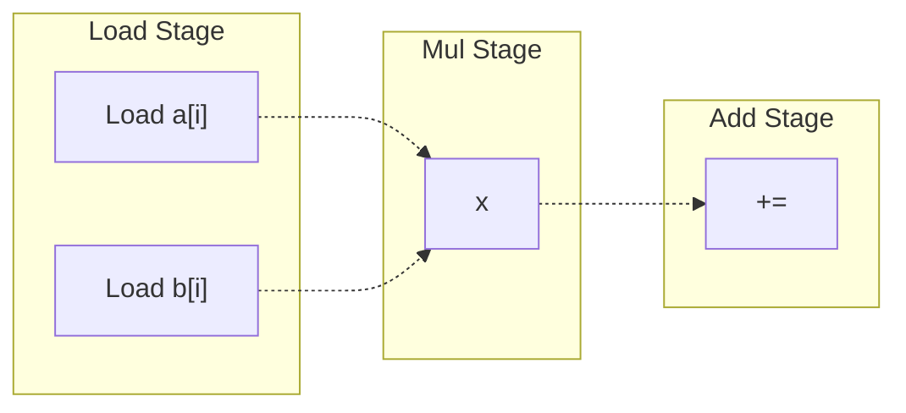

This is logistics + introduction to computer architecture! 

In general, the goal of computer architecture is to design computers that are suited for their intended use. To do this, we need to consider factors such as speed, power usage, and cost.

- [[Performance Metrics]]
- [[Pipelining]]
- [[Branch Prediction]]

Instruction Level Parallelism

# Context
## Main Idea
Let's now look at another way we can speed up our processor-- **instruction level parallelism (ILP)**. If we can execute more than one instruction at a time, then we'll get some massive performance gains! 

Suppose we have the following 3 instructions, which we want to execute in parallel.
| Instr | Cycle 1 | Cycle 2 | Cycle 3 | Cycle 4 | Cycle 5 |
| :-: | :-: | :-: | :-: | :-: | :-: | 
| `R1 = R2 + R3` | Fetch | Decode | Execute | | Write Back |
| `R4 = R1 - R5` | Fetch | Decode | Execute | | Write Back |
| `R6 = R5 x R9` | Fetch | Decode | Execute | | Write Back |

If we could execute all of these instructions at the same time, then we'd be able to save on a lot of time! However, this just isn't possible, because **instructions have data dependencies**. If we execute $I_1$ and $I_2$ at the same time, we'll get unexpected results because $I_2$ uses the output of $I_1$!
> Forwarding can't help either, since we can't forward in the same cycle!

> [!Info] Instruction Level Parallelism
> *Given a set of instructions, what instructions we can "legally" execute in parallel*?

Typically, we're looking to execute 3-6 instructions at a time. A CPU that can ideally run $N$ instructions per cycle is called N-way **superscalar**, where $N$ is called the **issue width**.
- **Scalar CPUs**: Execute one instruction at a time
- **Vector CPUs**: Execute one instruction at a time, but on vector data
- **Superscalar**: Can execute more than one unrelated instructions at a time

> [!Example]- Example: Simple Parallelism, Pentium Processors
> The simplest way we can do this is: 
> 1. Read and decode a few instructions each cycle
> 2. If our instructions are independent, then execute them at the same time
> 3. If they are not, execute them one at a time
> 
> This is in fact how the original Pentium processor worked, which fetched and executed up to 2 instructions at a time.
> ```mermaid
> flowchart LR
> Fetch -.-> Decode1;
> Decode1 -.-> 0[Decode2] -.-> 1[Execute] -.-> 2[Writeback];
> Decode1 -.-> 4[Decode2] -.-> 5[Execute] -.-> 6[Writeback];
> ```
> 
> The decode stage checks for multiple conditions:
> - Is there a data dependency?
> - Is there a resource conflict? 

## Data Dependencies
One of the major bottlenecks for ILP is data dependencies. These prevent us from executing instructions in parallel, as we risk creating unexpected outputs.

> [!Example]- Example: Data Dependency Bottlenecks
> Let's see an example of this below. Assume we already fetched and decoded the following instructions. If we want to execute **up to two instructions** at a time, then in program order, we would only have the following. 
> 
> | | Instr | Cycle | 
> | :-: | :- | :- |
> | 1 | ADD R1 R2, R3 | Cycle 1| 
> | 2 | SUB R4, R1, R5 | Cycle 2 |
> | 3 | XOR R6, R7, R8 | Cycle 2 |
> | 4 | SW R6, 0(R4) | Cycle 3 | 
> | 5 | MUL R6, R5, R9 | Cycle 3 | 
> | 6 |  ADD R7, R1, R6 | Cycle 4 |
> | 7 | SLR R6, R1, R4 | Cycle 4 |
> > Note how the dependency between I1, I2 forces it so that I1 has to run in its own cycle.
> 
> Here, we can execute 7 instructions in 4 cycles, giving us a CPI of 0.57.
> 
> Intuitively, we may think that increasing the number of instructions we can execute would give us a higher CPI! But this is not necessarily the case. To see why, suppose we execute up to 3 at a time now.
> | | Instr | Cycle | 
> | :-: | :- | :- |
> | 1 | ADD R1 R2, R3 | Cycle 1| 
> | 2 | SUB R4, R1, R5 | Cycle 2 |
> | 3 | XOR R6, R7, R8 | Cycle 2 |
> | 4 | SW R6, 0(R4) | Cycle 3 | 
> | 5 | MUL R6, R5, R9 | Cycle 3 | 
> | 6 |  ADD R7, R1, R6 | Cycle 4 |
> | 7 | SLR R6, R1, R4 | Cycle 4 |
> 
> Because of the data dependencies between I3/I4, I5/I6, we still only execute 7 instructions in 4 cycles! So, we gained nothing. The data dependencies between the instructions are preventing us from executing more instructions at once. 

To understand why these limits are happening, let's first review the types of data dependencies. 
- **Register Dependencies** occur due to data dependency conflicts with register numbers
  - **Read-After-Write (RAW; True Dependency)**: $A$ writes to a location, and $B$ reads from the same location. 
  - **Write-After-Read (WAR; Anti-Dependency)**: $A$ reads from a location, then $B$ writes to the location. If $B$ executes before $A$ has read its operand, then the operand will be lost. 
  - **Write-After-Write (WAW)** $A$ writes to a location, then $B$ writes to the same location. Here, there is an output dependency, as the location's value depends on what executes last.
- **Memory Dependencies** occur due the data dependency conflicts with memory addresses
  > Memory dependencies are hard to minimize, as because register names are known at decode, memory addresses are not known until execute!

A lot of ILP revolves around addressing these dependencies, so we can maximize parallel execution of instructions. More on addressing register dependencies later.

## Register Renaming (WAR, WAW)
In terms of register dependencies, **WAR and WAW are false dependencies**; they only occur because we have a limited number of registers, so at some point we're forced to re-use registers. 

So, a simple solution is to just add more registers! If we have more registers, and our compiler uses them, we'll have less false dependency issues. 

However, this isn't very scalable.
- If you write a value to a register in a loop body, then that same register will be reused every iteration. This introduces many false dependencies!
- If you make function calls, you could have similar register reuse!

Instead, we use **hardware register renaming**. The idea is to separate the physical registers from the registers in code: 
- **Architecture Registers**: Registers that the programmers and compilers use
- **Physical Registers**: Actual registers that the processor uses

This abstracts the use of registers in the code we write from the physical registers. Then, if we dynamically map our architecture registers to the physical registers, we can avoid dependency issues!

Consider the following set of instructions.
```
I1: ADD R1, R2, R3
I2: SUB R2, R1, R5
I3: AND R5, R11, R7
I4: OR R8, R5, R2
I5: XOR R2, R4, R11
```

To reduce the number of false dependencies, lets replace our registers with a temporary "name" for the values they contain / produce. So, after any write to a register, we will use the "same name" for all subsequent reads until the next write!
```
I1: ADD R1, R2, R3
I2: SUB R2, R1, R5
I3: AND S, R11, R7
I4: OR R8, S, R2
I5: XOR R2, R4, R11
```

This tells us what instructions depend on one another! We can rewrite this temporary name with another register to avoid a dependency. 

So, we will rename every instruction, and anytime we decode an instruction that will write to a register, we will change the name of the register. We store the mapping between architectural / physical registers in a **register allocation table (RAT)**.

After renaming, we won't have any false dependencies! We can use these renamed registers with physical registers at runtime, and select free registers to avoid conflicts.
> More on implementing this later.

# Dynamic Instruction Scheduling
To actually create a processor that uses ILP, we need to use **dynamic instruction scheduling**. 

## Theoretical Gains
To calculate our maximum theoretical ILP gain, we want to look at
$$
ILP = \text{\# Instructions} / \text{Longest Path}
$$
Where the longest path is determined by the number of true dependencies, we cannot remove them.
> We can however, ignore false dependencies, as we've (ideally) can assume that we've resolved them with other techniques.

> [!Example]- Example: ILP Calculation
> Suppose we have the following 5 instructions.
> 
> ```bash
> I1: ADD R10, R2, R3
> I2: SUB R6, R7, R8
> I3: XOR R5, R8, R9
> I4: MUL R4, R8, R9
> I5: XOR R11, R10, R5
> ```
> 
> We have 5 instructions, and our longest path is 2 ($I_1/I_5$ and $I_4/I_5$). Thus, the ILP of this set of instructions is 2.5.
>
> > To do these, it helps to draw a dependency graph, and trace the longest path.

ILP is a property of the program and compiler. No matter what processor you run the program on, the true dependencies restrict our maximum parallelism!

**Instructions Per Cycle (IPC)**, on the other hand, depends on the actual machine architecture. This is how much parallelism we can practically achieve!
> ILP the upper bound on IPC that we can achieve!

To increase the number of instructions we run per cycle, we use **scheduling**. Scheduling finds instructions whose dependencies have been resolved, so that they can be executed! 
> If the scheduling is **out of order**, then the instructions can be executed in any order, so long as their dependencies have already been resolved. 

> [!Example]- Example: Out-Of-Order Scheduling
> Consider the following instructions. With out-of-order scheduling, 1 MUL unit and 1 ADD / SUB / XOR unit,  what is the ILP and IPC?
> 
> ```bash
> I1: ADD R1, R2, R3
> I2: SUB R4, R1, R5
> I3: XOR R6, R7, R8
> I4: MUL R5, R8, R9
> I5: XOR R4, R8, R9
> ```
> 
> We have 1 dependency between $I_1 / I2$, and 5 instructions. Thus, our ILP is $5/2 = 2.5$.
> 
> However, practically speaking, per cycle we can execute the instructions as follows:
> 1. Cycle 1: I1 on ADD, I4 on MUL
> 2. Cycle 2: I2 on ADD
> 3. Cycle 3: I3 on ADD
> 4. Cycle 4: I5 on ADD
> 
> So, our IPC is $5/4$! Even though we have scheduling, we're limited by our hardware! So, achieving ILP depends both on smart scheduling, and the power of our hardware.

How do we practically implement a scheduler?

## Tomasulo's Algorithm
**Tomasulo's Algorithm** is a hardware algorithm that determines which instructions have inputs ready, and can be executed. The algorithm includes a form of register renaming to eliminate false dependencies.

To implement this algorithm, we need the following hardware components:
1. **Instruction Buffer / Queue**: Stores the instructions that we have available to us and can examine for parallelism. 
2. **Reservation Stations**: Stores instructions that are pending execution, and which operands are ready. Every entry in the reservation tables has a unique identifier.
3. **Register Allocation Table (RAT)**: Maps register names to reservation station IDs. If the value is 0, then it means the value is in the register file. Otherwise, the entry tells us what pending instruction (in one of the reservation stations) is writing to this register.
4. **The Register File**: The register file that stores the values in each register.

For the sake of example, let our tables store the following.

| | Instruction Queue | | RAT Table | | Register File |
| :-: | :- | :-: | :- | :-: | :- |
| 3 | F1 = F2 + F3 | F1 | 0 | F1 | 3.141693
| 2 | F4 = F1 - F2 | F2 | 1 | F2 | -1.00
| 1 | F1 = F2 / F3 | F3 | 0 | F3 | 2.718282
| | | F4 | 0 | F4 | 0.707107

| | Adder Reservation Station | | Mul/Div Reservation Station |
| :-: | :- | :-: | :- |
| 1 | F2 = F4 + F1 \| 0.7071 \| 0.35 | 4 |
| 2 | | 5 |
| 3 | 

This algorithm has 3 stages, which are ran each cycle. Together, they let us achieve instruction level parallelism. 

### Stage 1: Issue
The **issue stage** takes an instruction and places it in the reservation station, with data telling us what instructions it depends on.

Let's walk through an example of what the issue stage does. 
1. Pull from the instruction queue to get the next instruction.
   - Here, we pull `F1 = F2 / F3`. 
2. Find a free spot in a reservation station that can handle the instruction. 
   - We find spot (4) in the `Mul/Div` reservation station. 
3. Write this instruction to the free spot. Then, check the RAT table to see if the operands of the instruction are available or not.
   1. If the RAT table entry is 0, then the value is in the register file. We pull this value and store it in the reservation station.
   - For operand `F3`, the RAT table stores 0. So, pull the value, 2.718, from the register file, and store it in the reservation table. 
   2. If the RAT table is not 0, then the value is the output of a reservation station. We store this reference for now.
   - For operand `F2`, the RAT table stores 1. So, just store the reservation station spot for the operand to signify that we're waiting on this instruction.

4. Look at the instructions output register, and update the RAT table so that its entry points to this instruction's reservation station index. This tells subsequent instructions that the register output depends on this instruction. 
   - Here, our output register is `F1`. We update the RAT entry for `F1` to (4).

After the issue stage, our tables look as follows:

| | Instruction Queue | | RAT Table | | Register File |
| :-: | :- | :-: | :- | :-: | :- |
| 3 | F1 = F2 + F3 | F1 | `4` | F1 | 3.141693
| 2 | F4 = F1 - F2 | F2 | 1 | F2 | -1.00
| 1 | `F1 = F2 / F3` | F3 | 0 | F3 | 2.718282
| | | F4 | 0 | F4 | 0.707107

| | Adder Reservation Station | | Mul/Div Reservation Station |
| :-: | :- | :-: | :- |
| 1 | F2 = F4 + F1 ; 0.7071 ; 0.35 | 4 | `F1 = F2 / F3 ; (1) ; 2.718`
| 2 | | 5 |
| 3 | 

### Stage 2: Execute
The **execute stage** executes instructions whose operands are ready, and broadcasts the results so they can be used in other instructions. 
> To update reservation stations, the stage uses a **common data bus**, and broadcasts the output of the instruction.

Let's walk through an example of the execute stage. 
1. First, find the instructions whose operands are all populated. These instructions are ready to be executed.
   - We find that slot (1) is ready to be executed, standing for `F2 = F4 + F1`! 
2. Execute this instruction, using the compute units.
   - We execute `F2 = F4 + F1`, $0.7071 + \pi$!
3. Load results of the instruction so they can update the other hardware components. 

If several instructions are ready for one functional unit, we could use whichever instruction we want, with one exception-- **load/store instructions**. Load/store must be done in the correct order to avoid memory hazards.
> More on addresing load/store hazards later.

### Stage 3: Write
The **write stage** takes the result of an instruction, and updates the hardware components necessary for continuing the algorithm.

Let's walk through an example of the execute stage. 
1. Given the output of an instruction, broadcast it on the common data bus. Any reservation station depending on this output will pull and store this output.
   - Recall that our instruction is `F2 = F4 + F1`, with result 3.8487, in reservation entry (1).
   - Reservation station entry (4) depends on (1). So, it will overwrite (1) with the result, 3.8487. Now, this instruction is ready to execute in the next cycle!
2. Check the RAT table for the instruction's output. If the table stores the current reservation station index, then update the RAT table (to 0) and RF file (to store theoutput).
   - The RAT table for register `F2` is (1), which is our instruction! So, set this entry to 0, and update the RF file for `F2` to be 3.8487. 

    > It's important we only update **if the RAT table entry matches**. This implements register renaming, as the RAT table only stores the mapping for the last write to a register!

3. Free the reservation station entry for the instruction.
   - Free reservation entry (1). 

After the write stage, our components look like this:

| | Instruction Queue | | RAT Table | | Register File |
| :-: | :- | :-: | :- | :-: | :- |
| 3 | F1 = F2 + F3 | F1 | 4 | F1 | 3.141693
| 2 | F4 = F1 - F2 | F2 | `0` | F2 | `3.8487`
| 1 | F1 = F2 / F3 | F3 | 0 | F3 | 2.718282
| | | F4 | 0 | F4 | 0.707107

| | Adder Reservation Station | | Mul/Div Reservation Station |
| :-: | :- | :-: | :- |
| 1 | | 4 | F1 = F2 / F3 ; `3.8487` ; 2.718
| 2 | | 5 |
| 3 | 

> The reservation stations would likely have fetched more instructions by now, but for the sake of example we've committed this.

Note how through the common data bus, the reservation stations take care of register dependencies!

### Example: Deep Dive
> [!Example]- Example: Deep Dive
> Let's run Tomasulo's Algorithm on an instruction set. We start with the following assumptions:
> - All instructions are already in the instruction queue.
> - Only one instruction can be issued per cycle.
> - Only one instruction can be written per cycle (only one CDB). 
> - The result of an instruction is written in the last cycle of its execution. A dependent instruction can (if selected) begin its execution in the cycle after that.
> - The execution time of all instructions is two cycles, except for multiplication (which takes 4 cycles) and division (which takes 8 cycles).
> - The processor has one multiply/divide unit and one add/subtract unit.
> - The multiply/divide unit has two reservation stations and the add/subtract unit has four reservation stations.
> - None of the execution units is pipelined – each can only be executing one instruction at a time.
> - If a conflict for the use of an execution unit occurs when selecting which instruction should start to execute, the older instruction (the one that appears earlier in program order) has priority.
> - If a conflict for use of the CBD occurs, the result of the add/subtract unit has priority over the result of the multiply/divide unit.
> 
> ```bash
> Instruction          | Issue | Execute | Write
> I1: MUL F2, F1, F1   |   1   |   2     |   5
> I2: DIV F4, F4, F2   |   2   |   6     |   13
> I3: ADD F1, F2, F3   |   3   |   6     |   7
> I4: ADD F2, F1, F3   |   4   |   8     |   9
> I5: DIV F1, F4, F2   |   6   |   14    |   21
> I6: SUB F4, F4, F2   |   7   |   14    |   15
> I7: ADD F3, F1, F2   |      |        |
> I8: MUL F1, F2, F1   |      |        |
> I9: ADD F3, F3, F4   |      |        |
> I10: SUB F4, F5, F6  |      |        |
> ```
> 
> The general process is as follows:
> - When issuing an instruction, find the cycle when a reservation station is open. Find the cycle after the last issue. Take the max. 
> - When executing an instruction, (1) find the cycle after the issue, (2) find the cycles after dependencies write-back, (3) find the cycles the execution unit is available. Choose the closest cycle to (3), given that that cycle is greater than the max of 1,2.
> 
> 1. `I1: MUL F2, F1, F1`
>    - Issue: Issue I1 in C1.
>    - Execute / Write: C2 to C5, with writing in C5.
>      - I1 is issued in C1 -- it can only start executing in C2.
>      - All dependencies are resolved.
>      - An execution unit is available. 
> 2. `I2: DIV F4, F4, F2`
>    - Issue: Issue I2 in C2. Last issue was C1 (need C2 or later)
>      - There is an open RS entry for DIV, as only one slot is filled by I1.
>    - Execute / Write: C6 to C13, with writing in C13.
>      - I2 is issued in C2 -- it can only execute on C3 or later.
>      - I2 has a dependency on I1 -- it can only execute on C6 or later (I1 finishes Write)
>      - An execution unit will not be available until C6 (I1 using it).
> 3. `I3: ADD F1, F2, F3`
>    - Issue: C3.
>      - No ADD RS slots are filled. Last issue was C2 (need C3 or later)
>    - Execute / Write: C6 to C7, write in C7.
>      - I3 is issued in C3 -- it can only execute on C4 or later.
>      - I3 depends on I1 -- it can only execute on C6 or later.
>      - An execution unit is available.
> 4. `I4: ADD F2, F1, F3`
>    - Issue: C4.
>      - Only 1 ADD RS slot is filled by I3. Last issue was C3 (need C4 or later)
>    - Execute / Write: C8 to C9, write in C9
>      - I4 is issued in C4 -- it can only execute on C5 or later.
>      - I4 depends on I1 -- it can only execute on C6 or later
>      - An execution unit will not be available until C8 (I3 using it)
>  5. `I5: DIV F1, F4, F2`
>     - Issue: C6.
>       - Both RS slots filled by I1, I2 until C6, C14. Last issue was C4 (need C5 or later)
>     - Execute / Write: C14 to C21, write in C21
>       - I5 issued in C6 (C7 or later)
>       - I5 depends on I2 (C14 or later), I4 (C10 or later)
>       - Execution unit being used by I2 until C14.
> 6. `I6: SUB F4, F4, F2`
>    - Issue: C7
>      - Only 2 RS slots filled by I3, I4. Last issue was C6 (need C7 or later)
>    - Execute / Write: C14 to C15, write on C15
>      - I6 issued on C7 (C8 or later)
>      - I6 depends on I2 (C14 or later), I4 (C10 or later)
>      - Execution unit being used by I4 until C10
> 
> ... This process continues. The final table should be
> 
> ```bash
> Instruction          | Issue | Execute | Write
> I1: MUL F2, F1, F1   |   1   |   2     |   5
> I2: DIV F4, F4, F2   |   2   |   6     |   13
> I3: ADD F1, F2, F3   |   3   |   6     |   7
> I4: ADD F2, F1, F3   |   4   |   8     |   9
> I5: DIV F1, F4, F2   |   6   |   14    |   21
> I6: SUB F4, F4, F2   |   7   |   14    |   15
> I7: ADD F3, F1, F2   |   8   |   22    |   23
> I8: MUL F1, F2, F1   |   14  |   22    |   26
> I9: ADD F3, F3, F4   |   15  |   24    |   25
> I10: SUB F4, F5, F6  |   16  |   17    |   18
> ```
> > Note that I8 and I9 both write on C25-- because there is only one CDB, I9 writes first and forces I8 to execute after because of our assumptions.

### The Reorder Buffer (ROB)
Tomasulo's algorithm lets us execute instructions out of order to achieve instruction level parallelism! However, even if we reorder instructions, **we still must process instructions exactly in program order**!

This is mainly because of control flow-- in the real world, we could have exceptions, or branch mispredictions. These can cause us to update registers in the incorrect order! 

> [!Example]+ Example: Branch Misprediction
> ```bash
> DIV R1 R3 R4
> DEQ R1 R3 Label
> ADD R3 R4 R5
> ```
> 
> Suppose here, we predict that a branch is not taken, so we execute the ADD and update R3. 
> 
> Later, we realize that the branch should have been taken. By this time, we've already updated R3 with a new wrong value! This will cause incorrect program behaviors.

To address this, we need to **deposit values to registers in order**! We do this using a **reorder buffer (ROB)**, which will:
- Remember the program order
- Keep the results of instructions until it is safe to write

It does this by storing entries, which contain
- Type of instruction
- Destination register of instruction
- Result of instruction
- A flag indicating if the instruction was finished

And a head, tail indicating what instructions have yet to be "committed" in order (more on that later).

| | Type | Dest. | Value | Finished |
| :-: | - | - | - | - |
| ROB1 | DIV | R2 | 9 | Yes |
| ROB2 - HEAD | MUL | R1 | 12 |
| ROB3 | ADD | R3 | 3 | Yes |
| ROB4 - TAIL | MUL | R1 | 36 | Yes | 
| ROB5 | | | | |


Now, the register file will always store the "official" register state, which will only be updated in program order. 
> The ROB will now be the one storing our register results in the correct order, and will ensure our register file is updated in the order the program gave.

With the ROB, we modify our stages as follows. Now, the RAT table and reservation stations will store references to ROB entries, instead of reservation station entries:
- **Issue**: 
   1. Read the instruction from the buffer.
   2. Check if there is a RS entry **and a ROB entry** available. 
      - Stall if there are no open entries.
   3. Read the RAT table, read available sources, and update RAT to point to the ROB entry.
   4. Write to the RS and ROB.
- **Execute**: No change
- **Write**: 
   1. Broadcast result on the data bus, for the reservation stations to grab.
   2. **Write the result back to the ROB entry, and mark the entry as finished execution**.
   3. Now that the ROB stores the results, free the reservation station.
   
   > Some architectures free the instruction's reservation station in execute, as the data will be in the ROB table after anyways. 

We also add a new stage, **commit**. 
- **Commit**:
  1. For the oldest instruction in the ROB, check if instruction has been executed.
  2. If it has, write the result to the register file, or memory, depending on what the instruction is. We **always update the register file**, no matter what the RAT file says. However, if the ROB is:
     - Not the value in RAT, don't change the RAT entry.
     - The value in RAT, clear the RAT entry to 0, indicating the value is in the register file.
  3. Advance the ROB-head to point to the next instruction.

> Commit MUST be in order. An instruction cannot commit until all prior instructions have committed.

With the ROB in place, we can now use it to recover from branch mispredictions and exceptions **by flushing** all data after the instruction where the misprediction / exception occurred. If the exception occurred on instruction I, then we:
- Flush the ROB for all entries after instruction I
- Point all RAT entries to their corresponding RFs
- Clear all of the RS entries and anything in the execution units

Then, resume execution with the correct instructions!

### The Load-Store Queue (LSQ)
So, we used the ROB to fix exceptions and branch mispredictions. 

What about memory dependencies? Memory instructions such as **store** only write to memory at commit. If this is the case, how do out-of-order loads know what their data is? 

This is the purpose of the **Load-Store Queue (LSQ)**. This queue stores the load, store instructions in order, so that loads can be populated with the results of stores before a commit takes place. 
> LD will denote a load instruction, and ST will denote a store instruction.

For example, an LSQ could look like the following:
| L/S | ADDR | VAL | | 
| :-: | :-: | :-: | - |
| LD | 104 | | |
| ST | 204 | 15 | done |
| LD | 204 | `15` |

For every LD we add to the queue, we check to see if its address match any ST addresses. 
- If there is a matching ST, we do not go to memory, and can pull the value from the LSQ. 
  
  > Here, LD on 204 can pull value 15 from ST on 204.

- If there is not a matching ST, we have a few options:
  1. We do not allow a LD to execute until all previous instructions have been completed.
  2. We do not allow a LD to execute until all previous ST's have been completed, to match addresses
  3. Let the LD fetch from memory! 

Modern processors do option 3. If we later realize that the LD loaded the wrong value, we recover!

We incorporate the LSQ into Tomasulo's algorithm by adding onto the following stages as so:
- **Issue**: Allocate an LSQ entry for each LD/ST, in addition to the ROB entry and RS.
- **Execute**: Generate an address for the LD/ST instruction, and update the LSQ / look-up the LSQ for previous values.
- **Commit**: If ST, write value to memory. Free the LSQ entry in addition to the ROB entry.

> What the LSQ essentially does is track addresses for values.

... TODO


## Improving Tomasulo's Algorithm 
Here, we discuss various ways we could potentially improve Tomasulo's algorithm (though they each come with their own tradeoffs). 

### Unified Reservation Stations
In the issue stage, we're forced to stall if there is no open RS. However, there could still be open RS slots for other compute units!

Figuring out the right number of RS per compute unit is difficult, as different programs have different distributions of instructions.

One way we could resolve this is by using a **unified reservation station**! Instead of different RS for different compute units, we just have 1 for every compute unit!
> This does mean things get a bit more complex though!

### Superscalar Processing
The current implementation of Tomasulo's algorithm give us one instruction per cycle, but cannot give us more! We need a lot of the components to be superscalar in order to achieve higher than 1 IPC.
- We need a superscalar fetch and decode
- We need more than one CDB to write the results of instructions
- We need a mechanism to dual-rename registers at the same time

In practice, modern processors do this! However, it comes at a cost of area, logic, and power.


TODO

- Exceptions / Branch Mispredictions -- Recovering from Control Dependencies
- Out of Order Memory Dependencies


# Compiler ILP Techniques
Previously, we've seen ways we can achieve ILP on the hardware. However, it's not easy to do this, and it's costly to implement all of these optimizations in the hardware! 

To help with this, we can also use the compiler! The compiler can make changes in how the code is generated so that the hardware has an easier time achieving ILP.
- Shortening dependency chains
- Moving dependent instructions further apart
- Improving the opportunity for parallelism

Below, we'll discuss some of the various ways our compiler can optimize our code.

> [!Example]+ Optimization: Tree Height Reduction
> Using the principle of associativity, it may be possible to reduce critical paths. For example, suppose we have code
> ```bash
> R8 = R2 + R3 + R4 + R5
> ```
> 
> If we evaluate this left to right, we'll generate code that'll yield a dependency graph with a length 3 path!
> ```bash
> R8 = ((R2 + R3) + R4) + R5
> 
> I1: ADD R6, R2, R3
> I2: ADD R7, R6, R4
> I3: ADD R8, R7, R5
> ```
> 
> However, we don't have to do the addition in the given order because it's associative! We can actually reduce this so that our longest dependency path is only length 2.
> ```bash
> R8 = (R2 + R3) + (R4 + R5)
> 
> I1: ADD R6, R2, R3
> I2: ADD R7, R4, R5
> I3: ADD R8, R7, R6
> ```

## Instruction Scheduling
Outside of Tomasulo's Algorithm, it's possible for the compiler to reduce dependency chains. It can do this by reordering our instructions!

### Instruction Reordering
Suppose we have the following loop.
```c
for (i = 1000; i > 0; i--)
    x[i] = x[i] + s;
```

Directly translating this loop, we'd have assembly code
```bash
Loop: 
    LD F0, 0(R1)
    ADD F0, F0, F2
    ST F0, 0(R1)
    ADD R1, R1, #-8
    
    BNE R1, R2, LOOP
```

Now suppose we have a single-issue processor, where `LD` takes 2 cycles, `ADD` takes 3 cycles, and other instructions take 1 cycle. Factoring in these stalls, we would execute these instructions as follows:
```bash
Loop: 
    LD F0, 0(R1)
    stall
    ADD F0, F0, F2
    stall
    stall
    ST F0, 0(R1)
    ADD R1, R1, #-8
    stall
    stall
    
    BNE R1, R2, LOOP
```

The compiler can optimize this to reduce the number of stalls! In fact, there's no reason to decrement the pointer at the end-- what if we do it earlier to spread out the dependencies?
```bash
Loop: 
    LD F0, 0(R1)
    ADD R1, R1, #-8
    ADD F0, F0, F2
    stall
    stall
    ST F0, 8(R1) # Note the change in offset
    BNE R1, R2, LOOP
```

### Loop Unrolling
When possible, the compiler can reduce the number of branches in the code to make scheduling easier! One notable example of this is **loop unrolling**.

Using loop unrolling, a compiler can transform an M iteration loop into a loop with M / N iterations.
> In this case, we say the loop has been unrolled $N$ times.

Suppose we have the following loop. We can unroll 4 times as follows:
```c
// Original
for (i = 1000 ; i > 0 ; i--)
    x[i] = x[i] + s;
    
// Unrolled 1 Time
for (i = 1000; i > 0 ; i -= 2) {
    x[i] = x[i] + s;
    x[i - 1] = x[i - 1] + s;
}

// Unrolled 4 Times
for (i = 1000; i > 0 ; i -= 4) {
    x[i] = x[i] + s;
    x[i - 1] = x[i - 1] + s;
    x[i - 2] = x[i - 2] + s;
    x[i - 3] = x[i - 3] + s;
}
```

Let's see the various reasons why loop unrolling helps.

---

**Less Loop Overhead**: Loop unrolling can reduce the number of total instructions, by reducing the number of times we need to update the index. Looking at the assembly of our loop,

```bash
# Original
Loop: 
    LD R2, 0[R1]
    ADD R2, R2, R3
    ST R2, 0[R1]
    ADD R1, R1, -4
    BNE R1, R5, LOOP

# Unrolled 1 Time
Loop:
    LD R2, 0[R1]
    ADD R2, R2, R3
    ST R2, 0[R1]
    LD R2, -4[R1]
    ADD R2, R2, R3
    ST R2, -4[R1]
    ADD R1, R1, -8
    BNE R1, R5, LOOP
```

While our assembly is longer, our unrolled loop actually executes less total instructions! Our original loop executes $5 \times 1000 = 5000$ instructions, whereas our unrolled loop executes $8 \times 500 = 4000$ instructions. 

---

**Better Scheduling**: Spreading out our loop lets us schedule our instructions better.
1. We are able to execute instructions for the next iteration of the loop earlier (as there are less overall dependencies).
2. Lets us hide load latencies by adding more instructions per iteration.

Loop unrolling can even eliminate small loops, letting us remove the branch in the loop entirely! 
> The less branches, the easier it is to schedule things.

> [!Info] Function Inlining
> This idea can even be applied to functions! Compilers can "inline" functions, by "copying" the function code directly into where it is called! This lets us avoid the function call overhead.

---

Loop unrolling is not without consequences. Some issues related to unrolling include:
- Larger code size leads to increased register pressure
- Less readable code
- Difficulties in unrolling-- what if N is not known at compile time?

### Software Pipelining
Recall instruction pipelining, where we perform a different operation on a different operation. We can also apply this general idea in the compiler as well! 

**Software Pipelining** is a technique that lets us write code in a way that makes it easier for our hardware to schedule instructions. Let's see an example of this below.

Consider the following loop, with stages `Load`, `Multiply`, and `Add`.
```c
for (i = 0 ; i < 100 ; i++)
    sum += a[i] * b[i];
```

First, let's break up our instruction into these different stages, so we have independent operations.


Now, let's update our code to separate these different stages.
```c
for (i = 0; i < 100; i++) {
    // Load Stage
    ai = a[i];
    bi = b[i];
    
    // Mul Staage
    prod = ai * bi;
    
    // Add Stage
    sum += prod;
}
```

So for any "instruction" (body of the loop), we need to run `LOAD`, `MUL`, then `ADD` on it. Now, for a pipeline, we want to execute our instructions so that at each iteration (analogous to cycle), each stage is executing a different "instruction"! So, we want something like:
1. In Iteration 2 ("Cycle 2"), run `LOAD` on `a[2], b[2]`, run `MUL` for `a[1] * b[1]`, and run ADD for `sum = a[0] + b[0]`.
2. In Iteration 3 ("Cycle 3"), run `LOAD` on `a[3], b[3]`, run `MUL` for `a[2] * b[2]`, and run ADD for `sum = a[1] + b[1]`.
3. ...

> This separates our "stages" so that there is less overlap, giving our processor an easier time scheduling our instructions!

Like in the instruction pipeline, we need some way to connect these stages together! We can do this with memory.
- Between `LOAD/MUL`, we need memory to store the `ai`, `bi` values fetched from load.
- Between `MUL/ADD`, we need memory to store the result of the product `ai * bi`.

So, our code will look as follows:
```c
// --- Prologue ---
// Memory for MUL/ADD
prod = a[0] * b[0];
// Memory for LOAD/MUL
ai = a[1]; bi = b[1];
// ---

// --- Pipeline ---
// BE CAREFUL ABOUT INDICES
for (i = 2; i < 100; i++) {
    // Add Stage: Adds Product of Index i - 2
    sum += prod; 
    
    // Mul Stage: Multiplies Load of Index  i - 1
    prod = ai * bi;
    
    // Load Stage: Loads Index i
    ai = a[i];
    bi = b[i];
}
// ---

// --- Epilogue ---
// Finish by adding the results of indices 98 and 99
sum += prod;
sum += ai * bi;
// ---
```
