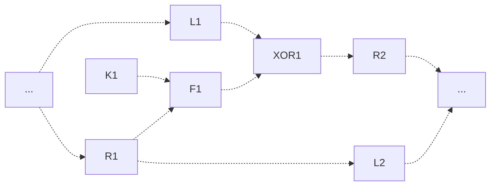
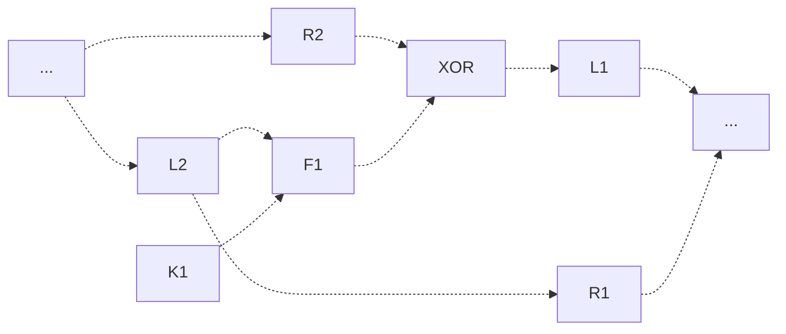
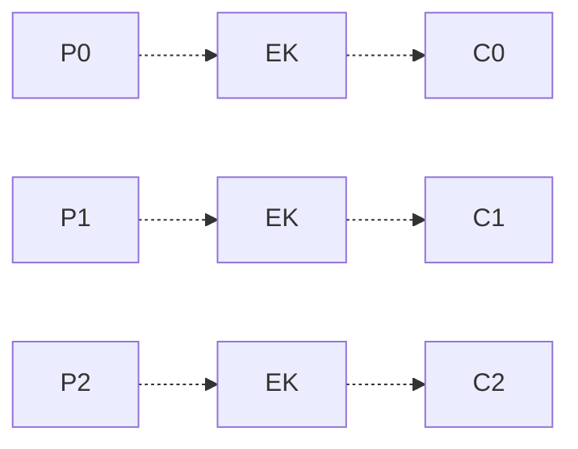
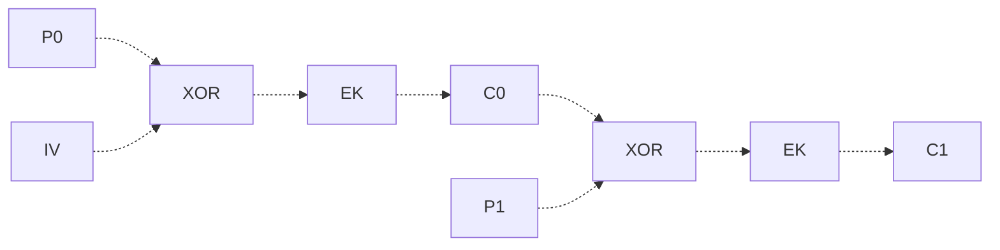
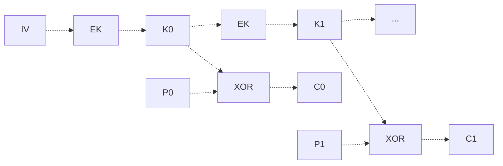

There are two main goals of cryptography:
- Keep secrets a secret (confidentiality, privacy, anonymity)
- Ensure that data is correct (integrity, authencity)

We survey the landscape of cryptography below.

# Introduction to Cryptography
## Principles
For any crypto system, there are some general principles to follow. 

**Kerckhoff's Principle** states that a cryptosystem should be secure even if everything about the system, except the key, is public knowledge.

**Schneier's Law** states that any person can invent a security system so clever that he or she can't imagine a way of breaking it.

There is no security through obscurity! It's important to have many people try to break through a system based on a full knowledge of it. Just because you think its unbreakable, does not mean it really is unbreakable.
> Don't trust any system that is not public! These systems are not vetted.

## Terminology
### Main Idea and Cryptosystems
Cryptography and related topics all have terminology of their own. This is discussed below.

One of the goals in cryptography is **keeping secrets**. This means that we want to be able to replace some or all of our message with something else, while being able to recover the original.
- **Encoding** refers to the replacement of a semantic unit (word, phrase) with something else
- **Enciphering** refers to replacing individual letters or bits with something else
- **Plaintext / Cleartext** refers to a message as written and intended to be read
- **Ciphertext** refers to a transformation of a plaintext so that it cannot be read, other than the intended recipient

The following terminology describes the technologists who work on ciphertext:
- **Cryptographers** create ciphers.
- **Cryptanalysts** break ciphers.
- **Cryptologists** study ciphers, both how they're created and how they're broken, to focus on how to use cryptography properly.

Both encoding and enciphering are examples of **encrpytion**, the process of transforming a plaintext into the corresponding ciphertext. Converse to this is **decryption**, transforming a ciphertextback into plaintext.

A combination of a encrpytion and decryption scheme is known as a **cryptosystem**. This also includes the algorithms that prepare and modify the inputs / outputs for our schemes, as well as protocols as to how we should properly use these schemes.

Participants in a cryptosystem have some conventionally used names that you find in all the literature.
- **Alice, Bob, Carol** are the typical participants in a cryptosystem. They may be cooperative or adversarial.
- **Eve** is an eavesdropper, who tries to wiretap into the communications. They may **passively wiretap** (just seeing all messages exchanged), or **actively wiretap** (modifying the messages being sent).
- **Trudy** is an intruder in the system who is not supposed to be there.

> In a system with an active wiretapper Eve, there's no guarantee that the messages sent and received are the original messages, which can easily complexify things!

### Important Mathematical Notation
We discuss some standard mathematical notation which will be used throughout cryptography.

Given a function $f$, we specify its domain $D$ and range $R$ in the form
$$
f : D \mapsto R
$$
> $\mapsto$ is the `\mapsto` symbol in LaTeX.

> [!Example]+ Example: Function Domains and Ranges
> $H : \{0,1\}^* \mapsto \{0,1\}^n$ is the function that makes any number ($*$) of 0's and 1's to 0's and 1's of length $n$. We have an arbitrary number of input bits map to a fixed length $n$ of output bits.
>
> $E : \{0,1\}^k \mapsto \{0,1\}^k$ is the function that maps $k$ input bits in the domain to $k$ output bits in the range. This may map a block of bits to another block of bits of the same length.

We additionally can specify a function's transformation on an input as
$$
f : x \to f(x)
$$
Where $x$ is the input to the function, and $f(x)$ is the output.

> [!Example]+ Example: Transformations of Inputs
> $E : m \to m^e \mod n$ describes a function which transforms $m$ by raising it to the $e$ power and taking the modulus of $n$.

### Cryptosystems
We have the following terminologies for algorithms in cryptography.

A **cryptographic hash** is a one-way function of the form
$$
H : \{0,1\}^* \mapsto \{0,1\}^n
$$
Such that $c = H(m)$ is easy to compute, but $m = H^{-1} (c)$ is infeasible. In other words, we can easily compute outputs given some input, but it's very difficult to reverse the function to recover the original input.

Say we have a message $m$ and ciphertext $c$. 

A **symmetric key cryptosystem** is a system with a single key shared by the sender and receiver. With key $k$,
$$
c = E(k,m) \qquad m = D(k,c)
$$
It's easy to both encrypt and decrypt our message with the key, but infeasible to do so without the key.

A **asymmetric key cryptosystem** is a system that has a public key that can be shared with potential senders, and a private key known only to the key owner. With public key $k_\text{pub}$, private key $k_\text{priv}$, message $m$ and ciphertext $c$,
$$
c = E(K_\text{pub}, m)
$$
Encrypting a message can be done by anyone, but
$$
m = D(K_\text{priv}, c)
$$
Decrypting the message can only be done efficiently by the key owner.

> [!Info] Cryptography for Signatures
> Cryptography can provide more than just secrecy! Cryptographic hashes can provide an integrity check on data, as we can use an encrypted (or hashed) form of the data and see the raw data hashes to this!
>
> However, if we do this, then we also need some way to check the integrity of the hash! This is where **digital signatures** come in.
>
> Say we have data $M$. Now, consider a cryptosystem with two functions
> $$
> E : \{0,1\}^b \mapsto \{0,1\}^b \quad D : \{0,1\}^b \mapsto \{0,1\}^b
> $$
> 
> Because the domain and range of $E$ and $D$ are identical, we can use them to encode and decode a message:
> $$
> s = D(K_\text{priv}, m) \quad m = E(K_\text{pub}, s)
> $$
> Where $s$ is a **digital signature** of the message with private key $K_\text{priv}$, which we can verify with the public key $K_\text{pub}$. Generally, the message $m$ will be the hashed data $m = H(M)$, given some cryptographic hash function $H$.
> 
> > We hash the data so our decoding doesn't require us to decode the entire plaintext data, making things more efficient!

But how do we evaluate cryptosystems?

The **random oracle model** is the standard model of cryptographic analysis. The oracle produces random output for any input, but any subsequent input that is the same as one prior will always produce the same output.

A **cryptographic primitive** is **cryptographically secure** if it's indistinguishable from a random oracle. In other words, if we give the primitive a bunch of inputs and look at the outputs, there will be no statistical difference between the primitive and the oracle.

> [!Info] Birthday Paradox
> Given $m$ samples from a set of $N$ options, the probability of a collision within the samples (us choosing the same option) scales at the rate of $\sqrt{N}$.
> 
> This is typically counterintuitive to many people! Commonly this is presented as the following: in a room of 30 people, there is a high probability that 2 of them share the same birthday.
>
> This has many implications in cryptography. Any hash function $H : \{0,1\}^* \mapsto \{0,1\}^b$ has a finite size, and by this paradox, we're likely to have collisions if only $2^{b/2}$ inputs are tried!
> > This determines our choice of block size depending on computing capabilities, and the number of times a block cipher can be safely used.

# Encoding and Enciphering Schemes
## Encoding
In encoding, we replace semantic unit with something else to replace it.

One example of encoding is to use **codewords**, to replace single or multiple words. For example, telegraph operators have standard replacements using 4-letter non-words for common longer phrases.

## Enciphering
Generally though, we don't use encoding, and typically opt for ciphers instead, where individual letters (or bits) are replaced with something else, without regard for their meaning.

Ciphers are typically classified based on their unit of operation.
- **Substitution Ciphers and Stream Ciphers** transform one symbol at a time. 
- **Block Ciphers**: Transform multiple symbols as a group

We discuss some ciphers below.

---

A common substitution cipher is the **Vigenere Cipher**. Given a plaintext input and some "key", we shift each letter of our plaintext by the letters of the key. 

More specifically, given some plaintext character $P$ at position $i$, we shift it by the character of the key $K$ at the same position $i$ (wrapping as necessary). We repeat this for all characters of our plaintext.
$$
C = P + K \mod 26
$$
For example, for plaintext $ABCDE$ with key $KEYW$, we have ciphertext $LGBAP$, as
$$
\begin{align*}
A + K = L \quad B + E = G \quad C + Y = B \\
D + W = A \quad E + K = P
\end{align*}
$$

These ciphers can be **monoalphabetic** or **polyalphabetic** depending on the size of the key. If the key is of size 1, it is **monoalphabetic**, as we essentially shift all plaintext by a fixed amount (ex. caeser's cipher).

Unfortunately, a large problem with these ciphers is that they're vulnerable to **frequency analysis**. We know how often different letters appear in natural language (as their frequencies are different), so we can expect to see similar distributions in our ciphertext.
> This can, in fact, be automated given we have enough ciphertext input!

---

A common stream cipher is the **one-time pad**. Given some plaintext message $M$ and random key stream $K$ of the same length (known to both sender and receiver), we first write them in their bitwise form. Then, we bitwise XOR the $M$ and $K$ together to obtain our ciphertext. 
> The random key stream is known as the **one-time pad**, because it never repeats. 

It's important that our key stream never repeats, as its randomness provides our ciphertext with **information theoretic security**! This means that any bit $C_i$ has an equal probability of being a 0 or 1, independent of all other bits! 

Because of this, **it's not possible to break a one time pad if it is done correctly**, as a ciphertext could easily decrypt to any plaintext message of the same length.
> Note that this does require a reliable stream of random numbers that both the sender and receiver share.  As soon as we repeat parts of the one-time pad, we become vulnerable to frequency analysis.

---

There are many types of block ciphers we'll talk about, though they will be discussed later. They are gien below.
- **Playfair**: Replaces pairs of letters based on some mapping stored within a grid.
- **Digital Encryption Standard (DES) / Advanced Encryption Standard (AES)**: Replace fixed-size blocks of bits according to one key, and a complex algorith of shifts and mathematical operations.
- **RSA**: Operates on fixed-size blocks, but has two keys, which are related by a mathematical property which can be utilized.

# Symmetric Key Cryptography
## Good Symmetric Cryptosystems
In a **symmetric key (shared key) cryptosystem**, the sender and receiver have the same key. As both parties must have the same key, this key musy somehow be transmitted by a mechanism outside of the system (**out-of-band mechanism**) or by some explicit **key-agreement protocol**.
> We can also use symmetric key cryptography to encrypt our own files! In this case, we're both the "sender" and "receiver" so there is no need to transmit the key.

> [!Example]+ Example: Simple Symmetric Key Cipher (and Breaking It)
> Let the key $K$ be a block of length $b$, $M$ a message of length $b$.
>
> Then, a simple symmetric key cipher is the `XOR` operation! By XORing our message or ciphertext with the key, we can recover the original result!
> $$
> C = M \oplus K \qquad M = C \oplus K
> $$
> > $\oplus$ denotes the XOR operation.
> 
> This is similar to a one-time pad, but is not exactly the same! Because we have fixed-length key we may reuse along the message, the reuse of this key makes it possible to crack our system!
>
> If we know the size of our key, we can break up the ciphertext into 1-byte groups for this key, and analyze the different groups of the ciphertext.
> - Groups that are XORed with the same part of the key can be compared to see what value of the key creates the ciphertext.
> - Repeated sequences of bytes may indicate the same character.
>
> We may be able to use this to reverse engineer the key! This is a process that is automatable.

The previous example showed a symmetric key cipher which was not the best. So what makes a symmetric key cipher good?

A good **block cipher** will have the following properties.
- **Confusion**: Each bit in $C$ depends on many bits in $K$ (ideally non-linearly)
- **Diffusion**: Flipping a bit in $M$ flips about half the bits in $C$, and flipping a bit in $C$ flips about half the bits in $M$.

> Our previous example had neither! Each bit in $C$ depended on only one bit in $M$, and flipping a bit in $C$ only flipped one bit in $M$.

Below, we will look at some specific examples of good block ciphers.

## Symmetric Block Ciphers
### SP Networks
**SP Networks** are a type of symmetric block cipher that uses substitution and permutation to achieve a cipher, in what we call S-Boxes and P-Boxes.

**S-Boxes** mix input bits into output bits to establish confusion. For a single box taking in a block, they must satisfy the following properties:
- Each input bit mixes into every output bit
- Changing an input bit changes roughly half of the output bits
- Invertible, as we need to be able to decrypt the message
- Usually block size is several S-boxes wide

> Typically for an input, we will need to split it up into multiple S-boxes.

**P-Boxes** permute outputs of S-boxes to establish diffusion. They:
- Makes a 1-1 mapping of the input bits to different positions in the output bits.
- Full width of the block, to mix output from separate S-boxes.

So, for our input, we will do the following.
1. First, split the input up depending on the sizes of the S-boxes.
2. Run the splits through the S-boxes.
3. Take the outputs of the S-boxes, and run it through a P-box to permute their order.

This defines one **round** in an SP Network. Typically, we will run multiple rounds in an SP Network to encrypt well. 
> SP Networks essentially shuffle our input around, and we run multiple rounds so our shuffle is robust and unpredictable!

> [!Example] Example: SP Network Analogy
> Consider the following analogy for an SP Network.
> 
> Say we have a very large deck of cards to shuffle. 
> 1. First, we can break the deck up into several smaller "sub-decks" which we shuffle. This is like an S-box!
> 2. Then, after shuffling each subdeck, we cut them back together to form one deck. This is like a P-box!
> 
> Here, one round isn't enough to randomize the cards, but if we repeat this several time, we can achieve something that seems very random!
> > Here, shuffling isn't really invertible, which is why this is an analogy. But the analogies for S and P boxes hold!

### Feistel Cipher
A **Feistel Cipher** is another type of symmetric block cipher, defining a system $\psi$ of an even number of functions
$$
\psi (f_1, f_2, \dots f_{2k})
$$
With the property that the inverse is us using the functions in the opposite order.
$$
\psi^{-1} (f_{2k}, \dots, f_2, f_1)
$$

It is often the case that each $f_i$ is built from a single function $F : \{0,1\}^{b/2} \mapsto \{0,1\}^{b/2}$, with different key inputs $K_i$ (one for each $f_i$). These keys form what's known as a **key schedule**.

Now, given our plaintext $P$, we will split it into a pair $(L_0, R_0)$, where $L_0$ is the first $b/2$ bits, and $R_0$ is the last $b/2$ bits. 

---

To **encode** our message, in a single step, we do the following on the left and right sides. 
$$
L_{i+1} = R_i \qquad R_i = L_i \oplus F(R_i,K_i)
$$
Repeating this $n$ times, we get ciphertext
$$
C = (R_{n+1}, L_{n+1})
$$

So for a single step of encrpytion, we will do the following.

---

To **decode** our message, we can invert our computations by repeating
$$
R_i = L_{i+1} \qquad L_i = R_{i+1} \oplus F(L_{i+1}, K_i)
$$
> Note that we can do this, as we know that $L_{i+1} = R_i$.

We can repeat this to find $P = (L_0, R_0)$. So for one step of decryption, we would go through the following process.

Decoding works because of properties of XOR! If we have $A \oplus B = C$, then given the output and a single input, it's possible to reconstruct the second input: $B \oplus C = A$. This is exactly what we're doing here!

---

Note that by how we do the Feistel Cipher, a critical feature is that the same function $F$ is being used for encryption and decryption, so $F$ **does not have to be invertible**!

## Data Encryption Standard (DES)
The **Data Encryption Standard (DES)** is a cryptosystem that operates on 64-bit blocks with 56-bit keys (plus 8 parity bits).
> Originally, DES was made with 64-bit keys, this was changed to 56-bit keys with parity bits as this makes DES robust against differential crpytoanalysis (which the 64-bit version was weak against).

DES performs a 16-round Feistel cipher, where each Feistel function operates on 32 bits of data each. The function $F$ is composed of 8 **different** $S$-boxes and a single $P$-box, where each $S$-box has a 6 bit input (4 for the message, 2 for the key) and a 4 bit output.

It's known that DES is not secure, mainly because 64-bit blocks are too small and can be broken quickly. An extension of DES, 3DES, was created to address these issues, with 3 (sometimes 2) different DES keys. 
- To **encrypt** a message in 3DS, we encrypt with key $K1$, "decrypt" with key $K2$, and then encrypt with key $K3$.
- To **decrypt** a message in 3DS, we decrypt with key $K3$, "encrypt" with $K2$, and decrypt with $K1$. 
$$
C = E_{K3} (D_{K2} (E_{K1} (P))) \qquad P = D_{K1} (E_{K2} (D_{K3} (C)))
$$

But even 3DES was eventually deemed insufficient as well, and this was eventually also replaced with the **Advanced Encryption Standard (AES)**!

AES does not use a Feistel cipher, and was created to support multiple key / block sizes: 128 bits (10 round cipher), 192 bits (12 round cipher), and 256 bits (14 round cipher). 
> This is what the number means in `aes128`, `aes192`, `aes256`!

> [!Info] Robustness of AES
> There are no practical attacks yet known against the algorithm, though there (like all algorithms) is the risk of **side-channel attacks**, which exploit implementation details. These attacks try to predict the amount of 0's and 1's based on the amount of time the algorithm takes.

## Modes of Operation
While block ciphers can be used on only one block, this is often quite rare. Most of the time, we want to extend our block cipher into multiple blocks.

This will convert our block cipher into a stream cipher, and the way we do this is known as the **mode of operation**. We will now look at some modes of operation below.

### Electronic Code Book (ECB)
The **Electronic Code Book (ECB) Mode** is possibly one of the easiest to conceptualize modes of operation. In ECB, each block of ciphertext is the encryption of the corresponding block of plaintext with the same key!
$$
C_i = E_K (P_i)
$$

This is easy to understand, and very easy to parallelize too! However, this is very vulnerable to attacks.

If you have a repeated plaintext block, you have a repeated ciphertext block! This makes ECB vulnerable to **splicing attacks**, where an attacker may be able to use what they know about the ciphertext to create their own messages, even without the plaintext!
> For example, if we know two numbers are presented at some point in the text, and one represents something, we may be able to splice in the other number's ciphertext to achieve nefarious effects.

This may be okay in a **challenge-response** system, where we send a specific message expecting a specific response, but otherwise, may not be the safest.

> [!Warning] 
> If you see a "secure" connection with "ECB" in the ciphersuite, be very careful. It is not a very acceptable mode of operation to use.

### Cipher Block Chaining (CBC)
In **Cipher Block Chaining (CBC) Mode**, we chain blocks of ciphertext together to encrypt our message. For every block of ciphertext we generate, we will `XOR` this block with the next plaintext input and use this as the next input to our block cipher. 

More formally,
$$
C_i = E_K (P_i \oplus C_{i-1})
\qquad
C_0 = E_K (P_0 \oplus IV)
$$
Where $IV$ is some **initialization vector** used for the first block. This should generally be random, and be encrypted first so that it's easy to recover.

Because every ciphertext block depend on the previous ciphertext blocks, CBC obscures repeated pattenrs! This makes CBC resistant to splicing, so its very reasonably used.

However, CBC is not parallelizable at all, which is a bit of a problem when it comes to efficiency.

### Output Feedback
In **Output Feedback (OF) Mode**, instead of encrypting plaintext blocks with our encryption function $E_k$, we will **encrypt our key instead**! Then, we simply `XOR` our encrypted keys with the plaintext to produce our ciphertext. 

So for any block $i$, we find the key for the block as
$$
K_i = E_K (K_{i-1}) \qquad K_{-1} = IV
$$
Where $IV$ is the initialization vector. This creates a **key stream** that is used to created our ciphertext.
> To get each key, we will continuously encrypt our key!

Then, for any block $i$, we create our ciphertext by `XOR`ing key $K_i$ with our plaintext.
$$
C_i = P_i \oplus K_i
$$

With this scheme, given our $P_i$, we can recover our key $K_i$ and replace it with any block we'd like! This makes it very easy to splice (giving us no message integrity), but lets us parallelize many blocks, especially if we can precompute our key stream!
> This does require that we have a way of providing message integrity separately. 

### Counter Encryption (CTR)
**Counter Encryption (CTR) Mode** is similar to Output Feedback mode, but instead of encrypting the previous key block, we encrypt the initial initialization vector plus a block number.
$$
K_i = E_k (IV + i)
$$

Because this does not depend on knowledge of the previous key stream, this is easier to parallelize than Output Feedback mode! Furthermore, it has a longer cycle length (so we have longer until we need to worry about birthday paradox collisions), $2^n$ (CBC and OFB are $2^{n/2}$).

However, it is still vulnerable to splicing like before, which raises concerns around integrity.

### Message Authentication Mode (MAC)
Unlike the other modes, **Message Authentication Mode (MAC)** is **not** an encrpytion mode, but instead is a mode for integrity. Given a message, we can create a **message authentication code** from it, letting us confirm that the contents of the message are unmodified and are as intended.

CBC-MAC builds off of CBC mode, but only keeps the last block as a form of integrity check so we know our message is correct. This is really effective for fixed-length messages!

For variable length messages, CMAC mixes $K$ into the next-to-last block encrpytion. This prevents **extension attack**, where someone concatenates a malicious extension onto the message, as the last block will be very different if $K$ is mixed into the previous block.
> We can also use a hash function with a key to create a message authentication code. 

> [!Info] Encryption and Integrity
> Recall how OF and CTR mode fail to provide integrity checks for our message. So how do we do this?
>
> There are 3 common ways to do this:
> - **Encrypt-then-MAC**: We encrypt the plaintext, and then perform a keyed hash on the ciphertext as a MAC. Used in the IPsec protocol.
> - **Encrypt-and-MAC**: We encrypt the plaintext, and then perform a keyed hash on the **plaintext** as a MAC. Used in SSH.
> - **MAC-then-Encrypt**: We compute a keyed hash on the plaintext, then encrypt the plaintext and hash as a single message. Used in SSL (Secure Socket Layer) / TLS (Transport Layer Security).
>
> > One standard implementation of MAC-then-Encrypt is **CCM**, where CBC-MAC is performed for the keyed hash, and then CTR for the actual encryption.

## Cryptographic Hash Functions
Recall a hash function $H$ takes any arbitrary number of input bits, and maps them to a fixed number $b$ of output bits.
$$
H : \{0,1\}^* \mapsto \{0,1\}^b
$$

In a good hash function: 
- Small changes in the input should result in large changes in the output.
- Given $H(x)$, it should be **very hard** to find some $x$ mapping to a particular output-- and there should be on average $2^{b/2}$ guesses.

The following algorithms have commonly been used for hashing.
- `SHA-1`: Takes a maximum of $2^{64} - 1$ bits, and hashes to $160$ bits.
- `SHA-256`: Takes a maximum of $2^{64} - 1$ bits, and hashes to $256$ bits.
- `SHA-512`: Takes a maximum of $2^{128} - 1$ bits, and hashes to $512$ bits.

We can also build cryptographic hash functions from block ciphers! However, in doing this we need to consider the Birthday Paradox.

So how do we properly use hash functions? Given a good hash function $H$ and a key $K$, we can create a good message authentication code $MAC$.
$$
MAC = H(K | M)
$$
Where `|` denotes the concatenation of $a$ and $b$.

We could also create a Feistel cipher with the function
$$
\psi(f_1, f_2, f_3, f_4) \qquad f_i (x) = H(K_i | x)
$$
> The **Luby-Rackoff Result** proves that this is a good block cipher, given that $H$ is a good hash function.

## Limitations of Symmetric Key Cryptosystems
### Limitations
Despite the obvious benefits of symmetric cryptosystems, there are still many limitations.

First, secret keys are **pairwise**. So, for $n$ pricipals in a system who need the keys, there are $O(n^2)$ key exchanges, and it only takes one of these exchanges to be compromised to break the system.
> Key exchanges are vulnerable to man-in-the-middle attacks, so we oftenlack **authentication**.

Second, all principles are required to be **online**. If someone distributes an encrypted file and then disappears, there's no way to verify that the file is correct or to obtain a new key. 

So how do we overcome these limitations?

### Trusted Third Parties (TTP)
One thing we could do is use a **Trusted Third Party (TTP)**.

If Trent is a trusted third party, then Alice and Bob can use Trent as an intermediary. Now,
- Alice and Bob only need to exchange keys with Trent, $O(n)$ key exchanges which is significantly fewer than before.
- Because the key exchange for each participant only needs to be done once, its possible to strongly authenticate Trent..

However, by doing this, Trent also becomes a bottleneck of the system, and a central point of failure, which can greatly impact availability. 

Furthermore, we're placing all of our trust in Trent, and authentication does not imply trustworthiness. So, just as we have other models, we also need a **Trust Model**. We need to answer the questions: 
- Who are we trusting? 
- Who is doing the trusting? 
- What are we trusting them with?
- What are we trusting them to do or not do?

> [!Info] TTP Trust Model
> - Who are we trusting? Trent
> - Who is doing the trusting? Alice, Bob, and other communicants. 
> - What are we trusting them with? All of the communications,including timely delivery.
> - What are we trusting them to do or not do? We trust them to deliver messages with strong confidentiality, integrity, and with availability. We trust them not to disclose messages, drop or delay them, or modify them.
>
> Note that in this model, we are completely trusting Trent with everything.

> [!Example]+ Example: Kerberos
> One example of TTP being used (in a way addressing these issues) is **Kerberos**, which uses symmetric key cryptography and a TTP. However, it decentralizes some of the TTP functionality by delegating support from some of the services.
>
> Our central point of trust is an **Authentication Server (AS)**. What it will do is grant Alice a **Ticket Granting Ticket (TGT)** for a specific **Service Server (SS)**, encrypted with that server's symmetric key.
>
> Alice cannot decrypt the ticket, but the Service Server can use it in order to verify who Alice is. So here, the AS is required for users to log in, but the SS can interpret the TGT regardless of if the AS is online or not. This decentralizes the system!

# Asymmetric Key Cryptography
## Public Key Cryptosystems
In an **asymmetric key (public key) cryptosystem**, the sender and receiver have different keys.
- The **public key** is used to encrypt, and can be given to anyone.
- The **private key** is used to decrypt, and must be kept a secret by the owner. 

This is incredibly useful for communications, authentication, and even to create digital signatures!

At the core of any public key cryptosystem is a hard problem, a **one-way trapdoor function**. 
- **Trapdoor**: Only with the private key should the encryption function inverse should be easy to compute.
- **One-Way**: Without the key, the inverse is infeasible to compute.

This is commonly done by factoring products of large prime numbers, or discrete logarithms (discussed later).

Most public key cryptosystems use **modular arithmetic** (the modulus operator).
$$
a \equiv b \mod n \iff a \mod n = b \mod n
$$
In modular arithmetic, some things are easy!
$$
\begin{align*}
&a + b \mod n &a - b \mod n \\
&a * b \mod n &a^b \mod n
\end{align*}
$$
However, there are some things that are not so easy. For example, finding $b$ such that $c \equiv a^b \mod n$, known as the **discrete logarithm**. 

## Diffie-Hellman Key Agreement
...
