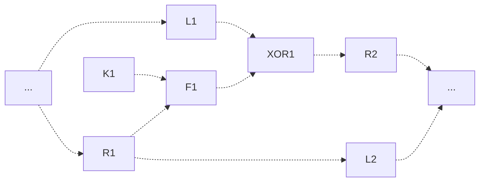
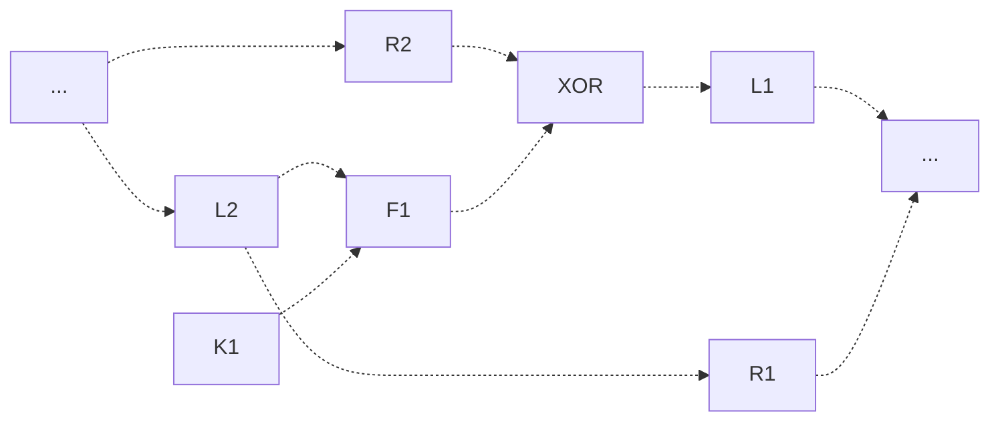
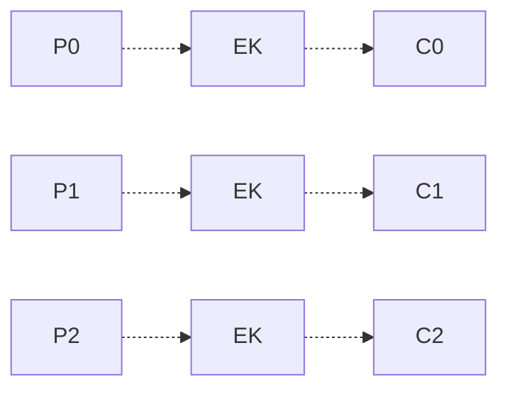
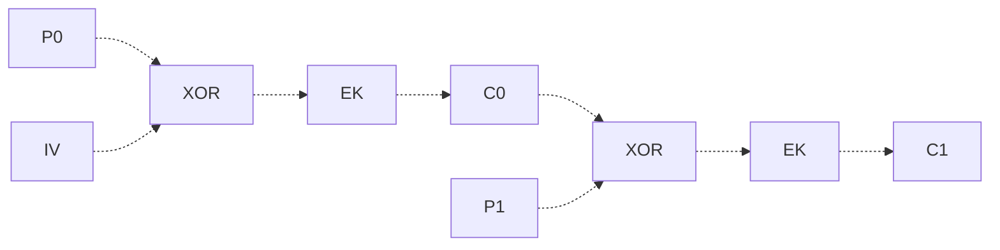
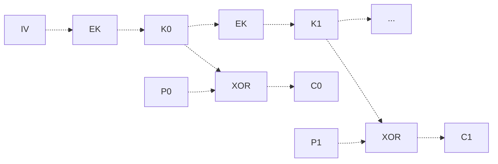
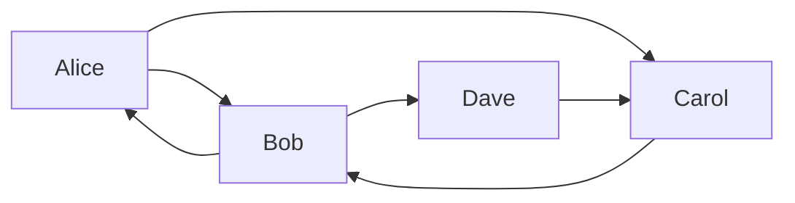
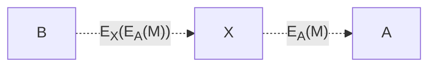

There are two main goals of cryptography:
- Keep secrets a secret (confidentiality, privacy, anonymity)
- Ensure that data is correct (integrity, authencity)

We survey the landscape of cryptography below.

# Introduction to Cryptography
## Principles
For any crypto system, there are some general principles to follow. 

**Kerckhoff's Principle** states that a cryptosystem should be secure even if everything about the system, except the key, is public knowledge.

**Schneier's Law** states that any person can invent a security system so clever that he or she can't imagine a way of breaking it.

There is no security through obscurity! It's important to have many people try to break through a system based on a full knowledge of it. Just because you think its unbreakable, does not mean it really is unbreakable.
> Don't trust any system that is not public! These systems are not vetted.

## Terminology
### Main Idea and Cryptosystems
Cryptography and related topics all have terminology of their own. This is discussed below.

One of the goals in cryptography is **keeping secrets**. This means that we want to be able to replace some or all of our message with something else, while being able to recover the original.
- **Encoding** refers to the replacement of a semantic unit (word, phrase) with something else
- **Enciphering** refers to replacing individual letters or bits with something else
- **Plaintext / Cleartext** refers to a message as written and intended to be read
- **Ciphertext** refers to a transformation of a plaintext so that it cannot be read, other than the intended recipient

The following terminology describes the technologists who work on ciphertext:
- **Cryptographers** create ciphers.
- **Cryptanalysts** break ciphers.
- **Cryptologists** study ciphers, both how they're created and how they're broken, to focus on how to use cryptography properly.

Both encoding and enciphering are examples of **encrpytion**, the process of transforming a plaintext into the corresponding ciphertext. Converse to this is **decryption**, transforming a ciphertextback into plaintext.

A combination of a encrpytion and decryption scheme is known as a **cryptosystem**. This also includes the algorithms that prepare and modify the inputs / outputs for our schemes, as well as protocols as to how we should properly use these schemes.

Participants in a cryptosystem have some conventionally used names that you find in all the literature.
- **Alice, Bob, Carol** are the typical participants in a cryptosystem. They may be cooperative or adversarial.
- **Eve** is an eavesdropper, who tries to wiretap into the communications. They may **passively wiretap** (just seeing all messages exchanged), or **actively wiretap** (modifying the messages being sent).
- **Trudy** is an intruder in the system who is not supposed to be there.

> In a system with an active wiretapper Eve, there's no guarantee that the messages sent and received are the original messages, which can easily complexify things!

### Important Mathematical Notation
We discuss some standard mathematical notation which will be used throughout cryptography.

Given a function $f$, we specify its domain $D$ and range $R$ in the form
$$
f : D \mapsto R
$$
> $\mapsto$ is the `\mapsto` symbol in LaTeX.

> [!Example]+ Example: Function Domains and Ranges
> $H : \{0,1\}^* \mapsto \{0,1\}^n$ is the function that makes any number ($*$) of 0's and 1's to 0's and 1's of length $n$. We have an arbitrary number of input bits map to a fixed length $n$ of output bits.
>
> $E : \{0,1\}^k \mapsto \{0,1\}^k$ is the function that maps $k$ input bits in the domain to $k$ output bits in the range. This may map a block of bits to another block of bits of the same length.

We additionally can specify a function's transformation on an input as
$$
f : x \to f(x)
$$
Where $x$ is the input to the function, and $f(x)$ is the output.

> [!Example]+ Example: Transformations of Inputs
> $E : m \to m^e \mod n$ describes a function which transforms $m$ by raising it to the $e$ power and taking the modulus of $n$.

### Cryptosystems
We have the following terminologies for algorithms in cryptography.

A **cryptographic hash** is a one-way function of the form
$$
H : \{0,1\}^* \mapsto \{0,1\}^n
$$
Such that $c = H(m)$ is easy to compute, but $m = H^{-1} (c)$ is infeasible. In other words, we can easily compute outputs given some input, but it's very difficult to reverse the function to recover the original input.

Say we have a message $m$ and ciphertext $c$. 

A **symmetric key cryptosystem** is a system with a single key shared by the sender and receiver. With key $k$,
$$
c = E(k,m) \qquad m = D(k,c)
$$
It's easy to both encrypt and decrypt our message with the key, but infeasible to do so without the key.

A **asymmetric key cryptosystem** is a system that has a public key that can be shared with potential senders, and a private key known only to the key owner. With public key $k_\text{pub}$, private key $k_\text{priv}$, message $m$ and ciphertext $c$,
$$
c = E(K_\text{pub}, m)
$$
Encrypting a message can be done by anyone, but
$$
m = D(K_\text{priv}, c)
$$
Decrypting the message can only be done efficiently by the key owner.

> [!Info] Cryptography for Signatures
> Cryptography can provide more than just secrecy! Cryptographic hashes can provide an integrity check on data, as we can use an encrypted (or hashed) form of the data and see the raw data hashes to this!
>
> However, if we do this, then we also need some way to check the integrity of the hash! This is where **digital signatures** come in.
>
> Say we have data $M$. Now, consider a cryptosystem with two functions
> $$
> E : \{0,1\}^b \mapsto \{0,1\}^b \quad D : \{0,1\}^b \mapsto \{0,1\}^b
> $$
> 
> Because the domain and range of $E$ and $D$ are identical, we can use them to encode and decode a message:
> $$
> s = D(K_\text{priv}, m) \quad m = E(K_\text{pub}, s)
> $$
> Where $s$ is a **digital signature** of the message with private key $K_\text{priv}$, which we can verify with the public key $K_\text{pub}$. Generally, the message $m$ will be the hashed data $m = H(M)$, given some cryptographic hash function $H$.
> 
> > We hash the data so our decoding doesn't require us to decode the entire plaintext data, making things more efficient!

But how do we evaluate cryptosystems?

The **random oracle model** is the standard model of cryptographic analysis. The oracle produces random output for any input, but any subsequent input that is the same as one prior will always produce the same output.

A **cryptographic primitive** is **cryptographically secure** if it's indistinguishable from a random oracle. In other words, if we give the primitive a bunch of inputs and look at the outputs, there will be no statistical difference between the primitive and the oracle.

> [!Info] Birthday Paradox
> Given $m$ samples from a set of $N$ options, the probability of a collision within the samples (us choosing the same option) scales at the rate of $\sqrt{N}$.
> 
> This is typically counterintuitive to many people! Commonly this is presented as the following: in a room of 30 people, there is a high probability that 2 of them share the same birthday.
>
> This has many implications in cryptography. Any hash function $H : \{0,1\}^* \mapsto \{0,1\}^b$ has a finite size, and by this paradox, we're likely to have collisions if only $2^{b/2}$ inputs are tried!
> > This determines our choice of block size depending on computing capabilities, and the number of times a block cipher can be safely used.

# Encoding and Enciphering Schemes
## Encoding
In encoding, we replace semantic unit with something else to replace it.

One example of encoding is to use **codewords**, to replace single or multiple words. For example, telegraph operators have standard replacements using 4-letter non-words for common longer phrases.

## Enciphering
Generally though, we don't use encoding, and typically opt for ciphers instead, where individual letters (or bits) are replaced with something else, without regard for their meaning.

Ciphers are typically classified based on their unit of operation.
- **Substitution Ciphers and Stream Ciphers** transform one symbol at a time. 
- **Block Ciphers**: Transform multiple symbols as a group

We discuss some ciphers below.

---

A common substitution cipher is the **Vigenere Cipher**. Given a plaintext input and some "key", we shift each letter of our plaintext by the letters of the key. 

More specifically, given some plaintext character $P$ at position $i$, we shift it by the character of the key $K$ at the same position $i$ (wrapping as necessary). We repeat this for all characters of our plaintext.
$$
C = P + K \mod 26
$$
For example, for plaintext $ABCDE$ with key $KEYW$, we have ciphertext $LGBAP$, as
$$
\begin{align*}
A + K = L \quad B + E = G \quad C + Y = B \\
D + W = A \quad E + K = P
\end{align*}
$$

These ciphers can be **monoalphabetic** or **polyalphabetic** depending on the size of the key. If the key is of size 1, it is **monoalphabetic**, as we essentially shift all plaintext by a fixed amount (ex. caeser's cipher).

Unfortunately, a large problem with these ciphers is that they're vulnerable to **frequency analysis**. We know how often different letters appear in natural language (as their frequencies are different), so we can expect to see similar distributions in our ciphertext.
> This can, in fact, be automated given we have enough ciphertext input!

---

A common stream cipher is the **one-time pad**. Given some plaintext message $M$ and random key stream $K$ of the same length (known to both sender and receiver), we first write them in their bitwise form. Then, we bitwise XOR the $M$ and $K$ together to obtain our ciphertext. 
> The random key stream is known as the **one-time pad**, because it never repeats. 

It's important that our key stream never repeats, as its randomness provides our ciphertext with **information theoretic security**! This means that any bit $C_i$ has an equal probability of being a 0 or 1, independent of all other bits! 

Because of this, **it's not possible to break a one time pad if it is done correctly**, as a ciphertext could easily decrypt to any plaintext message of the same length.
> Note that this does require a reliable stream of random numbers that both the sender and receiver share.  As soon as we repeat parts of the one-time pad, we become vulnerable to frequency analysis.

---

There are many types of block ciphers we'll talk about, though they will be discussed later. They are gien below.
- **Playfair**: Replaces pairs of letters based on some mapping stored within a grid.
- **Digital Encryption Standard (DES) / Advanced Encryption Standard (AES)**: Replace fixed-size blocks of bits according to one key, and a complex algorith of shifts and mathematical operations.
- **RSA**: Operates on fixed-size blocks, but has two keys, which are related by a mathematical property which can be utilized.


# Symmetric Key Cryptography
## Good Symmetric Cryptosystems
In a **symmetric key (shared key) cryptosystem**, the sender and receiver have the same key. As both parties must have the same key, this key musy somehow be transmitted by a mechanism outside of the system (**out-of-band mechanism**) or by some explicit **key-agreement protocol**.
> We can also use symmetric key cryptography to encrypt our own files! In this case, we're both the "sender" and "receiver" so there is no need to transmit the key.

> [!Example]+ Example: Simple Symmetric Key Cipher (and Breaking It)
> Let the key $K$ be a block of length $b$, $M$ a message of length $b$.
>
> Then, a simple symmetric key cipher is the `XOR` operation! By XORing our message or ciphertext with the key, we can recover the original result!
> $$
> C = M \oplus K \qquad M = C \oplus K
> $$
> > $\oplus$ denotes the XOR operation.
> 
> This is similar to a one-time pad, but is not exactly the same! Because we have fixed-length key we may reuse along the message, the reuse of this key makes it possible to crack our system!
>
> If we know the size of our key, we can break up the ciphertext into 1-byte groups for this key, and analyze the different groups of the ciphertext.
> - Groups that are XORed with the same part of the key can be compared to see what value of the key creates the ciphertext.
> - Repeated sequences of bytes may indicate the same character.
>
> We may be able to use this to reverse engineer the key! This is a process that is automatable.

The previous example showed a symmetric key cipher which was not the best. So what makes a symmetric key cipher good?

A good **block cipher** will have the following properties.
- **Confusion**: Each bit in $C$ depends on many bits in $K$ (ideally non-linearly)
- **Diffusion**: Flipping a bit in $M$ flips about half the bits in $C$, and flipping a bit in $C$ flips about half the bits in $M$.

> Our previous example had neither! Each bit in $C$ depended on only one bit in $M$, and flipping a bit in $C$ only flipped one bit in $M$.

Below, we will look at some specific examples of good block ciphers.

## Symmetric Block Ciphers
### SP Networks
**SP Networks** are a type of symmetric block cipher that uses substitution and permutation to achieve a cipher, in what we call S-Boxes and P-Boxes.

**S-Boxes** mix input bits into output bits to establish confusion. For a single box taking in a block, they must satisfy the following properties:
- Each input bit mixes into every output bit
- Changing an input bit changes roughly half of the output bits
- Invertible, as we need to be able to decrypt the message
- Usually block size is several S-boxes wide

> Typically for an input, we will need to split it up into multiple S-boxes.

**P-Boxes** permute outputs of S-boxes to establish diffusion. They:
- Makes a 1-1 mapping of the input bits to different positions in the output bits.
- Full width of the block, to mix output from separate S-boxes.

So, for our input, we will do the following.
1. First, split the input up depending on the sizes of the S-boxes.
2. Run the splits through the S-boxes.
3. Take the outputs of the S-boxes, and run it through a P-box to permute their order.

This defines one **round** in an SP Network. Typically, we will run multiple rounds in an SP Network to encrypt well. 
> SP Networks essentially shuffle our input around, and we run multiple rounds so our shuffle is robust and unpredictable!

> [!Example] Example: SP Network Analogy
> Consider the following analogy for an SP Network.
> 
> Say we have a very large deck of cards to shuffle. 
> 1. First, we can break the deck up into several smaller "sub-decks" which we shuffle. This is like an S-box!
> 2. Then, after shuffling each subdeck, we cut them back together to form one deck. This is like a P-box!
> 
> Here, one round isn't enough to randomize the cards, but if we repeat this several time, we can achieve something that seems very random!
> > Here, shuffling isn't really invertible, which is why this is an analogy. But the analogies for S and P boxes hold!

### Feistel Cipher
A **Feistel Cipher** is another type of symmetric block cipher, defining a system $\psi$ of an even number of functions
$$
\psi (f_1, f_2, \dots f_{2k})
$$
With the property that the inverse is us using the functions in the opposite order.
$$
\psi^{-1} (f_{2k}, \dots, f_2, f_1)
$$

It is often the case that each $f_i$ is built from a single function $F : \{0,1\}^{b/2} \mapsto \{0,1\}^{b/2}$, with different key inputs $K_i$ (one for each $f_i$). These keys form what's known as a **key schedule**.

Now, given our plaintext $P$, we will split it into a pair $(L_0, R_0)$, where $L_0$ is the first $b/2$ bits, and $R_0$ is the last $b/2$ bits. 

---

To **encode** our message, in a single step, we do the following on the left and right sides. 
$$
L_{i+1} = R_i \qquad R_i = L_i \oplus F(R_i,K_i)
$$
Repeating this $n$ times, we get ciphertext
$$
C = (R_{n+1}, L_{n+1})
$$

So for a single step of encrpytion, we will do the following.

```mermaid
graph LR
L1; R1; F1; K1; XOR1;
L2; R2;
P[...]; C[...];

P -.-> L1 & R1;

L1 -.-> XOR1;
R1 -.-> F1 & L2;
F1 -.-> XOR1;
K1 -.-> F1;
XOR1 -.-> R2;

L2 & R2 -.-> C;
```

---

To **decode** our message, we can invert our computations by repeating
$$
R_i = L_{i+1} \qquad L_i = R_{i+1} \oplus F(L_{i+1}, K_i)
$$
> Note that we can do this, as we know that $L_{i+1} = R_i$.

We can repeat this to find $P = (L_0, R_0)$. So for one step of decryption, we would go through the following process.


```mermaid
graph LR
L2; R2; F1; K1; XOR; L1; R1;
P[...]; C[...];

C -.-> L2 & R2;

L2 -.-> F1 & R1;
R2 -.-> XOR;
F1 -.-> XOR;
K1 -.-> F1;
XOR -.-> L1;

L1 & R1 -.-> P;
```

Decoding works because of properties of XOR! If we have $A \oplus B = C$, then given the output and a single input, it's possible to reconstruct the second input: $B \oplus C = A$. This is exactly what we're doing here!

---

Note that by how we do the Feistel Cipher, a critical feature is that the same function $F$ is being used for encryption and decryption, so $F$ **does not have to be invertible**!


## Data Encryption Standard (DES)
The **Data Encryption Standard (DES)** is a cryptosystem that operates on 64-bit blocks with 56-bit keys (plus 8 parity bits).
> Originally, DES was made with 64-bit keys, this was changed to 56-bit keys with parity bits as this makes DES robust against differential crpytoanalysis (which the 64-bit version was weak against).

DES performs a 16-round Feistel cipher, where each Feistel function operates on 32 bits of data each. The function $F$ is composed of 8 **different** $S$-boxes and a single $P$-box, where each $S$-box has a 6 bit input (4 for the message, 2 for the key) and a 4 bit output.

It's known that DES is not secure, mainly because 64-bit blocks are too small and can be broken quickly. An extension of DES, 3DES, was created to address these issues, with 3 (sometimes 2) different DES keys. 
- To **encrypt** a message in 3DS, we encrypt with key $K1$, "decrypt" with key $K2$, and then encrypt with key $K3$.
- To **decrypt** a message in 3DS, we decrypt with key $K3$, "encrypt" with $K2$, and decrypt with $K1$. 
$$
C = E_{K3} (D_{K2} (E_{K1} (P))) \qquad P = D_{K1} (E_{K2} (D_{K3} (C)))
$$

But even 3DES was eventually deemed insufficient as well, and this was eventually also replaced with the **Advanced Encryption Standard (AES)**!

AES does not use a Feistel cipher, and was created to support multiple key / block sizes: 128 bits (10 round cipher), 192 bits (12 round cipher), and 256 bits (14 round cipher). 
> This is what the number means in `aes128`, `aes192`, `aes256`!

> [!Info] Robustness of AES
> There are no practical attacks yet known against the algorithm, though there (like all algorithms) is the risk of **side-channel attacks**, which exploit implementation details. These attacks try to predict the amount of 0's and 1's based on the amount of time the algorithm takes.

## Modes of Operation
While block ciphers can be used on only one block, this is often quite rare. Most of the time, we want to extend our block cipher into multiple blocks.

This will convert our block cipher into a stream cipher, and the way we do this is known as the **mode of operation**. We will now look at some modes of operation below.

### Electronic Code Book (ECB)
The **Electronic Code Book (ECB) Mode** is possibly one of the easiest to conceptualize modes of operation. In ECB, each block of ciphertext is the encryption of the corresponding block of plaintext with the same key!
$$
C_i = E_K (P_i)
$$


```mermaid
graph LR
P0 -.-> 1[EK] -.-> C0;
P1 -.-> 2[EK] -.-> C1;
P2 -.-> 3[EK] -.-> C2;
```

This is easy to understand, and very easy to parallelize too! However, this is very vulnerable to attacks.

If you have a repeated plaintext block, you have a repeated ciphertext block! This makes ECB vulnerable to **splicing attacks**, where an attacker may be able to use what they know about the ciphertext to create their own messages, even without the plaintext!
> For example, if we know two numbers are presented at some point in the text, and one represents something, we may be able to splice in the other number's ciphertext to achieve nefarious effects.

This may be okay in a **challenge-response** system, where we send a specific message expecting a specific response, but otherwise, may not be the safest.

> [!Warning] 
> If you see a "secure" connection with "ECB" in the ciphersuite, be very careful. It is not a very acceptable mode of operation to use.

### Cipher Block Chaining (CBC)
In **Cipher Block Chaining (CBC) Mode**, we chain blocks of ciphertext together to encrypt our message. For every block of ciphertext we generate, we will `XOR` this block with the next plaintext input and use this as the next input to our block cipher. 

More formally,
$$
C_i = E_K (P_i \oplus C_{i-1})
\qquad
C_0 = E_K (P_0 \oplus IV)
$$
Where $IV$ is some **initialization vector** used for the first block. This should generally be random, and be encrypted first so that it's easy to recover.


```mermaid
graph LR
P0 & 1[IV] -.-> x1[XOR] -.-> e1[EK] -.-> C0;
C0 & P1 -.-> x2[XOR] -.-> e2[EK] -.-> C1;
```

Because every ciphertext block depend on the previous ciphertext blocks, CBC obscures repeated pattenrs! This makes CBC resistant to splicing, so its very reasonably used.

However, CBC is not parallelizable at all, which is a bit of a problem when it comes to efficiency.

### Output Feedback
In **Output Feedback (OF) Mode**, instead of encrypting plaintext blocks with our encryption function $E_k$, we will **encrypt our key instead**! Then, we simply `XOR` our encrypted keys with the plaintext to produce our ciphertext. 

So for any block $i$, we find the key for the block as
$$
K_i = E_K (K_{i-1}) \qquad K_{-1} = IV
$$
Where $IV$ is the initialization vector. This creates a **key stream** that is used to created our ciphertext.
> To get each key, we will continuously encrypt our key!

Then, for any block $i$, we create our ciphertext by `XOR`ing key $K_i$ with our plaintext.
$$
C_i = P_i \oplus K_i
$$


```mermaid
graph LR
IV -.-> e1[EK] -.-> K0 -.-> e2[EK] -.-> K1 -.-> e3[...];
P0 & K0 -.-> x1[XOR] -.-> C0;
P1 & K1 -.-> x2[XOR] -.-> C1;
```

With this scheme, given our $P_i$, we can recover our key $K_i$ and replace it with any block we'd like! This makes it very easy to splice (giving us no message integrity), but lets us parallelize many blocks, especially if we can precompute our key stream!
> This does require that we have a way of providing message integrity separately. 

### Counter Encryption (CTR)
**Counter Encryption (CTR) Mode** is similar to Output Feedback mode, but instead of encrypting the previous key block, we encrypt the initial initialization vector plus a block number.
$$
K_i = E_k (IV + i)
$$

Because this does not depend on knowledge of the previous key stream, this is easier to parallelize than Output Feedback mode! Furthermore, it has a longer cycle length (so we have longer until we need to worry about birthday paradox collisions), $2^n$ (CBC and OFB are $2^{n/2}$).

However, it is still vulnerable to splicing like before, which raises concerns around integrity.

### Message Authentication Mode (MAC)
Unlike the other modes, **Message Authentication Mode (MAC)** is **not** an encrpytion mode, but instead is a mode for integrity. Given a message, we can create a **message authentication code** from it, letting us confirm that the contents of the message are unmodified and are as intended.

CBC-MAC builds off of CBC mode, but only keeps the last block as a form of integrity check so we know our message is correct. This is really effective for fixed-length messages!

For variable length messages, CMAC mixes $K$ into the next-to-last block encrpytion. This prevents **extension attack**, where someone concatenates a malicious extension onto the message, as the last block will be very different if $K$ is mixed into the previous block.
> We can also use a hash function with a key to create a message authentication code. 

> [!Info] Encryption and Integrity
> Recall how OF and CTR mode fail to provide integrity checks for our message. So how do we do this?
>
> There are 3 common ways to do this:
> - **Encrypt-then-MAC**: We encrypt the plaintext, and then perform a keyed hash on the ciphertext as a MAC. Used in the IPsec protocol.
> - **Encrypt-and-MAC**: We encrypt the plaintext, and then perform a keyed hash on the **plaintext** as a MAC. Used in SSH.
> - **MAC-then-Encrypt**: We compute a keyed hash on the plaintext, then encrypt the plaintext and hash as a single message. Used in SSL (Secure Socket Layer) / TLS (Transport Layer Security).
>
> > One standard implementation of MAC-then-Encrypt is **CCM**, where CBC-MAC is performed for the keyed hash, and then CTR for the actual encryption.

## Cryptographic Hash Functions
Recall a hash function $H$ takes any arbitrary number of input bits, and maps them to a fixed number $b$ of output bits.
$$
H : \{0,1\}^* \mapsto \{0,1\}^b
$$

In a good hash function: 
- Small changes in the input should result in large changes in the output.
- Given $H(x)$, it should be **very hard** to find some $x$ mapping to a particular output-- and there should be on average $2^{b/2}$ guesses.

The following algorithms have commonly been used for hashing.
- `SHA-1`: Takes a maximum of $2^{64} - 1$ bits, and hashes to $160$ bits.
- `SHA-256`: Takes a maximum of $2^{64} - 1$ bits, and hashes to $256$ bits.
- `SHA-512`: Takes a maximum of $2^{128} - 1$ bits, and hashes to $512$ bits.

We can also build cryptographic hash functions from block ciphers! However, in doing this we need to consider the Birthday Paradox.

So how do we properly use hash functions? Given a good hash function $H$ and a key $K$, we can create a good message authentication code $MAC$.
$$
MAC = H(K | M)
$$
Where `|` denotes the concatenation of $a$ and $b$.

We could also create a Feistel cipher with the function
$$
\psi(f_1, f_2, f_3, f_4) \qquad f_i (x) = H(K_i | x)
$$
> The **Luby-Rackoff Result** proves that this is a good block cipher, given that $H$ is a good hash function.

## Limitations of Symmetric Key Cryptosystems
### Limitations
Despite the obvious benefits of symmetric cryptosystems, there are still many limitations.

First, secret keys are **pairwise**. So, for $n$ pricipals in a system who need the keys, there are $O(n^2)$ key exchanges, and it only takes one of these exchanges to be compromised to break the system.
> Key exchanges are vulnerable to man-in-the-middle attacks, so we oftenlack **authentication**.

Second, all principles are required to be **online**. If someone distributes an encrypted file and then disappears, there's no way to verify that the file is correct or to obtain a new key. 

So how do we overcome these limitations?

### Trusted Third Parties (TTP)
One thing we could do is use a **Trusted Third Party (TTP)**.

If Trent is a trusted third party, then Alice and Bob can use Trent as an intermediary. Now,
- Alice and Bob only need to exchange keys with Trent, $O(n)$ key exchanges which is significantly fewer than before.
- Because the key exchange for each participant only needs to be done once, its possible to strongly authenticate Trent..

However, by doing this, Trent also becomes a bottleneck of the system, and a central point of failure, which can greatly impact availability. 

Furthermore, we're placing all of our trust in Trent, and authentication does not imply trustworthiness. So, just as we have other models, we also need a **Trust Model**. We need to answer the questions: 
- Who are we trusting? 
- Who is doing the trusting? 
- What are we trusting them with?
- What are we trusting them to do or not do?

> [!Info] TTP Trust Model
> - Who are we trusting? Trent
> - Who is doing the trusting? Alice, Bob, and other communicants. 
> - What are we trusting them with? All of the communications,including timely delivery.
> - What are we trusting them to do or not do? We trust them to deliver messages with strong confidentiality, integrity, and with availability. We trust them not to disclose messages, drop or delay them, or modify them.
>
> Note that in this model, we are completely trusting Trent with everything.

> [!Example]+ Example: Kerberos
> One example of TTP being used (in a way addressing these issues) is **Kerberos**, which uses symmetric key cryptography and a TTP. However, it decentralizes some of the TTP functionality by delegating support from some of the services.
>
> Our central point of trust is an **Authentication Server (AS)**. What it will do is grant Alice a **Ticket Granting Ticket (TGT)** for a specific **Service Server (SS)**, encrypted with that server's symmetric key.
>
> Alice cannot decrypt the ticket, but the Service Server can use it in order to verify who Alice is. So here, the AS is required for users to log in, but the SS can interpret the TGT regardless of if the AS is online or not. This decentralizes the system!


# Asymmetric Key Cryptography
## Public Key Cryptosystems
In an **asymmetric key (public key) cryptosystem**, the sender and receiver have different keys.
- The **public key** is used to encrypt, and can be given to anyone.
- The **private key** is used to decrypt, and must be kept a secret by the owner. 

This is incredibly useful for communications, authentication, and even to create digital signatures!

At the core of any public key cryptosystem is a hard problem, a **one-way trapdoor function**. 
- **Trapdoor**: Only with the private key should the encryption function inverse should be easy to compute.
- **One-Way**: Without the key, the inverse is infeasible to compute.

This is commonly done by factoring products of large prime numbers, or discrete logarithms (discussed later).

Most public key cryptosystems use **modular arithmetic** (the modulus operator).
$$
a \equiv b \mod n \iff a \mod n = b \mod n
$$
In modular arithmetic, some things are easy!
$$
\begin{align*}
&a + b \mod n &a - b \mod n \\
&a * b \mod n &a^b \mod n
\end{align*}
$$
However, there are some things that are not so easy. For example, finding $b$ such that $c \equiv a^b \mod n$, known as the **discrete logarithm**. 

> [!Info] Other Public Key Cryptosystems
> Some other (uncovered) public key cryptosystems are given below.
> - **ElGamal** generates a pair of elements as ciphertext, and employs a random element which is incorporated into both elements. 
> - **Elliptic-Curve Cryptography** relates to calculations involving elliptic curves.

## Diffie-Hellman Key Agreement
The **Diffie-Hellman** assymetric cryptosystem is based around the following hard problem:

Given a prime number $p$, value $\alpha$ that generates $\mathbb{Z}^*_p$ (all integers modulus $p$, excluding 0), $\alpha^x \mod p$, $\alpha^y \mod p$, it is hard to find $\alpha^{xy} \mod p$. 
1. Alice begins by selecting $x$ randomly from the closed interval $[1, p - 2]$.
2. Alice sends $\alpha^x \mod p$ to Bob.
3. Bob selects another value $y$ randomly from the closed interval $[1, p - 2]$.
4. Bob can now compute a value $K = (\alpha^x)^y \mod p$.
5. Bob sends $\alpha^y \mod p$ back to Alice.
6. Alice takes $\alpha^y$, raises it to $x$, takes $\mod p$ to end with the value Bob has. This establishes a shared key that is discarded after the session completes.

> Alice's public key is $p, \alpha, \alpha^x \mod p$ with private key $x$. Bob's public key is $\alpha, p, \alpha^y \mod p$ withb private key $y$.

## RSA
The **RSA** assymetric cryptosystem is the most widely used public key algorithm. 

We are given the following:
- Some number $n$, which is the product of two primes $p, q$
- A value $e \in Z^*_n$ (integers modulus $n$, excluding 0; multiples of $p$ and $q$)
- $m^e \mod n$

We are asked to find $m$, our message.

One party knows some value $d$ such that 
$$
e \cdot d \equiv 1 (\mod (p - 1)(q - 1))
$$
With $d$, we can easily find $m$ as
$$
m \equiv (m^e)^d \mod n
$$
However, it is hard to compute $d$ without factoring $n$ into $p$ and $q$, even given $e$.

Typically, our public key(s) are $n, e$, private keys are $p, q, d$. $e$ is usually 3 or 65537, as both of these only have 2 bits flipped, and in modular exponentiation the 1s denote a multiplication, and the 0s denote a shift (making it a lot computationally faster to compute).
$$
c = E(K_\text{pub}, m) = m^e \mod n 
\qquad
m = D(K_\text{priv}, c) = c^d \mod n
$$

> [!Info] Weaknesses of RSA
> Some weaknesses of RSA are as follows:
> - Because $E(K_\text{pub}, m)$ is always the same, we can perform a **chosen-plaintext attack** using the potential messages.
> - Encrypting the same message with different public keys $E((n,e),m), E((n',e),m)$, a mathematical result known as the **Chinese Remainder Theorem** could be used to decrypt the message.
>
> These problems can easily be overcame by randomly padding plaintexts so that the messages are never the same.

There are some implications of RSA:
- No two principles can have the same modulus $n$, or else they will be able to decrypt each other.
- A message $m$ must be less than $n$, and must in fact be even smaller due to the need of padding. This may require us to split long messages into many blocks.
- Decryption can be rather slow.

> [!Info] RSA Signatures
> Public key encryption schemes can be used to create digital signature schemes!
>
> We define our **sign operation** $S$, as
> $$
> S(K_\text{priv}, M) = D(K_\text{priv}, H(M))
> $$
> Where $H$ is a cryptographic hash function (commonly SHA-1 or SHA-256). In other words, we create our signature by "decrypting" some hashed message using our private key.
> 
> Then, we define our **verify operation** $V$, as
> $$
> V(K_\text{pub}, s, M) = H(M) \equiv E(K_\text{pub}, s) (\mod n)
> $$
> Or in other words, the encryption of our result.
> 
> For example, if $s = S(K_\text{priv}, M) = H(M)^d \mod n$, then $E(K_\text{pub}, s) = ( H(M)^d \mod n)^e \mod n = H(M)$.


# Using Crpytography
## Digital Certificates
Recall in assymetric cryptosystems, that we have a notion of a public and private key. For example, the public key in RSA is $K_\text{pub} = (n,e)$. But how do we know whose public key this is? We need some way to bind someone's identity to their public key, so we know who we're communicating with.

This can be done with a **digital certificate**, which is a binding that has been signed by some third party. This is often a trusted third party, though it can also be self-signed. Digital certificates include:
- A unique serial number issued by the certificate provider
- Validity dates specifying what times the certificate is valid between
- The subject / identity
- The public key algorithm
- The public key to be used
- The signature algorithm being used, and the signature itself

An example of a signature is given below.
```bash
$ openssl x509 -in mmarsh.req.cert -noout -text
Certificate:
    Data:
        Version: 3 (0x2)
        Serial Number: 1428829381 (0x552a34c5)
        Signature Algorithm: sha256WithRSAEncryption
        Issuer: CN=CA, OU=CA, 0=soucis
        Validity
            Not Before: May 5 20:29:24 2017 GMT
            Not After : Jan 30 20:29:24 2020 GMT
        Subject: 0=soucis, OU=user, CN=Michael Marsh
        Subject Public Key Info:
            Public Key Algorithm: rsaEncryption
            RSA Public Key: (4096 bit)
                Modulus (4096 bit):
                    00: fe:e2:a3:4c: 1c:63:1a:f2:aa:d3:70: bd: d2:8c:
                    ....
                    4f: a6:0c:ef:b3:f6:9c:46:65:94:9f:03:45:73:64:
                    e0: ff:f7
                Exponent: 65537 (0x10001)
        X509v3 extensions:
            X509v3 Authority Key Identifier:
                keyid: CE: 6A: A6:71:63: CF:58:0B: F1:25:E2: B6:5C:0E: AD: 73:51:3E: D6: E7
            X509v3 Subject Key Identifier:
                DF: 69:B6:41:CF:FC: 21:25: C8:5D: CC: A7:89: A2: C8:3F: 92:00: 66:3D
        Signature Algorithm: sha256WithRSAEncryption
            6b: 10:11:19:fc:e7:d4:0a: b8:67:58: c4:f8:97:99:51:76:60:
            ...
            45: a0:b0:64:ff:f8:3f:97:ec:22:23:74:bc:61:0a:a3:b3:cf:
            08: ab: ee: 29
```

All certificates have an issuer who signs it with a validity period. But, to know the issuer is valid, we then need the issuer's certificate. How do we know the issuer's certificate is valid? 

## Verifying Certificates
One way we can do this is **certification authorities (CAs)**. These are entities whose sole purpose is to sign certificates. At their root, are **root certification authorities**, who are **roots of trust**: entities who we trust implicitly; all of our trust in certificates flows from these root CAs.

Certification authorities issue certificates to users, servers, or intermediate certificates. These certificates are continuously issued up to the websites we visit, leaving us with a chain of certificates that we can use to see the chain of trust.
> Generally, root authorities are pre-loaded into our browser! 

To receive a certificate, a principal will have to make a **certificate** request. An example of a request is as follows:
```bash
$ openssl req -in */Downloads/XXXX.req -noout -text
    Certificate Request :
        Data:
            Version: 0 (0x0)
            Subject: 0=soucis, OU=user, CN=XXXX
            Subject Public Key Info:
                Public Key Algorithm: rsaEncryption
                RSA Public Key: (4096 bit)
                    Modulus (4096 bit):
                    00: a8:fe:4a:3e:d0:4e:d1:ad:93:b3:76:fe:c1:78:
                    ...
                    65:17:36:d9:49:22:9a: c9:45:79:e5:14:9f:bd:ed:
                    a1:0d:8d
                Exponent: 65537 (0x10001)
        Attributes:
            a0: 00
    Signature Algorithm: shalWithRSAEncryption
        48: cb:42:38:f7:d0:2a:d7:8d:95:96:20:60:ae: 19:9d:82:ac:
        91:0c:66:b5:4a: 92:4b: ec:f1:41:59:ee:47:0e:9f: c7:b7:05:
        08: e9:1e: 1d: 83:1c: 2b:
```
Such requests are signed with the subject's private key. The authority can then use the subject's public key to verify that it is in fact the subject.

A certification authority should be verifying that the requestor in a **certificate request** actually represents whoever the request is for. 

This usually will work, but isn't perfect! 
- **Rogue CAs** may sign bogus certificates.
- Some CAs only provide this level of verification for higher paying customers, and issue "less-secure" certificates for others. However, we as the users don't get to know which ones are less secure!

---

Another way we can validate certificates is through **web of trust**. Instead of relying on third parties as a root of trusts, we start as our own root of trusts.
> Those using this model typically do so through the GNU Privacy Guard, or Pretty Good Privacy (PGP)!

1. Alice and Bob meet (possibly at a key-signing party)
2. They exchange public keys
3. They sign those keys and hand each other the certificates

Anyone with a certificate for Alice now can validate Bob's certificate from Alice! This establishes Bob's identity from Alice.
> If Bob has a certificate signed by Alice, we sometimes refer to him as "Alice's Bob" when he uses this cert.

This forms a web of trust connecting users, where each can validate each other's identity. This does, however, require that we are able to form a **trusted path** from verifier to subject.

For example, consider the below web of trust with 4 participants. Let $X \to Y$ idicate that $X$ signed a certificate for $Y$.


```mermaid
graph LR
Alice --> Bob & Carol;
Carol --> Bob;
Bob --> Alice & Dave;
Dave --> Carol;
```
> Here, because both Carol and Alice have signed certificates for Bob, we can say that Bob is Alice's Bob, and Carol's Bob! Thus, Bob's identity is being established by Alice and Carol.

In this web of trust, between any subject and verifier, there exists a path! Thus, we will always be able to verify someone's identity through someone else. 
> In the case that we don't have a path, we'll need some way to bridge this missing link! Most likely, this means that you'll have to find some way to contact them to exchange certificates.

## Using Certificates
Digital certificates are widely used in many parts of the web.
- CA-based certificates are commonly used on the web for encrypted connections (like HTTPS)
- PGP-based certificates (when used) are "commonly" used in emails for signing messages.

> For PGP-based certificates, this requires that the mail client has a PGP or GPG capable extension.

However, certificates are not the only thing we need to establish secure communications. We also need
- A distribution mechanism for CA certificates to pass certificates out
- A **revocation list**, to make **revocations**, statements about certificates marking them as no longer being valid (other than their natural expiration date). There can be many reasons for revocations, the most common being the compromising of a private key (requiring regeneration of the certificate).

> Unfortunately, due to the rarity of revocations, and the time-cost of loading, many browsers don't check for revocations.

With both of these, we have a **Public Key Infrastructure (PKI)**.


# Combining Symmetric and Assymetric Key Cryptography
Let's now compare symmetric and assymetric key cryptosystems. From NIST publication SP 800-57 Part 1 Rev. 4 by Elaine Barker, we find that

| Security Strength | Symmetric System | RSA Key Length | Elliptic Key Length | Hash Functions | 
| :-: | :-: | :-: | :-: | :-: |
| 80 | 2-Key 3DES | 1024 | 160-223 | SHA-1 |
| 112 | 3-Key 3DES | 2048 | 224-255 | SHA-224 |
| 128 | AES-128 | 3072 | 256 - 383  | SHA-256 |
| 192 | AES-192 | 7680 | 384 - 511 | SHA-384 |
| 256 | AES-256 | 15360 | 512+ | SHA-512 |

We don't like the key distribution aspect of symmetric key, but we also don't like the performance aspect of assymetric keys. How could we get the best of both worlds?

What if we combined these distribution techniques? We could use assymetric key distribution to distribute a symmetric key, and then use the symmetric key for communication!

Consider the following example. Let $A$ and $B$ be principals in this system.
1. $A$ first selects a random nonce $n_A$. Then,
   1. They encrypt a message $M_1 = E_B (n_A)$ with $B$'s public key
   2. They create a signature for the message $s_1 = S_A (M_1)$ with $A$'s private key.
2. $A$ sends $M_1, s_1$ to $B$.
3. $B$ then:
   1. First, $B$ verifies that the message was sent by $A$ by comparing $M_1$ and $s_1$, given $A$'s public key. 
   2. Then, $B$ decrypts the nonce using their private key $n_A = D_B (M_1)$.
   3. $B$ selects a symmetric key $k_{AB}$, and computes a value $n_B = n_A \oplus k_{AB}$. This $n_B$ will be sent to $A$ so both parties have the symmetric key.
   4. $B$ then encrypts $n_B$ with $A$'s public key, $M_2 = E_A (n_B)$.
   5. $B$ also creates a signature for the message with $B$'s private key $s_2 = S_B (M_2)$.
4. Both $M_2, s_1$ are sent back to $A$.
5. $A$ then:
   1. First, verifies that $M_2$ was sent by $B$ using the signature $s_2$.
   2. Then, uses the private key to decrypt $n_B = D_A (M_2)$
   3. Finally, computes the symmetric key $k_{AB} = n_B \oplus n_A$.

This is an example of a **key exchange**! We use the security of assymetric key cryptography to share the symmetric keys, and then use symmetric key cryptography to communicate after this.

> [!Info] Group Encryption
> Suppose we want to send encrypted data to a large number of principals (ex. videoconferencing, subscription services, etc.).
> - It's not possible to do public / private keys, as there are too many public keys to compute.
> - It's not possible to do secret keys, as this would make for a very expensive and slow key exchange (even if we only have to do it a few times).
> 
> In general, both result in lots of individual messages, and extremely long messages that contain lots of copies of encryption (one for each principal). How can we do this in an efficient and secure way?
> 
> Instead, we will employ a **group encrpytion mechanism**. We want to create a single symmetric key for a stream, that can be shared with everyone. This key could be distributed on by some central authority, or agreed upon / determined by the set of users.
> > A common way to do this is with **key trees**!
> 
> There are some issues in doing this that should be considered:
> - Key distribution needs to be fairly efficient
> - Only legitimate group members should be able to learn the key
> - Keys must be changed when members join or leave the group, so that at any time people outside the group cannot decrypt the stream.


# Anonymous Communications
We now talk about how we can enable anonymous communications through cryptography. 

**Anonymity** refers to the inability of an adversary to determine who is communicating.
- **Sender Anonymity**: We cannot determine the true sender from a set of potential senders
- **Receiver Anonymity**: We cannot determine the true receiver from a set of potential receivers

$k$-**anonymity** means that the adversary cannot distinguish the communicant from a pool of $k$ potential parties.
> Anonymity does not necessarily mean you have something to hide. While it can enable bad behaviors, it also is needed to uphold privacy, let people look up embarassing or stigmatizing information, and express their ideas freely.

> [!Example] Examples: Anonymity Examples
> The following are examples of sender anonymity, where we don't know who the true sender is.
> - Ransom notes
> - Flier on a utility pole
> - Message in a bottle
> - Pirate radio station
>
> The following are examples of receiver anonymity, where we cannot determine who received the message.
> - Coded classified ads
> - Number stations
> - TV / radio receivers
> - Public libraries

## Dining Cryptographers (DC-Nets)
Let's now examine an anonymity system, known as **dining crpytographers**. This system tries to answer the following problem:

Given $k$ parties, how can one transmit a message without any of them knowing who it was?

Consider the following example.

> [!Example] Example: Simple DC-Net
> Let's start with 3 people and generalize from this. Say we have Alice, Bob, and Carol who want to determine who paid for dinner anonymously without violating any of their anonymity. Was it one of them, or a third party?
> 
> Each party flips a coin, visible to only one other participant. Each then announces the XOR of the coins that they see (assuming heads is 1, tails is 0). If one of them paid, they flip their bit. If the XOR of all announced bits is 1, then someone must have paid!
> > This works because by doing the XOR on every possible pair of coins, we are XORing each value with itself exactly once, meaning the result (if no one paid) is always 0.

This is known as a **dc-net**.

Generalizing, let $A,B,C$ be our participants. For any participant $P$, they will transmit message $T_P$, which is an xor of their message with theirs and the adjacent participant's key. 
$$
T_P = k_P \oplus k_{P+1} \oplus m_P
$$
If we xor all of the participant's messages together, then we'll get the xor of only the message together!
$$
\begin{align*}
T &= T_A \oplus T_B \oplus T_C \\
    &= (k_A \oplus k_B \oplus m_A) \oplus (k_B \oplus k_C \oplus m_B) \oplus (k_A \oplus k_C \oplus m_C) \\
    &= m_A \oplus m_B \oplus m_C
\end{align*}
$$

### Generalizing to Multiple Bits
This can work beyond 1 bit systems, as long as the size of the keys and messages are the same! This does however require that:
- We need a way to generate sufficiently long shared keys
- We need to regenerate the keys for every message (set-up costs are high)

### Generalizing to More than 3 Participants
This can also work beyond 3 participants! In this case, we need to set up pairw-sei keys between participants.

For any two participants $P_i$ and $P_j$, they should share the keys $k_{ij} = k_{ji}$. Then, participant $i$ will transmit message
$$
T_i = M_i \oplus [\oplus_j k_{ij}] \qquad \forall j \ne i
$$
Or in other words, we xor our messgae $M_i$ with the xor of all keys that participant $i$ shares with others. This guarantees that every key $k_{ij}$ is canceled out in the final message!

For $n$ participants, this does however require $\frac{n(n-1)}{2}$ shared keys to be established for every message, and $n$ broadcasts (one from each participant) to send a message, which could just be null.

It's possible to make this more efficient, but any gains in efficiency may lead to decreases in anonymity.

### Generalizing to More than 1 Message
What if we want to send more than one message? Say, if a participant wants to continue communications. Then, we may risk collisions of communications as multiple participants interfere with each other!

It's possible to solve both simultaneously by dividing time up into **message time slices** that follow some schedule. 
- At some time, everyone will exchange keys.
- Then, at some time after that, everyone will do their broadcasts.

We repeat this for the duration of the protocol. 

This makes it quite easy to detect collisions, as any participant $P_i$ sending a message can verify that the final message $T = M_i$ was the message they sent! If they notice a collision, they can simply wait a random number of time slicesbefore trying again. If the messages are infrequent enough, eventually all will be sent without collision!
> Note that any participant $P_i$ not sending a message would have no knowledge of if a collision occurred or not.

## Mixnets
Let's now examine another anonymity system, known as **mixnets**. This system tries to answer the following problem:

Given $N_S$ senders, $N_R$ receivers, and a mailserver $M$, how can we prevent an observer from determining what sender is communicating with what receiver?

In the system, we have a **mix** $X$. If $B$ wants to send a message to $A$, $B$ will sent a message to $X$, encrypted with both $A$'s public and $X$'s public key. $X$ will then decrypt the message and send it to $A$!


```mermaid
graph LR
B -. E<sub>X</sub>(E<sub>A</sub>(M)) .-> X -. E<sub>A</sub>(M) .-> A;
```
> Note that as the message is encrypted with both $X$ and $A$'s keys, $X$ cannot actually see the contents of the message! 

In a system with few participants, this means nothing as if $A$ receives a message, it knows the message came from $B$. But as we add more senders and receivers who are sending messages at the same time, it becomes impossible to differentiate the inputs and outputs!

What this establishes is a synchronous message exchange protocol that maintains anonymity! However, note that the actual message delivery is asynchronous, so we cannot assume when the receiver will actually receive the message.

There are some drawbacks to this:
- The mix has to wait for every sender before it can deliver to ensure anonymity. What if there aren't enough messages?
- Receivers can't send replies to the senders.
- The mix knows what pairs of participants are communicating, even if the mix does not know what they're communicating.

We discuss how we can address some of these drawbacks next.

### No Messages from $S_i$
What if a sender doesn't have a message to send?

Then, we can have senders encrypt and send garbage! The mix can then see this and throw it out after decryption. 
> Similarly, the mix can also send encrypted garbage to message-less receivers!

### Multiple Messages for $R_i$
What if a receiver has multiple messages to receive?

We cannot send more than one message in a time slice without revealing something! For example, that two senders sent to the same receiver, and neither message is a dummy message.

The simple solution is to have the mix hold all but one message for $R_i$ until a later time slice. If messages are infrequent, then eventually all messages will be sent.

### Replies
If we want replies to be possible, then our sets of senders and receivers must be identical!

To allow replies, we must define a **return address** that can be used to send the message back to the sender.
$$
E_X (K''_A, A), K'_A
$$
$K'_A$ and $K''_A$ are **ephemeral** public keys for one particular message exchange, generated only for that message.

So, one possible message exchange could look like this:
1. $B$ sends to $X$, $E_X (E_A (M, E_X (K''_B, B), K'_B), A)$
2. $X$ decrypts this message and sends to $A$, $E_A (M, E_X (K''_B, B), K'_B)$
3. $A$ decrypts this, and sees the message as well as the epheremal key $K'_B$.
4. If $A$ wants to reply, then it will send back to $X$ a message encrypted with the public key $K'_B$, $E_X (K''_B, B), E'_B (M')$
4. Then, $X$ will decrypt the first part and send to $B$, $E''_B (E'_B (M'))$. $B$ can then decrypt and find the original message!

> Note that we would need lots of padding, but with enough padding, we can make each message repliable and the same length! Hiding message length would be another way we can provide anonymity.

### Matching Senders / Receivers
We still have a problem where our mix needs to know who's communicating with what. In other words, we only have a single **trusted third party** that knows some information.

We can improve on this with a **cascade of mixes**! By wrapping the encryption in multiple layers, we can have the messages hop through multiple layers of mixers before reaching the receiver. This ensures that no participant knows the entire path of a message!
- The outermost layer in the cascade would be the first hop from the sender
- The innermost layer would be the last hop to the receiver

> This requires a lot of encrpytion!

## Tor
**Tor (The Onion Router)** is a system that was inspired by mixnets, with slightly differing goals:
- **Deployability**: Minimize burden (both technical and legal) on users as well as normal servers.
- **Usability**: We want as many users as possible to maximize anonymity.
- **Flexibility**: Composable and extendable with new research and techniques
- **Simple Design**: The design and implementation can be validated relatively easily by anyone.

Tor provides low-latency anonymity, with a different security model!

Say Alice wants to create a **stream**, a data flow, to Bob. To do this, Alice will set up a **circuit** through Tor, where they will choose the Tor relays for the message to go through, before it reaches both. At each relay, Alice will perform a Diffie-Hellman key exchange, and wrap encryption hop by hop.
> At any time, Alice can alos specify for the data to do an early-exit to Bob at any time (known as a **leaky pipe**). 

All Tor relays maintain TLS connections to one another, protecting against external adversaries for confidentiality and integrity. Furthermore, the leaky pipe lets us reroute our message to cut out malicious internal relays! 

This does not, however, meant that Tor is perfect.
- **Timing Attacks**: Tor cannot protect against timing attacks. Someone suspecting Alice and Bob are communicating can look at both of them to correlate messages between Alice and Bob, looking at transmission / delivery times, as well as message volume.
- **Tor Relays**: Adversaries can control Tor relay nodes to route traffic through them! This can be done either by DoSing other nodes, or by building more of their own nodes. 

Tor also has the following performance features:
- **Rate Limiting**: Tor enforces that users do not exceed a long term volume of message sending. Enforcing long term volume allows for short-term bursts, but also prevents anyone from taking up the entire network.
- **Congestion Control**: Prevent bottlenecks in the system from being overloaded, by providing feedback to streams of data that are overloading specific relays.

> [!Info] Hidden Services
> Say Sergio wants to run a hidden server that is only accessible through Tor.
> 
> To do this, they will first select some relay as an **introduction point**. They will then share their public key with this introduction point, and advertises this introduction point with the public key.
> 
> If Alice wants to connect to this hidden server, they will create a **rendevous point** relay, and start their Diffie-Hellman handshake to this point, with the introduction point as the target. This point then relays the handshake message to Sergio!
> > Both the introduction and rendevous points are necessary to establish anonymity!
>
> In this system:
> - Alice is connecting to a hidden service $X$, but not who runs it
> - Sergio is running a hidden service $X$, but not who's connecting to it
> - The introduction point knows that someone is connecting to $X$, but not who
> - The rendevous point knows that someone is connecting to a hidden service, but not who or what

> [!Info] Comparing Tor with Mixnets
> Tor is inspired by Mixnets, but there are some differences. 
> - **Threat Model**:
>   - Mixnet assumes a **global observer** who can see everything, but is a passive wiretapper.
>   - Tor assumes a **limited-visibility** observer, who can only see a fraction of the network, but can also actively modify the portion of the network.
> - **Performance / Anonymity**:
>   - Mixnet batches transmissions, so you cannot correlate senders based on message times. This also means, however, synchronization is bottlenecked by the slowest nodes, making interactivity difficult.
>   - Tor tranmis immediately, which can lead to possible correlations, but is suitable for interactivity. Tor in particular relies on enough users to provide anonymity even without batching.

## Deanonymizing
Even with anonymizing techniques, it is still often possible to **fingerprint users**.

The bulk of what we do is in the browser, and with it, a lot of browser / machine specific information:
- Fonts
- Screen dimensions
- Clock skew
- Browser `User-Agent`
- Operating system

Individually, this doesn't provide a lot of information, but combined, this can actually narrow down users considerably! 
> None of this requires any client side tricks, and private browsing provides no protection against this!

Sometimes, deanonymization is good! It lets us detect malicious users and stop them! However, this can also be exploited by the malicious users.

What are some ways we can fingerprint?
- **Fonts**: Javascript lets sites load fonts, and when trying to load them, their presence / absence on a user machine can be sent back to the website. This can build information on users, and is in fact often used by analytic companies!
- **Display Characteristics**: Javascript can draw in `<canvas>` elements, and from this retrieve pixel-based details (or at least a hash). These details will depend on OS, graphics drivers, screen resolution, browser window size, etc, providing a very unique identifier!
- **Cookies**: Third-party cookies can be used to track users across sites, and with certain tricks, can come back even after being deleted (known as **zombie cookies**). Advertising services will use these, and sometimes in fact will share cookies with each other, known as **cookie synching**! 
- **Cross-Device Targeting**: It may also be possible to identify the same user on different devices! This can be done based on account logins, similar search (or access) patterns from the same location, or visual / audio characteristics.

So how can we defend against deanonymization? 

To hide in a crowd, we have to have a crowd to hide in. Use common OS / browser / settings to put yourself in a larger crowd.
> Unfortunately, there's really no way to disable canvas or fonts! We can block Javascript, but this will break a lot of things.
