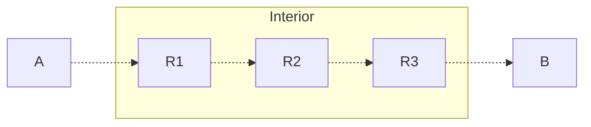

# Background + Overview
We begin a discussion of networking. 

## Protocols and the IP Protocol
A **protocol** is some agreement on how to communicate. It defines a language for communications by defining:
- The **syntax**, the format of messages and the order in which they're exchanged
- The **semantics**, the meaning of messages and what to do on message send or receipt

The **Internet Protocol (IP)** is what lets computers communicat around the world. It has a well-defined binary representation for transmission over the networks it comprises, and by defaults, everything is **big-endian** (the most significant bit comes first).
> Any IP-enabled host receiving an **IP packet** knows how to handle it because of the IP protocol!

An IP Packet has a 20-byte header, and a payload. It takes on the following format (the numbers give us the number of bits each takes):
```
Version (4)         | DHR Length (4) | Service Type (8)     | Total Byte Length (16)
Identification (16) | Flags (3)      | Fragment Offset (13) 
Time-To-Live (8)    | Protocol (8)   | Header Checksum (16) 
Source IP Address (32)
Destination IP Address (32)
Payload
```

Many of these will be discussed more in detail later.

## End-to-End Principles
The internet is designed around **end to end principles**. 

Consider the following simple network.



$A$ and $B$ are **end hosts**. They are devices on the periphery of the network, not physically connected, that communicate through the network. These include our phones, laptops, devices that we use.

Each $R_i$ are **routers**. These are interconnected devices on the interior of the network, whose sole goal is to connect $A$'s communications to $B$. There are two processes that control how things in the network are connected.
- **Routing** specifies how to get to $B$
- **Forwarding** moves the actual traffic torwards $B$

In such a network, knowledge / control of the connections are exclusively done at the periphery, $A$ or $B$. Anything inside the network only follows the local delivery rules they were given, nothing more, nothing less. This is the  **end to end principle**.

## The OSI Model and Overview
To design complex systems like networks, we abstract them into separate **layers**, where each layer controls some aspect of communications. Each layer has a distinct role, and relies on services provided by the layer below it (and similarly, provides services to the layer above it).
> This is similar to how software is designed! In a program, you have application code, which makes calls to libraries, which makes calls to system calls, then device drivers, and so on and so forth.

For the network stack, we have the **Open Systems Interconnection (OSI) Model**, otherwise known as the **7-Layer Model**. 

For the purposes of this course, we will only discuss 5 of these: (1) Physical, (2) Link, (3) (Inter) Network, (4) Transport, and (7) Application.
> Each of these layers are implemented with protocols!

We discuss each very briefly below.

# Layer 1: The Physical Layer
## Overview
The **Physical Layer** describes how we can encode bits for a **single physical link**. 

Some examples of this include voltage levels, radio frequency modulation, or photon wavelengths / intensities.

We discuss many of the attacks we could face on the physical layer.

## Physical Layer Attacks
### Natural Attenuation
By their physical nature, all physical links will eventually lose their signal over time / distance, known as **attentuation**. Sometimes, mistakes can also take out physical cables, known as **backhoe attenuation**.
> For example, copper cables have internal resistance, which can degrade the signal over time. 

The most basic way to deal with attenuation is to **amplify** the signal as it weakens! So, we keep our cable lengths reasonablny short, and add layer-1 **repeaters**, which are "dumb" devices that simply read bits and write them back out at full strength (to rebuild the signal). 

We can also add redunant cabling to add distinct paths for information in the case of natural disasters or backhoes. 

### Wiretapping
Links on the physical layer can be wire tapped with very minimal losses in signals. 
- For broadcast radio-frequencies, we can easily just listen in, or broadcast our own messages.
- For cabling, we could strip away the outer coating, and insert a device to read what the cable is transmitting.

These can be extremely hard to detect!

### Disruption
Just like natural events can disrupt physical links, we can also actively cause our own disruptions!
- Physical cables can be cut intentionally
- Signals can be jammed if not properly shielded
- Radio frequencies can be flooded or jams

Many of these disruption attacks can be indistinguishable from natural events, like natural disasters, weather, or just random interference!

### Protecting the Physical Layer
Generally, it is very difficult to protect layer 1, yet it is very important to protect it as every layer above depends on it. Some ways we could protect the layer include: 
- Keeping links short, as short-range links are harder to attack. Shorter links mean shorter areas that attackers could identify and exploit.
-  Using line-of-sight directional links, as they narrow the range of broadcast so attackers have a harder time finding the link.
- Encasing physical cables in secure conduits, so it is harder to find vulnerabilities.

Generally, the principle is to minimize the area of vulnerability that attackers could exploit, so that if an attack does occur, its effect is minimal. 
> Though it is difficult to protect layer 1, higher layers add their own security features to detect and counteract attacks. 

# Layer 2: The Link Layer
## Overview
The **Link Layer** combines bits into **frames**, where each contains a single message. Note that some messages due to their length may take multiple frames. 

The link layer allows these frames to be sent to local devices, grouped into **subnets**. Data can be sent to **local addresses** in these subnets via unique MAC addresses, with point-to-point and broadcast delivery. 
 
Some examples of this include ethernet and WiFi. 
> **Switches** are devices that implmenent up through layer 2. Switches have different mac addresses on each interface.

Protocols on the link layer will often specify a maximum distance and maximum device number to help provide additional countermeasures against physical layer attacks.

They often also include **error correction**, either through some sort of error detection, or even error correction. 

> [!Example]+ Example: Ethernet Error Correction
> Ethernet uses a 32-bit **cyclic redundancy check (CRC)** with a standard polynomial. These detect a small number of bit errors, making them suuitable for random noise.
> > Other layer 2 protocols use different error detection codes, but this is generally other CRC polynomials. 
>
> Protocols may also use **forward error correction** to correct bit errors, which requires extra bits, but this is often not worth the cost as physical layer attacks are quite rare.

## Ethernet
The bulk of traffic on the internet flows through **ethernet**. 

Switches have multiple ports, each of which can potentially reach many hosts on a subnet (as switches can be plugged into other switches). With so many ports, the switch will maintain a **MAC address table**, storing the MAC addresses reachable from ports.

To avoid switching loops (where messages are routed endlessly between switches), ethernet has the **spanning tree protocol**.
> This is a self-configuring protocol! Plugging in a switch will have it auto-configure and run spanning tree to figure out how to connect to everything, making ethernet super easy to configure. 

Some physical networks are separated into **virtual Lans (VLANS)**, which specifies particular ports in switches as part of different networks as seen by the IP layer (despite all being connected together).

### Attack: MAC Flooding / Spoofing
MAC address tables are finite in size. If a switch receives a frame for a destination it does not know, it will broadcast this data to all outgoing ports. 

Attackers could exploit this by **flooding** frames with random source MAC addresses, to force legitimate entries from the address tables to be evited. This would cause traffic to be broadcast to all outgoing ports, which not only wastes resources, but can let an attacker wiretap what's being broadcast!
> This will impact all of the VLANs on the switch! 
>
> Even if we only have access to one VLAN, flooding one switch could let us view all other VLANs the switch is in, giving us insight to other (potentially more secure) networks! This is known as **VLAN hopping**.

Attackers could also **spoof** the target sender address. By generating frames as the target address listed as "sender", we can prompt the switch redirect traffic directed to the target to the attacker instead, letting the attacker hijack the target's frames. 

Some ways we could protect ethernet include:
- Physical isolation of equipment and cables, to prevent attackers from plugging into the physical network. 
- Using VLANs to isolate different networks, and configurating them to avoid VLAN hopping.
- Require authentication before devices can access the network. 
- Filtering for illegitimate MAC addresses
- Setting **package storm protection** by setting rate limits for MAC addresses, so flooding from any one device is not allowed.

> Note that these are not comprehensive and each could be defeated in their own way. However, combining them together provides defense in depth!

## WiFi
WiFi has **access points (APs)**, which provide connectivity between devices and other subnets. Each access point has a **service set identifier (SSID)** uniquely identifying it.

Access points will broadcast **beacon frames** to announce their availability. End hosts, after finding the access point, will request access and negotiate with the access point to establish a connection. 
> Generally, end hosts will connect to the internet through access points!

There are various ways access control can be implemented for access points, to provide simple defenses against attackers:
- **MAC Address Filtering**: Configuring the access points with allow/deny lists of MAC addresses. However, this can be prone to spoofing of MAC addresses.
- **Captive Portals**: End users need to sign-in on a server to get connection, where they generally need to agree to a terms of services or buy access. This legally binds them.
- **Per-Network Passwords**: Requiring a password before connecting to the network. There are many options, including WEP, WPA, WPA2, and EAP. Ideally though, WEP and WPA should not be used, as they both use RC4 encryption, known to be insecure and easily crackable.

    WPA2 on the other hand, uses AES! It authenticates using a 4-way handshake, where the client generates a **pairwise transient key (PTK)** from the access point's MAC address and a nonce, as well as the client's MAc address and a nonce. This however can be attacked, using a recent technique known as **KRACK**. 
    
    > EAP is technically just a mode for WPA2, supporting per-user authentication, hardware authentication tokens, and **mutual authentication**, where users can authenticate each other.
- **User Authentication**

### Attack: Wardriving
Access points could be configured to have weak access control, or none at all! Attackers can exploit this and try to connect to the networks to get a free connection, in an attack known as **wardriving**. 

> [!Info] Hidden SSIDs
> This issue led to manufacturers to offer options for **Hidden SSIDs**, where the access point has an SSID, but it no longer sends beacon frames. To join a network, you need to know it exists! 
>
> This seems like it works, but due to the broadcast nature of WiFi, it's not very effective. A passive listener could just listen in for **association request** frames being sent between a connecting end user (which contain the SSID)! Many OSes in fact, look for these automatically.

# 2.5: Network Naming
**Network naming** provides protocols to find another host's IP or MAC address. to how we find IP addresses. These are protocols that use layer 2, but are more for network management and less for internetworking. Thus, we'll consider them part of a set of "layer 2.5" protocols.

## Address Resolution Protocol (ARP)
We have a node $P$ in a subset, which wants to send a packet to another node $Q$ in the same subnet. $P$ knows $Q$'s IP address, but to transfer the packet in layer 2, needs to know $Q$'s MAC address to put together the appropriate ethernet frame.

How do we find this MAC address?

**Address Resolution Protocol (ARP)** is what's used to bind IP and MAC addresses. 

Each node will maintain an **ARP Cache**, associating IP addresses with ethernets and their interfaces. If we need the MAC address associated with some IP, we:
1. First, ask if the IP address is in our ARP cahce. If it is, we use this MAC address.
2. If not, we send a layer-2 broadcast **ARP Request** to the entire subnet.
3. Our target, upon receiving the broadcast, will send an **ARP Response** back to us, with some time-to-live. 
4. The target will also store / update the entry for us in its cache. Anyone receiving the broadcast request will also update their cache. This is done in anticipation of communications with us.

> If we already exist in the cache, then the nodes will simply reset the TTL (time-to-live).

**ARP is stateless**. The protocol does not keep track of requests-- any ARP response is assumed to be a reply to a request.

This can lead to attacks!

### Attack: ARP Cache Poisoning
As ARP is stateless, an attacker can exploit this to intercept messages.

Suppose Eve wants to receive Alice's traffic to Bob. Then, they can do this by **poisoning** Alice's ARP Cache by sending ARP Response

| Sender MAC | Sender IP | Target MAC | Target IP
| :-: | :-: | :-: | :-: |
| Alice's MAC | Alice's IP | Eve's Mac | Bob's IP |

Even though Alice never requested this, Alice will add this to their cache as ARP is stateless. Thus, Bob's IP will now be associated with Eve's MAC.

Then, anytime Alice tries to send to Bob's IP, it will instead be sent to Eve's MAC address! This sets up Eve as a man in the middle, enabling further attacks!

How do we prevent this? We could: 
- Statically set some ARP addresses so that they cannot be changed. 
- Cross-check the bindings with other services. 
- Watch for changes to IP and MAC bindings
- Ignore unsolicited responses

## Dynamic Host Configuration Protocol (DHCP)
Given a network, how do we join it?

In order to join a network, we need:
- An IP address for the host (us)
- An IP address for the default router, so we know how to send packets out of the network
- An IP address for the nameserver, to map URLs to IP addresses (discussed later).

These IP addresses could be statically assigned, but this becomes prohibitive for large networks! **Dynamic Host Configuration Protocol (DHCP)** lets nodes connect to a layer 2 network and ask to join the layer 3 network! In other words, after connecting to the layer 2 network, they can request for the needed IP addresses.
> This is what most networks you connect to use!

Say Alice wants to join a network. Then, Alice will broadcast a special `DHCPDISCOVER` message to the IP address `255.255.255.255`. This will be received by the **DHCP server**. This server will then:
- Assign an open IP address to Alice from a pool of available IP addresses it maintains (preferring any previous assignments Alice may have on the network).
- Send the default router IP address for the subnet
- Specifies the nameservers

> If the DHCP server is not in the broadcast range, the message may also be caught by some **relay agent**, which will forward it to the server.

### Attack: DHCP Starvation
Say Trudy repeatedly joins the network with spoofed MAC addresses. Then, after enough addresses, they could consume all available IP addresses!

This prevents other hosts from getting IP addresses, known as a **DHCP starvation attack**. This is a form of denial-of-service.

Alternatively, the attacker can send forced DHCP releases, to kick someone off the network! 

### Attack: Rogue DHCP Servers
Trudy can also run their own DHCP server, to give our bogus addresses:
- **Host IP Addresses**: Make Alice's packets collide or be mis-delivered.
- **Router Addresses**: Lets Trudy man in the middle Alice's connection 
- **Nameserver Addresses**: Trudy can reserve hostnames to IP addresses of their choosing

This is also called **DHCP snooping**.

## Domain Name System
In order to send traffic around the network, we need IP addresses. We reach servers (or other hosts) with these IP addresses!

However, these addresses aren't very easy to memorize, and furthermore, they could change!

What we're typically used to is providing names (URLs). The **Domain Name System (DNS)** provides bindings between these names and addresses. DNS implements a global database, with hierarchical authorities.

Say Alice wants to contact `gizmonic.cs.umd.edu`. Then, to find the IP address for this name, we ask the following questions (in order):
1. Who can resolve names in `.edu`?
2. Who can resolve names in `umd.edu`?
3. Who can resolve names in `cs.umd.edu`?
4. What is the address for `gizmonic.cs.umd.edu`?

We start by asking our local DNS server (nameserver). If it knows the answer, then it will return it to us. Otherwise, it will do a recursive query to a higher nameserver, which will respond if it knows, or make its own query. This will continue, up to the root server.

Any servers hit recursively will cache the responses for later requests, to save time!

> There is also an **iterative query**, where the intermediate server will respond directly to us, and we need to pass the query to the next server ourselves.

DNS has many types of queries:
- **A Record**: The IP address for a hostname
- **AAAA Record**: The IPv6 address for a hostname
- **MX Record**: The mail server for a domain
- **NS Record**: The name server for a domain
- ...

Note that DNS is not authenticated. This can lead to attacks.

### Attack: DNS Cache Poisoning
Attackers can exploit the cache of the DNS server, known as a **DNS Cache Poison**. Say an attacker wants to direct users to their malicious site. Then, they will:
1. Send the victim DNS server a request for some hostname
2. Immediately send the victim server a response for this request, with the malicious IP address
3. The victim sends the response back to the attacker (thinking this was the response for a query), and caches the malicious IP address
4. A user now looking up this hostname would get the poisoned IP address.

> This requires that the attacker beats the legitimate response to the victim.

Because there is no authentication, the DNS server can be tricked to bind the hostname to a different IP address, to redirect users trying to connect to this host.

### Attack: Zone Transfers
A **zone** is a domain or group of domains under a single authority. Each has a **primary** server that is authoritative for DNS data, and at least one secondary server.

The primary server sends authorized secondary servers zone details with **DNS zone transfer** messages. However, any host can claim to be a DNS secondary server for a domain! This will give them access to all of the zone information, including host names.
> An attacker can just try different zones to see which are vulnerable!

We can prevent this, by requiring that a server must be within a domain(s), and refuse zone transfer requests from hosts outside of legit subnets.

### Protecting DNS
**DNSSEC** adds cryptographic authentication to DNS, but only for zones tha timplement it (is backwards compatible!). This stores cryptographic information (including keys) in special DNS records.

# Layer 3: The (Inter) Network Layer
## Overview
The **(Inter) Network** connects subnets together to provide end-to-end connectivity between hosts, through **global addressing** via IP addresses. These addresses are locally unique, and assigned within a subnet using CIDR notation (ex. `192.168.0.0/16`), with support for subnet nesting (for scalability).
> The `/__` tells us which number of bits (from the left) are **fixed** (the rest can be changed)! As an IP address is 32-bits, the number of addressable hosts given a CIDR range is $2^{32 - n}$.

In this layer, data is encapsulated in **packets** which contain layer-2 frames. 

The network layer does not provide reliable service, and follows the principle of **best effort delivery**- messages are not retransmitted if lost, and no guarantees of message integrity. 
> **Routers** are devices that implements up through layer 3. Routers have different IP addresses on each interface.

## Attack: IP Spoofing 
Recall the structure of an IP packet.
```
Version (4)         | DHR Length (4) | Service Type (8)     | Total Byte Length (16)
Identification (16) | Flags (3)      | Fragment Offset (13) 
Time-To-Live (8)    | Protocol (8)   | Header Checksum (16) 
Source IP Address (32)
Destination IP Address (32)
Payload
```

There is no authentication to this protocol. The protocol trusts the sender to construct this packet correctly without error, and provides no defense against wiretappers.

As with layer 2, the attacker can set the source IP address to **anything**. This enables some bad behavior:
- They can hide the source of some flood of packets
- They can get target to "respond" to a victim by sending a packet with the victim's address as a source (**reflection attack**)
- They can inject traffic into an ongoing session

---

How can we protect against this?

First, we define the following:
- **Ingress**: When packets enter your netowrk
- **Egress**: When packets leave your network

We can't enumerate all legitimate sources for packet ingress (reasonably). However, we can for packet egress, as packets coming from out network should be in a known range!

Networks can implement **egress filtering** to prevent internal hosts from spoofing their source addresses. Unfortunately, this is not very widely implemented, as it requires extra work, for little to no benefit from the network.

## Tunneling
IP does not provide any confidentiality. Any router on the path of a packet can read the traffic, and other hosts on the same subnet may also see the traffic!

How can we prevent this eavesdropping? 

We could do this by setting up secure **IP tunnels** over IP! One common way to do this is using a **virtual private network (VPN)**! A VPN creates an **overlay** IP network on top of an existing trusted network. 

Say we have a client in an untrusted network, and we want to connect to a server in a trusted network. Then, we can connect to a **gateway** in the trusted network, creating a **tunnel** between the client and the server! This way, the client appears to be a part of the trusted network.

---

One common way of doing this is **IPsec**. This encapsulates an entire IP packet in another IP packet to create a tunneled connection!

To do this, IPsec uses the **Encapsulation Security Payload (ESP)** protocol. This protocol has number 50. This encapsulates the original message as an encrypted payload of another IP packet. This way, the packet can be sent over IP, but the original contents cannot be seen!

For two hosts $A$ and $B$ on different physical networks, we can create a VPN between them that includes both. Both hosts will maintain a public and private IP address:
- The public addresses go to the internet, and will be in the "publicly" accessible outer IP packet.
- The private addresses go through the VPN tunnel, and will be in the encrypted IP packet.

The ESP packet, within the header, will also include an identifier for a **security association**, so the gateway knows what to do with the packet. This is something that would be set up before sending the data. Security associations include:
- 32-bit identifier
- Source interface (public gateway IP address)
- Destination interface (public gateway IP address)
- Encryption algorithm and mode
- Encryption key
- Integrity algorithm
- Authentication key

A security association is unidirectional; we need 2 for a bidirectional communication! These can be hard-coded, or established dynamically with the **Internet Key Exchange (IKE)** protocol.


# Layer 4: The Transport Layer
## Overview
The **Transport Layer** provides end-to-end communications between processes, which may also be within the same host. There are two main protocols in this layer:
- **User Datagram Protocol (UDP)**: Best-effort communication that is **datagram-based**, meaning each message is one packet.
- **Transmission Control Protocol (TCP)**: Reliable, keeps track of data sent / received and retransmits data lost. **Byte-based**, meaning messages (or sessions) can span possibly many packets.

## Transmission Control Protocol (TCP)
The **Transmission Control Protocol (TCP)** provides reliable communications between processes on hosts, identified by **TCP Ports**. It treats application data as a stream of bytes, and tries to guarantee:
- All bytes are delivered to the destination
- Bytes are delivered in order
- Byte are unmodified

> This requires that TCP is able to detect dropped data, and retransmit it!

TCP also provides the following features to minimize dropped packets:
- **Flow Control**: Destination can tell the source not to send faster than it can read
- **Congestion Control**: Source determines the current capacity of the network, so that it doesn't overload the network

To establish a TCP connection, we need to perform what's called a **three-way handshake**. In this, the client and server will set their initial **sequence numbers**, using a `SYN` message. This will be used to ensure packets are delivered in order. After receivng a `SYN`, the receiver will send an `ACK` acknowledging acceptance of that sequence number. 

An example of a handshake is as follows (between a client and server):
1. The client will send the server a `SYN`, setting the sequence number for the client to some value $x$.
2. The server will respond to the client with an `ACK`, acknowledging $x + 1$, sets and sends the client a `SYN` setting the sequence number for the server to some value $y$.
3. The client will respond to the server with an `ACK`, acknowledging $y + 1$.

After this, the client and server are now ready to communicate!
> Saying `ACK` $x + 1$ means acknowledging that the the host has received all packets before $x + 1$ (everything up through $x$). 

### Attack: SYN Flood
In the 3-way handshake, after receiving a SYN packet, a receiver will set up a **state** for the connection and reply with a SYN + ACK. If there is no ACK from the initiator, then the packet may have been dropped! So the SYN + ACK is retransmitted.

So, what an attacker can do is send the SYN packet, without a final ACK! If we do this a bunch of times, then we can cause **memory exhaustion** at the target, preventing any other connections from occurring.

---

One potential solution to this is to block SYNs from source IP that aren't ACK'ing! However, attackers can spoof the source IP.

---

Another potential solution is to use **SYN Cookies**. TCP connection states include:
- Remote IP address
- Remote port
- Maximum segment size (MSS)

We use a 32-bit sequence number as our connection state, and within this state, we can encode information as a signature for our state
- 5-bit slow-moving timestamp (to prevent replays)
- 3-bit encoding of the MSS
- 24-bit cryptographic hash of IP, port, and MSS

Now, when a SYN is received, the SYN cookied can be retrieved and check if the hash matches the information received. 

This helps prevent SYN floods by slowing down the attacker, but adds its own issues-- namely that it takes time.

### Attack: TCP Injection
TCP is not authenticated. So, any router on the path can see the current sequence numbers, and if we know the current number, it's easy to predict the next number! This lets attackers inject packets into the stream to be received in place of the legitimate packets!
> If we're not on the path, we can still force TCP packets, but we'll have to guess the next number.

If we can inject into the stream, we can:
- Send RST messages to kill the connection
- Inject data into a connection so that the destination rejects the legitimate packets (**TCP Veto**)
- Conduct one side of a conversation without seeing the other (though this requires we know what the other side is expecting)

This is known as a **Mitnick attack**.
1. We start by SYN flooding a trusted host that doesn't encrypt or authenticate traffic
2. Then, we send a SYN to the target server, claiming to be the trusted host (source spoofing)
   
   > This will have the server send a SYN + ACK to the host, which won't respond (as it's being flooded)

3. The attacker can predict the next sequence number in the SYN + ACK, and send its own ACK. 
4. Now, the attacker can send data with the spoofed source IP!

This is why we need to make the initial sequence numbers unpredictable! 

### Attack: Amplification
TCP uses ACKs to indicate that data bytes were received, and if there is no ACK, then it assumes that the packets were lost and it needs to retransmit the packet.

Simplifying, this means that TCP has to wait for ACKs before we can send more data! This often leads to under-usage of the available capacity.

To work around this, we can send **optimistic ACKs** for bytes we think are in flight, but not yet delivered, so the sender sends more bytes sooner. If we see packet loss, however, we stop and let things equilibrate again.
> This is part of normal congestion control!

However, attackers can abuse optimistic ACKs! If they continue ACK'ing more and more optimistically, the victim will send faster and faster! The victim thinks the connection is good, but in reality, the packets are being sent so fast that the packets are being dropped. 

This is an example of an **amplification**: the attacker causes the victim to send much more traffic than the attack requires to work.
> We do very little work, to make our victim do a lot! This is a common theme.

### Attack: Shrew Attack
In TCP, congestion control looks for packet loss. 
- If it sees loss, it will double the time between sends until the data gets through.
- Otherwise, it will linearly increase send rate until the next drop.

For a few lost packets, this isn't a big deal. However, attackers can exploit this!

In a **shrew attack**, an attacker can send periodic bursts of traffic, causing loss that makes the congestion control delay the next send. If we time things right, we can time our bursts with the next send, and as long as this continues, the TCP connection will be blocked, causing a denial of service!
> In practice, this is very difficult to exploit effectively.

# Inter-Domain Routing
Recall that in a very simple network, hosts will havea few routers, where node has:
- A list of addresses
- A forwarding table for the network, where routing messages propagate info throughout the network so these tables can update! 

This works well locally, but doesn't scale well! 
- Its infeasible to store information about every reachable node
- Network equipment / systems have different owners, who may want to implement their own policies on the equipment!

To scale, subnets are grouped into larger administrataive domains called **autonomous systems (AS)**. These systems are typically managed as one cohesive unit by the owner, who can set policies (both for external and internal communications) for the system. 

Connections between autonomous systems go through **gateway routers**. 

Say we want to send a packet to a destination. As we are likely not directly connected to the destination, our packet will need to be forwarded by nodes to reach the destination! To do this, nodes will maintain a forwarding table:
- Within an AS, the table stores the next hop for every address in the network (grouped into CIDR blocks), where each group of addresses is given as an interface. Forwarding within an AS is done simply based on the shortest path to the destination.
- Between ASes, the table stores large ranges, to forward towards a gateway router. Then, forwarding is done based on the next AS that handles the IP address range.

## Border Gateway Protocol
Each AS has:
- A globally unique AS number
- Owns at least one CIDR block.
- Has at least one node designated as a **BGP speaker**, often one of the border gateways. 

This BGP speaker sends **BGP Update** messages, specifying the blocks the AS owns, and the AS paths it knows to specific CIDR blocks. For example:

> [!Example]+ Example: BGP Update Example
> ```
> AS 1 owns 1.2.0.0/16, and advertises (1.0.0.0/16, [1]), (3.4.5.0/24, [2,1])
> ```
> 
> AS 1, owning `1.2.0.0/16`, will advertise itself with the AS path of 1.
> 
> For any other block advertised from other AS systems. AS 1 will append itself onto the path given. Above, `[2,1]` means that the neighbor of AS 1, AS 2, advertised `3.4.5.0/24`, and AS 1 simply appends itself to this path.
> > This will create forwarding paths for specific CIDR blocks!

With these paths, BGP finds the shortest AS path to all destinations, such that:
- The path complies with local policies of the AS
- The path follows the **longest-prefix rule**: The CIDR block with the longest prefix, a.k.a. most specific to our destination is what's used for the destination. 

### Attack: BGP Prefix Hijacking
BGP is not authenticated, meaning anyone can announce any prefix they want.

Attackers can exploit this by advertising prefixes that don't have, known as **prefix hijacking**! If we specify a longer prefix than the legitimate block, then we may get that block's traffic sent preferentially to us, letting us capture some traffic! 
This traffic could then be dropped (**black hole**), analyzed, or used for any other malicious use.

> [!Example] Example: Prefix Hijacking
> ```mermaid
> graph LR
> AS1 o--o AS2 o--o AS3;
> 
> AS3 o--o AS4 & AS7;
> AS4 o--o AS7;
> AS5 o--o AS4 & AS7;
> 
> AS5 o--o AS6[AS6, Source];
> 
> AS1 -. "1.2.0.0/16, [1]" .-> AS2;
> AS2 -. "1.2.0.0/16, [1,2]" .-> AS3;
> 
> AS6 -. "1.2.0.0/16, [6]" .-> AS5;
> AS5 -. "1.2.0.0/16, [6,5]" .-> AS4 & AS7;
> ```
> 
> In this example, AS6 is the legitimate system, but AS1 is prefix hijacking AS6's range. If AS6 broadcasts its range as `1.2.0.0/16`, then AS1 can fool AS2 and AS3 by broadcasting `1.2.0.0/16` (as the shortest path is taken), and fool everyone for `1.2.128.0/17` (as the longest-prefix is preferred).

### Attack: DoS Attack
Suppose we have a malicious autonomous system that is on a non-preferred path to a target. This autonomous system could cause a denial of service as so:
1. The AS launches a launch a denial of service on the BGP speaker for an AS on the best path, causing the neighbors to withdraw their routes through this AS.
2. End the denial of service, bringing the speaker back online so routes are re-established
3. Repeat

This causes **route flapping**, whose routes are deprioritized to improve network stability. This makes the malicious AS more likely to be on the AS path for a target! 
> We can use denial of service attacks to change the route topology to be more favorable to us!

### Attack: Route Attribute Attacks
Recall that ASes have policies for routes, that are usually financial. In the BGP Update messages some extra attribute values can be provided so that ties between AS systems can be broken.

An attacker could exploit this, by sending **bogus announcements** to change how paths are perceived!
- Paths could be made to look shorter or longer 
- Add a victim AS to the path so it shows up multiple times and implies a loop (so the path is ignored)

## Securing BGP
BGP is very important for keeping the internet together, so there are many ways that people have looked into securing it. 

Some of these methods are described below.

### Defense: TTL Security Hack
BGP announcements are given a time-to-live (TTL), say, 255. Then, if we receive a packed with a packet with any time-to-live less than this, we ignore that.

This prevents attacks from multiple hops away from the AS! 

However, this does not defend against malicious insiders, or tunneling-based attacks.

### Defense: Defensive Filtering
An AS can filter routes advertised by its customer. If the customer doesn't own prefixes, then updates it broadcasts are dropped.

Alternatively, the AS can rewrite customer's BGP attributes to preferred values, if they are invalid.

This works best if everyone does this filtering! However, this can be logistically challenging, as customers have complex networks!

### Defense: Authenticated Registry
We can establish a public registry of accurate routing data, and when receiving a BGP update, check to see if the update is consistent with the registry!

Problem is, this registry needs to be complete, accurate, and secure to be effectiver! This can be hard to do:
- The registry needs to be difficult to hack
- Routing policies and topology within an organization might be proprietary

### Defense: Digest for Integrity
We can add message authentication, including the TCP and BGP data per packet.

This makes it hard to spoof, and fits in the TCP extension! However, it requires a shared secret by everyone, and does not provide confidentiality.

### Defense: BGPsec
Formally called S-BGP, this uses certificates for verification (like we saw before)!

Through BGPsec, ASes can do **address attestation**, claiming right to a prefix. This is done in a hierarchical delegation, up to ICANN, the leading governing body.

Additionally, we can do **route attestation**, distributed within a BGP update. Each AS in transit signs the signature, yielding a nested signature!

This solves both the origin and route problem, but is very expensive in time and storage! This makes it very difficult for BGPsec to be widely adopted.

# Denial of Service
**Denial of Service (DoS)** is any restriction of access to a resource, by legitimate principals. It violates the property of availability!
> Any attack on availability is a denial of service attack!

There are many reasons why someone would launch a denial of service, including: laughs, revenge, competitive advantage, extortion, politics, or civil disruption!

## Attack: Flooding
In a **flooding** attack, the attacker will overwhelm some node on the path towards a victim, so that any traffic through that node can't get through to the victim.
> By flooding one node, we cause packets to be dropped!

One example of flooding is discussed below.

The **Internet Control Message Protocol** is commonly used for error messages, and network status signalling. It is IP protocol 1, and can be used for:
- Sending pings, ICMP type 8 (echo request) and type 0 (type reply)
- Tracing a route, ICMP type 11 (time exceeded), which uses TTL

But this is also a very popular vector for DoS attacks! In a **ping flood**, we send a lot of ping packets to the victim! We can also make this a **reflection attack**, by spoofing the source so that the victim also overloads another source!
> There is no amplification factor for this-- it requires the attacker has more bandwidth than the victim!

Many networks block external pings, but there are other ICMP types that can't be blocked! General ICMP floods are called **Twinge attacks**.

## Attack: Poison Packets
A **Poison Packet** is a malformed IP packet designed to disrupt a host or service, by exploiting specific implementations that make poor asumptions or have bugs.

### Ping of Death Packets
Recall that an IP packet has:
- 16-bit total length
- 16-bit identification
- 3-bit flags
- 13-bit fragment offset

Because of the size of the length, packets can be up to $2^{16} - 1$ bytes! But most links can't handle more than 1500 bytes, a bound called the **maximum transmission unit (MTU)**.

So, if a packet is too large for a link, it will **fragment the packet**.
1. Router $R$ receives a packet $p$ on interface $a$
2. Forwarding table indicates interface $b$ as the next hop
3. If $b$ has an MTU less than the length of $p$, the router will break $p$ into **fragments** no larger than $b$'s MTU. This is where we use the identification, flags, and fragment offset headers.
4. All fragments have the same identification header, and more fragments are indicated in the flags header.
5. The first payload byte is specified by the fragment offset.

The fragment offset isn't actually in bytes, and is really in 8-byte chunks! So, we can have a maximum offset value $2^{13} - 1$, or in other words, byte 65528. 

The largest (reconstructed) packet can be $2^{16} - 1 = 65535$ bytes, so the last fragment can be at most 7 bytes of payload. If this fragment goes 8 bytes or longer, the reconstructed packet exceeds the max value, which can cause buffer overflows in the network stack! 

This is called the **ping of death**.

> [!Info] Fragmentation Attacks
> There are many other ways we can do a fragmentation attack!
> - **Teardrop Attack**: We can overlap fragments, which may trigged bugs in the reconstruction logic.
> - **Rose Attack**: Incomplete packets with missing fragments can still consume buffer space, exhausting memory.

### Local Area Network Denial (LAND) Packets
Recall that the IP payload, if using TCP, begins with a TCP header.

If a SYN packet is spoofed to make the source and destination the same, the victim can be made to try to handshake with itself, overwhelming the network stack!

### INVITE of Death
**Voice-over-IP (VoIP)** systems have become increasingly cheaper!
- Individuals can make long-distance calls cheaper
- Companies can have more features and configurability

To establish a connection between VoIP endpoints, the **Session Initiation Protocol (SIP)** is used. In the SIP INVITE message, the "Via" field is vulnerable to buffer overflow!
> In other implementations, there are other fields that are vulnerable!

## Distributed Denial of Service (DDoS)
Single-source DoS has limited power. In particular, flooding is very expensive for a single attacker!

**Distributed Denial-of-Service (DDoS)** uses **zombies** for the attack instead! The attacker doesn't need to send attack traffic, but instead has many hosts they have control of sending the traffic instead! This gives the attacker a massive amplification factor, and is hard to stop, as the attacks can come from all over the internet!
> As the internet grows, the pool of zombies we can use grows! Poorly secured gadgets make this even worse.

> [!Example] Example: Smurf Attack
> The **Smurf Attack** was a simple ICMP echo DDoS attack, which uses spoofed pings to flood a victim.
> 
> By sending pings to networks' broadcast address, they broadcats this to all of the hosts! Thus, we can send a ping to every host in the network, to either flood every host, or have them reflect onto another victim! 

> [!Example] Example: LOIC / HOIC
> The **Low / High Orbit Ion Cannon** are platforms, where people add their machines voluntarily to help stress-test networks! 
> > These typically use TCP and UDP, not ICMP.
> 
> This is ideally used for legitimate stress testing of a network, but can be used for DDoS attacks.

# Layer 7: The Application Layer
## Overview
The **Application Layer** is the layer that users / processes interact with. This layer determines the choice of transport in the transport layer, and defines its own data formats and protocols within TCP or UDP.
> For example, for web browsing, we use the HTTP protocol using TCP.

# Network Defense
We've seen a lot of attacks throughout the network stack. And, it's very hard to defend the network! An attacker only needs one way to accomplish their goal, whereas a defense must protect all layers against all possible attacks.

To most effectively protect the network, we need to employ defense in depth.

## Defense: Updating Software
It's a good idea to keep software up to date! The most recent updates may patch newly discovered vulnerabilities.

However, this can be hard to do.
- Applying patches takes time, and for critical systems this isn't viable 
- Patches can break systems
- Sometimes, patches just can't reach a system! 

## Defense: Configuration Management
Another idea is to configure the system to minimize its misuse.
- What interfaces are the server listening on? What ports?
- Is security enabled? Are the defaults actually secure?
- Is automatic updating enabled? Do they reset the configurations? 
- Are there default users and default passowrds? 
- Do we actually need to run everything we're running?
- Who can install software?
- Is your configuration consistent across machines?

We can also **centralize our configuration**! In one place, we specify all the software that can be installed, their configurations, and force this upon any machines we own. 

There are a few ways to do this:
- **Preboot Execution Environment (PXE)**: Host configures itself on boot from network resources
- **Puppet**: Designed to maintain configuration on servers, and also is able to push changes to hosts
- **Chef**: Allows for the accumulation / propagation of data at runtime, so we can check the state of machines and send it back to the server which can analyze this and send changes as needed.
- **Ansible**: Hosts only require ssh and python, and will run the scripts that are received by the server. Tries to make operations idempotent, so no matter how many times a script is ran, the resultant state is still good.

## Defense: Operational Security
**Operational security** describes practices that support security!
- User training
- Avoiding phishing
- Disposing of sensitive materials
- ...

This can be done by frequently requiring mandatory training of employees, though this is frequently forgotten as soon as training completes.

## Defense: Filtering
Mistakes can always happen! And we can't always rely on users behaving correctly, or hosts being configured securely. So in the first place, we want to:
- Prevent bad stuff from getting in
- Prevent secret stuff from getting out

So, we can **filter** traffic!

Some ways we can do this include:
- Simple firewalls, to specify the types of packets that can be sent, from inside the network to outside, or outside the network to inside.
- Spam filters, to check for suspicious messages and drop them.
- Governments / organizations may employ censorship of traffic, using tools to monitor or block particular traffic.

> Spam filtering is a type of **deep packet inspection**, that requires that packets are reconstructed and sessions are reconstructed. This can be very expensive!

## Defense: Intrusion Detection
Our usual goal is to keep bad stuff / people out, but sometimes this isn't always possible!

We can add a **intrusion detection system**, which looks for suspicious behaviors on a system in an attempt to flag intruders:
- Questional traffic egress
- New users
- New services that are listening
- New software installed
- Errors / abnormalities in log files

In such systems, we may or may not have a model for the intruder.
- **Misuse Detection** checks for known adversarial behavior (that we have a model on)
- **Anomaly Detection** checks for anything abnormal

> Intrusion detection tends to be a very reactive process!

One way we can build a model for the attacker is by deploying decoy servers that aren't real, called **honeypots**! These servers are restricted so that they can be compromised without affecting the actual network.
> We can even set up an entire shadow network for attackers to explore, called a **honeynet**!

Intrusion detection sounds good, but actually implementing an effective scheme is difficult-- it needs to be highly dynamic to adapt to changing signatures, and highly robust to filter through the large amount of noise in traffic. And, poorly implemented systems can be more costly than they're worth. 
- In **false positives**, it takes time to investigate false positives, and can lead us to start tuning out positive results.
- In **false negatives**, we can have a false sense of security, letting intruders go under the radar for longer.

## Flaw: Bring-Your-Own-Device
Some organizations encourage **bring-your-own-device**, to reduce equipment expenses.

However, this can be bad security practice, as it's harder to secure personal devices! Those who secure the network have no control over personal devices.

## Defense: Layered Networks
In a network, not all hosts are equal. Different hosts have different needs, and varying levels of sensitive information!

Ideally, we should separate hosts with different needs into different layers, separated by firewalls! This way, we can individually monitor each layer and control ingress / egress.
