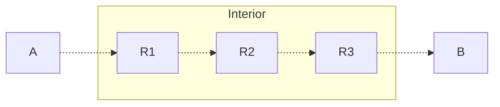

# Background + Overview
We begin a discussion of networking. 

## Protocols and the IP Protocol
A **protocol** is some agreement on how to communicate. It defines a language for communications by defining:
- The **syntax**, the format of messages and the order in which they're exchanged
- The **semantics**, the meaning of messages and what to do on message send or receipt

The **Internet Protocol (IP)** is what lets computers communicat around the world. It has a well-defined binary representation for transmission over the networks it comprises, and by defaults, everything is **big-endian** (the most significant bit comes first).
> Any IP-enabled host receiving an **IP packet** knows how to handle it because of the IP protocol!

An IP Packet has a 20-byte header, and a payload. It takes on the following format (the numbers give us the number of bits each takes):
```
Version (4)         | DHR Length (4) | Service Type (8)     | Total Byte Length (16)
Identification (16) | Flags (3)      | Fragment Offset (13) 
Time-To-Live (8)    | Protocol (8)   | Header Checksum (16) 
Source IP Address (32)
Destination IP Address (32)
Payload
```

Many of these will be discussed more in detail later.

## End-to-End Principles
The internet is designed around **end to end principles**. 

Consider the following simple network.



$A$ and $B$ are **end hosts**. They are devices on the periphery of the network, not physically connected, that communicate through the network. These include our phones, laptops, devices that we use.

Each $R_i$ are **routers**. These are interconnected devices on the interior of the network, whose sole goal is to connect $A$'s communications to $B$. There are two processes that control how things in the network are connected.
- **Routing** specifies how to get to $B$
- **Forwarding** moves the actual traffic torwards $B$

In such a network, knowledge / control of the connections are exclusively done at the periphery, $A$ or $B$. Anything inside the network only follows the local delivery rules they were given, nothing more, nothing less. This is the  **end to end principle**.

## The OSI Model and Overview
To design complex systems like networks, we abstract them into separate **layers**, where each layer controls some aspect of communications. Each layer has a distinct role, and relies on services provided by the layer below it (and similarly, provides services to the layer above it).
> This is similar to how software is designed! In a program, you have application code, which makes calls to libraries, which makes calls to system calls, then device drivers, and so on and so forth.

For the network stack, we have the **Open Systems Interconnection (OSI) Model**, otherwise known as the **7-Layer Model**. 

For the purposes of this course, we will only discuss 5 of these: (1) Physical, (2) Link, (3) (Inter) Network, (4) Transport, and (7) Application.
> Each of these layers are implemented with protocols!

We discuss each very briefly below.

# Layer 1: The Physical Layer
## Overview
The **Physical Layer** describes how we can encode bits for a **single physical link**. 

Some examples of this include voltage levels, radio frequency modulation, or photon wavelengths / intensities.

We discuss many of the attacks we could face on the physical layer.

## Physical Layer Attacks
### Natural Attenuation
By their physical nature, all physical links will eventually lose their signal over time / distance, known as **attentuation**. Sometimes, mistakes can also take out physical cables, known as **backhoe attenuation**.
> For example, copper cables have internal resistance, which can degrade the signal over time. 

The most basic way to deal with attenuation is to **amplify** the signal as it weakens! So, we keep our cable lengths reasonablny short, and add layer-1 **repeaters**, which are "dumb" devices that simply read bits and write them back out at full strength (to rebuild the signal). 

We can also add redunant cabling to add distinct paths for information in the case of natural disasters or backhoes. 

### Wiretapping
Links on the physical layer can be wire tapped with very minimal losses in signals. 
- For broadcast radio-frequencies, we can easily just listen in, or broadcast our own messages.
- For cabling, we could strip away the outer coating, and insert a device to read what the cable is transmitting.

These can be extremely hard to detect!

### Disruption
Just like natural events can disrupt physical links, we can also actively cause our own disruptions!
- Physical cables can be cut intentionally
- Signals can be jammed if not properly shielded
- Radio frequencies can be flooded or jams

Many of these disruption attacks can be indistinguishable from natural events, like natural disasters, weather, or just random interference!

### Protecting the Physical Layer
Generally, it is very difficult to protect layer 1, yet it is very important to protect it as every layer above depends on it. Some ways we could protect the layer include: 
- Keeping links short, as short-range links are harder to attack. Shorter links mean shorter areas that attackers could identify and exploit.
-  Using line-of-sight directional links, as they narrow the range of broadcast so attackers have a harder time finding the link.
- Encasing physical cables in secure conduits, so it is harder to find vulnerabilities.

Generally, the principle is to minimize the area of vulnerability that attackers could exploit, so that if an attack does occur, its effect is minimal. 
> Though it is difficult to protect layer 1, higher layers add their own security features to detect and counteract attacks. 

# Layer 2: The Link Layer
## Overview
The **Link Layer** combines bits into **frames**, where each contains a single message. Note that some messages due to their length may take multiple frames. 

The link layer allows these frames to be sent to local devices, grouped into **subnets**. Data can be sent to **local addresses** in these subnets via unique MAC addresses, with point-to-point and broadcast delivery. 
 
Some examples of this include ethernet and WiFi. 
> **Switches** are devices that implmenent up through layer 2. Switches have different mac addresses on each interface.

Protocols on the link layer will often specify a maximum distance and maximum device number to help provide additional countermeasures against physical layer attacks.

They often also include **error correction**, either through some sort of error detection, or even error correction. 

> [!Example]+ Example: Ethernet Error Correction
> Ethernet uses a 32-bit **cyclic redundancy check (CRC)** with a standard polynomial. These detect a small number of bit errors, making them suuitable for random noise.
> > Other layer 2 protocols use different error detection codes, but this is generally other CRC polynomials. 
>
> Protocols may also use **forward error correction** to correct bit errors, which requires extra bits, but this is often not worth the cost as physical layer attacks are quite rare.

## Ethernet
The bulk of traffic on the internet flows through **ethernet**. 

Switches have multiple ports, each of which can potentially reach many hosts on a subnet (as switches can be plugged into other switches). With so many ports, the switch will maintain a **MAC address table**, storing the MAC addresses reachable from ports.

To avoid switching loops (where messages are routed endlessly between switches), ethernet has the **spanning tree protocol**.
> This is a self-configuring protocol! Plugging in a switch will have it auto-configure and run spanning tree to figure out how to connect to everything, making ethernet super easy to configure. 

Some physical networks are separated into **virtual Lans (VLANS)**, which specifies particular ports in switches as part of different networks as seen by the IP layer (despite all being connected together).

### Attack: MAC Flooding / Spoofing
MAC address tables are finite in size. If a switch receives a frame for a destination it does not know, it will broadcast this data to all outgoing ports. 

Attackers could exploit this by **flooding** frames with random source MAC addresses, to force legitimate entries from the address tables to be evited. This would cause traffic to be broadcast to all outgoing ports, which not only wastes resources, but can let an attacker wiretap what's being broadcast!
> This will impact all of the VLANs on the switch! 
>
> Even if we only have access to one VLAN, flooding one switch could let us view all other VLANs the switch is in, giving us insight to other (potentially more secure) networks! This is known as **VLAN hopping**.

Attackers could also **spoof** the target sender address. By generating frames as the target address listed as "sender", we can prompt the switch redirect traffic directed to the target to the attacker instead, letting the attacker hijack the target's frames. 

Some ways we could protect ethernet include:
- Physical isolation of equipment and cables, to prevent attackers from plugging into the physical network. 
- Using VLANs to isolate different networks, and configurating them to avoid VLAN hopping.
- Require authentication before devices can access the network. 
- Filtering for illegitimate MAC addresses
- Setting **package storm protection** by setting rate limits for MAC addresses, so flooding from any one device is not allowed.

> Note that these are not comprehensive and each could be defeated in their own way. However, combining them together provides defense in depth!

## WiFi
WiFi has **access points (APs)**, which provide connectivity to other subnets. 

... 
"WiFi and Simple Defenses" TODO

# Layer 3: The (Inter) Network Layer
## Overview
The **(Inter) Network** connects subnets together to provide end-to-end connectivity between hosts, through **global addressing** via IP addresses. These addresses are locally unique, and assigned within a subnet using CIDR notation (ex. `192.168.0.0/16`), with support for subnet nesting (for scalability).

In this layer, data is encapsulated in **packets** which contain layer-2 frames. 

The network layer does not provide reliable service, and follows the principle of **best effort delivery**- messages are not retransmitted if lost, and no guarantees of message integrity. 
> **Routers** are devices that implements up through layer 3. Routers have different IP addresses on each interface.

# Layer 4: The Transport Layer
## Overview
The **Transport Layer** provides end-to-end communications between processes, which may also be within the same host. There are two main protocols in this layer:
- **User Datagram Protocol (UDP)**: Best-effort communication that is **datagram-based**, meaning each message is one packet.
- **Transmission Control Protocol (TCP)**: Reliable, keeps track of data sent / received and retransmits data lost. **Byte-based**, meaning messages (or sessions) can span possibly many packets.

# Layer 7: The Application Layer
## Overview
The **Application Layer** is the layer that users / processes interact with. This layer determines the choice of transport in the transport layer, and defines its own data formats and protocols within TCP or UDP.
> For example, for web browsing, we use the HTTP protocol using TCP.

