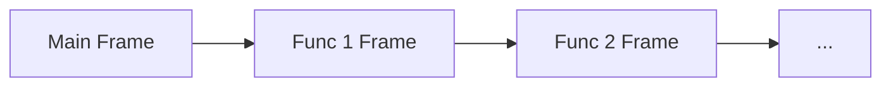
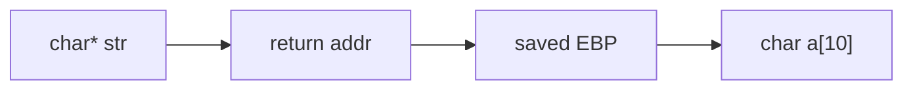
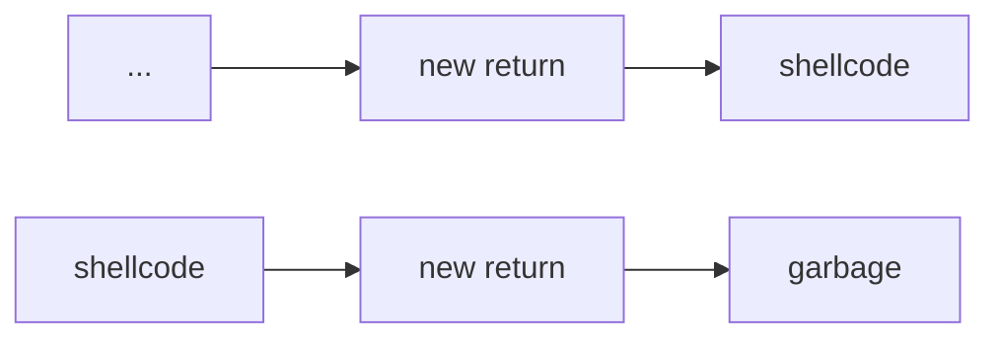

This article broadly describes common security programming errors that occur, how to prevent them, as well as how to exploit them.

# Buffer Overflows
## Context: The Stack
In a simplified model, when we run a program, it is given a range of addresses. Let's say `MIN_ADDR` and `MAX_ADDR` are the minimum and maximum of this range. The heap will grow up from `MIN_ADDR`, and the stack will grow down from `MAX_ADDR`.
> `MIN_ADDR` | `HEAP` --> ... <-- `STACK` | `MAX_ADDR`

The stack is composed if a sequence of **frames**, which are created as functions call each other (here, the stack grows top down):

> The "main" frame is the first frame created by entering our `main()` entrypoint to the program.

As functions call each other, more frames are added to the stack, and as functions return, these frames are popped off the stack.

Each of which has the following structure in memory (here, the stack grows left to right):

> TODO: Need to check this; I think this is wrong.

The stack maintains 2 pointers in the current frame:
- The **Extended Stack Pointer (`%esp`)**, pointing to the current "top" of the stack (the lowest address of the current frame). 
- The **Extended Base Pointer (`%ebp`)**, pointing to the calling frame's EBP. Gives us a memory offset local to a function, which can be used to access parameters and variables. 

> For these namings, we will follow the nomenclature for 32-bit architectures.

## How Buffer Overflows Happen
Given the structure of the stack, we know that when we return from a function, we can use `%ebp + 4` to access the function's return address, and access the location of the next instruction of the program. 

But what if we overwrote this with another value? Let's say our current frame is

Then if we called `strcpy(a, str)`, where `str` is longer than 9 bytes, we could write past `char a[10]` and into the return address! This would cause the program to return to an overwritten address! This is an example of **buffer overflow**.
> Note that `strcpy` always adds `len(str) + 1`, due to the `NUL` byte at the end of the string.

We can take advantage of this to inject our own code! In the buffer write, we:
- Copy our own bytecode (called **shellcode**) to the overflowed buffer
- Overwrite the return address to the beginning of our bytecode

We can add our bytecode before or after the overwritten return address, depending on if the buffer can fit the entirety of our code. Here, the stack grows left to right.

> In the first case, we simply fit all of our shellcode in the local variable memory. In the second case, we write garbage, and write our shellcode past the return address.

The second case will generally give us a lot more space to write our code to.

We could also similarly take advantage of this process to:
- Overwrite local variables
- Extract local variables (without having to modify the stack)
- Overwrite function parameters
- Extract function parameters (without having to modify the stack)
- Crash a program

## Preventing Buffer Overflow
### Assumptions and Bad Code
While we have to make assumptions about our programs, faulty assumptions will lead to vulnerabilities like buffer overflows. Even if they may have been correct before, changes in operating systems can suddenly make them incorrect!

If we have source code, we should check the following for buffer overflows:
- `strcpy()`
- `gets()` (especially in a loop)
- `memcpy()`
- `sprintf()`
- Array writes in loops

If we don't have source code, the following may indicate buffer overflow:
- Funny characters in output
- Segmentation faults
- Illegal instruction faults
- Repeated actions that should have the same result, but don't

Often, buffer overflows happen because programs read in user-controller data, which programmers mistakenly make assumptions about. While most users aren't malicious, not all of them aren't, and even normal users can also type in faulty imput.

To avoid buffer overflows, we should always assume that user input data is dirty, and adequately check it before using it. 
- Check input lengths
- Check for unexpected characters
- Check ranges for things like numbers
- Don't assume anything about the inputs

> [!Example] Example: Bad vs. Good Input Handling
> Do not call `printf(str)`, as `str` could contain format specifiers causing the function to look elsewhere in the stack for input (called a **format string vulnerability**). Instead, explicitly use a format specifier like `printf("%s", str)`.
> 
> Do not use `strcpy(dst, src)`, especially as we don't know how long `src` is. Instead, explicitly cap the amount of copying using `strncpy(dst, src, sizeof(dst))`.

> [!Info] Format String Vulnerabilities
> The previous example had an example of a **format string vulnerability**. In fact, `printf` has a signature `printf(format_string, ...)`, where the first argument tells the function what to expect next.
>
> If the format string has a format specifier (`%_`), they tell the function that there are additional function arguments to search for, making a naive `printf(str)` call dangerous (if we cannot guarantee what is in `str`).
> > If a format specifier is given without additional arguments, the function could search for and extract one of the local variables from the stack, which could expose data we don't want exposed.

### Preventing Buffer Overflows
To prevent buffer overflows, there are some techniques we can use!

In the **stack canaries** technique, we add special values to certain places of the stack and check if they change. If any of these values change, then we know something went wrong! 
> If these special values and locations are predictable, an attacker could still perform a buffer overflow and leave these values unchanged!

In the **non-executable stack** technique, we can mark parts of the stack to be non-executable, as it's almost always the case that an instruction pointer should not point to a stack location. This can prevent execution of shellcode on the stack.

In the **address randomization** technique, we can randomize where things are in memory every time a program is ran. This makes it a lot harder to exploit a vulnerability, as attackers won't be able to make assumptions about memory locations in the stack!
> **Address-Space Layout Randomization (ASLR)** randomizes where things are in memory every time you run.

### Defeating Buffer Overflow Protections
Here, we describe some ways we could (potentially) defeat the aforementioned protection techniques.

We could work around the **non-executable stack** technique using **return oriented programming (ROP)**, where we repeat the following:
1. **Groom** the stack, setting registers and arguments to useful values.
2. Set the instruction pointer to a **gadget**, which is existing library code with predictable addresses that use register values we've groomed, and ends with a return to take us to the next gadget. 
3. Repeat, repeatedly moving between gadgets to exploit our program. Eventually, we'll get code that's "functionally" the same as if we used shellcode!

> Note that our gadget doesn't need to be a normal function entrypoint! It could just be a few instructions that use register values that we've groomed.

> [!Info] Examining the Stack
> To examine the stack to execute a buffer overflow, it's often helpful to use a program like `gdb`.
>
> Some useful commands while using `gdb` for these purposes:
> - `info registers`: Displays all registers of the program (and their contents) at this moment in time.
> - `info frame`: Displays the current function's stack frame.
> - `info locals`: Displays all local variables.
> - `x/__x [mem_addr]`: Displays contents of the stack starting at the memory address given. 
> - `p`: Prints something. Use `p/x` to print it as hexadecimal (ex. if we're examining a memory address). 
>
> Note that we can access fields of a register directly by prepending it with a dollar sign, ex. `p $x30` prints the contents in the `x30` register.


---

We could also trick programs into running our own functions by exploiting environment variables! Most programs these days are **dynamically linked**, pulling important functions at load time from a variety of files (`.dll` files in windows). 

These files are found by searching a path, which can be controlled with the `LD_LIBRARY_PATH` environment variable. There is also a `LD_PRELOAD` environment variable which lets us load a dynamic library before anythig else. 
> Many people even have `.` in their executable path as the first entry, which is very dangerous!

We could exploit this to control the order where we search for libraries, having our own malicious programs be ran over standard programs instead!


# Vulnerabilities and Malware
## Properties of Secure Systems
We begin by discussing some rules that all secure systems should abide by. Unfortunately, not all systems abide by these rules, leading to vulnerabilities that can be exploited. 

The **principle of least privilege** states that any principal n a system should only have access to resources it needs for legitimate actions, and **absolutely nothing else**.

Commonly, this is implemented with **access control**, which is split into two categories:
- **Mandatory Access Control**: Controls that are mandated by the system.
- **Discretionary Access Control**: Optional controls that you can place in addition to mandatory controls.

Unfortunately, most software violates this principle of least privilege! 

Any secure system should also follow the **gold standard**, which has 3 working components:
- **Authentication**: Establishes the identity of a principal.
- **Authorization**: Establishes the permissions of an identity. Includes access control.
- **Auditability**: Ensures that all operations can be inspected / validated later. Commonly done with logs that store actions.


> [!Info] The Equities Problem
> Finding and fixing vulnerabilities is often not easy. While there are people who try want to find these vulnerabilities to fix them, there are also people who want to find these vulnerabilities to exploit them. 
> 
> This leads to the **equities problem**. People who find vulnerabilities essentially have found "equity" in the system, and may not share these vulnerabilities to be fixed, as its not as profitable for them to do so. Instead, it may actually be more worth it to share them to be exploited instead.
>
> In fact, there is a particular form of exploit called a **0-day exploit**, whih is an exploit which no one knew about until it's executed. Having such an exploit gives one significant equities in a system, and using one is a serious committment of resources.


## Malware
**Malware** is any malicious software that runs on a victim's system. 

### Categories of Malware
There are 3 general categories of malware, described below.

**Viruses** are malware that hide in executable parts of files, that try to evade detection by security programs. They are ran when this executable part is ran, and propagate based on user actions (that prompt the execution of the stored code).
> Some files, such as PDF files or Word documents, have areas of code that are executed upon opening of the file. Viruses can infect this portion of code!

**Worms** are malware that hide in running code behind the scene, that (generally) try to hide themselves from programs that can find them. They tend to propagate automatically, and try to spread rapidly.

**Trojans** are malware that immitate legitimate software, but do more than the user believes. They tend to be propagated by the attacker, who delivers the software.

> In more recent years, malware has begun to blend between these categories.

Below, we describe (as a historical survey) some examples of malware. 

> [!Info]- Malware Case Studies: Buffer Overflows
> In 1988, the **Morris Worm** malware was found. This executed a buffer overflow in the Unix `fingerd` daemon on a machine, and it was created to measure the size of the internet. It was not done maliciously at the time, but given how fast it spread, had unintended side effects.
>
> In 2001, the **Code Red Worm** malware was found. This executed a buffer overflow in Microsoft's web server, attending to spread into hosts, and perform denial of service attacks.

> [!Info]- Malware Case Studies: Social Engineering
> In 2000, the **ILOVEYOU Worm** was found. This was a worm that spread through a malicious attachment named `LOVE-LETTER-FOR-YOU.txt.vbs`, encouraging people to open it.
> 
> In 2007, the **Storm Worm** was found. This was a worm that claimed to be a news story, prompting users to click on the email after which they would be added to a botnet (a large group of machines that can be used for various tasks).

> [!Info]- Malware Case Studies: Poor Configuration
> In 2008, the **Conficker Worm** was found, which performed a **dictionary attack** against Windows admin passwords, essentially just trying a set of passwords to try to get into the admin account. If it succeeded, it would add the victim to a botnet.
> > This worm is quite notable, as it went through multiple iterations of attack defense to stay active, while staying under the radar!
>
> In 2016, the **Mirai Worm** was found, targeting internet of things devices ("smart devices"), connecting them all to a botnet. It was very effective, creating the largest botnet ever seen, as these devices are difficult to update or secure.
> > This lack of security in internet of things devices is a big problem!

### Infection Vectors
An **infection vector** is a component that malware can used to gain access into a system. There are some common vectors, including:
- **Vulnerable Network Services**: Services on a network which are vulnerable, commonly to buffer overflows. 
- **Backdoor Logins**: Components that are left by developers to leave a way into the system. Sometimes this is done by laziness rather than malice.
- **Social Engineering**: Attempts to persuade people to give up information into a system, or run an executable to grant access.
- **Trojan Horse**: A trojan malware that can grant other malwares access.
- **Physical Access**: Physical peripheral hardware with the malware, or unsecured network ports or terminals that people can access.

### Effects
The effects of malware depend primarily on the goals of the creator, and what they want to do with the malware. Some common goals include:
- System disruption
- Defacement of a publicly visible service
- Destruction of data
- Crashing of a system
- Stealing of data (otherwise known as **data exfiltration**)
- Sending spam
- Extorting money from victims
- Rootkits for later access

These effects can trigger in many ways. While the effects could take place **immediately**, in many cases this does not actually happen.
- Some ffects occur through a **time bomb**, waiting for a certain time or duration before acting.
- Some effects occur through a **logic bomb**, waiting for a set of conditions to be true.
- Some effects are done **manually**, through a backdoor or other mechanism the attacker installed as part of the malware.

## Malware Detection
One common way malware was initially detected is based on detecting **signatures** within the malware. These are descriptors that can be used to recognize the malware, and include:
- Byte sequences (or encrypted byte sequences) in the malware
- Code patterns in the malware
- Size differences in files before and after infection 

> [!Example]+ Example: Signature-Based Malware Detection
> One example of a signature for a malware known as **Code Red** is given below.
> ```
> GET /default.ida?NNNNNNNNNNNNNNNNNNNNNNNNNNNNNNNNNNNNNNN
> NNNNNNNNNNNNNNNNNNNNNNNNNNNNNNNNNN%u9090%u6858%ucbd3%...
> ```
> This malware performed a buffer overflow, and passed this exact attack string whenever it attempted to attack a server. Thus, if we can find a way to match these queries, we can easily identify and stop this malware!

As malware developers got smarter, signatures were not enough. So, detection software began to use **heuristics** to help identify malware. They look for:
- Suspicious API call patterns / suspicious call flows: When using APIs, there is generally a process in which that API is used, which a malware does not follow.
- Unusual OPCODE sequences: Sequences of code execution deviate from established code generation conventions.
- Coincidence with known malware: Malware may have behaviors that are similar to other known malware.

> Malware developers try to break these expected patterns to go undetected.

Many modern anti-virus products now use **crowd source** detection. In this form of detection, the product utilizes its large user base to detect new patterns which are pushed to vendor servers. These servers can then analyze the patterns and push updates to customers to provide rapid protection.

This provides a good automated approach to malware detection! And in some cases, crowd sourcing has even found and protected against new malware before human detection!

To push these patterns to the server, the product disguises the messages as DNS requests, in a process known as **DNS Tunneling**.

> [!Info] DNS Tunneling
> Computers cannot use web addresses by themselves. Instead, they need to perform a **DNS lookup** to conver the web address to an IP address, which the computer can use for communication.
>
> Generally in a lookup, the web address will be passed to a server, which will then query other servers for the IP address until we find our target address.
> 
> In **DNS tunneling**, we disguise our messages to look like DNS lookups, but send them so that the target server (the crowd source server) interprets the message as data, instead of performing an actual DNS lookup.

## Malware Protection
### Privilege Separation Tecniques 
Detection is very important, but we don't want to simply rely on our malware detection algorithms! Instead, we want to opt for **defense in depth**- having multiple layers of defense, in case any one of them fail. 
> This way, its less likely that our system will be compromised, even if one layer fails.

One way to protect against malware, even if detection fails, is at the operating system level, with mechanisms that try to contain running code and its capabilities. This is known as **privilege separation**.

---

The first mechanism is a **jail**, runnable by the `chroot` command (POSIX systems). This creates a restricted filesystem (known as the **jail**), with a new root directory specified by `chroot`. Only the files in the jail are accessible to the user, including regular files, directors, and devices.
> This gives us a very limited form of privilege separation!

Jails can be good to prevent programming errors or simple attacks, as it limits what the program can do. However, they are unfortunately limited in their capability:
- They are still running on the "bare" machine, meaning they still have direct access to the filesystem / devices / CPUs / RAM of the host.
- Upon closer inspection, jails can be quite obvious- a jailed system often lacks common files that can easily be checked for.

---

The next mechanism is a **virtual machine**, which lets us run a **guest** operating system on a **host** machine, through some software (called the **hypervisor**). For example, we could run a Linux operating system on our non Linux-based laptop. 
> The hypervisor controls all access to the actual hardware.

Virtual machines let us completely virtually simulate hardware, including the CPU and RAM. This way, we can not only run other operating systems on our host, but also completely isolate the guest operating systems from each other as well as the host. This lets us isolate malware from our system, so that any actions it takes have no effect on the host machine.

Unfortunately, there are some tradeoffs with this approach:
- The more we virtualize, the more resources we use, meaning we need to weigh between virtualizing less for more efficiency, and losing separation which is less safe.
- Only certain types of resources can be virtualized. 

---

Finally, we have **containers**, which are similar to virtual machines but don't virtualize the CPU and RAM (they use the host machine operating system). Without this virtualization, they have low overhead, while still providing a more isolated environment than jails. 

Containers require special kernal features to be used, and use `chroot`, userspace filesystems, and process features to isolate container processes from the rest of the systems.

Like the other approaches, there are some limitations with containers as well:
- We have less flexibility in combinations of host and container operating systems.
- Container processes are all visible from the host.
- The network stack may (potentially) be visible to containers.
- Memory protection is similar to that of jails, and can still be exploited.

### Subverting Privilege Separation Techniques
None of the aforementioned isolation techniques are perfect! There are a number of ways sophisiticated malware can use to determine its in an isolated system, and look for ways to escape the isolated environment. This is known as **breaking out**, and could include techniques like:
- System calls
- Shared folders between the guest and the host
- Memory attacks
- Guest / host interaction mechanisms

It's also possible to **break in** to an isolation technique, which is generally easier than breaking out, as the host has more control. Generally, isolation systems are designed to protect the host from the guests, but they aren't designed to protect the guests from the host! We can take advantage of this to gain access to guests running.

These techniques are more generally known as **pivoting**, where we can use access to one resource as a way to gain access to additional resources. We often do this to gain access to controlled systems.
> This includes machine to machine, host to host, breaking in, breaking out, etc.

One example of pivoting (with Docker) is given below.

> [!Example]+ Example: Pivoting with Docker
> In Docker, we can run containers in two modes:
> - **Privileged Containers**: Have **device access**, allowing them to utilize the system devices. They can capture packets, access disk, and even run their own internal docker daemon.
> - **Unprivileged Containers**: Have no direct device access. Is the default.
> 
> Furthermore, access to the daemon can be given globally, or restricted to certain users. However, anyone with access to Docker has access to all of the containers! This can be exploited.
> 
> For example, consider two users, one trusted and one bad. The bad user can exploit Docker security to access resources on a system!
> - Say a trusted user runs some server on a container. Then, the bad user could copy files from that server, as they have access to the container!
> - Say a trusted user runs some container in privileged mode. Then, the bad user could use this container to access device information!
> - With access to Docker, the bad user could simply run a malicious attack on their own container!
