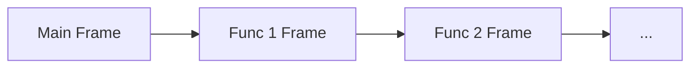
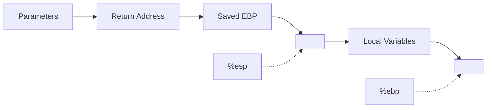
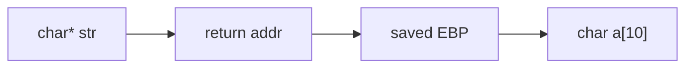
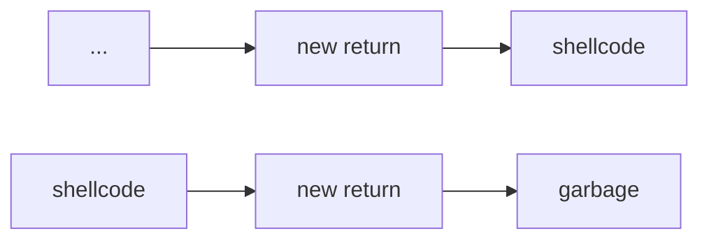

This article broadly describes common security programming errors that occur, how to prevent them, as well as how to exploit them.

# Buffer Overflows
## Context: The Stack
In a simplified model, when we run a program, it is given a range of addresses. Let's say `MIN_ADDR` and `MAX_ADDR` are the minimum and maximum of this range. The heap will grow up from `MIN_ADDR`, and the stack will grow down from `MAX_ADDR`.
> `MIN_ADDR` | `HEAP` --> ... <-- `STACK` | `MAX_ADDR`

The stack is composed if a sequence of **frames**, which are created as functions call each other (here, the stack grows top down):

> The "main" frame is the first frame created by entering our `main()` entrypoint to the program.

As functions call each other, more frames are added to the stack, and as functions return, these frames are popped off the stack.

Each of which has the following structure in memory (here, the stack grows left to right):

The stack maintains 2 pointers in the current frame:
- The **Extended Stack Pointer (`%esp`)**, pointing to the current "top" of the stack (the lowest address of the current frame). 
- The **Extended Base Pointer (`%ebp`)**, pointing to the calling frame's EBP. Gives us a memory offset local to a function, which can be used to access parameters and variables. 

> For these namings, we will follow the nomenclature for 32-bit architectures.

## How Buffer Overflows Happen
Given the structure of the stack, we know that when we return from a function, we can use `%ebp + 4` to access the function's return address, and access the location of the next instruction of the program. 

But what if we overwrote this with another value? Let's say our current frame is

Then if we called `strcpy(a, str)`, where `str` is longer than 9 bytes, we could write past `char a[10]` and into the return address! This would cause the program to return to an overwritten address! This is an example of **buffer overflow**.
> Note that `strcpy` always adds `len(str) + 1`, due to the `NUL` byte at the end of the string.

We can take advantage of this to inject our own code! In the buffer write, we:
- Copy our own bytecode (called **shellcode**) to the overflowed buffer
- Overwrite the return address to the beginning of our bytecode

We can add our bytecode before or after the overwritten return address, depending on if the buffer can fit the entirety of our code. Here, the stack grows left to right.

> In the first case, we simply fit all of our shellcode in the local variable memory. In the second case, we write garbage, and write our shellcode past the return address.

The second case will generally give us a lot more space to write our code to.

We could also similarly take advantage of this process to:
- Overwrite local variables
- Extract local variables (without having to modify the stack)
- Overwrite function parameters
- Extract function parameters (without having to modify the stack)
- Crash a program

## Preventing Buffer Overflow
### Assumptions and Bad Code
While we have to make assumptions about our programs, faulty assumptions will lead to vulnerabilities like buffer overflows. Even if they may have been correct before, changes in operating systems can suddenly make them incorrect!

If we have source code, we should check the following for buffer overflows:
- `strcpy()`
- `gets()` (especially in a loop)
- `memcpy()`
- `sprintf()`
- Array writes in loops

If we don't have source code, the following may indicate buffer overflow:
- Funny characters in output
- Segmentation faults
- Illegal instruction faults
- Repeated actions that should have the same result, but don't

Often, buffer overflows happen because programs read in user-controller data, which programmers mistakenly make assumptions about. While most users aren't malicious, not all of them aren't, and even normal users can also type in faulty imput.

To avoid buffer overflows, we should always assume that user input data is dirty, and adequately check it before using it. 
- Check input lengths
- Check for unexpected characters
- Check ranges for things like numbers
- Don't assume anything about the inputs

> [!Example] Example: Bad vs. Good Input Handling
> Do not call `printf(str)`, as `str` could contain format specifiers causing the function to look elsewhere in the stack for input (called a **format string vulnerability**). Instead, explicitly use a format specifier like `printf("%s", str)`.
> 
> Do not use `strcpy(dst, src)`, especially as we don't know how long `src` is. Instead, explicitly cap the amount of copying using `strncpy(dst, src, sizeof(dst))`.

> [!Info] Format String Vulnerabilities
> The previous example had an example of a **format string vulnerability**. In fact, `printf` has a signature `printf(format_string, ...)`, where the first argument tells the function what to expect next.
>
> If the format string has a format specifier (`%_`), they tell the function that there are additional function arguments to search for, making a naive `printf(str)` call dangerous (if we cannot guarantee what is in `str`).
> > If a format specifier is given without additional arguments, the function could search for and extract one of the local variables from the stack, which could expose data we don't want exposed.

### Preventing Buffer Overflows
To prevent buffer overflows, there are some techniques we can use!

In the **stack canaries** technique, we add special values to certain places of the stack and check if they change. If any of these values change, then we know something went wrong! 
> If these special values and locations are predictable, an attacker could still perform a buffer overflow and leave these values unchanged!

In the **non-executable stack** technique, we can mark parts of the stack to be non-executable, as it's almost always the case that an instruction pointer should not point to a stack location. This can prevent execution of shellcode on the stack.

In the **address randomization** technique, we can randomize where things are in memory every time a program is ran. This makes it a lot harder to exploit a vulnerability, as attackers won't be able to make assumptions about memory locations in the stack!
> **Address-Space Layout Randomization (ASLR)** randomizes where things are in memory every time you run.

### Defeating Buffer Overflow Protections
Here, we describe some ways we could (potentially) defeat the aforementioned protection techniques.

We could work around the **non-executable stack** technique using **return oriented programming (ROP)**, where we repeat the following:
1. **Groom** the stack, setting registers and arguments to useful values.
2. Set the instruction pointer to a **gadget**, which is existing library code with predictable addresses that use register values we've groomed, and ends with a return to take us to the next gadget. 
3. Repeat, repeatedly moving between gadgets to exploit our program. Eventually, we'll get code that's "functionally" the same as if we used shellcode!

> Note that our gadget doesn't need to be a normal function entrypoint! It could just be a few instructions that use register values that we've groomed.

---

We could also trick programs into running our own functions by exploiting environment variables! Most programs these days are **dynamically linked**, pulling important functions at load time from a variety of files (`.dll` files in windows). 

These files are found by searching a path, which can be controlled with the `LD_LIBRARY_PATH` environment variable. There is also a `LD_PRELOAD` environment variable which lets us load a dynamic library before anythig else. 
> Many people even have `.` in their executable path as the first entry, which is very dangerous!

We could exploit this to control the order where we search for libraries, having our own malicious programs be ran over standard programs instead!

# Vulnerabilities and Malware
