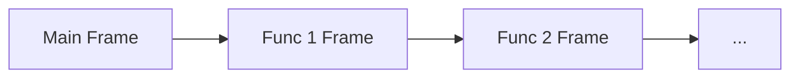
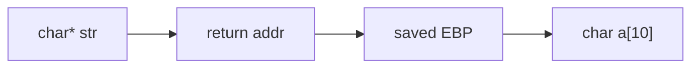
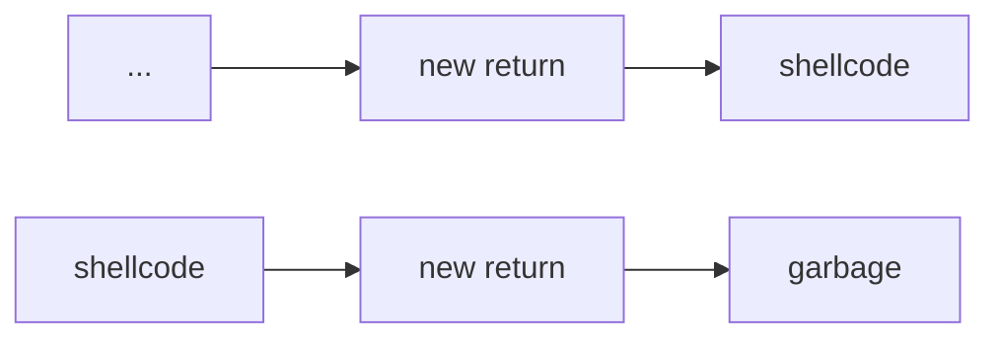

This article broadly describes common security programming errors that occur, how to prevent them, as well as how to exploit them.

# Buffer Overflows
## Context: The Stack
In a simplified model, when we run a program, it is given a range of addresses. Let's say `MIN_ADDR` and `MAX_ADDR` are the minimum and maximum of this range. The heap will grow up from `MIN_ADDR`, and the stack will grow down from `MAX_ADDR`.
> `MIN_ADDR` | `HEAP` --> ... <-- `STACK` | `MAX_ADDR`

The stack is composed if a sequence of **frames**, which are created as functions call each other (here, the stack grows top down):

> The "main" frame is the first frame created by entering our `main()` entrypoint to the program.

As functions call each other, more frames are added to the stack, and as functions return, these frames are popped off the stack.

Each of which has the following structure in memory (here, the stack grows left to right):

> TODO: Need to check this; I think this is wrong.

The stack maintains 2 pointers in the current frame:
- The **Extended Stack Pointer (`%esp`)**, pointing to the current "top" of the stack (the lowest address of the current frame). 
- The **Extended Base Pointer (`%ebp`)**, pointing to the calling frame's EBP. Gives us a memory offset local to a function, which can be used to access parameters and variables. 

> For these namings, we will follow the nomenclature for 32-bit architectures.

## How Buffer Overflows Happen
Given the structure of the stack, we know that when we return from a function, we can use `%ebp + 4` to access the function's return address, and access the location of the next instruction of the program. 

But what if we overwrote this with another value? Let's say our current frame is

Then if we called `strcpy(a, str)`, where `str` is longer than 9 bytes, we could write past `char a[10]` and into the return address! This would cause the program to return to an overwritten address! This is an example of **buffer overflow**.
> Note that `strcpy` always adds `len(str) + 1`, due to the `NUL` byte at the end of the string.

We can take advantage of this to inject our own code! In the buffer write, we:
- Copy our own bytecode (called **shellcode**) to the overflowed buffer
- Overwrite the return address to the beginning of our bytecode

We can add our bytecode before or after the overwritten return address, depending on if the buffer can fit the entirety of our code. Here, the stack grows left to right.

> In the first case, we simply fit all of our shellcode in the local variable memory. In the second case, we write garbage, and write our shellcode past the return address.

The second case will generally give us a lot more space to write our code to.

We could also similarly take advantage of this process to:
- Overwrite local variables
- Extract local variables (without having to modify the stack)
- Overwrite function parameters
- Extract function parameters (without having to modify the stack)
- Crash a program

## Preventing Buffer Overflow
### Assumptions and Bad Code
While we have to make assumptions about our programs, faulty assumptions will lead to vulnerabilities like buffer overflows. Even if they may have been correct before, changes in operating systems can suddenly make them incorrect!

If we have source code, we should check the following for buffer overflows:
- `strcpy()`
- `gets()` (especially in a loop)
- `memcpy()`
- `sprintf()`
- Array writes in loops

If we don't have source code, the following may indicate buffer overflow:
- Funny characters in output
- Segmentation faults
- Illegal instruction faults
- Repeated actions that should have the same result, but don't

Often, buffer overflows happen because programs read in user-controller data, which programmers mistakenly make assumptions about. While most users aren't malicious, not all of them aren't, and even normal users can also type in faulty imput.

To avoid buffer overflows, we should always assume that user input data is dirty, and adequately check it before using it. 
- Check input lengths
- Check for unexpected characters
- Check ranges for things like numbers
- Don't assume anything about the inputs

> [!Example] Example: Bad vs. Good Input Handling
> Do not call `printf(str)`, as `str` could contain format specifiers causing the function to look elsewhere in the stack for input (called a **format string vulnerability**). Instead, explicitly use a format specifier like `printf("%s", str)`.
> 
> Do not use `strcpy(dst, src)`, especially as we don't know how long `src` is. Instead, explicitly cap the amount of copying using `strncpy(dst, src, sizeof(dst))`.

> [!Info] Format String Vulnerabilities
> The previous example had an example of a **format string vulnerability**. In fact, `printf` has a signature `printf(format_string, ...)`, where the first argument tells the function what to expect next.
>
> If the format string has a format specifier (`%_`), they tell the function that there are additional function arguments to search for, making a naive `printf(str)` call dangerous (if we cannot guarantee what is in `str`).
> > If a format specifier is given without additional arguments, the function could search for and extract one of the local variables from the stack, which could expose data we don't want exposed.

### Preventing Buffer Overflows
To prevent buffer overflows, there are some techniques we can use!

In the **stack canaries** technique, we add special values to certain places of the stack and check if they change. If any of these values change, then we know something went wrong! 
> If these special values and locations are predictable, an attacker could still perform a buffer overflow and leave these values unchanged!

In the **non-executable stack** technique, we can mark parts of the stack to be non-executable, as it's almost always the case that an instruction pointer should not point to a stack location. This can prevent execution of shellcode on the stack.

In the **address randomization** technique, we can randomize where things are in memory every time a program is ran. This makes it a lot harder to exploit a vulnerability, as attackers won't be able to make assumptions about memory locations in the stack!
> **Address-Space Layout Randomization (ASLR)** randomizes where things are in memory every time you run.

### Defeating Buffer Overflow Protections
Here, we describe some ways we could (potentially) defeat the aforementioned protection techniques.

We could work around the **non-executable stack** technique using **return oriented programming (ROP)**, where we repeat the following:
1. **Groom** the stack, setting registers and arguments to useful values.
2. Set the instruction pointer to a **gadget**, which is existing library code with predictable addresses that use register values we've groomed, and ends with a return to take us to the next gadget. 
3. Repeat, repeatedly moving between gadgets to exploit our program. Eventually, we'll get code that's "functionally" the same as if we used shellcode!

> Note that our gadget doesn't need to be a normal function entrypoint! It could just be a few instructions that use register values that we've groomed.

> [!Info] Examining the Stack
> To examine the stack to execute a buffer overflow, it's often helpful to use a program like `gdb`.
>
> Some useful commands while using `gdb` for these purposes:
> - `info registers`: Displays all registers of the program (and their contents) at this moment in time.
> - `info frame`: Displays the current function's stack frame.
> - `info locals`: Displays all local variables.
> - `x/__x [mem_addr]`: Displays contents of the stack starting at the memory address given. 
> - `p`: Prints something. Use `p/x` to print it as hexadecimal (ex. if we're examining a memory address). 
>
> Note that we can access fields of a register directly by prepending it with a dollar sign, ex. `p $x30` prints the contents in the `x30` register.


---

We could also trick programs into running our own functions by exploiting environment variables! Most programs these days are **dynamically linked**, pulling important functions at load time from a variety of files (`.dll` files in windows). 

These files are found by searching a path, which can be controlled with the `LD_LIBRARY_PATH` environment variable. There is also a `LD_PRELOAD` environment variable which lets us load a dynamic library before anythig else. 
> Many people even have `.` in their executable path as the first entry, which is very dangerous!

We could exploit this to control the order where we search for libraries, having our own malicious programs be ran over standard programs instead!


# Vulnerabilities and Malware
## Properties of Secure Systems
We begin by discussing some rules that all secure systems should abide by. Unfortunately, not all systems abide by these rules, leading to vulnerabilities that can be exploited. 

The **principle of least privilege** states that any principal n a system should only have access to resources it needs for legitimate actions, and **absolutely nothing else**.

Commonly, this is implemented with **access control**, which is split into two categories:
- **Mandatory Access Control**: Controls that are mandated by the system.
- **Discretionary Access Control**: Optional controls that you can place in addition to mandatory controls.

Unfortunately, most software violates this principle of least privilege! 

Any secure system should also follow the **gold standard**, which has 3 working components:
- **Authentication**: Establishes the identity of a principal.
- **Authorization**: Establishes the permissions of an identity. Includes access control.
- **Auditability**: Ensures that all operations can be inspected / validated later. Commonly done with logs that store actions.


> [!Info] The Equities Problem
> Finding and fixing vulnerabilities is often not easy. While there are people who try want to find these vulnerabilities to fix them, there are also people who want to find these vulnerabilities to exploit them. 
> 
> This leads to the **equities problem**. People who find vulnerabilities essentially have found "equity" in the system, and may not share these vulnerabilities to be fixed, as its not as profitable for them to do so. Instead, it may actually be more worth it to share them to be exploited instead.
>
> In fact, there is a particular form of exploit called a **0-day exploit**, whih is an exploit which no one knew about until it's executed. Having such an exploit gives one significant equities in a system, and using one is a serious committment of resources.


## Malware
**Malware** is any malicious software that runs on a victim's system. 

### Categories of Malware
There are 3 general categories of malware, described below.

**Viruses** are malware that hide in executable parts of files, that try to evade detection by security programs. They are ran when this executable part is ran, and propagate based on user actions (that prompt the execution of the stored code).
> Some files, such as PDF files or Word documents, have areas of code that are executed upon opening of the file. Viruses can infect this portion of code!

**Worms** are malware that hide in running code behind the scene, that (generally) try to hide themselves from programs that can find them. They tend to propagate automatically, and try to spread rapidly.

**Trojans** are malware that immitate legitimate software, but do more than the user believes. They tend to be propagated by the attacker, who delivers the software.

> In more recent years, malware has begun to blend between these categories.

Below, we describe (as a historical survey) some examples of malware. 

> [!Info]- Malware Case Studies: Buffer Overflows
> In 1988, the **Morris Worm** malware was found. This executed a buffer overflow in the Unix `fingerd` daemon on a machine, and it was created to measure the size of the internet. It was not done maliciously at the time, but given how fast it spread, had unintended side effects.
>
> In 2001, the **Code Red Worm** malware was found. This executed a buffer overflow in Microsoft's web server, attending to spread into hosts, and perform denial of service attacks.

> [!Info]- Malware Case Studies: Social Engineering
> In 2000, the **ILOVEYOU Worm** was found. This was a worm that spread through a malicious attachment named `LOVE-LETTER-FOR-YOU.txt.vbs`, encouraging people to open it.
> 
> In 2007, the **Storm Worm** was found. This was a worm that claimed to be a news story, prompting users to click on the email after which they would be added to a botnet (a large group of machines that can be used for various tasks).

> [!Info]- Malware Case Studies: Poor Configuration
> In 2008, the **Conficker Worm** was found, which performed a **dictionary attack** against Windows admin passwords, essentially just trying a set of passwords to try to get into the admin account. If it succeeded, it would add the victim to a botnet.
> > This worm is quite notable, as it went through multiple iterations of attack defense to stay active, while staying under the radar!
>
> In 2016, the **Mirai Worm** was found, targeting internet of things devices ("smart devices"), connecting them all to a botnet. It was very effective, creating the largest botnet ever seen, as these devices are difficult to update or secure.
> > This lack of security in internet of things devices is a big problem!

### Infection Vectors
An **infection vector** is a component that malware can used to gain access into a system. There are some common vectors, including:
- **Vulnerable Network Services**: Services on a network which are vulnerable, commonly to buffer overflows. 
- **Backdoor Logins**: Components that are left by developers to leave a way into the system. Sometimes this is done by laziness rather than malice.
- **Social Engineering**: Attempts to persuade people to give up information into a system, or run an executable to grant access.
- **Trojan Horse**: A trojan malware that can grant other malwares access.
- **Physical Access**: Physical peripheral hardware with the malware, or unsecured network ports or terminals that people can access.

### Effects
The effects of malware depend primarily on the goals of the creator, and what they want to do with the malware. Some common goals include:
- System disruption
- Defacement of a publicly visible service
- Destruction of data
- Crashing of a system
- Stealing of data (otherwise known as **data exfiltration**)
- Sending spam
- Extorting money from victims
- Rootkits for later access

These effects can trigger in many ways. While the effects could take place **immediately**, in many cases this does not actually happen.
- Some ffects occur through a **time bomb**, waiting for a certain time or duration before acting.
- Some effects occur through a **logic bomb**, waiting for a set of conditions to be true.
- Some effects are done **manually**, through a backdoor or other mechanism the attacker installed as part of the malware.

## Malware Detection
One common way malware was initially detected is based on detecting **signatures** within the malware. These are descriptors that can be used to recognize the malware, and include:
- Byte sequences (or encrypted byte sequences) in the malware
- Code patterns in the malware
- Size differences in files before and after infection 

> [!Example]+ Example: Signature-Based Malware Detection
> One example of a signature for a malware known as **Code Red** is given below.
> ```
> GET /default.ida?NNNNNNNNNNNNNNNNNNNNNNNNNNNNNNNNNNNNNNN
> NNNNNNNNNNNNNNNNNNNNNNNNNNNNNNNNNN%u9090%u6858%ucbd3%...
> ```
> This malware performed a buffer overflow, and passed this exact attack string whenever it attempted to attack a server. Thus, if we can find a way to match these queries, we can easily identify and stop this malware!

As malware developers got smarter, signatures were not enough. So, detection software began to use **heuristics** to help identify malware. They look for:
- Suspicious API call patterns / suspicious call flows: When using APIs, there is generally a process in which that API is used, which a malware does not follow.
- Unusual OPCODE sequences: Sequences of code execution deviate from established code generation conventions.
- Coincidence with known malware: Malware may have behaviors that are similar to other known malware.

> Malware developers try to break these expected patterns to go undetected.

Many modern anti-virus products now use **crowd source** detection. In this form of detection, the product utilizes its large user base to detect new patterns which are pushed to vendor servers. These servers can then analyze the patterns and push updates to customers to provide rapid protection.

This provides a good automated approach to malware detection! And in some cases, crowd sourcing has even found and protected against new malware before human detection!

To push these patterns to the server, the product disguises the messages as DNS requests, in a process known as **DNS Tunneling**.

> [!Info] DNS Tunneling
> Computers cannot use web addresses by themselves. Instead, they need to perform a **DNS lookup** to conver the web address to an IP address, which the computer can use for communication.
>
> Generally in a lookup, the web address will be passed to a server, which will then query other servers for the IP address until we find our target address.
> 
> In **DNS tunneling**, we disguise our messages to look like DNS lookups, but send them so that the target server (the crowd source server) interprets the message as data, instead of performing an actual DNS lookup.

## Malware Protection
### Privilege Separation Tecniques 
Detection is very important, but we don't want to simply rely on our malware detection algorithms! Instead, we want to opt for **defense in depth**- having multiple layers of defense, in case any one of them fail. 
> This way, its less likely that our system will be compromised, even if one layer fails.

One way to protect against malware, even if detection fails, is at the operating system level, with mechanisms that try to contain running code and its capabilities. This is known as **privilege separation**.

---

The first mechanism is a **jail**, runnable by the `chroot` command (POSIX systems). This creates a restricted filesystem (known as the **jail**), with a new root directory specified by `chroot`. Only the files in the jail are accessible to the user, including regular files, directors, and devices.
> This gives us a very limited form of privilege separation!

Jails can be good to prevent programming errors or simple attacks, as it limits what the program can do. However, they are unfortunately limited in their capability:
- They are still running on the "bare" machine, meaning they still have direct access to the filesystem / devices / CPUs / RAM of the host.
- Upon closer inspection, jails can be quite obvious- a jailed system often lacks common files that can easily be checked for.

---

The next mechanism is a **virtual machine**, which lets us run a **guest** operating system on a **host** machine, through some software (called the **hypervisor**). For example, we could run a Linux operating system on our non Linux-based laptop. 
> The hypervisor controls all access to the actual hardware.

Virtual machines let us completely virtually simulate hardware, including the CPU and RAM. This way, we can not only run other operating systems on our host, but also completely isolate the guest operating systems from each other as well as the host. This lets us isolate malware from our system, so that any actions it takes have no effect on the host machine.

Unfortunately, there are some tradeoffs with this approach:
- The more we virtualize, the more resources we use, meaning we need to weigh between virtualizing less for more efficiency, and losing separation which is less safe.
- Only certain types of resources can be virtualized. 

---

Finally, we have **containers**, which are similar to virtual machines but don't virtualize the CPU and RAM (they use the host machine operating system). Without this virtualization, they have low overhead, while still providing a more isolated environment than jails. 

Containers require special kernal features to be used, and use `chroot`, userspace filesystems, and process features to isolate container processes from the rest of the systems.

Like the other approaches, there are some limitations with containers as well:
- We have less flexibility in combinations of host and container operating systems.
- Container processes are all visible from the host.
- The network stack may (potentially) be visible to containers.
- Memory protection is similar to that of jails, and can still be exploited.

### Subverting Privilege Separation Techniques
None of the aforementioned isolation techniques are perfect! There are a number of ways sophisiticated malware can use to determine its in an isolated system, and look for ways to escape the isolated environment. This is known as **breaking out**, and could include techniques like:
- System calls
- Shared folders between the guest and the host
- Memory attacks
- Guest / host interaction mechanisms

It's also possible to **break in** to an isolation technique, which is generally easier than breaking out, as the host has more control. Generally, isolation systems are designed to protect the host from the guests, but they aren't designed to protect the guests from the host! We can take advantage of this to gain access to guests running.

These techniques are more generally known as **pivoting**, where we can use access to one resource as a way to gain access to additional resources. We often do this to gain access to controlled systems.
> This includes machine to machine, host to host, breaking in, breaking out, etc.

One example of pivoting (with Docker) is given below.

> [!Example]+ Example: Pivoting with Docker
> In Docker, we can run containers in two modes:
> - **Privileged Containers**: Have **device access**, allowing them to utilize the system devices. They can capture packets, access disk, and even run their own internal docker daemon.
> - **Unprivileged Containers**: Have no direct device access. Is the default.
> 
> Furthermore, access to the daemon can be given globally, or restricted to certain users. However, anyone with access to Docker has access to all of the containers! This can be exploited.
> 
> For example, consider two users, one trusted and one bad. The bad user can exploit Docker security to access resources on a system!
> - Say a trusted user runs some server on a container. Then, the bad user could copy files from that server, as they have access to the container!
> - Say a trusted user runs some container in privileged mode. Then, the bad user could use this container to access device information!
> - With access to Docker, the bad user could simply run a malicious attack on their own container!

# SQL Injection Attacks
**SQL (Structed Query Language)** is the de-facto standard language for creating structured databases. It can be used to populate, modify, and query databases- its a general purpose language for interacting with databases.

Oftentimes, web servers are backed by a database that can provide dynamic content, as well as store and manipulate data on behalf of the user. Sometimes, these queries come from the server itself, but othertimes it may pass through some sort of user-provided input.

## Database Overview
Here, we will briefly look at an overview of databases.

In structured databases, our data is stored in a **table**, which has columns, cells, and rows. 
- Each **column** names a variable or property, and could be typed.
- Each **row** represents an individual record, and generally contains a **primary key** which is a unique identifier typically used for sorting.
- Each **cell**, at any intersection of a column and row, stores a variable or property in an individual record.

Databases generally have the following management structure:
- The **database managers** are the ones who configure / populate the database. They have access to everything, and can be seen as the database equivalent of the root user on systems.
- The **programmer** writes APIs to interface with this database through queries.
- The **database management system** defines semantics for the database design, telling us how transactions should be done, the query language, and how permissions should be managed. 

A **transaction (tx)** in a database is the basic unit of work in a database. They define something to be done in a database, and can consist of numerous reads or writes.

For transactions to be robust, they need to follow the following rules, known as **ACID**:
- **Atomicity**: Transactions should either completely complete, or have nothing complete.
- **Consistency**: The database state should always be valid, even if not correct. There is always a sequence of transactions that can produce the current database state.
- **Isolation**: Transaction results are not visible until the transaction is complete.
- **Durability**: Once committed, the transaction remains even after any fault.

## SQL
Some standard SQL queries are as follows.

To read data from the database, we can use
```sql
SELECT <comma-delimited columns, or * for all>
FROM <table>
WHERE <rows to match values on>
GROUP BY <columns to group rows on based on common values>
ODER BY <columns to order based on>
```
> During our selection, we can also do basic statistics on columns, such as `AVG(), COUNT()` 

To insert data into a database, we can use
```sql
INSERT INTO <table>
Values( <expr>, <expr>, ... )
```

To modify existing rows in a database, we can use
```sql
UPDATE <table>
SET <col> = <expr>
WHERE <conditions>
```

In these queries, we have the following operators:
- `=`, `<>`, `<`, `>`, `>=`, `<=`: Standard binary comparison operators
- `AND`, `OR`: Logical operators
- `<expr> BETWEEN <min> AND <max>`: Range selection
- `<expr> LIKE <pattern>`: Match a pattern
- `<expr> IN (<val1>, <val2>, ...)`: Match one in a set of values
- `<expr> IS [NOT] NULL | TRUE | FALSE`: Null or truth testing
- `SELECT <expr> AS <newcol>`: Rename a column / expression in the output
- `CASE WHEN <pred1> THEN <expr1> WHEN <pred2> THEN <expr2> ELSE <expr> END`: Cascading if statement

## Overview to HTTP
To interact with a web server the client will first specify a **URL (Uniform Resource Locator**. This will generally take on the form:

```
<protocol>://<host>/<path to resource>[?<arguments>]
```
> Common protocols include `http`, `https`, `ftp`, `mailto`, `tor`.

The `?` lets us supply query parameters to the webpage, which can be used to supply dynamic content to users.

Commonly, we use `http` to connect to websites. The two most common `HTTP` requests are the **GET** and **POST** request:
- The **GET** request has no request body, and gets all data from the URL without supposedly having side effects (or at least, that is the expectation).
- The **POST** request has a request body for extra data, and often has side effects.

> There are many REST clients on our browser we could use to experiment with this type of stuff!

In addition to the URL, **headers** can provide extra information for the request. This can include type of client, cookies (if relevant), language / file encodings, and more. URLS, combined with headers (and a request body on POST requests) form an entire HTTP request.

> [!Example]+ Example: GET Request
> One example of a get request to `https://cs.umd.edu/class/fall2017/cmsc414/` is as follows:
> ```
> GET /class/fall2017/cmsc414/ HTTP/1.1
> Host: cs.umd.edu
> User-Agent: Mozilla/5.0 ...
> Accept: text/html, application/xhtml+xml, ...
> Accept-Language: en-US,en; q=0.5
> Accept-Encoding: gzip, deflate
> Connection: keep-alive
> ```
> 
> Note that the first thing we have is the type of request we are making. Followed by this, are the headers for the request. These headers are:
> - The host we are making the request to
> - Who we are
> - The formats we want back
> - The language we want
> - The compressions we are okay with if the server wants to save bandwidth
> - A request to keep the connection alive after this request. We may reuse this connection to send additional requests.
> 
> > User-Agent can be an arbitrary string, but generally identifies the browser, command-line client, or however the user is accessing the web.

Note that in the above example, if we wanted to include queries (`?`), they would be included in the URL of the GET request. This has important implications.

> [!Example] Example: POST Request
> An example of a POST request is as follows. First, we could have the following headers.
> ```
> POST /class HTTP/1.1
> Host: piazza.com
> User-Agent: Mozilla/5.0 ...
> Accept: text/html...
> Accept-Language: en-US, en...
> Accept-Encoding: gzip
> Referer: https://piazza.com/
> Cookie: ...
> Connection: keep-alive
> ```
> Generally, the cookie can contain authentication information to identify the user. 
> 
> These headers would then be followed by a body (the data of the request)
> ```
> email=mmarsh@cs.umd.edu
> from=/signup
> password=****
> ```

After making a request, the server will send us back a **response**. These contain:
- A status code, telling us if successful, and if not why it failed
- Headers for the response
- Data to be sent back to the client (ex. the HTML code)
- (Optional) Cookies that the browser will store on the server's behalf

A critical feature of HTTP is that it is **stateless**. In a typical session, the following happens:
1. The client will connect to the server
2. The client will issue a request to the server
3. The server will respond
4. The client will issue additional requests (if `Connection: keep-alive` header is present)
5. The client will disconnect

The server does not store any other information about the client in the basic HTTP model, so HTTP **does not have notion of a returning client**. This would require a client has to log in every time it communicates to the server, which is extremely inconvenient!

This is why we have **cookies**, which can be exploited! This is discussed later in web attacks.

## SQL Injection
Sometimes, requests are served using a SQL query which defines the behavior of the server. If not properly done right, these requests could be hijacked for our own deeds! 

> [!Example]+ Example: SQL Injection
> For example, consider the following query on a server, which displays information for a user if they have the right password.
> ```sql
> $result = mysql_query("select * from USERS where (name='$user' and password='$pass');");
> ```
> Say we entered `frank' OR 1=1); --` for the username. Then, we have query
> ```sql
> $result = mysql_query("select * from USERS where (name='frank' OR 1=1); -- ' and password='$pass');");
> ```
> Then, because `1=1` is always true, we will match everything in the table. This will let us bypass the server authentication and even see the entire database!

This is an example of SQL injection. On poorly configured systems, we can inject our own SQL code into the prompts, creating behaviors that the original creator did not intend to happen. 

Generally speaking, SQL injection is happening because code and data is in the same string, which creates potential for one to be interpreted as the other!

### Preventing SQL Injection
So how can we prevent against these attacks? There are several approaches, which are discussed below.

**Deny-listing** is based on the fact that there are a number of characters that cause "problems" in user-prompted queries. These include `,`, `--` (comments), and `;` (end of statement). Then, we could simply delete them to solve our problem! 

This, however, doesn't always work well. Sometimes these characters are valid to use, and determining when they are bad is quite difficult.

---

**Allow-listing** verifies that the user-provided input is in a valid (safe) set. Using regular expressions or other pattern matching, we can check to see that the input is valid, and reject bad inputs to fail safely.

Sometimes, however, its difficult to find this known safe set. For example, names can be almost arbitrary, so there really isn't a known safe set!

---

**Escape characters** replaces potentially harmful characters with escaped versions. For example, `'` turns into `\'`, `;` turns into `\;`, and so on and so forth. This prevents these characters from being used in the SQL query, so that they're instead just interpreted as text / data!

This lets us use these characters without having them form legitimate SQL. However, it can easily get confusing with multiple escapes happening at once.

---

Using **prepared statements** and **bind variables**, we can decouple our SQL code and data, so that they cannot be interpreted as each other.

A query such as
```sql
$result = mysql_query("select * from Users where (name='$user' and password='$pass');");
```
Could become
```sql
$db = new mysqli("localhost", "dbuser", "dbpass", "DB");
$statement = $db->prepare("select * from Users where (name=? and password=?);");
```
In the above statement, we have a **prepared statement**, where the `?`s denote **bind variables**, which are placeholders for actual values.

To use our statement, we can then bind our parameters to the statemet, and then execute it! By doing this, we have already parsed our SQL statement before the data is inserted, preventing the injection of SQL through the variables. In other words, this lets us separate our code and data, so that data cannot be interpreted as code.
```sql
$statement->bind_param("ss", $user, $pass);
$statement->execute()
```
> This also makes queries more efficient, as we don't need to reparse the SQL!

`bind_param` takes a type string as the first argument, where each character denotes the type of the $i^{th}$ parameter (given in order of the `?`s defined). The types are as follows:
- `i`: Integer
- `d`: Double
- `s`: String
- `b`: Blob (generic binary data)

> Above, `bind_param` is being supplied with two strings!

If `bind_param` is given parameters that cannot be interpreted as the following types, it rejects the input!

---

In addition to these techniques, we should apply extra layers of defense in case these techniques fail (defense in depth!)
- **Principle of Least Privilege**: We should require user authentication, and limit the number of commands and tables a user can access.
- **Confidentiality**: We should encrypt sensitive data, even when it's inside the tables. 


# Web Attacks
We will now look at several types of web based attacks.

## Directory Listing Attacks
It used to be common for web servers to be configured to allow director listings. This would be a useful way to share files together without putting together an HTML file for people to download from.

In some of these servers, you could specify the URL with more interesting paths, to traverse through this directory system! This could let us find files that have valuable data. 
> For example, we could find files related to the users on a system, and try to brute force their passwords!

> [!Info] `/etc/passwd`
> It used to be the case that the password file, `/etc/passwd`, used to contain password hashes, which would give attackers an **offline cracking attempt**, as they could take this file, and try passwords offline to see what hashes to this password. This is really bad, so the hashes are now stored in `/etc/shadow`, which is not world-readable.
>
> This now forces password attempts online, making these attempts more detectable!

## Hack-By-Google (Google Hacking)
In the modern day, Google, and many other search engines see everything. Thus, if we prompt the search engines in particular ways, we may be able to find information about our target! 
> For example, we could look for indexed directory listings to find vulnerable targets or gain information.

Goolge provides advances operators like `inurl:`, `intitle:`, `site:`, `intext:` that makes these searches a lot easier. We can use these to find specific services, or configuration files in servers. 

> [!Example] Example: Simple Query
> For example, searching `inurl: apache2.conf` could give us servers that use the Apache Httpd 2 service, which may yield vulnerable targets!

This is particularly useful, as we could break into services that we find:
- Some configurations have known insecurities
- Many services run with default (unchanged) admin passwords

## Phishing 
**Phishing** attacks are attacks where a legitimate site is impersonated, in order to steal credentials. Victims unaware of the attack will attempt to log in through these sites, inadvertently giving away their login information.
> Sometimes, attackers will even try to have URLS that look very similar to the legit site, like `www.paypa1.com`! This is known as **typo squatting**.

Generally, if you can receive messages from the service, someone will eventually try to phish you through it.

- **Spear Phishing** is phishing that is specifically targetted. They know who you are (and what organization you are part of), and can cater the attack to be more convincing to you.
- **Whale Phishing** is spear phishing on high-profile targets, such as executives, politicians, and more.

> [!Info] Man-in-the-Middle with Phishing
> **Man in the middle attacks** are attacks where your connection to the right server passes through a middle man that intercepts your communications. 
> 
> This commonly is used together with phishing attacks. In these cases, the fake server acts as the "server" to us, but the "client" to the actual server we want to communicate with. While to us, we're communicating with the actual server, we're still giving up our data as it's being intercepted by an unknown entity.

Protecting from phishing is quite simple:
- Don't click on links that could route you elsewhere
- Type in URLs instead of trusting shady sources
- Bookmark important URLs so you don't click on the wrong ones by accident
- Check the browser! Oftentimes, the browser will help you try to verify if the website is legitimate

## Session State and Cookies
The HTTP lifecycle is generally as follows. In a single session:
1. The client will connect to the server
2. The client will issue a request to the server
3. The server will respond
4. The client will issue additional requests
5. The client will disconnect

In this model, users don't want to have to log in again for every request! This is very inconvenient. To allow users to stay logged in, we need some way to track their "state" of interaction. 

A good way to do this is by building up the state over a series of requests between the client and server. This is done using **sessions**, where the server maintains a state for each client, where messages between the two can update this state (but not determine it). To do this, we need some way to identify the client across requests.

HTTP supports this through **cookies**! Cookies are really just a key-value store, which use HTTP headers to store keys and values. 
- On the first connection to a server, the server can ask the client to `Set-Cookie`, telling it to store a list of key-values and options. 
- On subsequent visits, the client sends this cookie to the server for identification

Some common cookie options are as follows:
- `expires`: When the cookie is no longer valid
- `domain`: What hosts should receive this cookie
- `path`: What URLs shoudl receive this cookie

Cookies are frequently used to store authentication tokens! These are long hexa-decimal strings that are difficult to guess, so the server can reasonably be sure that you're the same client.

> [!Info] Tracking via Cookies
> Cookies can also be used in unwanted manners! Depending on how we store data in them, cookies can also be used to **track users across sites**! 
> 
> This is commonly done for tailored ads.

Use of cookies, despite their convenience, has major implications in some form of attacks.

## Remote File Inclusion
**Remote file inclusion (RFI)** attacks are based off the fact that server code often incorporates unvalidated user input. Languages like PHP have features like `include`, which essentally paste contents of files in the current location. 
> These can commonly be done using the `` tag, with links that aren't images!

This is often useful for forms (ex. say we want different translations of a form), but could also be easily exploited! We could rewrite the query to include our own file instead of the originally intended file! This can let us modify what the server is executing.

### Cross-Site Scripting
**Cross-site scripting (XSS)** is essentially the client-side version of a remote file inclusion. A server could have code that can have text queried such that it readily causes code to execute.

Using tags that include other HTML files, the client could then accidentally  perform drive-by downloads, popups, and a lot more. 

What's notable about this is that in such an injection, the client thinks the code is from the target server, not the attacker (as everything was essentially "copy and pasted"). This lets us do many things through the client, such as:
- Read browser data, including HTML docs and cookies
- Modify browser data, including HTML docs and cookies
- Access filesystem (with user permissions)
- Send network requests

There are 3 main types of XSS.
- **Stored XSS**: The attacker stores malicious script on the target server, which is served automatically to clients. This can be served through ads, comments, images, and more. For example, an attacker could set their "avatar" which contains some script, and this is served to other users who sees the attacker's avatar.
- **Reflected XSS**: The attacker presents a malicious link to the client, which includes code. The client will follow the link to the legitimate server, which echos back the code, causing the client to run it.  For example, the attacker presents the client with a URL to a server with code in the URL, and the server unknowingly returns HTML with this code injected inside. The client then executes this code.
- **DOM XSS**: The attacker changes the document object representation (DOM) in the client's own browser, from the client side.

 > [!Info] Cross Site Request Forgery
> In, **Cross-Site Request Forgery**, attackers take advantage of authentication cookies and URLs with side effects to achieve behaviors in the client.
> 
> For example, an attacker could use an XSS attack to have the client make a GET request to a URL where "transfer money" is specified in the URL. The client would knowingly make this request, use its authentication cookie for this request, causing the money transfer to be successful. 

XSS and CSRF are among the most common web attacks. 

To defend against XSS, servers could:
1. Deny untrusted data except in specific locations
2. Perform **HTML escaping** of data before insertion, so that insertion is unable to insert new HTML text.
3. Perform **Javascript escaping** by quoting untrusted data in a script.
4. Perform **HTML sanitization** of untrusted HTML data.
5. Perform **URL escaping** before putting data in URL parameters.

To defend against CSRF, servers could:
1. Verify **same-origin** from important pages, asserting that the user came from someplace else in the website.
2. Use **synchronizer token**, using a cyptographically secure **nonce** in requests that the client returns to verify that there was a back and forth exchange.
3. Require cookies to be **double submitted** in request parameters as well, since the attackers don't know our cookies.
4. Use **encrypted tokens**, which are similar to synchronizer tokens excep thte client only has the encrypted version.
5. Using **custom request headers** for REST services so that normal attackers are made invalid.

> Note that this all places burden on the site designer, and most will lack the incentive to do this!

On our side, however, we can do the following;
1. Log out of trusted sites as soon as you're done using them, to clear cookies.
2. Don't visited trusted and untrusted sites in the same browser
3. Don't let your browser save usernames and passwords
4. Use plugins toblock XSS and CSRF

## Clickjacking
**Clickjacking** uses CSS and transparent overlays to make users unknowingly click on something malicious.

One way this is done is by loading the trusted page, and then loading another malicious page on top of it (that is transparent). Then, an unsuspecting user may click on this invisible malicious page to be redirected somewhere else. 

Another way this is done is by loading the malicious page, and then loading the trusted page on top of it (that is transparent). Then, an unsuspecting user could click on the trusted page, issuing a request and user cookie to the trusted server, which can be stolen! This stolen cookie can be used as the user's credentials to perform some actions.
> This is often called **stolen delegation**. The attacker may not have learned our credentials, but can still use it!

Some examples of clickjacking are as follows.

> [!Example]+ Amazon One-Click Purchases
> Malicious sellers could trust people in Amazon to unknowingly purchase their products (using a "one-click purchase").
> 
> This works, as many people view Amazon purchases as "surprise" gifts, and may unknowingly assume that they intended to buy it in the past, when they were actually tricked into buying the product.

There are many ways to defend against clickjacking.
- Websites can set a **same-origin policy**, making communication on a page only allowed if the user came from somewhere else on the site.
- Websites can ask for explicit **user confirmation** for things like purchases
- Websites can **randomize UI** so that the trusted page doesn't align well with malicious pages (though users can often hate this)
- Websites can be configured to do **framebusting**, which disallows targets to be embedded in `iframe`s
- On user click, we can perform **visibility detection**
- We can compare the **visible UI** and the actual **active element** using the operating system's screenshoot facility and rendering information from the browser.
