# Binary Search Trees (BSTs)
## Structure
A **binary search tree (BST)** is a tree with nodes $N$, wherein each node has a key $v$ and up to 2 children (denoted left and right), and satisfies the following properties:
- Both the left and right child of the node (if they exist) are binary search trees.
- All values in the left subtree (with root at the left child) must be less than $v$.
- All values in the right subtree (with root at the right child) must be greater than $v$.

This property lets us efficiently search binary search trees for specific keys, as for any node $N$ we check, we can guarantee that our search target will be in either the node's left subtree or right, but not both, saving us the cost of needing to search the entire tree. 

Below, we discuss common operations that can be performed on a binary search tree.

## BST Operations
### Searching a BST
Suppose we have a BST, and we want to search for if a key $k$ exists in the tree. Notice that by the BST property, given a node $N$ with key $v$, only the following cases can occur:
- $k = v$, in which we have found our key.
- $k < v$, in which we have not yet found our key, but if it exists, it must be in the left subtree (where all values $<N$ are).
- $k > v$, in which we have not yet found our key, but if it exists, it must be in the right subtree (where all values $>N$ are).

Thus, we can easily search through the binary search tree using a function that recursively checks these cases, starting from the root $R$. The algorithm is given as follows:
1. Given a node $N$ with value $v$, compare our search key $k$ with the node's key $v$. Then,
   - If $k = v$, then we have found our key, and terminate.
   - If $k < v$, then our key can only be in the left subtree, and we repeat step (1) on the left child of $N$, if it exists. Otherwise, key does not exist in tree.
   - If $k > v$, then our key can only be in the right subtree, and we repeat step (2) on the right child of $N$, if it exists. Otherwise, key does not exist in the tree.

Some pseudocode for this search process is given below.

```python
# Searches for searchKey within the BST starting at node
def search(node, searchKey):
    # Key not found, return None
    if (node == None):
       return None
    # Key found, return it
    elif (node.key == searchKey):
       return node.key
    else:
        # Check left subtree
        if (node.key < searchKey):
           return search(node.leftChild, searchKey)
        # Check right subtree
        else:
           return search(node.rightChild, searchKey)
```

> [!Example]- Example: Searching a BST
> Suppose we are searching for the key $5$ in the following BST:
> 
> ```mermaid
> graph TD
>       3 -.-> 2 & 6;
>       6 -.-> 5 & _[ ];
> ```
> 
> Then, we would search it as follows:
> 1. Start at $3$. Because $3 < 5$, search in right subtree (with root $6$).
> 2. Start at $6$. Because $5 < 6$, search in left subtree (with root $5$).
> 3. Note that $5 = 5$. We've found our key in the tree!

### Inserting into a BST
Suppose we have a binary search tree, and we want to insert a new key $k$ into the tree. Notice that when searching in the BST, we are searching in the only possible spot the key $k$ can be in - in other words, we are finding the location the node must be, if it exists in the tree.

Thus, we can use this search process to find this location, and then insert our key $k$ into this location! The algorithm is as follows:
1. If the tree is empty, simply insert $k$ as the root of the tree.
2. Otherwise, search for the node, using the above search algorithm, starting from the root $R$. However, if the left / right child to search in doesn't exist, insert the $k$ as a new node there.

Pseudocode for insertion is given below.

```python
# Inserts key into BST, and returns the new root
def insert(node, key):
    # Create new node for insertion
    if (node == None):
       return Node(key)
    else:
        # Insert into left subtree
        if (node.key < key):
           node.leftChild = insert(node.leftChild, key)
        # Insert into right subtree
        else:
           node.rightChild = insert(node.rightChild, key)
```

### Deleting from a BST
Suppose we have a binary search tree, and we want to delete a key $k$ from the tree. To do this while maintaining the BST property, we need to replace the node with key $k$ (if it exists) with either the node with the next greater (or smaller) value.

So, to delete a node from the tree, the algorithm is as follows:
1. Search within the tree, and find the node whose key is $k$.
2. Replace the node with another node that will maintain the BST property, by performing one of the following cases:
   - If the node has no children, set its reference in the parent to `null` to remove it from the tree.
   - If the node does not have a left or right child, replace it with its immediate right or left child (respectively).
   - Otherwise, replace it with the next inorder element in the tree. Note that when this happens, we'll have to link the element's parent to its right child as to keep them in the tree.

## Balance and Imbalance
### Motivation
When working with BSTs, the structure of the tree plays a significant role in the time complexity of operations performed.

See the below example.

> [!Example] Example: Differences in Time Complexity
> For example, searching in the below left tree will take $O(\log n)$ time, but searching in the below right tree will take $O(n)$ time.
> 
> ```mermaid
> graph TD
>       1 -.-> 2 & 3;
>       2 -.-> 4 & 5;
>       3 -.-> 6 & 7;
> 
>       8 -.-> 9 & 10;
>       10 -.-> 11 -.-> 12; 
> ```

These differing structures are a result from the insertion / deletion order of values, and create what we call an **imbalance**. These imbalanced trees can be bad for application purposes, so how can we avoid this?

### Height and Balance
We define a tree's **height** $H$, as the max height of either the left or right subtree plus one. More formally, if $n$ is a node with subtrees $T_L$ (left child) and $T_R$ (right child), then
$$
H(n) = \max( H(T_L), H(T_R) ) + 1
$$
As base cases, nodes with no children are defined as having a height of $0$, and a tree with no nodes has a height of $-1$.

Then, we define **balance** as the signed difference between the height of the left and right subtrees.
$$
B(n) = H(T_L) - H(T_R)
$$
Note that by this definition, if $B(n) < 0$, then the right subtree has a greater height, and if $B(n) > 0$, then the left subtree has a greater height.

In the following sections, we discuss implementations of BSTs which minimize imbalance in trees to achieve high-efficiency searching. These trees are called **self-balancing trees**.

# AVL Trees
## Structure
An AVL Tree is a BST such that for all nodes in the tree $n$, $|B(N)| \le 1$. In other words, all nodes must obey the BST property, but also cannot have an imbalance greater than 1.

To maintain this property after insertion / deletion, AVL Trees use **rotations**, which are operations that rearrange the BST, yet still preserve the properties of the BST. There are two rotations we can do: **left rotations** and **right rotations**.

The left and right rotation operations are given below. Let $x,y$ be nodes of the tree such that $y < x$, and let $A,B,C$ be subtrees.

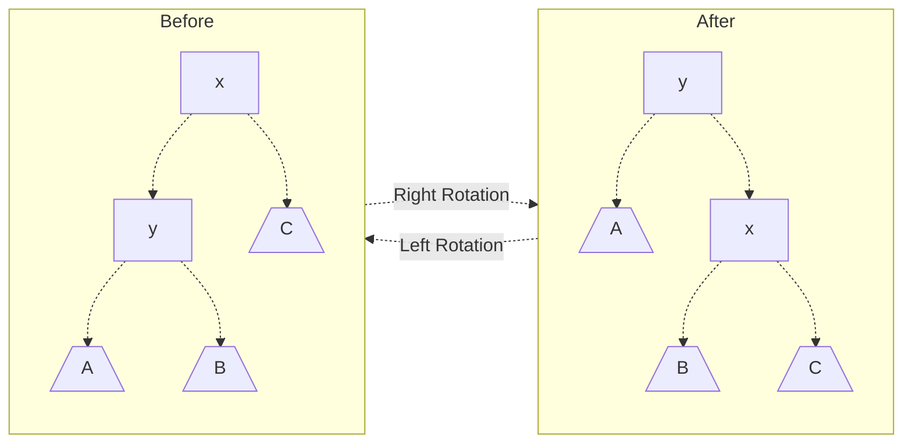
> Note how left and rotate rotations are inverse operations - they reverse one another.

Using such rotations in the correct cases can transform BSTs into AVL trees. See the below examples.

> [!Example]- Example: Right Rotation
> We begin with the below tree.
> 
> ```mermaid
> graph TD
>       1[20] -.-> 2[10] & 3[ ];
>       2 -.-> 4[5] & 5[ ];
>       4 -.-> 6[ ] & 7[ ];
> ```
> 
> Note that in this tree:
> - The node 5 has a balance of 0
> - The node of 10 has a balance of 1
> - The node of 20 has a balance of 2
> 
> As the balance at the root is 2, we see that the tree does not satisfy the AVL property. However, if we right rotate at the root, we will end up with a tree that satisfies the AVL property!
> 
> ```mermaid
> graph TD
>       1[10] -.-> 2[5] & 3[20];
>       2 -.-> 4[ ] & 5[ ];
>       3 -.-> 6[ ] & 7[ ];
> ```

> [!Example]- Example: Left-Right Rotation
> ```mermaid
> graph TD
>       1[20] -.-> 2[10] & 3[ ];
>       2 -.-> 4[ ] & 5[15];
>       5 -.-> 6[ ] & 7[ ];
> ```
> 
> Note that in this tree:
> - The node 15 has a balance of 0
> - The node 10 has a balance of -1
> - The node 20 has a balance of 2
> 
> As the node 20 has a balance of 2, we may think to rotate right. But this won't work!
>
> ```mermaid
> graph TD
>       1[10] -.-> 2[ ] & 3[20];
>       3 -.-> 4[15] & 5[ ];
>       4 -.-> 6[ ] & 7[ ];
> ```
> However, if we instead rotate left at 10, we end up with our first example, where we can then rotate right on 20 to obtain a balanced AVL tree! This is known as a **left-right rotation**.

## AVL Operations
### Correcting Imbalance
Observe from the above examples that rotations let us convert an unbalanced tree into a balanced one, while maintaining the BST property.

However, to do this, we have to perform different rotations (see the `Left-Right Rotation` example, where rotating right did nothing) in different cases. Below, all such cases to check for are given, along with the rotations needed to correct the imbalance. 

Consider a node $n$ with an imbalance, meaning that $B(n) > 1$ or $B(n) < 1$. Then, one of the following cases are true (obviously, if $|B(n)| \le 1$, we don't do anything):
- $B(n) > 1$: The left side is "heavier". Look at the balance of the left subtree, $l$.
  - $B(l) \ge 0$: Perform a right rotation on the root, $n$.
  - $B(l) < 0$: Perform a left rotation on the left child, $l$, and then a right rotation on the root, $n$.
- $B(n) < -1$: The right side is "heavier". Look at the balance of the right subtree, $r$. 
  - $B(r) > 0$: Perform a right rotation on the right child, $r$, then a left rotation on the root, $n$.
  - $B(r) \le 0$: Perform a left rotation on the root, $r$.
> Note that if $B(l)$ or $B(r)$ are 0, either rotation case can work, so we just opt for the simpler one.

Performing these rotations in the following cases will correctly rebalance the node $n$, provided its subtrees satisfy the AVL property. We can guarantee this by rebalancing starting from the leaf of the tree upwards.

To describe the later insertion and deletion algorithms, this operation will be called `rebalance()`.

### AVL Tree Insertion
A key thing to note is that when inserting into an AVL tree, the only nodes which might need to be rebalanced are the onces lying directly in the path of the node inserted. Thus, inserting into an AVL tree is similar to that of a BST, with an additional rebalancing step.

Let `rebalance()` describe the rebalancing operation described above. Then, to insert into an AVL tree, we do the following:

1. Insert into the tree as you would a standard BST.
2. Starting from the point of insertion, call `rebalance()`.
   - Repeat, continuously calling `rebalance()` on the node's parent, all the way until the root.

This can easily be achieved with recursion! See the below pseudocode as an example.

### AVL Tree Deletion
Similar to insertion, the only nodes that might need to be rebalanced during deletion are the ones lying directly in the path of deletion. Thus, we will delete as normal, and the add an extra rebalancing step while bubbling back up the tree.

Let `rebalance()` describe the rebalacing operation described above. Then, to delete from an AVL tree, we do the following.

1. Delete from the tree as you would a standard BST.
2. Starting from the point of insertion, call `rebalance()`.
   - Repeat, continuously calling `rebalance()` on the node's parent, all the way until the root.

This too, can easily be achieved through recursion! Note that in the case that the node's inorder successor was used, it may be necessary to begin rebalancing from the original location of the successor.

## AVL Tree Shortcomings
While AVL trees are powerful and stay balanced, they are not without issues.

The main issue is rebalancing - rotations are fairly expensive (especially $RL$ and $LR$ rotations), and having to rotate up to $\log(n)$ times to rebalance a tree can introduce significant overhead.

In the following sections, we discuss other implementations of self-balancing trees which aim to achieve a similar effect to AVL trees, without the overhead of rebalancing.


# 2-3 Trees
## Structure
A **2-3 Tree** is a tree which is **perfectly balanced**, meaning that:
- For any node $n$, it either has 0 children, or the maximum children that the node supports.
- All leaf nodes are at the same depth (by corollary, the balance is 0 everywhere).

However, perfect balance isn't possible for BSTs unless the number of nodes in the tree is $2^a - 1$! 2-3 Trees address this by actually defining nodes with differing numbers of children: **2-nodes** and **3-nodes**!

1. A **2-node** is a standard BST node. It has 1 key $K$ and 2 children, where:
   - The left subtree has values in the range $(-\infty, K)$
   - The right subtree has values in the range $[K, \infty)$.
   ```mermaid
   graph TD
         root[K] -.-> 1["(-∞,K)"] & 2["[K,∞)"];
   ```
2. A 3-node is a new type of node supporting 3 children. It has 2 keys $K_1$ and $K_2$, where $K_1 < K_2$, and 3 children, where:
   - The leftmost child has values in the range $(-\infty, K_1)$
   - The middle child has values in the range $[K_1,K_2)$
   - The rightmost child has values in the range $[K_2, \infty)$.
   ```mermaid
   graph TD
         root[K<sub>1</sub>, K<sub>2</sub>] -.-> 1["(-∞,K<sub>1</sub>)"] & 2["[K<sub>1</sub>,K<sub>2</sub>)"] & 3["[K<sub>2</sub>,∞)"];
   ```
   > We won't discuss what "balance" means for these nodes (as it goes into complex numbers), but know that $B = 0$ means that all of the subtree heights are the same.

See the below example.


> [!Example] Example: Example 2-3 Tree
> An example 2-3 tree is given below. Note the 3-node with keys 10 and 20.
> 
> ```mermaid
> graph TD
>       1[30] -.-> 2[10, 20] & 3[40];
>       2 -.-> 4[8] & 5[15] & 6[25];
>       3 -.-> 7[35] & 8[80];
> ```

## 2-3 Tree Operations
### 2-3 Tree Insertion
Note that in the standard BST, or an AVL tree, our trees grow downwards as we insert keys into the tree as leaf nodes. Unlike these trees, **2-3 trees grow upwards**, as in our insert operation, we find a matching leaf, and then propagate our inserted value back up the tree.

Say we want to insert a new element $K$ into the tree. We insert by doing the following:
1. First, we search to find the appropriate leaf for $K$, by recursively moving downwards through subtrees and repeating the following, until the node has no children:
   - If 2-node, check if $K$ is less than or greater than the node's key, and check the left / right subtree (respectively).
   - If 3-node, check if $K$ is less than, between, or greater than the node's keys, and check the left / middle / right subtree (respectively). 
2. After finding the leaf, we repeat the following, starting from the leaf. For a given node $n$, add $K$ to the node's keys.
   - If the node is a 2-node, promote it to a 3-node with two keys $k_1, k_2$.
   - If the node is a 3-node, promote it to a 4-node with 3 keys $k_1, k_2, k_3$.
3. If $n$ is now a 3-node, stop.
4. Otherwise, $n$ is now a 4-node, and we will **split the node** such that keys $k_1$ and $k_3$ become children of $n$'s parent, and $k_2$ is added to the parent's keys. Repeat step 2 on $n$'s parent.
   - If there is no such parent, then $k_2$ becomes a new 2-node with children $k_1$ and $k_3$.
> Note that after the first split, if $n$'s parent was originally a 3-node, then it will temporarily have 4 children. If another split occurs, then the left 2 children become children of $k_1$, and the right two children become children of $k_3$.

See below for some examples of node splitting. The simplest one would be when we have a single 3-node which has just been promoted to a 4-node, which would be split as follows

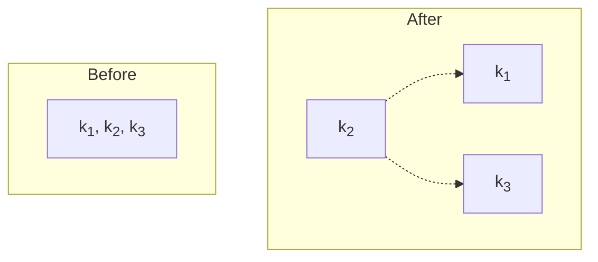

However, it will often be the case that our node is not the only node in the tree. The below example illustrates node splitting on a node within a tree (after node splitting has already previously occurred). Note that after this, we would repeat the process on node $k_2, p$.
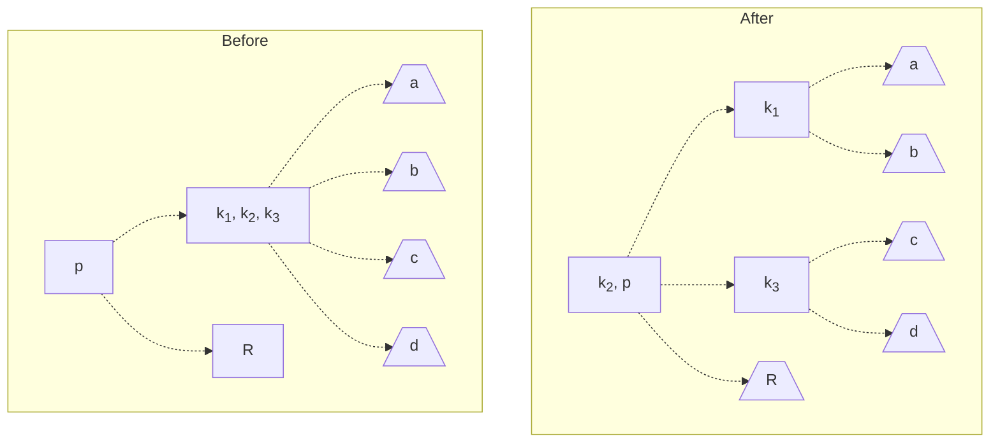

#### Key Rotations
While this insertion technique works and does correctly maintain a 2-3 Tree, it tends to make 2 nodes! This leads to higher trees, and in turn, a higher time complexity. A tree with more 3-nodes is generally better, as it will yield $O(\log_3 n)$ time (compared to $O(\log_2 n)$ in 2-node trees), which is faster!

To maximize the number of 3-nodes in a tree, we will first try to maximize the number of keys in a level before node splitting.

To do this, we will perform an operation known as a **key rotation**, which will shift keys between sibling nodes (nodes with the same parent). This can be used to shift our key from a 3-node to a 2-node, avoiding the need to split altogether!

Below we perform a series of key rotations to avoid node splitting. Note how in the rotation, we are doing the following:
- Bubble up the middle node's rightmost key to the root.
- Push the leftmost root key down to the sibling node on the right.
- Move the rightmost child of the middle node to be a child of the middle node's sibling.

> Note that we can key rotate in the other direction as well, which would reverse the key rotations shown below.

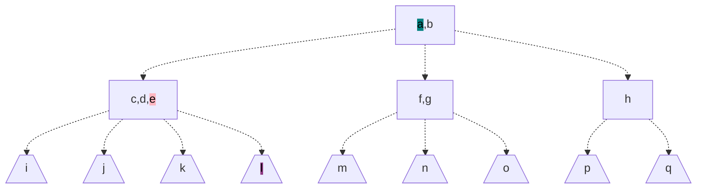
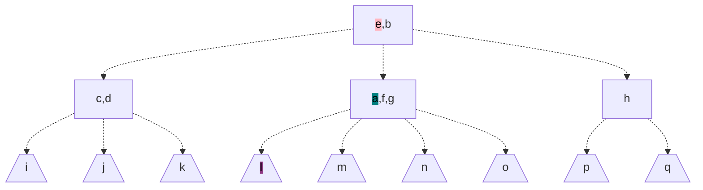
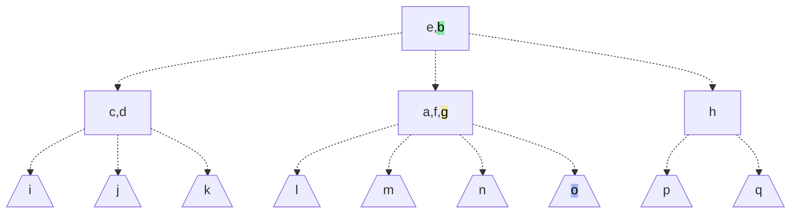
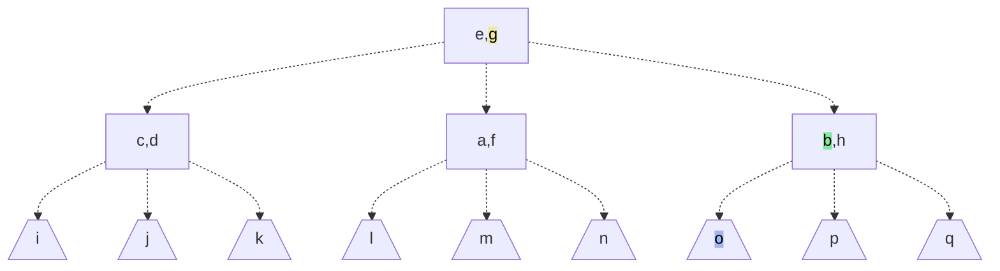

### 2-3 Tree Deletion
Deleting from a 2-3 Tree follows a similar idea as deletion from BSTs, with some adjustment necessary to propagate the deletion and maintain the 2-3 property.

Say we want to delete a key $k$ from the tree. We delete it by doing the following:
1. Find our target node $N$ whose key has $k$.
2. If the node is not a leaf node, find the inorder successor of $K$, $N_2$, and replace $K$ with this inorder successor. Repeat step 2 on $N_2$ until we have a leaf node.
3. Now, delete our leaf node $N$.
   - If our node is a 3-node, we can simply delete our key and terminate.
   - Otherwise, we leave an "empty node" in our tree, which we will have to remove in the next steps.
4. Follow one of the below cases to fill in this empty node, to maintain the tree's 2-3 property:
   - **Case 1**: The next older sibling has 2 keys, so we can rotate to fill in the empty spot.
   ```mermaid
   graph TD
         subgraph Before
         1[a] -.-> 2[ ] & 3[c,d];
         4[a,e] -.-> 5[ ] & 6[c,d] & 7[f];
         8[a,e] -.-> 9[ ] & 10[c,d] & 11[f,g];
         end
   ```
   ```mermaid
   graph TD
         subgraph After
         1[c] -.-> 2[a] & 3[d];
         4[c,e] -.-> 5[a] & 6[d] & 7[f];
         8[c,e] -.-> 9[a] & 10[d] & 11[f,g];
         end
   ```
   - **Case 2**: We are two rotations away from the nearest sibling 3-node, so we rotate twice.
   ```mermaid
   graph LR
         subgraph After
                  9[c,f] -.-> 10[a] & 11[e] & 12[g];
         end

         subgraph Intermediate
                  5[c,e] -.-> 6[a] & 7[ ] & 8[f,g];
         end
         
         subgraph Before
                  1[a,e] -.-> 2[ ] & 3[c] & 4[f,g];
         end

         Before -.-> Intermediate -.-> After
   ```
   - **Case 4**: We don't have enough keys, so we merge with the sibling and the parent.
   ```mermaid
   graph LR
        subgraph After
                 5[e] -.-> 6[a,c] & 7[f];
        end

        subgraph Before
                 1[a,e] -.-> 2[ ] & 3[c] & 4[f];
        end

        Before -.-> After;
   ```
   - **Case 5**: In the last case, we only have 2 possible keys, so we merge them together. However, this still leaves an empty node, which we must propagate upwards to delete in the next layer!
   ```mermaid
   graph LR
         subgraph After
                  4[ ] -.-> 5[a,c];
         end

         subgraph Before
                  1[a] -.-> 2[ ] & 3[c];
         end

         Before -.-> After;
   ```
5. If the empty node was propagated upwards (last case), perform one of the below cases to either remove the empty node, or propagate it upwards.
   - **Case A**: Perform the below transform, and repeat step 5 (note how the empty node still needs to be propagated upwards).
   ```mermaid
   graph LR
         subgraph Before
         1[a] -.-> 2[ ] & 3[c];
         2 -.-> 4[/D\];
         3 -.-> 5[/E\] & 6[/F\];
         end

         subgraph After
         7[ ] -.-> 8[a,c];
         8 -.-> 9[/D\] & 10[/E\] & 11[/F\];
         end

         Before -.-> After;
   ```
   - **Case B**: Perform the below transform, and terminate.
   ```mermaid
   graph LR
         subgraph Before
         1[a] -.-> 2[ ] & 3[c,d];
         2 -.-> 4[/E\];
         3 -.-> 5[/F\] & 6[/G\] & 7[/H\];
         end

         subgraph After
         8[c] -.-> 9[a] & 10[d];
         9 -.-> 11[/E\] & 12[/F\];
         10 -.-> 13[/G\] & 14[/H\];
         end

         Before -.-> After;
   ```
   - **Case C**: Perform the below transform, and terminate.
   ```mermaid
   graph LR
         subgraph Before
         1[a,b] -.-> 2[ ] & 3[d] & 4[e];
         2 -.-> 5[/F\];
         3 -.-> 6[/G\] & 7[/H\];
         4 -.-> 8[/J\] & 9[/K\];
         end

         subgraph After
         10[b] -.-> 11[a,d] & 12[e];
         11 -.-> 13[/F\] & 14[/G\] & 15[/H\];
         12 -.-> 16[/J\] & 17[/K\];
         end

         Before -.-> After;
   ```

Note that by the structure of 2-3 Trees, deleting a single key $k$ can cause a cascade of changes (due to the deletion propagation), which can be terribly inefficient. However, there may still be value in using 2-3 Trees, as efficient search is far more valuable than efficient deletion.

> [!Info] Mark-and-Sweep
> Many implementations of 2-3 Trees use a **Mark-and-Sweep** method for deletion, where nodes are marked for deletion and ignored in searching, and deletions are combined in batches for efficiency gains.


# Red-Black Trees
Recall 2-3 Trees. How could we implement such trees?

One implementation of 2-3 Trees is **Red-Black BSTs**. In this section, we discuss Red-Black BSTs, and more particularly, left-leaning Red-Black BSTs. 
> We discuss left-leaning Red-Black BSTs, as they are a bit easier to implement than the traditional Red-Black BST (but are the same theoretically). 

## Structure
The term **Red-Black BST** comes from its usage of different "color" links between nodes to represent the 2-3 Tree structure. In particular, we will use **red links**, and **black links**.
- We use **black links** to represent the links that 2-nodes have with other nodes (parents and children)
- To represent a 3-node, we will use **red links** to connect two 2-nodes together.

> [!Info] Example Link Colors
> In all following Red-Black tree examples, red links in the tree will be represented as the solid yellow arrows, and black links in the tree will be represented as the gray arrows.

For a 3-node with keys $K_1, K_2$ such that $K_1 < K_2$, we will represent it in the Red-Black tree as two 2-nodes, where $K_1$ is the left child of $K_2$. It will always be the left child, hence the **left-leaning** property of the Red-Black BST we are implementing.
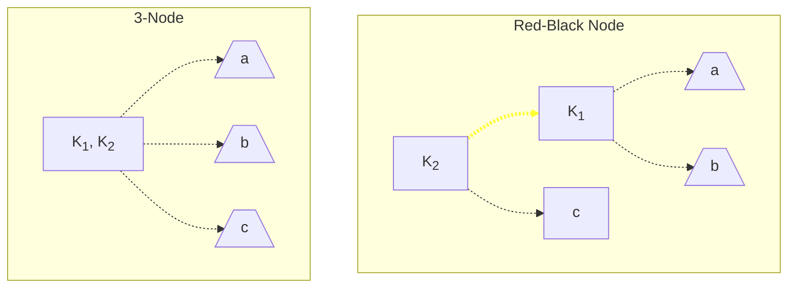

For example, the below 2-3 Tree would be correspondingly represented as the following Red-Black Tree:

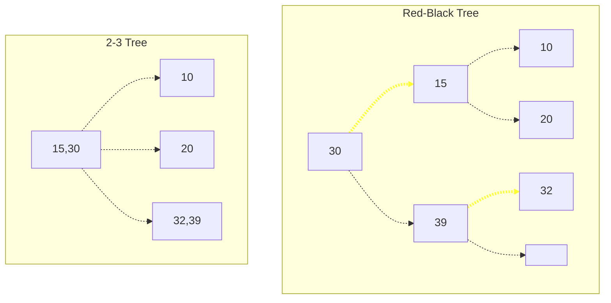
> Note that because black links represent our 2-3 Tree links, the number of black links in our Red-Black tree should equal the number of links in the corresponding 2-3 Tree. 
> 
> Furthermore, by property of 2-3 Tree, all leafs will be the same number of black links from the root (a property known a **perfect black link balance**).

> [!Example]- Example: Implementing a Red-Black Node
> To account for the "color" of links, implementations of Red-Black nodes will typically store the color of the link **from the parent**.
> ```java
> protected enum Color {
>     RED, BLACK;
> }
> 
> protected class Node {
>     Node left, right;
>     T data;
>     Color color; // Color of the link from the parent
> }
> ```

> [!Info] Pros and Cons
> By this representation, the Red-Black tree has many pros and cons.
> - **Pros**: A 2-node representation lets use use all pre-existing BST searching algorithms without modification, for fairly good efficiency!
> - **Cons**: The red links force taller trees, which can be inefficient. In fact in the worst case scenario (only 3-nodes), Red-Black trees can be more inefficient than AVL trees!
> 
>   However, this case is typically quite rare, and more often than not the tree is (generally) fairly balanced.

## Red-Black Tree Operations
### Handling Right-Leaning Red Links
When working with Red-Black trees, we occasionally may see **right-leaning red links**, meaning that the red link represents a link between a parent and a right child. By our implementation of Red-Black trees, this is not allowed, so we'll have to fix this!
> Note that other implementations of Red-Black trees may allow this - just not ours.

There are two particular cases of right-leaning red links that we'll have to address:
1. **Case 1**: There exists a right-leaning red link, with the other link being a black link. In this case, we left rotate the tree.
   ```mermaid
   graph LR
       subgraph After
           8[30] -.-> 9[15] & 10[/d\];
           9 -.-> 11[1] & 12[/c\];
           11 -.-> 13[/a\] & 14[/b\];
       end
       
       subgraph Before
           1[15] -.-> 2[1] & 3[30];
           2 -.-> 4[/a\] & 5[/b\];
           3 -.-> 6[/c\] & 7[/d\];
       end
       
       linkStyle 0,7 color:#ff0000,stroke:#ff3,stroke-width:4px;
       Before -.-> After;
   ```
2. **Case 2**: There exists both left-leaning and right-leaning red links from a node. In this case, we make the parent link a red link (doesn't matter if the root is a left or right child). We will call this `flipColors()` for later convenience.
   ```mermaid
   graph LR
       subgraph After
           8[ ] -.-> 9;
           9[15] -.-> 10[1] & 11[30];
           10 -.-> 12[/a\] & 13[/b\];
           11 -.-> 14[/c\] & 15[/d\];
       end
       
       subgraph Before
           0[ ] -.-> 1;
           1[15] -.-> 2[1] & 3[30];
           2 -.-> 4[/a\] & 5[/b\];
           3 -.-> 6[/c\] & 7[/d\];
       end
       
       linkStyle 0,8,9 color:#ff0000,stroke:#ff3,stroke-width:4px;
       Before -.-> After;
   ```

> [!Warning] Left-Leaning Inefficiencies
> Note that our left-leaning constraint, while simpler, also forces us to imbalance the tree in these cases, which is more inefficient.

### Inserting into Red-Black Trees
When inserting into a Red-Black Tree, we will insert top-down, in a similar way to how we insert into a BSTs. However, to maintain the 2-3 Tree property, **we will always insert with a red link**, and handle the right-leaning cases as well as use rotations to maintain the tree.

Thus, to insert a key $k$ into the tree, we do the following:
1. Like a standard BST, search for $k$ in the tree, and take the deepest node $n$.
2. Insert $k$ **with a red link** as a left or right child of $n$, depending on how their values compare. 
3. Propagate back up the tree from the point of insertion, checking for one of the two cases:
   1. **Case 1**: If we have a node whose childre are both connected with red links, we run `flipColors()` on $n$, removing the red links and push a red link upwards (described in the previous section).
   2. **Case 2**: If we have a node $n$ whose child $c_1$ is connected with a red link, and one of $c_1$'s children ($c_2$) is also connected with a red link, rotate on the nodes to obtain case 1 (then, run `flipColors()`).
      - **Case i**: If $c_1$ and $c_2$ are both left children, rotate right once on $n$.
      - **Case ii**: If $c_1$ and $c_2$ are both right children, rotate left once on $n$.
      - **Case iii**: If $c_1$ is a left child, and $c_2$ is a right child, then rotate left on $c_1$, then rotate right on $n$.
      - **Case iv**: If $c_1$ is a right child, and $c_2$ is a left child, then rotate right on $c_1$, then rotate left on $n$.
      > This is very similar to how we rotate in AVL trees!
4. Finally, once at the root, set the root's link (to its parent, which doesn't exist) to black.

An example of Case 2 is given below. Below, we have sequential red links, so we left rotate on $a$ right rotate on $b$ to get Case 1, and then run `flipColors()`.
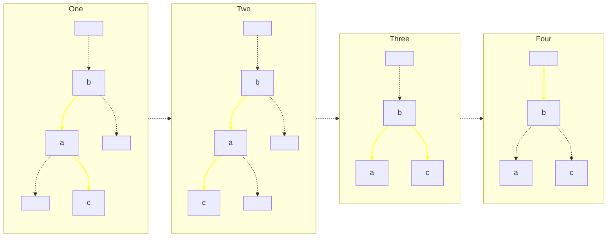

### Deleting from Red-Black Trees
Performing **hard deletion**, the process of removing a node from the tree, is **extremely difficult (perhaps even impractical)** with Red-Black trees, even conceptually. Thus, to "delete" from a Red-Black tree, we will opt for a soft deletion instead.

To implement deletion, we will use a **mark-and-sweep** method. To "delete" a key $k$ from a Red-Black tree, we will mark its node to indicate that it's to be deleted, and then periodically, sweep through all the nodes and create a new tree without any marked nodes.
> This is a fairly standard thing to do for automated garbage collection!

It may also be possible to replace a marked node with a newly inserted one, if we find that the new key to insert satisfies the BST property if inserted at the node (we need to compare it with the node's children).


# B-Trees
## Structure
Recall 2-3 Trees. The idea underlying 2-3 Trees was that we could allow larger nodes in a tree, in order to minimize its height.

**B-Trees** is a generalization of this, based on a parameter $p$, called the **fan-out** of each node! In a B-Tree, the following must hold: 
- Every node has a maximum of up to $p$ children. A corollary of this is that every node has a maximum number of $p - 1$ keys.
- Every node has a minimum of at least $\lceil \frac{p}{2} \rceil - 1$ keys, except the root, which has a minimum of 1 key.

> Note that as nodes can now support up to $p - 1$ keys, performing a search will now take $O(\log_2 (p - 1))$ time.

This can make things fairly complicated! Now, we'll have to deal with not only **overflows**, where a node has too many keys, but also **underflows**, where there's just not enough keys at a node!

> [!Info] Implementing B-Trees
> To implement this in code, we'll typically use arrays of size $p - 1$ to hold node keys, and arrays of size $p$ to hold a node's children.
> 
> While this does introduce significant costs, it really useful for large datasets, due to how slow its height grows! 
>
> Oftentimes, it's the case where a B-Tree is stored in memory, except for leaf ndoes, which can be (for example) blocks on a disk. This could be used to let us easily search through a large file system!
> > In this implementation, it's often the case that we want to access sequential blocks, so we can add pointers from one leaf to the next. This implementation is called a $B^+$-Tree.

## B-Tree Operations
### Inserting into B-Trees
To insert into a B-Tree, we follow a similar process to 2-3 Trees. We first find where we want to insert, insert the key into the node, and then adjust the tree accordingly.

Thus, to insert a key $k$ into the tree, we do the following:
1. First, we search for the node where we want to insert the key. Starting from the root, choose the child which is bounded by keys $K_1$ and $K_2$ such that $K_1 \le k \le K_2$. Repeat until we have a leaf node.
2. Insert the key $k$ into the node's keys.
3. If the node has less than $p - 1$ keys, terminate. We are done.
4. Otherwise, we have an **overflow**, where a node has more than $p - 1$ keys. Perform one of the following cases:
   - If a sibling in the same layer as the node does not have $p - 1$ keys, perform key rotations until all nodes have $p - 1$ keys or less.
      - We will prefer to rotate towards closer siblings than those further.
      - We will prefer to rotate towards the right over rotating to the left.
   - Otherwise, perform a node split.
      1. Take the median of the keys, $K_m$. If we have to choose 2 nodes for the median, take the greater of the two for convention.
      2. Make 2 new children nodes of the parent with keys $k < K_m$ and keys $k > K_m$.
      3. Push $K_m$ to the parent's keys, and repeat step 3 on the parent.
      > By doing this, we guarantee that there is enough keys in the parent (+1 keys), and enough children (+1 children), to satisfy the BST property.


Rotations in B-Trees are virtually the same as that of 2-3 Trees (refer to key rotations in 2-3 Trees), where we:
1. Push a node $n$'s rightmost (or leftmost) key, $k$, up to the parent.
2. Push the key in the parent immediately right $k$ downwards, to the right (or left) sibling of the node.
3. Move the rightmost (or leftmost) child of $n$ to be a child of its right (or left) sibling. 

See the below example.

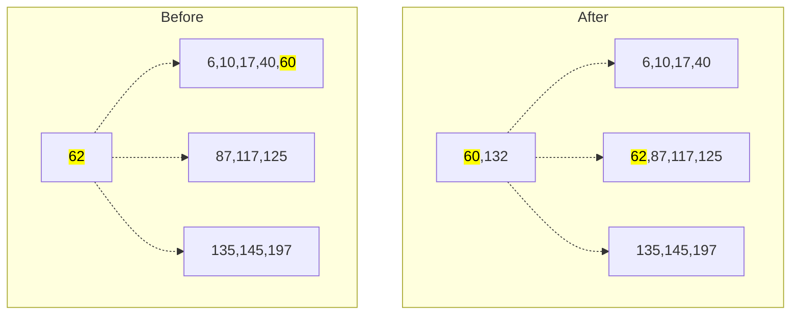

We typically prefer to rotate instead of split, as creating new nodes requires large allocations of contiguous memory. However, in when $p$ is large, it sometimes may actually be more expensive to rotate than to split! So, many B-Trees have what's called a **hop limit** $h$, specifying how far we're willing to rotate.
- If a sibling with capacity to take the overflowed key is $h$ or less rotations away, then we rotate.
- Otherwise, we split instead.

### Deleting from B-Trees
Again, deleting from a B-Tree follows similarly 2-3 Trees. We find our target key, swap it until it is at a leaf, then remove it and fix the tree.

To delete a key $k$ from a B-Tree, we do the following:
1. First, we search for the node with the key. Starting from the root, choose the child which is bounded by keys $K_1$ and $K_2$ such that $K_1 \le k \le K_2$. Repeat until we find the node with key $k$.
2. Then, check if the node is a leaf or an interior node:
   - If the node is a leaf, remove $k$ from the node and move on to step 3.
   - Find the inorder successor of $k$, and replace $k$ with this successor. Repeat step 2. 
3. After removing our key $k$, we need to check for **underflow**, where our node no longer satisfies the B-Tree property of having at least $\lceil \frac{p}{2} \rceil - 1$ keys (or 1 if root). If satisfied, terminate.
4. Otherwise, we need to correct our tree to maintain the node key property.
   - If there exist siblings with $\lceil \frac{p}{2} \rceil$ or more keys, perform rotations to move the excess keys to our node. Terminate.
   - Otherwise, perform a **merge**, where an adjacent parent key, and the node's closest sibling, are combined into a singular node. Repeat step 4 on the parent. 
   > By convention, prefer to merge with the right sibling (if it exists).
5. Finally, if we merged with the root such that the root no longer has any keys, shorten the tree height by 1 (replace the old parent root with its child).

Rotations are the same as that of insertion. An example merge can be seen below. Let $p = 5$, and say we deleted from the node with key $103$.

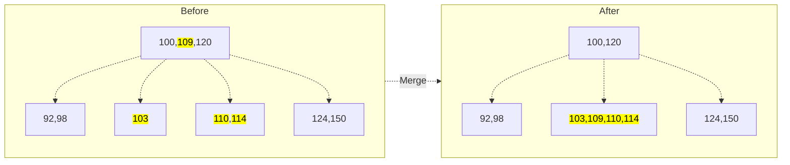
