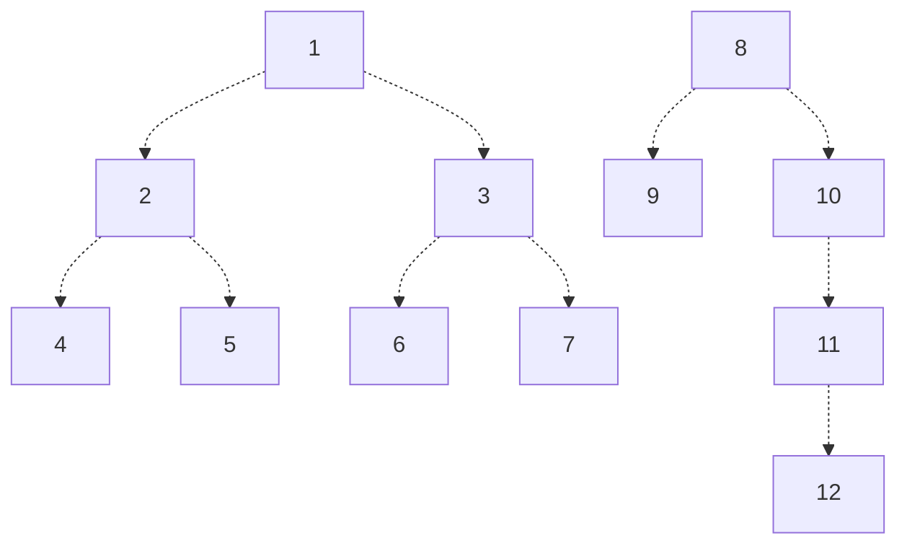
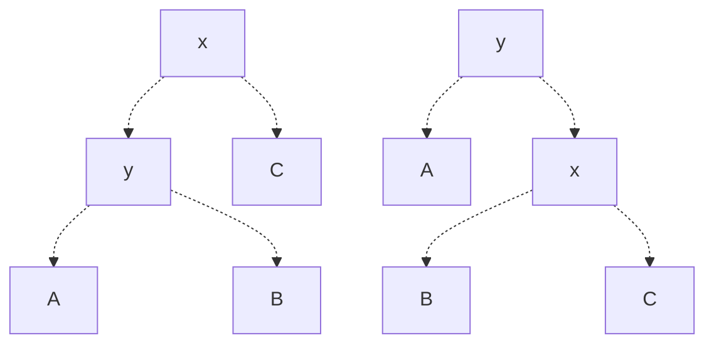

Working notes for CMSC420, Spring Semester 2024.


---


(Basic Data Structures)


(Self-Balancing Trees)

# Binary Search Trees
A **binary search tree** is a tree satisfying the following properties:

For any node $N$ with a value $v$,
- It has 0 to 2 nodes as children, named left and right.
- The value of the left child (if it exists) must be less than $v$.
- The value of the right child (if it exists) must be greater than $v$.

Because of this property, we can guarantee that for any node $N$ with value $v$, **all keys** in the left subtree are less than $v$, and **all keys** in the right subtree are greater than $v$. This property proves to be extremely useful for efficient searching of specific keys, as it saves us the cost of needing to search entire subtrees based on a node's value.


## Tree Traversal
There are typically 3 ways in which we can traverse a binary tree:
- **Pre-Order (Node First)**: N, Left Tree, Right Tree
- **In-Order (Node in the Middle)**: Left Tree, N, Right Tree
  > Sorted Order
- **Post-Order (Node Last)**: Left Tree, Right Tree, N

---

# Balance of Binary Search Trees
When dealing with Binary Search Trees, the structure of the tree plays a significant role in the time complexity of operations performed on it. For example, searching in the below left tree will take $O(\log n)$ time, but searching in the below right tree will take $O(n)$ time.



Different structures of trees result from variations in the insertion order of values, and this will create what we call an **imbalance**. In general, imbalanced trees can be bad for application purposes, so how can we avoid this?

Unfortunately, in most cases, we cannot control the order in which elements are inserted. However, we can modify our insertion algorithms to keep the tree balanced!

Below are two specific implementations of Binary Search Trees which avoid this imbalance issue: **AVL Trees** and **Red-Black Trees**. Such implementations aim to maintain the logarithmic search time that we value Binary Search Trees for, and we call them **self-balancing**.


## AVL Trees
An **AVL Tree** is a Binary Search Tree satisfying the property that the tree can be unbalanced by at most one level, but no more.

### Balance
We measure balance recursively through a tree's **height** $H$, which is defined as
$$
H(n) = \max( H(T_L), H(T_R) ) + 1
$$
Or in other words, the max height of either the left or right subtree plus one. As base cases, nodes with no children are defined as having a height of $0$, and a tree with no nodes has a height of $-1$.

Using height, **balance** $B$ is defined as the signed difference between the height of the left and right subtrees.
$$
B(n) = H(T_L) - H(T_R)
$$
> Note that by this definition, if $B(n) < 0$, then the right subtree has a greater height, and if $B(n) > 0$, then the left subtree has a greater height.

Thus, an AVL Tree is a Binary Search Tree such that for all nodes in the tree $n$, $|B(N)| \le 1$.

### Rotations
We define a **rotation** on a Binary Search Tree as an operation which preserves the properties of the Binary Search Tree. Given a Binary Search Tree, we can either **left rotate** or **right rotate** it.
> We can use rotations to transform non-AVL Binary Search Trees into AVL Trees.

Below we give two abstract trees, which are left and right rotated from one another. Let $A,B,C$ be subtrees, and $x$ and $y$ be keys such that $y < x$.



Performing a right rotation on the left Binary Search Tree will yield the right tree, and performing a left rotation on the right Binary Search Tree will yield the left tree.

See the below examples.

> [!Example]- Example: Right Rotation
> We begin with the below tree.
> 
> ```mermaid
> graph TD
>       1[20] -.-> 2[10] & 3[ ];
>       2 -.-> 4[5] & 5[ ];
>       4 -.-> 6[ ] & 7[ ];
> ```
> 
> Note that in this tree:
> - The node 5 has a balance of 0
> - The node of 10 has a balance of 1
> - The node of 20 has a balance of 2
> 
> As the balance at the root is 2, we see that the tree does not satisfy the AVL property. However, if we right rotate at the root, we will end up with a tree that satisfies the AVL property!
> 
> ```mermaid
> graph TD
>       1[10] -.-> 2[5] & 3[20];
>       2 -.-> 4[ ] & 5[ ];
>       3 -.-> 6[ ] & 7[ ];
> ```

> [!Example]- Example: Left-Right Rotation
> ```mermaid
> graph TD
>       1[20] -.-> 2[10] & 3[ ];
>       2 -.-> 4[ ] & 5[15];
>       5 -.-> 6[ ] & 7[ ];
> ```
> 
> Note that in this tree:
> - The node 15 has a balance of 0
> - The node 10 has a balance of -1
> - The node 20 has a balance of 2
> 
> As the node 20 has a balance of 2, we may think to rotate right. But this won't work!
>
> ```mermaid
> graph TD
>       1[10] -.-> 2[ ] & 3[20];
>       3 -.-> 4[15] & 5[ ];
>       4 -.-> 6[ ] & 7[ ];
> ```
> However, if we instead rotate left at 10, we end up with our first example, where we can then rotate right on 20 to obtain a balanced AVL tree! This is known as a **left-right rotation**.

### Fixing Imbalance with Rotations
So what rotation is the right rotation? From the above examples, we can notice a pattern which gives us 4 possibilities. Consider a node $n$ with an imbalance. This means that $B(n) > 1$ or $B(n) < 1$.
- If $B(n) > 1$, then the left side is "heavier", so we look at the left subtree's balance, $l$.
  - If $B(l) > 0$, then we perform a right rotation on the root.
  - If $B(l) < 0$, then we perform a left rotation on the left child, then a right rotation on the root.
- If $B(n) < -1$, then the right side is "heavier", so we look at the right subtree's balance, $r$.
  - If $B(r) > 0$, then we perform a right rotation on the right child, then a left rotation on the root.
  - If $B(r) < 0$, then we perform a left rotation on the root.

We can use these cases to fix imbalances in the AVL Tree, for both insertion and deletion operations. In the case that $B(l)$ or $B(r)$ is $0$, either of the cases can work (so we'll opt for the simpler one rotation).

> [!Example]- Example: Inserting into an AVL Tree
> Sample pseudocode is given as follows. We define a node as follows:
> 
> ```python
> class AVLNode(Object):
>       def __init__(self, data):
>           self.data = data
>           self.left = None
>           self.right = None
>           self.height = 0
> ```
> > For convenience, we ignore the height and balance calculations.
> 
> We can define the rotations as follows. Note that these operations return the new root of the tree operated on.
> 
> ```python
> def rotateRight(target):
>     temp = target.left
>     target.left = temp.right
>     temp.right = target
>     return temp
> 
> def rotateLeft(target):
>     temp = target.right
>     target.right = temp.left
>     temp.left = target
>     return temp
> 
> def rotateLeftRight(target):
>     target.left = rotateLeft(target.left)
>     target = rotateRight(target)
>     return target
> 
> def rotateRightLeft(target):
>     target.right = rotateRight(target.right)
>     target = rotateLeft(target)
>     return target
> ```
> 
> Given these operations, we can now implement insertion into an AVL tree!
> 
> ```python
> def insertion(element, curr = None):
>     # Base Case for Tree Insertion
>     if curr == None:
>        return AVLNode(element)
> 
>     if element < curr.data:
>          # Insert the Element First
>          curr.left = insert(element, curr.left)
> 
>          # Bubbling Up from Insertion Point, Check if Balanced
>          # Case Analysis with Balances
>          if height(curr.left) - height(curr.right) == 2:
>             if element < curr.left.data:
>                curr = rotateRight(curr)
>             else:
>                 curr = rotateLeftRight(curr)
>          
>          # Updating the Height
>          curr.height = max( height(curr.left), height(curr.right) ) + 1
>     else:
>         # Unimplemented
>     return curr
> ```

#### Deletion from AVL Trees
When deleting from an AVL tree, we'll have to recalculate heights and rebalance as needed, in a similar way to insertion.


## Red-Black Trees