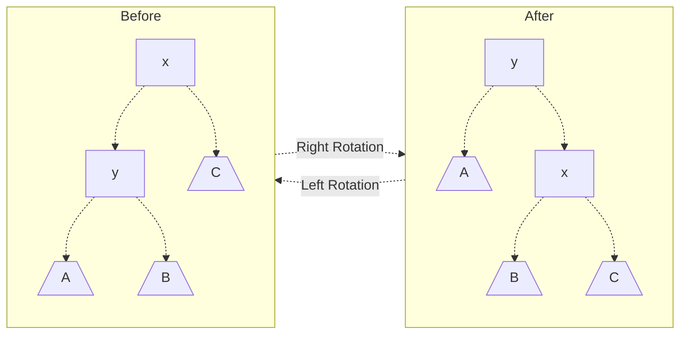
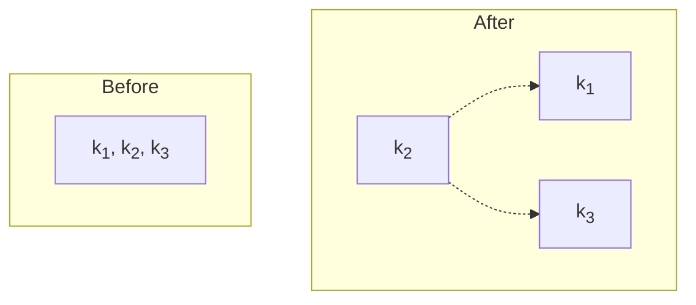
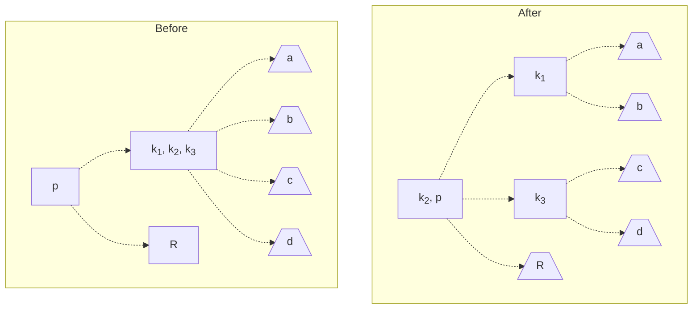

Working notes for CMSC420, Spring Semester 2024.


---

(Basic Data Structures)

*Binary Search Trees*

# Binary Search Trees (BSTs)
## Structure
A **binary search tree (BST)** is a tree with nodes $N$, wherein each node has a key $v$ and up to 2 children (denoted left and right), and satisfies the following properties:
- Both the left and right child of the node (if they exist) are binary search trees.
- All values in the left subtree (with root at the left child) must be less than $v$.
- All values in the right subtree (with root at the right child) must be greater than $v$.

This property lets us efficiently search binary search trees for specific keys, as for any node $N$ we check, we can guarantee that our search target will be in either the node's left subtree or right, but not both, saving us the cost of needing to search the entire tree. 

Below, we discuss common operations that can be performed on a binary search tree.

## BST Operations
### Searching a BST
Suppose we have a BST, and we want to search for if a key $k$ exists in the tree. Notice that by the BST property, given a node $N$ with key $v$, only the following cases can occur:
- $k = v$, in which we have found our key.
- $k < v$, in which we have not yet found our key, but if it exists, it must be in the left subtree (where all values $<N$ are).
- $k > v$, in which we have not yet found our key, but if it exists, it must be in the right subtree (where all values $>N$ are).

Thus, we can easily search through the binary search tree using a function that recursively checks these cases, starting from the root $R$. The algorithm is given as follows:
1. Given a node $N$ with value $v$, compare our search key $k$ with the node's key $v$. Then,
   - If $k = v$, then we have found our key, and terminate.
   - If $k < v$, then our key can only be in the left subtree, and we repeat step (1) on the left child of $N$, if it exists. Otherwise, key does not exist in tree.
   - If $k > v$, then our key can only be in the right subtree, and we repeat step (2) on the right child of $N$, if it exists. Otherwise, key does not exist in the tree.

Some pseudocode for this search process is given below.

```python
# Searches for searchKey within the BST starting at node
def search(node, searchKey):
    # Key not found, return None
    if (node == None):
       return None
    # Key found, return it
    elif (node.key == searchKey):
       return node.key
    else:
        # Check left subtree
        if (node.key < searchKey):
           return search(node.leftChild, searchKey)
        # Check right subtree
        else:
           return search(node.rightChild, searchKey)
```

> [!Example]- Example: Searching a BST
> Suppose we are searching for the key $5$ in the following BST:
> 
> ```mermaid
> graph TD
>       3 -.-> 2 & 6;
>       6 -.-> 5 & _[ ];
> ```
> 
> Then, we would search it as follows:
> 1. Start at $3$. Because $3 < 5$, search in right subtree (with root $6$).
> 2. Start at $6$. Because $5 < 6$, search in left subtree (with root $5$).
> 3. Note that $5 = 5$. We've found our key in the tree!

### Inserting into a BST
Suppose we have a binary search tree, and we want to insert a new key $k$ into the tree. Notice that when searching in the BST, we are searching in the only possible spot the key $k$ can be in - in other words, we are finding the location the node must be, if it exists in the tree.

Thus, we can use this search process to find this location, and then insert our key $k$ into this location! The algorithm is as follows:
1. If the tree is empty, simply insert $k$ as the root of the tree.
2. Otherwise, search for the node, using the above search algorithm, starting from the root $R$. However, if the left / right child to search in doesn't exist, insert the $k$ as a new node there.

Pseudocode for insertion is given below.

```python
# Inserts key into BST, and returns the new root
def insert(node, key):
    # Create new node for insertion
    if (node == None):
       return Node(key)
    else:
        # Insert into left subtree
        if (node.key < key):
           node.leftChild = insert(node.leftChild, key)
        # Insert into right subtree
        else:
           node.rightChild = insert(node.rightChild, key)
```

### Deleting from a BST
Suppose we have a binary search tree, and we want to delete a key $k$ from the tree. To do this while maintaining the BST property, we need to replace the node with key $k$ (if it exists) with either the node with the next greater (or smaller) value.

So, to delete a node from the tree, the algorithm is as follows:
1. Search within the tree, and find the node whose key is $k$.
2. Replace the node with another node that will maintain the BST property, by performing one of the following cases:
   - If the node has no children, set its reference in the parent to `null` to remove it from the tree.
   - If the node does not have a left or right child, replace it with its immediate right or left child (respectively).
   - Otherwise, replace it with the next inorder element in the tree. Note that when this happens, we'll have to link the element's parent to its right child as to keep them in the tree.

## Balance and Imbalance
### Motivation
When working with BSTs, the structure of the tree plays a significant role in the time complexity of operations performed.

See the below example.

> [!Example] Example: Differences in Time Complexity
> For example, searching in the below left tree will take $O(\log n)$ time, but searching in the below right tree will take $O(n)$ time.
> 
> ```mermaid
> graph TD
>       1 -.-> 2 & 3;
>       2 -.-> 4 & 5;
>       3 -.-> 6 & 7;
> 
>       8 -.-> 9 & 10;
>       10 -.-> 11 -.-> 12; 
> ```

These differing structures are a result from the insertion / deletion order of values, and create what we call an **imbalance**. These imbalanced trees can be bad for application purposes, so how can we avoid this?

### Height and Balance
We define a tree's **height** $H$, as the max height of either the left or right subtree plus one. More formally, if $n$ is a node with subtrees $T_L$ (left child) and $T_R$ (right child), then
$$
H(n) = \max( H(T_L), H(T_R) ) + 1
$$
As base cases, nodes with no children are defined as having a height of $0$, and a tree with no nodes has a height of $-1$.

Then, we define **balance** as the signed difference between the height of the left and right subtrees.
$$
B(n) = H(T_L) - H(T_R)
$$
Note that by this definition, if $B(n) < 0$, then the right subtree has a greater height, and if $B(n) > 0$, then the left subtree has a greater height.

In the following sections, we discuss implementations of BSTs which minimize imbalance in trees to achieve high-efficiency searching. These trees are called **self-balancing trees**.

# AVL Trees
## Structure
An AVL Tree is a BST such that for all nodes in the tree $n$, $|B(N)| \le 1$. In other words, all nodes must obey the BST property, but also cannot have an imbalance greater than 1.

To maintain this property after insertion / deletion, AVL Trees use **rotations**, which are operations that rearrange the BST, yet still preserve the properties of the BST. There are two rotations we can do: **left rotations** and **right rotations**.

The left and right rotation operations are given below. Let $x,y$ be nodes of the tree such that $y < x$, and let $A,B,C$ be subtrees.


> Note how left and rotate rotations are inverse operations - they reverse one another.

Using such rotations in the correct cases can transform BSTs into AVL trees. See the below examples.

> [!Example]- Example: Right Rotation
> We begin with the below tree.
> 
> ```mermaid
> graph TD
>       1[20] -.-> 2[10] & 3[ ];
>       2 -.-> 4[5] & 5[ ];
>       4 -.-> 6[ ] & 7[ ];
> ```
> 
> Note that in this tree:
> - The node 5 has a balance of 0
> - The node of 10 has a balance of 1
> - The node of 20 has a balance of 2
> 
> As the balance at the root is 2, we see that the tree does not satisfy the AVL property. However, if we right rotate at the root, we will end up with a tree that satisfies the AVL property!
> 
> ```mermaid
> graph TD
>       1[10] -.-> 2[5] & 3[20];
>       2 -.-> 4[ ] & 5[ ];
>       3 -.-> 6[ ] & 7[ ];
> ```

> [!Example]- Example: Left-Right Rotation
> ```mermaid
> graph TD
>       1[20] -.-> 2[10] & 3[ ];
>       2 -.-> 4[ ] & 5[15];
>       5 -.-> 6[ ] & 7[ ];
> ```
> 
> Note that in this tree:
> - The node 15 has a balance of 0
> - The node 10 has a balance of -1
> - The node 20 has a balance of 2
> 
> As the node 20 has a balance of 2, we may think to rotate right. But this won't work!
>
> ```mermaid
> graph TD
>       1[10] -.-> 2[ ] & 3[20];
>       3 -.-> 4[15] & 5[ ];
>       4 -.-> 6[ ] & 7[ ];
> ```
> However, if we instead rotate left at 10, we end up with our first example, where we can then rotate right on 20 to obtain a balanced AVL tree! This is known as a **left-right rotation**.

## AVL Operations
### Correcting Imbalance
Observe from the above examples that rotations let us convert an unbalanced tree into a balanced one, while maintaining the BST property.

However, to do this, we have to perform different rotations (see the `Left-Right Rotation` example, where rotating right did nothing) in different cases. Below, all such cases to check for are given, along with the rotations needed to correct the imbalance. 

Consider a node $n$ with an imbalance, meaning that $B(n) > 1$ or $B(n) < 1$. Then, one of the following cases are true (obviously, if $|B(n)| \le 1$, we don't do anything):
- $B(n) > 1$: The left side is "heavier". Look at the balance of the left subtree, $l$.
  - $B(l) \ge 0$: Perform a right rotation on the root, $n$.
  - $B(l) < 0$: Perform a left rotation on the left child, $l$, and then a right rotation on the root, $n$.
- $B(n) < -1$: The right side is "heavier". Look at the balance of the right subtree, $r$. 
  - $B(r) > 0$: Perform a right rotation on the right child, $r$, then a left rotation on the root, $n$.
  - $B(r) \le 0$: Perform a left rotation on the root, $r$.
> Note that if $B(l)$ or $B(r)$ are 0, either rotation case can work, so we just opt for the simpler one.

Performing these rotations in the following cases will correctly rebalance the node $n$, provided its subtrees satisfy the AVL property. We can guarantee this by rebalancing starting from the leaf of the tree upwards.

To describe the later insertion and deletion algorithms, this operation will be called `rebalance()`.

### AVL Tree Insertion
A key thing to note is that when inserting into an AVL tree, the only nodes which might need to be rebalanced are the onces lying directly in the path of the node inserted. Thus, inserting into an AVL tree is similar to that of a BST, with an additional rebalancing step.

Let `rebalance()` describe the rebalancing operation described above. Then, to insert into an AVL tree, we do the following:

1. Insert into the tree as you would a standard BST.
2. Starting from the point of insertion, call `rebalance()`.
   - Repeat, continuously calling `rebalance()` on the node's parent, all the way until the root.

This can easily be achieved with recursion! See the below pseudocode as an example.

### AVL Tree Deletion
Similar to insertion, the only nodes that might need to be rebalanced during deletion are the ones lying directly in the path of deletion. Thus, we will delete as normal, and the add an extra rebalancing step while bubbling back up the tree.

Let `rebalance()` describe the rebalacing operation described above. Then, to delete from an AVL tree, we do the following.

1. Delete from the tree as you would a standard BST.
2. Starting from the point of insertion, call `rebalance()`.
   - Repeat, continuously calling `rebalance()` on the node's parent, all the way until the root.

This too, can easily be achieved through recursion! Note that in the case that the node's inorder successor was used, it may be necessary to begin rebalancing from the original location of the successor.

## AVL Tree Shortcomings
While AVL trees are powerful and stay balanced, they are not without issues.

The main issue is rebalancing - rotations are fairly expensive (especially $RL$ and $LR$ rotations), and having to rotate up to $\log(n)$ times to rebalance a tree can introduce significant overhead.

In the following sections, we discuss other implementations of self-balancing trees which aim to achieve a similar effect to AVL trees, without the overhead of rebalancing.


# 2-3 Trees
## Structure
A **2-3 Tree** is a tree which is **perfectly balanced**, meaning that:
- For any node $n$, it either has 0 children, or the maximum children that the node supports.
- All leaf nodes are at the same depth (by corollary, the balance is 0 everywhere).

However, perfect balance isn't possible for BSTs unless the number of nodes in the tree is $2^a - 1$! 2-3 Trees address this by actually defining nodes with differing numbers of children: **2-nodes** and **3-nodes**!

1. A **2-node** is a standard BST node. It has 1 key $K$ and 2 children, where:
   - The left subtree has values in the range $(-\infty, K)$
   - The right subtree has values in the range $[K, \infty)$.
   ```mermaid
   graph TD
         root[K] -.-> 1["(-∞,K)"] & 2["[K,∞)"];
   ```
2. A 3-node is a new type of node supporting 3 children. It has 2 keys $K_1$ and $K_2$, where $K_1 < K_2$, and 3 children, where:
   - The leftmost child has values in the range $(-\infty, K_1)$
   - The middle child has values in the range $[K_1,K_2)$
   - The rightmost child has values in the range $[K_2, \infty)$.
   ```mermaid
   graph TD
         root[K<sub>1</sub>, K<sub>2</sub>] -.-> 1["(-∞,K<sub>1</sub>)"] & 2["[K<sub>1</sub>,K<sub>2</sub>)"] & 3["[K<sub>2</sub>,∞)"];
   ```
   > We won't discuss what "balance" means for these nodes (as it goes into complex numbers), but know that $B = 0$ means that all of the subtree heights are the same.

See the below example.


> [!Example] Example: Example 2-3 Tree
> An example 2-3 tree is given below. Note the 3-node with keys 10 and 20.
> 
> ```mermaid
> graph TD
>       1[30] -.-> 2[10, 20] & 3[40];
>       2 -.-> 4[8] & 5[15] & 6[25];
>       3 -.-> 7[35] & 8[80];
> ```

## 2-3 Tree Operations
### 2-3 Tree Insertion
Note that in the standard BST, or an AVL tree, our trees grow downwards as we insert keys into the tree as leaf nodes. Unlike these trees, **2-3 trees grow upwards**, as in our insert operation, we find a matching leaf, and then propagate our inserted value back up the tree.

Say we want to insert a new element $K$ into the tree. We insert by doing the following:
1. First, we search to find the appropriate leaf for $K$, by recursively moving downwards through subtrees and repeating the following, until the node has no children:
   - If 2-node, check if $K$ is less than or greater than the node's key, and check the left / right subtree (respectively).
   - If 3-node, check if $K$ is less than, between, or greater than the node's keys, and check the left / middle / right subtree (respectively). 
2. After finding the leaf, we repeat the following, starting from the leaf. For a given node $n$, add $K$ to the node's keys.
   - If the node is a 2-node, promote it to a 3-node with two keys $k_1, k_2$.
   - If the node is a 3-node, promote it to a 4-node with 3 keys $k_1, k_2, k_3$.
3. If $n$ is now a 3-node, stop.
4. Otherwise, $n$ is now a 4-node, and we will **split the node** such that keys $k_1$ and $k_3$ become children of $n$'s parent, and $k_2$ is added to the parent's keys. Repeat step 2 on $n$'s parent.
   - If there is no such parent, then $k_2$ becomes a new 2-node with children $k_1$ and $k_3$.
> Note that after the first split, if $n$'s parent was originally a 3-node, then it will temporarily have 4 children. If another split occurs, then the left 2 children become children of $k_1$, and the right two children become children of $k_3$.

See below for some examples of node splitting. The simplest one would be when we have a single 3-node which has just been promoted to a 4-node, which would be split as follows



However, it will often be the case that our node is not the only node in the tree. The below example illustrates node splitting on a node within a tree (after node splitting has already previously occurred). Note that after this, we would repeat the process on node $k_2, p$.


While this insertion technique works and maintains a 2-3 Tree, it tends to make 2 nodes!

---

While this technique works, it tends to make 2 nodes, however, which leads to taller trees (and a higher time complexity). In general, a tree with more 3-nodes is better, as it will have $O(\log_3 n)$ time over $\log_2$, which is better.

How can we avoid creating 2-nodes?

We can do this using a concept called **key rotation** (NOT node rotation). The key idea is that we might have siblings who are 2-nodes, and can instead be turned into a 3 node instead of splitting.

How do we do this?
1. First, assign each node an **age** based on the values of its keys. When we can, we will preferably try to rotate towards older siblings, starting with closest in age.