Working notes for CMSC420, Spring Semester 2024.


---

(Spatial Data Structures)

# Motivation
In many data storage implementations, we store data with keys in one dimension. These are often integers (or some equivalent that can be interpreted as an integer value), which make for easy comparisons between keys.

What if we had data points with $k$ dimensions? We could group them by some sort of equivalence, like their norm, but even this would yield an $O(n)$ search, as multiple points can have the same norm!

Below, we discuss ways we can store and search for these data points on $k$-dimensions efficiently. While we'll focus on 2/3 dimensional data, this can be generalized to many more dimensions!
> Such data structures find many applications, from graphics, to machine learning, to any application using spatial coordinates!

# KD-Trees
## Structure
Let $K$ represent the dimensionality of the keys we wish to store. A **KD-Tree** is a variant of a binary tree which provides efficient storage and search for these $K$-dimension keys.

In a KD-Tree, all nodes have a datapoint value, and at most 2 children $L$ and $R$. The level in which every node is located determines the dimension they divide, in order through all $K$ dimensions, then back to the first dimension, repeated. 
> We say a node **divides** a dimension $i$ when all children to its left have $i^{th}$ dimension value less than the node's $i^{th}$ dimension value, and all children to its right have $i^{th}$ dimension value greater than the node's $i^{th}$ dimension value.

> [!Example]+ Example: 3-Dimensional KD-Tree
> On a 3-dimensional tree, nodes on the following levels divide the following dimensions: 
> | Level | Dimension Divided |
> | :-: | - |
> | 1 | First Dimension |
> | 2 | Second Dimension |
> | 3 | Third Dimension |
> | 4 | First Dimension |
> | 5 | Second Dimension |
> | 6 | ... |

An example KD-Tree on $K = 2$ is as follows. Note how below, while the root stores the point $(35,40)$, only the 1st-dimensional value $35$ determines which child to look at (look at the left child if we want $x < 35$, look at the right child if we want $x \ge 35$).

```mermaid
graph TD
    1[35, 40] -.-> 2[/x < 35\] & 3[/x ≥ 35\];
```



## Operations
### Insertion and Searching
To insert into a KD-Tree, we follow a process very similar to a basic BST insertion, while accounting for the dimension which we're comparing.

The general algorithm is as follows. Suppose we want to insert point $P$. Then:
1. If the tree is empty, insert the point $P$ as the new root of the tree. 
1. Otherwise, start from the root on the 1st level of the tree. Let $i = 1$.
2. Everytime we enter a new node, increment our dimension $i$ by 1, looping back to 1 if it exceeds $K$. Then, for some node, compare $P$'s $i^{th}$ dimension with the node's $i^{th}$ dimensional value, obeying the BST property along that dimension.
   - If $P$'s value is less than that of the node's value, move to the node's left child. Repeat 2.
   - If $P$'s value is greater than or equal to that of the node's value, move to the node's right child. Repeat 2.
3. If the node does not exist, insert $P$ as a new node at that area of the tree.

Note that when we do this, then every node in the tree $N$ essentially partitions our space in half! While performing this process, we're continually entering smaller and smaller partitions of our space, until we find the partition that our coordinate belongs in.

> [!Example]- Example: KD-Tree Insertion
> Suppose we want to insert elements $(35,40), (5,45), (25,35), (50,10)$ into a $K = 2$ dimensional KD-Tree.
> 
> Then, each of our insertions will work as follows.
> 
> 1. Our tree is empty, so we just insert $(35,40)$ as the new root.
>    ```mermaid
>    graph TD
>         subgraph After
>            2[35, 40];
>        end
>        subgraph Before
>            1[ ];
>        end
>    ```
> 
> 2. Start at the root, and compare the first dimension. We see $5 < 35$, so we insert into the left child.
>    ```mermaid
>    graph TD
>         subgraph After
>            3[35, 40] -.-> 4[5, 45] & 5[ ];
>        end
>        subgraph Before
>            2[35, 40];
>        end
>    ```
> 
> 3. Start at the root, and compare the first dimension. We see $25 < 35$, so we move to the left child. Compare the second dimension. We see that $35 < 45$, so we insert into the left child.
>    ```mermaid
>    graph TD
>        subgraph After
>            6[35, 40] -.-> 7[5, 45] & 8[ ];
>            7 -.-> 9[25, 35] & 10[ ];
>        end
>        subgraph Before
>            3[35, 40] -.-> 4[5, 45] & 5[ ];
>        end
>    ```
> 
> 4. Start at the root, and compare the first dimension. We see $50 > 35$, so we insert into the right child.
>    ```mermaid
>    graph TD
>        subgraph After
>           11[35, 40] -.-> 12[5, 45] & 13[50, 10];
>           12 -.-> 14[25, 35] & 15[ ];
>        end
>        subgraph Before
>            6[35, 40] -.-> 7[5, 45] & 8[ ];
>            7 -.-> 9[25, 35] & 10[ ];
>        end
>    ```

This is very similar to a search, without the insertion of a new node. In a search, we'd repeat the same process, and return success if the node's data value matches that of our point $P$!

> [!Info] Search Efficiency
> Note that all insertions and deletions on a KD-Tree use a search. How efficient is this search? 
>
> This search depends on the **average height of the tree**, which can vary! If the inputs are uniformly distributed, then we'll get a $\log_2 n$ complexity - however, adversaries could choose the input orders to create extremely unbalanced trees.
>
> Unfortunately, there's no good rebalancing algorithms for these trees.

### Deletion
While insertion was a slight variation of BST insertion, deletion is far more complex! Our standard BST deletion won't work now, due to the "dimension rotation" we're performing along node in our KD-tree. 

While deleting, we need to maintain the dimensional relationships for every node in each levle. So, we'll do the following:
1. Search for the node we want to delete.
2. If the node is found, delete it by following one of the following cases:
   - **Case 1**: If the node has no children, remove it from the tree.
   - **Case 2**: If the node as a right child, replace it with the in-order successor for the **current dimension** in the right subtree, and repeat step 2 on this successor.
   - **Case 3**: If the node has a left child, replace it with the node with the **minimum value** for the current dimension in the left subtree. Then, make the left subtree the right subtree, and repeat step 2 on the node with the minimum value. 
     
     > Note that this works, as after finding our minimum, we can guarantee that all other nodes will be to the right of this minimum.

The differences in case 3 and case 2 will let us approximately preserve the symmetry in our tree. This deletion process will maintain our KD-tree property!

> [!Example]- Example: KD-Tree Deletion
> Suppose we want to delete $(10,20)$ from the below tree.
> 
> ```mermaid
> graph TD
>     1[<mark> 10, 20 </mark>] -.-> 2[5, 10] & 3[11, 5];
>     2 -.-> 4[5, 8] & 5[ ];
>     3 -.-> 6[15, 2] & 7[ ];
>     6 -.-> 8[ ] & 9[20, 1];
> ```
> 
> 1. We see that node $(10,20)$ has a right child. So, we replace it with its inorder successor in dimension 1, $(11,5)$.
>    ```mermaid
>     graph TD
>        1[11, 5] -.-> 2[5, 10] & 3[<mark> 11, 5 </mark>];
>        2 -.-> 4[5, 8] & 5[ ];
>        3 -.-> 6[15, 2] & 7[ ];
>        6 -.-> 8[ ] & 9[20, 1];
>    ```
> 
> 2. We now recursively delete on the old $(11,5)$. We see that it only has a left child. So, we replace it with the node with minimum value in dimension 2, $(20,1)$, and move the left subtree to be our right subtree.
>    ```mermaid
>     graph TD
>        1[11, 5] -.-> 2[5, 10] & 3[20, 1];
>        2 -.-> 4[5, 8] & 5[ ];
>        3 -.-> 6[ ] & 7[15, 2];
>        7 -.-> 8[ ] & 9[<mark> 20, 1 </mark>];
>    ```
> 
> 3. We now recursively delete on $(20,1)$. Because it has no children, we remove it from the tree.
>    ```mermaid
>     graph TD
>        1[11, 5] -.-> 2[5, 10] & 3[20, 1];
>        2 -.-> 4[5, 8] & 5[ ];
>        3 -.-> 6[ ] & 7[15, 2];
>        7 -.-> 8[ ] & 9[ ];
>    ```


## Spatial Queries
What makes KD-Trees (and other spatial data structures) stand our are the numerous **spatial queries** we can do with them - operations that return outputs in relation to the actual spatial orientation of the stored points! 
> One application is ray tracing, though this isn't covered.

We discuss some of these spatial queries below.

### Range Queries
Given a point $P$ (referred to as an **anchor point**), and a radius around this point $r$, a **range query** will return all points $x$ with distance to $P$ satisfying
$$
0 < d(x, P) \le r
$$
In other words, a range query will return all points (excluding the anchor) that are within distance $r$ of our point $P$.
> Due to roundoff errors, it's sometimes the case that we'll define a tolerance (usually $10^{-12}$) to include points at the border of our radius.

For our purposes, we'll use the Euclidean norm for distance, though our query could change depending on our distance metric (we can redefine our distance metric to represent various other distances)!

> [!Info] Manhattan Distance
> Another popular metric is the **Manhattan distance**, where we sum the absolute difference between the coordinates ($|x_i - y_i|$)! This defines a hypercube instead of a hypersphere, and is often useful in systems constrained to grid lines.

Suppose we have an anchor point $P$, and want to find all points within a range $r$. Then, to perform a range query, we'll do the following:
1. Start at the root.
2. For every node $N$, check if it's distance to $P$ is within range $r$. If it is, output it. 
3. Then, choose the subtree where the anchor point is located, by comparing it's $i^{th}$ dimensional value with that of the nodes (as if you're searching for the anchor point). 

    We prioritize subtrees with the anchor point to maximize our chances of finding a point within range.
   - Repeat step 2 and 3 until such a subtree does not exist.
4. If there does not exist any more subtrees with the anchor in it, backtrack back up the tree.
5. For every node reached while backtracking, check its subtrees that have not yet been visited. If the subtree overlaps with the anchor point and range, then repeat starting at step 2 on this subtree. Otherwise, we can ignore (**prune**) the subtree altogether.
   - If it is a right subtree, and the dimensional value is less than $P_i + r$, then it overlaps.
   - If it is a left subtree, and the dimensional value is greater than $P_i - r$, then it overlaps. 
   
Note that in large trees, pruning can let us pass over a large number of points, making range queries fairly efficient! 

Typically, this algorithm is implemented recursively, and outputs results as it goes (like an iterator).


### Nearest Neighbor Queries
Given a point $P$ (referred to as an **anchor point**), a **nearest neighbor query** will return the point in our KD-tree closest to our anchor point.

Implementing this is similar to a range query! At any given time, we save our closest point found, and perform a range query where the radius is the distance to this closest point.

The algorithm is as follows:
1. Maintain a tuple $b$, which stores our closest point, and its distance. Preinitialize it to a null value with infinite distance.
2. Perform a range query starting at the root, using the distance as the radius.
3. For any point we examine, if its distance is less than our current best distance, save this as our new closest point and distance. Note that this effectively shrinks the radius of our range query.
4. Repeat the range query in step (3) until we have examined or pruned all nodes.

These queries have an exponential time complexity in the dimension $K$ of our tree. On average, we get a time complexity of
$$
O(2^K + \log_2 n)
$$
> This if often good enough for low-dimensions, given we have sufficient data (such as in ML applications)

> [!Info] k-Nearest Neighbor Queries
> Sometimes, we may want a **k-nearest neighbor query**, which is a variation on the nearest neighbor query. In this query, we return the $k$ nearest neighbors to our anchor point.
>
> To do this, we use a **Bounded Priority Queue**. This queue serves as a normal priority queue with a fixed size, but when full, prioritizes elements with lower priority (ejecting elements with higher priority). 
>
> Pre-initialize the queue with elements of all infinite range. We perform a standard nearest-neighbor query, where the range is the element in the queue with the highest distance. 


# (Point-Region) QuadTrees
Note that the ideas in this can be generalized to 3-dimensions! This 3-dimensional generalization is known as an **Octree**.

Generally, PR-QuadTrees have faster search than KD-Trees! However, they can also split the space more aggresively, especially when data points are closer together.

## Structure
A **QuadTree** is a tree structure where every node has 4 children, which represent the northwest ($NW$), northeast ($NE$), southwest ($SW$), and southeast ($SE$) cells of a $2 \times 2$ grid. 

For our purposes, they will be stored in the following order, known as a **$Z$-order** (**Morton order**): 
$$
NW, NE, SW, SE
$$

By nesting these nodes within one another, we can partition a 2D-plane into groups of cubes, which can get finer and smaller as we need more detail. There are many variations of QuadTrees, though we'll focus on **Point-Region (PR) QuadTrees**.

> [!Info] Point QuadTrees
> In a Point QuadTree, we have a similar idea to KD-Trees, but every node point splits in $x$ and $y$ simultaneously! This forms 4 quadrants, which each of the node's children represent.
> > By virtue of this, Point QuadTrees are far shallower than KD-Trees, which can be better for searching! However, they also have very complex deletions, which often require re-inserting entire subtrees.
>
> Note that Point QuadTrees are **completely unrelated** to Point-Region QuadTrees - they're just listed here for the sake of completeness.

Unlike KD-Trees and Point QuadTrees, which divides the space at data points, PR QuadTrees assigns points based on **fixed divisions of the space**!

In a PR QuadTree, each node will represent a square region with size $2^k \times 2^k$, centered at the position (**centroid**) $\vec{c}$. This region will have $x$ and $y$ bounds given as
$$
x \in (c_x - 2^{k-1}, c_x + 2^{k-1}) \qquad y \in (c_y - 2^{k-1}, c_y + 2^{k-1})
$$
> The space as a whole is centered around $(0,0)$!

> [!Example]+ Example: Example Region
> Consider a region centered around 0 with size 16, Then, its bounds are from $(-16, -16)$ to $(16,16)$.

Then, the children of each node will represent the 4 quadrants of the region, all of the same size $2^{k-1} \times 2^{k-1}$, with centroids
$$
(c_x \pm 2^{k-2}, c_y \pm 2^{k-2})
$$

In a PR QuadTree, we aim for each datapoint to be in a space of its own (though this constraint can be relaxed), and we can achieve this by splitting nodes recursively to get finer and finer subdivisions of a particular portion of the space.
> This implies that we cannot have two identical data points in a PR QuadTree.

We will achieve this by representing our tree using 3 node types:
- **Black**: An undivided quadrant with 1+ data points.
- **White**: An undivided quadrant with no data points (usually represented as null).
- **Gray**: A quadrant that has been further sub-divided.

> Note that by this representation, black and white nodes will always be the leaves of our tree.


## Operations
### Insertion / Searching
In our PR-QuadTree, we'll always start with a White node, with some size, centered around $(0,0)$.

Then, our general insertion algorithm is as follows. Suppose we want to insert a point $P$. Then:
1. Start at the root.
2. For some node $N$, check what type of node it is.
   - **White Node**: If the node is a white node (null reference), insert the point at this node and terminate.
   - **Gray Node**: If the node is a gray node, then repeat step (2) on the child quadrant that $P$ is located in.
   - **Black Node**: If the node is a black node, then convert it into a gray node by splitting it into 4 quadrants. Then, recursively call insert on this new node, with $P$ and every other point already in the node.

> If the point is on a quadrant boundary, we will prefer to bias things towards the $+X, +Y$ directions.

Note that searching is essentially the same, without the insertion / splitting process! On a black node, we simply check if $P$ is contained within the node.

> [!Example]- Example: PR-QuadTree Insertion
> Suppose we insert $(4,2)$, $(-10,2)$, and $(2,20)$ into an empty PR-Quadtree.
> 
> 1. We insert $(4,2)$. Start at the root. Because our root is a white node, we insert here.
>    ```mermaid
>    graph TD
>        subgraph After
>         1["(4,2)"];
>        end
>        subgraph Before
>         2[ ];
>        end
>    ```
> 2. We insert $(-10,2)$. Start at the root. Because our root is a black node, we split it. Then, we reinsert both $(4,2)$ and $(-10,2)$ on this new node.
>    ```mermaid
>    graph TD
>        subgraph After
>         2[ ] -.-> 3["(-10,2)"] & 4["(4,2)"] & 5[ ] & 6[ ];
>        end
>        subgraph Before
>         1["(4,2)"];
>        end
>    ```
> 2. We insert $(2,20)$. Start at the root. Because our root is a gray node, traverse into the top-right quadrant where the point is located.
> 
>    Because this node contains $(4,2)$, it is a black node, so we split it and reinsert $(4,2)$ and $(2,20)$. 
>    ```mermaid
>    graph TD
>        subgraph After
>         7[ ] -.-> 8["(-10,2)"] & 9[ ] & 10[ ] & 11[ ];
>         9[ ] -.-> 12["(2,20)"] & 13[ ] & 14["(4,2)"] & 15[ ];
>        end
>        subgraph Before
>         2[ ] -.-> 3["(-10,2)"] & 4["(4,2)"] & 5[ ] & 6[ ];
>        end
>    ```

Notice that this insertion process creates a lot of redundant nodes, wasting a lot of space! There are many ways to address this, but one of the most common is to **treat black nodes as buckets**, which can store $b \ge 1$ points.
> This will make our splitting process take more time, with the tradeoff of minimizing empty white nodes! 

By this insertion algorithm, the height of the tree is based on $d_{\text{min}}$, the minimum distance between any two points, and $k_{\text{max}}$, the dimensions of the root.

### Deletion
Suppose we now want to delete a point $P$ from our PR-QuadTree. To do this, we can make the following observations:
1. If we have a gray node with all black / white children, and the black children collectively hold $\le b$ points, we can collapse it into a single black node! 
2. Black nodes become white when all of their points have been deleted.
3. The black and white nodes are always leaves of the tree.

Thus, deletion involves removing the point from the tree, then checking if we can collapse any gray nodes, or downgrade any black nodes!

The general algorithm is as follows. Suppose we want to remove $P$ from the tree. Then:
1. Start from the root.
2. Search for the point $P$. If the node is a gray node, recursively traverse into the child quadrant where $P$ can be found.
3. If the node is a white node, break and do nothing. 
4. If the node is a black node, check if it contains $P$, and remove it if so.
5. While bubbling back up from the recursion, check for the following:
   - **Case 1**: If the current node is black and it is now empty, remove it from the tree.
   - **Case 2**: If the current node is gray, its children are all black / white and the black nodes collectively hold $\le b$ points, replace it with a black node with all these points.

## Spatial Queries
Just like with KD-Trees, we can also perform spatial queries with PR-QuadTrees. 
> By convention (for this course), we'll traverse subtrees by first choosing the closest subtree to the anchor, and then traversing the rest of the subtrees in $Z$-order (ignoring the subtree we already traversed).

### Range Queries
Suppose we want to perform a **range query** with a PR-QuadTree, with anchor point $P$ and radius $r$.

Then, our algorithm is as follows:
1. Start from the root.
2. For any node, check the type of the node.
   - **White Node**: Do nothing. 
   - **Black Node**: If the node is a black node, then for every point, see if it is within the point and range, and include it in the output if so.
   - **Gray Node**: If the node is a gray node, then for every one of its subtree, check if the range contains part of the subtree. If it does, then repeat step (2) on the subtree. Otherwise, ignore.
   
   > By convention, we will prioritize traversal into the subtree that the anchor is located in.

This is very similar to KD-Trees, with a slight modification to the pruning process!

### Nearest-Neighbor Queries
Suppose we want to perform a **nearest-neightbor query** with a PR-QuadTree, with anchor point $P$ and number of neighbors $k$.

Just like with KD-Trees, we will also use a bounded priority queue for $k$-neighbors, and perform a range query, where the range is the highest distance in our queue.
