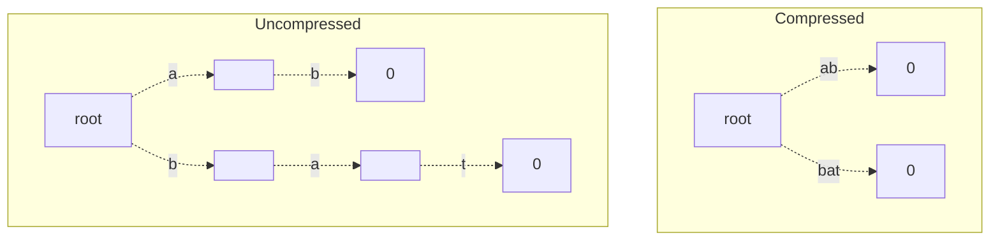

# Tries
## Structure
A **Trie** is a tree that is used to store strings. It does this by storing strings as paths within the tree, which can be traversed to see if a string exists or not!

To define a trie, we first need to specify an **alphabet $\Sigma$** the trie uses, which is a fixed set of characters. 
> For our purposes, we will use ASCII, which has 128 entries. Other alphabets, like UNICODE, have far more possible characters.

Then, every node in the trie will have the following:
- **Children Buffer**: A buffer of length equal to the size of the alphabet ($|\Sigma|$), where every index $i$ in this buffer contains a child if a string with that character, at position equal to the node's depth, has been stored.
- **Last Character Flag**: A flag indicating if the node is the last character of some string.

Tries have a wide variety of uses. Some of them are given as follows:
1. **Key-Value Stores**: We can replace node flags with values, to turn our trie into a key-value store! This is especially feasible due to the efficiency of insertion, search, and deletion.
2. **Prefix Search**: As tries group strings by prefix, we can perform a wide variety of string prefix operations with them!
3. **Globbing**: We can use glob patterns (ex. `file*`) to match a variety of strings in our trie! 

## Operations
### Searching for Strings
Given the Trie struction, we can use the presentation of nodes to determine if strings exist! To do this, we check to see there is a path matching the string, ending in a flagged node.

The general algorithm is as follows:
1. Start from the root node. Let index $i = 0$.
2. For every node $N$, use the string's $i^{th}$ character to move to the child corresponding to the character value (as given by the buffer indices). Increment $i$, repeat until no child can be found, or there exist no more characters in the string.
3. If the final node was flagged as being the last character of a string, then the string exists!

> [!Example]- Example: Trie Searching 
> For example, in the below tree, 
> 
> ```mermaid
> graph TD
>     root -. b .-> 2[ ];
>     root -. s .-> 3[0];
>     2 -. y .-> 4[0];
>     2 -. e .-> 5[0] -. e .-> 6[0];
> ```
> > Nodes with a $0$ are flagged as the last character of some string.
> 
> We can see that the strings `by`, `be`, `bee`, and `s` are being stored in this tree! 

Note from the above example how tries let us combine strings with common prefixes together, in a layout that is fairly memory efficient!

Given a search on a tree with $n$ keys, the worst-cast complexity for any string is given as:
- For all possible strings, the worst-case is the length of the longest key stored.
- For any single string $k$, the worst-case is the length of $k$.

This means that search complexity is completely independent of the trie size $n$!

### Insertion into Tries
Inserting into Tries is very similar to searching! We wish to form a path for the string, and make sure the end of the path is correctly flagged.

The general algorithm is as follows:
1. Start at the root node. Let index $i = 0$.
2. For every node $N$, use the string's $i^{th}$ character to find the child corresponding to the character value. If the child doesn't exist, create one.
3. Increment $i$, and repeat (2) until there are no more characters left in the string.
4. Finally, flag the node so that it terminates a string.

Note that by this algorithm, if we insert a prefix of an already existing string, we don't use any extra memory! This can make Tries fairly memory-efficient.

> [!Example]- Example: Trie Insertion
> Say we have the below tree, and we want to insert `see`.
> 
> ```mermaid
> graph TD
>     root -. b .-> 2[ ];
>     root -. s .-> 3[0];
>     2 -. y .-> 4[0];
>     2 -. e .-> 5[0] -. e .-> 6[0];
> ```
> 
> Then, we insert as follows.
> 
> ```mermaid
> graph TD
>     root -. b .-> 2[ ];
>     root -. s .-> 3[0];
>     2 -. y .-> 4[0];
>     2 -. e .-> 5[0] -. e .-> 6[0];
>     3 -. e .-> 7[ ] -. e .-> 8[0];
> ```

### Deletion from Tries
Because searching relies that the path ends with a flagged node, to delete a string from a trie, we simply need to unflag the last node of the string's path! 

The general algorithm is as follows:
1. Start at the root node. Let index $i = 0$.
2. For every node $N$, use the string's $i^{th}$ character to find the child corresponding to the character value. Increment $i$, and repeat until there are no more characters left in the string, or the child doesn't exist.
3. If we have used all characters in the string, unflag the last node. 

Note that while deleting, we don't actually remove nodes - and in fact, it's perfectly reasonable to never delete nodes, as we will likely use some to most of the prefixes later.

> [!Example]- Example: Trie Deletion
> Say we have the below tree, and we want to delete `bee`.  
> 
> ```mermaid
> graph TD
>     root -. b .-> 2[ ];
>     root -. s .-> 3[0];
>     2 -. y .-> 4[0];
>     2 -. e .-> 5[0] -. e .-> 6[0];
> ```
> 
> Then, we delete as follows.
>
> ```mermaid
> graph TD
>     root -. b .-> 2[ ];
>     root -. s .-> 3[0];
>     2 -. y .-> 4[0];
>     2 -. e .-> 5[0] -. e .-> 6[ ];
> ```

# Patricia Tries
## Motivation: Trie Compression
Given a trie, there can oftentimes be intermediate nodes, non-terminal nodes with only one child. These nodes waste a lot of space! 

To avoid this, it may be feasible in these cases to merge these intermediate nodes to avoid this wasted space! For example, we could merge the following trie as follows:



This is a lot more memory efficient, and is the motivation behind **Patricia Tries**!

## Structure
**Patricia Tries (Practical Algorithm to Retrieve Information Coded in Alphanumeric)** implement the above compression idea. It does this by by defining different node types within the tree.

Every node in a Pactricia Tree has the following:
- **Children Buffer**: A buffer containing pointers to the node's children.
- **Key Value**: The value of the key being stored within the node.
- **Terminating Flag**: A flag indicating if the node ends a string.

> [!Info] Binary Patricia Tries
> It is commonly the case that we restrict our alphabet to $0$ and $1$ in binary. In this case, we have a **Binary Patricia Trie**!

## Operations
### Patricia Trie Searching
Searching in a Patricia Trie is a bit more complex than your typical tree, as you need to account for nodes that store keys and nodes that are splitters.

The general algorithm is as follows. Suppose we have a string $S$:
1. Start from the root. 
2. For any given node $N$, check the key value of the node.
   - If the key value is a prefix of the string, remove it from the beginning of $S$.
   - Otherwise, string not found.
3. Using the children buffer, find the node's child at index equal to the value of the first character of the updated string $S$. Repeat step 2.
   - If there does not exist a child, the string does not exist.
4. If the string is empty after removing the key value, and the node is flagged, the string exists! 

> [!Example]- Example: Pactricia Tree Search
> ```mermaid
> graph TD
>     root[ ] -. a .-> 1[ab, 0];
>     root -. b .-> 2[back];
>     2 -. e .-> 3[ed 0];
> ```
> 
> Let's search for `backed`. We start at the root. Then,
> 1. The first character of `backed` is `b`, so we take the `b` child. We consume `back` to give us string `ed`.
> 2. The first character of `ed` is `e`, so we take the `e` child. We consume `ed` to give us an empty string.
> 3. Checking our node, it is flagged as a terminator. Thus, we found our string!

### Patricia Trie Insertion
Inserting in a Patricia Trie is more complicated than a traditional trie, as we now need to account for merged nodes.

The general algorithm is as follows. Suppose we want to insert $S$ into our tree. Then,
1. Search for $S$ into the tree. Continuously repeat (2) until our search succeeds.
2. If the search fails, then resolve by doing one of the following, and move to step 3.
   - **Case 1 (Null)**: If the next pointer is null, then allocate a new node for the remainder of $S$. Move to step 3 on this new node.
   - **Case 2 (Simple Split)**: If our new key is a prefix of the last node hit, split the node's key value from this prefix, and insert the prefix as a new parent of the node. Move to step 3 on this parent.
   - **Case 3 (Complex Split)**: If our new key shares a common prefix with the last node we hit, split both the key and the node's key value from this common prefix. 
   
       Then, create a new parent node with this common prefix, and add the original node and a new node with the key's remaining value as children. Move to step 3 on this new node.
3. When the search succeeds, then flag the node as terminating a string. Terminate.

See the below example, with a Binary Patricia Trie for simplicity.

> [!Example]- Example: Patricia Trie Insertion
> Nodes that are marked have rounded edges.
> 
> ```mermaid
> graph TD
>     root[ ] -.-> 1([001]) -.-> 2([00]);
>     root -.-> 3([11]) -.-> 4([01]);
>     3 -.-> 5[1100];
>     5 -.-> 6([0]) & 7([110001]);
> ```
> 
> Let us insert `0010`.
> 1. Start at the root. The first character of `0010` is `0`, so we move to the left. Consume `001` to get `0`. 
> 2. The first character `0` is `0`, so we move to the left. Attempting to consume `00` will fail.
>    - We see that both `00` in the node and `0` have a prefix of `0`, so we create a parent and flag it.
> 
> ```mermaid
> graph TD
>     root[ ] -.-> 1([001]) -.-> 2([0]) -.-> 8([0]);
>     root -.-> 3([11]) -.-> 4([01]);
>     3 -.-> 5[1100];
>     5 -.-> 6([0]) & 7([110001]);
> ```

### Patricia Trie Deletion
Deletion from a Patricia Trie is more complicated than a traditional trie.

The general algorithm is as follows. Suppose we're deleting a string $S$ from the tree.
1. Search for $S$ into the tree. If we fail, there's nothing to delete!
2. If we suceed, we perform one of the 3 cases:
   - **Case 1**: If the node has more than one child, unflag the node.
   - **Case 2**: If the node only has one child, merge it with the child.
   - **Case 3**: If the node has no children, delete it by removing its reference in the parent.
3. Then, check the parent. If the parent is unflagged and only has one child, then merge the parent with this child. 

> [!Example]- Example: Patricia Trie Deletion
> Nodes that are marked have rounded edges.
>
> ```mermaid
> graph TD
>     root[ ] -.-> 1([001]) -.-> 2([00]);
>     root -.-> 3([11]) -.-> 4([01]);
>     3 -.-> 5[1100];
>     5 -.-> 6([0]) & 7([110001]);
> ```
>
> Suppose we want to delete `11110011001`. Then, we move all the way to the bottom-right most node.
> 1. As the node has no children, delete the node.
>    ```mermaid
>    graph TD
>        root[ ] -.-> 1([001]) -.-> 2([00]);
>        root -.-> 3([11]) -.-> 4([01]);
>        3 -.-> 5[1100];
>        5 -.-> 6([0]);
>    ```
> 2. Now, as the node `1100` has only one child, we merge it with the child.
>    ```mermaid
>    graph TD
>        root[ ] -.-> 1([001]) -.-> 2([00]);
>        root -.-> 3([11]) -.-> 4([01]);
>        3 -.-> 5([11000]);
>    ```
