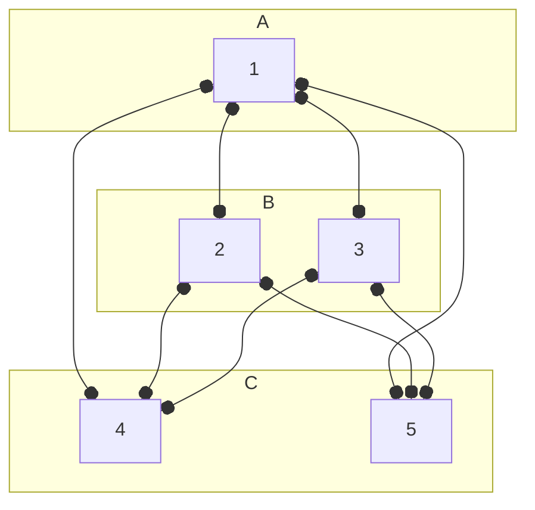

---
title: Graph Theory Research
tags:
- math475
--- 

# Section 5: Graph Theory Research
## 5.1: Ramsey Theory
We now color the **edges** of a complete graph $K_n$ by red or blue. How small can $n$ be so that ANY coloring of the graph creates all red or all blue subgraph that we desire? 
> What is the smallest possible complete graph I can choose for which this will occur?

The **Ramsey number** $R(s,t)$ is the **smallest** $N$ such that for any red-blue coloring of $K_N$, there exists an all-red $K_s$ or an all-blue $K_t$.

If $R(s,t) = N$, we must show
1. $K_{N-1}$ has the existence of a coloring with no red $K_r$ and no blue $K_t$. In other words, if we can show a coloring of $K_m$ with NO red $K_s$, blue $K_t$, then we find a lower bound $R(s,t) > m$.
2. For ANY edge coloring, there is a red $K_s$ or blue $K_t$. In other words, if you show that all colorings of $K_m$ has one of the structures, $R(s,t) \le m$.

> [!Example] 
> For $R(3,3)$,
> 
> ```mermaid
> graph LR
> 1 o--o 2 o--o 3 o--o 4 o--o 5 o--o 1;
> 1 o--o 4 o--o 2 o--o 5 o--o 3 o--o 1;
> ```
> 
> We find edge coloring
> - Blue: 1 to 2 to 3 to 4 to 5 to 1 
> - Red: 1 to 4 to 2 to 5 to 3 to 1
> 
> ```mermaid
> graph LR
> 1 o-. B .-o 2 o-. B .-o 3 o-. B .-o 4 o-. B .-o 5 o-. B .-o 1;
> 1 o-. R .-o 4 o-. R .-o 2 o-. R .-o 5 o-. R .-o 3 o-. R .-o 1;
> ``` 
> 
> Where there is no $K_3$ of red or blue! So, we know that $R(3,3) > 5$.
> 
> But if we added a vertex to make a $K_6$, we see that by the pidgeonhole principle, at least 3 of the 5 new edges are the same color, say red! 
> 
> ```mermaid
> graph LR
> 1 o-.-o 2 o-.-o 3 o-.-o 1;
> 6 o-. R .-o 1 & 2 & 3;
> 6 o--o 4 & 5;
> ``` 
> 
> So, to "avoid" making the edges between these destinations a red $K_3$, we have to make all of them blue, but that makes a blue $K_3$! So, $R(3,3) \le 6$. 
> 
> Given our lower and upper bound, we find $R(3,3) = 6$.

Some other values of the Ramsey Number are as given:
- $R(3,4) = 9$
- $R(4,4) = 18$
- $R(4,5) = 25$
- $R(5,5)$
  - $43 \le R(5,5) \le 49$ (1997)
  - $43 \le R(5,5) \le 48$ (2017)
  - $43 \le R(5,5) \le 46$ (2024)

> [!Abstract] Lemma
> 1. For events $A,B$,
>    $$
>    P(A \cup B) = P(A) + P(B) - P(A \cap B) \le P(A) + P(B)
>    $$
> 2. For $n \ge k$, $\binom{n}{k} \le \frac{n^k}{k!}$

> [!Abstract] Theorem
> For $a \ge 3$, 
> $$
> R(a,a) > 2^{\frac{a}{2}}
> $$
>
> In other words, it can be proven that we can always find a coloring in $K_{2^{a/2}}$ with no blue / red $K_a$.
>
> > [!Note]- Proof
> > 
> > We color a $K_N$ "randomly". For each edge, it has a 1/2 chance to be blue, 1/2 chance to be red.
> > 
> > For a subset of $a$ vertices, we have
> > $$
> > P (\text{All Red } K_a) = \frac{1}{2^\binom{a}{2}}
> > $$
> > > This is 1/2 raised to the power of $\binom{a}{2}$, the number of edges in $K_a$!
> > And furthermore,
> > $$
> > P (\text{All Red or all blue } K_a) = \frac{2}{2^\binom{a}{2}} = 2^{1 - \binom{a}{2}}
> > $$
> > > We simply add the probabilities together as they are disjoint.
> > 
> > Let $A_s$ be the event that a subset $S$ of vertices $|S| = a$, has its edges (of the induced clique $K_a$) colored all red or all blue. There are $\binom{N}{a}$ possible ways we can do this.
> > $$
> > \begin{align*}
> > P(\text{Red or Blue } K_a \text{ in a } K_N) 
> > &= P(\bigcup_{S \subseteq V(G), |S| = a} A_s) \\
> > &\le P(A_{S_1}) + P(A_{S_2}) + \dots + P(A_{S_{\binom{N}{a}}}) \\
> > &\le \binom{N}{a} P(A_S) = \binom{N}{a} 2^{1 - \binom{a}{2}} \le \frac{N^a}{a!} 2^{1 - \binom{a}{2}} \\
> > &\le \frac{2^{a^2 / 2}}{a!} 2^{1 - \binom{a}{2}} = \frac{2^{a^2 / 2}}{a!} 2^{1 - \frac{a(a-1)}{2}} \\
> > &\le \frac{1}{a!} 2^{1 + \frac{a}{2}} < 1
> > \end{align*}
> > $$
> > This ratio is always strictly less than 1! So, the probability that we get a red or blue $K_a$ in a $K_N$ will never be 100% guaranteed, meaning we can always find a coloring that does not have a red and blue $K_a$.

> [!Info] Remark
> In 2023, it was shown that
> $$
> R(a,a) \le (4 - \epsilon)^a
> $$

## 5.2: Turan's Theorem
What are the maximum edges that can be placed in a graph on $n$ vertices such that it contains no triangles ($K_3$)?

> [!Abstract] Theorem (Mantel)
> If $G$ contains no $K_3$, then $g$ can have at most 
> $$
> \lfloor \frac{n^2}{4} \rfloor
> $$
>
> With equality when $G$ is the complete bipartite graph on $\lfloor n/2 \rfloor, \lceil n/2 \rceil$

What about avoiding a $K_4$? $K_5$? $K_n$?

An **$r$-partite** grah is a graph whose vertices are partitioned into $r$ independent sets. The complete **$r$-partite graph** $K_{t, t_2, \dots t_r}$ is an $r$-partite graph such that any 2 vertices in different sets have an edge.


> An example of a complete $r$-partite graph.`

Since edges join among "$r$" parts, we cannot havae a $K_{r+1}$ subgraph.

Now consider $K_{t_1, t_2, \dots t_r}$ when the partitions are nearly the same size ($\lfloor n / r \rfloor, \lceil n / r \rceil$). This is the **Turan Graph $T_{n,r}$**.
> Basically, the complete bipartite graph where the sets are all as close in size as possible!

In a Turan graph, we can easily find the number of edges between the sets by multiplying their sizes. And intuitively, we can see that if our sets are almost equal in size, we're maximizing the number of edges we can have! This is the idea behind Turan's Theorem.

> [!Example] Example: Turan Graphs
> $K_{1,3,3}$ is NOT a Turan's graph, but $K_{2,2,3} \equiv T_{7,3}$

> [!Abstract] Theorem: Turan's Theorem
> Let $2 \le r \le n - 1$, $G$ be on $n \ge 3$ vertices.
> 
> The Turan graph $T_{n,r}$ does NOT contain a $K_{r+1}$ as a subgraph, and among all graphs, $T_{n,r}$ has the maximum edges, and it is the **unique** graph holding the property.
> 
> The graph has at most
> $$
> \frac{r - 1}{2r} n^2
> $$
> edges.
> > There are some cases where the exact value can vary a bit, because of how the number parts get divided by $r$! However, this is approximately the number of edges (with maybe a $\pm 1$ error).
>
> It's better to combinatorically compute the answer if asked for it. 
>
> > [!Note]- Proof
> > 
> > "Proofs From the Book" has 5 proofs for this result.
> >
> > By induction on $n$. For $n = 3$, it is easy to check.
> > 
> > Let $G$ be on $n + 1$ vertices, and assume the statement holds for all graphs on $n$ or fewer vertices. Clearly, $G$ has a $K_r$ subgraph, as otherwise we could've added more edges.
> > 
> > Let $A$ be the set of vertices inducing the $K_r$, and $B = V(G) / A$. So,
> > $$
> > |A| = r \qquad |B| = n + 1 - r
> > $$
> > 
> > We count edges in 3 cases: edges within $A$, edges within $B$, and edges between $A$ and $B$. 
> > - Clearly, the edges within $A$ is equal to $\binom{r}{2}$, being a $K_r$.
> >   $$
> >   e(A,A) = \binom{r}{2}
> >   $$
> > - Apply our inductive hypothesis on the graph induced by $B$ to obtain 
> >   $$
> >   e(B,B) \le \frac{r - 1}{2r} (n + 1 - r)^2
> >   $$
> > - For edges between, note that each vertex in $B$ can join to at MOST $r - 1$ vertices in $A$, as otherwise, we would form a $K_{r+1}$ violating our constraints.
> >   $$
> >   e(A,B) \le (r - 1) (n + 1 - r)
> >   $$
> > 
> > Adding these together, we find exactly our bound 
> > $$
> > e(A,A) + e(B,B) + e(A,B) \le \frac{r-1}{r^2} (n + 1)^2
> > $$
> > Edges.
> > 
> > > What we form is $A$, a $K_r$, and $B$, which is (at best) the Turan graph $T_{n+1-r, r}$. For each of the $r$ vertices in $A$, we turn $B$ into the Turan graph on $n + 1$ vertices by placing one of the vertices in each set, such that they connect to all other blobs.
> > > 
> > > This keeps all the blobs approximately balanced, keeping our number of edges optimal! Thus, we have a $T_{n+1, r}$, and a bound on the edges.

> [!Example]+ Example 
> What is the max number of edges in a graph on 9 vertices avoiding a $K_5$?
>
> We want to avoid a $K_5$, so $r + 1 = 5 \to r = 4$. The best way we can partition 9 into 4 sets is $2,2,2,3$, so we have total edges
> $$
> \binom{3}{2} (2^2) + 3 (6)
> $$
> > The first term is us choosing any 2 of the 3 2-size partite sets, who have 4 edges between each. The second term is us choosing any 1 of the 2-size partite sets, and finding 6 edges between the 3-set and the 2-set.

> [!Example] Example
> A circular town of radius 4 miles has 18 public phones. However, 2 can only communicate if they are less than 6 miles apart. Show that no matter where they are placed, at least 2 phones can each transmit to 5 other phones (which may NOT be the same).
>
> Define $G$ on 18 vertices, with edge $v_i \sim v_j$ if they are within 6 miles of each other. We claim that for any 4 phones, at least 2 can communicate with each other.
> > We can argue this geometrically. Any configuration of these phones, such that each is at least 6 miles from each other, cannot fit in the circle of radius 4!
>
> If this claim holds, then for any 4 vertices in $G$, there must exist an edge. So, $\bar{G}$ ($G$'s complement) cannot contain a $K_4$! So, by Turan's theorem on $\bar{G}$, we can have at most $\binom{3}{2} 36$ edges. This means that $G$ has at least 
> $$
> \binom{18}{2} - \binom{3}{2} 36 = 45
> $$
> edges, or in other words, $\sum \deg v_i \ge 90$.
>
> Now assume to the contrary that $G$ does NOT have at least 2 vertices of degree at least 5. Then, only one vertex has degree at least 5, all others at most 4, so $\sum \deg v_i \le 17 + 4(17) = 85$, which is a contradiction!
> > The one vertex with degree at least 5 can connect to all other vertices, and the rest can connect to at most 4.

What about the maximum edges avoiding a cycle, like $C_3$ or $C_4$? 
> Turan's theorem helps us answer the maximum number of edges avoiding a $K_3$, which is the same as a $C_3$.

> [!Abstract] Theorem: Cauchy-Schwarz
> Let $\vec{u},\vec{v} \in \mathbb{R}^n$, with $\vec{u}, \vec{v} \ne 0$. Then,
> $$
> \begin{align*}
> (\vec{u} \cdot \vec{v})^2 \le || \vec{u} ||^2 || \vec{v} ||^2 \\
> \left( \sum_{i=1}^n u_i v_i \right)^2 \le \sum_{i=1}^n u_i^2 \sum_{i=1}^n v_i^2
> \end{align*}
> $$
>
> With equality when $\vec{u}$ is a multiple of $\vec{v}$.

> [!Abstract] Theorem
> If $G$ has order $n \ge 3$ and size $m$, with no $C_3$ or $C_4$ subgraph, then 
> $$
> m \le \frac{n \sqrt{n-1}}{2}
> $$
> 
> > [!Note]- Proof
> > 
> > We find that in our graph, we cannot have any two vertices that is of distance 4 or more, as otherwise, we can always add an extra edge to get a $C_3$ or $C_4$.
> > 
> > Partition the $\binom{n}{2}$ pairs of vertices:
> > $$
> > \begin{align*}
> > C_1 = \{ \{x,y\} : \text{Distance 1} \} \\
> > C_2 = \{ \{x,y\} : \text{Distance 2} \} \\
> > C_3 = \{ \{x,y\} : \text{Distance 3} \} \\
> > \end{align*}
> > $$
> > It's hard to find $C_3$, so we will drop it for a "worse" bound. We now will count all pairs of vertices in $C_1, C_2$.
> > 
> > $$
> > \begin{align*}
> > |C_1| + |C_2| \le \binom{n}{2} \\
> > m + \sum_{i=1}^n \binom{d_i}{2} \le \binom{n}{2} \\
> > m + \sum_{i=1}{n} \frac{d_i (d_i - 1)}{2} \le \frac{n(n-1)}{2} \\
> > \sum_{i=1}^n d_i^2 \le n(n-1) + \sum_{i=1}^n d_i - 2m \\
> > \sum_{i=1}^n d_i^2 \le n(n-1)
> > \end{align*}
> > $$
> > > For $C_2$, we are choosing the "intermediate" vertex in every path, and choosing two edges that are incident to it! It's not possible to double count, as otherwise we'd get a $C_4$.
> > 
> > Now by Cauchy-Schwarz, with $u_i = d_i, v_i = 1$, we have
> > $$
> > \begin{align*}
> > (\sum u_i v_i)^2 \le \sum u_i^2 \sum v_i^2 \\
> > (\sum_{i=1}^n d_i)^2 \le (\sum_{i=1}^n d_i^2) * n \le n^2 (n-1) \\
> > (2m)^2 \le n^2 (n-1) \\
> > 2m \le n \sqrt{n-1} \\
> > m \le \frac{n \sqrt{n-1}}{2}
> > \end{align*}
> > $$

Some notes:
- Necessarily, $G$ must contain a $C_5$. 
- We had $|C_3| = 0$, meaning we assumed there were no vertices of distance 3. So, the diameter of the graph must be 2.
- $u_i = d_i, v_i = 1$, so equality in Cauchy-Schwarz implies that $G$ must be regular.

> [!Abstract] Theorem: Hoffman-Singleton
> If $G$ is $d$-regular, diameter 2, girth 5, with $\frac{n\sqrt{n-1}}{2}$ edges, then 
> $$
> d = 2, 3, 7, \text{(maybe)} \; 57
> $$
> > $d = 2$ is the $C_5$ graph, $d = 3$ is the Petersen graph, $d = 7$ is the Hoffman-Singleton graph, and $d = 57$ is yet to be solved.
