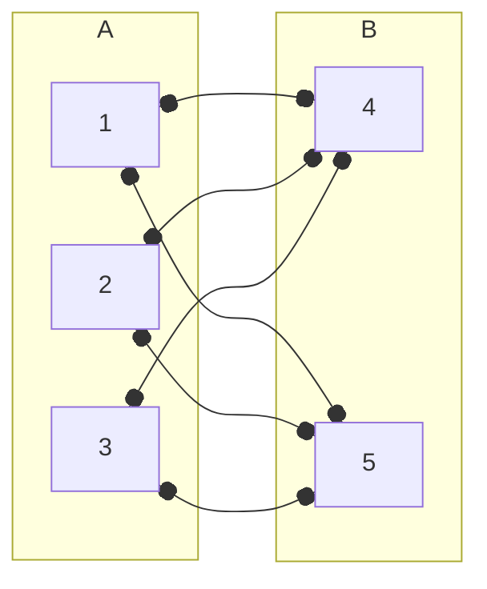
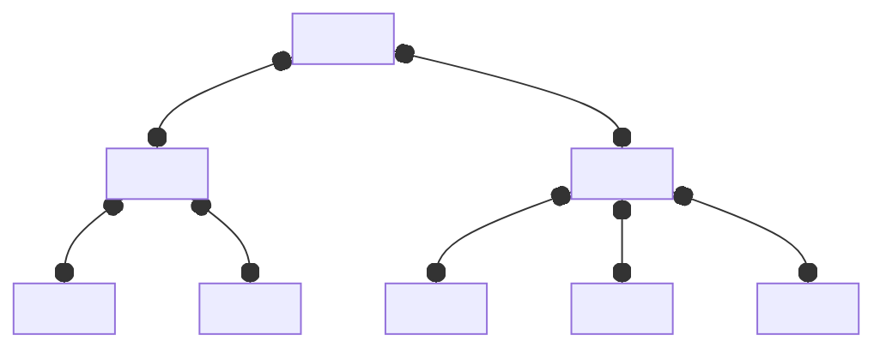
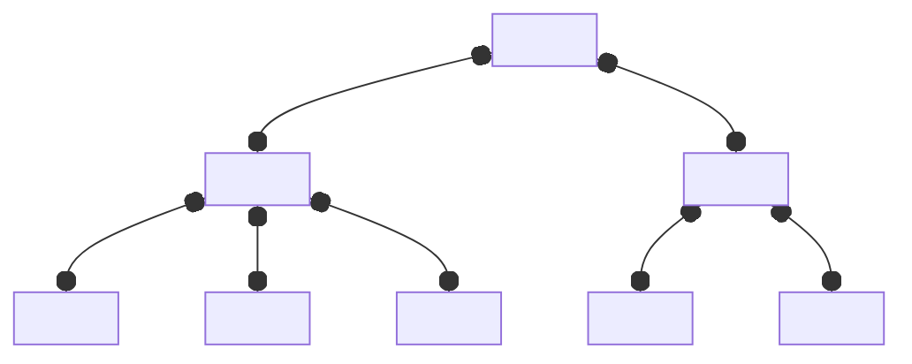

# Section 3: Graphs
## 3.1 - 3.3: Intro to Graphs, Graph Classes, and Vertex Degree
A **simple graph $G$** is an ordered pair $(V,E)$, where $V = V(G)$ is a set of vertices, and $E = E(G)$ is a set of edges, which are 2-size subsets of $V$.
- The number of vertices in the graph, $|V(G)|$, is the **order**.
- The number of edges of the graph, $|E(G)|$, is the **size**.

We say two vertices are **adjacent** if $\{v_1, v_2\} \in E$ (sometimes denoted $v_1 \sim v_2$). We say an edge is **incident** to a vertex if $v$ is one of the endpoints of the edge.

A graph $H$ us a **subgraph** of $G$ if $V(H) \subseteq V(G)$, and $E(H) \subseteq E(G)$. 
- $H$ is said to be a **spanning subgraph** of $G$ if $V(H) = V(G)$.
- $H$ is a **vertex induced subgraph** of $G$ if whenever, $u,v \in V(H)$, and $u,v \in E(G)$, then $u,v \in E(H)$. If $S = V(H) \subseteq V(G)$, the **subgraph induced by $S$** is denoted $G[S]$.

A **$uv$-walk** of a graph $G$ is a sequence of vertices beginning at $u$, ending at $v$, such that consecutive vertices are adjacent. We say the walk is **closed** if $u = v$. The total (non-unique) edges traversed is the **length** of the walk.
- A **trail** is a walk with no edge traversed more than once.
- A **path** is a walk with no vertex traverse more than once.

A **circuit** is a closed trail of length 3 or more. A **cycle** is a circuit with only the first and last vertex repeated. 

---

We say $G$ is **connected** if for any distinct vertices $u,v$, there exists a $uv$ path between them. Otherwise, $G$ is **disconnected**. A **component** of $G$ is a connected subgraph that is not a proper subgraph of any other connected subgraph (basically, each disconnected section of $G$).

The **complement** of $G$, denoted $\bar{G}$, has vertex set $V(\bar{G}) = V(G)$ and edge set
$$
E(\bar{G}) = \{ v_i \sim v_j : v_i \sim v_j \not\in E(G) \}
$$
> The graph with edges that are not present in $G$!

The **degree** of a vertex $v$, denoted $\deg{v}$, is the number of edges incident to $v$. The minimum degree of $G$ is denoted $\delta(G)$, and the maximum degree is denoted $\Delta(G)$.

> [!Abstract] Theorem
> For any simple graph $G$ with size $m$,
> $$
> \sum \deg{v} = 2m 
> $$
> The sum of the degrees must equal $2m$. 

---

A graph $G$ is **bipartite** if vertex set $V(G)$ can be partitioned into 2 subsets (partite sets) $A$ and $B$ such that every edge in $G$ has 1 endpoint in $A$ and 1 endpoint in $B$.

> [!Abstract] Theorem: Properties of Bipartite Graphs
> Graph $G$ is bipartite if and only if $G$ has no odd cycles.
>
> > [!Note]- Proof
> > 
> > #### Proof ($\rightarrow$)
> > Let $G$ have an odd cycle $v_1, v_2,  \dots v_{2k + 1}, v_1$. Without loss of generality, let $v_1 \in A$. Then, $v_2 \in B$, and so on and so forth such that $v_{2k+1} \in A$.
> > 
> > But $v_1 \sim v_{2k+1}$, so $G$ is not Bipartite.
> > 
> > #### Proof ($\leftarrow$)
> > Let $u \in V(G)$. Let 
> > $$
> > A = \{ w : d(u,w) = \text{even} \}
> > $$
> > The set of all points that are an even distance (shortest path) to $u$. Note that $u$ is contained within $A$.
> > 
> > Similarly, define
> > $$
> > B = \{ w : d(u,w) = \text{odd} \}
> > $$
> > We show that these are partite sets for a bipartite graph.
> > 
> > Assume to the contrary there are two adjacent vertices $w_1, w_2 \in B$, $w_1 \sim w_2$. Thus,
> > $$
> > d(u, w_1) = 2s + 1 \qquad d(u, w_2) = 2t + 1
> > $$
> > Suppose the (shortest paths) are 
> > $$
> > \begin{align*}
> > u = v_0, v_1, \dots v_{2s + 1} = w_1 \\ 
> > u = u_0, u_1, \dots u_{2t + 1} = w_2
> > \end{align*}
> > $$
> > Let $x$ be the last vertex these shortest paths share (could be $u$). Then, we must have $x = u_i = v_i$ at some point in the path. But this forces the rest of the paths to $w_1, w_2$ to have the same parity, creating an odd cycle from $x \to w_1 \to w_2 \to x$! This is a contradiction.

A bipartite graph with partite sets $A,B$, $|A| = a$, $|B| = b$ is called a **complete bipartite graph**, denoted $K_{a,b}$, if every vertex in $A$ is adjacent to every vertex in $B$.



A graph $G$ is **d-regular** if every vertex has degree $d = \delta(G) = \Delta (G)$, where $\delta(G)$ is the minimum degree and $\Delta (G)$ is the maximum degree. In other words, all vertices have the same degree.

> [!Abstract] Theorem: D-Regular Graphs
> There exists a d-regular graph on "n" vertices if and only if at least 1 $d$ or n$ is even.
>
> > [!Note]- Proof
> > 
> > #### Proof ($\rightarrow$)
> > By way of contradiction, assume that $n$ and $d$ are odd. Then,
> > $$
> > \sum_{v \in V} \deg(v) = dn = \text{odd}
> > $$
> > But the sum of the degrees is 2 times the number of edges, which is even. This is a contradiction!
> > 
> > #### Proof ($\leftarrow$)
> > Suppose first that $d = 2k$ is even.  Arrange our vertices cyclically, $v_0, v_1, \dots v_{n-1}$. Then for any $v$, we can join it (with an edge) to the $k$ preceding vertices, and $k$ succeeding vertices. We have a $d$-regular graph!
> > 
> > Now if $d = 2k + 1$, then $n$ is even. Arranging our vertices cyclically, for any $v$, we join it to the $k$ preceding and $k$ succeeding vertices, and also the vertex opposite $v$! Note that this is guaranteed to exist because $n$ is even.

> [!Abstract] Theorem:
> For any graph $G$, there exists a $\Delta$-regular graph $H$, such that $G$ is an **induced subgraph** of $H$.
> > An **induced subgraph** is a graph $H$ such that you can remove vertices (and all their edges) from $G$ and get the subgraph $H$! In other words, for any two vertices in $H$, if they have an edge, then that edge must also be present in $G$. 
>
> We do this as follows. For any graph, make a copy of it, and connect the respective vertices whose degree are less than $\Delta$. Continue making copies of that graph and connecting until all vertices have degree $\Delta$.

Given a graph on $v$ vertices, its **degree sequence** is a non-increasing sequence of length $n$ whose $i^{th}$ term is the degree of vertex $i$.

We ask, given an arbitrary degree sequence, when does such a graph exist?

> [!Abstract] Theorem: Existence of Degree Sequences
> Let $d_1, d_2, \dots d_n$ be a non-increasing sequence. Then, there is a simple graph (no loops, no multiple edges) with this degree sequence (we call the sequence **graphical**) if and only if the sequence $d_2 - 1, d_3 - 1, \dots, d_{d_1 + 1} - 1, d_{d_1 + 2}, d_{d_1 + 3}, \dots d_n$ is graphical. 
> > The second sequence we form is smaller! So, we can just keep repeating this algorithm down (and resorting) until our sequence is small enough that we can explicitly make a graph!
>
> > [!Note]- Proof
> > 
> > #### Proof ($\leftarrow$)
> > We simply add vertex $v$, and join it to the first $d_1$ vertices in the sequence. 
> > 
> > #### Proof ($\rightarrow$)
> > If $v_1$, $\deg (v_1) = d$ is adjacent to vertices all of which are the next highest degree, we are done (just delete $v_1$). But it isn't obvious if such a graph exists!
> > 
> > Assume to the contrary that no such graph exists, and among all graphs with this degree sequence, take the one whose sum of degrees of the vertices adjacent to $v_1$ is maximum. Then, there exists some vertex $v_s$ not coming from the highest $d_1$ degree vertices,
> > $$
> > s \not\in \{2,3, \dots d_1 + 1\}
> > $$
> > Adjacent to $v_1$ such that $\deg (v_s) < \deg (v_r)$, $r \in \{2,3, \dots d_1 + 1\}$.
> > 
> > Thus, $v_r$ must be adjacent to some vertex $v_t$ that $v_s$ is not adjacent to (as $v_s$ has lower degree). 
> > ```mermaid
> > graph LR
> > v1 o--o vs;
> > vr o--o vt
> > ```
> > 
> > If we swap the edges, our degree sequence doesn't change, but we have $v_r$ now connected to $v_1$!
> > ```mermaid
> > graph LR
> > v1 o--o vr;
> > vs o--o vt
> > ```
> > 
> > We can repeat this argument for any $v_s$, to find a graph where $v_1$ is adjacent to all vertices of the next highest degree. We are done!

> [!Example]+ Example: Existence of a Graph with Degree Sequences
> $$
> 3,3,3,2,1
> $$
> 
> Such a degree sequence has a graph if and only if the following sequence also has a graph. Remove the first term, and subtract 1 from the remaining terms up to the $d_1 + 1 = 4$th term. The rest are kept the same.
> $$
> 2,2,1,1
> $$
> Repeat this.
> $$
> 1,0,1
> $$
> It's possible to make a graph here! So, our degree sequence does has a graph. 
> 
> ```mermaid
> graph LR
> 1 o--o 2;
> 3;
> ```

## 3.4: Properties of Trees
A **tree** is a connected, acyclic (no cycles) graph. A **leaf** of a tree is a vertex of degree 1. A **forest** is an acyclic graph (a union of trees)

> [!Abstract] Theorem: Leaves of Trees
> A tree on at least 2 vertices has at least 2 leaves.
>
> > [!Note]- Proof
> > 
> > Take the path of longest length. Then, because the graph is acyclic, the vertices on either end must have degree 1, otherwise we could have made a longer path.

> [!Abstract] Theorem: Properties of Trees
> The following are equivalent:
> 1. $T$ is a tree on $n$ vertices.
> 2. $T$ is connected with $n - 1$ edges.
> 3. $T$ is acyclic with $n - 1$ edges.
> 4. There is a unique $uv$-path for any 2 distinct vertices $u$ and $v$.
> 
> > [!Note]- Proof
> > 
> > #### $1 \to 2, 1 \to 3$
> > We prove via induction on $n$. Clearly this holds for $n = 1$ with 0 edges. Assume the statement holds to some $n \ge 2$. 
> >
> > Let $G$ be a tree on $n + 1$ vertices. We know $G$ has a leaf $v$, so if we delete $v$ and all edges incident to $v$ ($G / v$), we now have a graph on $n$ vertices. Since this argument holds for $n$, we have a tree of $n$ on $n - 1$ edges. So, add $v$ back on to get a tree of $n + 1$ on $n$ edges (as $v$ is a leaf).
> >
> > #### $2 \to 3$
> > Assume the graph has cycles. Delete edges in each cycle so that $G$ remains conected. Now, $G$ is on fewer than $n - 1$ edges, but is acyclic and connected. This is a tree! But, we showed earlier that the tree must have $n - 1$ edges, which is a contradiction.
> >
> > #### $3 \to 1$
> > Let $C_1, C_2, \dots C_k$ be the components of $G$, and assume $C_i$ has $n_i$ vertices. Each $C_i$ is connected and acyclic, meaning each is a tree.
> > 
> > We know by $(1 \to 3)$ that each component must has $n_i - 1$ edges. So, we have
> > $$
> > \sum_{i=1}^k (n_i - 1) = n - k
> > $$
> > Thus, $k = 1$, so the graph is connected.
> >
> > #### $1 \to 4$
> > Assume there are 2 paths from $u$ to $v$. Let $w$ be the first vertex shared such that the vertex is different along the paths (this could even be $u$). Let $z$ be the first vertex the paths share again after $w$ (this could even be $v$). Note that these are different vertices by assumption that we have two different paths. 
> >
> > This creates a cycle in the graph, which is a contradiction!
> > > $4 \to 1$ has the same idea.

> [!Abstract] Theorem
> The minimum edges in a connected graph on $n$ vertices is $n - 1$.
>
> > [!Note] Proof (By Minimum Counterexample)
> >
> > > The idea of this is that if we could find a counterexample, then we can use it to find an even smaller counterexample-- repeating the argument, we find it's not possible to find a minimum counterexample.
> > 
> > Let $G$ be the smallest order graph that is connected on $m \le n - 2$ edges. It is easy to check $n \ge 4$. 
> > 
> > We claim that $G$ has a leaf. If not, then there are no vertices of degree 1, so every vertex must have at least degree 2.
> > $$
> > 2m = \sum_{v \in V(G)} \deg(v)
> > $$
> > But that means $m \ge n$, which violates our assumption of $m \le n - 2$!
> > 
> > If $v$ is the leaf, then $G / v$ is connected on $n - 1$ vertices with at most $n - 3$ edges. This contradicts the minimality of of $G$.

An edge $e$ is a **bridge** of a connected graph if $G / e$ (removing $e$) becomes disconnected.
> $G / e$ denotes the graph $G$ without the edge $e$.

> [!Abstract] Theorem
> An edge $e$ is a bridge if and only if the edge is not in a cycle.
>
> > **Corollary**: By this, all edges in a tree are bridges.

> [!Example] Example 
> Let $G$ be a tree of order 13. 
> 
> Suppose $G$ only has vertices of degree $1,2,5$. If $G$ has 3 vertices of degree 2, how many leaves does it have?
>
> Let $x$ be the number of leaves we have. Then,
> $$
> \begin{align*}
> 2 * (\text{Number Edges}) 
> &= 2 (13 - 1) = \sum_{v \in V(G)} \deg(v) \\
> &= 3(2) + x(1) + (13 - 3 - x) 5 \\
> 24 &= 56 - 4x \\
> x &= 8
> \end{align*}
> $$

## 3.5: Spanning Trees and Enumeration
> In this section, we look at many types of trees and try to determine the closed form count of them.

A **spanning tree** of $G$ is a tree $T$ such that
$$
V(G) = V(T), E(T) \subseteq E(G)
$$
In other words, all vertices are in the tree, but only enough edges are needed (to form a tree).

One question that we may ask is, how many spanning trees exist on $n$ vertices? In other words, how many spanning trees does $K_n$ have?
> This depends on if we label our tree or not!

> [!Example] Example
> Say $n = 3$. Then, for an unlabeled graph, we only have 1 tree. 
> > The first question is generally unsolved.
>
> ```mermaid
> graph LR
> 1[ ] o--o 2[ ] o--o 3[ ];
> ```
> 
> But for a labeled graph, we have 3 trees!
> 
> ```mermaid
> graph LR
> 1[1] o--o 2[2] o--o 3[3];
> 4[2] o--o 5[1] o--o 6[3];
> 7[1] o--o 8[3] o--o 9[2];
> ```

We say that two labeled trees are **different** if their edge set is different.

We construct a sequence of length $n - 2$ where each value is an element of $[n]$. Each sequence, called a **Prufer Code**, will correspond to a labeled tree on $n$ vertices

### Tree to Prufer Code
1. Delete the leaf of lowest index. Write down the index of the vertex **adjacent** to the leaf as part of the Prufer Code. 
2. Repeat until the graph reduces to an edge.

> [!Example]- Example: Tree to Prufer Code
> ```mermaid
> graph LR
> 1 o--o 2 o--o 6 o--o 5;
> 2 o--o 3 o--o 4;
> ```
> 1. Delete 1. Write down 2 as part of the code: $2$
> 2. Delete 4. Write down 3 as part of the code: $2,3$
> 3. Delete 3. Write down 2 as part of the code: $2,3,2$
> 4. Delete 2, write down 6. $2,3,2,6$
> 
> ```mermaid
> graph LR
> 6 o--o 5;
> ```
> We have one edge left so we stop. Our final code is $2,3,2,6$.

### Prufer Code to Tree
1. Let $a_1, a_2, \dots a_{n-2}$ be our code. Let $b_1$ be the smallest index not in the code. 
2. Create the edge with $a_1$ and $b_1$. 
3. Delete $a_1$ from the sequence and append $b_1$ to the end of the sequence.
4. Let $b_2$ be the smallest number not in the sequence $a_2, a_3, \dots a_{n-2}, b_1$.
5. Create the edge with $a_2$ and $b_2$. 
6. Repeat the above until we've deleted all of the orginal sequence's terms $a_1, \dots a_{n-2}$ so that our final sequence is $b_1, \dots b_{n-2}$.
7. Two values, $i$ and $j$, $1 \le i < j \le n$ will not be in the list $b_1, \dots b_{n-2}$. Create an edge joining $i$ to $j$.

> [!Example]- Example: Prufer Code to Tree
> $$
> 2,2,6,4
> $$
> 
> We have $a_1 = 2, b_1 = 1$. 
> ```mermaid
> graph LR
> 2 o--o 1
> ```
> Remove $a_1$, append $b_1$ to get $2,6,4,1$. Now, we have $a_2 = 2$, $b_2 = 3$.
> ```mermaid
> graph LR
> 3 o--o 2 o--o 1
> ```
> Remove $a_2$, append $b_2$ to get $6,4,1,3$. Now, we have $a_3 = 6$, $b_3 = 2$.
> ```mermaid
> graph LR
> 3 o--o 2 o--o 1;
> 2 o--o 6;
> ```
> Remove $a_3$, append $b_2$ to get $4,1,3,2$. Now, we have $a_4 = 4$, $b_4 = 5$.
> ```mermaid
> graph LR
> 3 o--o 2 o--o 1;
> 2 o--o 6;
> 4 o--o 5;
> ```
> Remove $a_3$, append $b_2$ to get $1,3,2,5$. We have consumed all of our original sequence. Note that in our sequence, we are missing 4 and 6. Connect these to finish. 
> ```mermaid
> graph LR
> 3 o--o 2 o--o 1;
> 2 o--o 6;
> 4 o--o 5 & 6;
> ```

### Cayley's Formula
> [!Abstract] Lemma
> If vertex $j$ has degree $d_j$, then index $j$ will appear exactly $d_j - 1$ times.

> [!Abstract] Theorem: Cayley's Formula
> Each Prufer Code corresponds to a unique tree. Thus, there are $n^{n-2}$ labeled trees on $n$ vertices $n - 2$ positions, $n$ choices for each).
>
> > [!Note] Proof
> > 
> > It can easily be shown that a tree corresponds to one unique code, as the algorithm given is unambiguous.
> > 
> > We must now show that each code corresponds to one tree, unambiguously. This establishes a bijection and proves our result.
> > 
> > By induction on $n$, the statement clearly holds for $n = 3$. Assume the statement holds up to some $n > 3$. Consider the sequence $a_1, a_2, \dots a_{n-1}$ ($n - 2 + 1$). We show this corresponds to a unique tree.
> > 
> > Let $x$ be the first deleted leaf, so $x \sim a_1$. Now consider the tree from deleting $x$. This must correspond to sequence $a_2, \dots a_{n-1}$, and as this is of length $n - 2$, we apply our inductive hypothesis to conclude that this tree is unique. Thus, our tree with $x$ must also be unique as there is only one place to put it.

> [!Info] Corollary
> It follows from this that because we know each vertex is in the sequence $d_j - 1$ times, we can find the number of trees by performing permutations by repetition on the sequence with a given vertex repeated $d_j - 1$ times.
> $$
> \frac{(n-2)!}{(d_1 - 1)! (d_2 - 1)! \dots (d_n - 1)!}
> $$

> [!Example] 
> Let $n = 6$. What is the number of trees with degrees $3,3,1,1,1,1$?
>
> Note that the labeling of the graph forces the vertices to have specific degrees.
>
> ```mermaid
> graph LR
> 1;2;3[ ];4[ ];5[ ];6[ ];
> 
> 1 o--o 2 & 3 & 4;
> 2 o--o 5 & 6;
> ```
> 
> Note that once we choose the indices adjacent to vertex 1, it determines the tree! So, we choose any 2 indices from $\{3,4,5,6\}$, to get $\binom{4}{2} = 6$ trees. 

A **plane-rooted tree** is a rooted tree (1 vertex is the root, often drawn at the top) with a left-right ordering of the children. 




> The following two rooted trees are different!

> [!Example] Example
> For $n = 4$, we have the number of rooted trees
> 
> ```mermaid
> graph TD
> 1[ ] o--o 2[ ] o--o 3[ ] o--o 4[ ];
> 5[ ] o--o 6[ ] o--o 7[ ] & 8[ ];
> 9[ ] o--o 10[ ] & 11[ ]; 10 o--o 12[ ];
> 13[ ] o--o 14[ ] & 15[ ]; 15 o--o 16[ ];
> 17[ ] o--o 18[ ] & 19[ ] & 20[ ];
> ```

What are the total plane rooted trees on $n + 1$ vertices? 

Consider a "walk" on the border of the tree, starting at the root, so that every edge is covered exactly twice, in a clockwise fashion. We are traversing the tree up or down such that the total times you move up can never exceed the times you move down! This is the same setup as the **Catalan Number** (discussed previously)!

So, the total plane rooted trees on $n + 1$ vertices is the $n^{th}$ Catalan number!

> [!Example] Example 
> How many binary trees have $n$ internal vertices and $n + 1$ leaves, with a left-right ordering? 
>
> For any $n$, note that the number of trees is equivalent to
> 
> ```mermaid
> graph TD
> 1[ ] o--o 2[a i] & 3[a n-i];
> ```
> 
> So,
> $$
> a_n = \sum_{i=0}^{n-1} a_i a_{n-1-i}
> $$
> 
> This is the recursive formula for Catalan Numbers!

A **rooted forest** is a forest where each component is a rooted tree, meaning one vertex is labeled as the root, and all vertices are labeled. 

> [!Example] Example: Rooted Forest
> For $n = 2$,
> 
> ```mermaid
> graph TD
> subgraph Graph1
> 1[1]; 2[2];
> end
> 
> subgraph Graph2
> 3[1] o--o 4[2];
> end
> 
> subgraph Graph3
> 5[2] o--o 6[1];
> end
> ```
> 
> Note that 2 and 3 are repeats, because we could choose 1 as the root, or 2 as the root.

Consider a rooted forest on $n$. 
- Take a new vertex, and for any rooted forest, join the vertex to all of the roots, to get a single labeled tree on $n + 1$. 
- For a labeled tree on $n + 1$, delete vertex $n + 1$. Then, the vertices adjacent to $n + 1$ give us a rooted forest. 

This is a bijection! 

> [!Abstract] Theorem
> The number of rooted forests on $n$ is equal to the number of labeled trees on $n + 1$. So, 
> $$
> (n + 1)^{n-1}
> $$

---

Suppose there are $n$ cars driving on a 1 way street. Each car has a favorite parking spot (n total spots). Some cars may share the same favorite parking spot.

Each car first drives to its favorite spot. It parks in the spot if possible. If not, it drives to the next open spot. For the $n$ parking preferences, how many preferences are good: every car can park?
> As an example, consider 3 cars. If they all prefer 2, then this is not good, since no car will park in spot 1.

Note that we have $n^n$ total cases.

We interpret each $n$-tuple as a function $f : \text{Car} \to \text{Spot Preference}$. A function that parks all of the cars is a **parking function**.

Consider a circular parking lot with $n + 1$ spots (and still $n$ cars). The cars park in the same manner, but now each continues looking for a spot even if they do not find one after spot $n$. Now, among the $n + 1$ preferences for each car, we have a parking function from the original problem exactly when spot $n + 1$ is empty!

Consider an n-tuple $(a_1, \dots a_n)$ which has spot $i$ open. 
$$
(a_1 + 1, a_2 + 1, \dots a_n + 1)
$$
Will leave spot $i + 1$ open! So, every spot has an equal chance of being empty! So the total parking functions (successful parking jobs) is
$$
\frac{1}{n+1} (n + 1)^n = (n+1)^{n-1}
$$
> Interestingly, this is the number of rooted forests on $n$ vertices!

> [!Abstract] Theorem: 
> The total parking functions with $n$ cars and $n$ spots is $(n+1)^{n-1}$ which equals the total rooted forests on $n$ vertices.
> 
> > [!Info] Brief Intuition
> > 
> > How are these related?
> > 
> > Well, the total parking functions with $n+1$ cars, $n+1$ spots
> > $$
> > P(n + 1) = \sum_{i=0}^n \binom{n}{i} (i+1) P(i) P(n-i)
> > $$
> > Which is the number of rooted forests on $[n+1]$.
> > 
> > Now, consider partitions forests into the component that vertex $n+1$ lies in. Pick with "i" indices will be in the component, in $\binom{n}{i}$ ways. Then, construct all of the forests with the $i$ vertices we've chosen. Connect the roots of these forests to $n+1$, and pick a vertex in $i+1$ ways to be the root. Then, create all possible forests of the remaining $n-i$ elements.

## 3.6: Matchings
A **matching** is a set of edges such that there are no shared points (vertices).

The vertices incident to edges of a matching $M$ are said to be **saturated**. Otherwise, they are **unsaturated**. If every vertex is saturated, we have a **perfect matching**.

The **size** of matching $M$, $|M|$ is equal to the number of edges. A matching is **maximal** if no more edges can be added to $M$. It is **maximum** if it is the largest cardinality among all matchings in the graph. 

> [!Example] Example: Maximal and Maximum Sets
> ```mermaid
> graph LR
> 1 o--o 2 o--o 3 o--o 4;
> ```
> 
> The matching $\{2 \sim 3\}$ is maximal, but not maximum.
> 
> The matching $\{1 \sim 2, 3 \sim 4\}$ is maximal and maximum!

Let $G$ be bipartite, with partite sets $A$ and $B$. For non-empty set $S \subseteq A$, the **neighborhood** of $S$, denoted $N(S)$, is the union of all neighborhoods of the vertices in $S$.
> Neighborhoods in non-bipartite sets exist too, but they may include the original set.

> [!Abstract] Hall's Marriage Theorem
> Suppose there are "r" women, "s" men, $1 \le r \le s$. There are "r" man-woman marriages if and only if for $k$, $1 \le k \le r$, any subset of $k$ women are compatible with at least $k$ men.
>
> Alternatively, let $A,B$ be partite sets, $|A| = r, |B| = s, 1 \le r \le s$. Then, $G$ has a matching that saturates $A$ if and only if $|N(S)| \ge |S|$ for all $S \subseteq A$.
>
> > [!Note]- Proof 
> > 
> > #### Proof ($\rightarrow$)
> > Given a matching saturates $A$. 
> > 
> > For any subset $S \subseteq A$, each vertex mataches to a distinct vertex in $B$, so $|N(S)| \ge |S|$.
> > 
> > #### Proof ($\leftarrow$)
> > Given $|N(S)| \ge |S|$, then $G$ has a matching saturating $A$.
> > 
> > Assume no matching saturates $A$.Let $u \in A$ be a vertex that is NOT saturated, and let $M$ be a maximum matching.
> > 
> > Let $A$ be the subset of vertices of $G$ such that there is a path to $u$ with edges alternating in $M$ and NOT in $M$ ($M$ alternating path).
> > 
> > We claim every vertex in $Z / \{u\}$ must be incident to an edge in $M$. From above, if a vertex was NOT incident to a vertex in $M$, we can toggle the edges and create a larger matching, but $M$ was maximum! 
> > 
> > Let $A' \subseteq A$ be the vertices in $Z$, and $B' \subseteq B$ also in $Z$. So, it follows that the cardinality of $A'$ is one larger than $B'$ because of $u$ not saturated!
> > $$
> > |A'| = |B'| + 1
> > $$
> > 
> > Let $b \in B'$. Since there is an alternating path from $u \to b$, there exists some $a \in A$ with $a \sim b$. Thus, $B'$ is in the neighborhood of $A'$. $B' \subseteq N(A')$
> > 
> > Now let $c \in N(A')$. Then, there exists a $a \in A'$ with $a \sim c$, and furthermore, there exists an alternating path from $u \to a$. We either add in $a \sim c$ to the path to create a path $u \to c$, or delete $a \sim c$ to create a $u \to c$. So, there is a $u \to c$ alternating path, so $c \in B'$. $N(A') \subseteq B'$.
> > 
> > So, we have $N(A') = B'$, so $|N(A')| = |B'| = |A'| - 1 < |A'|$.
> > 
> > There exists $A' \subseteq A$ such that $|N(A')| < |A|$.


> [!Example]+ Example
> ```mermaid
> graph LR
> 
> subgraph A 
> 1;2;3;
> end
> 
> subgraph B;
> 4;5;6;
> end
> 
> 1 & 2 & 3 o--o 4;
> 3 o--o 5 & 6;
> ```
> 
> Note that $N(\{1,2,3\}) = \{4,5,6\}$, so $|N(S)| \ge |S|$. But $N(\{1,2\}) = \{4\}$, so $1 = |N(S)| < |S|$. So, no matching can saturate $A$.
> 
> Thus, it is easier to use the theorem to **disprove** that a matching exists, by finding a $S \subseteq A$ where $N(S) < |S|$.

> [!Example] Example 
> Let $G$ be a $k$-regular bipartite graph. 
> 
> If $A,B$ are the partite sets, then the total edges is $K|A| = K|B|$, so the cardinality of the partite sets must be the same.
>
> Let $S \subseteq A$. Clearly, the total edges from $S$ to $N(S)$ is $m = K|S|$.
> 
> Then, the total edges from $N(S)$ to $S$ is at most $K |N(S)|$.
> 
> So, $K|S| = m \le K|N(S)|$ so, $|S| \le |N(S)|$ satisfies Hall's condition! **So, any $k$-regular bipartite graph as a matching saturating $A$, and furthermore, as $|A| = |B|$, this matching is perfect**. 

> [!Abstract] Theorem
> Any $k$-regular bipartite graph has a perfect matching.

We discuss ways we can apply Hall's Theorem. In general, we try to form partite sets with edges, and apply Hall's Theorem.

Let $A_1, A_2, \dots A_n$ be (not necessarily distinct) sets.

The collection of sets has a **system of distinct representatives (SDR)** if there are "n" **distinct** elements $a_1, \dots a_n$ such that
$$
a_i \in A \qquad \forall 1 \le i \le n
$$
> We create a bipartite set from this, and try to find a matching!

> [!Example]+ Example: SDRs
> $$
> A_1 = \{1,2,3\} \quad A_2 = \{1,2,3\} \quad A_3 = \{1,4\} \quad A_4 = \{1,5\}
> $$
> We can choose the following SDR: $1,2,4,5$.
> $$
> A_1 = \{\underline{1},2,3\} \quad A_2 = \{1,\underline{2},3\} \quad A_3 = \{1,\underline{4}\} \quad A_4 = \{1,\underline{5}\}
> $$

Recall that by Hall's Theorem, the matching saturates $A$ if for all $S \subseteq A$, $|N(S)| \ge |S|$. We can represent SDRs in terms of Hall's Theorem to obtain some important conclusions!

We naturally define a bipartite graph with 1 partite set with nodes representing $A_1, \dots A_n$, and the other set with nodes representing $a_1, a_2, \dots a_n$. We create an edge $A_i \sim A_j$ if and only if $a_j \in A_i$. 

Then by Hall's theorem, we have an SDR if and only if for any **union** of $k$ sets $A_1 \cup A_2 \dots A_k$, the cardinality is at least $k$.
> So to disprove an SDR, we can show the existence of $k$ sets such that the cardinality of their union is $< k$.

> [!Example] Example: Latin Squares
> A **Latin square** is an $n \times n$ array containing $n$ different symbols, each occurring exactly once in each row and column.
> 
> $$
> \begin{bmatrix}
> 1 & 2 & 3 \\
> 2 & 3 & 1 \\
> 3 & 1 & 2
> \end{bmatrix}
> $$
> 
> Say we are given an $m \times n$ Latin rectangle. We ask, when can this rectangle be "completed" to an $(m + 1) \times n$ Latin rectangle? ($m < n$)
> 
> Consider the partite sets 
> $$
> S_1 = \{ \text{n Distinct Symbols} \} \qquad 
> S_2 = \{ \text{Cell Values in Row m + 1} \}
> $$
> We $i \in S_1$ adjacent to $j \in S_2$ if and only if "i" can be placed in cell $j$. 
> - As there are m rows before row $m + 1$, we know that $m$ distinct symbols must have already been placed, so for any $j$ in $S_2$, it has $n - m$ edges to $S_1$. 
> - Furthermore, with 1 distinct symbol in $m$ rows, this leaves $n - m$ columns (cells) remaining to fill with that distinct symbol. So, for any $i \in S_1$, it has $n - m$ edges to $S_2$.
> 
> So in our partite sets, each element in either partite set has $n - m$ edges to the other set. Thus, our graph must be $n - m$ regular, and by an earlier example, every regular bipartite graph has a perfect matching. Thus, each cell in row $m + 1$ can be uniquely matched with a symbol.
> 
> Thus, its always possible to extend the rectangle down further and add an extra row!

> In a lot of these problems, we're trying to smartly construct a graph to get a $k$-regular bipartite graph! Then, we can apply Hall's Theorem.
