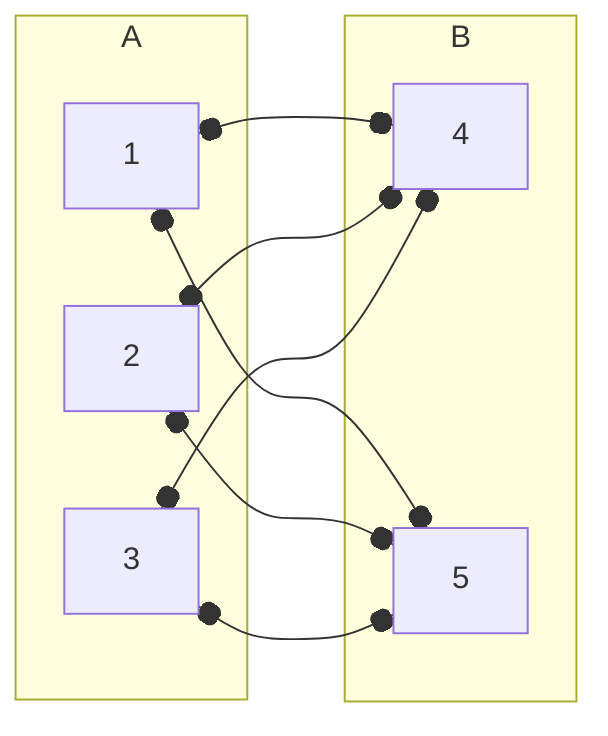
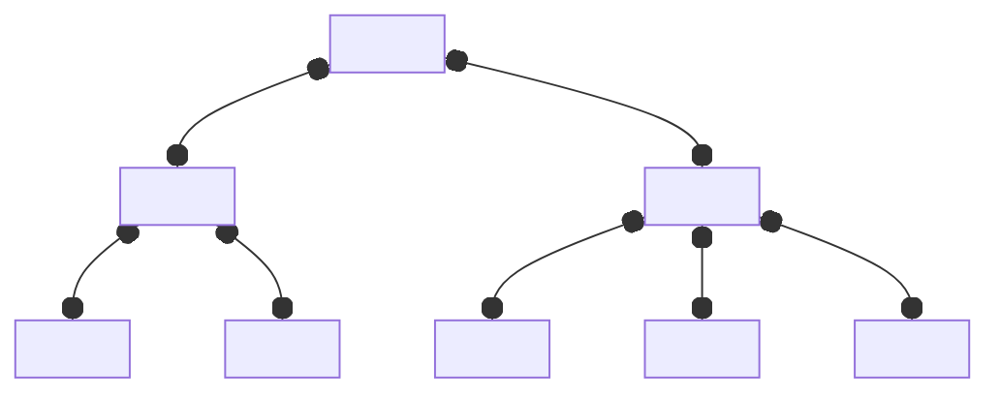
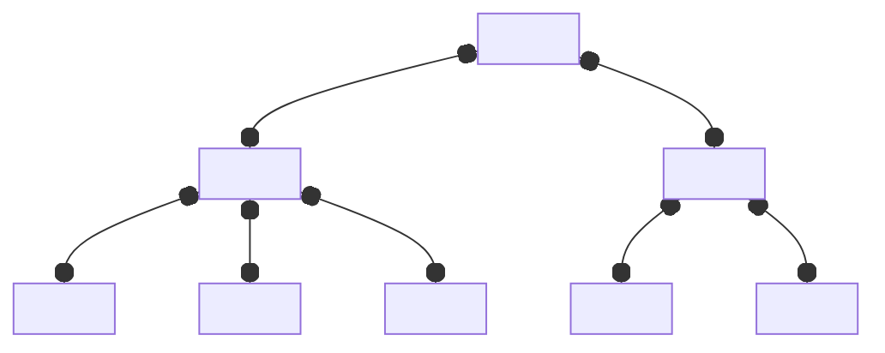

Combinatorics and graph theory

- [[Counting and Enumeration]]

---

# Section 2: Generating Functions
## 2.1, 2.2: Power Series Review, Intro to Ordinary Generating Functions
A **formal power series** is an infinite sum 
$$
\sum_{n=0}^\infty a_n x^n
$$
whose coefficients represent a sequence $\{a_n\}$.

The function $F(x) = \sum_{n=0}^\infty a_n x^n$ is the **ordinary generating function** of $\{a_n\}_{n=0}^\infty$, sometimes denoted the OGF.
> These functions are quite interesting! Oftentimes, we can manipulate these functions into something else that we can recognize.

> [!Example]+ Example: Ordinary Generating Functions of Sequences
> Let $\{a_n\}$ be given by
> $$
> \frac{1}{2!}, \frac{1}{3!}, \frac{1}{4!}, \dots
> $$
> 
> What is $F(x)$?
> 
> We can find $F(x)$ as
> $$
> \begin{align*}
> F(x) &= \frac{1}{2!} + \frac{1}{3!} x + \frac{1}{4!} x^2 + \dots \\
> &= \frac{1}{x^2} \left( \frac{1}{2!} x^2 + \frac{1}{3!} x^3 + \dots \right) \\
> &= \frac{1}{x^2} (e^x - x - 1)
> \end{align*}
> $$

> [!Example]+ Example: Sequences of Ordinary Generating Functions
> Find $\{a_n\}$ if the OGF is
> $$
> F(x) = \frac{-4x + 3}{(1 - x)(1 - 2x)}
> $$
> 
> Note that our denominator looks like the output of a geometric series, but as a product! So, we apply partial fractions to get separate geometric series.
> 
> $$
> \begin{align*}
> \frac{-4x + 3}{(1 - x)(1 - 2x)} 
> &= \frac{A}{(1 - x)} + \frac{B}{(1 - 2x)} \\ 
> -4x + 3 
> &= A (1 - 2x) + B(1 - x) \\
> A = 1&, B = 2
> \end{align*}
> $$
> 
> So, we get
> $$
> \begin{align*}
> F(x) 
> &= \frac{-4x + 3}{(1 - x)(1 - 2x)} = \frac{1}{1 - x} + \frac{2}{1 - 2x} \\
> &= \sum_{n=0}^\infty x^n + 2 \sum_{n=0}^\infty (2x)^n \\
> &= \sum{n=0}^\infty (1 + 2^{n + 1}) x^n
> \end{align*}
> $$
> So we find our sequence to be
> $$
> \{a_n\} = \{1 + 2^{n+1}\}
> $$

Given a **recurrence**, say $a_n = a_{n-1} + a_{n-2}$ (the fibonacci recurrence) where we are given a term in terms of the previous ones, we can obtain the closed form OGF, and then use a series expansion to get an explicit closed form formula for our sequence $\{a_n\}$. 

> [!Info] Lemma
> We have
> $$
> h(x) = 1 - x - x^2 = - \left( x + \frac{1 + \sqrt{5}}{2} \right) \left( x + \frac{1 - \sqrt{5}}{2} \right)
> $$
> Moreover, if $r_1 = \frac{1 + \sqrt{5}}{2}$, $r_2 = \frac{1 - \sqrt{5}}{2}$, then $r_2 = -\frac{1}{r_1}$.

> [!Example]- Example: Closed Form Fibonacci Sequence
> $$
> a_n = a_{n-1} + a_{n-2} \qquad a_0 = 0, a_1 = 1
> $$
> 
> Find a closed form ogf for the sequence, and find a closed form for $a_n$ with it.
> 
> Our goal is first to find the closed form OGF.
> 
> We first start with the ogf, and then apply our sequence definition to the $a_n$ term. Note that we need to take out the base case as the definition for $a_n$ is only defined for $n \ge 2$.
> $$
> \begin{align*}
> F(x) 
> &= \sum_{n=0}^\infty a_n x^n = 0 + 1x + \sum_{n=2}^\infty a_n x^n \\
> &= x + \sum_{n=2}^\infty (a_{n-1} + a_{n-2}) x^n \\
> &= x + \sum_{n=2}^\infty a_{n-1} x^n + \sum_{n=2}^\infty a_{n-2} x^n \\
> &= x + x \sum_{n=2}^\infty a_{n-1} x^{n-1} + x^2 \sum_{n=2}^\infty a_{n-2} x^{n-2}
> \end{align*}
> $$
> We can use this to express $F(x)$ as a function of itself. Note that the first summation is $F(x)$ without the $a_0$ term, and the second summation is just $F(x)$.
> $$
> \begin{align*}
> F(x)
> &= x + x \sum_{n=2}^\infty a_{n-1} x^{n-1} + x^2 \sum_{n=2}^\infty a_{n-2} x^{n-2} \\
> &= x + x (F(x) - a_0) + x^2 F(x) \\
> &= x + x F(x) + x^2 F(x) \\
> F(x)
> &= \frac{x}{1 - x - x^2}
> \end{align*}
> $$
> We have found a closed form ogf. We can now use this to find our closed form sequence. We do this by applying partial fraction decomposition and converting the result into a geometric series.
> > Here, we apply our lemma.
> $$
> \begin{align*}
> F(x)
> &= \frac{x}{1 - x - x^2} \\
> &= \frac{-x}{\left( x + \frac{1 + \sqrt{5}}{2} \right) \left( x + \frac{1 - \sqrt{5}}{2} \right)} \\
> &= \frac{-x}{(x + r_1) (x + r_2)} = \frac{A}{x + r_1} + \frac{B}{x + r_2} \\
> &= \frac{-1}{\sqrt{5}} \left( \frac{r_1}{x + r_1} - \frac{r_2}{x + r_2} \right) \\
> &= \frac{1}{\sqrt{5}} \left( \frac{r_2}{x + r_2} - \frac{r_1}{x + r_1} \right) \\
> &= \frac{1}{\sqrt{5}} \left( \frac{1}{1 - (-x / r_2)} - \frac{1}{1 - (-x / r_1)} \right) \\ 
> &= \frac{1}{\sqrt{5}} \left( \sum_{n=0}^\infty (r_2 x)^n - \sum_{n=0}^\infty (r_1 x)^n \right) \\
> &= \sum_{n=0}^\infty \frac{1}{\sqrt{5}} (r_2^n - r_1^n) x^n 
> \end{align*}
> $$
> We've found our closed form sequence!
> $$
> \{a_n\} = \frac{1}{\sqrt{5}} (r_2^n - r_1^n) =  \frac{1}{\sqrt{5}} \left( \left( \frac{1 - \sqrt{5}}{2} \right)^n - \left(  \frac{1 + \sqrt{5}}{2} \right)^n \right)
> $$

> [!Example]- Example: Solving Recurrence Relations
> Consider codes of length $n$ using $A,B,C,D$. Let $a_n$ denote the total codes with an even number of $A$'s. 
> 1. Find a recurence of $a_n$ in terms of $a_{n-1}$
> 2. Find a closed form ogf.
> 3. Find a closed form for $a_n$.
> 
> We first find a recurrence. If we have $n - 1$ length strings, we could add a $B,C,D$ to get a $n$ length string. Or, with $n - 1$ length strings, we need an odd number of $A$'s to add an extra $A$ onto, which we can find as all strings minus the even ones.
> $$
> a_n = a_{n-1} + a_{n-1} + a_{n-1} + (4^{n-1} - a_{n-1}) = 2a_{n-1} + 4^{n-1}
> $$
> We now need to find our base case. Clearly, $a_1 = 3$, as the string can only be a $B,C,D$. So, $a_0 = 1$.
> 
> We now use our recurrence to find a closed form ogf.
> $$
> \begin{align*}
> F(x) 
> &= \sum_{n=0}^\infty a_n x^n = 1 + \sum_{n=1}^\infty a_n x^n \\
> &= 1 + \sum_{n=0}^\infty (2a_{n-1} + 4^{n-1}) x^n \\
> &= 1 + 2 \sum_{n=1}^\infty a_{n-1} x^n + \sum_{n=1}^\infty 4^{n-1} x^n \\
> &= 1 + 2 x \sum_{n=1}^\infty a_{n-1} x^{n-1} + x \sum_{n=1}^\infty 4^{n-1} x^{n-1} \\
> &= 1 + 2 x \sum_{n=1}^\infty a_{n-1} x^{n-1} + x \sum_{n=1}^\infty 4^{n-1} x^{n-1} \\
> &= 1 + 2x F(x) + x \frac{1}{1 - 4x} \\
> F(x) 
> &= \frac{1}{1 - 2x} \left(1 + \frac{x}{1 - 4x} \right) \\
> &= \frac{1}{1 - 2x} + \frac{x}{(1 - 4x) (1 - 2x)}
> \end{align*}
> $$
> 
> We now use our closed form ogf to find a closed form sequence.
> $$
> \begin{align*}
> F(x) 
> &= \frac{1}{1 - 2x} + \frac{x}{(1 - 4x) (1 - 2x)} \\
> &= \frac{1}{2(1 - 2x)} + \frac{1}{2(1 - 4x)} \\
> &= \frac{1}{2} \sum_{n=0}^\infty (2x)^n + \frac{1}{2} \sum_{n=0}^\infty (4x)^n \\
> &= \sum_{n=0}^\infty \frac{1}{2} (2^n + 4^n) x^n
> \end{align*}
> $$
> We found our closed form solution as
> $$
> \{a_n\} = \left\{ \frac{1}{2} (2^n + 4^n) \right\}
> $$


--- End of Exam 1 Content ---

## 2.3: Ordinary Generating Functions and Counting
What if $a_n$ is a combinatorial value, like $S(n,k)$? Well, using our techniques, we can actually find the closed form solution of $S(n,k)$ (at least in some cases)!

We describe various combinatorial objects that can be used to solve counting problems.

### Weak Compostions with Contraints
We have 
$$
\frac{1}{1-x} = \sum_{n=0}^\infty x^n
$$
Differentiating this, we get
$$
\begin{align*}
&\frac{1}{(1-x)^2} = \sum_{n=1}^\infty n x^{n-1} = 1 + 2x + 3x^2 + \dots = \sum_{n=0}^\infty (n+1) x^n \\
&\frac{2}{(1-x)^3} = \sum_{n=2}^\infty (n-1) x^{n-2} = \sum_{n=0}^\infty (n+2)(n+1) x^n \\
&\vdots
\end{align*}
$$
Generalizing this, we find that at the $m^{th}$ derivative,
$$
\begin{align*}
\frac{m!}{(1-x)^{m+1}} 
&= \sum_{n=0}^\infty (n+m)(n+m-1) \dots (n+1) x^n \\
&= \sum_{n=0}^\infty \frac{(n+m)!}{n!} x^n \\
\frac{1}{(1-x)^{m+1}}
&= \sum_{n=0}^\infty \frac{(n+m)!}{n! m!} x^n = \sum_{n=0}^\infty \binom{n+m}{m} x^n
\end{align*}
$$
Letting $m = k - 1$, we find 
$$
\frac{1}{(1-x)^k} \sum_{n=0}^\infty \binom{n+k-1}{k-1} x^n
$$
Now observe that
$$
\frac{1}{(1-x)^k} = \left( \frac{1}{1-x} \right)^k = (1 + x + x^2 + \dots) (1 + x + x^2 + \dots) \dots
$$
We can find that the coefficient of any $x^n$ is $\binom{n+k-1}{k-1}$! And in fact, our disgusting product can actually just be seen as all possible ways we can choose $x^{n_1}$ in group 1, $x^{n_2}$ in group 2, ... $x^{n_k}$ in group $k$ where 
$$
x^{n_1} x^{n_2} \dots x^{n_k} = x^{n_1 + n_2 + \dots n_k} = x^n
$$
Which is in fact weak compositions! With this relation, we can actually solve any weak composition problem (with any constraints)! 
> Each exponent represents one "dollar" we can give, and each series represents one entity we could give dollars to, where the series depends on the constraints we have!

> [!Example]+ Example: Model for Solving Weak Compositions
> Find the ordinary generating function and state the coefficient that would count the total ways to distribute $100 to 4 kids so that kid 1 gets at most 5 dollars, kid 2 gets at least 3 dollars, kid 3 gets an even number of dollars, and kid 4 gets any amount.
> 
> We want the coefficient of $x^{100}$ such that
> $$
> (1 + x + x^2 + x^3 + x^4 + x^5) (x^3 + x^4 + x^5 + \dots ) (1 + x^2 + x^4 + \dots) (1 + x + x^2 + x^3 + \dots)
> $$
> Each series is given in terms of the ways we can give dollars to each of the kids. For example because kid 2 gets at least 3 dollars, the series is $x^3, x^4, \dots$ as when we make a "choice" in our product, the exponent (dollars) we wantt to select for kid 2 must be 3 or more. 
>
> Its hard to solve this by hand, but we could easily solve this by a computer!

### Stirling Numbers 
> [!Abstract] Theorem: OGF for Stirling Numbers
> Let $k$ be a fixed positive integer. Then the OGF for $\{a_n\} = \{S(n,k)\}$ is
> $$
> F_k (x) = \sum_{n=0}^\infty a_n x^n = \frac{x^k}{(1-x)(1-2x) \dots (1-kx)}
> $$
>
> > [!Note]- Proof
> > 
> > Recall that
> > $$
> > S(0,0) = 1 \qquad S(n,0) = S(0,k) = 0 \qquad S(n,k) = S(n-1,k-1) + kS(n-1, k)
> > $$
> > 
> > Then, $F_k (x) = \sum a_n x^n = \sum_{n=0}^\infty S(n,k) x^n$. We solve for a closed form solution.
> > $$
> > \begin{align*}
> > \sum_{n=0}^\infty S(n,k) x^n 
> > &= \sum_{n=0}^\infty (S(n-1,k-1) + kS(n-1, k)) x^n \\
> > &= \sum_{n=1}^\infty S(n-1,k-1) x^n + \sum_{n=1}^\infty kS(n-1, k) x^n \\
> > &= x \sum_{n=1}^\infty S(n-1,k-1) x^{n-1} + x k\sum_{=1}^\infty S(n-1, k) x^{n-1} \\
> > &= x F_{k-1} (x) + x kF_k (x)
> > \end{align*}
> > $$
> > This yields us a recursion of $F_k$ in terms of $F_{k-1}$.
> > $$
> > F_k (x) = \frac{x F_{k-1} (x)}{1-kx}
> > $$
> > So, if I repeat this recursion, I will get my definition above!
> > $$
> > F_k (x) = \frac{x}{1-kx} F_{k-1} = \frac{x}{1-kx} \frac{x}{1-(k-1)x} F_{k-2} = \dots = \frac{x^k}{(1-x)(1-2x) \dots (1-kx)}
> > $$

### Integer Partitions
> [!Abstract] Theorem: 
> The OGF for the total integer partitions of $n$, $p(n)$, is
> $$
> F(x) = \sum_{n=0}^\infty p(n) x^n = \frac{1}{(1-x)(1-x^2)(1-x^3)\dots} = \prod_{k=1}^\infty \frac{1}{1-x^k}
> $$
>
> > [!Note]- Proof (Sketch)
> > 
> > $$
> > \begin{align*}
> > F(x) 
> > &= \frac{1}{1-x} \frac{1}{1-x^2} \frac{1}{1-x^3} \dots \\
> > &= (1 + x + x^2 + \dots) (1 + x^2 + x^4 + x^6 + \dots) (1 + x^3 + x^6 + x^9 + \dots)
> > \end{align*}
> > $$
> > Notice that each product gives us multiples of $k$, and if we select one of them, we are choosing the number of $k$'s we want in our integer partition! For example, if we chose $x^6$ in our $k = 2$ product (2nd one), we are choosing $2 + 2 + 2$, or in other words, 3 integers of 2! So,
> > 1. Group 1 relates to how many 1s are in the sum
> > 2. Group 2 relates to how many 2s are in the sum
> > 3. ...
> > 
> > More generally, the $k^{th}$ group in the ogf is given as
> > $$
> > 1 + x^k + x^{2k} + \dots + x^{t(k)} + \dots
> > $$
> > Where the term $x^{k(t)}$ which represents us choosing the "$t$" number of $k$'s to the integer partition of $n$.

> [!Example]+ Example: Integer Partitions
> How many ways can you make \$1 using any number of pennies, nickels, dimes, quarters, and half dollars?
>
> We can formulate this as the following OGF, where we are looking for the coefficient of $x^{100}$.
> 
> $$
> \begin{align*}
> &(1 + x + x^2 + \dots) (1 + x^5 + x^{10} + \dots) (1 + x^{10} + x^{20} + \dots) \\
> &\qquad (1 + x^{25} + x^{50} + \dots) (1 + x^{50} + x^{100} + \dots)
> \end{align*}
> $$
> 
> By computer, we get 292.
> > Same as in weak compositions, with such a model, we can now manipulate this expression for any constraints! Say, if we wanted to use at least 5 pennies, we could replace the first group with $(x^5 + x^6 + \dots)$!

> [!Abstract] Theorem: Distinct Integer Partitions
> The total ways to partition integer $n$ into parts where every number is distinct equals the total ways to partition integer $n$ where each part is an odd number.
> 
> > [!Note]- Proof
> >
> > The ogf for partitions into **distinct parts** is
> > $$
> > F(x) = (1 + x) (1 + x^2) (1 + x^3) \dots
> > $$
> > 
> > As this ensures we choose any integer at most once. We change them using difference of squares.
> > $$
> > \begin{align*}
> > &= \frac{1-x^2}{1-x} \frac{1-x^4}{1-x^2} \frac{1-x^6}{1-x^3} \dots \\
> > &= \frac{1}{(1-x) (1-x^3) (1-x^5) \dots} \\
> > &= (1 + x + x^2 + \dots) (1 + x^3 + x^6 + \dots) (1 + x^5 + x^10 + \dots) \dots
> > \end{align*}
> > $$
> > 
> > This is the ogf for integer partitions of odd integers!

> [!Example]+ Example: Distinct Integer Partitions
> $n = 6$. The distinct integer partitions vs. the odd integer partitions are given as
> $$
> \begin{align*}
> 6 = 2 + 4 = 1 + 5 = 1 + 2 + 3 \\
> 1 + 1 + 1 + 1 + 1 + 1 = 1 + 5 = 3 + 3 = 1 + 1 + 1 + 3
> \end{align*}
> $$
> Both have 4 cases!

## Integer Partitions into $k$ Parts
> [!Abstract] Theorem: Integer Partitions into $k$ Parts
> The OGF for $p_k (n)$, the ways to partition $n$ into exactly $k$ parts, is given as
> $$
> \begin{align*}
> F(x)
> &= (1 + x + x^2 + \dots) (1 + x^2 + x^4 + \dots) \dots \\ 
> &\qquad (1 + x^{k-1} + x^{2k-2} + \dots) (x^k + x^{2k} + \dots) \\
> &= (1 + x + x^2 + \dots) (1 + x^2 + x^4 + \dots) \dots (1 + x^k + x^{2k} + \dots) x^k
> \end{align*}
> $$
>
> > [!Note]- Proof / Intuition
> > 
> > First, we find the ogf for the partitions of integer $n$ into parts with size at most $k$. To do this, we stop our product at the $k^{th}$ term.
> > $$
> > F(x) = (1 + x + x^2 + \dots) (1 + x^2 + x^4 + \dots) \dots (1 + x^k + x^{2k} + \dots)
> > $$
> > 
> > If we look at a Ferrers diagram, we find that the conjugate of this is integer partitions into at most $k$ parts!
> > 
> > Then, with this, we can get integer partitions into exactly $k$ parts by subtracting partitions of at most $k - 1$ parts from partitions of at most $k$ parts.
> > > We can also think of this as, to force exactly $k$ parts, we must always choose 1 part to be of size $k$! This way, when we take the conjugate, we will have exactly $k$ parts.
> > $$
> > \begin{align*}
> > F(x) 
> > &= (1 + x + x^2 + \dots) (1 + x^2 + x^4 + \dots) \dots (1 + x^k + x^{2k} + \dots) \\
> > &\qquad - (1 + x + x^2 + \dots) (1 + x^2 + x^4 + \dots) \dots (1 + x^{k-1} + x^{2k-2} + \dots) \\
> > &= (1 + x + x^2 + \dots) (1 + x^2 + x^4 + \dots) \dots \\ 
> > &\qquad (1 + x^{k-1} + x^{2k-2} + \dots) (x^k + x^{2k} + \dots)
> > \end{align*}
> > $$


## 2.4: Exponential Generating Functions
The **exponential generating function** for sequence $\{a_n\}$ is
$$
F(x) = \sum_{n=0}^\infty a_n \frac{x^n}{n!}
$$

> [!Info] Lemma: Product of OGFs
> Let $f(x) = \sum_{n=0}^\infty a_n x^n$, $g(x) = \sum_{n=0}^\infty b_n x^n$. Then,
> $$
> f(x) g(x) = \sum_{n=0}^\infty c_n x^n
> $$
> Where $c_n = \sum_{i=0}^n a_i b_{n-i}$.

> [!Info] Lemma: Product of EGFs
> Let 
> $$
> F(x) = \sum_{n=0}^\infty \bar{a}_n \frac{x^n}{n!} \qquad G(x) = \sum_{n=0}^\infty \bar{b}_n \frac{x^n}{n!}
> $$
>
> Then, 
> $$
> F(x) \cdot G(x) = \sum_{n=0}^\infty \bar{c}_n \frac{x^n}{n!}
> $$
> Where $\bar{c}_n = \sum_{i=0}^n \binom{n}{i} \bar{a}_i \bar{b}_{n-i}$
>
> What's important about this is that $\bar{c}_n$ gives us the total ways to separate $[n]$ into two blocks, such that we do a task in $\bar{a}_i$ ways to block 1, and a task in $\bar{b}_{n-i}$ ways to block 2! This can be used to solve more problems.
>
> > [!Note]- Proof 
> > 
> > Recall that if $A(x) = \sum a_n x^n, B(x) = \sum b_n x^n$, then $A(x) \cdot B(x) = \sum c_n x^n$, $c_n = \sum_{i=0}^n a_i b_{n-i}$.
> > 
> > Let $a_n = \bar{a}_n / n!, b_n = \bar{b}_n / n!$ to get our lemma.

> [!Abstract] Theorem: EGFs for Stirling Numbers
> The egf for the Stirling Number $S(n,k)$ (for fixed $k > 0$) is given as
> $$
> F(x) = \sum_{n=0}^\infty S(n,k) \frac{x^n}{n!} = \frac{(e^x - 1)^k}{k!}
> $$
>
> > [!Note]- Proof
> > 
> > Recall that
> > $$
> > \begin{align*}
> > S(n,k) 
> > &= \frac{1}{k!} \sum_{i=0}^k (-1)^i \binom{k}{i} (k - i)^n \\
> > F(x) 
> > &= \sum_{n=0}^\infty \left[ \frac{1}{k!} \sum_{i=0}^k (-1)^i \binom{k}{i} (k - i)^n \right] \frac{x^n}{n!} \\
> > &= \frac{1}{k!} \sum_{i=0}^k \left[ (-1)^i \binom{k}{i} \sum_{n=0}^\infty \frac{(k-i)^n x^n}{n!} \right] \\
> > &= \frac{1}{k!} \sum_{i=0}^k \left[ (-1)^i \binom{k}{i} e^{(k-i)x} \right] \\
> > &= \frac{1}{k!} (e^x - 1)^k
> > \end{align*}
> > $$

From this theorem, we can find that the egf for the bell number is
$$
F(x) = \sum B(n) \frac{x^n}{n!} = e^{e^x - 1}
$$

> [!Note]- Proof
> $$
> \begin{align*}
> F(x)
> &= \sum_{n=0}^\infty B(n) \frac{x^n}{n!} \\
> &= \sum_{n=0}^\infty \left[ \sum_{k=0}^n S(n,k) \right] \frac{x^n}{n!} \\
> &= \sum_{n=0}^\infty \left[ \sum_{k=0}^n S(n,k) \frac{x^n}{n!} \right] \\
> &= \sum_{k=0}^\infty \frac{1}{k!} [e^x - 1]^k \\
> &= e^{e^x - 1}
> \end{align*}
> $$

But why are egfs useful? Well, let's consider the product
$$
(1 + x + \frac{x^2}{2!} + \dots) (1 + x + \frac{x^2}{2!} + \dots) (1 + x + \frac{x^2}{2!} + \dots)
$$

Then, we can find the contribution to $x^n / n!$ as
$$
\frac{x_1^{s_1} x_2^{s_2} x_3^{s_3}}{s_1! s_2! s_3!} \qquad s_1 + s_2 + s_3 = n
$$
Thus, the $x^n / n!$ term is
$$
\left( \sum_{s_1 + s_2 + s_3 = n} \frac{n}{s_1! s_2! s_3!} \right) \frac{x^n}{n!}
$$
This actually is permutations with repetition using any number of A's, B's, and C's ($3^n$)! In fact, this makes a lot of sense, because
$$
\left(1 + x + \frac{x^2}{2!} + \dots\right)^3 = (e^x)^3 = e^{3x} = \sum 3^n \frac{x^n}{n!}
$$
> Like with OGFs, EGFs give us a much more versatile way to do these types of problems! See the below example.

> [!Example]+ Example: Closed Form Sequences (1)
> How many rearrangements of length $n$ use an odd number of A's, even number of B's, and any number of C's?
> 
> If $a_n$ denotes the value, find the closed form for $a_n$.
> $$
> \begin{align*}
> F(x)
> &= 
> \left( x + \frac{x^3}{3!} + \frac{x^5}{5!} + \dots  \right)
> \left( 1 + \frac{x^2}{2!} + \frac{x^4}{4!} + \dots  \right)
> \left( 1 + x + \frac{x^2}{2!} + \dots \right) \\
> &= 
> \left[ (1 + x + \frac{x^2}{2!} + \dots) - (1 - x + \frac{(-x)^2}{2!} + \frac{(-x)^3}{3!} + \dots \right] \frac{1}{2} \\
> &\quad \left[ (1 + x + \frac{x^2}{2!} + \dots) + (1 - x + \frac{(-x)^2}{2!} + \frac{(-x)^3}{3!} + \dots \right] \frac{1}{2} \\
> &\quad \left( 1 + x + \frac{x^2}{2!} + \dots \right) \\
> &= \left( \frac{e^x - e^{-x}}{2} \right) \left( \frac{e^x + e^{-x}}{2} \right) e^x \\
> \end{align*}
> $$
> We've found a closed form egf. We can now use this to find our closed form sequence!
> $$
> \begin{align*}
> &= \frac{e^{3x} - e^{-x}}{4} \\
> &= \frac{1}{4} \left[ \sum_{n=0}^\infty \frac{(3x)^n}{n!} - \sum_{n=0}^\infty \frac{(-x)^n}{n!} \right] \\
> &= \frac{1}{4} \left[ \sum_{n=0}^\infty \frac{(3^n - (-1)^n)}{n!} x^n \right] \\
> &= \sum_{n=0}^\infty \left( \frac{3^n - (-1)^n}{4} \right) \frac{x^n}{n!} \
> a_n = \frac{3^n - (-1)^n}{4}
> \end{align*}
> $$

> [!Example]- Example
> There are 3 bookshelves and $n$ books. How many ways can you arrange the books on shelves such that each shelf has at least 1 book? 
> 
> One way we could count this directly is by rearranging the books, and then using stars and bars!
> 
> Alternatively, we can use egfs to find all ways to arrange books so each shelf has at least 1 book.
> 
> The egf for one shelf with $i$ books is given as
> $$
> \sum_{i=1}^\infty a_i \frac{x^i}{i!} = \sum_{i=1}^\infty i! \frac{x^i}{i!} = \sum_{i=1}^\infty x^i
> $$
> 
> This problem is asking for the coefficient of $x^n / n!$ in
> $$
> \left( \sum_{i=1}^\infty x^i \right)^3 = \left( \frac{x}{1-x} \right)^3 = x^3 \frac{1}{(1-x)^3}
> $$
> Note that $1 / (1-x)^3$ is the ogf for weak compositions into 3 parts. 
> $$
> \begin{align*}
> = \sum_{i=0}^\infty \binom{i + 3 - 1}{3 - 1} x^{i+3} \\
> = \sum_{n=3}^\infty \binom{n-1}{2} x^n & n = i + 3 \\
> = \sum_{n=3}^\infty \binom{n-1}{2} n! \frac{x^n}{n!}
> \end{align*}
> $$
> We find that the coefficient of $\frac{x^n}{n!}$, the total ways, is 
> $$
> \binom{n-1}{2} n!
> $$

> [!Example]- Example
> Recall $D_n$ is the total derangements of $[n]$ bijections such that $f(i) \ne i$ for all $i \in [n]$.
>
> First, what is the egf for the total bijections where $f(i) = i$ for all $i \in [n]$? We find the EGF is
> $$
> \sum_{n=0}^\infty 1 \frac{x^n}{n!} = e^x
> $$
> As everything is fixed, so there is only one possible bijection.
>
> Let $D(x)$ be the egf for derangements: 
> $$
> D(x) = \sum D_n \frac{x^n}{n!}
> $$
> What is the meaning of $e^x D(x)$? The coefficient of $x^n / n!$ counts all possible permutations! From the $e^x$, we have the number of fixed inputs, and from $D(x)$ we have the number of deranged inputs!
> 
> $$
> \begin{align*}
> D(x) e^x 
> &= \sum_{n=0}^\infty n! \frac{x^n}{n!} \\
> &= \sum_{n=0}^\infty x^n = \frac{1}{1-x} \\
> D(x) 
> &= e^{-x} \frac{1}{1-x} \\
> &= \left( \sum_{j=0}^\infty \frac{(-x)^j}{j!} \right) \left( \sum_{i=0}^\infty x^i \right) \\
> &= \sum_{n=0}^\infty \left( \sum_{i=0}^n \frac{(-1)^i}{i!} 1 \right) x^n \\
> &= \sum_{n=0}^\infty \left( n! \sum_{i=0}^n \frac{(-1)^i}{i!} \right) \frac{x^n}{n!}
> \end{align*}
> $$
> Thus, 
> $$
> D_n = n! \sum_{i=0}^n \frac{(-1)^i}{i!} 
> $$
> > Note that above, we applied the product of ogf theorem discussed earlier.

> [!Example]- Example
> How many ways can we split up "n" people into any number of groups, where each group sits at an unlabeled circular table? We assume the tables are not distinguishable, and every table has at least 1 person. 
>
> We let the case of 0 tables be 1 way.
>
> In the $n = 4$ case, observe that we have the following number of ways:
> $$
> \begin{matrix}
> 1 & \star & | & \star & | & \star & | & \star \\
> \binom{4}{2} \frac{2!}{2} & | & \star & \star & | & \star & | & \star \\
> \binom{4}{2} \frac{1}{2} & \star & \star & | & \star & \star \\
> \binom{4}{3} \frac{3!}{3} & \star & \star & \star & | & \star \\
> \frac{4!}{4} & \star & \star & \star & \star
> \end{matrix}
> $$
> In total, we have 24 ways.
>
> First, the egf for 1 table with $n$ people is
> $$
> \begin{align*}
> G(x) 
> &= \sum_{n=1}^\infty a_n \frac{x^n}{n!} = \sum_{n=1}^\infty \frac{n!}{n} \frac{x^n}{n!} \\
> &= \sum_{n=1}^\infty \frac{x^n}{n} = \sum_{n=0}^\infty \frac{x^{n+1}}{n+1} \\
> &= \int \sum_{n=0}^\infty x^n dx = \int \frac{1}{1-x} dx \\
> &= \ln \left( \frac{1}{1-x} \right)
> \end{align*}
> $$
>
> Thus, for $k$ tables, we want the coefficient of $x^n / n!$ in
> $$
> \frac{1}{k!} \ln \left( \frac{1}{1-x} \right) \ln \left( \frac{1}{1-x} \right) \dots \ln \left( \frac{1}{1-x} \right)
> $$
> We divide by $k!$ as there is no ordering on the tables.
>
> But we can use any number of tables! So, we want
> $$
> \sum_{k=0}^\infty \frac{1}{k!} \left[ \ln\left( \frac{1}{1-x} \right) \right]^k = e^{\ln(1 / (1 - x))} = \sum_{n=0}^\infty n! \frac{x^n}{n!}
> $$
> We have $n!$ ways.

> [!Example]- Example
> Now consider partitioning $[n]$ into non-empty blocks, doing a task to each block (ex. seat them at a table), and then do a task to the set of blocks (ex. each table either gets white or red wine).
>
> If $F(x)$ and $G(x)$ are the egfs of the two tasks, with $F(x)$ being the ways to do task 1, then if $h_n$ is the total ways to partition $[n]$ and apply these tasks, the egf of $h(n)$ is
> $$
> h(x) = G(F(x)) = \sum_{n=0}^\infty h_n \frac{x^n}{n!}
> $$
> 
> > [!Example]- Simple Example
> > 
> > Lets first look at a simple example. What if $F(x)$ and $G(x)$ are trivial?
> > $$
> > \begin{align*}
> > F(x) = \sum_{i=1}^\infty 1 \frac{x^i}{i!} \\
> > G(x) = \sum_{j=0}^\infty 1 \frac{x^j}{j!}
> > \end{align*}
> > $$
> > > Note that $F(x)$ starts from 1, as we cannot partition $[n]$ into 0 blocks.
> > 
> > This is the total ways to partition $[n]$, "do nothing" to each block, and then arrange the blocks in 1 way. In other words, we partition, and then look at the blocks in "1 way". Note that $F(x) = e^x - 1, G(x) = e^x$, so
> > $$
> > G(F(x)) = e^{e^x - 1}
> > $$
> > Which is the egf for the Bell Number!
> 
> For seating $i$ people, the egf is
> $$
> F(x) = \sum_{i=1}^\infty (i - 1)! \frac{x^i}{i!} = \ln\left( \frac{1}{1-x} \right)
> $$
> Now, the egf for total ways to serve the wine to $k$ tables is
> $$
> G(x) = \sum_{k=0}^\infty 2^k \frac{x^k}{k!}
> $$
> 
> The egf we want is
> $$
> \begin{align*}
> H(x) 
> &= G(F(x)) = e^{2 \ln(\frac{1}{1-x})} \\
> &= \frac{1}{(1-x)^2} = \frac{d}{dx} \left( \frac{1}{1-x} \right) \\
> &= \frac{d}{dx} \sum_{n=0}^\infty x^n \\
> &= \sum_{n=0}^\infty (n+1) x^n \\
> &= \sum_{n=0}^\infty (n+1) n! \frac{x^n}{n!} \\
> &= \sum_{n=0}^\infty (n+1)! \frac{x^n}{n!}
> \end{align*}
> $$
> Thus, the total number of ways is $(n + 1)!$


## Section 2.5: The Catalan Numbers
Given an $n \times m$ lattice, how many up-right paths go from $(0,0)$ to $(n,m)$? 

Note that regardless of the path we take, we always do $n + m$ steps. Out of them, choose $m$ positions to be "right", the rest being "up.
$$
\binom{n + m}{m}
$$

Now consider an $n \times n$ lattice. How many of the up-right paths never cross over the diagonal? 

Let $c_n$ denote the total paths satisfying this. We partition these paths into classes, where they **last** touched the diagonal $(r,r)$, for $1 \le r \le n - 1$.

Say we last touched $(i,i)$. Then,
- To get from $(0,0)$ to $(i,i)$, we have $c_i$ ways. 
- To get to $(i,i)$ to $(n,n)$, we must go right once, then take any $c_{n-i-1}$ paths. Finally, we go up once to $(n,n)$. 

Therefore, we find
$$
c_n = \sum_{i=0}^{n-1} c_i c_{n-i-1} \qquad c_0 = 1
$$

We can use generating functions to find an explicit closed form solution for this recurrence!

Here, the closed form ogf is
$$
F(x) = \frac{1 - \sqrt{1 - 4x}}{2x}
$$
We must define $\binom{a}{k}, a \in \mathbb{R}$.

> [!Abstract] Theorem
> If $c_n$ denotes the total up-right paths that don't cross over the diagonal, 
> $$
> c_n = \sum_{i=0}^{n-1} c_i c_{n-i-1}
> $$
> And the ogf for $\{c_n\}$ is
> $$
> F(x) = \frac{1 - \sqrt{1 - 4x}}{2x}
> $$
> 
> Lastly, we can find the closed-form solution for $c_n$ as
> $$
> c_n = \frac{\binom{2n}{n}}{n+1}
> $$
> Called the $n^{th}$ **catalan number**.
>
> > [!Note]- Proof (Algebra)
> > 
> > We have
> > $$
> > \begin{align*}
> > F(x) 
> > &= \sum_{n=0}^\infty c_n x^n \\
> > &= 1 + \sum_{n=1}^\infty c_n x^n \\
> > &= 1 + \sum_{n=1}^\infty \left( \sum_{i=0}^{n-1} c_i c_{n-i-1} \right) x^n \\
> > &= 1 + x \sum_{n=1}^\infty \left( \sum_{i=0}^{n-1} c_i c_{n-i-1} \right) x^{n-1} \\ 
> > &= 1 + x [F(x)]^2 \\ 
> > x (F(x))^2 - F(x) + 1 &= 0
> > \end{align*}
> > $$
> > We have a quadratic in terms of $F(x)$! We can solve for $F(x)$ using the quadratic formula to find
> > $$
> > F(x) = \frac{1 \pm \sqrt{1 - 4x}}{2x}
> > $$
> > We find that $\lim_{x \to 0} F(x) = 1$ when the $\pm$ is negative, so we choose the negative variant as $F(0) = c_0 = 1$.
> > 
> > By a Lemma,
> > $$
> > \begin{align*}
> > F(x) 
> > &= \frac{1 - \sqrt{1 - 4x}}{2x} \\
> > &= \frac{1 - (1 - 2 \sum_{n=1}^\infty \frac{\binom{2n - 2}{n-1}}{n} x^n )}{2x} \\
> > &= \sum_{n=1}^\infty \frac{\binom{2n - 2}{n-1}}{n} x^{n-1} \\
> > &= \sum_{n=0}^\infty \frac{\binom{2n}{n}}{n + 1} x^{n} \\
> > \end{align*}
> > $$
> > 
> > Giving us $c_n = \frac{\binom{2n}{n}}{n+1}$.
>
> > [!Note]- Proof (Combinatorial)
> > 
> > Consider a "bad" diagonal, which is the diagonal 1 unit above our diagonal.
> > 
> > Any "bad" path to $(n,n)$ touches the bad diagonal. Let $(i, i+1)$ be the first time you touch the bad diagonal. For any path from $(1,1)$ to $(n,n)$ touching the bad diagonal, we reflect the path after it touches the bad diagonal (an UP turns into a right, and vice versa).
> > 
> > At $(i, i + 1)$ we need $n - i$ RIGHTs and $n - (i + 1)$ UPs to get to $(n,n)$. After reflecting, we now have $n - i$ UPs and $n - (i + 1)$ RIGHTs. Accounting for the number of UPs and RIGHTs we needed to get to $(i, i+1)$, we have $n - (i + 1) + i + 1 = n + 1$ UPs, $n - (i + 1) - i = n - 1$ RIGHTs.
> > 
> > Now, a reflected path ends at $(n - 1, n + 1)$! 
> > 
> > We find that the number of UP-RIGHT paths ending at $(n - 1, n + 1)$ (ignoring anything with the diagonals) is
> > $$
> > \binom{(n-1) + (n+1)}{(n-1)} = \binom{2n}{n-1}
> > $$
> > But by the reflection, each of these paths corresponds to a bad path from $(0,0)$ to $(n,n)$!
> > 
> > We delete all of these bad paths from $(0,0)$ to $(n,n)$, to get all good paths from $(0,0)$ to $(n,n)$.
> > $$
> > \binom{n + n}{n} + \binom{2n}{n-1} = \frac{\binom{2n}{n}}{n+1}
> > $$

> [!Example]+ Example: Using the Catalan Numbers (1, Stanley Combinatorics)
> What are the total ways to order "n" pairs of parentheses.
>
> Let's consider an opening parenthes as a "RIGHT", and closing as an "UP". We can't, at any point, have too many closing parentheses than opening parentheses. In other words, we cannot cross the diagonal!
>
> This gives us
> $$
> c_n = \frac{\binom{2n}{n}}{n+1}
> $$
> ways.

> [!Example]- Example: Using the Catalan Numbers (2, Stanley Combinatorics)
> What are the total ways to triangulate an $n + 2$ sided polygon (labeled)?
>
> Note that for any given polygon, all triangulations include a triangle with two vertices $n+2 \sim n+1$ as a base, and some other point $k$. This splits the polygon into two sections.
> - $n + 2, 1, 2, \dots k \to k + 1$ vertices on one side, so $k - 1$ triangulations.
> - $k, k + 1, \dots n + 1 \to n + 1 - k + 1 = n + 2 - k$ vertices on the other side, so $n - k$ triangulations.
> 
> 
> So, the total triangulations of the $n + 2$ polygon is
> $$
> \sum_{k=1}^n c_{k-1} c_{n-k} = c_n
> $$


# Section 3: Graphs
## 3.1 - 3.3: Intro to Graphs, Graph Classes, and Vertex Degree
... TODO

A graph $G$ is **bipartite** if vertex set $V(G)$ can be partitioned into 2 subsets (partite sets) $A$ and $B$ such that every edge in $G$ has 1 endpoint in $A$ and 1 endpoint in $B$.

> [!Abstract] Theorem: Properties of Bipartite Graphs
> Graph $G$ is bipartite if and only if $G$ has no odd cycles.
>
> > [!Note]- Proof
> > 
> > #### Proof ($\rightarrow$)
> > Let $G$ have an odd cycle $v_1, v_2,  \dots v_{2k + 1}, v_1$. Without loss of generality, let $v_1 \in A$. Then, $v_2 \in B$, and so on and so forth such that $v_{2k+1} \in A$.
> > 
> > But $v_1 \sim v_{2k+1}$, so $G$ is not Bipartite.
> > 
> > #### Proof ($\leftarrow$)
> > Let $u \in V(G)$. Let 
> > $$
> > A = \{ w : d(u,w) = \text{even} \}
> > $$
> > The set of all points that are an even distance (shortest path) to $u$. Note that $u$ is contained within $A$.
> > 
> > Similarly, define
> > $$
> > B = \{ w : d(u,w) = \text{odd} \}
> > $$
> > We show that these are partite sets for a bipartite graph.
> > 
> > Assume to the contrary there are two adjacent vertices $w_1, w_2 \in B$, $w_1 \sim w_2$. Thus,
> > $$
> > d(u, w_1) = 2s + 1 \qquad d(u, w_2) = 2t + 1
> > $$
> > Suppose the (shortest paths) are 
> > $$
> > \begin{align*}
> > u = v_0, v_1, \dots v_{2s + 1} = w_1 \\ 
> > u = u_0, u_1, \dots u_{2t + 1} = w_2
> > \end{align*}
> > $$
> > Let $x$ be the last vertex these shortest paths share (could be $u$). Then, we must have $x = u_i = v_i$ at some point in the path. But this forces the rest of the paths to $w_1, w_2$ to have the same parity, creating an odd cycle from $x \to w_1 \to w_2 \to x$! This is a contradiction.

A bipartite graph with partite sets $A,B$, $|A| = a$, $|B| = b$ is called a **complete bipartite graph**, denoted $K_{a,b}$, if every vertex in $A$ is adjacent to every vertex in $B$.



A graph $G$ is **d-regular** if every vertex has degree $d = \delta(G) = \Delta (G)$, where $\delta(G)$ is the minimum degree and $\Delta (G)$ is the maximum degree. In other words, all vertices have the same degree.

> [!Abstract] Theorem: D-Regular Graphs
> There exists a d-regular graph on "n" vertices if and only if at least 1 $d$ or n$ is even.
>
> > [!Note]- Proof
> > 
> > #### Proof ($\rightarrow$)
> > By way of contradiction, assume that $n$ and $d$ are odd. Then,
> > $$
> > \sum_{v \in V} \deg(v) = dn = \text{odd}
> > $$
> > But the sum of the degrees is 2 times the number of edges, which is even. This is a contradiction!
> > 
> > #### Proof ($\leftarrow$)
> > Suppose first that $d = 2k$ is even.  Arrange our vertices cyclically, $v_0, v_1, \dots v_{n-1}$. Then for any $v$, we can join it (with an edge) to the $k$ preceding vertices, and $k$ succeeding vertices. We have a $d$-regular graph!
> > 
> > Now if $d = 2k + 1$, then $n$ is even. Arranging our vertices cyclically, for any $v$, we join it to the $k$ preceding and $k$ succeeding vertices, and also the vertex opposite $v$! Note that this is guaranteed to exist because $n$ is even.

> [!Abstract] Theorem:
> For any graph $G$, there exists a $d$-regular graph $H$, such that $G$ is an **induced subgraph** of $H$.
> > An induced subgraph is one where the exact same structure of the vertices exists in $H$!

Given a graph on $v$ vertices, its **degree sequence** is a non-increasing sequence of length $n$ whose $i^{th}$ term is the degree of vertex $i$.

We ask, given an arbitrary degree sequence, when does such a graph exist?

> [!Abstract] Theorem: Existence of Degree Sequences
> Let $d_1, d_2, \dots d_n$ be a non-increasing sequence. Then, there is a simple graph (no loops, no multiple edges) with this degree sequence (we call the sequence **graphical**) if and only if the sequence $d_2 - 1, d_3 - 1, \dots, d_{d_1 + 1} - 1, d_{d_1 + 2}, d_{d_1 + 3}, \dots d_n$ is graphical. 
> > The second sequence we form is smaller! So, we can just keep repeating this algorithm down (and resorting) until our sequence is small enough that we can explicitly make a graph!
>
> > [!Note]- Proof
> > 
> > #### Proof ($\leftarrow$)
> > We simply add vertex $v$, and join it to the first $d_1$ vertices in the sequence. 
> > 
> > #### Proof ($\rightarrow$)
> > If $v_1$, $\deg (v_1) = d$ is adjacent to vertices all of which are the next highest degree, we are done (just delete $v_1$). But it isn't obvious if such a graph exists!
> > 
> > Assume to the contrary that no such graph exists, and among all graphs with this degree sequence, take the one whose sum of degrees of the vertices adjacent to $v_1$ is maximum. Then, there exists some vertex $v_s$ not coming from the highest $d_1$ degree vertices,
> > $$
> > s \not\in \{2,3, \dots d_1 + 1\}
> > $$
> > Adjacent to $v_1$ such that $\deg (v_s) < \deg (v_r)$, $r \in \{2,3, \dots d_1 + 1\}$.
> > 
> > Thus, $v_r$ must be adjacent to some vertex $v_t$ that $v_s$ is not adjacent to (as $v_s$ has lower degree). 
> > ```mermaid
> > graph LR
> > v1 o--o vs;
> > vr o--o vt
> > ```
> > 
> > If we swap the edges, our degree sequence doesn't change, but we have $v_r$ now connected to $v_1$!
> > ```mermaid
> > graph LR
> > v1 o--o vr;
> > vs o--o vt
> > ```
> > 
> > We can repeat this argument for any $v_s$, to find a graph where $v_1$ is adjacent to all vertices of the next highest degree. We are done!

> [!Example]+ Example: Existence of a Graph with Degree Sequences
> $$
> 3,3,3,2,1
> $$
> 
> Such a degree sequence has a graph if and only if the following sequence also has a graph. Remove the first term, and subtract 1 from the remaining terms up to the $d_1 + 1 = 4$th term. The rest are kept the same.
> $$
> 2,2,1,1
> $$
> Repeat this.
> $$
> 1,0,1
> $$
> It's possible to make a graph here! So, our degree sequence does has a graph. 
> 
> ```mermaid
> graph LR
> 1 o--o 2;
> 3;
> ```

## 3.4: Properties of Trees
A **tree** is a connected, acyclic (no cycles) graph. A **leaf** of a tree is a vertex of degree 1. A **forest** is an acyclic graph (a union of trees)

> [!Abstract] Theorem: Leaves of Trees
> A tree on at least 2 vertices has at least 2 leaves.
>
> > [!Note]- Proof
> > 
> > Take the path of longest length. Then, because the graph is acyclic, the vertices on either end must have degree 1, otherwise we could have made a longer path.

> [!Abstract] Theorem: Properties of Trees
> The following are equivalent:
> 1. $T$ is a tree on $n$ vertices.
> 2. $T$ is connected with $n - 1$ edges.
> 3. $T$ is acyclic with $n - 1$ edges.
> 4. There is a unique $uv$-path for any 2 distinct vertices $u$ and $v$.
> 
> > [!Note]- Proof
> > 
> > #### $1 \to 2, 1 \to 3$
> > We prove via induction on $n$. Clearly this holds for $n = 1$ with 0 edges. Assume the statement holds to some $n \ge 2$. 
> >
> > Let $G$ be a tree on $n + 1$ vertices. We know $G$ has a leaf $v$, so if we delete $v$ and all edges incident to $v$ ($G / v$), we now have a graph on $n$ vertices. Since this argument holds for $n$, we have a tree of $n$ on $n - 1$ edges. So, add $v$ back on to get a tree of $n + 1$ on $n$ edges (as $v$ is a leaf).
> >
> > #### $2 \to 3$
> > Assume the graph has cycles. Delete edges in each cycle so that $G$ remains conected. Now, $G$ is on fewer than $n - 1$ edges, but is acyclic and connected. This is a tree! But, we showed earlier that the tree must have $n - 1$ edges, which is a contradiction.
> >
> > #### $3 \to 1$
> > Let $C_1, C_2, \dots C_k$ be the components of $G$, and assume $C_i$ has $n_i$ vertices. Each $C_i$ is connected and acyclic, meaning each is a tree.
> > 
> > We know by $(1 \to 3)$ that each component must has $n_i - 1$ edges. So, we have
> > $$
> > \sum_{i=1}^k (n_i - 1) = n - k
> > $$
> > Thus, $k = 1$, so the graph is connected.
> >
> > #### $1 \to 4$
> > Assume there are 2 paths from $u$ to $v$. Let $w$ be the first vertex shared such that the vertex is different along the paths (this could even be $u$). Let $z$ be the first vertex the paths share again after $w$ (this could even be $v$). Note that these are different vertices by assumption that we have two different paths. 
> >
> > This creates a cycle in the graph, which is a contradiction!
> > > $4 \to 1$ has the same idea.

> [!Abstract] Theorem
> The minimum edges in a connected graph on $n$ vertices is $n - 1$.
>
> > [!Note] Proof (By Minimum Counterexample)
> >
> > > The idea of this is that if we could find a counterexample, then we can use it to find an even smaller counterexample-- repeating the argument, we find it's not possible to find a minimum counterexample.
> > 
> > Let $G$ be the smallest order graph that is connected on $m \le n - 2$ edges. It is easy to check $n \ge 4$. 
> > 
> > We claim that $G$ has a leaf. If not, then there are no vertices of degree 1, so every vertex must have at least degree 2.
> > $$
> > 2m = \sum_{v \in V(G)} \deg(v)
> > $$
> > But that means $m \ge n$, which violates our assumption of $m \le n - 2$!
> > 
> > If $v$ is the leaf, then $G / v$ is connected on $n - 1$ vertices with at most $n - 3$ edges. This contradicts the minimality of of $G$.

An edge $e$ is a **bridge** of a connected graph if $G / e$ (removing $e$) becomes disconnected.
> $G / e$ denotes the graph $G$ without the edge $e$.

> [!Abstract] Theorem
> An edge $e$ is a bridge if and only if the edge is not in a cycle.
>
> > **Corollary**: By this, all edges in a tree are bridges.

> [!Example] Example 
> Let $G$ be a tree of order 13. 
> 
> Suppose $G$ only has vertices of degree $1,2,5$. If $G$ has 3 vertices of degree 2, how many leaves does it have?
>
> Let $x$ be the number of leaves we have. Then,
> $$
> \begin{align*}
> 2 * (\text{Number Edges}) 
> &= 2 (13 - 1) = \sum_{v \in V(G)} \deg(v) \\
> &= 3(2) + x(1) + (13 - 3 - x) 5 \\
> 24 &= 56 - 4x \\
> x &= 8
> \end{align*}
> $$

## 3.5: Spanning Trees and Enumeration
> In this section, we look at many types of trees and try to determine the closed form count of them.

A **spanning tree** of $G$ is a tree $T$ such that
$$
V(G) = V(T), E(T) \subseteq E(G)
$$
In other words, all vertices are in the tree, but only enough edges are needed (to form a tree).

One question that we may ask is, how many spanning trees exist on $n$ vertices? In other words, how many spanning trees does $K_n$ have?
> This depends on if we label our tree or not!

> [!Example] Example
> Say $n = 3$. Then, for an unlabeled graph, we only have 1 tree. 
> > The first question is generally unsolved.
>
> ```mermaid
> graph LR
> 1[ ] o--o 2[ ] o--o 3[ ];
> ```
> 
> But for a labeled graph, we have 3 trees!
> 
> ```mermaid
> graph LR
> 1[1] o--o 2[2] o--o 3[3];
> 4[2] o--o 5[1] o--o 6[3];
> 7[1] o--o 8[3] o--o 9[2];
> ```

We say that two labeled trees are **different** if their edge set is different.

We construct a sequence of length $n - 2$ where each value is an element of $[n]$. Each sequence, called a **Prufer Code**, will correspond to a labeled tree on $n$ vertices

### Tree to Prufer Code
1. Delete the leaf of lowest index. Write down the index of the vertex **adjacent** to the leaf as part of the Prufer Code. 
2. Repeat until the graph reduces to an edge.

> [!Example]- Example: Tree to Prufer Code
> ```mermaid
> graph LR
> 1 o--o 2 o--o 6 o--o 5;
> 2 o--o 3 o--o 4;
> ```
> 1. Delete 1. Write down 2 as part of the code: $2$
> 2. Delete 4. Write down 3 as part of the code: $2,3$
> 3. Delete 3. Write down 2 as part of the code: $2,3,2$
> 4. Delete 2, write down 6. $2,3,2,6$
> 
> ```mermaid
> graph LR
> 6 o--o 5;
> ```
> We have one edge left so we stop. Our final code is $2,3,2,6$.

### Prufer Code to Tree
1. Let $a_1, a_2, \dots a_{n-2}$ be our code. Let $b_1$ be the smallest index not in the code. 
2. Create the edge with $a_1$ and $b_1$. 
3. Delete $a_1$ from the sequence and append $b_1$ to the end of the sequence.
4. Let $b_2$ be the smallest number not in the sequence $a_2, a_3, \dots a_{n-2}, b_1$.
5. Create the edge with $a_2$ and $b_2$. 
6. Repeat the above until we've deleted all of the orginal sequence's terms $a_1, \dots a_{n-2}$ so that our final sequence is $b_1, \dots b_{n-2}$.
7. Two values, $i$ and $j$, $1 \le i < j \le n$ will not be in the list $b_1, \dots b_{n-2}$. Create an edge joining $i$ to $j$.

> [!Example]- Example: Prufer Code to Tree
> $$
> 2,2,6,4
> $$
> 
> We have $a_1 = 2, b_1 = 1$. 
> ```mermaid
> graph LR
> 2 o--o 1
> ```
> Remove $a_1$, append $b_1$ to get $2,6,4,1$. Now, we have $a_2 = 2$, $b_2 = 3$.
> ```mermaid
> graph LR
> 3 o--o 2 o--o 1
> ```
> Remove $a_2$, append $b_2$ to get $6,4,1,3$. Now, we have $a_3 = 6$, $b_3 = 2$.
> ```mermaid
> graph LR
> 3 o--o 2 o--o 1;
> 2 o--o 6;
> ```
> Remove $a_3$, append $b_2$ to get $4,1,3,2$. Now, we have $a_4 = 4$, $b_4 = 5$.
> ```mermaid
> graph LR
> 3 o--o 2 o--o 1;
> 2 o--o 6;
> 4 o--o 5;
> ```
> Remove $a_3$, append $b_2$ to get $1,3,2,5$. We have consumed all of our original sequence. Note that in our sequence, we are missing 4 and 6. Connect these to finish. 
> ```mermaid
> graph LR
> 3 o--o 2 o--o 1;
> 2 o--o 6;
> 4 o--o 5 & 6;
> ```

### Cayley's Formula
> [!Abstract] Lemma
> If vertex $j$ has degree $d_j$, then index $j$ will appear exactly $d_j - 1$ times.

> [!Abstract] Theorem: Cayley's Formula
> Each Prufer Code corresponds to a unique tree. Thus, there are $n^{n-2}$ labeled trees on $n$ vertices $n - 2$ positions, $n$ choices for each).
>
> > [!Note] Proof
> > 
> > It can easily be shown that a tree corresponds to one unique code, as the algorithm given is unambiguous.
> > 
> > We must now show that each code corresponds to one tree, unambiguously. This establishes a bijection and proves our result.
> > 
> > By induction on $n$, the statement clearly holds for $n = 3$. Assume the statement holds up to some $n > 3$. Consider the sequence $a_1, a_2, \dots a_{n-1}$ ($n - 2 + 1$). We show this corresponds to a unique tree.
> > 
> > Let $x$ be the first deleted leaf, so $x \sim a_1$. Now consider the tree from deleting $x$. This must correspond to sequence $a_2, \dots a_{n-1}$, and as this is of length $n - 2$, we apply our inductive hypothesis to conclude that this tree is unique. Thus, our tree with $x$ must also be unique as there is only one place to put it.

> [!Info] Corollary
> It follows from this that because we know each vertex is in the sequence $d_j - 1$ times, we can find the number of trees by performing permutations by repetition on the sequence with a given vertex repeated $d_j - 1$ times.
> $$
> \frac{(n-2)!}{(d_1 - 1)! (d_2 - 1)! \dots (d_n - 1)!}
> $$

> [!Example] 
> Let $n = 6$. What is the number of trees with degrees $3,3,1,1,1,1$?
>
> Note that the labeling of the graph forces the vertices to have specific degrees.
>
> ```mermaid
> graph LR
> 1;2;3[ ];4[ ];5[ ];6[ ];
> 
> 1 o--o 2 & 3 & 4;
> 2 o--o 5 & 6;
> ```
> 
> Note that once we choose the indices adjacent to vertex 1, it determines the tree! So, we choose any 2 indices from $\{3,4,5,6\}$, to get $\binom{4}{2} = 6$ trees. 

A **plane-rooted tree** is a rooted tree (1 vertex is the root, often drawn at the top) with a left-right ordering of the children. 




> The following two rooted trees are different!

> [!Example] Example
> For $n = 4$, we have the number of rooted trees
> 
> ```mermaid
> graph TD
> 1[ ] o--o 2[ ] o--o 3[ ] o--o 4[ ];
> 5[ ] o--o 6[ ] o--o 7[ ] & 8[ ];
> 9[ ] o--o 10[ ] & 11[ ]; 10 o--o 12[ ];
> 13[ ] o--o 14[ ] & 15[ ]; 15 o--o 16[ ];
> 17[ ] o--o 18[ ] & 19[ ] & 20[ ];
> ```

What are the total plane rooted trees on $n + 1$ vertices? 

Consider a "walk" on the border of the tree, starting at the root, so that every edge is covered exactly twice, in a clockwise fashion. We are traversing the tree up or down such that the total times you move up can never exceed the times you move down! This is the same setup as the **Catalan Number** (discussed previously)!

So, the total plane rooted trees on $n + 1$ vertices is the $n^{th}$ Catalan number!

> [!Example] Example 
> How many binary trees have $n$ internal vertices and $n + 1$ leaves, with a left-right ordering? 
>
> For any $n$, note that the number of trees is equivalent to
> 
> ```mermaid
> graph TD
> 1[ ] o--o 2[a i] & 3[a n-i];
> ```
> 
> So,
> $$
> a_n = \sum_{i=0}^{n-1} a_i a_{n-1-i}
> $$
> 
> This is the recursive formula for Catalan Numbers!

A **rooted forest** is a forest where each component is a rooted tree, meaning one vertex is labeled as the root, and all vertices are labeled. 

> [!Example] Example: Rooted Forest
> For $n = 2$,
> 
> ```mermaid
> graph TD
> subgraph Graph1
> 1[1]; 2[2];
> end
> 
> subgraph Graph2
> 3[1] o--o 4[2];
> end
> 
> subgraph Graph3
> 5[2] o--o 6[1];
> end
> ```
> 
> Note that 2 and 3 are repeats, because we could choose 1 as the root, or 2 as the root.

Consider a rooted forest on $n$. 
- Take a new vertex, and for any rooted forest, join the vertex to all of the roots, to get a single labeled tree on $n + 1$. 
- For a labeled tree on $n + 1$, delete vertex $n + 1$. Then, the vertices adjacent to $n + 1$ give us a rooted forest. 

This is a bijection! 

> [!Abstract] Theorem
> The number of rooted forests on $n$ is equal to the number of labeled trees on $n + 1$. So, 
> $$
> (n + 1)^{n-1}
> $$

---

Suppose there are $n$ cars driving on a 1 way street. Each car has a favorite parking spot (n total spots). Some cars may share the same favorite parking spot.

Each car first drives to its favorite spot. It parks in the spot if possible. If not, it drives to the next open spot. For the $n$ parking preferences, how many preferences are good: every car can park?
> As an example, consider 3 cars. If they all prefer 2, then this is not good, since no car will park in spot 1.

Note that we have $n^n$ total cases.

We interpret each $n$-tuple as a function $f : \text{Car} \to \text{Spot Preference}$. A function that parks all of the cars is a **parking function**.

Consider a circular parking lot with $n + 1$ spots (and still $n$ cars). The cars park in the same manner, but now each continues looking for a spot even if they do not find one after spot $n$. Now, among the $n + 1$ preferences for each car, we have a parking function from the original problem exactly when spot $n + 1$ is empty!

Consider an n-tuple $(a_1, \dots a_n)$ which has spot $i$ open. 
$$
(a_1 + 1, a_2 + 1, \dots a_n + 1)
$$
Will leave spot $i + 1$ open! So, every spot has an equal chance of being empty! So the total parking functions (successful parking jobs) is
$$
\frac{1}{n+1} (n + 1)^n = (n+1)^{n-1}
$$
> Interestingly, this is the number of rooted forests on $n$ vertices!

> [!Abstract] Theorem: 
> The total parking functions with $n$ cars and $n$ spots is $(n+1)^{n-1}$ which equals the total rooted forests on $n$ vertices.
> 
> > [!Info] Brief Intuition
> > 
> > How are these related?
> > 
> > Well, the total parking functions with $n+1$ cars, $n+1$ spots
> > $$
> > P(n + 1) = \sum_{i=0}^n \binom{n}{i} (i+1) P(i) P(n-i)
> > $$
> > Which is the number of rooted forests on $[n+1]$.
> > 
> > Now, consider partitions forests into the component that vertex $n+1$ lies in. Pick with "i" indices will be in the component, in $\binom{n}{i}$ ways. Then, construct all of the forests with the $i$ vertices we've chosen. Connect the roots of these forests to $n+1$, and pick a vertex in $i+1$ ways to be the root. Then, create all possible forests of the remaining $n-i$ elements.

## 3.6: Matchings
A **matching** is a set of edges such that there are no shared points (vertices).

The vertices incident to edges of a matching $M$ are said to be **saturated**. Otherwise, they are **unsaturated**. If every vertex is saturated, we have a **perfect matching**.

The **size** of matching $M$, $|M|$ is equal to the number of edges. A matching is **maximal** if no more edges can be added to $M$. It is **maximum** if it is the largest cardinality among all matchings in the graph. 

> [!Example] Example: Maximal and Maximum Sets
> ```mermaid
> graph LR
> 1 o--o 2 o--o 3 o--o 4;
> ```
> 
> The matching $\{2 \sim 3\}$ is maximal, but not maximum.
> 
> The matching $\{1 \sim 2, 3 \sim 4\}$ is maximal and maximum!

Let $G$ be bipartite, with partite sets $A$ and $B$. For non-empty set $S \subseteq A$, the **neighborhood** of $S$, denoted $N(S)$, is the union of all neighborhoods of the vertices in $S$.
> Neighborhoods in non-bipartite sets exist too, but they may include the original set.

> [!Abstract] Hall's Marriage Theorem
> Suppose there are "r" women, "s" men, $1 \le r \le s$. There are "r" man-woman marriages if and only if for $k$, $1 \le k \le r$, any subset of $k$ women are compatible with at least $k$ men.
>
> Alternatively, let $A,B$ be partite sets, $|A| = r, |B| = s, 1 \le r \le s$. Then, $G$ has a matching that saturates $A$ if and only if $|N(s)| \ge |S|$ for all $S \subseteq A$.


---


Spanning Trees of a Graph G?
... Kirchoff's Matrix Tree Argument
