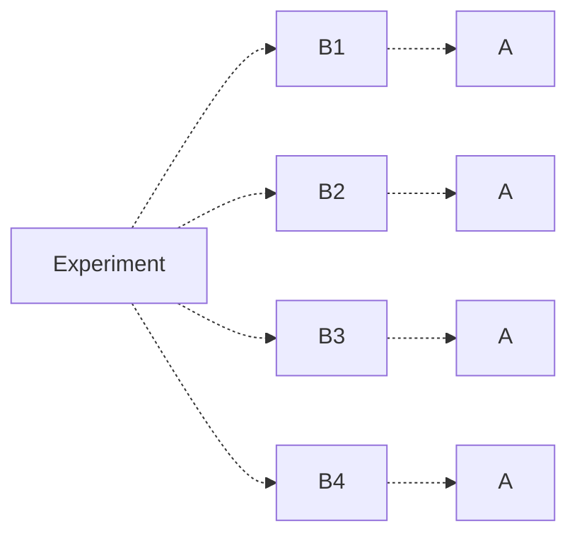

# Introduction to Probability
## Axioms of Probability
Suppose we have some **experiment**, any procedure that can be repeated and has a well-defined set of outcomes.

We define the set of all possible outcomes for the experiment to be the **sample space** $S$. Any subset of outcomes from this sample space is known as an **event**.
> The **null event**, denoted $\varnothing$, is the set with no elements.

> [!Example]+ Example: Sample Spaces and Events
> Suppose we roll a 6-sided die. Then, we would have sample space:
> $$
> \{ 1,2,3,4,5,6 \}
> $$
>
> Any subset of this sample space would be a valid event for this experiment. Some events include:
> $$
> \{ 1,3,4 \} \qquad \{ 2,3,4 \}
> $$

Suppose we have events $A_1, A_2, \dots$.

A **probability function** $P: A \to \mathbb{R}$ is a function satisfying the following **axioms of probability**:
1. **Bounds of Probability**: Probability must be given as a number between 0 and 1.
   $$
   P(A) \in [0, 1] \; \text{for all} \; A \in S
   $$ 
2. **Cumulative Probability**: Probability of the set of all outcomes must equal 1.
   $$
   P(S) = 1
   $$
3. **Pairwise Disjoint Events**: If events  $A_1, A_2, \dots$ are pairwise disjoint, then the probability of their union must equal the summation of individual probabilities
   $$
   P \left( \bigcup A_i \right) = \sum P(A_i)
   $$

> [!Example]+ Example: Applying Axioms of Probability
> You flip a two-sided coin, and the probability of heads $H$ is $1/2$. How can we use the axioms of probability to justify the probability of $T$?
> 
> We know that the set of all outcomes $S = \{ H, T \}$. We use the axioms of probability to justify $P(\{T\})$.
>
> We know by the axioms that $P(S) = 1$. Furthermore, we know that $\{H\}$ and $\{T\}$ are disjoint events, and their union forms our sample space $S$.
> $$
> \begin{align*} 
> 	P(S) = P(\{ H, T \}) &= P(\{H\} \cup \{T\}) \\
>       &= P(\{H\}) + P(\{T\}) \\
>       &= \frac{1}{2} + P(\{T\}) = 1 \\
> 	\to P(\{T\}) = \frac{1}{2}
> 	\end{align*}
> $$

From these axioms of probability, we can also derive the following **properties of probability**. Let $A, B$ be events of sample space $S$. Then,
1. $P(A^c) = 1 - P(A)$
2. $P(\varnothing) = 0$
3. $P(A \cup B) = P(A) + P(B) - P(A \cap B)$
4. If $A \subseteq B$, then $P(A) \le P(B)$

> [!Note]- Proof (Property 2)
> We know that
> $$
> \varnothing = \varnothing \cup \varnothing
> $$
> Moreover, we know the empty set is pairwise disjoint with itself.
> 
> Thus, it must be true that
> $$
> P(\varnothing) = P(\varnothing \cup \varnothing) = P(\varnothing) + P(\varnothing) = 2 P(\varnothing)
> $$
> Thus, $P(\varnothing) = 2P(\varnothing)$, which is only possible if $P(\varnothing) = 0$. 

> [!Note]- Proof (Property 3)
> Let $A / B$ denote the set of elements in $A$, but not in $B$. Then,
> $$
> P(A \cup B) = P(A/B \cup (A \cap B) \cup B/A)
> $$
>
> Because these sets are mutually exclusive, we can apply the third axiom
> $$
> P(A/B \cup (A \cap B) \cup B/A) = P(A/B) + P(A \cap B) + P(B/A)
> $$
>
> Adding $P(A \cap B) - P(A \cap B) = 0$ to both sides, we obtain
> $$
> P(A/B) + 2 P(A \cap B) - P(A \cap B) + P(B/A)
> $$
>
> Which, after applying axiom 3, gives us
> $$
> \begin{align*}
> 	&P(A / B \cup (A \cap B)) + P(B / A \cup (A \cap B) - P(A \cap B) \\
> 	&= P(A) + P(B) - P(A \cap B)
> \end{align*}
> $$

Note that the third property can be extended for any number of sets. For example, on 3 sets $A,B,C$, we have
$$
P(A \cup B \cup C) = P(A) + P(B) + P(C) - P(A \cap B) - P(A \cap B) - P(B \cap C) + P(A \cap B \cap C)
$$

This is generalized to $n$ sets in the following theorem.

> [!Abstract] Theorem: Inclusion-Exclusion Theorem
> If $A_1, \dots, A_n \subseteq S$, then 
> $$
> P \left( \bigcup_{i = 1}^n A_i \right) = \sum_{i = 1}^n P(A_i) - \sum_{i < j} P(A_i \cap A_j) + \sum_{i < j < k} P(A_i \cap A_j \cap A_k) + (-1)^{n-1} P \left( \bigcap_{i = 1}^n A_i \right)
> $$
> 
> > [!Note]- Alternative Definition
> >
> > We can think about this another way. 
> > Let $I \subseteq [n] = \{ 1,2 \dots, n \}$. Denote $A_I = \bigcap_{i \in I} A_i$, with $A_\varnothing = S$.
> > 
> > Then $P \left( \bigcup_{i = 1}^n A_i \right) = 1 - \sum_{I \subseteq [n]} (-1)^{|I|} P(A_I)$ where $I \subseteq [n]$ is the power set of $[n]$, and $| I |$ is the magnitude of $I$.
> > 
> > For example, when $n = 2$, we have $I = \varnothing, \{1\}, \{2\}, \{1,2\}$, giving us
> > $$
> > \begin{align}
> > 	&1 - \sum_{I \subseteq [n]} (-1)^{|I|} P(A_I) \\
> > 	&= 1 - \left( P(A_\varnothing) -P(A_{\{1\}}) - P(A_{\{2\}}) + P(A_{\{1,2\}}) \right) \\
> > 	&= P(A_1) + P(A_2) - P(A_1 \cap A_2)
> > 	\end{align}
> > $$
> > 
> > By Demorgan's Law, this becomes
> > $$ P\left( \bigcap_{i=1}^n A^c \right) = \sum_{I \subseteq [n]} (-1)^{|I|} P(A_I) $$
> > Which is the definition often used in combinatorics.

> [!Example]+ Example: Inclusion-Exclusion Theorem
> A person visits the dentist. There is a 0.7 chance a cavity is filled, 0.2 a tooth is extracted, and 0.1 chance that both occur.
>
> What is the probability in a visit that neither occur?
> 
> If $A$ is the event of a cavity, and $B$ is the event of an extraction, then
> $$
> \begin{align}
> 	&P(\text{Neither Occur}) = P( (A \cup B)^c ) \\
> 	&= 1 - P(A \cup B) \\
> 	&= 1 - (P(A) + P(B) - P(A \cap B)) \\
> 	&= 1 - (0.7 + 0.2 - 0.1) = 0.2
> 	\end{align}
> $$ 

## Calculating Probability
We often focus on the case the sample space $S$ is finite.

In the case every element has equal chance, we have for any event $E \subseteq S$,
$$
P(E) = \frac{|E|}{|S|}
$$
In other words, the probability of the event is equal to all ways the event can occur, divided by the total number of outcomes.

See the below examples.

> [!Example]+ Example: Calculating Probability (1)
> A coin is flipped 10 times. What is the probability of getting exactly 3 heads? 
> 
> To find the number of outcomes where we have 3 heads, choose 3 "coins" to be heads.
> $$
> C(10, 3)
> $$
>
> Furthermore, as every position can either be heads or tails, our total number of outcomes is equal to 
> $$
> 2^{10}
> $$
>
> This gives us probability
> $$
> P = \frac{C(10,3)}{2^{10}}
> $$

> [!Example]- Example: Calculating Probability (2)
> There are 10 cats, 7 dogs, and 5 mice. Four animals are chosen at once.
>
> What is the probability we get at most 1 mouse?
> 
> Let's first find the number of outcome we have. Let's count the cases where we have either 0 or 1 mice. 
> 1. For 0 mice, we choose 4 animals from our remaining  17 available $\to C(17, 4)$.
> 2. For 1 mouse, we choose 3 animals from our remaining 17 available $\to C(17, 3)$.
> 
> Adding these cases together, we have number of outcomes
> $$
> C(17,4) + C(17,3)
> $$
> 
> Let's now find the number of total outcomes. Out of our 22 animals, we choose 4 of them, giving us
> $$
> C(22, 4)
> $$
> 
> Combining these results, we get probability
> $$
> P = \frac{C(17,4) + C(17,3)}{C(22,4)}
> $$

> [!Example]- Example: Calculating Probability (3)
> If $n$ labeled balls are placed in $n$ labeled boxes, what is the probability that exactly 1 box is empty?
> 
> If one box must be empty and the others with balls, there must be **exactly 1 box with 2 balls**, the others having 1 ball. 
> 
> To find the number of outcomes where exactly 1 box is empty, we first choose one of $n$ boxes to be empty. Then, we choose another box from our remaining $(n-1)$ boxes to place a distinct pair of balls $C(n, 2)$. Finally, we permute the remaining $n - 2$ balls in the other boxes.
> $$
> n \cdot (n - 1) \cdot C(n, 2) \cdot P(n-2, n-2) = \binom{n}{2} \cdot n!
> $$
> 
> To find the total number of outcomes, we observe that every ball can be in any of the $n$ boxes, so we have total number of outcomes
> $$
> n^n
> $$
> 
> Giving us probability 
> $$
> P = \frac{C(n,2) \cdot n! }{n^n}
> $$

In some cases $S$ may be uncountable, but we can still find the probability. See the below example.

> [!Example]+ Example: Calculating Probability - Uncountable Sets
> As an extremely simple example, let $S = [0, 1]$. While we may not be able to find the probability of one specific number (say, $0.1111$), we can easily find the probability of a range of numbers.
> 
> Let $E = [a,b] \subseteq [0,1]$. Then,
> $$
> P(E) = \frac{b-a}{1-0}
> $$ 

> [!Abstract] Theorem: Probability with Uncountable Sets
> Let $A_1 \subseteq A_2 \subseteq A_3 \subseteq \dots A_n$ be events in $S$. Then
> 1. The union of the events is equal to the largest event $A_n$, as the rest are subsets of $A_n$.
>    $$
>    P\left(\bigcup_{i=1}^\infty A_i\right) = \lim_{n\to\infty} P(A_n)
>    $$
> 2. The intersection of the events is equal to the smalest event $A_1$, as $A_1$ is the only event which is a subset of all the others.
>    $$
>    P\left(\bigcap_{i=1}^\infty A_i\right) = \lim_{n\to\infty} P(A_1)
>    $$
>    
> > [!Note]- Proof (Property 1)
> >
> > Let $B_1 = A_1, B_2 = A_2 / A_1, \dots B_i = A_i / A_i$, where $X/Y$ indicates the set of elements in $X$ not in $Y$.
> > 
> > These are disjoint sets whose union form $A$. In other words,
> > $$
> > P\left( \bigcup_{i=1}^\infty A_i \right) = P\left( \bigcup_{i=1}^\infty B_i \right)
> > $$
> >
> > Applying the axioms of probability, 
> > $$
> > P\left( \bigcup_{i=1}^\infty B_i \right) = \sum_{i=1}^\infty P(B_i)
> > $$
> >
> > Finally, we can convert the summation to a limit and convert back in terms of $A$.
> > $$
> > \sum_{i=1}^\infty P(B_i) = \lim_{n\to\infty} \sum_{i=1}^n P(B_i) = \lim_{n\to\infty} P\left( \bigcup_{i=1}^n B_i \right) = \lim_{n\to\infty} P(A_n)
> > $$
> >
> > Note that the proof for property 2 is quite similar to this one.

> [!Example]- Example: Probability with Uncountable Sets
> 1. At 11:59, balls labeled 1 to 10 are put into a box. One ball is removed at 11:59:30.
> 2. At 11:59:30, balls labeled 11 to 20 are put into the box. One ball is removed at 11:59:45.
> 3. At 11:59:45, balls labeled 21 to 30 are put into the box
> 4. ...
> 
> At 12:00, how many balls are in the box?
> 
> Let $A_i$ denote the event in which ball $1$ survives step $i$. Then,
> $$
> P(A_1) = \frac{9}{10} \qquad P(A_2) = \frac{9}{10} \cdot \frac{18}{19} \qquad P(A_3) = \frac{9}{10} \cdot \frac{18}{19} \cdot \frac{27}{28} \dots
> $$
>
> Combining these, we find $A$ as the event in which ball 1 survives till 12:00.
> $$
> A = \bigcap_{i=1}^\infty A_i
> $$
>
> Because $A_1 \subseteq A_2 \subseteq A_3 \subseteq \dots$, we apply our previous theorem to find
> $$
> P(A) = P \left( \bigcap_{i=1}^\infty A_i  \right) = \lim_{n\to\infty} A_n = \lim_{n\to\infty} \frac{9}{10} \cdot \frac{18}{19} \dots \frac{9n}{9n + 1} = 0
> $$
>
> Let $c_n = \prod_{i=1}^\infty \frac{a_n}{a_n + 1} = \lim_{n\to\infty} c_n$. Then,
> $$
> \frac{1}{c_n} = \frac{10}{9} \cdot \frac{19}{18} \dots \frac{9_{n+1}}{9_n} = \left(1 + \frac{1}{9}\right) \left(1 + \frac{1}{2(9)}\right) \dots \left(1 + \frac{1}{9n}\right)
> $$
> 
> Which is bounded by the harmonic series!
> $$
> \frac{1}{c_n} \ge \frac{1}{9} \left(1 + \frac{1}{2} + \frac{1}{3} + \dots + \frac{1}{n}\right)
> $$
> Because the harmonic series diverges, this forces.
> $$
> \lim_{n\to\infty} \frac{1}{c_n} = \infty
> $$
> Thus, $P(A) = \lim_{n\to\infty} c_n = 0$.
>
> Now let $B_k$ be the event where ball $k$ survives till 12:00. If we perform the same process for any ball, we can see that we're only just dropping terms from the harmonic set, which still diverges. This holds for any ball, so if $B$ is the event that at least 1 ball survives, then
> $$
> P(B) = P \left( \bigcup_{i=1}^\infty B_i \right) = \sum_{i=1}^\infty P(B_i) = 0
> $$
> Thus, at 12:00, no balls would remain in the box!

# Conditional Probability
## Introduction to Conditional Probability
Let $A,B \subseteq S$ be events, where $P(B) \ne 0$.

The **conditional probability** of $A$ given $B$ ("probability of $A$ given $B$") is given as
$$
P(A \mid B) = \frac{P(A \cap B)}{P(B)}
$$
> Conditional probability essentially has the effect of restricting our sample space to that of $B$.

We have the following properties of conditional probability:
1. **Bounds of Probability**: Just like any other probability, conditional probability must also be a value from 0 to 1.
   $$
   0 \le P(A \mid B) \le 1
   $$
2. **Cumulative Probability**: The probability of the sample space given $B$ is 1, as everything in $B$ is in $S$.
   $$
   P(S \mid B) = 1
   $$
3. **Pairwise Disjoint Events**: If $A_1, A_2, \dots$ are pairwise disjoint events, then
   $$
   P\left( \bigcup_{i=1}^\infty A_i \mid B \right) = \sum_{i=1}^\infty P(A_i \mid B)
   $$

> [!Note]- Info: Proof (Property 3)
> By definition of conditional probability,
> $$
> P\left( \bigcup_{i=1}^\infty A \mid B \right) = \frac{P\left( (\bigcup_{i=1}^\infty A_i) \cap B \right)}{P(B)}
> $$
> 
> We then apply the distributive property to obtain
> $$
> \frac{P(\cup (A_i \cap B)}{P(B)}
> $$
>
> Because the $A_i$'s by assumption are disjoint, then it must be true that the $A_i \cap B$'s are also disjoint. Applying our probability axiom, we obtain
> $$
> \sum_{i=1}^\infty \frac{P(A_i \cap B)}{P(B)} = \sum_{i=1}^\infty P(A_i \mid B)
> $$

Let's see some conditional probability examples.

> [!Example]+ Example: Conditional Probability (1)
> A loaded 6-sided die has an odd number occurring twice as likely as even. Determine the number is a perfect square, given the value is larger than 3.
>
> Let $A = \{ 1, 4 \}$ denote the event of a perfect square, and let $B = \{ 4, 5, 6 \}$ denote the event of a number larger than 3.
>
> We see that $A \cap B = \{ 4 \}$.
>
> Let $x$ be the probability that we roll an even number. Then,
> $$
> 2x + x + 2x + x + 2x + x = 1 \to x = 1/9
> $$
>
> Thus, the probability of rolling an even number is $1/9$, and an odd number $2/9$.
>
> We find our answer as
> $$
> P(A \mid B) = \frac{P(A \cap B)}{P(B)} = \frac{P(\{4\})}{P(\{4,5,6\})} = \frac{1/9}{4/9} = \frac{1}{4}
> $$

> [!Example]- Conditional Probability (2)
> There are 7 black socks, 5 white socks. The socks are distinct, and we take 2, one at a time, without replacement.
>
> What is the probability that both socks are black?
>
> This question is a conditional probability question in disguise, as it asks for the probability of a black sock given the first is black as well.
>
> Let $A_1$ denote the event that the first sock is black, and $A_2$ denote the event that the second sock is black.
> 
> We want $P(A_1 \cap A_2)$, which is actually equivalent to $P(A_1) P(A_2 \mid A_1)$.
> $$
> P(A_1 \cap A_2) = P(A_1) P(A_2 \mid A_2) = \frac{7}{12} \cdot \frac{6}{11}
> $$

Using conditional probability, we can also calculate the probability of intersections.

> [!Info] Multiplicaton Rule
> Let $A_1, \dots, A_2 \subseteq S$, where $P(A_1 \cap A_2 \dots A_n) > 0$.
>
> Then,
> $$
> P(A_1 \cap A_2 \dots A_n) = P(A_1) P(A_2 \mid A_1) P(A_3 \mid A_1 \cap A_2) \dots
> $$
> This is known as the **multiplication rule**.

## Independence of Events
Let $A$ and $B$ be events. We say $A$ and $B$ are **independent** if $P(A \cap B) = P(A) P(B)$.

Otherwise the events are **dependent**.

In particular, if $P(B) \ne 0$, then $A, B$ being independent implies
$$
P(A \mid B) = \frac{P(A \cap B)}{P(B)} = \frac{P(A)P(B)}{P(B)} = P(A)
$$
In other words, $B$ occurring does not affect the probability of $A$.

> [!Example]- Example: Independence
> We draw 2 cards from a deck of cards without replacement. If $A$ is the event of drawing a spade on the first draw, and $B$ is the event of drawing a spade on the second draw, are $A$ and $B$ independent?
>
> We find that
> $$
> P(A) = \frac{13}{52} = \frac{1}{4}
> $$
>
> To find $P(B)$, we need to do a case analysis.
> $$
> \begin{cases}
>       \frac{13}{52} \frac{12}{51} & \text{Spade Previously Drawn} \\
>       \frac{39}{52} \frac{13}{51} & \text{Spade Not Previously Drawn} 
> \end{cases}
> $$
>
> Adding these two cases together, we find $P(B) = 1/4$.
>
> Now, we find
> $$
> P(A \cap B) = P(A)P(B \mid A) = \frac{13}{52} \frac{12}{51} = \frac{1}{7}
> $$
>
> Which is not equal to
> 
> $$
> P(A)P(B) = \frac{1}{4} \cdot \frac{1}{4} = \frac{1}{16}
> $$
>
> So these events are dependent, which is to be expected - $A$ directly affects the set of outcomes of $B$.

Independence does not necessarily mean the events lack a common intersection. See the below example.

> [!Example]+ Example: Independence Misconceptions
> We toss a coin 3 times. Let $A$ be the event a head ($H$) occurs on toss 1 and 2, and let $B$ be the event a tails ($T$) occurs on toss 3.
>
> Thus, $A = \{ HHT, HHH \}$ and $B = \{ HHT, HTT, THT, TTT \}$, and the total number of outcomes is $2^3 = 8$. This gives us probabilities
> $$
> P(A) = \frac{2}{8} = \frac{1}{4} \qquad P(B) = \frac{4}{8} = \frac{1}{2}
> $$
> Furthermore, we see that their intersection has one outcome, giving us
> $$
> P(A \cap B) = \frac{1}{8}
> $$
>
> We see that despite having a common intersection, these events are actually independent of one another.
> $$
> P(A) P(B) = \frac{2}{8} \cdot \frac{4}{8} = \frac{1}{8} = P(A \cap B)
> $$
> > Mathematical independence is not the same as the independence we're commonly used to.

We can generalize this concept of independence to multiple events. Say we have many events $A_1, A_2, \dots, A_k$. Then, they are all **independent** if
$$
P\left( \bigcap_{i \in J} A_i \right) = \prod_{i \in J} P(A_i) \text{ where J is any subset of } \{1,2,\dots,k\}
$$
In other words, the probability of their common intersection equals the product of their individual probabilities. Note that to guarantee independence, we have to check **every possible** combination of interactions of these sets.

Alternatively, $A_1, A_2, \dots, A_k$ are **pairwise independent** if
$$
P(A_i \cap A_j) = P(A_i) P(A_j) \text{ for all } 1 \le i \ne j \le k
$$
Note that independence of sets implies their pairwise independence, but the converse is not true.

> [!Example]+ Example: Independence vs. Pairwise Independence
> Conider 4 labeled balls, and pick one.
>
> Let $A_1 = \{ 1,2 \}$, $A_2 = \{ 1, 3 \}$, and $A_3 = \{ 1,4 \}$. Now, note that
>
> $$
> \begin{align*}
>	P(A_1 \cap A_2) = \frac{1}{4} = P(A_1) P(A_2) \\
> 	P(A_1 \cap A_3) = \frac{1}{4} = P(A_1) P(A_3) \\
> 	P(A_2 \cap A_3) = \frac{1}{4} = P(A_2) P(A_3) 
> \end{align*}
> $$
> Thus, $A_1, A_2, A_3$ are pairwise independent.
>
> However, because
> $$
> P(A_1 \cap A_2 \cap A_3) = P(\{1\}) = \frac{1}{4} \ne P(A_1) P(A_2) P(A_3) = \frac{1}{8}
> $$
> The events are not independent.

> [!Abstract] Theorem: Independence of Complements
> Let $A, B$ be events. Then $A, B$ are independent if and only if $A$ and $B^c$ are independent.
>
> > [!Note]- Proof
> >
> > Suppose that $A$ and $B$ are independent. By definition, we know that $P(A \cap B) = P(A) P(B)$. Applying this definition, we see that
> >
> > $$
> > \begin{align*}
> > P(A \cap B^c) &= P(A) - P(A \cap B) \\
> > 	&= P(A) - P(A) P(B) \\
> > 	&= P(A) (1 - P(B)) \\
> > 	&= P(A) P(B^c)
> > \end{align*}
> > $$
> >
> > We can easily reverse this argument to prove the other direction.

Understanding independence is extremely important, as it may let us solve problems that we wouldn't be able to otherwise.

> [!Example]+ Example: Applying Independence
> Alice and Bob can solve 75% and 70% of the problems in a book, respectively. Assuming every event is independent, if a problem is selected at random from the book, whatis the probability it will be solved?
>
> Let $A$ be the event that Alice solves the problem, and $B$ be the event that Bob solves the problem.
>
> We want one of them to solve the problem - in other words, $P(A \cup B)$. Applying our set identity, we find
> $$
> \begin{align*}
>	P(A \cup B) &= P(A) + P(B) - P(A \cap B) \\
>	    &= P(A) + P(B) - P(A) P(B) \\
> 	    &= 0.75 + 0.7 - (0.75)(0.7) \\
>	    &= 0.925
> \end{align*}
> $$

## Bayes' Formula
Let $B_1, B_2, \dots B_n$ be events that are a **partition** of sample space $S$. We define a partition as
$$
B_i \cap B_j = \varnothing \text{ for } 1 \le i \ne j \le n, \text{ and } \bigcup_{i=1}^n B_i = S
$$
In other words, no two events $B_i, B_j$ intersect, and the combination of all $B_i$'s forms our sample space $S$.

Now say we have an event $A$ which has a subset of $S$. Then, because all of our $B_i$'s form a disjoint union of $S$,
$$
P(A) = P \left( \bigcup_{i=1}^n (A \cap B_i) \right) = P(A \cap B_1) + P(A \cap B_2) + \dots + P(A \cap B_n)
$$

Because our $B_i$'s disjointly form $S$, we can conceptually think of this as $A$ "slicing" into multiple $B_i$'s. Thus, we can find $P(A)$ by totaling all places where $A$ intersects a $B_i$.

Applying our definition for conditional probability, we find
$$
\begin{align*}
P(A) &= P(A \cap B_1) + P(A \cap B_2) + \dots + P(A \cap B_n) \\
     &= P(A \mid B_1) P(B_1) + P(A \mid B_2) P(B_2) + \dots + P(A \mid B_n) P(B_n) 
\end{align*}
$$

This formula derives the base of **Bayes' formula**.

> [!Abstract] Theorem: Bayes' Formula
> Let $B_1, \dots, B_n$ be a partition of $S$. Then,
> 
> $$
> P(B_i \mid A) = \frac{P(B_i \cap A)}{P(A)} = \frac{P(A \mid B_i) P(B_i)}{ \sum_{k = 1}^n P(A \mid B_k) P(B_k)}
> $$
> > In other words, given we know $P(A \mid B_k)$ for all $k$, we can find $P(B_i \mid A)$.

We see some applications of Bayes' Formula below.

> [!Example]+ Example: Bayes' Formula (1)
> - If Alice plays, there is a 75% chance the team wins.
> - If Bob plays, there is a 40% chance the team wins.
> - The team doctor says there's a 70% chance Alice can play.
> - Only Alice or Bob can play at a given time.
>
> Given that the team won, what's the chance that Bob played?
>
> Let $A$ denote the event that Alice plays, $B$ denote the event that Bob plays, and $W$ denote the event that the team wins. We know the following
> $$
> \begin{align*}
>       &P(A) = 0.7 \\
>       &P(B) = 1 - P(A) = 0.3 \\
>       &P(W \mid A) = 0.75 \\
>       &P(W \mid B) = 0.4
> \end{align*}
> $$ 
>
> We want to find $P(B \mid W)$.
> $$
> \begin{align*}
>       P(B \mid W) &= \frac{P(W \cap B)}{P(W)} \\
>       &= \frac{P(W \mid B) P(B)}{P(W \mid A) P(A) + P(W \mid B) P(B)} \\
>       &= \frac{0.4 \cdot 0.3}{0.75 \cdot 0.7 + 0.4 \cdot 0.3}
> \end{align*}
> $$

> [!Example]- Example: Bayes' Formula (2)
> A multiple choice question has $m$ choices. Alice knows the answer with probability $p$. If she does not know, she instead guesses with probabiliy $1 - p$. What is the probability that Alice knew the answer, given she answered correctly?
>
> Let $K$ denote the event Alice knew the answer, and $C$ denote the event she answered correctly. Then,
> $$
> \begin{align*}
>       &P(K) = p \\
>       &P(K^c) = 1 - p \\
>       &P(C \mid K) = 1 \\
>       &P(C \mid K^c) = \frac{1}{m}
> \end{align*}
> $$
>
> We want to find $P(K \mid C)$.
> $$
> \begin{align*}
>       P(K \mid C) &= \frac{P(K \cap C)}{P(C)} \\
>       &= \frac{P(C \mid K) P(K)}{P(C \mid K) P(K) + P(C \mid K^c) P(K^c)} \\
>       &= \frac{1 \cdot p}{1 \cdot p + (1 - p)} 
> \end{align*}
> $$
> > Note that as $m$ gets large, this probability actually increases! This makes sense because with more choices, she's more likely to have known the answer if she got it correct.

> [!Example]- Example: Bayes' Formula (3)
> A rare disease affects 1% of a population. There is a test to check for this disease.
> - If you have the disease, the probability you test negative is 1% (false negative).
> - If you don't have the disease, the probability you test positive is 2% (false positive).
>
> What is the probability you have the disease, given you test positive? 
>
> Let $D$ denote the event that you have a disease, and $P$ denote the event you test positive. Then,
> $$
> \begin{align*}
>       &P(P \mid D) = 1 - 0.01 = 0.99 \\
>       &P(P \mid D^c) = 0.02 \\
>       &P(P^c \mid D) = 0.01 \\
>       &P(P^c \mid D^c) = 1 - 0.02 = 0.98
> \end{align*}
> $$
>
> We want to find $P(D \mid P)$.
> $$
> \begin{align*}
>       P(D \mid P) &= \frac{P(P \cap D) P(D)}{P(P)} \\
>       &= \frac{0.99 \cdot 0.01}{0.01 \cdot 0.99 + 0.99 \cdot 0.02} \\
>       &\approx 0.33
> \end{align*}
> $$
> > This may be a surprising result! One way to think about this intuitively is that the rareness of the disease holds more meaning than the accuracy of the test.

> [!Example]- Example: Bayes' Formula (4)
> In tennis, "deuce" is a score of 40-40. To win the game, 1 person more score 2 points in a row, and if both players score 1, it resets to deuce.
>
> Alice has 60% to win a point. What is the probability that Alice wins?
>
> Let $B_1$ be the event where Alice wins the next two points, $B_2$ be the event where Alice loses the next two points, and $B_3$ be the event where Alice only wins one point.
> $$
> \begin{align*}
>       &P(B_1) = 0.6 \cdot 0.6 \\
>       &P(B_2) = 0.4 \cdot 0.4 \\
>       &P(B_3) = 0.6 \cdot 0.4 + 0.4 \cdot 0.6 
> \end{align*}
> $$
>
> Thus, the probability Alice wins the game (let's call $W$) is equal to
> $$
> \begin{align*}
>       P(W) &= P(W \mid B_1) P(B_1) + P(W \mid B_2) P(B_2) + P(W \mid B_3) P(B_3) \\
>       &= P(B_1) + 0 + P(W) P(B_3)
> \end{align*}
> $$
> > Note that we know that $P(W) = P(W \mid B_3)$, because if Alice only wins one point, we return back to a deuce.