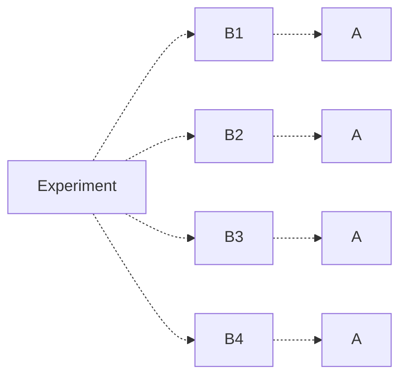

# Section 1.1: Basic Counting
## Permutations and Combinations
A **permutation** of a set of $n$ elements is a rearrangement of the elements in a specific order. A **k-permutation** is an arrangement of $k$ elements from the $n$-element set.
> By definition of a set, elements must be distinct.

The total number of $k$-permutations of an $n$-element set is given by the formula
$$ P(n,k) = \frac{n!}{(n-k)!} = n (n-1) \dots (n - k + 1) $$

> [!Example]- Example: Basic Permutations
> **Problem**: How many ways can we seat 10 people in a row?
> **Solution**: We are performing a $k$-permutation where $k = 10$ on our set of 10 people.
> $$ P(10, 10) = 10! $$

The total ways to create a $k$-size subset from an $n$-element set, known as a **combination**, is given by 

$$ C(n,k) = \binom{n}{k} = \frac{n!}{k! (n-k)!} = \frac{P(n,k)}{k!} $$

> Note that by definition of a subset, there is no element order.

> [!Abstract] Theorem: Binomial 
> For any positive integer $n$,
> $$ (x + y)^n = \sum_{k=0}^n \binom{n}{k} x^k y^{n-k} $$
> 
> > [!Note]- Proof
> > We begin with $(x + y)^n$.
> > $$ \begin{align}
> > 	(x + y)^n &= (x + y) (x + y) \dots (x + y) \\
> > 	&= c_1 x^n + c_2 x^1 y^{n-1} + c_3 x^2 y^{n-2} + \dots 
> > 	\end{align} $$
> > The product of the $n$ terms means that when we expand the binomial expression, we are "choosing" either the $x$ or $y$ term to multiply.
> > 
> > Thus, to find the coefficient of $x^k y^{n-k}$, the product of the $n$ terms requires that when we multiply each binomial together, we multiply ("choose") the $x$-term $k$ times. After this, the rest of the product's terms are forced to be $y$ (and there's only one way to pick $y$). 
> > 
> > This gives us $C(n, k)$ different ways to obtain the coefficient.
> > $$ C(n,k) x^k y^{n-k} = \binom{n}{k} x^k y^{n-k} $$

> [!Example]- Example: Basic Counting
> There are 10 cows, 9 pigs, 8 horses. The
> 1. Total ways to pick 5 animals at once:
>    
>    Because order does not matter, we are simply choosing 5 animals from our total of 27. 
>    $$ C(27, 5) $$
>    
> 2. Total ways to get 5 animals where we get 3 cows, 2 pigs or 2 cows, 3 pigs:
>    
>    We choose 3 cows and 2 pigs from our animal total to obtain
>    $$ \binom{10}{3} \binom{9}{2} $$
>    We choose 2 cows and 3 pigs from our animal total to obtain
>    $$ \binom{10}{2} \binom{9}{3} $$
>    Because these two groups of outcomes are distinct from one another, we add them together to find our total.
>    $$ \binom{10}{3} \binom{9}{2} + \binom{10}{2} \binom{9}{3} $$

> [!Example]- Example: Basic Counting (2)
> There are 10 kids and 3 types of candy. How many ways can we distribute this candy such that exactly 3 children get type 1, 2 children get type 2, and 5 children get type 3?
> 
> We can think of our children as the distinct elements, and choose who gets what candy. So, we first select 3 children to get type 1, 2 children to get type 2, and 5 children to get type 3.
> $$ \binom{10}{3} \binom{7}{2} \binom{5}{5} $$
> 
> We can think about this another way as well. Say we have 10 children numbered 1-10, and we assign each a candy type of 1, 2, or 3 (for the total we're looking for). We want to find the number of different ways we can order these candy types!
> However, because there are repeated elements, we need to count some cases as one. We do this by dividing by the total number of possible cases that we want to count as one case. 
> $$ \frac{P(10, 10)}{3! \cdot 2! \cdot 3!} $$
> In fact, this is called the **multinomial coefficient**, described below.

> [!Abstract] Theorem: Multinomial Coefficient (Permutations with Repetition)
> Suppose there are $k$ distinct objects, and object $i$ occurs $a_i$ times.
> 
> Assume $a_1 + a_2 + \dots + a_k = n$. 
> 
> Then, the total number of rearrangements of the $n$ objects is
> $$ \frac{n!}{a_1! \cdot a_2! \cdots a_k!} = \binom{n}{a_1 a_2 \dots a_k} $$
> called the **multinomial coefficient**. 

We can use the multinomial coefficient to generalize our previous binomial theorem.

> [!Abstract] Theorem: Multinomial
> $$ (x_1 + x_2 + \dots + x_k)^n = \sum_{a_1 + a_2 + \dots + a_k = n} \binom{n}{a_1 a_2 \dots a_k} x_1^{a_1} x_2^{a_2} \dots x_k^{a_k} $$

> [!Example]- Example: Multinomial Coefficient
> Find the coefficient of $x_1^3 x_2 x_4^2$ in $(x_1 + x_2 + x_3 + x_4)^6$.
> 
> To find the coefficient, we need to find the number of times we obtain $x_1^3 x_2 x_4^2$ in the product.
> 
> In other words, if we select 6 positions, where each represents the $x_i$ term we "selected" to multiply out, then we want to choose 3 positions to have $x_1$, 1 position to have $x_2$, and 2 positions to have $x_4$. 
> 
> This comes out to be
> $$ C(6, 3) * C(3, 1) * C(2,2) = \binom{6}{3 \quad 1 \quad 2} $$

> [!Example]- Example: Permutations and Combinations
> How many arrangements of $AAABBCC$ are there?
> 
> Suppose we have 7 positions. We want to choose 3 to fill with $A$, 2 to fill with $B$, and 2 to fill with $C$. This comes out to be
> $$ C(7,3) * C(4,2) * C(2,2) $$
> 
> --- 
> 
> What if the $B$'s must all be together, but none of the $C$'s can be together?
> 
> If the $B$'s must be together, we block them together as one term $X = BB$ to find arrangements of $AAAXCC$. Then, to find permutations where the $C$'s are not together, we first will find the number of arrangements of $AAAX$ (without the $C$'s').
> $$ C(4,3) $$
> Then, between every term $AAAX$, we can place $C$'s such that they are not next to each other. This comes out to 5 positions, and we have 2 $C$'s to place to give us
> $$ C(5,2) $$
> different ways to place our $C$'s. Thus, our final result is
> $$ C(4,3) * C(5,2) $$

# Section 2.1: Axioms of Probability
We define the set of all possible outcomes of an experiment as the **sample space** $S$. A subset of this sample space $S$ is called an **event**. 
> The **null event**, denoted $\varnothing$, is the set with no elements.

For $A,B \subseteq S$, the **union** and **intersection** of the two sets is defined as
$$ A \cup B = \{ x : x \in A \lor x \in B \} $$
$$ A \cap B = \{ x : x \in A \land x \in B \} $$
We say sets $A$ and $B$ are **disjoint (mutually exclusive)** if $A \cap B = \varnothing$.

The **complement** of $A$ is defined as
$$ \bar{A} = A^c = \{ x : x \not\in A \}$$

> [!Example]- Example: Sets
> Let $S = [6] = \{ 1,2,3,4,5,6 \}$. 
> 
> If $A = \{ 1,3 \}$ and $B = \{ 1, 2 \}$, then
> $$ A^c \cap B^c = \{ 2,4,5,6 \} \cap \{ 3,4,5,6 \} = \{ 4,5,6 \} $$

> [!Abstract] Theorem: De Morgan's Law
> For $A_1, A_2 \dots A_n \subseteq S$,
> 1. $$ \left( \bigcap_{i=1}^n A_i \right)^c = \bigcup_{i=1}^n A_i^c $$
> 2. $$ \left( \bigcup_{i=1}^n A_i \right)^c = \bigcap_{i=1}^n A_i^c $$

Let $F$ be a family of subsets of $S$ (a subset of the power-set of $S$).

We say $F$ is a **$\sigma$-algebra on a set $S$** if
1. $S \in F$
2. **Closed Under Complements**: If $A \in F$, then $A^c \in F$
3. **Closed Under Union**: If $A_1, \dots, A_n \in F$, then $\bigcup_{i = 1}^n A_i \in F$

> By (2) and (3) and De Morgan's Law, it must be true that we have **closure under intersection** as well.

> [!Example]- Example: $\sigma$-Algebra
> Let $S = [6]$. Then
> $$ F = \{ \varnothing, S, \{1,2,3\}, \{4,5,6\} \}$$
> is a $\sigma$-algebra on $S$. 
> 
> Let $S = [5]$. Then
> $$ f = \{ \varnothing, S, \{1,2\}, \{3,4\}, \{5\} \}$$
> is not a $\sigma$-algebra, as the complement of the subset $\{ 1,2 \}$ does not exist in $F$.

A **probability function** $P: F \to \mathbb{R}$ is a function satisfying the following **axioms of probability**:
1. $P(A) \in [0, 1]$ for all $A \in F$ 
   *Probability must be given as a number between 0 and 1*
2. $P(S) = 1$
   *The probability of the set of all outcomes must be 1*
3. If $A_1, A_2, \dots$ are pairwise disjoint, then 
   $$ P \left( \bigcup_{i \ge 1} A_i \right) = \sum_{i \ge i} P(A_i) $$
   *The probability of the union of pairwise disjoint events is equal to the summation of their individual probabilities*

> [!Example]- Example: Axioms of Probability
> You flip a two-sided coin, and the probability of heads $H$ is $\frac{1}{2}$. How can we use the axioms of probability to justify the probability of $T$?
> 
> Here, we know that the set of all outcomes $S = \{ H, T \}$, so the $\sigma-algebra$ of $S$ is
> $$ F = \{ \varnothing, S, \{H\}, \{T\} \} $$
> We know by the axioms that $P(S) = 1$, so 
> $$ \begin{align} 
> 	&P(S) = 1 \\
> 	\to &P( \{ H, T \} ) = 1 \\
> 	\to &P( \{H\} \cup \{T\} ) = 1 \\
> 	\to &P(\{H\}) + P(\{T\}) = \frac{1}{2} + P(\{T\}) \\
> 	\to &P(\{T\}) = \frac{1}{2}
> 	\end{align} $$

Additionally, we have the following **properties of probability**, which can be derived using the axioms of probability. Let $A, B$ be events of sample space $S$. Then,
1. $P(A^c) = 1 - P(A)$
2. $P(\varnothing) = 0$
3. $P(A \cup B) = P(A) + P(B) - P(A \cap B)$
4. If $A \subseteq B$, then $P(A) \le P(B)$

> Note that the third property can be extended for more sets. For example, for 3 sets, we have
> $$ P(A \cup B \cup C) = P(A) + P(B) + P(C) - P(A \cap B) - P(A \cap B) - P(B \cap C) + P(A \cap B \cap C) $$

> [!Example]- Example: Proof (Property 2)
> We know that
> $$ \varnothing = \varnothing \cup \varnothing $$
> and moreover, the empty set is pairwise disjoint with itself.
> 
> Thus, it must be true that
> $$ P(\varnothing) = P(\varnothing \cup \varnothing) = P(\varnothing) + P(\varnothing) = 2 P(\varnothing) $$
> Thus, $P(\varnothing) = 2P(\varnothing)$, which is only possible if $P(\varnothing) = 0$. 

> [!Example]- Example: Proof (Property 3)
> Let $A / B$ denote the set of elements in $A$, but not in $B$. Then,
> $$ P(A \cup B) = P(A/B \cup (A \cap B) \cup B/A) $$
> Because these sets are mutually exclusive, we can apply the third axiom
> $$ P(A/B \cup (A \cap B) \cup B/A) = P(A/B) + P(A \cap B) + P(B/A) $$
> Adding $P(A \cap B) - P(A \cap B) = 0$ to both sides, we obtain
> $$ = P(A/B) + 2 P(A \cap B) - P(A \cap B) + P(B/A) $$
> Which, after applying axiom 3, gives us
> $$ \begin{align}
> 	&= P(A / B \cup (A \cap B)) + P(B / A \cup (A \cap B) - P(A \cap B) \\
> 	&= P(A) + P(B) - P(A \cap B)
> 	\end{align} $$

> [!Abstract] Theorem: Inclusion-Exclusion
> If $A_1, \dots, A_n \subseteq S$, then 
> $$ P \left( \bigcup_{i = 1}^n A_i \right) = \sum_{i = 1}^n P(A_i) - \sum_{i < j} P(A_i \cap A_j) + \sum_{i < j < k} P(A_i \cap A_j \cap A_k) + (-1)^{n-1} P \left( \bigcap_{i = 1}^n A_i \right) $$
> 
> > [!Note]- Alternative Definition
> > We can think about this another way. 
> > Let $I \subseteq [n] = \{ 1,2 \dots, n \}$. Denote $A_I = \bigcap_{i \in I} A_i$, with $A_\varnothing = S$.
> > 
> > Then $P \left( \bigcup_{i = 1}^n A_i \right) = 1 - \sum_{I \subseteq [n]} (-1)^{|I|} P(A_I)$ where $I \subseteq [n]$ is the power set of $[n]$, and $| I |$ is the magnitude of $I$.
> > 
> > For example, when $n = 2$, we have $I = \varnothing, \{1\}, \{2\}, \{1,2\}$, giving us
> > $$ \begin{align}
> > 	&1 - \sum_{I \subseteq [n]} (-1)^{|I|} P(A_I) \\
> > 	&= 1 - \left( P(A_\varnothing) -P(A_{\{1\}}) - P(A_{\{2\}}) + P(A_{\{1,2\}}) \right) \\
> > 	&= P(A_1) + P(A_2) - P(A_1 \cap A_2)
> > 	\end{align} $$
> > 
> > By Demorgan's Law, this becomes
> > $$ P\left( \bigcap_{i=1}^n A^c \right) = \sum_{I \subseteq [n]} (-1)^{|I|} P(A_I) $$
> > Which is the definition often used in combinatorics.

> [!Example]- Example: Inclusion-Exclusion Theorem
> A person visits the dentist. There is a 0.7 chance a cavity is filled, 0.2 a tooth is extracted, and 0.1 change that both occur.
> What is the probability in a visit that neither occur?
> 
> If $A$ is the event of a cavity, and $B$ is the event of an extraction, then
> $$ \begin{align}
> 	&P(\text{Neither Occur}) = P( (A \cup B)^c ) \\
> 	&= 1 - P(A \cup B) \\
> 	&= 1 - (P(A) + P(B) - P(A \cap B)) \\
> 	&= 1 - (0.7 + 0.2 - 0.1) = 0.2
> 	\end{align}  $$ 

We often focus on the case the sample space $S$ is finite. In the case every element has equal chance, we have for any event $E \subseteq S$,
$$ P(E) = \frac{|E|}{|S|} $$
or in other words, the probability of the event is equal to all ways the event can occur, divided by the total number of outcomes.

> [!Example]- Example: Calculating Probability (1)
> A coin is flipped 10 times. What is the probability of getting exactly 3 heads? 
> 
> To find the number of outcomes where we have 3 heads, choose 3 "coins" to be heads.
> $$ C(10, 3) $$
> Furthermore, as every position can either be heads or tails, our total number of outcomes is equal to 
> $$ 2^{10} $$
> Giving us probability
> $$ P = \frac{C(10,3)}{2^{10}} $$

> [!Example]- Example: Calculating Probability (2)
> There are 10 cats, 7 dogs, and 5 mice. Four animals are chosen at once. What is the probability we get at most 1 mouse?
> 
> Let's count the cases where we have either 0 or 1 mice. 
> 1. For 0 mice, we choose 4 animals from our remaining  17 available $\to C(17, 4)$.
> 2. For 1 mouse, we choose 3 animals from our remaining 17 available $\to C(17, 3)$.
> 
> Adding these cases together, we have number of outcomes
> $$ C(17,4) + C(17,3) $$
> 
> Out of our 22 animals, we choose 4 of them. This gives us total number of outcomes
> $$ C(22, 4) $$
> 
> Combining these results, we get probability
> $$ P = \frac{C(17,4) + C(17,3)}{C(22,4)}$$

> [!Example]- Example: Calculating Probability (3)
> If $n$ labeled balls are placed in $n$ labeled boxes, what is the probability that exactly 1 box is empty?
> 
> If one box must be empty and the others with balls, there must be **exactly 1 box with 2 balls**, the others having 1 ball. 
> 
> To find the number of outcomes where exactly 1 box is empty, we first choose one of $n$ boxes to be empty. Then, we choose another box from our remaining $(n-1)$ boxes to place a distinct pair of balls $C(n, 2)$. Finally, we permute the remaining $n - 2$ balls in the other boxes.
> $$ n \cdot (n - 1) \cdot C(n, 2) \cdot P(n-2, n-2) = \binom{n}{2} \cdot n! $$
> 
> To find the total number of outcomes, we observe that every ball has a choice to be in $n$ boxes, so we have total number of outcomes
> $$ n^n $$
> 
> Giving us probability 
> $$ P = \frac{C(n,2) \cdot n! }{n^n}$$

In some cases $S$ may be uncountable, but we can still find the probability. 

> [!Example]- Example: Calculating Probability - Uncountable Set (3)
> As an extremely simple example, let $S = [0, 1]$. While we may not be able to find the probability of one specific number (say, $0.1111$), we can easily find the probability of a range of numbers.
> 
> Let $E = [a,b] \subseteq [0,1]$. Then,
> $$ P(E) = \frac{b-a}{1-0} $$ 

> [!Abstract] Theorem: Probability with Uncountable Sets 
> Let $A_1 \subseteq A_2 \subseteq A_3 \subseteq \dots A_n$ be events in $S$. Then
> 1. $$ P\left(\bigcup_{i=1}^\infty A_i\right) = \lim_{n\to\infty} P(A_n) $$
> 2. $$ P\left(\bigcap_{i=1}^\infty A_i\right) = \lim_{n\to\infty} P(A_1) $$
>    
> > [!Note]- Proof
> > Let $B_1 = A_1, B_2 = A_2 / A_1, \dots B_i = A_i / A_i$, where $X/Y$ indicates the set of elements in $X$ not in $Y$.
> > 
> > These are disjoint sets whose union form $A$. In other words,
> > $$ P\left( \bigcup_{i=1}^\infty A_i \right) = P\left( \bigcup_{i=1}^\infty B_i \right) $$
> > Applying the axioms of probability, 
> > $$ P\left( \bigcup_{i=1}^\infty B_i \right) = \sum_{i=1}^\infty P(B_i) $$
> > Finally, we can convert the summation to a limit and convert back in terms of $A$.
> > $$ \sum_{i=1}^\infty P(B_i) = \lim_{n\to\infty} \sum_{i=1}^n P(B_i) = \lim_{n\to\infty} P\left( \bigcup_{i=1}^n B_i \right) = \lim_{n\to\infty} P(A_n) $$

> [!Example]- Example: Probability with Uncountable Sets (1)
> 1. At 11:59, balls labeled 1 to 10 are put into a box. One ball is removed at 11:59:30.
> 2. At 11:59:30, balls labeled 11 to 20 are put into the box. One ball is removed at 11:59:45.
> 3. At 11:59:45, balls labeled 21 to 30 are put into the box...
> 
> At 12:00, how many balls are in the box?
> 
> Let $A_i$ denote the event in which ball $1$ survives step $i$. Then,
> $$ P(A_1) = \frac{9}{10} \qquad P(A_2) = \frac{9}{10} \cdot \frac{18}{19} \qquad P(A_3) = \frac{9}{10} \cdot \frac{18}{19} \cdot \frac{27}{28} \dots $$
> Combining these, we have
> $$ A = \bigcap_{i=1}^\infty A_i $$
> as the event in which ball 1 survives till 12:00. Because $A_1 \subseteq A_2 \subseteq A_3 \subseteq \dots$, we apply our previous theorem to find
> $$ P(A) = P \left( \bigcap_{i=1}^\infty A_i  \right) = \lim_{n\to\infty} A_n = \lim_{n\to\infty} \frac{9}{10} \cdot \frac{18}{19} \dots \frac{9n}{9n + 1} = 0 $$
> Let $c_n = \prod_{i=1}^\infty \frac{a_n}{a_n + 1} = \lim_{n\to\infty} c_n$. Then,
> $$ \frac{1}{c_n} = \frac{10}{9} \cdot \frac{19}{18} \dots \frac{9_{n+1}}{9_n} = (1 + \frac{1}{9}) (1 + \frac{1}{2(9)}) \dots (1 + \frac{1}{9n}) $$
> Which is bounded by the harmonic set!
> $$ \frac{1}{c_n} \ge \frac{1}{9} (1 + \frac{1}{2} + \frac{1}{3} + \dots + \frac{1}{n}) $$
> So,as $n \to \infty$, 
> $$ \lim \frac{1}{c_n} = \infty $$
> forcing $P(A) = \lim_{n\to\infty} c_n = 0$.
>
> Now let $B_k$ be the event where ball $k$ survives till 12:00. If we wo0rk for any ball, we can see that we're dropping terms from the harmonic set, which still diverges. This holds for any ball, so if $B$ is the event that at least 1 ball survives, then
> $$ P(B) = P \left( \bigcup_{i=1}^\infty B_i \right) = \sum_{i=1}^\infty P(B_i) = 0 $$
> Thus, at 12:00, no balls would remain in the box!

# Section 3.1: Introduction to Conditional Probability
Let $A,B \subseteq S$, where $P(B) \ne 0$.

The **conditional probability** of $A$ given $B$ ("probability of $A$ given $B$) is given as
$$ P(A \mid B) = \frac{P(A \cap B)}{P(B)} $$
> This essentially has the effect of restricting our sample space.

Properties of conditional probability are given as follows:
1. $0 \le P(A \mid B) \le 1$
2. $P(S \mid B) = 1$
3. If $A_1, A_2, \dots$ are pairwise disjoint, then
   $$ P\left( \bigcup_{i=1}^\infty A_i \mid B \right) = \sum_{i=1}^\infty P(A_i \mid B) $$

> [!Example]- Example: Proof (Property 3)
> $$ P\left( \bigcup_{i=1}^\infty A \mid B \right) = \frac{P\left( (\bigcup_{i=1}^\infty A_i) \cap B \right)}{P(B)} $$
> By definition of conditional probability. Then, we apply the distributive property to obtain
> $$ = \frac{P(\cup (A_i \cap B)}{P(B)} $$
> Because the $A_i$'s by assumption are disjoint, then it must be true that the $A_i \cap B$'s are also disjoint. Applying our probability axiom,
> $$ = \sum_{i=1}^\infty \frac{P(A_i \cap B)}{P(B)} = \sum_{i=1}^\infty P(A_i \mid B) $$

> [!Example] Example: Conditional Probability (1)
> A loaded 6-sided die has an odd number occurring twice as likely as even. Determine the number is a perfect square, given the value is larger than 3.
>
> Let $A = \{ 1, 4 \}$ denote the event of a perfect square, and let $B = \{ 4, 5, 6 \}$ denote the event of a number larger than 3.
> We can easily see that $A \cap B = \{ 4 \}$.
>
> Let $x$ be the probability that we roll an even number.
> $$ 2x + x + 2x + x + 2x + x = 1 \to x = 1/9 $$
> Thus, the probability of rolling an even number is $1/9$, and an odd number $2/9$.
>
> We now find our answer as
> $$ P(A \mid B) = \frac{P(A \cap B)}{P(B)} = \frac{P(\{4\})}{P(\{4,5,6\})} = \frac{1/9}{4/9} = \frac{1}{4} $$

> [!Example]- Conditional Probability (2)
>
> There are 7 black socks, 5 white socks. The socks are distinct, and we take 2, one at a time, without replacement.
>
> What is the probability that both socks are black?
>
> This question is a conditional probability question in disguise, asking for the probability of a black sock given the first is black as well.
>
> Let $A_1$ denote the event that the first sock is black, and $A_2$ denote the event that the second sock is black.
> We want $P(A_1 \cap A_2)$, which is actually equivalent to $P(A_1) P(A_2 \mid A_1)$.
> $$ P(A_1 \cap A_2) = P(A_1) P(A_2 \mid A_2) = \frac{7}{12} \cdot \frac{6}{11} $$

Let $A_1, \dots, A_2 \subseteq S$, where $P(A_1 \cap A_2 \dots A_n) > 0$ Then,
$$ P(A_1 \cap A_2 \dots A_n) = P(A_1) P(A_2 \mid A_1) P(A_3 \mid A_1 \cap A_2) \dots $$
This is known as the **multiplication rule**.

Let $A$ and $B$ be events. We say $A$ and $B$ are **independent** if $P(A \cap B) = P(A) P(B)$. Otherwise the events are **dependent**.

In particular, if $P(B) \ne 0$, then $A, B$ being independent implies
$$
P(A \mid B) = \frac{P(A \cap B)}{P(B)} = \frac{P(A)P(B)}{P(B)} = P(A)
$$
In other words, the conditioning of $B$ does not affect the probability of $A$.

> [!Example] Example: Independence
> We draw 2 cards from a deck of cards without replacement. If $A$ is the event of drawing a spade on the first draw, and $B$ is the event of drawing a spade on the second draw, are $A$ and $B$ independent?
>
> We find that
> $$
> P(A) = \frac{13}{52} = \frac{1}{4}
> $$
>
> To find $P(B)$, we need to do a case analysis.
> 1. If a spade was previously drawn, then we find probabiltiy $\frac{13}{52} \frac{12}{51}$.
> 2. If a spade was not previously drawn, then we find probability $\frac{39}{52} \frac{13}{51}$.
>
> Adding these two cases together, we find $P(B) = 1/4$.
>
> Now, we find
> $$
> P(A \cap B) = P(A)P(B \mid A) = \frac{13}{52} \frac{12}{51} = \frac{1}{7}
> $$
>
> Which is NOT equal to
> 
> $$
> P(A)P(B) = \frac{1}{4} \frac{1}{4} = \frac{1}{16}
> $$
>
> So these events are not independent (as expected)

> [!Example] Example: Independence
> We toss a coin 3 times. Let $A$ be the event a head ($H$) occurs on toss 1 and 2, and let $B$ be the event a tails ($T$) occurs on toss 3.
>
> Thus, $A = \{ HHT, HHH \}$ and $B = \{ HHT, HTT, THT, TTT \}$, and the total number of outcomes is $2^3 = 8$. This gives us probabilities
> $$
> P(A) = \frac{2}{8} = \frac{1}{4} \qquad P(B) = \frac{4}{8} = \frac{1}{2}
> $$
> Furthermore, we see that their intersection has one outcome, giving us
> $$
> P(A \cap B) = \frac{1}{8}
> $$
>
> We see that despite having a common intersection, these events are actually independent of one another.
> $$
> P(A) P(B) = \frac{2}{8} \cdot \frac{4}{8} = \frac{1}{8} = P(A \cap B)
> $$
> > Mathematical independence is not the same as the independence we're commonly used to.

We can generalize this concept of independence to multiple events. Say we have many events $A_1, A_2, \dots, A_k$. Then,

Events $A_1, A_2, \dots, A_k$ are **independent** if
$$
P\left( \bigcap_{i \in J} A_i \right) = \prod_{i \in J} P(A_i) \text{ where J is any subset of } \{1,2,\dots,k\}
$$
Note that we have to check **every possible** combination of interactions of these sets.

Alternatively, $A_1, A_2, \dots, A_k$ are **pairise independent** if
$$
P(A_i \cap A_j) = P(A_i) P(A_j) \text{ for all } 1 \le i \ne j \le k
$$
Note that independence of sets implies their pairwise independence, but pairwise independence cannot imply independence.

> [!Example] Example
> Conider 4 labeled balls, and pick one.
>
> Let $A_1 = \{ 1,2 \}$, $A_2 = \{ 1, 3 \}$, and $A_3 = \{ 1,4 \}$. Now, note that
>
> $$
> \begin{align*}
>	P(A_1 \cap A_2) = \frac{1}{4} = P(A_1) P(A_2) \\
> 	P(A_1 \cap A_3) = \frac{1}{4} = P(A_1) P(A_3) \\
> 	P(A_2 \cap A_3) = \frac{1}{4} = P(A_2) P(A_3) 
> \end{align*}
> $$
> Thus, $A_1, A_2, A_3$ are pairwise independent.
>
> However, because
> $$
> P(A_1 \cap A_2 \cap A_3) = P(\{1\}) = \frac{1} \ne P(A_1) P(A_2) P(A_3) = \frac{1}{8}
> $$
> The events are not independent.

> [!Abstract] Theorem: Independence of Complements
> Let $A, B$ be events. Then $A, B$ are independent if and only if $A$ and $B^c$ are independent.
>
> > [!Note] Proof
> >
> > ##### **Proof $(\rightarrow)$**
> > Suppose that $A$ and $B$ are independent. By definition, we know that $P(A \cap B) = P(A) P(B)$. Applying this definition, we see that
> >
> > $$
> > \begin{align*}
> > P(A \cap B^c) &= P(A) - P(A \cap B) \\
> > 	&= P(A) - P(A) P(B) \\
> > 	&= P(A) (1 - P(B)) \\
> > 	&= P(A) P(B^c)
> > \end{align*}
> > $$

> [!Example] Example: Appling Independence
> Alice and Bob can solve 75% and 70% of the problems in a book, respectively. Assuming every event is independent, if a problem is selected at random from the book, whatis the probability it will be solved?
>
> Let $A$ be the event that Alice solves the problem, and $B$ be the event that Bob solves the problem. We want one of them to solve the problem - in other words, $P(A \cup B)$. Aplying our set identity, we find
> $$
> \begin{align*}
>	P(A \cup B) &= P(A) + P(B) - P(A \cap B) \\
>	    &= P(A) + P(B) - P(A) P(B) \\
> 	    &= 0.75 + 0.7 - (0.75)(0.7) \\
>	    &= 0.925
> \end{align*}
> $$

# Section 3.2: Bayes' Formula
*Goes along with conditional probability*

Let $B_1, B_2, \dots B_n$ be events that are a **partition** of sample space $S$. In other words, 
$$
B_i \cap B_j = \varnothing \text{ for } 1 \le i \ne j \le n, \text{ and } \bigcup_{i=1}^n B_i = S
$$
So, no two events $B_i, B_j$ intersect, and the combination of all $B_i$'s forms our sample space $S$.

Now say we have an event $A$ which has a subset of $S$. Then, because all of our $B_i$'s form a disjoint union of $S$,
$$
P(A) = P \left( \bigcup_{i=1}^n (A \cap B_i) \right) = P(A \cap B_1) + P(A \cap B_2) + \dots + P(A \cap B_n)
$$
> Because our $B_i$'s form $S$, we can think of this intuitively as $A$ "slicing" into multiple $B_i$'s. Thus, we can find $P(A)$ by totaling all places where $A$ intersects a $B_i$.

Applying our definition for conditional probability, we find
$$
\begin{align*}
P(A) &= P(A \cap B_1) + P(A \cap B_2) + \dots + P(A \cap B_n) \\
     &= P(A \mid B_1) P(B_1) + P(A \mid B_2) P(B_2) + \dots + P(A \mid B_n) P(B_n) 
\end{align*}
$$

Conceptually, we can think of it similarly as the below graph, where we're trying to find all outcomes $A$.

Using this, we can derive **Bayes' formula**.

> [!Abstract] Theorem: Bayes' Formula
> Let $B_1, \dots, B_n$ be a partition of $S$. Then,
> 
> $$
> P(B_i \mid A) = \frac{P(B_i \cap A)}{P(A)} = \frac{P(A \mid B_i) P(B_i)}{ \sum_{k = 1}^n P(A \mid B_k) P(B_k)}
> $$
> > In other words, given we know $P(A \mid B_k)$ for all $k$, we can find $P(B_i \mid A)$.

> [!Example]- Example: Bayes' Formula (1)
> - If Alice plays, there is a 75% chance the team wins.
> - If Bob plays, there is a 40% chance the team wins.
> - The team doctor says there's a 70% chance Alice can play.
> - Only Alice or Bob can play at a given time.
>
> Given that the team won, what's the chance that Bob played?
>
> Let $A$ denote the event that Alice plays, $B$ denote the event that Bob plays, and $W$ denote the event that the team wins. We know the following
> $$
> \begin{align*}
>       &P(A) = 0.7 \\
>       &P(B) = 1 - P(A) = 0.3 \\
>       &P(W \mid A) = 0.75 \\
>       &P(W \mid B) = 0.4
> \end{align*}
> $$ 
>
> We want to find $P(B \mid W)$.
> $$
> \begin{align*}
>       P(B \mid W) &= \frac{P(W \cap B)}{P(W)} \\
>       &= \frac{P(W \mid B) P(B)}{P(W \mid A) P(A) + P(W \mid B) P(B)} \\
>       &= \frac{0.4 \cdot 0.3}{0.75 \cdot 0.7 + 0.4 \cdot 0.3}
> \end{align*}
> $$

> [!Example]- Example: Bayes' Formula (2)
> A multiple choice question has $m$ choices. Alice knows the answer with probability $p$. If she does not know, she instead guesses with probabiliy $1 - p$. What is the probability that Alice knew the answer, given she answered correctly?
>
> Let $K$ denote the event Alice knew the answer, and $C$ denote the event she answered correctly. Then,
> $$
> \begin{align*}
>       &P(K) = p \\
>       &P(K^c) = 1 - p \\
>       &P(C \mid K) = 1 \\
>       &P(C \mid K^c) = \frac{1}{m}
> \end{align*}
> $$
>
> We want to find $P(K \mid C)$.
> $$
> \begin{align*}
>       P(K \mid C) &= \frac{P(K \cap C)}{P(C)} \\
>       &= \frac{P(C \mid K) P(K)}{P(C \mid K) P(K) + P(C \mid K^c) P(K^c)} \\
>       &= \frac{1 \cdot p}{1 \cdot p + (1 - p)} 
> \end{align*}
> $$
> > Note that as $m$ gets large, this probability actually increases! This makes sense because with more choices, she's more likely to have known the answer if she got it correct.

> [!Example]- Example: Bayes' Formula (3)
> A rare disease affects 1% of a population. There is a test to check for this disease.
> - If you have the disease, the probability you test negative is 1% (false negative).
> - If you don't have the disease, the probability you test positive is 2% (false positive).
>
> What is the probability you have the disease, given you test positive? 
>
> Let $D$ denote the event that you have a disease, and $P$ denote the event you test positive. Then,
> $$
> \begin{align*}
>       &P(P \mid D) = 1 - 0.01 = 0.99 \\
>       &P(P \mid D^c) = 0.02 \\
>       &P(P^c \mid D) = 0.01 \\
>       &P(P^c \mid D^c) = 1 - 0.02 = 0.98
> \end{align*}
> $$
>
> We want to find $P(D \mid P)$.
> $$
> \begin{align*}
>       P(D \mid P) &= \frac{P(P \cap D) P(D)}{P(P)} \\
>       &= \frac{0.99 \cdot 0.01}{0.01 \cdot 0.99 + 0.99 \cdot 0.02} \\
>       &\approx 0.33
> \end{align*}
> $$
> > This may be a surprising result! One way to think about this intuitively is that the rareness of the disease holds more meaning than the accuracy of the test.

> [!Example]- Example: Bayes' Formula (4)
> In tennis, "deuce" is a score of 40-40. To win the game, 1 person more score 2 points in a row, and if both players score 1, it resets to deuce.
>
> Alice has 60% to win a point. What is the probability that Alice wins?
>
> Let $B_1$ be the event where Alice wins the next two points, $B_2$ be the event where Alice loses the next two points, and $B_3$ be the event where Alice only wins one point.
> $$
> \begin{align*}
>       &P(B_1) = 0.6 \cdot 0.6 \\
>       &P(B_2) = 0.4 \cdot 0.4 \\
>       &P(B_3) = 0.6 \cdot 0.4 + 0.4 \cdot 0.6 
> \end{align*}
> $$
>
> Thus, the probability Alice wins the game (let's call $W$) is equal to
> $$
> \begin{align*}
>       P(W) &= P(W \mid B_1) P(B_1) + P(W \mid B_2) P(B_2) + P(W \mid B_3) P(B_3) \\
>       &= P(B_1) + 0 + P(W) P(B_3)
> \end{align*}
> $$
> > Note that we know that $P(W) = P(W \mid B_3)$, because if Alice only wins one point, we return back to a deuce.

# Section 4.1: Random Variables
We define a **random variable** $X: S \to \mathbb{R}$ as a real-valued function, which maps from a sample space $S$ to real numbers $\mathbb{R}$).

If $X$ takes on a finite or countable number of values, we say $X$ is a **discrete random variable**.

> [!Example] Example: Discrete Random Variables
> For example, suppose we have 100 red, 100 blue, and 100 white socks, and we choose 3 at once. Now suppose we define $X$ as the total number of red socks we can obtain, and note that $X$ can only be 0, 1, 2, or 3.

For a discrete random variable $X$, the **probability mass function / distribution function (pdf)** of $X$ is a function $p: \mathbb{R} \to \mathbb{R}$ such that $p(x)$ is the probability that $X$ takes on a value $x$. So, for any possible value of $x_i$,
$$
\begin{align*}
        &p(x_i) \ge 0 &i = 1, 2, \dots \\
        &p(x) = 0 &\text{all other values}
\end{align*}
$$
It naturally follows from this that
$$
        \sum_{i=1}^\infty p(x_i) = 1 
$$
In other words, the probabilities sum to 1.
> Sometimes, resources will ask us to "verify" a function is a probability mass function. This simply means to check that all $p(x_i)$ sum to 1.

> [!Example] Probability Mass Function
> Say we toss a coin twice, and let $X$ be the number of tails we get. Then,
> $$
> \begin{align*}
>       p(0) = P(\{HH\}) = \frac{1}{4} \\
>       p(1) = P(\{HT, TH\}) = \frac{1}{2} \\
>       p(2) = P(\{TT\}) = \frac{1}{4}
> \end{align*}
> $$

> [!Example]
> Let $S = [5] = \{1,2,3,4,5\}$, and assume one value is chosen with an equal chance.
>
> Let $X = X(i) = (i - 2)^2 - 1$, where $i$ denotes some element from the sample space. To find $p(x)$, we need to first evaluate the outputs of $X$, as by definition, $p(x)$ lists the probability of $X$'s **outputs**, not necessarily the elements from the sample space.
> $$
> \begin{align*}
>       i = 1,3 &\to x = 0 \\
>       i = 2 &\to x = -1 \\
>       i = 4 &\to x = 3 \\
>       i = 5 &\to x = 8
> \end{align*}
> $$
>
> Thus, our function $p(x)$ is a function such that
> $$
> \begin{align*}
>       p(0) = 2 / 5 \\
>       p(-1) = 1 / 5 \\
>       p(3) = 1 / 5 \\
>       p(8) = 1 / 5
> \end{align*}
> $$
> Where all other $p(x_i) = 0$. We can plot this to see the distribution, which will simply just be 4 points on the $xy$-plane.

A **cummulative distribution function (cdf)** of a random variable $X$, denoted $F_X (x) = p(X \le x)$. In other words, the value of $F_X$ is the cumulative probability of all values $p(x_i)$ such that $x_i \le x$.

> [!Example] Last Example
> From the last examle, for $-\infty < x < -1$, $F_X(x) = p(x < - 1) = 0$.
>
> For $-1 \le x < 0$, $F_X(x) = p(x < 0) = p(x = -1) = 1 / 5$
>
> For $0 \le x < 3$, $F_X(x) = p(x < 3) = p(x = 0) + p(x = -1) = 3 / 5$
>
> For $3 \le x < 8$, $F_X(x) = p(x < 8) = p(x = 3) + p(x = 0) + p(x = -1) = 4 / 5$
>
> For $x \ge 8$, $F_X(x) = 1$.
>
> Plotting our cdf, we obtain a step function.

> [!Example] CDFs
> Let the cdf of a discrete random variable be given as
> $$
> F_X(x) = \begin{cases}
>          0 & x < 1 \\
>          3 / 10 & 1 \le x < 2 \\
>          6 / 10 & 2 \le x < 3 \\
>          8 / 10 & 3 \le x < 5 \\
>          1 & x \ge 5
>        \end{cases}
> $$
>
> Given this cdf, determine what $p(2 < x \le 3)$ and $p(3 \le x \le 5)$ are.
> - $p(2 < x \le 3) = F_X(3) - F_X(2) = 2 / 10$
> - $p(3 \le x \le 5) = F_X(5) - F_X(3) + p(x = 3)$. We have to re-add $x = 3$, as subtracting $F_X(3)$ removes that $3$ from our interval. Note that $p(x = 3) = F_X(3) - F_X(2)$, as this will get rid of everything right before $x = 3$.

> [!Abstract] Theorem
> If a discrete random variable takes on values $x_1, x_2, \dots, x_n$ such that
> $$
> x_1 < x_2 < x_3 < \dots < x_n
> $$
> Then $p(x = x_1) = F_X(x_1)$, and $p(x = x_i) = F_X(x_i) - F_X(x_{i-1})$ for $i = 2, \dots, n$.
>
> Moreover,
> - $p(a < x \le b) = F_X(b) - F_X(a)$
> - $p(a < x < b) = F_X(b) - F_X(a) - p(x = b)$
> DO BELOW - NOT DONE
> - $p(a \le x \le b) = F_X(b) - F_X(a) + p(a = b)$
> - $p(a \le x < b) = F_X(b) - F_X(x = b)