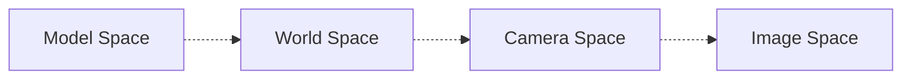

Welcome to Computer Graphics!

In this article, I attempt to describe what graphics means on a broader level. Many of these topics will later be elaborated on (in articles shortlinked here), but are described here as a general overview. 

# An Introduction to Graphics
## What is Graphics?
**Computer graphics** is a field describing how we can communicate visually using a display, often to a human user. It is a cross-disciplinary field combining a wide variety of topics, such as:
- **Physics**: Models physical natures such as light, and enables simulations for animation.
- **Mathematics**: Lays the underlying basis for shapes
- **Human Perception**: Determines how we should allocate resources to communicate with our user in the best (and most efficient) way.
- **Engineering**: Used in optimizations of bandwidth, memory, and processing time.
- **Human Computer Interaction**: Determines how we can best link interactable input devices to our program, which influence the display!

> User interfaces are often a very understated part of graphics, so much so that UI research is its own field!

> [!Warning] Misconceptions About Graphics
> Some people may say that computer graphics is smply the practice of taking a scene and creating an image of this scene.
>
> While this is true, **this grossly underestimates what graphics is really about**! Graphics is far richer than this - and to make such images, we need to make many assumptions and decisions that are influenced by the aforementioned fields, which can become quite complex.

Graphics is a rapidly developing field, and technology as well as public expectaations are changing by the day.
> On the academic side of graphics is an association known as SIGGRAPH! 

That being said, as things change, it's always important to stay true to the following principles: 

> [!Tip] The Know Your Problem Principle
> Always know what problem you're attempting to solve.

> [!Tip] The Approximate the Solution Principle 
> Always approximate the solution, not the problem. There are so many widely used approximations, that it can often become easy to forget what we're actually approximating!

> [!Tip] The Wise Modeling Principle
> When modeling a phenomenon, **always** understand what you're modeling and your goal in modeling it! 
> 
> Only then should you choose the right representation to capture this abstraction within the bounds of our resources. 

At the end of the day, it's important to understand that our eventual goal is **visual communication**, often to a human. This goal should influence everything we do, and should always be considered!

> [!Info] Graphics APIs
> There are many software abstractions of graphics out there known as **Graphics Application Programming Interfaces (APIs)**. These can range in complexity, and provide a higher level system to incorporate graphical elements into an application.

## A Brief History of Graphics
Graphics in the past was vastly different from what we're used to today.

In the past, the high cost of computation meant that any display had to have some sort of value. We simply could not afford to perform a lot of computations per pixel, and this meant that a lot of processing had to be grossly simplified or approximated. 

Over the years, however, technology has improved, and so have graphics displays. We've shifted from vector devices to **raster devices**, which display an array of small dots (pixels), and these devices have slowly increased **resolution** and **dynamic range** over the years!
- **Resolution**: How small these individual dots (pixels) are; how many pixels a raster device has.
- **Dynamic Range**: The ratio of the brightest to dimmmest possible pixels.

In fact, like other technology, graphics technology has progressed in accordance with **Moore's Law**, and graphics architecture is becoming increaingly more parallel!

A major leap we've made recently, is the introduction of the **programmable graphics card (GPU)**. Now, instead of simply sending polygons or images to a graphics card to be manipulated, applications can now send programs! These are known as **shaders**, and have opened up a whole new realm of effects and possibilities, all without taking up more CPU cycles!

# Basic Graphics Systems
## Modern Graphics Systems
In a modern graphics system, we typically have interaction devices (ex. keyboard, mouse), a CPU, a GPU, and a display.

A typical graphics program will run in the CPU, which will do a variety of tasks including:
- Input processing
- Physics handling
- Animations

> [!Info] Interaction in Graphics Systems
> Often, graphics programs will support user interaction by having two parallel threads for execution - one for the main program, and the other for handling interaction.
>
> Each component of the **graphical user interface (GUI)** of a program is typically associated with a **callback procedure** in the main program, which uses the main thread to execute something in the main program.

And then pass instructions to the GPU, to process what should be displayed. The visuals produced by the GPU are then displayed, prompting further user interaction, repeating our cycle!

> [!Tip] Limitations of Graphics
> The real world is complex, and it will always be the case that we cannot 100% accurately model and simulate all of it. Thus, approximations are necessary so that we can run our graphics programs at consistent speeds. 
>
> Common representations and approximations used throughout all of graphics are described more in [[Standard Representations]].

## The Graphics Pipeline
To describe how the graphics rendering portion of a system works, we typically describe it using an abstraction known as the **graphics pipeline**. We call it a pipeline, as it describes a sequence of steps that need to take place to transform our mathematical model of some scene to pixels on the screen!
> Such a pipeline used to be fixed and unchangeable, but with recent introductions of shaders, this pipeline is now programmable! 

Generally,the graphics pipeline consists of 4 main parts:
1. **Vertex Geometry processing and Transformation:** In this stage, a geometric description of an object is combined with certain transformations to compute their actual positions in space. 
2. **Triangle Processing and Fragment Generation**: Polygons of a transformed mesh are processed to convert them from triangles into groups of pixels (called **fragments**) on the display, in a process called **rasterization**.
3. **Texturing and Lighting:** Generated pixels are then assigned colors based on textures of an object, lighting in the scene, and other material properties. 
4. **Fragment-Combination Operations**: Finally, these pixels are all combined to assemble our final image!

These stages are all described more in detail in other articles.
> In modern pipelines, all of these stages are typically done on graphics processing units (GPUs), which allow massively parallel operations for effiency.

Below, we describe how graphics data is commonly represented and transformed as it moves through this pipeline.

### Transformation of Graphics Data

Typically, models of objects in a graphics program are created and represented in a convenient coordinate system known as the **modeling space (object space)**. In this space, these models are centered at the origin $(0,0)$, and their vertices and edges are described as points from this origin.

Then, these models are placed in a **scene**, which contains collection of models and light sources. Each object has coordinates offseting its modeling space coordinates, describing its location in what's known as **world space**. 

To render objects in world space, we convert them into the local coordinate space for a given camera, known as **camera coordinates**. Computation of these camera-space coordinates is fairly simple, and is often provided by the graphics platforms.

These camera coordinates are then transformed into **normalized device coordinates** between $-1 < x,y < 1$ and $0 < z$, which allows for easy removal of objects outside of these bounds to avoid unnecessary processing.

These normalized coordinates for the model are then transformed into **pixel coordinates** on the screen, describing how the model colors different pixels on the screen. This is sometimes also referred to as **image space**.

Between each of these conversions may have extra operations, such as lighting, which are described more in other articles.

