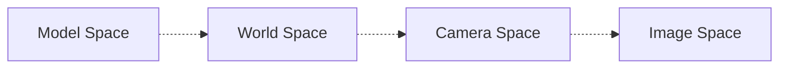

Welcome to Computer Graphics!

# Introduction
## Defining Computer Graphics
When we think about computer graphics, we will often think of some animated film like the one below. 

> [!Example]-
> ![[ToyStory.jpeg]]

Computer graphics is indeed prominent here, but it is also much more pervasive in computer science than this! More generally, **computer graphics** refers to the use of computers to synthesize visual information for a human to consume! With nearly 30% of the human brain dedicated to visual processing, the eyes are one of the most prominent ways to relay information to people!
> In more modern times, graphics has evolved to include not just visuals, but also any **sensory stimuli**.

To just "create visual information" sounds deceptively simple. To make images, we not only need to use information from many other fields, but we also need to figure out how to convey all of the information visually to a human! In fact, computer graphics is a very deep and cross-disciplinary field that combines a wide variety of topics, including: 
- **Physics**: Models physical natures such as light, and enables simulations for animation.
- **Mathematics**: Lays the underlying basis for shapes
- **Human Perception**: Determines how we should allocate resources to communicate with our user in the best (and most efficient) way.
- **Engineering**: Used in optimizations of bandwidth, memory, and processing time.
- **Human Computer Interaction**: Determines how we can best link interactable input devices to our program, which influence the display!

> User interfaces are often a very understated part of graphics, so much so that UI research is its own field!

## Overview 
All of the applications of computer graphics require very sophisticated theories and systems. 

In terms of theory, we have (broadly):
- **Basic Representations**: How do you digitally encode shape and motion?
- **Sampling & Aliasing**: How do you acquire and reproduce a signal?
- **Numerical Methods**: How do you manipulate signals numerically?
- **Radiometry & Light Transport**: How does light behave?
- **Perception**: How does this all relate to humans?
- ...

In terms of systems, we have (broadly):
- **Parallel, Heterogeneous Processing**
- **Graphics-Specific Programming Languages**
- ...

# The Rasterization Pipeline
## Overview
One of the major techniques for rendering objects onto our screen is **rasterization**:

For every primitive (e.g. triangle), what pixels light up?
> This can be extremely fast, but this comes at the cost of quality. It can, in some cases, be difficult to achieve photorealism with rasterization. 

To generate 3D images with rasterization, it helps to think about the generation in terms of a "pipeline". Each stage of the pipeline will have a simple input and output, each of which can be combined to generate the final image. 
> Each of these stages, if treated independent of one another, can be ran on the GPU! This is why rasterization can be so fast.

- **Input**: A collection of 3D primitives (triangles), with possibly additional attributes, like color.
- **Output**: A bitcamp image, possibly with additional information like depth and alpha. 

> [!Info] Why Triangles?
> In the graphics pipeline, we draw **all primitives as triangles**, even points and lines! But why? Some reasons include:
> - Triangles can approximate nearly any shape.
> - Triangles are always planar with a well-defined normal.
> - It's easy to interpolate data at the corners of the triangle.
>
> Most importantly, once we reduce everything down to triangles as a "base unit", we can focus on making a well-optimized pipeline for just drawing triangles!

A rough sketch of the rasterization pipeline is as follows:

```mermaid
graph LR
Input -.-> Transformation -.-> Projection -.-> Sampling -.-> Interpolation -.-> Shading -.-> 1[Final Image]
```

1. **Transformation**: We transform / position objects in the world
2. **Projection**: We project the 3D objects onto the 2D screen
3. **Sampling**: For each triangle, we sample the triangle coverage for pixels on the screen.
4. **Interpolation**: For the covered samples, we interpolate the triangle attributes
5. **Shading**: We add textures and evaluate shaders to modify the attributes we have
6. **Final Image**: We combine every samples into a final image.

## ...

## Stage 3: Sampling
Say we have some triangles on the screen. Then, we have two questions to answer:
- **Coverage**: What pixels does each triangle overlap?
- **Occlusion**: What triangle is closest to the camera in each pixel?

> This is also known as the **visibility problem**. 

### Coverage
Consider a triangle with projected position of vertices $P_0, P_1, P_2$. Given our pixel grid, we want a set of pixels that are "covered" by the triangle.

But what does it mean for a pixel to be covered by a triangle? What triangles in the below image cover our pixel? 

> [!Example]- Example: Coverage 
> ![[CoverageP1.png]]
>
> Some of the triangles (3,4) seem obvious, while others (2,1) are less obvious. How can we address this?

The most intuitive idea one may think of is to simply color the pixel according to the fraction of pixel area covered by the triangle, not just a flat "0" or "1" indicating if the pixel is covered or not. 

But real scenes are complicated! If we had multiple triangles in the same pixel (potentially overlapping), it would be very impractical to compute the exact percentage of the pixel covered by each triangle. 

Instead, we will view coverage as a **sampling problem**. For any given pixel, we will take many samples, and use them to approximate the coverage of our pixel! If we smartly choose our points, and choose enough points, we'll get a very close approximation of the actual coverage!

> [!Info] Sampling Basics
> Suppose we have some sort of curve representing our actual data $f(x)$, and we sample multiple points along this curve $x_1, x_2, \dots$. 
>
> With these samples, there are many ways we can try to reconstruct our actual data, such as: 
> - Piecewise Constant (Nearest Neighbor): For any $x$, we choose the value of the sample closest to $x$. 
> - Piecewise Linear: For any $x$, we take the value along the line connecting the two samples $x$ is adjacent to. 
> - ...
>
> By the spacing of our samples, however, we risk losing information about our original data! And in fact, there are cases where poor sampling lead to reconstructions that misrepresent our original data!
> 
> > [!Example]- Example
> > 
> > As a simple example, suppose our function is $sin(x)$. If we sample at every $x = k * \pi$, then our samples always yield 0, making our reconstruction seem like a 0 function! This will completely misrepresent our original data.

In our coverage case, we're trying to sample the coverage function
$$
\text{Coverage(x,y)} = 
\begin{cases}
1 & \text{Triangle Contains } (x,y) \\
0 & \text{Otherwise}
\end{cases}
$$

So for each sample, we evaluate the coverage function at that sample! 

Note that this does still can leave some ambiguities.
- What if each sample 

https://www.youtube.com/watch?v=B0hsT2npIc0&list=PL9_jI1bdZmz2emSh0UQ5iOdT2xRHFHL7E&index=5&ab_channel=KeenanCrane

30:03 Breaking Ties

## ...

# Ray Tracing
...

# Resources
Some helpful resources can be found below:
- [CMU 15-462](https://www.youtube.com/watch?v=PhxV_JrXeVk&list=PL9_jI1bdZmz2emSh0UQ5iOdT2xRHFHL7E&index=2&ab_channel=KeenanCrane)
- [MIT 6.837 - Introduction to Computer Graphics](https://www.youtube.com/watch?v=-LqUu61oRdk&list=PLQ3UicqQtfNuBjzJ-KEWmG1yjiRMXYKhh&ab_channel=JustinSolomon)
- [University of Utah CS 4600 - Introduction to Computer Graphics](https://graphics.cs.utah.edu/courses/cs4600/fall2021/)

https://www-graphics.stanford.edu/courses/cs248-96-winter/Lectures/

https://gfxcourses.stanford.edu/cs248/winter22

https://www.youtube.com/watch?v=-LqUu61oRdk&t=15s&ab_channel=JustinSolomon

---

...

Graphics is a rapidly developing field, and technology as well as public expectaations are changing by the day.
> On the academic side of graphics is an association known as SIGGRAPH! 

That being said, as things change, it's always important to stay true to the following principles: 

> [!Tip] The Know Your Problem Principle
> Always know what problem you're attempting to solve.

> [!Tip] The Approximate the Solution Principle 
> Always approximate the solution, not the problem. There are so many widely used approximations, that it can often become easy to forget what we're actually approximating!

> [!Tip] The Wise Modeling Principle
> When modeling a phenomenon, **always** understand what you're modeling and your goal in modeling it! 
> 
> Only then should you choose the right representation to capture this abstraction within the bounds of our resources. 

At the end of the day, it's important to understand that our eventual goal is **visual communication**, often to a human. This goal should influence everything we do, and should always be considered!

> [!Info] Graphics APIs
> There are many software abstractions of graphics out there known as **Graphics Application Programming Interfaces (APIs)**. These can range in complexity, and provide a higher level system to incorporate graphical elements into an application.

## A Brief History of Graphics
Graphics in the past was vastly different from what we're used to today.

In the past, the high cost of computation meant that any display had to have some sort of value. We simply could not afford to perform a lot of computations per pixel, and this meant that a lot of processing had to be grossly simplified or approximated. 

Over the years, however, technology has improved, and so have graphics displays. We've shifted from vector devices to **raster devices**, which display an array of small dots (pixels), and these devices have slowly increased **resolution** and **dynamic range** over the years!
- **Resolution**: How small these individual dots (pixels) are; how many pixels a raster device has.
- **Dynamic Range**: The ratio of the brightest to dimmmest possible pixels.

In fact, like other technology, graphics technology has progressed in accordance with **Moore's Law**, and graphics architecture is becoming increaingly more parallel!

A major leap we've made recently, is the introduction of the **programmable graphics card (GPU)**. Now, instead of simply sending polygons or images to a graphics card to be manipulated, applications can now send programs! These are known as **shaders**, and have opened up a whole new realm of effects and possibilities, all without taking up more CPU cycles!

# Basic Graphics Systems
## Modern Graphics Systems
In a modern graphics system, we typically have interaction devices (ex. keyboard, mouse), a CPU, a GPU, and a display.

A typical graphics program will run in the CPU, which will do a variety of tasks including:
- Input processing
- Physics handling
- Animations

> [!Info] Interaction in Graphics Systems
> Often, graphics programs will support user interaction by having two parallel threads for execution - one for the main program, and the other for handling interaction.
>
> Each component of the **graphical user interface (GUI)** of a program is typically associated with a **callback procedure** in the main program, which uses the main thread to execute something in the main program.

And then pass instructions to the GPU, to process what should be displayed. The visuals produced by the GPU are then displayed, prompting further user interaction, repeating our cycle!

> [!Tip] Limitations of Graphics
> The real world is complex, and it will always be the case that we cannot 100% accurately model and simulate all of it. Thus, approximations are necessary so that we can run our graphics programs at consistent speeds. 
>
> Common representations and approximations used throughout all of graphics are described more in [[Standard Representations]].

## The Graphics Pipeline
To describe how the graphics rendering portion of a system works, we typically describe it using an abstraction known as the **graphics pipeline**. We call it a pipeline, as it describes a sequence of steps that need to take place to transform our mathematical model of some scene to pixels on the screen!
> Such a pipeline used to be fixed and unchangeable, but with recent introductions of shaders, this pipeline is now programmable! 

Generally,the graphics pipeline consists of 4 main parts:
1. **Vertex Geometry processing and Transformation:** In this stage, a geometric description of an object is combined with certain transformations to compute their actual positions in space. 
2. **Triangle Processing and Fragment Generation**: Polygons of a transformed mesh are processed to convert them from triangles into groups of pixels (called **fragments**) on the display, in a process called **rasterization**.
3. **Texturing and Lighting:** Generated pixels are then assigned colors based on textures of an object, lighting in the scene, and other material properties. 
4. **Fragment-Combination Operations**: Finally, these pixels are all combined to assemble our final image!

These stages are all described more in detail in other articles.
> In modern pipelines, all of these stages are typically done on graphics processing units (GPUs), which allow massively parallel operations for effiency.

Below, we describe how graphics data is commonly represented and transformed as it moves through this pipeline.

### Transformation of Graphics Data

```mermaid
graph LR
    1[Model Space] -.-> 2[World Space] -.-> 3[Camera Space] -.-> 4[Image Space];
```

Typically, models of objects in a graphics program are created and represented in a convenient coordinate system known as the **modeling space (object space)**. In this space, these models are centered at the origin $(0,0)$, and their vertices and edges are described as points from this origin.

Then, these models are placed in a **scene**, which contains collection of models and light sources. Each object has coordinates offseting its modeling space coordinates, describing its location in what's known as **world space**. 

To render objects in world space, we convert them into the local coordinate space for a given camera, known as **camera coordinates**. Computation of these camera-space coordinates is fairly simple, and is often provided by the graphics platforms.

These camera coordinates are then transformed into **normalized device coordinates** between $-1 < x,y < 1$ and $0 < z$, which allows for easy removal of objects outside of these bounds to avoid unnecessary processing.

These normalized coordinates for the model are then transformed into **pixel coordinates** on the screen, describing how the model colors different pixels on the screen. This is sometimes also referred to as **image space**.

Between each of these conversions may have extra operations, such as lighting, which are described more in other articles.

