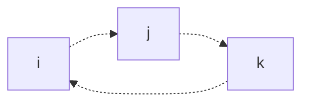

In this article, we describe what **Quaternions** are, how to use them, and their applications in Computer Graphics.

# Defining a Quaternion
## Mathematical Definition
Recall a complex number $c$. All complex numbers can be represented as
$$
c = a + bi
$$
Where $a,b \in \mathbb{R}$, and $i = \sqrt{i}$, the imaginary number.

**Quaternions** were invented as an extension of these imaginary numbers $i$. Mathematically, a quaternion $\hat{q}$ is defined as
$$
\hat{q} = i q_x + j q_y + k q_z + q_w \\
\hat{q} = q_v + q_w = (q_v, q_w) \qquad q_v = iq_x + jq_y + kq_z = (q_x, q_y, q_z)
$$
> Note that $q_v$ is a vector, and can be used with normal vector operations!

Where $q_x, q_y, q_z, q_w \in \mathbb{R}$ are real components of our quaternion, and $i,j,k$ are imaginary units such that
$$
i^2 = j^2 = k^2 = -1 \\
jk = -kj = i \qquad ki = -ik = j \qquad ij = -ji = k
$$
Note that by this definition, multiplication with these units is not commutative.
> Components of each of these imaginary units are closely related to the axes of rotation!

One convenient way of understanding these imaginary unit conversions is by imagining the following cycle

Where for the product of any two units, its result is the third unit, and its sign is determined by if we "follow the arrows" (positive) or not (negative) on this cycle. 

> [!Example]+ Example: Product of Imaginary Units
> Using our cycle above, we see that the product of $i \cdot k$ is j, and as the path from $i$ to $k$ goes against the arrow, our result is negative. Thus,
> $$
> i \cdot k = -j
> $$

## Quaternion Operations
Suppose we have two quaternions $\hat{q}$ and $\hat{r}$.
$$
\hat{q} = i q_x + j q_y + k q_z + q_w \\
\hat{r} = i r_x + j r_y + k r_z + r_w
$$

Then, the following operations are defined.

$$
\begin{align*}
    &\text{Product} &\hat{q} \cdot \hat{r} = (q_v \times r_v + r_w q_v + q_w r_v, q_w r_w - q_v \cdot r_v)  \\
    &\text{Addition} &\hat{q} + \hat{r} = (q_v + r_v, q_w + r_w) \\
    &\text{Conjugate} &\hat{q}^* = (-q_v, q_w)  \\
    &\text{Norm} &n(\hat{q}) = ||\hat{q}|| = \sqrt{\hat{q} \hat{q}^*} = \sqrt{q_x^2 + q_y^2 + q_z^2 + q_w^2}  \\
    &\text{Identity} &\hat{i} = (0,1) 
\end{align*}
$$
> These operations can easily be defined by considering their normal meanings, and applying them to the quaternions as so. See below for an example derivation.

> [!Example]+ Example: Quaternion Product
> We calculate the product of two quaternions below, by considering their definition, taking the product, and distributing.
> $$
> \begin{align*}
>     \hat{q} \cdot \hat{r} 
>     &= (iq_x + jq_y + kq_z + q_w) (ir_x + jr_y + kr_z + r_w) \\
>     &= i(q_y r_z - q_z r_y + r_w q_z + q_w r_x) + j(q_z r_x - q_x r_x + r_w q_y + q_w r_y) \\
>     &+ k(q_x r_y - q_y r_x + r_w q_z + q_w r_z) \\
>     &+ (q_w r_w - q_x r_x - q_y r_y - q_z r_z) \\
>     &= (q_v \times r_v + r_w q_v + q_w r_v, q_w r_w - q_v \cdot r_v 
> \end{align*}
> $$

From these definitions, we can define a variety of other rules! They are given below.
$$
\begin{align*}
    &\text{Multiplicative Inverse} &\hat{q}^{-1} = \frac{1}{n(\hat{q})^2} \hat{q}^*  \\
    &\text{Scalar Multiplication} &s \hat{q} = (0, s) (q_v, q_w) = (s q_v, s q_w)  \\
    &\text{Conjugate Rules} &(\hat{q}^*)^* = \hat{q}  \\
    &&(\hat{q} + \hat{r})^* = \hat{q}^* + \hat{r}^* \\
    &&(\hat{q} \hat{r})^* = \hat{r}^* \hat{q}^* \\
    &\text{Norm Rules} &n(\hat{q}^*) = n(\hat{q}) \\
    &&n(\hat{q} \hat{r}) = n(\hat{q}) n(\hat{r}) \\
    &\text{Linearity of Multiplication} &\hat{p} (s \hat{q} + t \hat{r}) = s \hat{p} \hat{q} + t \hat{p} \hat{r} \\
    &&(s \hat{p} + t \hat{q}) \hat{r} = s \hat{p} \hat{r} + t \hat{q} \hat{r} \\
    &\text{Associativity of Multiplication} &\hat{p} (\hat{q} \hat{r}) = (\hat{p} \hat{q}) \hat{r}
\end{align*}
$$

# Unit Quaternions
## Definition
A quaternion $\hat{q} = (q_v, q_w)$ is a **unit quaternion** when $||\hat{q}|| = 1$. 

Now suppose we have any 3-dimensional unit vector $u_q$. Using this, we can write a unit quaternion as
$$
\hat{q} = (\sin \theta u_q, \cos \theta)
$$
And observe that
$$
||\hat{q}|| = \sqrt{\sin^2 \theta (u_q \cdot u_q) + \cos^2 \theta} = 1
$$
This definition of unit quaternions is, interestingly enough, extremely well-suited for rotations and orientations!

This is described in the next section.

## Quaternion Transforms
Consider a quaternion $\hat{p} = (p_v, p_w)$, where $p_v$ represents a 3D position in space, and consider a unit quaternion $\hat{q} = (\sin \theta u_q, \cos \theta)$. 

We can prove that the quaternion product
$$
\hat{q} \hat{p} \hat{q}^{-1}
$$
Rotates $\hat{p}$ (and thus our point $p_v$) around the axis $u_q$ by the angle $2 \theta$! Thus, this product is equal to us applying a rotation transform onto our point $p_v$!
> Note that because $\hat{q}$ is a unit quaternion, $q^{-1} = \hat{q}^*$.

By this, and our definition of quaternion product, we see that if we wanted to perform multiple transforms, we have
$$
\begin{align*}
    \hat{r} (\hat{q} \hat{p} \hat{q}^*) \hat{r}^* 
    &= (\hat{r} \hat{q}) \hat{p} (\hat{q}^* \hat{r}^*) \\
    &= (\hat{r} \hat{q}) \hat{p} (\hat{r} \hat{q})^* \\
    &= \hat{c} \hat{p} \hat{c}^*
\end{align*}
$$
Where $\hat{c} = \hat{r} \hat{q}$. In other words, the product of our unit quaternions gave us a new quaternion representing the transform of applying both! 

This provides us a simple operation that gives us a very convenient way to apply rotations on points in 3D space!

### Matrix Conversions
It's often the case that several different transforms need to be applied to a point, and most of these transforms are given in a matrix form.

It can be shown that for our unit quaternion $\hat{q}$, we can convert it to matrix form
$$
M^q = 
\begin{bmatrix}
    1-2(q_y^2 + q_z^2) & 2(q_x q_y - q_w q_z) & 2(q_x q_z + q_w q_y) & 0 \\
    2 (q_x q_y + q_w q_z) & 1-2(q_x^2 + q_z^2) & 2(q_y q_z - q_w q_x) & 0 \\
    2 (q_z q_z - q_w q_y) & 2(q_y q_z + q_w q_z) & 1 - 2(q_x^2 + q_y^2) & 0 \\
    0 & 0 & 0 & 1
\end{bmatrix}
$$

Note that given this, we don't need to compute any trigonometric functions to get our transform! This makes our matrix conversion process very efficient in practice.
