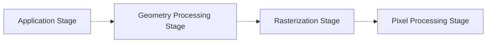

Behind all 3D graphics programs is the **graphics rendering pipeline**. This is the underlying tool which is used to render a two-dimensional image from a scene.

In this section, we discuss what this pipeline is and its various stages. 

# An Overview of the Pipeline
## Pipeline Stages
Like other pipelines, the rendering pipeline describes the process in which we take a 3D scene, and transform its data to produce a 2D image. It consists of multiple stages, which collectively work together to render a scene!

> [!Warning] Variety of Rendering Pipelines
> While this describes a general model for rendering, this is not the only possible rendering pipeline! 
> 
> This pipeline is mostly used in real-time rendering, and offline rendering pipelines have evolved a lot differently.

This pipeline not only provides a conceptual model for how rendering takes place, but a practical one! Many graphics APIs let you program these stages to customize your own rendering. 

The graphics pipeline is roughly divided into 4 stages:
1. **Application Stage**: The program that runs on the CPU, including tasks such as input handling, collision detection, animation, and others.
2. **Geometry Processing Stage**: Handles transforms, projections, and other geometry operations to determine what can be drawn and where it should be drawn.
3. **Rasterization Stage**: Finds all pixels that are considered inside the input triangles.
4. **Pixel Processing Stage**: Executes a program per pixel to determine its color, and other per-pixel operations.

Each of these stages are described more later. Note that each of these stages is typically a pipeline in itself with several substages.

> [!Tip] Parallelism in the Graphics Pipeline
> One of the major advantages of the graphics pipeline is that it is **highly parallelizable**! With the advent of the modern GPU, we can execute stages in parallel, letting us process huge quantities of data in real time (which is absolutely necessary for rendering).
>
> More information about this is covered in [[Parallelization With GPUs]]

Substages in the pipeline all have varying levels of programmability. They range from fully programmable ($P$), to configurable but not programmable ($C$), to completely fixed ($F$). 
> We will use these symbols to denote their programmability.

Over time, the graphics pipeline has evolved to have higher levels of programmability. A major step in this transition, was the introduction of stages we can completely customize using  **programmable shaders**!

Features common to all of these programmable shaders are discussed next.

## Programmable Shader Stages
Modern shader programs use a **unified shader architecture**. This means that all of our various programmable shaders share the same **instruction set architecture**, and thus the same programming model.

> [!Tip] Programming Shaders
> We can program shaders using **shading languages**, such as the **High-Level Shading Language (HLSL)** for DirectX, and **OpenGL Shading Language (GLSL)** for OpenGL.

Processors implementing such a model allow the GPU to allocate their usage based on graphical needs, ensuring that work is ideally distributed to keep processors as busy as possible. 
> Without such a unified model, we'd have to rigidly determine how many processors should be allocated for each shader type! 

Everytime the application wants to draw a group of primitives, it invokes a **draw call**, which will execute the graphics pipeline (with its shaders) on these primitives. During a draw call, each shader stage has two types of inputs:
- **Uniform Inputs**: Values that remain constant throughout a draw call (but can change between draw calls).
- **Varying Inputs**: Data that a shader will take as input (which will change depending on the process), or data the shader will output. 

Shaders support 32-bit single-precision floating point scalars and vectors, as well as arrays, structures, and matrices. Modern GPUs also suport 32-bit integerts, and 64-bit floats natively.

A shader has differing numbers of registers for storing these uniform and varying inputs. It has:
- **Input Registers**: Registers for the shader's varying inputs. There are 16 registers for the vertex shader, 16 for the geometry shader, and 32 for the pixel shader.
- **Temporary Registers**: Registers for intermediate calculations. There are 4096 registers for this.
- **Output Registers**: Registers that store the shader's outputs. There are 16 registers for the vertex shader, 32 registers for the geometry shader, and 8 registers for the pixel shader.
- **Constant Registers**: Registers that store any sort of uniform data for use by the shader. There are 16 buffers of 4096 registers.
- **Textures**: Arrays that store textures (typically images) for use in pixel coloring. There are 128 arrays of 512 textures.

As it does not change between draw calls, uniform data is shared between all of the shaders.
> These numbers are based off of Shader Model 4.0.

Shaders also support two types of **flow control**, referring to the use of branching instructions to change how code executes.
- **Static Flow Control**: Based on the values of uniform inputs. As this is constant across an entire draw call, it does not cause thread divergence, and moreso exists for reusability.
- **Dynamic Flow Control**: Based on the values of varying inputs. More powerful, but can cause thread divergence and thus cost performance. 

# Application Stage
The **application stage** represents code that is executed by the program on the CPU. By this nature, we have a lot of control over what can happen in this stage, and can determine the implementation as we please.

Some processes commonly implemented in this stage are given below:
- Collision detection
- Input detection and handling
- Physics algorithms 

This stage plays a role in the performance of following stages, and there are algorithms we can implement to make later stages more efficient! 
> For example, we could decrease the number of triangles to be rendered, in a process called **culling**.

To work around the serialized nature of this stage, this stage is often executed in parallel on several processor cores, known as a **superscalar construction**.

# Geometry Processing Stage
The **geometry processing** stage is the first GPU stage of the pipeline, and is responsible for a majority of the per-triangle and per-vertex operations. It is divided into the following sub-stages:
1. **Vertex Shading (P)**: Perform a variety of transformations on the vertex to bring it into the world space, and then into the camera space. Evaluate additional desired vertex output data.
2. **Tessellation / Geometry Shading (P)**: Additional (optional) geometry stages.
4. **Clipping (F)**: Clip primitives outside of the view to save on resources.
5. **Screen Mapping (C)**: Map primitives in our view to screen coordinates, for use in the next stage (rasterization).

## Vertex Shading Substage
The vertex shading substage is a fully programmable stage where we apply per-vertex transformations, and evaluate extra outputs that we configure later stages of the pipeline to use.

### Pre-Stage: Input Assembler
Before the vertex shader actually executes, some data manipulation must occur.

In what's called the **input assembler stage** (DirectX), streams of data can be woven together to form the vertices and primitives sent down the pipeline. There are various ways data for objects is represented; and the input assembler manipulates it into a uniform format for the pipeline to take.

> [!Tip] Instancing
> The input assembler also provides support for **instancing**, where an object can be drawn several times with some varying data per instance. 
> 
> This allows for one object to be drawn several times with varying data, all with a single draw call.

### Vertex Transformations
In a graphics engine, we often use a variety of **coordinate systems**, as different systems make it convenient to represent data. Typically, models will reside in their own **model space** - where their geometries are defined from the origin - and will have an associated **model transform** to position and orient the model.
> By this system, it's possible to have multiple model transforms associated with one model, allowing the same model to be reused multiple times (saving memory)! 

However, to render these models, we need to be able to apply these model transforms to convert them into the same space, known as the **world space**.

For all scenes, there exists a "camera" we render our scene from. This camera has an orientation and a position, and only the models within the view of the camera can be seen from our screen, where objects outside this view are removed in a process called **clipping**.

To make these operations more convenient, we'll transform each of our models from the world space into the camera's space, known as the **view space**. In this space, the camera is looking along the $+z$ axis (by convention), making it easy to determine whether or not an object can be seen by the camera or not.

### Additional Output Evaluations
Note that to produce any scene, it's typically not enough to only render the shape and positions of objects. Oftentimes, we need to include additional information as well, such as:
- Information about the object's material, including normals, colors, and other numerical information.
- Information about lighting around the object, which is typically computed (in a process known as **shading**) using the object material information.

These will be discussed more later.

## (Optional) Tessellation and Geometry Shader Stages
Alongside the above vertex processing, which occurs in all pipelines, there are also additional optional stages which can be used. The use of these stages depends on the hardware and programmer, and they are not commonly used.

### Tessellation
The first stage is **tessellation**, which allows for the rendering of curved surfaces. Given a view, this stage provides control over the **level of detail (LOD)** we need to render a curved surface, which can help us save on performance! 

The tessellation stage consists of 3 elements:
1. **Hull Shader**: A special **patch** primitive is received, representing a curved surface. The hull shader takes this, modifies these patches, and outputs them to the tessellator to tell it how many triangles to generate.
2. **Tessellator**: A fixed-function stage which adds several new vertices for processing. It receives information from the hull shader about how tessellation should be done.
3. **Domain Shader**: Similar to a vertex shader, takes the vertex inputs from the tessellator and processes them to generate an output vertex, to be passed further into the pipeline.

### Geometry Shader
The next stage is the **geometry shader**, which allows for the transformation of primitives into other primitives. This way, it can selectively modify meshes, by editing vertices, adding new primitives, and removing others.
> This stage is commonly used in particle systems (ex. each "particle point" can be transformed into a triangle in this stage).

### Stream Output
Alongside these two optional stages, we also have the ability to save our intermediate outputs somewhere, in a stage referred to as **stream output**.
> This stage is referred to as **transform feedback** in OpenGL.

This lets us save the output of these stages to an array for further processing. This output can then be used by the CPU, or the GPU itself in a later pass.

## Clipping & Perspective Division
After transforming our vertices into the viewing space, note that there may be many shapes outside of our view. As these shapes are outside, they won't be rendered, making it inefficient to pass their data to later stages for further processing.

To avoid these inefficiencies, we perform **clipping**, which removes these shapes outside of the view.
- Shapes completely outside of the view are removed altogether.
- Shapes that are half inside, half outside of the vieware divided by this view boundary, and only the parts inside are kept. This process is known as **sectioning**.

> This clipping step uses all 4 values of the shape's coordinates ($x,y,z,w$), as values do not interpolate linearly across a triangle in perspective space.

Typically, for consistency (and efficiency), we clip against the unit cube ranging from $(-1,-1,-1)$ to $(1,1,1)$ (the previous transforms are typically configured to do this).

After clipping, we perform **perspective division**, where the coordinates are divided by the $w$ coordinate, converting them into **normalized device coordinates**. These coordinates can then be used and converted to screen (pixel) coordinates. 

## Screen Mapping
After clipping our shapes, we now need to perform **screen mapping**, where we convert our coordinates into **screen coordinates**. 

In other words, assuming we have a window with bottom-left corner $(x_1, y_1)$ and $(x_2, y_2)$, we want to transform our shape coordinates into the corresponding coordinates on the screen. Oftentimes, we will also convert the $z$ coordinate too (to a value between 0 and 1) so we know which shapes are in front of each other.

# Rasterization
The **rasterization stage** takes the transformed vertices (with their associated data) and finds all pixels that are inside of each shape being rendered. This process is divided up into 2 substages:
1. **Triangle Setup (Primitive Assembly)**: Computes data (such as edge equations and differentials) for the triangle that are used in the next stage.
2. **Triangle Traversal**: Finds what pixels are inside of a triangle, generating a **fragment** for the parts of pixels overlapping the triangle. Fragment properties are generated using data (perspective-correct) interpolated from the 3 triangle vertices.

All pixels that have their centers covered by a triangle are checked, and a **fragment** is generated for the part of th 

These pixels found (and their associated data) are then passed onto the next stage.

> This stage is also sometimes called **scan conversion**, as we convert 2-dimensional vertices in screen space into pixels onto the screen.

## Pixel Processing
The **pixel processing** stage takes all of the pixels found from the previous stages, and performs per-pixel operations on each pixel inside of a shape. It is divided into two substages:
1. **Pixel Shading**: Performs per-pixel computations.
2. **Merging**: Stores information for pixels together to generate an output image. 

### Pixel Shading
After receiving pixel data from the rasterizer, we often want to perform extra operations on individual pixels. 

These per-pixel operations are performed by the fully programmable pixel shader stage, which receives pixels (and associated data) which it can output a color for. 

A wide variety of operations can be performed here, with the most common being **texturing**. In this operation, we sample an image at a point (as determined by the pixel's data), and assign the color at that point in the image to the pixel. This lets us "glue" images onto our shapes!

### Merging
After performing per-pixel operations, the resultant pixels are merged into a **color buffer**, a rectangular array of colors (RGB). This stage determines how these pixels are combined with the color already stored in the buffer, and different operations here can enable various effects.

In most programs, this stage has a **depth buffer (z buffer)**, which is the same size and shape as the color buffer, storing distance ($z$-value) to the closest primitive. This buffer is then used to determine if a computed pixel is behind or in front of the already existing pixel.
1. If the computed pixel is in front of the existing pixel, then we choose the computed pixel and update the depth value.
2. If the computed pixel is behind the existing pixel, then we do nothing
This ensures that objects correctly obscure each other in the view.

> Sometimes, this is even performed before the pixel shading stage, to avoid executing unnecessary computations.

> [!Info] Transparent Primitives
> It's important to note that the $z$-buffer only stores a single depth, so it cannot store partially transparent primitives. Thus transparent primitives **must** be rendered after our opaque primitives, in back-to-front order (farthest to closest).

Alongside the depth buffer and color buffer, the merger substage supports a variety of other buffers to capture and filter pixel information. 
- **The Alpha Channel** is a buffer associated with the color buffer, storing an opacity value for the associated pixel.
- **The Stencil Buffer** is an offscreen buffer (typically storing 8-bits per pixel) used to record locations of the rendered primitive, to control where rendering in the color buffer / z-buffer can take place.
  
  > For example, we can constrain rendering within a circle on the screen! This is highly useful for special effects.

All of the buffers in this stage are cumulatively stored in what's known as a **frame buffer**. All of these buffer operations are called **raster (blend) operations**.

