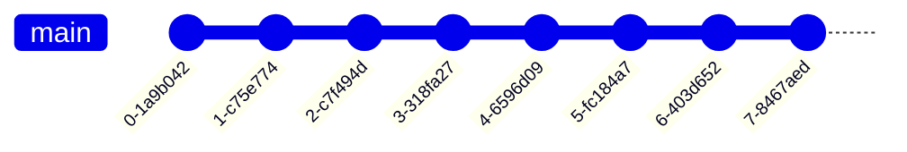

Created by Linus Torvalds in 2005, **Git** is a popular version control system, providing highly useful functionality for tracking code changes across multiple collaborators.
> Git and GitHub are not the same! However, we can use Git with GitHub to collaborate with others.

Here, we will cover the basics of Git, and how to use it in a production environment.

> [!Info] Git Help
> Use `git help` for additional information on Git commands!

# Initializing and Configuring Git
To begin our journey with Git, we first need to make sure it is installed on our system. If the device does not have it, we can download it [here](https://git-scm.com/). To confirm that Git is installed, check its version:
```bash
git --version
```

Now that Git is installed, we can use it to track our changes! To begin, we can create a Git repository. Navigate to a directory, and set up Git tracking on it using `git init`.
```bash
git init # Initializes Git for the Current Directory
```

Then, we can configure our information using the `git config` command. This command will set our information for the current repository only. To set a configuration for all repositories on the computer, use the `--global` option.
> To see all configurations, use the `-l` (list) option. 

In particular, we want to make sure that we have configured our user information, as an identifier for our commits. 

```bash
git config user.name [username] # Configure User Name
git config user.email [email]   # Configure Email
```

# Tracking Changes with Git
## The Staging Environment
After initializing Git in our desired directory, how can we use Git to track changes?

To implement version control, Git has a concept of **commits**, which are bundles of file changes, such as file additions, removals, and modifications. 



Commits are generally used to delimit different milestones for a project, as Git tracks the repository's state between these commits. To view the commits for a branch (covered later), use `git log`.
> By tracking the repository using commits, Git makes it super easy to track features added to our repository, and revert changes as needed!

```bash
git log # View Commits
```
> Include the `--oneline` option to limit every commit display to one line!

To create a new commit to our repository, we must first **stage** our file changes. This adds file changes to Git's **staging environment**, which tracks all changes which will be committed next.

To stage a file change to our staging environment, we can use `git add`. To remove a staged change, use `git rm`. 

```bash
git add [file] # Stage a File Change
git rm [file] # Remove a Staged Change 
```
> We can use regular expressions to stage multiple files at once - use `.` to stage all files from the current directory!

To view our staging environment, use `git status`. This will display the changes that have been staged (and will be present in the next commit), as well as changes that have not yet been staged (and will not be present in the next commit).

```bash
git status # View Staging Environment
git -s status # Same as above, but more compact (short)
```

By tracking changes in a staging environment, Git conveniently provides a way to revert changes as needed. To revert a file change, we can use `git restore`, which will restore a file's state to its last stage / commit.

```bash
git restore # Restore a File to its Last Stage / Commit
```
> To add staged files, remove staged files, or restore all files, we can also use the `--all` option!

Finally, to commit all changes we have staged, we use the `git commit` command! Typically, we will also add a message using the `-m` option, describing what we have accomplished in this commit.

```bash
git commit -m [message] # Commit all staged changes
```

To commit changes directly without any staging, we can use the `-a` option, to automatically stage every changed, already tracked file (generally not recommended).
> If you want to view your changes prior to making a commit, run `git diff` to see all of the changes you've made!

## Branching
In addition to the staging environment, Git also supports **branching**, allowing us to create new/separate versions of the original repository. We can then work on these different versions, without changing the original repository.
> This lets us work on different parts of the project separately, which can be super useful when collaborating with other people (that way, our changes won't conflict with others)!


Typically, we reserve the main branch for a stable / production ready build, and use branches to develop features. This way, we always maintain a working build!

To create a new **branch**, we use the `git branch` command. This will create a new version of our current branch, with all changes up to (and including) the most recent commit. 

```bash
git branch [branch name] # Create a New Branch
```
> To view our branches simply use `git branch` without any arguments. To delete a branch, use the `-d` option.

To switch between branches, use `git checkout`. We can also use this command to create a new branch, by using the `-b` option.

```bash
git checkout [branch name] # Switch to Another Branch
```
> We can checkout remote branches too (covered later)! When this happens, Git will automatically set up tracking for our local branch (so we can sync it with the remote!).

Once in our new branch, we can work and commit our changes as normal! Once we're ready to bring our changes back to the main branch, we can **merge** our branches together using `git merge`. 
This will merge our current branch with the target branch, so that they both have the same changes.

```bash
git merge [branch name]
```

However, sometimes the merge can fail, because the same file was modified (in the same places) in both branches! When this happens, we obtain a **merge conflict**. To fix this, open the files of conflict, resolve the differences, and stage (and commit) as normal.
> We can use `git status` to see conflicting files!


# Collaborating with GitHub
Here, we learn how to use Git with GitHub, a hosting service for Git repositories online!

## GitHub Repositories
To begin using GitHub, we must have a GitHub repository to work on. To do this, we can either create our own, or work off of someone else's! 

To create our own, simply navigate to GitHub's top-right menu, and create a new repository.

To work off of someone else's, we need to **fork** their repository, or in other words, create a copy of it. This can be done by navigating to their repository page, and clicking the "Fork" button.

## Cloning GitHub Repositories
Now that we have our repository on GitHub, we want to create a copy on our local machine to work on it! To do this, we will create a **clone** of our repository, a full (local) copy of a repository.

To clone a repository, first navigate to the repository page, and obtain the repository's **Git URL (`.git`)**. This can be found in the "Code" dropdown on the top-right of the repository code box. Then, we pass this URL into the `git clone` command:

```bash
git clone [git url]
```
> We can also add a path as another argument after the Git URL to specify which folder to clone the repository to!

This will create a copy of the repository on our machine, in a new directory named after the cloned project. This copy will have a **remote branch** pointing to the Git URL, which we can later use to download / upload changes as needed! 
To see the different remote branches in our repository, run `git remote show`.

```bash
git remote -v # Show Remote Branches
```
> We can also use `git branch -r`!

Remote branch names take on the form `<remote>/<branch>`, where `<remote>` is any identifier helping identify the remote branch's purpose.
> Git automatically uses `origin/master` when cloning a repository, and creates a local branch `master` (starting at the same commit) for our own changes!

We can now make changes as normal to our local copy of the repository! 

## Pulling (Downloading) Changes
As we often use GitHub for collaboration, it is to be expected that our local clone will naturally go out of date as others commit to the remote repository.

To keep our repository up to date, we perform a **pull**, which performs two operations:
1. Performs a **fetch**, getting all of the change history of a tracked branch (or repository).
   ```bash
   git fetch [remote] # Fetches Change History from GitHub
   ```
1. Performs a **merge**, combining the current branch with another branch. For these purposes, we merge our branch with that of a remote, to sync changes on the remote.
   ```bash
   git merge [remote]/[branch] # Syncs Changes on the Remote
   ``` 

Instead of running these two commands though, Git conveniently provides the `git pull` command, to automatically update our branch with that of the remote.

```bash
git pull [remote] [remote branch] # Updates Branch with Changes from the Remote
```
> We can also just run `git pull` to pull all changes for the entire repository!


If we have a branch that only exists on the remote but not on the local, we can easily access it using the standard `git checkout` command. 
For example, say we have a remote branch `origin/example-branch`. We can access it locally by running

```bash
git checkout example-branch
```
> Git will automatically set up the branch to track the remote branch!

## Pushing (Uploading) Changes
Now say that we have written some changes to our local clone, and want to upload these changes to GitHub for others to access.

To upload our changes, we perform a **push**, which uploads all of our commits to the remote branch.

```bash
git push [remote]
```


If our branch only exists on the local, and there is no corresponding branch on GitHub, we can create a new remote branch on GitHub by including an additional branch name argument.

```bash
git push [remote] [remote branch name]
```


## Pull Requests
Say we forked from someone else's repository. After making our appropriate changes on our fork using pull and push requests, how can we upload our changes to the original repository?

To do this, we can make a **pull request**, requesting the original repository's owner to make a pull on our fork, to update their repository with our changes. 
> This must be done on the GitHub website itself!


# Advanced Git Features
## Stashing Changes
Say we urgently need to switch contexts (ex. to another branch) to fix a high-priority bug. To do this, we want to move our current changes out of the way, but without committing them (they're unfinished)!

Luckily, Git provides a **stashing** feature, allowing us to temporarily store all of our uncommitted local changes safely out of the way of our working tree.

To stash our changes, run `git stash`.

```bash
git stash # Stash Local Changes
```

This will store our local uncommitted changes to a stash, which acts as a stack! Stashing additional times will add another item to the top of the stash.

To restore our changes, we can `pop` them from the stash.

```bash
git stash pop # Restore Stashed Changes
```

Running `pop` will reapply the **last stashed state**, and delete it from the stash. If we want to reapply a specific item in the stash, we can specify the index of that item:

```bash
git stash pop stash@{2} # Restores Stashed Item with Index 2
```
> The stash is 0-indexed!
