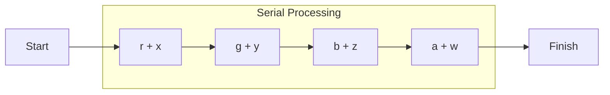
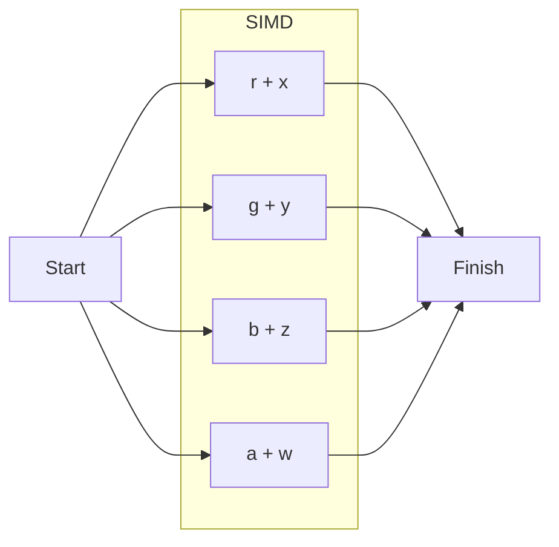

> [!Info] Handy Links
> - [Practical SIMD Programming](http://www.cs.uu.nl/docs/vakken/magr/2017-2018/files/SIMD%20Tutorial.pdf)
> - [A Practical Guide to SSE SIMD](http://sci.tuomastonteri.fi/programming/sse) 

# SIMD: At a Conceptual Level
**Single Instruction, Multiple Data (SIMD)** is a form of **instruction level parallelism** on the CPU, which is the capability to execute multiple instructions in the same cycles / threads. This is achieved through SIMD's use of **vector operations**, single instructions that operate on multiple inputs at the same time. 
> SIMDs are highly useful for heavy mathematical computations which require simple, repetitive calculations for large quantities of data!

Say we have two vectors $v_1 = (r, g, b, a)$ and $v_2 = (x, y, z, w)$, and we want to add them together. Normally, we would do this by adding each of their components together **serially** (one after the other), as so:

```cpp
// int x, y, z, w
int vector_one[] = { x, y, z, w };
// int r, g, b, a
int vector_two[] = { r, g, b, a };

int result[4];
result[0] = vector_one[0] + vector_two[0];
result[1] = vector_one[1] + vector_two[1];
result[2] = vector_one[2] + vector_two[2];
result[3] = vector_one[3] + vector_two[3];
```



This requires a significant number of scalar operations! 

Now note that every computation uses the same operator ($+$), and is independent of the others! Thus, we could theoretically run these computations in parallel to achieve faster results.



By utilizing parallelism, we perform all 4 computations in the time it would take one to finish! 

This is the key idea behind SIMD - in addition to their regular registers, modern CPUs also have **vector registers**, which can store 4 (or 8 in more modern processors) distinct 32-bit values, where each is known as a separate **lane**. With these registers, we can use a single SIMD instruction to operate on all 4 components at once, in the same amount of time it would take to perform the operation once.
> This can amount to up to 4x (or 8x) less time than if we ran the same operations serially!

> [!Warning] SIMD Programming and Code Complexity
> Note that while SIMD is a lot more efficient on a theoretical level, it does not always mean faster code! Switching between normal registers and vector registers introduces overhead, which may actually make code inefficient for small quantities of computations. 
> 
> Understanding when to use and not use SIMD programming is very important!

 
# SIMD: At a Practical Level
Here, we will only cover the basics of the [SSE](https://www.intel.com/content/www/us/en/docs/intrinsics-guide/index.html) and [NEON](https://developer.arm.com/architectures/instruction-sets/intrinsics/) instruction sets - more details can be found in the official documentations linked above.

To use SIMD, we must first include the relevant header files containing the SIMD implementations for the SIMD instructions our hardware supports. 
- Include `<xmmintrin.h>` for the SSE implementation, used for Intel processors.
- Include `<arm_neon.h>` for the NEON implementation, used for ARM processors.

Then, to utilize the SIMD hardware, we need to populate its vector registers with our program values. We do this by writing values into one of a few predefined data types, which represent 128-bit (4 component) registers. 
- (**SSE**) `__m128`: A generic 128-bit vector data type. 
- (**NEON**) `float32x4_t`: A 128-bit vector data type for four 32-bit floats.
- (**NEON**) `uint32x4_t`: A 128-bit vector data type for four 32-bit unsigned integers.

To perform this gather operation, and perform other operations, we utilize **intrinsics**, which C-style statements that directly compile into single SIMD assembler instructions. Intrinsics are implemented directly in compilers, but are given in such a way that we can use them like normal functions, making them super convenient to use.
> Floating point support is much better than integer support, so it is often recommended to perform operations in floating point numbers, even if that means you need to convert later. 

Intrinsics that populate vector registers are sometimes referred to as **gather operations**. Some examples of gather operations are given below:
```cpp
float value
/* SSE Gather Operations */
__m128 s1 = _mm_set_ps(1.0f, 2.0f, 3.0f, 4.0f); // Populate 4 Components with Distinct Values
__m128 s2 = _mm_set1_ps(value); // Populate All 4 Components with the Same Value
__m128 s3 = _mm_loadu_ps(&value); // Populate with 128 Bits from Memory Address

/* NEON Gather Operations */
float32x4_t = {1.0f, 2.0f, 3.0f, 4.0f}; // Populate 4 Components with Distinct Values
float32x4_t = vdupq_n_f32(1.0f); // Populate all 4 Components with the Same Value
```

There are intrinsics for virtually every scalar operation! Some common examples are given below, alongside their parameters and return type.

| SSE Intrinsic | Description | 
| :-: | - |
| `__m128 _mm_add_ps(__m128 A, __m128 B)` | $A + B$ on all 4 components. | 
| `__m128 _mm_sub_ps(__m128 A, __m128 B)` | $A - B$ on all 4 components. |
| `__m128 _mm_mul_ps(__m128 A, __m128 B)` | $A \times B$ on all 4 components. |
| `__m128 _mm_div_ps(__m128 A, __m128 B)` | $A / B$ on all 4 components. |
| `__m128 _mm_sqrt_ps(__m128 A)` | $\sqrt{A}$ on all 4 components. |
| `__m128 _mm_rcp_ps(__m128 A)` | $1 / A$ on all 4 components. |

| NEON Intrinsic | Description | 
| :-: | - |
| `float32x4_t vaddq_f32(float32x4_t A, float32x4_t B)` | $A + B$ on all 4 components. | 
| `float32x4_t vsubq_f32(float32x4_t A, float32x4_t B)` | $A - B$ on all 4 components. | 
| `float32x4_t vmulq_f32(float32x4_t A, float32x4_t B)` | $A \times B$ on all 4 components. | 
| `float32x4_t vrecpeq_f32(float32x4_t A)` | Estimates $1 / A$ on all 4 components. | 
| `float32x4_t vrsqrteq_f32(float32x4_t A)` | Estimates $1 / \sqrt{A}$ on all 4 components. | 
> Note how division and square root intrinsics aren't provided - while NEON does provide these operations, some architectures using NEON don't actually support them! These instructions are so sparingly used, that the SIMD developers opted for a simpler (and faster) design!

Note that we cannot manipulate our vector types with normal C operators! We must use the intrinsics to perform operations on our vector registers.

Finally, after performing the necessary computations, we can then store our computed values back into memory. Intrinsics that do this are sometimes referred to as **scatter operations**.
> Keep in mind that these operations store all 128 bits (4 floats) from the vector registers into memory! If not used properly, this could lead to unintentional overwriting of memory.

```cpp
float value;
/* SSE Intrinsics */
__m128 sse_register;
_mm_storeu_ps(&value, sse_register); // Store 128 Bits from Vector Register into Memory

/* NEON Intrinsics */
float32x4 neon_register;
vst1q_f32(&value, neon_register); // Store 128 Bits from Vector Register into Memory
```

> [!Info] Vectorization
> The process of converting existing code into SIMD code is known as **vectorization**. 
> 
> Compilers actually sometimes translate our code into SIMD instructions, to optimize our code, in a process known as **auto-vectorization**.


# SIMD Programming Paradigms
## Branchless Programming
The most common complication with SIMD programming is **conditional code**, any code with a conditional expression. This is because conditional code can lead to computational flows where the same code is **not** executed on all components of a vector register!

In fact, for these reasons, SIMD instruction sets lack a concept of branching. However, we can still implement the equivalent of conditional expressions using a variety of techniques!

Possibly the simplest technique is using **provided intrinsics** - some popular conditional expressions are built into the hardware for efficiency. 
For example, SIMD instruction sets commonly provide `min()` and `max()` functions.
- **(SSE)** `__m128 _mm_min_ps( __m128 A, __m128 B )`: Returns $\min(A,B)$ for all components.
- **(NEON)** `float32x4_t vminq_f32( float32x4_t A, float32x4_t B )`: Returns $\min(A,B)$ for all components.
- (**SSE**) `__m128 _mm_max_ps( __m128 A, __m128 B )`: Returns $\max(A,B)$ for all components.
- **(NEON)** `float32x4_t vmaxq_f32( float32x4_t A, float32x4_t B )`: Returns $\max(A,B)$ for all components.

Another, more complicated yet important technique is **bitmasking**. 
SIMD instruction sets do provide comparison operators, except these intrinsics return a bitmask representing the result of the comparison on each component. 
- Sets all bits in a 32-bit component to 1 if comparison was True.
- Sets all bits in a 32-bit component to 0 if comparison was False.

| SSE Intrinsic | Description |
| :-: | - |
| `__m128 _mm_cmpeq_ps(__m128 A, __m128 B)` | Evaluates $A = B$ on all 4 components. | 
| `__m128 _mm_cmpge_ps(__m128 A, __m128 B)` | Evaluates $A \ge B$ on all 4 components. | 
| `__m128 _mm_cmpgt_ps(__m128 A, __m128 B)` | Evaluates $A > B$ on all 4 components. | 
| `__m128 _mm_cmple_ps(__m128 A, __m128 B)` | Evaluates $A \le B$ on all 4 components. | 
| `__m128 _mm_cmplt_ps(__m128 A, __m128 B)` | Evaluates $A < B$ on all 4 components. | 

| NEON Intrinsic | Description |
| :-: | - |
| `uint32x4_t vceqq_f32(float32x4_t A, float32x4_t B)` | Evaluates $A = B$ on all 4 components. | 
| `uint32x4_t vcgeq_f32(float32x4_t A, float32x4_t B)` | Evaluates $A \ge B$ on all 4 components. | 
| `uint32x4_t vcgtq_f32(float32x4_t A, float32x4_t B)` | Evaluates $A > B$ on all 4 components. | 
| `uint32x4_t vcleq_f32(float32x4_t A, float32x4_t B)` | Evaluates $A \le B$ on all 4 components. | 
| `uint32x4_t vcltq_f32(float32x4_t A, float32x4_t B)` | Evaluates $A < B$ on all 4 components. | 

These bitmasks can then be used in two distinctive ways:
1. Used in normal scalar code (to perform the conditional statement), breaking the vector instruction computational flow.
2. Used in other bitwise operations, to perform our desired operation. Some examples of bitwise intrinsics are given below. 

| SSE Intrinsic | Description |
| :-: | - |
| `__m128 _mm_and_ps(__m128 A, __m128 B)` | $A \& B$ (Bitwise AND) on all 4 components. | 
| `__m128 _mm_or_ps(__m128 A, __m128 B)` | $A \mid B$ (Bitwise OR) on all 4 components. | 

| NEON Intrinsic | Description |
| :-: | - |
| `uint32x4_t vandq_u32(uint32x4_t A, uint32x4_t B)` | $A \& B$ (Bitwise AND) on all 4 components. | 
| `uint32x4_t vornq_u32(uint32x4_t A, uint32x4_t B)` | $\sim{} (A \mid B)$ (Bitwise OR-NOT) on all 4 components. | 
| `uint32x4_t vmvnq_u32(uint32x4_t A)` | $\sim A$ (Bitwise NOT) on all 4 components. | 


> [!Example] Example: Conditional Statements Using Bitwise Operators
> **Problem**: Say we have two numbers `A` and `B`, as well as a Boolean `b` which is either True or False. We want to select `A` when `b` is True, and `B` when `b` is False. How can we do this without using a conditional expression? 
> 
> **Solution**: Define `C = A ^ B`, where `^` represents the bitwise XOR of `A` and `B`. Observe that given `C`, the following statements are True.
> ```cpp
> C ^ A = B
> C ^ B = A
> ```
> Now let our Boolean `b` be all 1s when True, and all 0s when False. By performing a bitwise and on `C` We can implement our conditional statement using the following expression:
> ```cpp
> B ^ (b & C)
> ```
